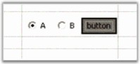

# Control

You can place an arbitrary control in a grid cell through Control cell type. This cell type differs from most other cell types shipped with Essential Grid, which cannot be shared among several cells. Control cell type requires you to instantiate control object for each cell that uses this cell type, and set that object to___style__.__Control_. A different control object is required for every cell that makes use of Control cell type. The following code example illustrates how to set cell type to Control.



//Sets up a Control Cell.

this.radioButton1.Checked = true; 

this.gridControl1.CoveredRanges.Add(GridRangeInfo.Cells(2,2,8,2));

this.gridControl1.ColWidths[2] = 200; 

this.gridControl1[2,2].CellType = "Control"; 

//Sets the control object.

this.gridControl1[2,2].Control = this.dataPanel;




'Sets up a Control Cell.

Me.radioButton1.Checked = True

Me.gridControl1.CoveredRanges.Add(GridRangeInfo.Cells(2, 2, 8, 2))

Me.gridControl1.ColWidths(2) = 200

Me.gridControl1(2, 2).CellType = "Control"

'Sets the control object.

Me.gridControl1(2, 2).Control = Me.dataPanel



The following screenshot shows a panel holding two radio buttons and a push button in the cell.

