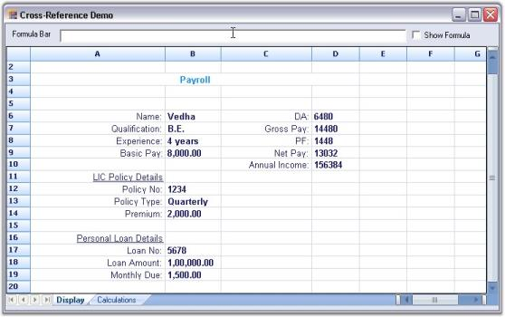

# Cross Sheet Reference

Essential Grid control supports cross sheet references. A formula cell can be defined with values from another grid by using cross sheet references. In this case, multiple grids can either be in worksheet format or multiple grids can be laid out in a form. The following screen shot shows multiple grids in worksheet format.

Figure 249: Multiple Grids in Worksheet Format

The following screen shot shows multiple grids laid out in the form.

Figure 250: Form with Multiple Grids

Example 

The following example implements this feature with two sheets-'Display' and 'Calculations'.

* The 'Display' sheet accepts parameters such as Salary details, Insurance Policy details, Loan details, and then computes the annual income of the given employee. 
* The 'Calculations' sheet computes tax deductions for an insurance policy and personal loan.

This process is explained in the following steps.

Step 1 - Register the grid controls as shown in the following code so that they can be referenced by using a formula.



//Registers grid controls as separate sheets for cross-reference.

int sheetFamilyID = GridFormulaEngine.CreateSheetFamilyID();

GridFormulaEngine.RegisterGridAsSheet("Display", this.gridDisplay.Model, sheetFamilyID);

GridFormulaEngine.RegisterGridAsSheet("Calculate", this.gridCalculations.Model, sheetFamilyID);




'Registers grid as separate sheets for cross-reference.

Dim sheetFamilyID As Integer = GridFormulaEngine.CreateSheetFamilyID()

GridFormulaEngine.RegisterGridAsSheet("Display", Me.gridDisplay.Model, sheetFamilyID)

GridFormulaEngine.RegisterGridAsSheet("Calculate", Me.gridCalculations.Model, sheetFamilyID)


Step 2 - Set values for the Display Grid.



this.gridDisplay[12, 1].Text = "Policy Premium Amount";

this.gridDisplay[12, 2].Text = "2,000";

this.gridDisplay[13, 1].Text = "Personal Loan Monthly Due";

this.gridDisplay[13, 2].Text = "1,500";




Me.gridDisplay(12, 1).Text = "Policy Premium Amount"

Me.gridDisplay(12, 2).Text = "2,000"

Me.gridDisplay(13, 1).Text = "Personal Loan Monthly Due"

Me.gridDisplay(13, 2).Text = "1,500"


Step 3 - Compute the values for the Calculations Grid by using the values in the Display Grid.



//Cross Sheet References.

this.gridCalculations[row, col].CellType = GridCellTypeName.FormulaCell;

this.gridCalculations[row, col].Text = "=Display!B12";

this.gridCalculations[row, col + 1].CellType = GridCellTypeName.FormulaCell;

this.gridCalculations[row, col + 1].Text = "=Display!B13";





'Cross Sheet References.

Me.gridCalculations(row, col).CellType = GridCellTypeName.FormulaCell

Me.gridCalculations(row, col).Text = "=Display!B12"

Me.gridCalculations(row, col + 1).CellType = GridCellTypeName.FormulaCell

Me.gridCalculations(row, col + 1).Text = "=Display!B13"


After computing the values, the Display sheet displays the Annual Income and Calculation sheet displays the Tax Deductions. A sample that demonstrates this feature is available in the followinf sample installation path.

<Install Location>\Syncfusion\EssentialStudio\[Version Number]\Windows\Grid.Windows\Samples\Formula Support\Cross-Reference Demo

