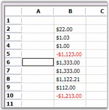

# Currency Edit

CurrencyEdit cell type lets you edit monetary values and display them by using different currency type formats. To achieve this, you must set the CellType property to Currency_._ You can set additional properties such as the decimal and group separator for the cell value. The following code example illustrates how to set the cell type to CurrencyEdit.



GridStyleInfo style = gridControl1[row, 2];

style.CellType = "Currency";

style.Text = "$1.00";

//Sets the clip mode.

style.CurrencyEdit.ClipMode = CurrencyClipModes.IncludeFormatting;

//Sets formatting properties.

style.CurrencyEdit.CurrencyDecimalDigits = 2;

style.CurrencyEdit.CurrencyDecimalSeparator = ".";

style.CurrencyEdit.CurrencyGroupSeparator = ",";

style.CurrencyEdit.CurrencyGroupSizes = new int[] {3};

style.CurrencyEdit.CurrencyNegativePattern = 1;

style.CurrencyEdit.CurrencyNumberDigits = 27;

style.CurrencyEdit.CurrencyPositivePattern = 0;

style.CurrencyEdit.CurrencySymbol = "$";

style.CurrencyEdit.NegativeColor = System.Drawing.Color.Red;

style.CurrencyEdit.NegativeSign = "-";

style.CurrencyEdit.PositiveColor = System.Drawing.Color.Black;

style.FloatCell = true;





Dim style As GridStyleInfo = gridControl1(row, 2)

style.CellType = "Currency"

style.Text = "$1.00"

'Sets the clip mode.

style.CurrencyEdit.ClipMode = CurrencyClipModes.IncludeFormatting

'Sets formatting properties.

style.CurrencyEdit.CurrencyDecimalDigits = 2

style.CurrencyEdit.CurrencyDecimalSeparator = "."

style.CurrencyEdit.CurrencyGroupSeparator = ","

style.CurrencyEdit.CurrencyGroupSizes = New Integer() {3}

style.CurrencyEdit.CurrencyNegativePattern = 1

style.CurrencyEdit.CurrencyNumberDigits = 27

style.CurrencyEdit.CurrencyPositivePattern = 0

style.CurrencyEdit.CurrencySymbol = "$"

style.CurrencyEdit.NegativeColor = System.Drawing.Color.Red

style.CurrencyEdit.NegativeSign = "-"

style.CurrencyEdit.PositiveColor = System.Drawing.Color.Black

style.FloatCell = True



