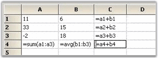

# Formula Support

Setting cell type of a cell to FormulaCell will allow you to enter algebraic expressions using formulas and cell references. Cell references are entries such as A11 for column A row 11 or BA3 for column BA row 3. A formula is a defined calculation from the Formula Library, which is included with Essential Grid. This Formula Library is extensible and lets you to add additional formulas.

## Defining FormulaCell

You can use Formula Cells for every cell in a grid or just for a few cells. Even if you set CellType property to _FormulaCell_ for every cell in a grid, the default behavior is to treat such cells as text box cells, unless you start the cell entry with an equal sign. If the cell value starts with an equal sign, then the cell is considered as a formula cell and its contents are treated as such. To make all cells present in a grid as potential formula cells, you will have to set cell type of standard BaseStyle to FormulaCell by using the following code. 



//Sets up a Formula Cell.

this.gridControl1.BaseStylesMap["Standard"].StyleInfo.CellType = "FormulaCell";




'Sets up a Formula Cell.

Me.gridControl1.BaseStylesMap("Standard").StyleInfo.CellType = "FormulaCell"


## Using the Formula Library

Essential Grid's Formula Library contains mathematical functions that are available in the .NET Framework's System.Math class. In addition, there are Sum and Avg members. You can also add additional functions to this library by using your own code.

In the above screen shot, cell A2 has a formula that uses four different library functions: Sqrt, Pow, Cos, and Sin.

> Note: For a complete list of these library functions, refer to the Class Reference for "GridFormulaEngine".

## Supported Arithmetic Operators and Calculation Precedence

The current formula support will let you enter well-formed parenthetical algebraic expressions with operators and operands. The nine supported operators are shown in the following precedence table with operators on the same level being calculated as encountered when the expression is scanned from left to right. 

Code Tables

Table 31: Code tables

<table>
<tr>
<th>
OPERATIONS</th><th>
SYMBOL</th><th>
CALCULATION PRECEDENCE</th></tr>
<tr>
<td>
Multiplication, Division</td><td>
/  *</td><td>
1st</td></tr>
<tr>
<td>
Addition, Subtraction</td><td>
+  -</td><td>
2nd</td></tr>
<tr>
<td>
Less Than, Greater Than, Equal, Less Than Or Equal, Greater Than Or Equal, Not Equal</td><td>
<  > = <= >= <></td><td>
3rd</td></tr>
</table>

The supported operands include those listed in the following table. An operand by itself is also a well-formed algebraic expression that can serve as an entire formula in a cell.

Table 32: Supported operands

<table>
<tr>
<th>
OPERAND</th><th>
EXAMPLE</th></tr>
<tr>
<td>
number</td><td>
532.1, -10.2, or 18.</td></tr>
<tr>
<td>
cell reference</td><td>
A12, BB1010, or Q18.</td></tr>
<tr>
<td>
library formula with valid arguments</td><td>
Abs(E14), Cos(-3.14), or Sum(A1:A14).</td></tr>
<tr>
<td>
any well formed algebraic expression</td><td>
E1+E2, Cos(2)<A4, or Abs(A1-A5).</td></tr>
</table>
Within a formula cell, case is ignored. So, a1 is the same as A1, and Cos(3) is the same as COS(3).

## Inside Essential Grid's Formula Support

Formula Cell control is implemented with four classes: GridFormulaCellModel, GridFormulaCellRenderer, GridFormulaEngine and GridFormulaTag. GridFormulaCellRenderer class handles a couple of activation issues that are specific to displaying formulas when a formula cell gets activated. GridFormulaCellModel class does some significant work in its GetFormattedText method override where calculations and formula parsing are initiated dynamically as required. 

GridFormulaEngine class does the actual parsing and calculation that is required to evaluate a formula in a cell. This class also maintains Formula Library. The programmer can gain access to an engine object by using GridFormulaCellModel.Engine property. It is this property that will let you add functions to (or remove functions from) the Formula Library. The use of the class is discussed in the next section. 

Finally, GridFormulaTag class is used in conjunction with GridStyleInfo class that has a property of this type. GridFormulaTag tracks computed value of the cell in its Text property.

## Adding Formulas to the Formula Library

Here are the steps that are required to add a function to the Function Library.

1. First, define a method that has this signature.



//Defines a method whose name is the FormulaName.

public string MyLibraryFormulaName(string args)




'Defines a method whose name is the FormulaName.

Public Function MyLibraryFormulaName(ByVal args As String) As String


Here MyLibraryFormulaName must be a name that has not already been used in Function Library and must include only letters and digits. If you want to replace an existing formula with a formula of the same name, first remove the existing formula before adding the new formula. Use GridFormulaEngine.RemoveFunction method to remove a formula.

Then, write an implementation for your method. Here code is used to implement a function that will sum only positive numbers that are passed in as either a range like A1:A5 and/or a list such as A1, A4, A10. The code uses the FormulaEngine helper method to extract these values from the cells. The GetCellsFromArgs method will return an array of cells from a range such as A1:A5, and GetValueFromArg method will take cells such as A3 and return a value such as 123.3. 



//Implements your method.

public string ComputeSumPosNums(string args)

{

    GridFormulaCellModel model = this.gridControl1.CellModels["FormulaCell"] as GridFormulaCellModel;

    if(model != null)

    {

        GridFormulaEngine engine = model.Engine;

        double sum = 0d;

        double d;

        string s1;

//Loops through arguments and sum up the positive values.

        foreach(string r in args.Split(new char[]{','}))

        {

//Cell Range.

            if(r.IndexOf(':') > -1) 

            {

                foreach(string s in engine.GetCellsFromArgs(r))

                {

// s is a cell line a21 or c3...

                try

                    {

                        s1 = engine.GetValueFromArg(s);

                    }

                    catch(Exception ex)

                    {

                        return ex.Message;

                    }

                    if(s1 != "")

                    {

//Adds only if positive.

                        if(double.TryParse(s1, NumberStyles.Number, null, out d)

                                    && d > 0)

                        {

                            sum += d; 

                        }

                    }

                }

            }

            else

            {

                try

                {

                    s1 = engine.GetValueFromArg(r);

                }

                catch(Exception ex)

                {

                    return ex.Message;

                }

                if(s1 != "")

                {

                    if(double.TryParse(s1, NumberStyles.Number, null, out d) && d > 0)

                    {

                        sum += d; 

                    }

                }

            }

        }        

        return sum.ToString();

    }

    return "";

}




'Implements your Method.

Public Function ComputeSumPosNums(args As String) As String

Dim model As GridFormulaCellModel = Me.gridControl1.CellModels("FormulaCell")

If Not (model Is Nothing) Then

Dim engine As GridFormulaEngine = model.Engine

Dim sum As Double = 0.0

Dim d As Double

Dim s1 As String

'Loops through arguments and sum up the positive values.

Dim r As String

For Each r In args.Split(New Char() {","c})

'Cell Range.

If r.IndexOf(":"c) > -1 Then

Dim s As String

For Each s In engine.GetCellsFromArgs(r)

's is a cell line a21 or c3...

Try

s1 = engine.GetValueFromArg(s)

Catch ex As Exception

Return ex.Message

End Try

If s1 <> "" Then

'Adds only if positive.

If Double.TryParse(s1, NumberStyles.Number, Nothing, d) And d > 0 Then

sum += d

End If

End If

Next s

Else

Try

s1 = engine.GetValueFromArg(r)

Catch ex As Exception

Return ex.Message

End Try

If s1 <> "" Then

If Double.TryParse(s1, NumberStyles.Number, Nothing, d) And d > 0 Then

sum += d

End If

End If

End If

Next r

Return sum.ToString()

End If

Return ""

End Function



The last step is to actually add your formula to the library. You should do this after the grid has been created, say in a Form.Load event handler. 



GridFormulaCellModel cellModel = this.gridControl1.CellModels["FormulaCell"] as GridFormulaCellModel;

//Adds a formula named SumPosNums to the Library.

cellModel.Engine.AddFunction("SumPosNums", new GridFormulaEngine.LibraryFunction(ComputeSumPosNums));





Dim cellModel As GridFormulaCellModel = Me.gridControl1.CellModels("FormulaCell")

'Adds a formula named SumPosNums to the Library.

cellModel.Engine.AddFunction("SumPosNums", New GridFormulaEngine.LibraryFunction(AddressOf ComputeSumPosNums))


