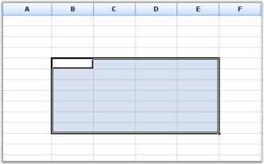
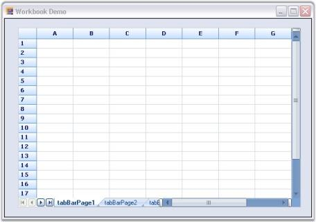

# MS Excel-like Features

Essential Grid offers a wide range of MS Excel-like features. Following is the list of features offered:

## Selection Frame

Essential Grid supports MS Excel-like Selection Frame feature. This enables the selected cells in a frame to be highlighted. This feature can be enabled by setting ExcelLikeSelectionFrame property to _true_. Selection Frame feature can be enabled for Essential Grid by using the following code:



this.gridControl1.ExcelLikeSelectionFrame = true;





Me.gridControl1.ExcelLikeSelectionFrame = True



## Current Cell

Essential Grid supports MS-Excel like Current Cell feature. This feature can be enabled by setting ExcelLikeCurrentCell property to _true_. When the user moves the current cell out of a selected range, the range will be cleared. If the user moves the current cell inside a selected range, the range will stay. Current Cell feature can be enabled for Essential Grid by using the following code:



this.gridControl1.ExcelLikeCurrentCell = true;




Me.gridControl1.ExcelLikeCurrentCell = True


## Workbook

Worksheets in a workbook can be displayed as tabs for easier view and selection of worksheets similar to Excel. This is achieved by using the Tab Bar Splitter control. You can add any number of Tab Bar pages to Tab Bar Splitter control and then add the Grid control to each Tab Bar page to get the appearance similar to the Workbook in Excel.



this.tabBarSplitterControl1.Controls.Add(this.tabBarPage1);

this.tabBarSplitterControl1.Controls.Add(this.tabBarPage2);

this.tabBarSplitterControl1.Controls.Add(this.tabBarPage3);

//Adds Grid controls to the Tab Bar Pages.

this.tabBarPage1.Controls.Add(this.gridControl1);

this.tabBarPage2.Controls.Add(this.gridControl2);

this.tabBarPage3.Controls.Add(this.gridControl3);





Me.tabBarSplitterControl1.Controls.Add(Me.tabBarPage1)

Me.tabBarSplitterControl1.Controls.Add(Me.tabBarPage2)

Me.tabBarSplitterControl1.Controls.Add(Me.tabBarPage3)

' Adds Grid controls to the Tab Bar Pages.

Me.tabBarPage1.Controls.Add(Me.gridControl1)

Me.tabBarPage2.Controls.Add(Me.gridControl2)

Me.tabBarPage3.Controls.Add(Me.gridControl3)


## Splitter

A dynamic-splitter window can be embedded in Essential Grid to show multiple views of the same grid by using a Splitter. This MS Excel-like feature enables you to view more than one copy of a worksheet and scroll through each pane of worksheet independently. The panes work simultaneously, i.e., the changes made in one pane are reflected in the other. The splitter can be scrolled by placing the mouse pointer over it, holding down the left mouse button and dragging it to the required position. It can be split horizontally and vertically. Following are the events associated with the Splitter control.

Table 28: Events associated with the Splitter control

<table>
<tr>
<th>
EVENTS</th><th>
DESCRIPTION</th></tr>
<tr>
<td>
PaneCreated</td><td>
This event is triggered when the splitter is moved across the Grid.</td></tr>
<tr>
<td>
PaneClosing</td><td>
This event is either triggered when the splitter is moved to the end/beginning or when it cannot be located on the worksheet.</td></tr>
</table>

The splitter can be created in a worksheet by using the following code:



this.splitterControl1.Controls.Add(this.gridControl1);

//PaneCreated event.

private void splitterControl1_PaneCreated(object sender, Syncfusion.Windows.Forms.SplitterPaneEventArgs e)

{

Console.WriteLine("Created: " + e.ToString());

}

//PaneClosing event.

private void splitterControl1_PaneClosing(object sender, Syncfusion.Windows.Forms.SplitterPaneEventArgs e)

{

Console.WriteLine("Closed: " + e.ToString());

}





Me.splitterControl1.Controls.Add(Me.gridControl1)

'PaneCreated event.

private void splitterControl1_PaneCreated(Object sender, Syncfusion.Windows.Forms.SplitterPaneEventArgs e)

Console.WriteLine("Created: " & e.ToString())

'PaneClosing event.

private void splitterControl1_PaneClosing(Object sender, Syncfusion.Windows.Forms.SplitterPaneEventArgs e)

Console.WriteLine("Closed: " & e.ToString())



## Freeze Pane

Essential Grid supports MS Excel-like Freeze Pane feature. In a large worksheet, it is often required that column or row labels remain in view. This feature enables you to freeze either columns or rows in the Grid, so that they may remain visible while you scroll. The number of rows to be frozen can be specified by using Model.Rows.FrozenCount property and the number of columns to be frozen can be specified by using Model.Cols.FrozenCount property. The Freeze Pane feature can be enabled for Essential Grid by using the following code:



this.gridControl1.Model.Rows.FrozenCount = 4;

this.gridControl1.Model.Cols.FrozenCount = 3;





Me.gridControl1.Model.Rows.FrozenCount = 4

Me.gridControl1.Model.Cols.FrozenCount = 3


> Note: You can unfreeze the frozen rows or columns by clicking Unfreeze Current Row/Col button on the UI.

## MultiLevel Undo and Redo

Essential Grid has flexible support for Multilevel Undo/Redo. This feature enables the user to undo history for most actions that are performed. This feature can be enabled by setting CommandStack.Enabled property to _true_. Using the functions of GridModelCommandManager class, various tasks like undo and redo can be done. You can access this class from a Grid with CommandStack property of a GridModel instance. Multilevel Undo/Redo feature can be enabled for Essential Grid by using the following code:



this.gridControl1.CommandStack.Enabled = true;

this.gridControl1.CommandStack.Undo();

this.gridControl1.CommandStack.Redo();





Me.gridControl1.CommandStack.Enabled = True

Me.gridControl1.CommandStack.Undo()

Me.gridControl1.CommandStack.Redo()


