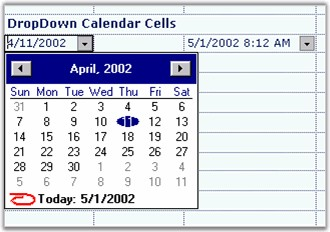

# Month Calendar

MonthCalendar cell type lets you pick dates. To make use of this cell type in grid, set CellType property to _MonthCalendar_ and CellValue property to _DateTime_ object. The following code example illustrates how to set the cell type to MonthCalendar.



//Sets Cell Type.

gridControl1[rowIndex, colIndex].CellType = "MonthCalendar";

//Assigns initial value.

gridControl1[rowIndex, colIndex].CellValue = DateTime.Now;





'Sets Cell Type.

gridControl1(rowIndex, colIndex).CellType = "MonthCalendar"

'Assigns initial value.

gridControl1(rowIndex, colIndex).CellValue = DateTime.Now



 

