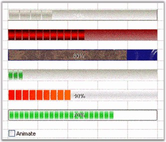

## Progress Bar

There are several formatting options that can be applied to an ProgressBar cell type embedded into the grid control. The following code example illustrates this.



//Sets up a Progress Bar Control.

GridStyleInfo style3 = gridControl1[12, 2];

GridProgressBarInfo progressBarEx3 = style3.ProgressBar;

style3.CellType = "ProgressBar";

style3.Themed = false;

//Applies Styles.

progressBarEx3.BackGradientEndColor = System.Drawing.Color.RosyBrown;

progressBarEx3.BackGradientStartColor = System.Drawing.Color.DarkRed;

progressBarEx3.BackgroundStyle = Syncfusion.Windows.Forms.Tools.ProgressBarBackgroundStyles.VerticalGradient; 

progressBarEx3.BackMultipleColors = new System.Drawing.Color[0];

progressBarEx3.BackSegments = false;

progressBarEx3.BackTubeEndColor = System.Drawing.SystemColors.Control;

progressBarEx3.BackTubeStartColor = System.Drawing.Color.LightGray;

progressBarEx3.FontColor = System.Drawing.Color.Lime;

progressBarEx3.ForegroundImage = null;

progressBarEx3.GradientEndColor = System.Drawing.Color.Lime;

progressBarEx3.GradientStartColor = System.Drawing.Color.Red;

progressBarEx3.MultipleColors = new System.Drawing.Color[] 

{ 

System.Drawing.SystemColors.ControlDarkDark,

System.Drawing.SystemColors.ControlLight,

System.Drawing.SystemColors.ControlDark,

System.Drawing.SystemColors.Control

};

progressBarEx3.ProgressStyle = Syncfusion.Windows.Forms.Tools.ProgressBarStyles.Tube;

progressBarEx3.SegmentWidth = 12;

progressBarEx3.TextVisible = false;

progressBarEx3.TubeEndColor = System.Drawing.Color.Black;

progressBarEx3.TubeStartColor = System.Drawing.Color.Red;

progressBarEx3.ProgressValue = 75;





'Sets up a Progress Bar Control.

Dim style3 As GridStyleInfo = gridControl1(12, 2)

Dim progressBarEx3 As GridProgressBarInfo = style3.ProgressBar

style3.CellType = "ProgressBar"

style3.Themed = False

'Applies Styles.

progressBarEx3.BackGradientEndColor = System.Drawing.Color.RosyBrown

progressBarEx3.BackGradientStartColor = System.Drawing.Color.DarkRed

progressBarEx3.BackgroundStyle = Syncfusion.Windows.Forms.Tools.ProgressBarBackgroundStyles.VerticalGradient

progressBarEx3.BackMultipleColors = New System.Drawing.Color(0) {}

progressBarEx3.BackSegments = False

progressBarEx3.BackTubeEndColor = System.Drawing.SystemColors.Control

progressBarEx3.BackTubeStartColor = System.Drawing.Color.LightGray

progressBarEx3.FontColor = System.Drawing.Color.Lime

progressBarEx3.ForegroundImage = Nothing

progressBarEx3.GradientEndColor = System.Drawing.Color.Lime

progressBarEx3.GradientStartColor = System.Drawing.Color.Red

progressBarEx3.MultipleColors = New System.Drawing.Color() { _System.Drawing.SystemColors.ControlDarkDark, _

System.Drawing.SystemColors.ControlLight,_System.Drawing.SystemColors.ControlDark, _System.Drawing.SystemColors.Control}

progressBarEx3.ProgressStyle = Syncfusion.Windows.Forms.Tools.ProgressBarStyles.Tube

progressBarEx3.SegmentWidth = 12

progressBarEx3.TextVisible = False

progressBarEx3.TubeEndColor = System.Drawing.Color.Black

progressBarEx3.TubeStartColor = System.Drawing.Color.Red

progressBarEx3.ProgressValue = 75 



  

For other code samples, refer to the samples in the following location: 
         <Install Location>\Syncfusion\EssentialStudio\[Version Number]\Windows\Grid.Windows\Samples\Cell Types\Content Cell Demo
