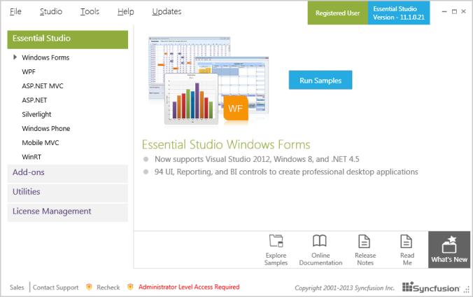
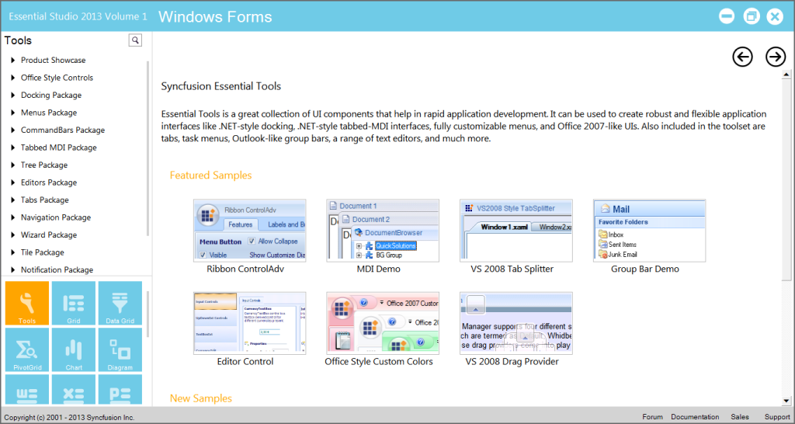
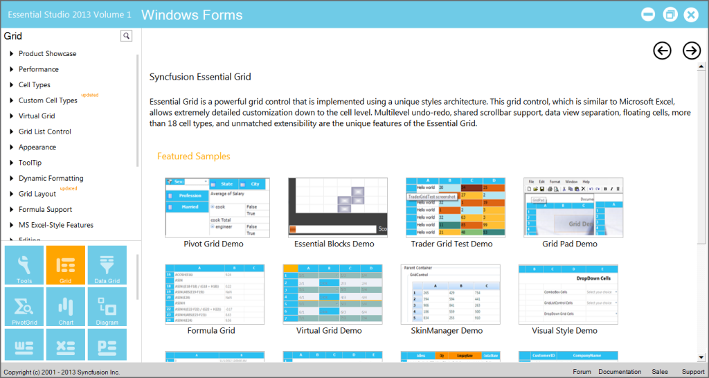
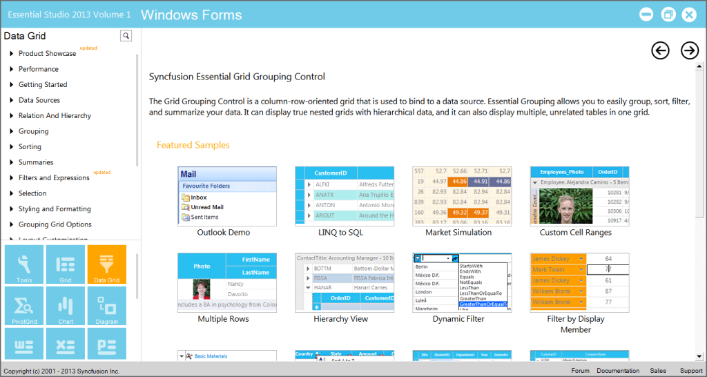
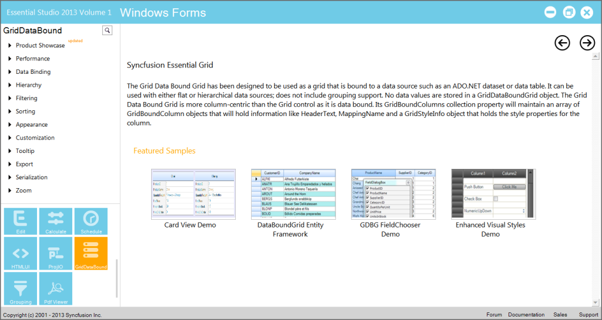

# Installation and Deployment

This section covers information on the install location, samples, licensing, patches update, and updating recent version of Essential Studio. It comprises the following subsections:

## Installation

For step-by-step installation procedure of Essential Studio, refer to the Installation topic under Installation and Deployment in the Common UG. For licensing, patches, and information on adding or removing selective components, refer the following topics in Common UG under Installation and Deployment.

* Licensing
* Patches
* Add/Remove Components

## Sample and Location

This section covers the location of installed samples, the procedure to run the samples through sample browser and also lists the location of source code.

### Sample Installation Location

Grid Windows Forms samples are installed at the following location locally on the disk:

_<Install Location>\Syncfusion\EssentialStudio\[Version Number]\Windows\Grid.Windows\Samples\_

Grid Grouping Windows Forms samples are installed at the following location locally on the disk:

_<Install Location>\Syncfusion\EssentialStudio\[Version Number]\Windows\Grid.Grouping.Windows\Samples\_

GridDataBound control’ssamples are installed at the following location locally on the disk:

_<Install Location>\Syncfusion\EssentialStudio\[Version Number]\Windows\GridDataBound.Windows\Samples\_

### Viewing Samples

To view the samples, follow the steps below:

1. Click Start > All Programs > Syncfusion > Essential Studio <version number> > Dashboard.

2. In the Dashboard window, click Run Samples for Windows Forms under UI Edition. The UI Windows Form Sample Browser window is displayed.
> Note: You can view the samples in any of the following three ways:

* Run Samples - Click to view the locally installed samples.
* Online Samples - Click to view online samples.
* Explore Samples - Explore BI Web samples on disk.

3. To view Grid samples, click Grid at the bottom-left pane.

4. To view Grid grouping samples, click Data Grid at the bottom-left pane.

5. To view Grid data bound samples, click GridDataBound from the bottom-left pane.

6. Select any sample and browse through the features.

### Source Code Location

The default location of the Grid Windows source code is:

_[System Drive]:\Program Files\Syncfusion\Essential Studio\[Version Number]\Windows\Grid.Windows\Src_

The default location of the Grid Grouping Windows source code is:

_[System Drive]:\Program Files\Syncfusion\Essential Studio\[Version Number]\Windows\Grid.Grouping.Windows\Src_

### Deployment Requirements

#### Toolbox Entries

Essential Grid places six controls into your Visual Studio .NET toolbox from where you can drag any of these controls onto a form and start working with them.

* Grid Control
* Grid Data Bound Grid
* Grid Grouping Control
* Grid List Control
* Grid Record Navigation Control
* Grid Aware Text Box

For details, see List of Controls.

#### DLLs List

While deploying an application that references a Syncfusion Essential Grid assembly, the following dependencies also need to be included in the distribution.

Syncfusion.Grid.Base.dll

* Syncfusion.Core.dll
* Syncfusion.Shared.Base.dll

Syncfusion.Grid.Windows.dll

* Syncfusion.Core.dll
* Syncfusion.Grid.Base.dll
* Syncfusion.Shared.Base.dll
* Syncfusion.Shared.Windows.dll

Syncfusion.Grid.Grouping.Base.dll

* Syncfusion.Core.dll
* Syncfusion.Shared.Base.dll

Syncfusion.Grid.Grouping.Windows.dll

* Syncfusion.Core.dll
* Syncfusion.Grid.Grouping.Base.dll
* Syncfusion.Grid.Base.dll
* Syncfusion.Grid.Windows.dll
* Syncfusion.Grouping.Base.dll
* Syncfusion.Grouping.Windows.dll
* Syncfusion.Shared.Base.dll
* Syncfusion.Shared.Windows.dll

Syncfusion.Grouping.Base.dll

* Syncfusion.Core.dll
* Syncfusion.Shared.Base.dll

Syncfusion.Grouping.Windows.dll

* Syncfusion.Core.dll
* Syncfusion.Grouping.Base.dll
* Syncfusion.Shared.Base.dll
* Syncfusion.Shared.Windows.
