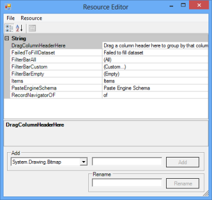

# Localization Support

Localization support allows you to set the content according to the language or culture of a specific country or region. Essential Grid provides localization support for all controls.

## Use Case Scenarios

With this feature, you can localize the options in the grid to display the content according to the language or culture of a specific country or region.

### Sample Link

To open sample project, navigate to the following sample location in your system:

    <Install Location>\Syncfusion\EssentialStudio\[Version Number]\Windows\Grid.Grouping.Windows\Samples\Localization Samples\Localization Demo

### Adding Localization Support to Grid Controls

To localize the content, create a class file and add ILocalizationProvider__interface to the class. Assign the required content to be displayed to DynamicFilterResourceIdentifiers_,_GroupingResourceIdentifiers_,_ and__GridResourceIdentifiers of GetLocalizedString method as illustrated in the following code.


   public string GetLocalizedString(System.Globalization.CultureInfo culture, string name,object obj)

        {

            switch (name)

            {

                case DynamicFilterResourceIdentifiers.StartsWith:

                    if (comparerList)

                        return "empieza con";

                    else

                        return "StartsWith";                

                case GroupingResourceIdentifiers.RecordNavigatorOF:

                    if (recordNavigBar)

                        return "von";

                    else

                        return "Of";

//Drag group column.

                case GroupingResourceIdentifiers.DragColumnHeaderHereText:

                    return "Ziehen Sie die Spaltenüberschrift";

                case DynamicFilterResourceIdentifiers.SortAtoZ:

                    if (office2007Filter)

                        return "&SortierenAbisZ";

                    else

                        return "&SortAtoZ";

                default:

                    return string.Empty;

            }

        }




Public Function GetLocalizedString(ByVal culture As System.Globalization.CultureInfo, ByVal name As String, ByVal obj As Object) As String Implements ILocalizationProvider.GetLocalizedString

#### Select Case name

Case DynamicFilterResourceIdentifiers.StartsWith

If comparerList Then

Return "empieza con"

Else

Return "StartsWith"

End If

Case GroupingResourceIdentifiers.RecordNavigatorOF

If recordNavigBar Then

Return "von"

Else

Return "Of"

End If

Case DynamicFilterResourceIdentifiers.SortAtoZ

If office2007Filter Then

Return "&SortierenAbisZ"

Else

Return "&SortAtoZ"

End If

Case Else

Return String.Empty

End Select

End Function



Add the following table items to the above code example by substituting the identifiers and Enum values as in they correspond in the table.

<table>
<tr>
<td rowspan = "10">
DynamicFilterResourceIdentifiers</td><th colspan = "3">
ENUM</th></tr>
<tr>
<td>
StartsWith</td><td>
CustomAutoFilterGreaterthan</td><td>
Office2007FilterOK</td></tr>
<tr>
<td>
EndsWith</td><td>
SelectAll</td><td>
Office2007FilterCancel</td></tr>
<tr>
<td>
Equals</td><td>
SortAtoZ</td><td>
CustomAutoFilter</td></tr>
<tr>
<td>
GreaterThan</td><td>
SortZtoA</td><td>
CustomAutoFilterLessthan</td></tr>
<tr>
<td>
GreaterThanOrEqualTo</td><td>
ClearFilterFrom</td><td>
Office2007FilterEquals</td></tr>
<tr>
<td>
LessThan</td><td>
All</td><td>
CustomAutoFilterEqual</td></tr>
<tr>
<td>
LessThanOrEqualTo</td><td>
Custom</td><td>
CustomAutoFilterNotequal</td></tr>
<tr>
<td>
Like</td><td>
Empty</td><td>
FieldDialogBox</td></tr>
<tr>
<td>
Match</td><td>
ExpressionMATCH</td><td>
NotEquals</td></tr>
<tr>
<td colspan = "2">
ResourceIdentifiers</td><td colspan = "2">
OK</td></tr>
<tr>
<td colspan = "2">
GridResourceIdentifiers</td><td colspan = "2">
Cannotchangepartofamergedcell</td></tr>
</table>

This will generate the following output.

## Localization Support for ComboBox Cell

Localization support allows you to set the content in a ComboBox cell according to the language or culture of a specific country or region. You can localize the content in the ComboBox cell using the ConvertToString method of Status class.

## Use Case Scenarios

With this feature, you can localize the options in the ComboBox cell to display the content according to the language or culture of a specific country or region.

### Sample Link

To get DataGrid samples from the dashboard:

1. Open Syncfusion Dashboard.
1. Select UI > Windows Forms.
2. Click Run Samples.
3. Select Data Grid.
4. Expand Localization samples in the left panel of sample browser and click ComboBoxCellLocalization Demo.

## Adding Localization Support to ComboBox Cell 

The following code example illustrates how to add localization support to ComboBox cell using ConvertToString method of Status class.



public object ConvertToString(ITypeDescriptorContext context, System.Globalization.CultureInfo culture, object value)

        {

            switch ((Status)value)

            {case Status.Divorced:

                    return "geschieden";

                case Status.Married:

                    return "verheiratet";

                case Status.Single:

                    return "Einzel";

                case Status.Widow:

                    return "Witwe";

                default:

                    return string.Empty;

            }}




Private Overloads Function ConvertFromString(ByVal context As ITypeDescriptorContext, ByVal culture As System.Globalization.CultureInfo, ByVal value As Object) As Object

Select Case CStr(value)

Case "geschieden"

Return Status.Divorced

Case "verheiratet"

Return Status.Married

Case "Einzel"

Return Status.Single

Case "Witwe"

Return Status.Widow

Case Else

Return Nothing

End Select

End Function



## Localization By Using Satellite Assemblies

A Satellite Assembly is a compiled library that contains resources that can be localized. You can use satellite assemblies to create a multilingual application. You can design and deploy your solution to multiple cultures, rather than using hard coding strings into your main application. Satellite assemblies are auto generated, and do not contain any code. Hence, they cannot be executed as the main assembly. Localization processes can be performed by using Satellite Assemblies without recompiling the main assembly. Localization can be applied to Grid, Grid Grouping, and Pivot Grid controls by using Satellite Assemblies. 

### Creating a Satellite Assembly

The following components are required for creating a Satellite Assembly:

1. A text file, which holds different strings that has to be localized.
2. A resource file, which is created by using the Text file. The resource file has the “.Resources” extension.

The following steps illustrate creating a Satellite Assembly:

1. Open Visual Studio Command Prompt with Administrator privileges.
2. Enter the following command for creating resource file from the text file:

   Resgen Text_file.txt  Resource_File.resources

    

3. You can modify the resource file according to your requirements by using the Resorce Editor.

   

4. Create the satellite assembly from the resource file by using the following command:

   al /t:lib /culture:de-DE /out:<Location>\Syncfusion.GridHelperClasses.Windows.resources.dll /v:1.1.0.0 /delay+ /keyf:<Location>:\\sf.publicsnk /embed:<Location>\Syncfusion. GridHelperClasses.Windows.Localization.SR.de-DE.Resources  

5. After creating the satellite assembly, you must have the assembly signed to access the resources in the assembly. The signing operation is done by using the following code:

   Sn –Vr <Location of Satellite dll>\Syncfusion.GridHelperClasses.Windows.resources.dll

6. Finally, the satellite assembly created is placed in a folder at the following path:

   &lt;Location of Program&gt;\bin\debug\de-DE (German Culture)

   N> The name of the subfolder in Debug folder differs based on the culture of the application. For example, fr-FR is used for the French Culture, and so on.

   
Similarly, you can create satellite assemblies for resource files of Windows Grid, Grid Grouping, and Pivot Grid controls. You can find the resource files for Windows Grid, Grid Grouping, and Pivot Grid controls at the following paths respectively:

* Grid

    <Installed Location>\Syncfusion\EssentialStudio\<Version>\Windows\Grid.Windows\Samples\

    Localization Samples\Localization Demo\CS\Resources\SR.resources

* Grid Grouping

    <Installed Location>\Syncfusion\EssentialStudio\<Version>\Windows\Grid.Grouping.Windows\

    Samples\Localization Samples\Localization Demo\CS\Resources\SR.resources

* Pivot Grid

_<Installed Location>\Syncfusion\EssentialStudio\<Version>\Windows\PivotGrid.Windows\_

_Samples\Localization\ Localization using Satellite Assemblies\CS\Resources\SR.resources_

