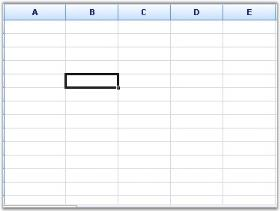
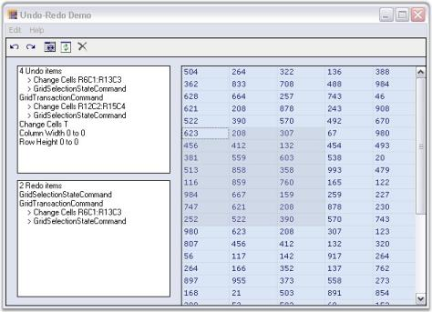

# MS Excel-like Features

Essential Grid offers a wide range of MS Excel-like features. Following is the list of features offered:

## Selection Frame

Essential Grid supports MS Excel-like Selection Frame feature. This enables the selected cells in a frame to be highlighted. This feature can be enabled by setting ExcelLikeSelectionFrame property to _true_. Selection Frame feature can be enabled for Essential Grid by using the following code:


this.gridControl1.ExcelLikeSelectionFrame = true;





Me.gridControl1.ExcelLikeSelectionFrame = True



 

## Current Cell

Essential Grid supports MS-Excel like Current Cell feature. This feature can be enabled by setting ExcelLikeCurrentCell property to _true_. When the user moves the current cell out of a selected range, the range will be cleared. If the user moves the current cell inside a selected range, the range will stay. Current Cell feature can be enabled for Essential Grid by using the following code:



this.gridControl1.ExcelLikeCurrentCell = true;




Me.gridControl1.ExcelLikeCurrentCell = True



## Workbook

Worksheets in a workbook can be displayed as tabs for easier view and selection of worksheets similar to Excel. This is achieved by using the Tab Bar Splitter control. You can add any number of Tab Bar pages to Tab Bar Splitter control and then add the Grid control to each Tab Bar page to get the appearance similar to the Workbook in Excel.



this.tabBarSplitterControl1.Controls.Add(this.tabBarPage1);

this.tabBarSplitterControl1.Controls.Add(this.tabBarPage2);

this.tabBarSplitterControl1.Controls.Add(this.tabBarPage3);

//Adds Grid controls to the Tab Bar Pages.

this.tabBarPage1.Controls.Add(this.gridControl1);

this.tabBarPage2.Controls.Add(this.gridControl2);

this.tabBarPage3.Controls.Add(this.gridControl3);




Me.tabBarSplitterControl1.Controls.Add(Me.tabBarPage1)

Me.tabBarSplitterControl1.Controls.Add(Me.tabBarPage2)

Me.tabBarSplitterControl1.Controls.Add(Me.tabBarPage3)

' Adds Grid controls to the Tab Bar Pages.

Me.tabBarPage1.Controls.Add(Me.gridControl1)

Me.tabBarPage2.Controls.Add(Me.gridControl2)

Me.tabBarPage3.Controls.Add(Me.gridControl3)


 

## Splitter

A dynamic-splitter window can be embedded in Essential Grid to show multiple views of the same grid by using a Splitter. This MS Excel-like feature enables you to view more than one copy of a worksheet and scroll through each pane of worksheet independently. The panes work simultaneously, i.e., the changes made in one pane are reflected in the other. The splitter can be scrolled by placing the mouse pointer over it, holding down the left mouse button and dragging it to the required position. It can be split horizontally and vertically. Following are the events associated with the Splitter control.

<table>
<tr>
<th>
EVENTS</th><th>
DESCRIPTION</th></tr>
<tr>
<td>
PaneCreated</td><td>
This event is triggered when the splitter is moved across the Grid.</td></tr>
<tr>
<td>
PaneClosing</td><td>
This event is either triggered when the splitter is moved to the end/beginning or when it cannot be located on the worksheet.</td></tr>
</table>
The splitter can be created in a worksheet by using the following code:



this.splitterControl1.Controls.Add(this.gridControl1);

//PaneCreated event.

private void splitterControl1_PaneCreated(object sender, Syncfusion.Windows.Forms.SplitterPaneEventArgs e)

{

Console.WriteLine("Created: " + e.ToString());

}

//PaneClosing event.

private void splitterControl1_PaneClosing(object sender, Syncfusion.Windows.Forms.SplitterPaneEventArgs e)

{

Console.WriteLine("Closed: " + e.ToString());

}




Me.splitterControl1.Controls.Add(Me.gridControl1)

'PaneCreated event.

private void splitterControl1_PaneCreated(Object sender, Syncfusion.Windows.Forms.SplitterPaneEventArgs e)

Console.WriteLine("Created: " & e.ToString())

'PaneClosing event.

private void splitterControl1_PaneClosing(Object sender, Syncfusion.Windows.Forms.SplitterPaneEventArgs e)

Console.WriteLine("Closed: " & e.ToString())



 

## Freeze Pane

Essential Grid supports MS Excel-like Freeze Pane feature. In a large worksheet, it is often required that column or row labels remain in view. This feature enables you to freeze either columns or rows in the Grid, so that they may remain visible while you scroll. The number of rows to be frozen can be specified by using Model.Rows.FrozenCount property and the number of columns to be frozen can be specified by using Model.Cols.FrozenCount property. The Freeze Pane feature can be enabled for Essential Grid by using the following code:



this.gridControl1.Model.Rows.FrozenCount = 4;

this.gridControl1.Model.Cols.FrozenCount = 3;




Me.gridControl1.Model.Rows.FrozenCount = 4

Me.gridControl1.Model.Cols.FrozenCount = 3


N> You can unfreeze the frozen rows or columns by clicking Unfreeze Current Row/Col button on the UI.

 

## MultiLevel Undo and Redo

Essential Grid has flexible support for Multilevel Undo/Redo. This feature enables the user to undo history for most actions that are performed. This feature can be enabled by setting CommandStack.Enabled property to _true_. Using the functions of GridModelCommandManager class, various tasks like undo and redo can be done. You can access this class from a Grid with CommandStack property of a GridModel instance. Multilevel Undo/Redo feature can be enabled for Essential Grid by using the following code:



this.gridControl1.CommandStack.Enabled = true;

this.gridControl1.CommandStack.Undo();

this.gridControl1.CommandStack.Redo();




Me.gridControl1.CommandStack.Enabled = True

Me.gridControl1.CommandStack.Undo()

Me.gridControl1.CommandStack.Redo()



 

## Find and Replace

Find and Replace feature enables you to search and replace the required element present in Grid/Worksheet. You can implement the fastest Find and Replace functionality with Grid controls by using GridFindReplaceDialogSink and GridFindReplaceEventArgs classes. GridFindReplaceDialogSink class provides methods that are necessary to perform a Find and Replace operation. GridFindReplaceEventArgs class provides information about Find and Replace dialog box.

The value entered in the Search For field is highlighted in the worksheet after search action is performed. You can switch over to each highlighted text by clicking Find Next button. This functionality is available only when there is more than one search result.

### Search and Replace Options

The search and replace actions:

* Can be performed independently or simultaneously.
* Can be done for individual search or for the entire worksheet by using the Find Next/Replace buttons.
* Can be done for all the search results by clicking Find All/Replace All buttons.

### Search Options

The search options are as follows:

* Match Case-Matches case while performing search.
* Match Whole Cell-Matches the search text with the entire text in a grid cell.
* Search Up-Specifies if the search can be performed bottom-up.
* Column Only-Searches only the current column.
* Selection Only-Searches only the current selection.
* Whole Table-Searches the whole table.

The Find and Replace feature can be enabled for Essential Grid by using the following code:



GridFindTextOptions options = GridFindTextOptions.WholeTable | GridFindTextOptions.SearchUp;

object locInfo = GridRangeInfo.Table();

GridFindReplaceEventArgs frEvents = new GridFindReplaceEventArgs(cmbSearch.Text, "", options, locInfo);

GridFindReplaceDialogSink frDialog.Find(frEvents);




Private options As GridFindTextOptions = GridFindTextOptions.WholeTable Or GridFindTextOptions.SearchUp

Private locInfo As Object = GridRangeInfo.Table()

Private frEvents As New GridFindReplaceEventArgs(cmbSearch.Text, "", options, locInfo)

GridFindReplaceDialogSink(frDialog.Find(frEvents))


 

## Highlighting Search Text

Grid control supports highlighting all or part of the search text in a cell. GridHighlightSearchText class is used to define search text for highlighting. This class exposes WireGrid method, which is used for passing Grid control. With HighLightText and HighlightColor properties, you can specify search text to be highlighted and the color for highlighting the search text. By default, the highlight color is _yellow_. The highlight color for the search text is optional.



//Creates an object for the class “GridHighlightSearchText”.

GridHighlightSearchText highlighttext = new GridHighlightSearchText();

//Wires the grid to the object.

highlighttext.WireGrid(this.gridControl1);

//Assigns the text that needs to be highlighted.

highlighttext.HighlightText = cmbSearch.Text;

//Assigns the color (optional).

highlighttext.HighlightColor = Color.Yellow;




'Creates an object for the class “GridHighlightSearchText”.

Private highlighttext As New GridHighlightSearchText()

'Wires the grid to the object.

highlighttext.WireGrid(Me.gridControl1)

'Assigns the text that needs to be highlighted.

highlighttext.HighlightText = cmbSearch.Text

'Assigns the color (optional).

highlighttext.HighlightColor = Color.Yellow



To view a sample on Highlighting Search Text, see _<Installed Location>\Syncfusion\EssentialStudio_

_\<Version>\Windows\Grid.Windows\Samples\Editing \Find-Replace Demo_

## Unhide Column by Double-Clicking Disabled

Essential Grid has changed the unhide column operation to emulate the behavior found in Microsoft Excel. Previously, hidden columns could be shown by double-clicking a row. This behavior has been disabled so that applications created using Essential Grid will be similar to the hide/unhide behavior found in Microsoft Excel.

<table>
<tr>
<th>
PROPERTY</th><th>
DESCRIPTION</th><th>
TYPE</th><th>
DATA TYPE</th><th>
REFERENCE LINKS</th></tr>
<tr>
<td>
UnHideColsOnDblClick</td><td>
Indicates whether to unhide the hidden columns when the row is double clicked. </td><td>
Property </td><td>
Boolean </td><td>
N/A.</td></tr>
</table>

### Disabling Unhide Column by Double-Clicking 

To disable unhide column by double- clicking, set the UnHideColsOnDblClick property to true. By default this is set to true. 


//Disables unhide column when double clicking as found in Excel.

            this.gridControl1.UnHideColsOnDblClick = true;




'Disables unhide column when double clicking as found in Excel.

            Me.gridControl1.UnHideColsOnDblClick = True


## ighlighting Row and Column Headers

This feature is used to highlight the corresponding row and column headers of one or more cells that you selected. Using the MarkRowHeader and MarkColHeader properties, you can enable highlighting the row and column headers of the selected cells.

<table>
<tr>
<th>
PROPERTY </th><th>
DESCRIPTION </th><th>
DATA TYPE </th></tr>
<tr>
<td>
MarkRowHeader</td><td>
It is used to highlight row headers of the selected cells.</td><td>
Boolean</td></tr>
<tr>
<td>
MarkColHeader</td><td>
It is used to highlight the column headers of the selected cells.</td><td>
Boolean</td></tr>
</table>
By default, MarkRowHeader and MarkColHeader properties are set to false. To enable highlighting row and column headers, set MarkRowHeader and MarkColHeader properties to true. The following code examples illustrate this.


this.gridControl1.MarkColHeader = true;

this.gridControl1.MarkRowHeader = true;




Me.gridControl1.MarkColHeader = true

Me.gridControl1.MarkRowHeader = true


 

### Sample Link

To view samples from the dashboard:

* Open Syncfusion Dashboard. 
* Select UI > Windows Forms.
* Click Run Samples.  
* Navigate to Grid > MS Excel-Style Features > Mark Header Demo
