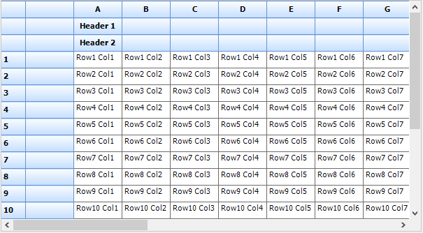
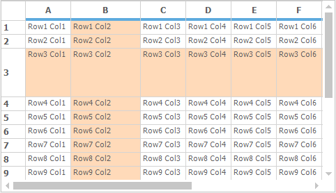
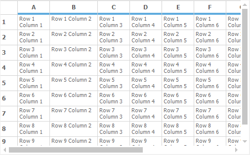
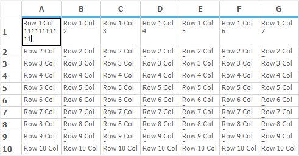
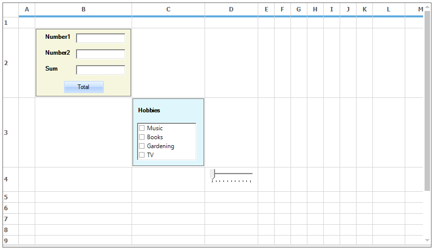
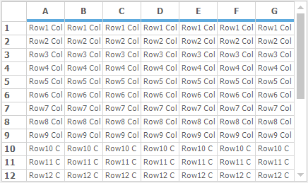
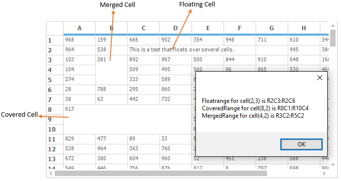

# Managing the Rows and Columns
This section will explain about the properties and methods available for customizing the rows and columns in GridControl. 

## Hiding Rows and Columns
To hide the range of rows and columns in a GridControl, use the [Hidden](http://help.syncfusion.com/cr/cref_files/windowsforms/grid/Syncfusion.Grid.Windows~Syncfusion.Windows.Forms.Grid.GridModelRowColOperations~Hidden.html) Property. The following code is used to hide the rows and columns by using the index.



//Hides column 2.
this.gridControl1.Cols.Hidden[2] = true;

//Hides row 3.
this.gridControl1.Rows.Hidden[3] = true;


'Hides column 2.
Me.gridControl1.Cols.Hidden(2) = True

'Hides row 3.
Me.gridControl1.Rows.Hidden(3) = True



### Hiding range of Rows and Columns 
The range of rows and columns can be hide by using the [SetRange](http://help.syncfusion.com/cr/cref_files/windowsforms/grid/Syncfusion.Grid.Windows~Syncfusion.Windows.Forms.Grid.GridModelHideRowColsIndexer~SetRange.html) method of the `Hidden` property.



//Hide the column from 2 to 3
this.gridControl1.Cols.Hidden.SetRange(2, 3, true);

//Hide the rows from 3 to 7
this.gridControl1.Rows.Hidden.SetRange(3, 7, true);


'Hide the column from 2 to 3
Me.gridControl1.Cols.Hidden.SetRange(2, 3, True)

'Hide the rows from 3 to 7
Me.gridControl1.Rows.Hidden.SetRange(3, 7, True)



### Hiding Row and Column Headers
The row and column headers of the grid can be hide by using the following code snippet,



//Hides default row headers.
this.gridControl.Cols.Hidden[0] = true; 

//Hides default column headers.
this.gridControl.Rows.Hidden[0] = true;


'Hides default row headers.
Me.gridControl.Cols.Hidden(0) = True

'Hides default column headers.
Me.gridControl.Rows.Hidden(0) = True



N> The index of Row and Column headers are Zero.

### Hiding Columns and Rows by Resizing 
The rows and columns can also be hidden by using the resizing handler. It can be achieved by resizing the row or column to the minimum size (zero). 

The following screenshot shows the hiding of column `C` by resizing,

The grid after hiding the column will be looks as follows,

## Unhide Columns Using Double Click
The hidden columns can be shown by double clicking on the column headers as like Excel. This behavior can be determined by using the UnHideColsOnDblClick property. The default value of this property is `true`. So the unhide behavior can be disabled by setting this property as `false`.



//Un hide the columns on double click 
this.gridControl1.UnHideColsOnDblClick = true;  


'Un hide the columns on double click 
Me.gridControl1.UnHideColsOnDblClick = True



The following example shows the column `C` is hidden,

The following example shows the column `C` is returned to view while double clicking between column `B` and column `D`,

### Prevent Hiding of Rows and Column Using Events
To avoid hiding the particular row or column in GridControl, set the `e.Cancel` to `true` in the [RowsHiding](http://help.syncfusion.com/cr/cref_files/windowsforms/grid/Syncfusion.Grid.Windows~Syncfusion.Windows.Forms.Grid.GridControl~RowsHiding_EV.html) and [ColsHiding](http://help.syncfusion.com/cr/cref_files/windowsforms/grid/Syncfusion.Grid.Windows~Syncfusion.Windows.Forms.Grid.GridControl~ColsHiding_EV.html)  event.



this.gridControl1.ColsHiding += new Syncfusion.Windows.Forms.Grid.GridRowColHidingEventHandler(gridControl1_ColsHiding);
this.gridControl1.RowsHiding += new Syncfusion.Windows.Forms.Grid.GridRowColHidingEventHandler(gridControl1_RowsHiding);
void gridControl1_RowsHiding(object sender, Syncfusion.Windows.Forms.Grid.GridRowColHidingEventArgs e)
{
    int rowIndex = 5;
    if (e.From <= rowIndex && e.To >= rowIndex)
    {
        //Restrict the particular row from hiding. 
        e.Cancel = true;
    }
}

void gridControl1_ColsHiding(object sender, Syncfusion.Windows.Forms.Grid.GridRowColHidingEventArgs e)
{
    int colIndex = 3;
    if (e.From <= colIndex && e.To >= colIndex)
    {
        //Restrict the column from hiding. 
        e.Cancel = true;
    }
}


AddHandler gridControl1.ColsHiding, AddressOf gridControl1_ColsHiding
AddHandler gridControl1.RowsHiding, AddressOf gridControl1_RowsHiding
Private Sub gridControl1_RowsHiding(ByVal sender As Object, ByVal e As Syncfusion.Windows.Forms.Grid.GridRowColHidingEventArgs)
    Dim rowIndex As Integer = 5
    If e.From <= rowIndex AndAlso e.To >= rowIndex Then
        'Restrict the particular row from hiding. 
        e.Cancel = True
    End If
End Sub

Private Sub gridControl1_ColsHiding(ByVal sender As Object, ByVal e As Syncfusion.Windows.Forms.Grid.GridRowColHidingEventArgs)
    Dim colIndex As Integer = 3
    If e.From <= colIndex AndAlso e.To >= colIndex Then
        'Restrict the column from hiding. 
        e.Cancel = True
    End If
End Sub



## Header Rows and Columns 
The grid can be displayed with more than one row/column header by setting the [HeaderCount](http://help.syncfusion.com/cr/cref_files/windowsforms/grid/Syncfusion.Grid.Windows~Syncfusion.Windows.Forms.Grid.GridModelRowColOperations~HeaderCount.html) value. The `HeaderCount` property is also used to get the last index of header rows and columns.



//Total of three column header rows
this.gridControl.Rows.HeaderCount = 2;

//Total of two row header columns
 this.gridControl.Cols.HeaderCount = 1;


'Total of three column header rows
Me.gridControl.Rows.HeaderCount = 2

'Total of two row header columns
 Me.gridControl.Cols.HeaderCount = 1



N> The headers added to the GridControl can be notified by using the [HeaderColCountChanged](http://help.syncfusion.com/cr/cref_files/windowsforms/grid/Syncfusion.Grid.Windows~Syncfusion.Windows.Forms.Grid.GridControl~HeaderColCountChanged_EV.html)  /[HeaderRowCountChanged](http://help.syncfusion.com/cr/cref_files/windowsforms/grid/Syncfusion.Grid.Windows~Syncfusion.Windows.Forms.Grid.GridControl~HeaderRowCountChanged_EV.html) event.

## Frozen Rows and Columns
A frozen row is one that cannot be scrolled. The column headers and row headers are always frozen in GridControl. Frozen rows are displayed at the top of Grid and frozen columns are displayed at the left side of the Grid. To set the number of frozen rows/column, set the [FrozenCount](http://help.syncfusion.com/cr/cref_files/windowsforms/grid/Syncfusion.Grid.Windows~Syncfusion.Windows.Forms.Grid.GridModelRowColOperations~FrozenCount.html) property value as specific count. 



//Has 3 non-scrollable rows at the top.        
this.gridControl.Rows.FrozenCount = 2;  
this.gridControl1.Cols.FrozenCount = 3; 


'Has 3 non-scrollable rows at the top.        
Me.gridControl.Rows.FrozenCount = 2
Me.gridControl1.Cols.FrozenCount = 3



N> The more details about the changing of frozen lines colors is explained in the [freezing](/windowsforms/grid/ms-excel-like-features) section of the Excel-Like features.

### Freeze Range of Rows and Columns
There is possible to freeze an interior range of rows or columns. It can be done by using the [FreezeRange](http://help.syncfusion.com/cr/cref_files/windowsforms/grid/Syncfusion.Grid.Windows~Syncfusion.Windows.Forms.Grid.GridModelRowColOperations~FreezeRange.html) method. The `FreezeRange` method will move the requested rows /columns to the top /left and then it will set the[FrozenCount](http://help.syncfusion.com/cr/cref_files/windowsforms/grid/Syncfusion.Grid.Windows~Syncfusion.Windows.Forms.Grid.GridModelRowColOperations~FrozenCount.html) value to perform the actual process of freezing.



//Moves rows 5 and 7 to the top of the grid and freezes them.        
this.gridControl.Rows.FreezeRange(5,7);


'Moves rows 5 and 7 to the top of the grid and freezes them.        
Me.gridControl.Rows.FreezeRange(5,7)



N> The adding of frozen rows and columns can be notified by using the [FrozenColCountChanged](http://help.syncfusion.com/cr/cref_files/windowsforms/grid/Syncfusion.Grid.Windows~Syncfusion.Windows.Forms.Grid.GridControl~FrozenColCountChanged_EV.html) and [FrozenRowCountChanged](http://help.syncfusion.com/cr/cref_files/windowsforms/grid/Syncfusion.Grid.Windows~Syncfusion.Windows.Forms.Grid.GridControl~FrozenRowCountChanged_EV.html) events.

## Moving Rows and Columns
The rows and columns can be moved to another place by using `GridControl.Rows.MoveRange` and `GridControl.Cols.MoveRange` methods. The [MoveRange](http://help.syncfusion.com/cr/cref_files/windowsforms/grid/Syncfusion.Grid.Windows~Syncfusion.Windows.Forms.Grid.GridModelRowColOperations~MoveRange.html) method takes three parameters that is initial position, number of rows/columns and target position.



//Starts at row 7, moves 2 rows to row 4.        
this.gridControl.Rows.MoveRange(7, 2, 4);

//Starts at column 2, moves 2 rows to column 5.        
 this.gridControl.Cols.MoveRange(2, 2, 5);


'Starts at row 7, moves 2 rows to row 4.        
Me.gridControl.Rows.MoveRange(7, 2, 4)

'Starts at column 2, moves 2 rows to column 5.        
 Me.gridControl.Cols.MoveRange(2, 2, 5)



### Getting the Count of Moved Rows and Columns
The moved rows and columns count can be get by using the [RowsMoved](http://help.syncfusion.com/cr/cref_files/windowsforms/grid/Syncfusion.Grid.Windows~Syncfusion.Windows.Forms.Grid.GridControl~RowsMoved_EV.html) and [ColsMoved](http://help.syncfusion.com/cr/cref_files/windowsforms/grid/Syncfusion.Grid.Windows~Syncfusion.Windows.Forms.Grid.GridControl~ColsMoved_EV.html) events.



this.gridControl1.RowsMoved +=new Syncfusion.Windows.Forms.Grid.GridRangeMovedEventHandler(gridControl1_RowsMoved);
void gridControl1_RowsMoved(object sender, Syncfusion.Windows.Forms.Grid.GridRangeMovedEventArgs e)
{
    int index = e.Count;
}


Private Me.gridControl1.RowsMoved += New Syncfusion.Windows.Forms.Grid.GridRangeMovedEventHandler(AddressOf gridControl1_RowsMoved)
Private Sub gridControl1_RowsMoved(ByVal sender As Object, ByVal e As Syncfusion.Windows.Forms.Grid.GridRangeMovedEventArgs)
    Dim index As Integer = e.Count
End Sub



## Inserting Rows and Columns 
More than one row or column can be added to GridControl by using `GridControl.Rows.InsertRange` and `GridControl.Cols.InsertRange` methods. The [InsertRange](http://help.syncfusion.com/cr/cref_files/windowsforms/grid/Syncfusion.Grid.Windows~Syncfusion.Windows.Forms.Grid.GridModelRowColOperations~InsertRange.html) method will move the rows according to the index given in its parameter.



//Insert three rows at index 2.
this.gridControl.Rows.InsertRange(2, 3);

//Insert two columns at index 2.
this.gridControl.Cols.InsertRange(2, 2);


'Insert three rows at index 2.
Me.gridControl.Rows.InsertRange(2, 3)

'Insert two columns at index 2.
Me.gridControl.Cols.InsertRange(2, 2)



The below screenshot shows the grid after insert the rows and columns,

### Restrict the Inserting of Rows and Columns 
The inserting of rows/columns can be avoided by using the [ColsInserting](http://help.syncfusion.com/cr/cref_files/windowsforms/grid/Syncfusion.Grid.Windows~Syncfusion.Windows.Forms.Grid.GridControl~ColsInserting_EV.html) /[RowsInserting](http://help.syncfusion.com/cr/cref_files/windowsforms/grid/Syncfusion.Grid.Windows~Syncfusion.Windows.Forms.Grid.GridControl~RowsInserting_EV.html) event. It can also provide the number of inserted row/columns count to the grid.



this.gridControl1.RowsInserting += new Syncfusion.Windows.Forms.Grid.GridRangeInsertingEventHandler(gridControl1_RowsInserting);
this.gridControl1.ColsInserting += new Syncfusion.Windows.Forms.Grid.GridRangeInsertingEventHandler(gridControl1_ColsInserting);
void gridControl1_ColsInserting(object sender, Syncfusion.Windows.Forms.Grid.GridRangeInsertingEventArgs e)
{
    //Restricting the insertion of columns
    e.Cancel = true;
}

void gridControl1_RowsInserting(object sender, Syncfusion.Windows.Forms.Grid.GridRangeInsertingEventArgs e)
{
    //Restrict the inserting of rows
    e.Cancel = true;
}


AddHandler gridControl1.RowsInserting, AddressOf gridControl1_RowsInserting
AddHandler gridControl1.ColsInserting, AddressOf gridControl1_ColsInserting
Private Sub gridControl1_ColsInserting(ByVal sender As Object, ByVal e As Syncfusion.Windows.Forms.Grid.GridRangeInsertingEventArgs)
    'Restricting the insertion of columns
    e.Cancel = True
End Sub

Private Sub gridControl1_RowsInserting(ByVal sender As Object, ByVal e As Syncfusion.Windows.Forms.Grid.GridRangeInsertingEventArgs)
    'Restrict the inserting of rows
    e.Cancel = True
End Sub




## Deleting Rows and Columns
To remove the rows and columns from the GridControl, use the [RemoveRange](http://help.syncfusion.com/cr/cref_files/windowsforms/grid/Syncfusion.Grid.Windows~Syncfusion.Windows.Forms.Grid.GridModelRowColOperations~RemoveRange.html) method. It will remove the rows according to the index given in its parameter.



//Remove 4th  and 5th row
this.gridControl.Rows.RemoveRange(4,5);

//Remove 2nd and 3rd column
this.gridControl.Cols.RemoveRange(2, 3);


'Remove 4th  and 5th row
Me.gridControl.Rows.RemoveRange(4,5)

'Remove 2nd and 3rd column
Me.gridControl.Cols.RemoveRange(2, 3)



The below screenshot shows the grid after delete the rows and columns,

N> The removing of rows/columns can be notified by using the [RowsRemoved](http://help.syncfusion.com/cr/cref_files/windowsforms/grid/Syncfusion.Grid.Windows~Syncfusion.Windows.Forms.Grid.GridControl~RowsRemoved_EV.html) and [ColsRemoved](http://help.syncfusion.com/cr/cref_files/windowsforms/grid/Syncfusion.Grid.Windows~Syncfusion.Windows.Forms.Grid.GridControl~ColsRemoved_EV.html) event.

## Setting the Column Widths and Row Heights
By default GridControl provides the support for resizing the rows and column using the mouse controller. The size of the rows/columns can be programmatically set by using the [RowHeights](http://help.syncfusion.com/cr/cref_files/windowsforms/grid/Syncfusion.Grid.Windows~Syncfusion.Windows.Forms.Grid.GridControl~RowHeights.html) and [ColWidths](http://help.syncfusion.com/cr/cref_files/windowsforms/grid/Syncfusion.Grid.Windows~Syncfusion.Windows.Forms.Grid.GridControl~ColWidths.html) as of follows.



//Sets the width of column 2.       
this.gridControl.ColWidths[2] = 100; 

//Sets the height of row 3.        
this.gridControl.RowHeights[3] = 70;


'Sets the width of column 2.       
Me.gridControl.ColWidths(2) = 100

'Sets the height of row 3.        
Me.gridControl.RowHeights(3) = 70



N> The change of col width and row height of the grid can be notified by using the [ColWidthsChanged](http://help.syncfusion.com/cr/cref_files/windowsforms/grid/Syncfusion.Grid.Windows~Syncfusion.Windows.Forms.Grid.GridControl~ColWidthsChanged_EV.html) and [RowHeightsChanged](http://help.syncfusion.com/cr/cref_files/windowsforms/grid/Syncfusion.Grid.Windows~Syncfusion.Windows.Forms.Grid.GridControl~RowHeightsChanged_EV.html) event.

### Setting Columns Styles and Row Styles
The GridControl provides the support for styling the rows and columns separately by using the [RowStyles](http://help.syncfusion.com/cr/cref_files/windowsforms/grid/Syncfusion.Grid.Windows~Syncfusion.Windows.Forms.Grid.GridNewVolatileData~RowStyles.html) and [ColStyles](http://help.syncfusion.com/cr/cref_files/windowsforms/grid/Syncfusion.Grid.Windows~Syncfusion.Windows.Forms.Grid.GridControl~ColStyles.html) properties.



//Sets Back Color, Text Color and Font Style of Column 2.
this.gridControl.ColStyles[2].BackColor = Color.Brown;
this.gridControl.ColStyles[2].TextColor = Color.White;
this.gridControl.ColStyles[2].Font.Bold = true;
this.gridControl.ColStyles[2].Font.Italic=true;

//Sets Back Color, Text Color and Font Style of Row 3.
this.gridControl.RowStyles[3].BackColor = Color.Red;
this.gridControl.RowStyles[3].TextColor = Color.White;
this.gridControl.RowStyles[3].Font.Bold = true;
this.gridControl.RowStyles[3].Font.Italic= true;


'Sets Back Color, Text Color and Font Style of Column 2.
Me.gridControl.ColStyles(2).BackColor = Color.Brown
Me.gridControl.ColStyles(2).TextColor = Color.White
Me.gridControl.ColStyles(2).Font.Bold = True
Me.gridControl.ColStyles(2).Font.Italic=True

'Sets Back Color, Text Color and Font Style of Row 3.
Me.gridControl.RowStyles(3).BackColor = Color.Red
Me.gridControl.RowStyles(3).TextColor = Color.White
Me.gridControl.RowStyles(3).Font.Bold = True
Me.gridControl.RowStyles(3).Font.Italic= True



N> The same row or column styles can also be set using [QueryCellInfo](/windowsforms/grid/appearance-and-formatting#querycellinfo-event) event.

## Controlling the Resize Behavior
The resizing behavior of columns and rows can be customized by using the [ResizeColsBehavior](http://help.syncfusion.com/cr/cref_files/windowsforms/grid/Syncfusion.Grid.Windows~Syncfusion.Windows.Forms.Grid.GridControl~ResizeColsBehavior.html) and [ResizeRowsBehavior](http://help.syncfusion.com/cr/cref_files/windowsforms/grid/Syncfusion.Grid.Windows~Syncfusion.Windows.Forms.Grid.GridControl~ResizeRowsBehavior.html) properties. The [GridResizeCellsBehavior](http://help.syncfusion.com/cr/cref_files/windowsforms/grid/Syncfusion.Grid.Windows~Syncfusion.Windows.Forms.Grid.GridResizeCellsBehavior.html) enumeration has provide the following options to control resizing behavior,

* **AllowDragOutside** - Allows the user to drag the cell boundary outside the grid client area and resize specific row or column.
* **IgnoreHeaders** –Do not allow the users to resize the rows or columns by moving the divider between rows or column headers.
* **InsideGrid** - Allows the user to resize rows or columns from anywhere inside the grid by dragging the divider between any two row or column headers.
* **None** - Turns off the mouse control over resizing rows and columns.
* **OutlineBounds** - Highlights the original cell boundaries of resizing row or column.
* **OutlineHeaders** - Highlights the header boundaries when the user resizes the associated row or column.
* **ResizeAll** - Resizes all rows or columns automatically when the user resizes one row or column with the mouse. All rows and columns are resized to the same size as the current row or column being resized.
* **ResizeSingle** - Resizes the row or column being resized by the user using the mouse.



this.gridControl.ResizeColsBehavior = GridResizeCellsBehavior.IgnoreHeaders;
this.gridControl.ResizeRowsBehavior = GridResizeCellsBehavior.IgnoreHeaders;


Me.gridControl.ResizeColsBehavior = GridResizeCellsBehavior.IgnoreHeaders
Me.gridControl.ResizeRowsBehavior = GridResizeCellsBehavior.IgnoreHeaders



## Resize To Fit
GridControl provides the supports for enable the resizing rows and columns based on the content of cells. It can be done by using the [ResizeToFit](http://help.syncfusion.com/cr/cref_files/windowsforms/grid/Syncfusion.Grid.Windows~Syncfusion.Windows.Forms.Grid.GridModelRowColSizeIndexer~ResizeToFit.html) method.



//Resizes the column widths.
this.gridControl.ColWidths.ResizeToFit(GridRangeInfo.Cols(1, 3));

//Resizes the row heights.
this.gridControl.RowHeights.ResizeToFit(GridRangeInfo.Rows(1, 5));


'Resizes the column widths.
Me.gridControl.ColWidths.ResizeToFit(GridRangeInfo.Cols(1, 3))

'Resizes the row heights.
Me.gridControl.RowHeights.ResizeToFit(GridRangeInfo.Rows(1, 5))



The parameter passed to `ResizeToFit` method is of type `GridRangeInfo`, which mention the ranges of rows and columns to allow resizing.

 The preceding image is the output of a demo that is available in the samples in the following installed location. 
&lt;Install Location&gt;\Syncfusion\EssentialStudio\[Version Number]\Windows\Grid.Windows\Samples\Grid Layout\Resize To Fit Demo

## ResizeToFitOptimized
The rows/columns can be resized to make the entire cell value visible in the grid by using the [ResizeToFitOptimized](http://help.syncfusion.com/cr/cref_files/windowsforms/grid/Syncfusion.Grid.Windows~Syncfusion.Windows.Forms.Grid.GridModelRowColSizeIndexer~ResizeToFitOptimized.html) method. It can to display the entire cell with resized columns and rows even when the grid cells has special characters such as tab, newline, etc.



//Resizes the column width.
this.gridControl.ColWidths.ResizeToFitOptimized(GridRangeInfo.Col(2),GridResizeToFitOptions.NoShrinkSize);

//Resizes the row height.
this.gridControl.RowHeights.ResizeToFitOptimized(GridRangeInfo.Rows(1, 8), GridResizeToFitOptions.NoShrinkSize);


'Resizes the column width.
Me.gridControl.ColWidths.ResizeToFitOptimized(GridRangeInfo.Col(2),GridResizeToFitOptions.NoShrinkSize)

'Resizes the row height.
Me.gridControl.RowHeights.ResizeToFitOptimized(GridRangeInfo.Rows(1, 8), GridResizeToFitOptions.NoShrinkSize)



N> The [ResizeToFitOption](http://help.syncfusion.com/cr/cref_files/windowsforms/grid/Syncfusion.Grid.Windows~Syncfusion.Windows.Forms.Grid.GridResizeToFitOptions.html) enumeration has provided the options to resize the grid cells such as IncludeHeaders, None and NoShrinkSize.

## ResizeToFit Behavior in AutoSize
The height and width of the cell can be increased based on the entered text by setting the [AutoSize](http://help.syncfusion.com/cr/cref_files/windowsforms/grid/Syncfusion.Grid.Windows~Syncfusion.Windows.Forms.Grid.GridStyleInfo~AutoSize.html) property to `true`. When the [WrapText](http://help.syncfusion.com/cr/cref_files/windowsforms/grid/Syncfusion.Grid.Windows~Syncfusion.Windows.Forms.Grid.GridStyleInfo~WrapText.html) is set to false `AutoSize` will affect the column width else it will increase the row height. It does not have the functionality of resizing the rows or columns after text has been entered like the [ResizeToFit](http://help.syncfusion.com/cr/cref_files/windowsforms/grid/Syncfusion.Grid.Windows~Syncfusion.Windows.Forms.Grid.GridModelRowColSizeIndexer~ResizeToFit.html) method.



//Enable the cell height automatically increased
this.gridControl.TableStyle.AutoSize = true;


'Enable the cell height automatically increased
Me.gridControl.TableStyle.AutoSize = True


  

## Auto Sizing Custom Cells
When custom controls are placed in the Grid, the corresponding cell can be automatically resized to fit the controls. It can be achieved by overriding the `OnQueryPreferredClientSize` method in the model class. The [ResizeToFit](http://help.syncfusion.com/cr/cref_files/windowsforms/grid/Syncfusion.Grid.Windows~Syncfusion.Windows.Forms.Grid.GridModelRowColSizeIndexer~ResizeToFit.html)  method is used to resize the cells while enter the text, but it will not work for Custom controls. The `ResizeToFit` method will resize the cell to the size returned by the `OnQueryPreferredClientSize` method.



// Overrides this method to calculate proper control size and returns the same.
protected override Size OnQueryPreferredClientSize(Graphics g, int rowIndex, int colIndex, GridStyleInfo style, GridQueryBounds queryBounds)
{
if(Grid[rowIndex,colIndex].Tag == null)
throw new Exception("No User Control is tagged");
else
{
//Gets the type of the control from Style.Tag.
Control userControl = Grid[rowIndex,colIndex].Tag as Control;

//Calculates the size of the control.
Size size = userControl.Size;
size.Height += 2;

//Returns the size.
return size;
}
}


'Overrides this method to calculate proper control size and return the same.
Protected Overrides Function OnQueryPreferredClientSize(ByVal g As Graphics, ByVal rowIndex As Integer, ByVal colIndex As Integer, ByVal style As GridStyleInfo, ByVal queryBounds As GridQueryBounds) As Size
If Grid(rowIndex, colIndex).Tag Is Nothing Then
Throw New Exception("No User Control is tagged")
Else

'Gets the type of the control from Style.Tag.
Dim userControl As Control = TryCast(Grid(rowIndex, colIndex).Tag, Control)

'Calculates the size of the control.
Dim size As Size = userControl.Size
size.Height += 2

'Return the size.
Return size
End If
End Function



The below screenshot shows how the cell resizes itself automatically to the size of the control, when a custom control is added to it.

## Enter Key behavior 
The moving of cell selection using the <kbd>Enter</kbd> key can be changed by using the [EnterKeyBehavior](http://help.syncfusion.com/cr/cref_files/windowsforms/grid/Syncfusion.Grid.Windows~Syncfusion.Windows.Forms.Grid.GridControl~EnterKeyBehavior.html) property. It provides support for the following navigation options to move the cell selection when Enter is pressed.

* Bottom
* BottomRight
* Down
* Left
* MostLeft
* MostRight
* None
* PageDown
* PageUp
* Right
* Top
* TopLeft
* Up



//Set the Enter key to navigate Left most cell of the row
this.gridControl1.EnterKeyBehavior = Syncfusion.Windows.Forms.Grid.GridDirectionType.MostLeft;


'Set the Enter key to navigate Left most cell of the row
Me.gridControl1.EnterKeyBehavior = Syncfusion.Windows.Forms.Grid.GridDirectionType.MostLeft



## Setting the Wrap Cell Behavior 
The `EnterKeyBehavior` is worked based on the [WrapCellBehavior](http://help.syncfusion.com/cr/cref_files/windowsforms/grid/Syncfusion.Grid.Windows~Syncfusion.Windows.Forms.Grid.GridModelOptions~WrapCellBehavior.html). Go to first column in next row or last column in previous row when at end or beginning of a row and moving based on Enter key behavior.

The [GridWrapCellBehavior](http://help.syncfusion.com/cr/cref_files/windowsforms/grid/Syncfusion.Grid.Windows~Syncfusion.Windows.Forms.Grid.GridWrapCellBehavior.html) has the following list of options,

* **WrapRow** – It will move the cell selection to the leftmost cell of the next row or right most cell of the previous row according to the `EnterKeyBehavior`.
* **WrapGrid** – It includes the WrapRow behavior additionally it will navigate the selection to the topmost left cell when it reaches the bottommost right cell.
* **NextControlInForm** – It also includes the WrapRow behavior, instead of moving to the Topmost left cell it will move the focus to the next control of the form.
* **None** – It will not move the selection at the end of the row.

When the rightmost cell of the row is reached, then the grid will automatically navigate the selection to the leftmost cell of the next row using the Enter key.



//Set the Enter key behavior navigate the selection to the right side of the current cell 
this.gridControl1.EnterKeyBehavior = Syncfusion.Windows.Forms.Grid.GridDirectionType.Right;
//Navigate the selection to the first cell of the next row, when it’s in rightmost cell of the row
this.gridControl1.Model.Options.WrapCellBehavior = Syncfusion.Windows.Forms.Grid.GridWrapCellBehavior.WrapRow;


'Set the Enter key behavior navigate the selection to the right side of the current cell 
Me.gridControl1.EnterKeyBehavior = Syncfusion.Windows.Forms.Grid.GridDirectionType.Right
'Navigate the selection to the first cell of the next row, when it’s in rightmost cell of the row
Me.gridControl1.Model.Options.WrapCellBehavior = Syncfusion.Windows.Forms.Grid.GridWrapCellBehavior.WrapRow



## Proportional Sizing
To auto resizing the columns when grid is resized, set [AllowProportionalColumnSizing](http://help.syncfusion.com/cr/cref_files/windowsforms/grid/Syncfusion.Grid.Windows~Syncfusion.Windows.Forms.Grid.GridControlBase~AllowProportionalColumnSizing.html) property to `true`. That is column width and content of cells are resized based on the grid size.



//Auto resizing the column when grid is resized
this.gridControl.AllowProportionalColumnSizing = true;


'Auto resizing the column when grid is resized
Me.gridControl.AllowProportionalColumnSizing = True



The below screenshot shows column width without using `AllowProportionalColumnSizing` Property.

The below screenshot shows column width after using `AllowProportionalColumnSizing` Property.

## Getting the Size of the Range of Cells
To calculate the display area for a given range of cells, use the [RangeInfoToRectangle](http://help.syncfusion.com/cr/cref_files/windowsforms/grid/Syncfusion.Grid.Windows~Syncfusion.Windows.Forms.Grid.GridControlBase~RangeInfoToRectangle.html) method. This method takes two argument such as range and [GridRangeOptions](http://help.syncfusion.com/cr/cref_files/windowsforms/grid/Syncfusion.Grid.Windows~Syncfusion.Windows.Forms.Grid.GridRangeOptions.html).



//Calculate the area of column 2
this.gridControl.RangeInfoToRectangle(GridRangeInfo.Col(2), GridRangeOptions.None);


'Calculate the area of column 2
Me.gridControl.RangeInfoToRectangle(GridRangeInfo.Col(2), GridRangeOptions.None)



## Getting the Range of the Given Size
To calculate a range of cells that is displayed at the specified area, use [RectangleToRangeInfo](http://help.syncfusion.com/cr/cref_files/windowsforms/grid/Syncfusion.Grid.Windows~Syncfusion.Windows.Forms.Grid.GridControlBase~RectangleToRangeInfo.html) method. This method takes rectangle as a parameter and calculate the ranges.



//Calculate the ranges 
this.gridControl.RectangleToRangeInfo(new Rectangle(100, 0, 65, 229));


'Calculate the ranges 
Me.gridControl.RectangleToRangeInfo(New Rectangle(100, 0, 65, 229))



## Getting the Row and Column Index from a Point
The row and column index of a cell that is displayed at a specified point can be calculated by using the [PointToRowCol](http://help.syncfusion.com/cr/cref_files/windowsforms/grid/Syncfusion.Grid.Windows~Syncfusion.Windows.Forms.Grid.GridControlBase~PointToRowCol.html) method. It will return row and column index of mentioned point through the out variables.



//To calculate Row and column index of specified point
this.gridControl1.PointToRowCol(new Point(100, 100),out a,out b);


'To calculate Row and column index of specified point
Me.gridControl1.PointToRowCol(New Point(100, 100),a,b)



N> The row and column indexes can be calculated based on the given point with respect to the grid view layout by using the [PointToClientRowCol](https://help.syncfusion.com/cr/cref_files/windowsforms/grid/Syncfusion.Grid.Windows~Syncfusion.Windows.Forms.Grid.GridViewLayout~PointToClientRowCol.html) method. It will return row and column position of mentioned point through the `out` variables.

## Finding Covered range, Floating range or Merged range of a cell
The [CoveredRanges](http://help.syncfusion.com/cr/cref_files/windowsforms/grid/Syncfusion.Grid.Windows~Syncfusion.Windows.Forms.Grid.GridControl~CoveredRanges.html) , [FloatingCells](http://help.syncfusion.com/cr/cref_files/windowsforms/grid/Syncfusion.Grid.Windows~Syncfusion.Windows.Forms.Grid.GridControl~FloatingCells.html), and [MergeCells](http://help.syncfusion.com/cr/cref_files/windowsforms/grid/Syncfusion.Grid.Windows~Syncfusion.Windows.Forms.Grid.GridModelMergeCells.html)  range collection have the separate `FindRange` method to find the range of covered or floated range. These ranges can be get using [GetSpannedRangeInfo](http://help.syncfusion.com/cr/cref_files/windowsforms/grid/Syncfusion.Grid.Windows~Syncfusion.Windows.Forms.Grid.GridControl~GetSpannedRangeInfo.html) method.

This method is a Boolean method, so it will return `true` if the specified cell is inside the `CoveredRange` , `FloatingCell` or `MergeCell`otherwise it will return `false`. 



//Defining ranges
GridRangeInfo floatRange = GridRangeInfo.Empty;
GridRangeInfo coveredRange = GridRangeInfo.Empty;
GridRangeInfo mergedRange = GridRangeInfo.Empty;

//Getting floating range.
this.gridControl1.GetSpannedRangeInfo(4, 4, out floatRange);
//Getting covered range.
this.gridControl1.GetSpannedRangeInfo(8, 2, out coveredRange);
//Getting merged range.
this.gridControl1.GetSpannedRangeInfo(4, 2, out mergedRange);

MessageBox.Show("Float range for cell(4,4) is " + floatRange.Info.ToString()
+ "\n" + "CoveredRange for cell(8,2) is " + coveredRange.Info.ToString());



'Defining ranges
Dim floatRange As GridRangeInfo = GridRangeInfo.Empty
Dim coveredRange As GridRangeInfo = GridRangeInfo.Empty
Dim mergedRange As GridRangeInfo = GridRangeInfo.Empty

'Getting floating range.
Me.gridControl1.GetSpannedRangeInfo(4, 4, floatRange)
'Getting covered range.
Me.gridControl1.GetSpannedRangeInfo(8, 2, coveredRange)
'Getting merged range.
Me.gridControl1.GetSpannedRangeInfo(4, 2, mergedRange)

MessageBox.Show("Float range for cell(4,4) is " & floatRange.Info.ToString() & Constants.vbLf & "CoveredRange for cell(8,2) is " & coveredRange.Info.ToString())



