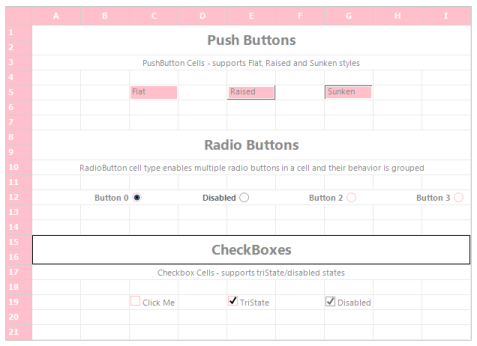
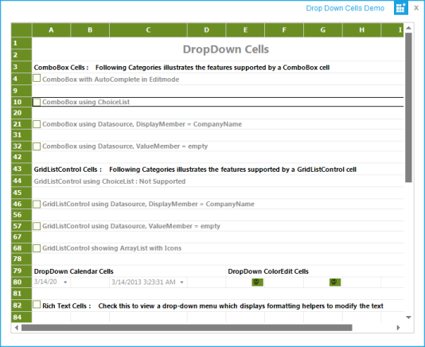
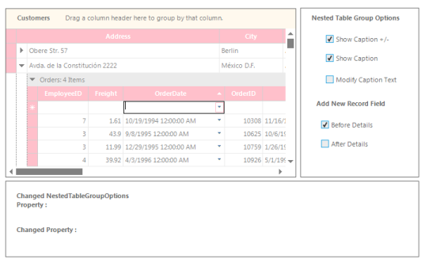

# Metro Theme for Essential Grid Controls

This feature enables you to apply new Metro styles to the controls of Essential Grid for Windows Forms. It provides support for the following controls and its associated scroll bars:

* Grid control
* GridGrouping control
* GridDataBound control
* GridList control
* GridRecordNavigation control

## Use case scenarios

The Metro theme support is useful for commercial applications in order to attract end users with inspiring UI look and feel.

## Tables for Properties and Events

<table>
<tr>
<th>
PROPERTY</th><th>
DESCRIPTION</th></tr>
<tr>
<td>
GridVisualStyles</td><td>
This is an enumeration type property. It is used to get or set the visual styles (skins) such as Office2010, Office2007, Office2003, Metro, etc.</td></tr>
</table>

<table>
<tr>
<th>
EVENT</th><th>
PARAMETERS</th><th>
DESCRIPTION</th></tr>
<tr>
<td>
ThemeChanged</td><td>
Object sender, EventArgs e</td><td>
Occurs when the ThemesEnabled property is changed.</td></tr>
</table>

## Applying Metro Theme to a Control

You can apply Metro theme to an application by setting GridVisualStyles property as Metro. The following code example illustrates how to apply Metro theme for the GridGrouping control.



this.gridGroupingControl1.GridVisualStyles = GridVisualStyles.Metro;




Me.gridGroupingControl1.GridVisualStyles = GridVisualStyles.Metro


The following screenshot is a sample output for the previous code.

 

## Applying User-Defined Colors as Metro Themes

Users can now utilize SetMetroStyle method to set user-defined colors as Metro theme in a grid. 

<table>
<tr>
<th>
METHOD</th><th>
PROTOTYPE</th><th>
DESCRIPTION</th></tr>
<tr>
<td>
SetMetroStyle</td><td>
public void SetMetroStyle(Color metroColor,Color metroHoverColor,Color metroColorPressed);</td><td>
A method that takes the user-defined back color, mouse hover color, and mouse pressed color to apply to grid.</td></tr>
</table>

 

 



this.gridControl1.SetMetroStyle(Color.Pink, Color.Plum, Color.PowderBlue);



Me.gridControl1.SetMetroStyle(Color.Pink, Color.Plum, Color.PowderBlue)



