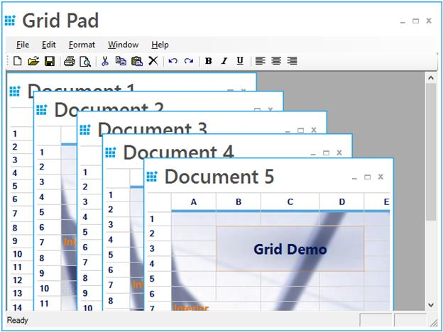

# Multiple Document Interface 
GridControl supports Multiple Document Interface (MDI). This support is used to work with multiple GridControl’s simultaneously. Here, multiple windows reside under a single parent window.

A sample demonstrating this feature is available under the following sample installation path.
**&lt;Install_Location&gt;\Syncfusion\EssentialStudio\[Version_Number]\Windows\Grid.Windows\Samples\Product Showcase\Grid Pad Demo**
