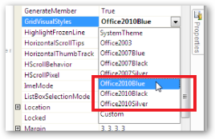
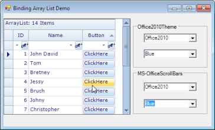
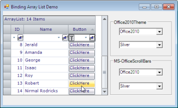

# Office2010 Theme in Windows Grids

This feature provides support to have MS Office 2010 themes namely Blue, Black, and Silver) for Windows Grids: GridControl, GridGroupingControl, GridDataBoundGrid, GridListControl, GridRecordNavigationControl and associated scrollbars.

To enable this support in grid, the following need to be handled:

* Apply Office 2010 Visual Style to Grid
* Enable Office 2010 Scrollbars

### Applying Office2010 Visual Style to Grid

To apply Office 2010 Visual Style to Grid:

1. Create grid enabled sample application.
2. Set Office2010 theme to grid control using GridVisualStyles.

   

### Enabling Office2010 Scrollbars

To enable Office 2010 Scrollbars:

1. Set GridOfficeScrollBars property to Office 2010.
2. Set Office2010ScrollBarColorScheme property to Blue, Black, or Silver.

   
   
### Use Case Scenarios

Office2010Theme support for Windows Grids is useful for commercial applications in order to attract its users with inspiring UI look and feel.

### Tables for Properties and Events

#### Properties

_Table 1138: Properties Table_

<table>
<tr>
<th>
PROPERTY</th><th>
DESCRIPTION</th><th>
DATA TYPE</th></tr>
<tr>
<td>
GridVisualStyles</td><td>
<ul>
<li> This is an Enumeration type property.</li> 
<li>  This property is used to get or set the VisualStyles (skins) like Office2010, Office2007, Office2003.</li> 
</ul>
</td><td>
Syncfusion.Windows.Forms.GridVisualStyles</td></tr>
<tr>
<td>
GridOfficeScrollbars</td><td>
<ul>
<li>This is an Enumeration type property.</li> 
<li>This property is used to get or set the Office like scrollbars.</li> 
</ul>
</td><td>
Syncfusion.Windows.Forms.OfficeScrollBars</td></tr>
<tr>
<td>
Office2010ScrollBarsColorScheme</td><td>
<ul>
<li>
This is an Enumeration type property.</li> 
<li>This property is used to get or set the style of Office2010 scroll bars</li> 
</ul></td><td>
Syncfusion.Windows.Forms.Office2010ColorScheme</td></tr>
</table>

#### Events

The following event is used when applying Office2010 theme to Essential Windows Grids.

_Table 139: Events Table_

<table>
<tr>
<th>
EVENT</th><th>
PARAMETERS</th><th>
DESCRIPTION</th></tr>
<tr>
<td>
ThemeChanged</td><td>
Object sender, EventArgs e</td><td>
Occurs when the Themes Enabled property is changed.</td></tr>
</table>

The following events occur when GridOfficeScrollBars are applied to Essential Windows Grids.

_Table 140: Events Table_

<table>
<tr>
<th>
EVENTS</th><th>
PARAMETERS</th><th>
DESCRIPTION</th></tr>
<tr>
<td>
Office2010ScrollBarsColorSchemeChanged</td><td>
Object sender, EventArgs e</td><td>
Occurs when the Office2010ScrollBarsColorScheme property has changed.</td></tr>
<tr>
<td>
OfficeScrollBarsChanged</td><td>
object sender, GridGroupingControl.OfficeScrollBarsEventArgs e</td><td>
Occurs when the GridOfficeScrollBars property has changed.</td></tr>
</table>

### Adding Grid with Office2010 Theme to an Application 

To add Grid with Office 2010 theme to an application:

1. Create a GridControl enabled application.
2. Set GridVisualStyles property to apply Office2010 theme in GridControl.

   The following sample code sets an Office2010 Black skin theme to Essential Grid Control.  

   ~~~ cs

		this.gridGroupingControl1.GridVisualStyles = GridVisualStyles.Office2010Black;

   ~~~
   {:.prettyprint }

   ~~~ vbnet

		Me.gridGroupingControl1.GridVisualStyles = GridVisualStyles.Office2010Black

   ~~~
   {:.prettyprint }

3. Set GridOfficeScrollBars property to Office2010 to apply Office2010 like scroll bars in Essential Windows Grids.
4. Set Office2010ScrollBarsColorScheme to apply the color scheme of the scroll bars.

   ~~~ cs

		this.gridGroupingControl1.GridOfficeScrollBars = OfficeScrollBars.Office2010;

		this.gridGroupingControl1.Office2010ScrollBarsColorScheme = Office2010ColorScheme.Black;

   ~~~
   {:.prettyprint }

   ~~~ vbnet

		Me.gridGroupingControl1.GridOfficeScrollBars = OfficeScrollBars.Office2010

		Me.gridGroupingControl1.Office2010ScrollBarsColorScheme = Office2010ColorScheme.Black

   ~~~
   {:.prettyprint }

#### Sample Link

To get the Schedule samples from the dashboard:

1. Open Essential Studio Dashboard by selecting Start -> All Programs -> Syncfusion -> Essential Studio <<Version Number>> -> Dashboard.
2. Select “Run Locally Installed Samples” from the Windows Forms drop-down list on the User Interface pane.
3. Expand “Grid samples” in the left panel of sample browser.
4. Expand “Appearance” subsection and select “Grid Style Demo”.
5. Click the “Run Sample” button in the right panel.

To open sample project:

1. Navigate to the following sample location in your system:

   &lt;Install Location&gt;\Syncfusion\EssentialStudio\[Version Number]\Windows\Grid.Windows\Samples\Appearance\GridStyle Demo

2. This location contains two sub folders CS and VB.  You can open the sample projects from the respective folders based on your application language.
