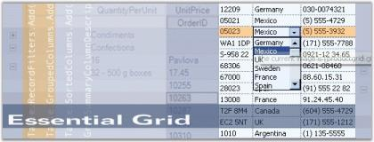
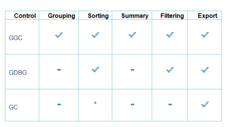
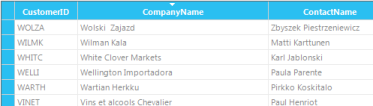
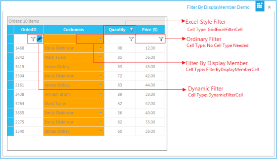

# Overview

This section covers information on Essential Grid, its key features, prerequisites to use the control, its compatibility with various OS and browsers, and finally the documentation details complimentary with the product. It comprises the following sub-sections:

## Introduction to Essential Grid

Essential Grid is a powerful grid control that is implemented by using unique styles architecture. It offers Microsoft Excel-like grid functionality and high performance grouping support for both flat and hierarchical data sources. It is a 100% Native .NET UI library that provides several packages for building modern Windows applications by using the Microsoft .NET framework. The Grid Grouping control is a powerful databound grid control that supports multi-column sorting, filtering, Outlook style grouping, summaries, expression fields, conditional formats and unbound fields.

Essential Grid controls are useful for those users who want to build a Windows application which can be used an any .NET environment including C#, VB.NET and C++. It is beneficial to those users who want to create true nested grids with hierarchical data, and also display multiple, unrelated tables in one grid. 

## Key Features

* Multi-level Undo/Redo, shared scrollbar support, data/view separation, floating cells, more than 18 cell types, and unmatched extensibility are unique features of the Essential Grid. 
* Grid cell can have specialized controls such as a Text Box, Check Box, or Combo Box.
* Grid supports data binding techniques such as ADO.NET, Virtual mode, bound and unbound mode, and so on.
* Essential Grid supports Office features like dynamic splitters and undo/redo. It can have a tabbed workbook format; also supports IntelliMouse Scrolling similar to MS Excel.
* Grid supports functionalities like OLE drag-and-drop, resizing of rows and columns through property settings, and special event handling. It allows extremely detailed customization down to the cell level.

Grid Grouping control has rich design time support. The grouping grid supports variety of data sources that are used to automatically populate the grid with data. It has full ADO+ support, and also allows any component that implements the IList, IBindingList, ITypedList or IListSource interface.

* Grid data can be arranged based on matching field values to form groups. Essential Grid supports nested grouping by hierarchically combining the groups in different levels. The number of levels of grouping is unlimited.
* Grid supports data presentation techniques like sorting, grouping, filtering, and so on.

The product comes with numerous samples as well as an extensive documentation to guide you. This User Guide provides detailed information on the features and functionalities of the Grid, Grid Data Bound Grid, Grid Grouping, Grid List, Grid Record Navigation and Grid Aware Text Box controls. It is organized into the following sections:

* Overview-This section gives a brief introduction to our product and its key features.
* Installation and Deployment-This section elaborates on the install location of the samples, license, and so on.
* What's New-This section lists the new features implemented for every release.
* Getting Started-This section guides you on getting started with Grid controls.
* Grid Controls-The features of the Grid, Grid Data Bound Grid, Grid Grouping, Grid List, Grid Record Navigation and Grid Aware Text Box controls are illustrated with use case scenarios, code examples and screen shots under this section.
* Frequently Asked Questions-This section discusses specific solutions for very specific tasks.

## Document Conventions

The conventions listed below will help you to quickly identify the important sections of information, while using the content:

_Table 1: Document Conventions_

<table>
<tr>
<th>
Convention</th><th>
ICON</th><th>
Description</th></tr>
<tr>
<td>
Note</td><td>
{{''|markdownify}}

{{'_Note:_' | markdownify }}</td><td>
Represents important information</td></tr>
<tr>
<td>
Example</td><td>
Example</td><td>
Represents an example</td></tr>
<tr>
<td>
Tip</td><td>
{{''|markdownify}}

</td><td>
Represents useful hints that will help you in using the controls/features</td></tr>
<tr>
<td>
Additional Information</td><td>
{{''|markdownify}}

</td><td>
Represents additional information on the topic</td></tr>
</table>

## Prerequisites and Compatibility

This section covers the requirements mandatory for using Essential Grid. It also lists operating systems and browsers compatible with the product.

### Prerequisites

The prerequisites details are listed below:

_Table 2: Prerequisites_

<table>
<tr>
<td>
 Development Environments</td><td>
* Visual Studio 2013* Visual Studio 2012 (Ultimate, Premium, Professional, and Express)* Visual Studio 2010 (Ultimate, Premium, Professional and Express)* Visual Studio 2008 (Team, Professional, Standard and Express)* Visual Studio 2005 (Team, Professional, Standard and Express)* Borland Delphi for .NET* SharpCode</td></tr>
<tr>
<td>
  .NET Framework versions</td><td>
* .NET 4.5.1* .NET 4.5* .NET 4.0* .NET 3.5* .NET 2.0</td></tr>
<tr>
<td>
  Operating Systems</td><td>
* Windows 8.1 (32 bit and 64 bit)* Windows 8 (32 bit and 64 bit)* Windows Server 2013 (32 bit and 64 bit)* Windows Server 2012 (32 bit and 64 bit)* Windows Server 2008 (32 bit and 64 bit)* Windows 7 (32 bit and 64 bit)* Windows Vista (32 bit and 64 bit)* Windows Server 2003 (32 bit and 64 bit)* Windows XP</td></tr>
</table>

### Compatibility

The compatibility details are listed below:

_Table 3: Compatibility_

<table>
<tr>
<td>
Operating Systems</td><td>
* Windows Server 2008 (32 bit and 64 bit)* Windows 7 (32 bit and 64 bit)* Windows Vista (32 bit and 64 bit)* Windows XP* Windows 2003</td></tr>
</table>

## Choosing the Best Grid

GridControl (GC) is a powerful grid control that is implemented using unique styles architecture. Grid control, which is similar to Microsoft Excel, allows extremely detailed customization down to the cell level. Multilevel undo-redo, shared scrollbar support, data view separation, floating cells, more than 18 cell types, and unmatched extensibility are the unique features of the Essential Grid. This is a complete native .NET UI library, which provides several packages for building modern Windows applications by using the Microsoft .NET framework. 

GridGroupingControl (GGC) is a column-row oriented grid that is used to bind to a data source. Essential Grouping allows you to easily group, sort, filter, and summarize your data. It can display true nested grids with hierarchical data and it can also display multiple unrelated tables in one grid.

GridDataBoundGrid (GDBG) has been designed to be used as a grid bound to a data source such as an ADO.NET data set or data table. No data values are stored in the GridDataBoundGrid object. In GDBG, individual columns act as single entity (column-centric). Unlike the GridControl, GDBG is data bound. 

This section analyses the efficiency of the Grids based on the most important features. The following are the important features:

* Performance
* Grouping
* Sorting
* Summary
* ExcelExport
* Filtering

 *Sorting can be performed through customizing the _GridSortColumnHeaderCellModel_._

_Figure 2: Sorting_

### Performance

GridGroupingControl

GridGroupingControl has an extremely high-performance standard. It can handle very high frequency updates and refresh scenarios. It also provides complete support for Virtual Mode wherein the data will be loaded only on demand. By simply setting a few properties, you can have the grid work with large amounts of data without affecting the performance. 

> Note: For more details, refer to the following section: Performance

### GridControl and GridDataBoundGrid

GridControl has an extremely high performance standard. It can handle high frequency updates and work with large amounts of data without affecting the performance, similarly GridDataBoundGrid can also handle large amount of data without affecting the performance. 

> Note: For more details, refer to the following section: Grid Data Bound Grid Performance _and_ Performance

### Grouping

#### GridGroupingControl

GridGroupingControl alone supports grouping. This control is exclusively designed for grouping.This control supports grouping data at design time too. Grouping at design time displays the grid as a tree view. For non-nested data tables, you can use this control to quickly provide custom views of data. 

Grid Grouping control allows you to group the data based on one or more columns. When grouping is applied, the data will be organized into a hierarchical structure based on the matching field values.  This control enables you to combine identical value to form a group. Each group is identified by its _GroupCaptionSection_._ You can expand this to view the records in the group. _GroupCaptionSection_ provides information about a particular group such as the group name, number of items in the group and so on. The Grid Grouping control also provides Expand/Collapse button for every group. 

> Note: For more details, refer to the following section: Grouping

#### Sample 

A sample of this feature is available in the following location:_<Install Location>\Syncfusion\EssentialStudio\[Version Number]\Windows\Grid.Grouping.Windows\Samples\2.0\Grouping\Grouping Demo_

GridControl and the GridDataBoundGrid do not support Grouping.

### Summary

GridGroupingControl

GridGroupingcontrol alone supports calculating summaries and allows you to display summaries for each group. This enables you to derive additional information from your data such as average, maximum and minimum, summation, count, and so on. This engine supports summaries that operate on vectors such as Distinct Count, Median, 25% and 75% Quartile. You can also easily add custom summaries.

>  Note: For more details, refer to the following section: Summaries

#### Sample

A sample of this feature is available in the following location:

_<Install Location>\Syncfusion\EssentialStudio\[Version Number]\Windows\Grid.Grouping.Windows\Samples\2.0\Calculate Summary\Summary Tutorial_

* GridControl and the GridDataBoundGrid do not support Summary.

### Sorting

#### GridGroupingControl

GridGroupingcontrol provides in-built support for sorting. This allows you to sort the table data against one or more columns and provides support to sort unlimited number of columns. While sorting, the grid will rearrange the data to match the current sort criteria.

> Note: For more details, refer to the following section: Sorting

#### Sample 

A sample of this feature is available in the following location:

_<Install Location>\Syncfusion\EssentialStudio\[Version Number]\Windows\Grid.Grouping.Windows\Samples\Sorting\Sorting Demo_

#### GridDataBoundGrid

GridDataBoundGrid allows you to arrange items in sequence, in different sets or in both. The following is the list of sorting behavior options that are available in GridDataBoundGrid:

* SingleClick: Sort column on single click once.
* DoubleClick: Sort column on double-click.
* None: Sorting is disabled.
>  Note: For more details, refer to the following section: Sorting By Display Member

#### Sample 

A sample of this feature is available in the following location:

_<Install Location>\Syncfusion\EssentialStudio\[Version Number]\Windows\GridDataBound.Windows\Samples\Sorting\Sort By DisplayMember Demo_

#### GridControl

GridControl doesnot directly support sorting. Sorting can be performed through customizing the _GridSortColumnHeaderCellModel_. 

Sample 

The sample in the following location illustrates how to implement header-click sorting for the GridControl based grids. 

_<Install Location>\Syncfusion\EssentialStudio\[Version Number]\Windows\Grid.Windows\Samples\Grid Layout\Sorting Demo\_

#### Sort Icon Placement

This feature is used to place the sort icon in different positions of the column header cell of the grid. The default position of the sort icon is to the right.

The position options include:

* Right
* Top
* Left 

_Table 4: Properties_

<table>
<tr>
<th>
Property</th><th>
Description</th><th>
Type</th><th>
Data Type</th></tr>
<tr>
<td>
SortIconPlacement.Right</td><td>
Gets or sets the icon placement to the right side of the column header cell.</td><td>
SortIconPlacement</td><td>
enumeration</td></tr>
<tr>
<td>
SortIconPlacement.Top</td><td>
Gets or sets the icon placement to the top side of the column header cell.</td><td>
SortIconPlacement</td><td>
enumeration</td></tr>
<tr>
<td>
SortIconPlacement.Left</td><td>
Gets or sets the icon placement to the left side of the column header cell.</td><td>
SortIconPlacement</td><td>
enumeration</td></tr>
</table>

##### Sample Link

_<Install Location>\Syncfusion\EssentialStudio\[Version Number]\Windows\Grid.Grouping.Windows\Samples\Sorting\Sorting Demo_

##### Adding Sort Icon Placement to an Application 

To enable this feature, use the following code:

[C#]

this.gridGroupingControl1.SortIconPlacement = SortIconPlacement.Top;  




[VB]

Me.gridGroupingControl1.SortIconPlacement = SortIconPlacement.Top



### Excel Export

Essential Grid control has built-in support for Excel. You can download the data from the Grid control or Grid Data Bound Grid or Grouping Grid control into an Excel spreadsheet for offline verification and computation. 

#### GridGroupingControl

This control automatically copies the Grid's styles, formats, groups, summary rows and expression fields to Excel. This enables you to export the grid with or without nested tables. It provides support for exporting grid with four different views. They are: 

* Default
* Visible
* RowHeader 
* ColumnHeader.
>  Note: For more details, refer to the following section:_ Exporting Grid Grouping Control To Excel

#### Sample 

A sample of this feature is available in the following location:

_<Install Location>\Syncfusion\EssentialStudio\[Version Number]\Windows\Grid.Grouping.Windows\Samples\Exporting\Excel Export Demo_

####  GridControl and GridDataBoundGrid

_GridExcelConverter_ class enables you to export data from a Grid control or Grid Data Bound Grid into Excel. This control automatically copies the Grid's styles and formats to Excel. 

>  Note: For more details, refer to the following section: [Exporting the Grid Control or Grid Data Bound Grid To Excel](http://help.syncfusion.com/ug_94/User%20Interface/Windows%20Forms/Grid/default.htm?turl=Documents%2F3161exportingthegridcontrolorgriddataboundgridtoexcel.htm)

#### Sample 

A sample of this feature is available in the following location:

For GDBG: 

_<Install Location>\Syncfusion\EssentialStudio\[Version Number]\Windows\GridDataBound.Windows\Samples\Export\DBG XLS Export Demo_

For GC:

_<Install Location>\Syncfusion\EssentialStudio\[Version Number]\Windows\Grid.Grouping.Windows\Samples\Exporting\Excel Export Demo_

### Filtering

#### GridGroupingControl

This control enables you to specify the logical condition for filtering. Similar to an Expression Field, this control also provides the option of typing an expression or entering a condition using an editor dialog for filtering.

#### Filterbar

Grouping Grid provides in-built support for displaying _Filter_ _Bar_across columns. It can be used to filter and clear filter at run time. This is user interactive and has more advantages.  One of the main reasons for its wide usage is that this can display various filter options for the columns. You can also add your own filter criteria.

#### Dynamic filter

Dynamic Filter serves as good replacement for Filter Bar. This provides advanced filtering capabilities. This is built on the foundation of the regular filter bar with added provisions to support dynamic filtering. The dynamic filter can be used with Nested Tables and Nested Groups.

>  Note: For more details, refer to the following section: Record Filtering

#### Sample 

A sample of this feature is available in the following location:

_<Install Location>\Syncfusion\EssentialStudio\[Version Number]\Windows\Grid.Grouping.Windows\Samples\Filters and Expressions_

#### GridDataBoundGrid 

You can enable filtering for the grid based on GridDataBoundGrid, by adding a row of drop-down cells at the top of a simple (non-hierarchical) Grid Data Bound Grid. This allows you to filter match values from the drop-down. This control also supports filter by DisplayMember. 

> Note: For more details, refer to the following section: Filtering a Grid Data Bound Grid

#### Sample 

A sample of this feature is available in the following location:

_<Install Location>\Syncfusion\EssentialStudio\[Version Number]\Windows\GridDataBound.Windows\Samples\Filtering\Filter By DisplayMember Demo_

#### Filter for Specific Columns

When a filter is wired to a grid, it is wired to the entire grid. This makes it difficult to use different filters (e.g., dynamic filter, Excel-style filter, and filter by display member) in a single grid.

Here is a short description of each filter:

* Dynamic Filter—Filters the content using a list of comparison operators.
* Ordinary Filter—Filters the content based on the selected text and index.
* Excel-Style Filter—Filters the content based on multiple values and can sort the results, similar to Microsoft Excel filtering.
* Filter by Display Member—Filters the content by displaying the member instead of the value member of a combo-box column.

This feature enhances the use of different filters within a single grid. The filters are wired to each column by changing the cell type of the corresponding column, which enables users to apply many filters.

A filter can be applied to an individual column by setting the AllowIndividualColumnWiring property of the filter to true.

_Table 5: Properties_

<table>
<tr>
<th>
Property </th><th>
Description </th><th>
Type </th><th>
Data Type </th></tr>
<tr>
<td>
AllowIndividualColumnWiring</td><td>
Gets or sets whether the filters can be wired to an individual column. </td><td>
Bool</td><td>
Bool</td></tr>
</table>

#### Sample Link

A sample is available in the following location:

_<Install Location>\Syncfusion\EssentialStudio\[Version Number]\Windows\Grid.Grouping.Windows\Samples\Filters and Expressions\Filter By DisplayMember Demo_

#### Enable Filters on Desired Columns

The following code is used to enable filters in specific columns:

[C#]

GridDynamicFilter filter = new GridDynamicFilter();

filter.AllowIndividualColumnWiring  = true;

filter.WireGrid(gridGroupingControl1);




[VB]

 Dim filter As New GridDynamicFilter()

filter.AllowIndividualColumnWiring  = true;

filter.WireGrid(gridGroupingControl1);



Dynamic filter is wired to column 0 by using the following code:

[C#] 

this.gridGroupingControl1.TableDescriptor.Columns[0].Appearance.FilterBarCell.CellType = "DynamicFilterCell";




[VB]

Me.gridGroupingControl1.TableDescriptor.Columns[0].Appearance.FilterBarCell.CellType = "DynamicFilterCell";



Other filters can be wired to the grids column by using the previous code.

## Documentation 

Syncfusion includes the following documentation segments to provide all necessary information for using Essential Grid controls in an efficient manner.

_Table 6: Documentation segments_

<table>
<tr>
<th>
Type of Documentation</th><th>
Location</th></tr>
<tr>
<td>
Readme</td><td>
[drive:]\Program Files\Syncfusion\Essential Studio\x.x.x.x\Infrastructure\Data\Release Notes\readme.htm</td></tr>
<tr>
<td>
Release Notes</td><td>
[drive:]\Program Files\Syncfusion\Essential Studio\x.x.x.x\Infrastructure\Data\Release Notes\Release Notes.htm</td></tr>
<tr>
<td>
User Guide (this document)</td><td>
Online{{ '[http://help.syncfusion.com/](http://help.syncfusion.com/)' | markdownify }} (Navigate to the Grid for Windows Forms User Guide.)

Note: Click Download as PDF to access a PDF version.Installed DocumentationDashboard -> Documentation -> Installed Documentation. </td></tr>
<tr>
<td>
Class Reference</td><td>
Online{{ '[http://help.syncfusion.com/cr/windows%20forms/](http://help.syncfusion.com/cr/windows%20forms/)' | markdownify }}(Navigate to the Windows Forms User Guide. Select {{ '_Grid_' | markdownify }} in the second text box, and then click the Class Reference link found in the upper right section of the page.)Installed DocumentationDashboard -> Documentation -> Installed Documentation.</td></tr>
</table>

