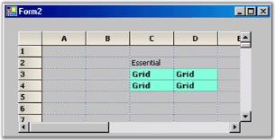
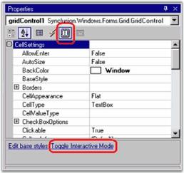

# Populating the Grid Control

There are several ways of using Grid control to display data. For instance, you can move your data directly into an Essential Grid and let the underlying grid manage this data for you or another way would be to set the datasource member of Essential Grid, thus binding the grid. Still another method is to use Essential Grid in a virtual mode whereby you can handle certain events to provide data to the Essential Grid whenever it is in demand.

Out of these three ways, the latter two ways of providing data to an Essential Grid are discussed in more detail (in their own sections) in this user's guide. In this section, you will learn how to store data directly into an Essential Grid's internal storage, so that the grid is able to maintain the data for you, and also how to populate a Grid control from a two-dimensional integer array.

## Grid Control Indexer Technique

To place data into a grid, you need to loop through all the rows and columns, setting GridStyleInfo.CellValue property for each cell. This technique is fine for small grids and is not a real drawback. It does have overhead of firing events that are normally associated with a change in a cell's GridStyleInfo object. For larger grids, the overhead associated with such events is likely to be noticed by users only during population. One thing to note is that you may need to turn off the Grid's Undo/Redo support so that users cannot undo your initial population of the grid.



//Turns off undo.

this.gridControl1.CommandStack.Enabled = false;

//Prevents the grid from redrawing for each change.

this.gridControl1.BeginUpdate();

this.gridControl1.RowCount = this.numArrayRows;

this.gridControl1.ColCount = this.numArrayCols;

for (int i = 0; i < this.numArrayRows; ++i)

{

for(int j = 0; j < this.numArrayCols; ++j)

this.gridControl1[i+1, j+1].CellValue = this.intArray[i,j];

}

this.gridControl1.EndUpdate();

this.gridControl1.Refresh();




'Turns off undo.

Me.gridControl1.CommandStack.Enabled = False

'Prevents the grid from redrawing for each change.

Me.gridControl1.BeginUpdate()

Me.gridControl1.RowCount = Me.numArrayRows

Me.gridControl1.ColCount = Me.numArrayCols

Dim i As Integer

Dim j As Integer

For i = 1 To Me.numArrayRows

For j = 1 To Me.numArrayCols

Me.gridControl1(i+1, j+1).CellValue = Me.intArray(i, j)

Next j

Next i

Me.gridControl1.EndUpdate()

Me.gridControl1.Refresh()



## GridControl.PopulateValues Method

To overcome cell-by-cell event overhead intrinsic, Grid control has PopulateValues method. This method is a member of GridControl class, which is in the indexer population technique and was discussed in the Grid Control Indexer Technique section. This method will allow you to pass in a range of cells and data source of the type object. With this information, the method will then use techniques that will bypass event overhead to retrieve data from datasource object in a manner that depends upon the object type and will move it into the range.

The basic types that can be passed into the datasource parameter include IListSource, Array and IList. This includes things like DataTable and DataView, since DataTable implements IListSource and DataView implements IList.

Note that when you use theGridControl.PopulateValues method, data values are copied from your data source and placed into the Essential Grid object. Thus, this is an entirely different concept than binding a grid to a data source. In such cases, data is not moved into the grid object, instead is provided on demand from data source to the grid. So, the grid never stores any values in a databound grid. When you use the PopulateValues method, data is actually copied from data source and is placed in the grid's internal storage.



this.gridControl1.BeginUpdate();

this.gridControl1.RowCount = this.numArrayRows;

this.gridControl1.ColCount = this.numArrayCols;

//Calls PopulateValues Method to move values from a given data source (this.initArray) into the Grid Range specified.

this.gridControl1.Model.PopulateValues(GridRangeInfo.Cells(1, 1, this.numArrayRows, this.numArrayCols), this.intArray);

this.gridControl1.EndUpdate();

this.gridControl1.Refresh();




Me.gridControl1.BeginUpdate()

Me.gridControl1.RowCount = Me.numArrayRows

Me.gridControl1.ColCount = Me.numArrayCols

'Calls PopulateValues Method to move values from a given data source (this.initArray) into the Grid Range specified.

Me.gridControl1.Model.PopulateValues(GridRangeInfo.Cells(1, 1, Me.numArrayRows, Me.numArrayCols), Me.intArray)

Me.gridControl1.EndUpdate()

Me.gridControl1.Refresh()


To see a program sample that uses these techniques to populate a grid, look at the Grid Population Demo sample that is shipped with the product. It allows you to time the different population methods including using of a grid virtually. For small grids, the three techniques are comparable. But, as you increase the grid size, virtual grid timing values remain the same, whereas the other two methods vary depending upon the number of data points. In general, the population of a grid by using indexer technique is about factor of ten slower than using PopulateValues method. Depending upon the size of the grid, the virtual technique can be thousands of times quicker than the other techniques.

## Using GridStyleInfo Class

By using GridRangeInfo class and properties of GridStyleInfo class, you can write code illustrating how to enter values into a grid and how to affect the appearance of these displayed values. In the sections that follow, you will learn how to create a Grid object and place it on a form. Then you can set the style values by using Grid classes discussed so far: GridStyleInfo, GridRangeInfo and GridControl.

### Setting GridStyleInfo Properties

There are several ways of setting GridStyleInfo properties. If you want to set them for a particular cell, you need to use row and column values as indexers on GridControl object to retrieve GridStyleInfo object that is associated with a particular cell. But, to change BaseStyle, ColumnStyle, or RowStyle, you will have to use different accessory methods to retrieve the style which is under consideration. The code samples that follow will show you several ways of changing particular styles. 

N> This section shows working with cell-oriented Grid control allows explicit setting of individual cell and row properties. Column-oriented Grid Data Bound Grid does not support explicit setting of individual cell and row properties. Instead, events are used to set these properties on demand. You can see samples in the DataBound Grid section.

## Through Code

Given below is the code to help you create GridStyleInfo properties.



//Adds some text to cell (2,3).

gridControl1[2, 3].CellValue = "Essential";

// Creates a GridStyleInfo.

GridStyleInfo style = new GridStyleInfo();

// Sets some properties.

style.BackColor = Color.Aquamarine;

style.CellValue = "Grid";

style.Font.Facename = "Verdana";

style.Font.Size = 8.2f;

style.Font.Bold = true;

// Applies this style to several cells.

this.gridControl1.ChangeCells(GridRangeInfo.Cells(3, 3, 4, 4), style);




'Adds some text to cell (2,3).

gridControl1(2, 3).CellValue = "Essential"

'Creates a GridStyleInfo.

Dim style As GridStyleInfo

style = New GridStyleInfo()

'Sets some properties.

style.BackColor = Color.Aquamarine

style.CellValue = "Grid"

style.Font.Facename = "Verdana"

style.Font.Size = 8.2!

style.Font.Bold = True

' Applyies this style to several cells.

Me.gridControl1.ChangeCells(GridRangeInfo.Cells(3, 3, 4, 4), style)


 



//Changes the back color of the grid by using TableStyle.

this.gridControl1.TableStyle.BackColor = Color.FromArgb(255, 192, 192);




'Changes the back color of the grid using TableStyle.

Me.gridControl1.TableStyle.BackColor = Color.FromArgb(255, 192, 192)


 



//Changes a row style and a column style.

this.gridControl1.RowStyles[3].TextColor = Color.Blue;

this.gridControl1.RowStyles[3].CellValue = "Blue";

this.gridControl1.ColStyles[3].TextColor = Color.Red;

this.gridControl1.ColStyles[3].CellValue = "Red";




'Changes a row style and a column style.

Me.gridControl1.RowStyles(3).TextColor = Color.Blue

Me.gridControl1.RowStyles(3).CellValue = "Blue"

Me.gridControl1.ColStyles(3).TextColor = Color.Red

Me.gridControl1.ColStyles(3).CellValue = "Red"





//Changes a base style, eg. Row Header.

gridControl1.BaseStylesMap["Row Header"].StyleInfo.BackColor = Color.FromArgb(228, 255, 255);




'Changes a base style, eg. Row Header.

gridControl1.BaseStylesMap("Row Header").StyleInfo.BackColor = Color.FromArgb(228, 255, 255)



 

## Through Designer

To edit cell styles from the designer, you must select the grid on the design surface and then click Toggle Interactive Mode verb shown at the bottom of the PropertyGrid. This will allow you to select cells that are within the Grid control on the design surface. To change any of the style settings of the selected cells, you must first click the Cell Settings tool bar button at the top of PropertyGrid. This will display the cell style settings that are within the PropertyGrid and will allow you to change them. The changes will affect the currently selected range or the current cell if no range is selected. 

 

### Creating Grid Object

To add Grid control to a form, you must create an instance of Grid control, set row and column count, then position it on your form.

## Through Designer

With the designer, you can drag-and-drop control, size it, and then set a couple of properties.

* Drag a Grid control object from your toolbox and drop it on the form. 
* Size and position it. 
* Change RowCount and ColCount values in the PropertyGrid for this control.

## Through Code

Given below is the code to help you create a grid.



using Syncfusion.Windows.Forms.Grid;

                        ....

//Creates the Essential Grid.

private GridControl gridControl1;

                        ....

this.gridControl1 = new GridControl();

//Sets the number of rows and columns.

this.gridControl1.ColCount = 10;

this.gridControl1.RowCount = 100;

//Positions it on the form.

this.gridControl1.Location = new System.Drawing.Point(20, 20);

this.gridControl1.Size = new System.Drawing.Size(344, 200);

//Adds it to the forms' controls.

this.Controls.Add(this.gridControl1);




imports Syncfusion.Windows.Forms.Grid

                ....

'Creates the Essential Grid.

Private WithEvents gridControl1 As GridControl

                ....

Me.gridControl1 = New GridControl()

'Sets the number of rows and columns.

Me.gridControl1.ColCount = 10

Me.gridControl1.RowCount = 100

'Positions it on the form.

Me.gridControl1.Location = New System.Drawing.Point(20, 15)

Me.gridControl1.Size = New System.Drawing.Size(344, 150)

'Adds it to the forms' controls.

Me.Controls.Add(Me.gridControl1)

