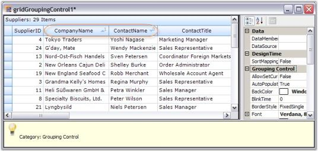
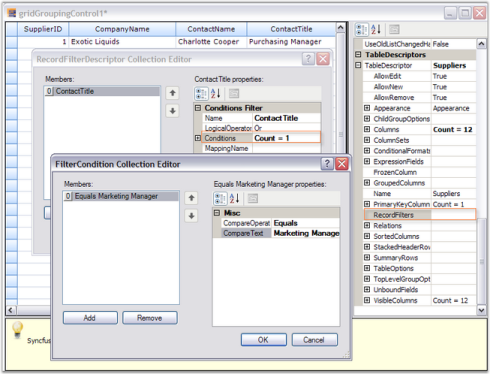
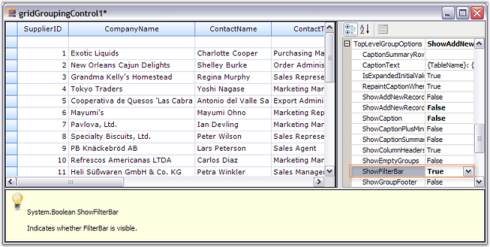
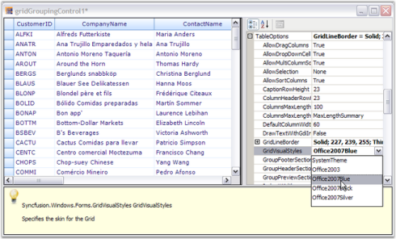
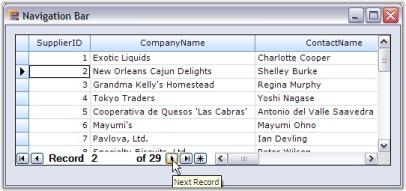
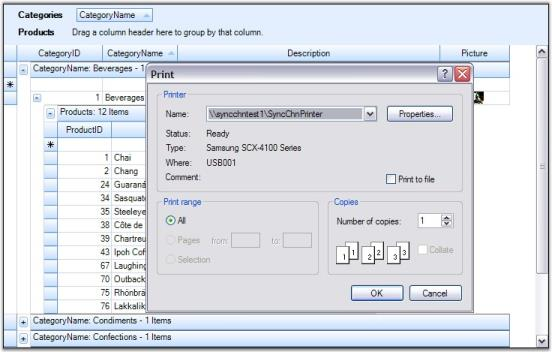
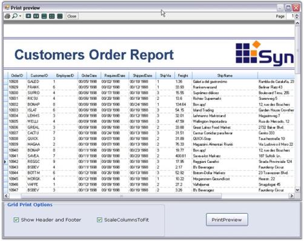

# Real Time Applications

This section provides information on the realtime applications of Essential Grouping Grid. 

## Portfolio Grid

The user can simulate Portfolio Manager application by using Essential Grid. It allows you to track all your investments and assets in stocks and mutual funds. It provides you with an insight on current market pricing that would help to plan your future investments.

> Note: For more details, refer to the following browser sample:
>
> &lt;Install Location&gt;\Syncfusion\EssentialStudio\[Version Number]\Windows\Grid.Grouping.Windows\Samples\Product Showcase\Portfolio Grid Demo

Example : This sample comes with three modules whose features are explained below.

Dashboard : This is the place where you can track the status of all your investments. It comes with a variety of views: 

* Overview - Provides a consolidated view of your mutual fund holdings. You can get useful information on your investments such as rate of change per day, current market price, total returns, etc.  You have options to add or delete desired stocks. 
* Detail View - Provides a more detailed view, allowing you to get the stock details of mutual funds. 
* Industry/Sector View - Provides a consolidated view of your stock holdings. 
* Stock Exchange View - Displays details with respect to individual stock exchange. 

Contribution Analyzer : This module illustrates the contributions of different stocks for every portfolio account in a graphical representation by using chart controls. Click the desired portfolio account on the left side chart to view its contributions.

Performance Analyzer : This module does a performance analysis and displays the market history for the top three large cap accounts. You have options to view the history for last three months, last six months, and last year.

## Outlook 2007 Demo

You can implement Microsoft Outlook 2007-like interface by using Essential Grid Grouping control and other components from Essential Studio. Essential Grid has been extended to support all the Office 2007 themes (Blue, Black, and Silver) with the look and feel of Outlook 2007.

> Note: For more details, refer to the following browser sample:
>
> &lt;Install Location&gt;\Syncfusion\EssentialStudio\[Version Number]\Windows\Grid.Grouping.Windows\Samples\Product Showcase\Outlook Demo

Example: Following are the major features of the sample.

### Features

* Office 2007 themes - Blue, Black, and Silver to see the effects of the application.
* The grouping of columns in the mails display area. Right click on the column headers and select ArrangeBy in the column.
* Custom selection navigation with all arrow keys.
* Custom grouping for dates, size, priority, and flag fields.
* Dynamic formatting when narrowly switching between column-set view and normal view.
* Events when deleting records.
* Customized current view.
* Outlook appearance and functionalities.

## Grid Designer

Grid Grouping control has strong designer support. You can control all aspects of grid's appearance through the designer. Additional commands (verbs) will let you save layouts and restore them. You can also use preview feature that will allow you load data into your control and then further set the Grid Grouping control properties that can be persisted as design-time properties.

Clicking Preview and Edit verb will allow you to view the Grid Grouping control, populated with data along with companion property grid as seen in the picture below. It also displays help description for the properties that are being selected. You can use the property grid to change Grid Grouping control's properties and see the effect immediately on the populated control. When you close the preview, you will have the option of saving any changed properties to the property grid in the designer. We will use this Preview and Edit support to see the effects of setting various TableOption properties.

Grid Designer presents populated Grid Grouping control along with property grid listing out the related properties. It also includes an integrated help feature to display a brief description on the property selected. You will be able to set any kind of properties using the designer so that you can see the results immediately. Here is a brief discussion on how to work with grid elements through the designer.

### Grouping

Designer provides full drag and drop capability so that you can group the records by dragging a column header and dropping it into GroupDropArea, provided the GroupDropArea is enabled by setting ShowGroupDropArea to true. Likewise you can group data against any number of columns across the tables when multiple nested tables are used.

You can also use TableDescriptor.GroupedColumns property to add groups where you need to specify the column names based on which the table has to be grouped.

### Sorting

Sorting can be done on the table data by simply clicking the desired column header by which the values need to be sorted. Once sorting is done, the grouping grid displays ListSortIcon in the respective column header to indicate Sort Direction. You could also make use of the TableDescriptor.SortedColumns property to sort table data wherein you need to provide the column to be sorted and sort order.

### Summaries

Summaries can be added in the designer itself by accessing TableDescriptor.SummaryRows property. You can add as many summary rows as you need, each with a desired number of summary columns specifying the type of summary, summary format, the column based on whose values the summary has to be calculated and the like for each of the summary columns.

### Record Filters

By using the TableDescriptor.RecordFilters property, you can add row filters for your grid table. Once you have specified filter criteria and column name whose values have to be checked against the given criteria, the grouping grid will display only the subset of records that satisfies the given criteria.

_Figure 464: Filtered Grid_

Grid Grouping control provides AutoFilterRow, which can be enabled by setting ShowFilterBar property to true. Once that is done, you must enable AllowFilter property for the desired columns to enable filtering on those columns.

### Expression Fields

When there is a need to display calculated values based on the values on other fields in the same record, ExpressionFields would be the right choice to use. ExpressionFields can be created by using TableDescriptor.ExpressionFields property. This will open an editor wherein you can add any number of expression fields each with its own expression used to calculate the results.

###Relations

It is possible to specify the relation to be used across the tables in case multiple tables are used. It can be done by accessing TableDescriptor.Relations property wherein you can specify the relation type, name of the child table, relation keys consisting of the keys in parent and child tables and other information necessary to setup the relation.

### Appearance

The appearance of every grid element can be customized by accessing Appearance property. It allows you to set GridStyleInfo properties like cell type, value, back color, font, etc. for grid cells. It holds a sub tree of different grid elements, each with its own set of formatting properties. For instance, when you want to set appearance for alternate record field cell, you can make use of Appearance.AlternateRecordFieldCell property; if you want to customize summary cells, you will have to use Appearance.SummaryFieldCell or related property.

### Skins

You can change the appearance and behavior of every grid element to provide grid with a rich look and feel by setting skins. Grouping Grid currently offers five such skins: Office2007Blue, Office2007Silver, Office2007Black, Office2003 and SystemTheme(Default XP theme). To set a skin, GridVisualStyles property which is under TableOptions section is used. It lists possible skin options in a drop down, which will make the entire grid redrawn with the chosen style.

_Figure 472: Grid Designer displaying the possible skins in a Drop Down_

#### See Also

Grouping, Sorting, Summaries, Record Filters, Expression Fields, Relations, Appearance, Grid Skins

## Navigation Bar

Grid Grouping control comes with an in-built Navigation Control that allows the user to browse through the records with ease. The navigation bar consists of buttons that facilitate navigation to first, next, previous, last records and also to the AddNew record in the grid. It also contains a label that displays the current record number together with the total record count.

NavigationBar can be enabled by setting ShowNavigationBar to true. It is possible to customize default appearance of the navigation bar by setting appropriate properties. Tooltips can be enabled for the navigation bar by setting the property, ShowNavigationBarToolTips to true. ShowNavigationBar must be set to true to enable tooltips.

_Table 109: Navigation bar_

<table>
<tr>
<th>
GRID GROUPING CONTROL PROPERTY</th><th>
DESCRIPTION</th></tr>
<tr>
<td>
ShowNavigationBar</td><td>
Specifies whether to show the record navigation bar.</td></tr>
<tr>
<td>
ShowNavigationBarToolTips</td><td>
Specifies whether to show tooltips when the user hovers the mouse over the elements of the RecordNavigationBar.</td></tr>
</table>

The following code examples illustrate the above settings.



this.gridGroupingControl1.ShowNavigationBar = true;

this.gridGroupingControl1.ShowNavigationBarToolTips = true;





Private Me.gridGroupingControl1.ShowNavigationBar = True

Private Me.gridGroupingControl1.ShowNavigationBarToolTips = True



#### Through Designer

#### Output

## Print and Print Preview

Grid Grouping control supports printing and printing previews through the .NET Framework classes System.Windows.Forms.PrintPreviewDialog and System.Windows.Forms.PrintDialog. A derived GridPrintDocument, which represents the print document is passed to these classes. This GridPrintDocument implements printing logic that is needed to print multipage grids.

Code for Print Preview Dialog Box



GridPrintDocument pd = new GridPrintDocument(this.gridGroupingControl1.TableControl, true);

PrintPreviewDialog ppv = new PrintPreviewDialog();

ppv.Document = pd;

pd.DefaultPageSettings.Landscape = true;

ppv.ShowDialog();





Dim pd As New GridPrintDocument(Me.gridGroupingControl1.TableControl, True)

Dim ppv As New PrintPreviewDialog()

ppv.Document = pd

pd.DefaultPageSettings.Landscape = True

ppv.ShowDialog()



#### Code for Print Dialog Box



GridPrintDocument pd = new GridPrintDocument(this.gridGroupingControl1.TableControl);

PrintDialog printDialog = new PrintDialog();

printDialog.Document = pd;

pd.DefaultPageSettings.Landscape = true;

if (printDialog.ShowDialog() == DialogResult.OK)

pd.Print();





Dim pd As New GridPrintDocument(Me.gridGroupingControl1.TableControl)

Dim printDialog As New PrintDialog()

printDialog.Document = pd

pd.DefaultPageSettings.Landscape = True

If printDialog.ShowDialog() = Windows.Forms.DialogResult.OK Then

pd.Print()

End If



Given below are sample screen shots.

> Note: For more details, refer to the following browser sample:
>
> &lt;Install Location&gt;\Syncfusion\EssentialStudio\[Version Number]\Windows\Grid.Grouping.Windows\Samples\Printing\Hierarchical Grid Demo

## Advanced printing

Grid Grouping control supports printing of entire grid's column in a single page. Also, it allows the user to specify the header and footer for the page to be printed. This can be achieved by using GridPrintDocumentAdv class. Column can be specified to fit in a single page by setting ScaleColumnsToFitPage property to true, header and footer can be added using the events DrawGridPrintHeader and DrawGridPrintFooter.

The following code example illustrates setting the header and footer for the page to be printed.



Syncfusion.GridHelperClasses.GridPrintDocumentAdv pd = new Syncfusion.GridHelperClasses.GridPrintDocumentAdv(this.gridGroupingControl1.TableControl);

pd.DefaultPageSettings.Margins = new System.Drawing.Printing.Margins(25, 25, 25, 25);

//Sets header and footer height.

pd.HeaderHeight = 70;

pd.FooterHeight = 50;

//Scales columns to fit page.

pd.ScaleColumnsToFitPage = true;

//Handles the following events to draw the header and footer.

pd.DrawGridPrintHeader += new Syncfusion.GridHelperClasses.GridPrintDocumentAdv.DrawGridHeaderFooterEventHandler(pd_DrawGridPrintHeader);

pd.DrawGridPrintFooter += new Syncfusion.GridHelperClasses.GridPrintDocumentAdv.DrawGridHeaderFooterEventHandler(pd_DrawGridPrintFooter); pd = new GridPrintDocument(this.gridGroupingControl1.TableControl);

PrintDialog printDialog = new PrintDialog();

printDialog.Document = pd;

pd.DefaultPageSettings.Landscape = true;

if (printDialog.ShowDialog() == DialogResult.OK)

pd.Print();





Dim pd As Syncfusion.GridHelperClasses.GridPrintDocumentAdv = New Syncfusion.GridHelperClasses.GridPrintDocumentAdv(Me.gridGroupingControl1.TableControl)

pd.DefaultPageSettings.Margins = New System.Drawing.Printing.Margins(25, 25, 25, 25)

'Sets header and footer height. 

pd.HeaderHeight = 70

pd.FooterHeight = 50

'Scales columns to fit page.

pd.ScaleColumnsToFitPage = True

'Handles the following events to draw header and footer.

AddHandler pd.DrawGridPrintHeader, AddressOf pd_DrawGridPrintHeader

AddHandler pd.DrawGridPrintFooter, AddressOf pd_DrawGridPrintFooter



> Note: For more details, refer to the following browser sample:
>
> &lt;Install Location&gt;\Syncfusion\EssentialStudio\[Version Number]\Windows\Grid.Grouping.Windows\Samples\Printing\Hierarchical Grid Demo

