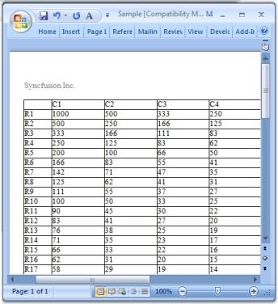
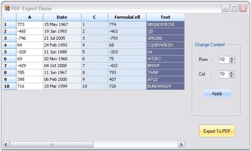
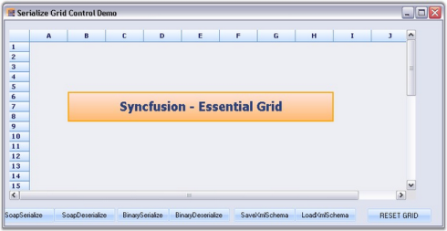

# Serialization

The following serilaization techniques are discussed in this section:

## Word Converter

Export to Word is one of the most common functionalities that is required in the .NET world. Essential Grid control has in-built support for Word Export. Users can download data from the Grid Control into a Word document for offline verification and/or computation. This can be achieved by making use of the GridWordConverter class. This section will walk you through conversion of the contents of the grid to a word file as well as discuss various converter options. GridWordConverter class derives from GridWordConverterBase. It contains number of methods that helps in exporting different components of the grid. 

### Properties

Here is a list of properties offered by GridWordConverter. By setting these properties, you will be able to choose the elements you need to export.

_Table 68: Properties_

<table>
<tr>
<th>
PROPERTIES</th><th>
DESCRIPTION</th></tr>
<tr>
<td>
ShowHeader</td><td>
Specifies if header should be displayed.</td></tr>
<tr>
<td>
ShowFooter</td><td>
Indicates if footer should be displayed.</td></tr>
</table>

### Method

GridWordConverter control provides a method called GridToWord. This is the method that does the conversion of grid contents to a Word file. It accepts two parameters: grid to be converted and filename of the destination Word document.

### Syntax



GridWordConverter converter = new GridWordConverter();

converter.GridToWord("Grid.doc", this.gridControl1);




Dim converter As GridWordConverter = New GridWordConverter()

converter.GridToWord("Grid.doc", Me.gridControl1)



### Events

DrawHeader and DrawFooter are the events offered by the GridWordConverter that aids in adding as well as customizing the header and footer in the destination word document. 

### Sample Output

Below images depict the conversion of grid content to a Word file.

A sample demonstrating this feature is available under the following sample installation path.

_<Install Location>\Syncfusion\EssentialStudio\[Version Number]\Windows\Grid.Windows\Samples\Exporting\Exporting Demo\_

## Excel Export

Export to Excel is one of the most common functionalities required in the .NET world. Essential Grid control has built-in support for Excel Export. You can download the data from Grid control or DataBound Grid or Grouping Grid control into an Excel spreadsheet for offline verification and/or computation. This can be achieved by making use of the GridExcelConverter and GroupingGridExcelConverter classes. This section will take you through conversion of the contents of the grid to an Excel file, as well as discuss various converter options.

### Import an Excel Sheet into Essential Grid

An Excel sheet can also be imported to the Grid control or DataBound Grid. This can be done by using ExcelToGrid method in the GridExcelConverterControl class. The following code example illustrates how to transfer Excel content to the Grid control.



Syncfusion.GridExcelConverter.GridExcelConverterControl gecc = new Syncfusion.GridExcelConverter.GridExcelConverterControl();

gecc.ExcelToGrid(@"C:\MyGC.xls", this.gridControl1.Model);




Dim gecc As Syncfusion.GridExcelConverter.GridExcelConverterControl = New Syncfusion.GridExcelConverter.GridExcelConverterControl()

gecc.ExcelToGrid("C:\MyGC.xls", Me.gridControl1.Model)



The following code example illustrates how to transfer Excel content to DataBound Grid.



Syncfusion.GridExcelConverter.GridExcelConverterControl gecc = new Syncfusion.GridExcelConverter.GridExcelConverterControl();

gecc.ExcelToGrid(@"C:\MyGC.xls", this.gridDataBoundGrid1.Model);




Dim gecc As Syncfusion.GridExcelConverter.GridExcelConverterControl = New Syncfusion.GridExcelConverter.GridExcelConverterControl()

gecc.ExcelToGrid("C:\MyGC.xls", Me.gridDataBoundGrid1.Model)


### Excel Converter Options

GridExcelConverter class enables you to export specific grid elements like column headers, row headers, and so on. By default, GridExcelConverterControl exports all elements in the grid. The following code example illustrates how to include both row and column headers during the export.



gecc.GridToExcel(this.grid.Model, @"C:\MyGGC.xls", Syncfusion.GridExcelConverter.ConverterOptions.RowHeaders | Syncfusion.GridExcelConverter.ConverterOptions.ColumnHeaders);




gecc.GridToExcel(Me.grid.Model, "C:\MyGGC.xls", Syncfusion.GridExcelConverter.ConverterOptions.RowHeaders|Syncfusion.GridExcelConverter.ConverterOptions.ColumnHeaders)


### Exporting Multiple Grids

It is possible to save multiple grids to a single XLS file as worksheet. The following code example illustrates how to do this.



using Syncfusion.XlsIO;

using Syncfusion.GridExcelConverter;

private void buttonExport_Click(object sender, System.EventArgs e)

{

    SaveFileDialog saveFileDialog = new SaveFileDialog();

    saveFileDialog.Filter = "Files(*.XLS)|*.XLS";

    saveFileDialog.AddExtension = true;

    saveFileDialog.DefaultExt = ".XLS";

    if(saveFileDialog.ShowDialog() == DialogResult.OK && saveFileDialog.CheckPathExists)

    {

        GridExcelConverterControl gec = new GridExcelConverterControl();

        IWorkbook workBook = ExcelUtils.CreateWorkbook(new string[] {"Sheet1","Sheet2"});

        gec.GridToExcel(this.gridControl1.Model, workBook.Worksheets[0]);

        gec.GridToExcel(this.gridControl2.Model, workBook.Worksheets[1]);

        workBook.SaveAs(saveFileDialog.FileName);

        workBook.Close();

        ExcelUtils.ThrowNotSavedOnDestroy = false;

    }

}




Imports Syncfusion.XlsIO

Imports Syncfusion.GridExcelConverter

Private Sub buttonExport_Click(ByVal sender As Object, ByVal e As System.EventArgs)

Dim saveFileDialog As SaveFileDialog = New SaveFileDialog()

saveFileDialog.Filter = "Files(*.XLS)|*.XLS"

saveFileDialog.AddExtension = True

saveFileDialog.DefaultExt = ".XLS"

If saveFileDialog.ShowDialog() = DialogResult.OK And Also saveFileDialog.CheckPathExists Then

Dim gec As GridExcelConverterControl = New GridExcelConverterControl

Dim workbook As IWorkbook = ExcelUtils.CreateWorkbook(New String() {"Sheet1", "Sheet2"})

gec.GridToExcel(Me.gridControl1.Model, workBook.Worksheets(0))

gec.GridToExcel(Me.gridDataBoundGrid1.Model, workbook.Worksheets(1))

workbook.SaveAs(saveFileDialog.FileName)

workBook.Close()

ExcelUtils.ThrowNotSavedOnDestroy = False

End If

End Sub


### Exporting Grid Data to Excel 2010

You can export Grid data to Excel 2010. To do this, you must explicitly set the Excel version by creating an XlsIO application, and then export the Grid data to the Excel worksheet. You can set DefaultVersion to _Excel2010_ to export to this version by default. Similarly, you can also export Grid data to other versions of Excel. The following code example illustrates this.



ExcelEngine engine = new ExcelEngine();

IApplication app = engine.Excel.Application;

app.DefaultVersion = ExcelVersion.Excel2010;

IWorkbook book = app.Workbooks.Create();

GroupingGridExcelConverterControl gecc = new GroupingGridExcelConverterControl ();

SaveFileDialog saveFileDialog = new SaveFileDialog();

saveFileDialog.Filter = "Files(*.xlsx)|*.xlsx";

saveFileDialog.DefaultExt = ".xlsx";

if (saveFileDialog.ShowDialog() == System.Windows.Forms.DialogResult.OK)

{

gecc.GroupingGridToExcel(this.gridGroupingControl1, book.Worksheets(0), ConverterOptions.Visible);

book.SaveAs(saveFileDialog.FileName);

   if (MessageBox.Show("Do you wish to open the xls file now?", "Export to Excel", MessageBoxButtons.YesNo, MessageBoxIcon.Question) == System.Windows.Forms. DialogResult.Yes)

   {

Process proc = new Process ();

proc.StartInfo.FileName = saveFileDialog.FileName;

proc.Start();

  }

}




Dim engine As New ExcelEngine()

Dim app As IApplication = engine.Excel.Application

app.DefaultVersion = ExcelVersion.Excel2010

Dim book As IWorkbook = app.Workbooks.Create()

Dim gecc As New GroupingGridExcelConverterControl()

Dim saveFileDialog As New SaveFileDialog()

saveFileDialog.Filter = "Files(*.xlsx)|*.xlsx"

saveFileDialog.DefaultExt = ".xlsx"

If saveFileDialog.ShowDialog() = System.Windows.Forms.DialogResult.OK 

Then

gecc.GroupingGridToExcel(Me.gridGroupingControl1, book.Worksheets(0), ConverterOptions.Visible)

book.SaveAs(saveFileDialog.FileName)

   If MessageBox.Show("Do you wish to open the xls file now?", "Export to Excel", MessageBoxButtons.YesNo, MessageBoxIcon.Question) = System.Windows.Forms.DialogResult.Yes Then

Dim proc As New Process()

proc.StartInfo.FileName = saveFileDialog.FileName

proc.Start()

  End If

End If


N> This is applicable to all Grid controls in Essential Grid.

## PDF Export

Our Essential Grid control supports conversion of grid content to a PDF file. Data in Grid control can be converted to a PDF document for offline verification and/or computation. This can be achieved by making use of GridPDFConverter class. PDF libraries are used to support the conversion of grid content to a PDF page. To make the control functional, the following dll files should be added along with the default dll files in the reference folder: 

* Syncfusion.Pdf.Base
* Syncfusion.GridHelperClasses.Windows.

ExportToPdf method is used to export grid content to a PDF file. Following code example illustrates how to convert the content in grid to PDF.



GridPDFConverter pdfConvertor = new GridPDFConverter();

pdfConvertor.ExportToPdf("Sample1.pdf", this.gridControl1);




Dim pdfConvertor As GridPDFConverter = New GridPDFConverter()

pdfConvertor.ExportToPdf("Sample1.pdf", Me.gridControl1)



A sample demonstrating this feature is available under the following sample installation path.

_<Install Location>\Syncfusion\EssentialStudio\[Version Number]\Windows\Grid.Windows\Samples\2.0\Export\PDF Converter Demo_

### Support to Access or Modify Document Attributes of Exported PDF

This feature allows you to access and modify PDF document attributes while exporting, or after exporting, a grid to PDF. When you want to check the page count of the exporting document, you can use this feature. 

Events

_Table69: Export Event table_

<table>
<tr>
<th>
EVENT </th><th>
DESCRIPTION </th><th>
ARGUMENTS </th><th>
TYPE </th><th>
REFERENCE LINKS </th></tr>
<tr>
<td>
Exporting </td><td>
tdis will be triggered before exporting grid to PDF. </td><td>
(object sender, Eventargs e) </td><td>
event</td><td>
N/A </td></tr>
<tr>
<td>
Exported </td><td>
tdis will be triggered after exporting grid to PDF.</td><td>
(object sender, Eventargs e) </td><td>
event </td><td>
N/A </td></tr>
</table>
 
#### Sample Link

A demo of this feature is available in the following location: 

_{Install Drive}\AppData\Local\Syncfusion\EssentialStudio\[Version Number]\Windows\Grid.Windows\Samples\Exporting\Exporting Demo\_

### Hooking the events in an application

You can hook the events using the ExportToPdf() method of PDFconverter. The following code illustrates this:



GridPDFConverter pdfConvertor = new GridPDFConverter();

pdfConvertor.Exporting += new GridPDFConverter.PDFExportingEventHandler(pdfConvertor_Exporting);

pdfConvertor.Exported += new GridPDFConverter.PDFExportedEventHandler(pdfConvertor_Exported);




Dim pdfConvertor As GridPDFConverter = New GridPDFConverter()

AddHandler pdfConvertor.Exporting, AddressOf pdfConvertor_Exporting

AddHandler pdfConvertor.Exported, AddressOf pdfConvertor_Exported



## SOAP, Binary and XML Serialization

Essential Grid control has support for serialization and de-serialization of grid's schema information.Export as Image Support

Essential Grid provides image export support for the Grid, GridDataBoundGrid, and GridGrouping controls in the Excel converter. With this support, users can enable or disable image export from a Grid control to Excel. This is a Boolean property and its default value is true. This property will affect the grid-to-Excel converter when the ExportStyle property is true.

### Use Case Scenarios 

This feature allows you to control the image export in the grid-to-Excel converter. This property will affect the grid when ExportStyle is true.

_Table 70: Properties_

<table>
<tr>
<th>
PROPERTY</th><th>
DESCRIPTION</th><th>
DATA TYPE</th></tr>
<tr>
<td>
ExportImage</td><td>
Used to enable or disable the image export in Syncfusion Windows Forms grid.</td><td>
Boolean</td></tr>
</table>
 Syntax



ExcelExport.ExportStyle = true;   

//ExportImage works only when ExportStyle is true.         

ExcelExport.ExportImage = false;





ExcelExport.ExportStyle = True

‘ExportImage works only when ExportStyle is true.

ExcelExport.ExportImage = False


N> Serialization is the process of saving the state of an object as a stream of bytes. The reverse of this process is called deserialization.

Grid control supports three different types of serialization techniques namely:

* SOAP - Helps convert the grid schema information to SOAP format.
* Binary - Helps convert the grid schema information to binary format.
* XML - Helps convert the grid schema information to XML format.

### SOAP

* Following code example illustrates serialization of grid schema information by using SOAP technique.



this.gridControl1.Model.SaveSoap(dlg.FileName);




Me.gridControl1.Model.SaveSoap(dlg.FileName)



* Following code example illustrates deserialization of grid schema information by using SOAP technique.


this.gridControl1.Model = GridModel.LoadSoap(dlg.FileName);

this.gridControl1.Refresh();    




Me.gridControl1.Model = GridModel.LoadSoap(dlg.FileName)

Me.gridControl1.Refresh()



### Binary

* Following code example illustrates serialization of grid schema information by using Binary technique.



this.gridControl1.Model.SaveBinary(dlg.FileName);





Me.gridControl1.Model.SaveBinary(dlg.FileName);


* Following code example illustrates deserialization of grid schema information by using Binary technique.



this.gridControl1.Model = GridModel.LoadBinary(dlg.FileName);

this.gridControl1.Refresh();




Me.gridControl1.Model = GridModel.LoadBinary(dlg.FileName)

Me.gridControl1.Refresh()


### XML

* Following code example illustrates serialization of grid schema information by using XML technique.



Stream s = null;

s = File.Create(dlg.FileName);

XmlWriter xw = new XmlTextWriter(s, System.Text.Encoding.Default);

XmlSerializer xs = new System.Xml.Serialization.XmlSerializer(this.gridControl1.Model.Data.GetType());

xs.Serialize(xw, this.gridControl1.Model.Data);

s.Close();




Dim s As Stream = Nothing

s = File.Create(dlg.FileName)

Dim xw As XmlWriter = New XmlTextWriter(s, System.Text.Encoding.Default)

Dim xs As XmlSerializer = New System.Xml.Serialization.XmlSerializer(Me.gridControl1.Model.Data.GetType())

xs.Serialize(xw, Me.gridControl1.Model.Data)

s.Close()



* Following code example illustrates deserialization of grid schema information by using XML technique.



Stream s = null;

s = File.OpenRead(dlg.FileName);

XmlReader xw = new XmlTextReader(s);

XmlSerializer xs = new System.Xml.Serialization.XmlSerializer(this.gridControl1.Model.Data.GetType());

s.Close();

this.gridControl1.Model.Data = (GridData)xs.Deserialize(xw);

this.gridControl1.Refresh();





Dim s As Stream = Nothing

s = File.OpenRead(dlg.FileName)

Dim xw As XmlReader = New XmlTextReader(s)

Dim xs As XmlSerializer = New System.Xml.Serialization.XmlSerializer(Me.gridControl1.Model.Data.GetType())

s.Close()

Me.gridControl1.Model.Data = CType(xs.Deserialize(xw), GridData)

Me.gridControl1.Refresh()


  

A sample demonstrating this feature is available under the following sample installation path.

<Install Location>\Syncfusion\EssentialStudio\[Version Number]\Windows\Grid.Windows\Samples\2.0\Serialization\Serialize Grid Control Demo

