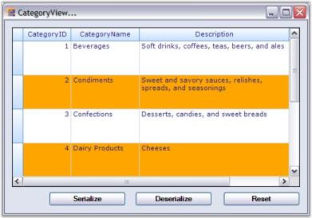
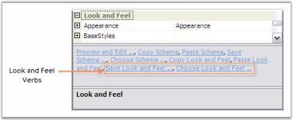

# Serialization

In this section, we will discuss how to serialize and deserialize grouping grid schema information. Serialization is the process of saving the object state into a stream of bytes for further use. The reverse process is Deserialization. Through serialization, the objects are made portable so that they can be serialized at one end and then transferred to the other end of a network where they will again be deserialized into its original form for use.

Grid Grouping control supports two forms of serialization.

## XML Serialization

With XmlSerialization, the grid schema information can be converted into XML format. Grouping Grid provides two methods to support Xml Serialization.

* WriteXmlSchema - It writes the engine settings into an XML stream(Serialization).
* ApplyXmlSchema - It loads the engine settings from an XML stream(Deserialization).

All the grid elements can be serialized. Not only the data, but also the look and feel of the grid can be serialized and deserialized. The following code example best illustrates this process.

#### Example

1. Setup a grouping grid and load it with some data. Save the initial state of the grid schema so that it could be used to reset the grid. 

   ~~~ cs

		//Knows the initial state.

		System.IO.MemoryStream stream;

		stream = new System.IO.MemoryStream();

		this.gridGroupingControl1.WriteXmlSchema(new XmlTextWriter(stream, null));

   ~~~
   {:.prettyprint }

   ~~~ vbnet

		' Knows the initial state.

		Private stream As System.IO.MemoryStream

		stream = New System.IO.MemoryStream()

		Me.gridGroupingControl1.WriteXmlSchema(New XmlTextWriter(stream, Nothing))

   ~~~
   {:.prettyprint }

2. Apply the look and feel properties that you desire.

   ~~~ cs

		//Customizes the Appearance.

		this.gridGroupingControl1.TableOptions.GridVisualStyles = GridVisualStyles.Office2007Blue;

		this.gridGroupingControl1.TableOptions.GridLineBorder = new GridBorder(GridBorderStyle.Solid, Color.FromArgb(208, 215, 229), GridBorderWeight.Thin);

		this.gridGroupingControl1.TopLevelGroupOptions.ShowCaption = false;

		this.gridGroupingControl1.Appearance.AnyCell.Font.Facename = "Verdana";

		this.gridGroupingControl1.Appearance.AnyCell.TextColor = Color.MidnightBlue;

		this.gridGroupingControl1.TableDescriptor.Appearance.AlternateRecordFieldCell.Interior = new BrushInfo(Color.Orange);

   ~~~
   {:.prettyprint }

   ~~~ vbnet

		'Customizes the Appearance.

		Me.gridGroupingControl1.TableOptions.GridVisualStyles = GridVisualStyles.Office2007Blue

		Me.gridGroupingControl1.TableOptions.GridLineBorder = New GridBorder(GridBorderStyle.Solid, Color.FromArgb(208, 215, 229), GridBorderWeight.Thin)

		Me.gridGroupingControl1.TopLevelGroupOptions.ShowCaption = False

		Me.gridGroupingControl1.Appearance.AnyCell.Font.Facename = "Verdana"

		Me.gridGroupingControl1.Appearance.AnyCell.TextColor = Color.MidnightBlue

		Me.gridGroupingControl1.TableDescriptor.Appearance.AlternateRecordFieldCell.Interior = New BrushInfo(Color.Orange)

   ~~~
   {:.prettyprint }

3. Create a button name 'Serialize', clicking which will start the serialization process. Add the code below into the ButtonClick event handler. This will save the grid schema into an XML file.

   ~~~ cs

		//Serializes.

		private void Serialize_Click(object sender, System.EventArgs e)

		{

			FileDialog dlg = new SaveFileDialog();

			dlg.AddExtension = true;

			dlg.Filter = "xml files (*.xml)|*.xml|All files (*.*)|*.*";

			if (dlg.ShowDialog() == DialogResult.OK)

			{

				XmlTextWriter xw = new XmlTextWriter(dlg.FileName, System.Text.Encoding.UTF8);

				xw.Formatting = System.Xml.Formatting.Indented;

				this.gridGroupingControl1.WriteXmlSchema(xw);

				xw.Close();

			}

		}

   ~~~
   {:.prettyprint }

   ~~~ vbnet

		'Serializes.

		Private Sub Serialize_Click(ByVal sender As Object, ByVal e As System.EventArgs) Handles btnSaveXmlSchema.Click

		Dim dlg As FileDialog = New SaveFileDialog()

		dlg.AddExtension = True

		dlg.Filter = "xml files (*.xml)|*.xml|All files (*.*)|*.*"

		If dlg.ShowDialog() = DialogResult.OK Then

		Dim xw As XmlTextWriter = New XmlTextWriter(dlg.FileName, System.Text.Encoding.UTF8)

		xw.Formatting = System.Xml.Formatting.Indented

		Me.gridGroupingControl1.WriteXmlSchema(xw)

		xw.Close()

		End If

		End Sub

   ~~~
   {:.prettyprint }

4. Create another button named 'Deserialize' to deserialize the grid. The following code will help you to load the grid schema back from an XML file.

   ~~~ cs

		//Deserializes.

		private void btnLoadXmlSchema_Click(object sender, System.EventArgs e)

		{

			FileDialog dlg = new OpenFileDialog();

			dlg.Filter = "xml files (*.xml)|*.xml|All files (*.*)|*.*";

			if (dlg.ShowDialog() == DialogResult.OK)

			{

				XmlReader xr = new XmlTextReader(dlg.FileName);

				this.gridGroupingControl1.ApplyXmlSchema(xr);

				xr.Close();

			}

		}

   ~~~
   {:.prettyprint }

   ~~~ vbnet

		'Deserializes.

		Private Sub btnLoadXmlSchema_Click(ByVal sender As Object, ByVal e As System.EventArgs) Handles btnLoadXmlSchema.Click

		Dim dlg As FileDialog = New OpenFileDialog()

		dlg.Filter = "xml files (*.xml)|*.xml|All files (*.*)|*.*"

		If dlg.ShowDialog() = DialogResult.OK Then

		Dim xr As XmlReader = New XmlTextReader(dlg.FileName)

		gridGroupingControl1.ApplyXmlSchema(xr);

		xr.Close()

		End If

		End Sub

   ~~~
   {:.prettyprint }

5. Create a third button named 'Reset', which will reset the look and feel of the grid.

   ~~~ cs

		//Resets Grid.

		private void reset_Click(object sender, System.EventArgs e)

		{

			System.IO.MemoryStream stream2 = new System.IO.MemoryStream(stream.ToArray());

			this.gridGroupingControl1.ApplyXmlSchema(new XmlTextReader(stream2));

		}

   ~~~
   {:.prettyprint }

   ~~~ vbnet

		'Resets Grid.

		Private Sub reset_Click(ByVal sender As Object, ByVal e As System.EventArgs) Handles reset.Click

		Dim stream2 As System.IO.MemoryStream = New System.IO.MemoryStream(stream.ToArray())

		Me.gridGroupingControl1.ApplyXmlSchema(New XmlTextReader(stream2))

		End Sub

   ~~~
   {:.prettyprint } 

6. While running the sample, click Serialize button and save the grid schema into an XML file. Then click Reset button to switch the grid to its default state. It removes all the appearance settings done in the first step. You can also make changes in the TableDescriptor of the grid manually like rearranging columns through drag and drop so that after reloading the grid schema, you would notice that the entire grid schema has been serialized. Reloading will transform the grouping grid back to the state before serialization.

   

   

   

> Note: For more details, refer to the following browser samples:
>
> _<Install Location>\Syncfusion\EssentialStudio\[Version Number]\Windows\Grid.Grouping.Windows\Samples\Serialization\XML Serialization Demo_
>
> _<Install Location>\Syncfusion\EssentialStudio\[Version Number]\Windows\Grid.Grouping.Windows\Samples\Serialization\Employee View Demo_

### Saving and Restoring Look and Feel Properties

You can save, look, and feel properties in XML format. This will allow you to design a basic look and feel to use with all your Grid Grouping controls, and then easily apply this look and feel to new grids at design-time or runtime.

It can be done in the following ways.

* Through Verbs 
* Through Code

#### Through Verbs

The verbs "Save Look and Feel" and "Choose Look and Feel" that are found at the bottom of the property grid of Grid Grouping control will allow you to easily accomplish this task. Use the Save verb to save Look and Feel properties of the current Grid Grouping control. Then use Choose verb to apply the saved settings to a different control.

#### Through Code

To apply the Look and Feel properties saved as XML at runtime, simply call ApplyXmlLookandFeel method. For example, the code below shows the code that is necessary to load such a file in the form's constructor.



public Form1()

{

    System.Xml.XmlReader xr = new System.Xml.XmlReader("BaseLandF.xml");

    this.gridGroupingControl1.ApplyXmlLookAndFeel(xr);

}





Public Sub New()

Dim xr As System.Xml.XmlReader = New System.Xml.XmlReader("BaseLandF.xml")

Me.gridGroupingControl1.ApplyXmlLookAndFeel(xr)

End Sub


