# Virtual Grids

Essential Grid  supports complete separation between datasource and the grid. In a virtual grid, no cell data is stored in GridStyleInfo objects or any other internal grid storage. All information is provided on demand through handled events. For example, whenever Essential Grid needs a row count for a grid, it fires QueryRowCount event. In your handler, you must provide the row count from your datasource. Virtual grids can display large amounts of data extremely fast. There is no need to perform the time-consuming task of populating the grid. 

To implement Read-only virtual grid, you have to handle three events. To remove Read-only limitation, you have to handle a fourth event. In addition to these four events, there are other events that you may want to handle depending upon the behavior you are trying to implement. You can work through virtual grid tutorial to see an implementation of a simple virtual grid.

## Getting Started

Virtual grid does not hold any data. All the data displayed by the grid is provided on demand from some external data source to the grid when it needs it. Virtual grids are ideal for displaying large amounts of data, which are already stored in some manner. This data is not moved from its original location or stored in GridStyleInfo objects. Instead, GridInfoStyle objects are created on the fly, to temporarily hold only the necessary data and are discarded when they are no longer needed. There is no data stored in the grid.

Implementing virtual grid is straight forward. Depending upon the functionality that you need, you can implement a virtual grid with as few as three events. To implement a virtual grid, you must tell the grid how many rows and columns your data source has, and provide the grid data from your data source. You must do these things in real time, only when the grid requests these data elements. When the grid needs to know the number of rows in the grid, it will fire QueryRowCount event. When it needs to know the number of columns in the grid, it will fire QueryColCount event. When it needs to know GridStyleInfo object for a particular cell, it will fire QueryCellInfo event. By handling these events and setting appropriate members of EventArgs, you are providing information that the grid needs at the time required. 

In this section, you will learn how to set up an external data source, and then display it by using a virtual grid. The first iteration will allow the display of the external data source; the second iteration will add code that allows you to edit the displayed data in the virtual grid, pushing the changes back to your data source. 

### Creating the Project and Data Source

1. In Visual Studio .NET, open File menu and select New Project. Then using either VB.NET or C#, select Windows Application project template to create a new Windows Forms project, naming it VirtualGridTutorial.

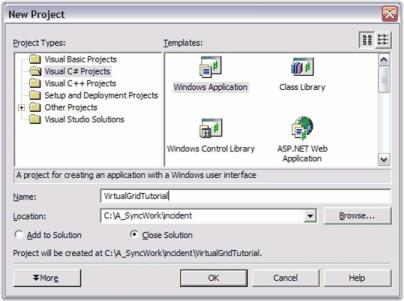 

#### Create the data source

You can set any external data source that can return value based on the row-column parameters that are passed to it. In addition, external data source should have knowledge of the number of rows and columns. This last requirement can be relaxed, but if the data source knows the number of rows and columns, it simplifies things. Our tutorial will assume that this is the case.

The external data source will be a class with two public properties (RowCount and ColCount) and two-parameter class indexer that will return the integer value associated with two integers (row and column) passed in as indexes. The exact mechanics of this class are not material to this tutorial. This class simply provides data on demand. How it stores it or how it gets it, plays no role in a virtual grid. To add DataSource class, right-click project in the Solution Explorer, point to Add, click Class, and add a class named 'ExternalData'.

Copy the following code into this file. Notice that the constructor accepts row and column count, and then populates an integer array. You can modify this class in any way you like as long as you define the class indexer and RowCount and ColCount properties, so that the virtual grid can access the data when needed. 



public class ExternalData

{

    private int _rowCount;

    private int _colCount;

    private int[,] _data;

    public ExternalData(int rows, int cols)

    {

//Sets number of rows and number of columns.

        _rowCount = rows;

        _colCount = cols;

//Allocates memory to store data values.

        _data = new int[_rowCount, _colCount];

//Just sets the data. 

        for(int i = 0; i < RowCount; ++i)

        for(int j = 0; j < ColCount; ++j)

        _data[i,j] = 100 * i + j;                

    }

//Sets Properties.

    public virtual int this[int row, int col]

    {

        get{ return _data[row, col];}

        set{ _data[row, col] = value;}

    }

    public virtual int RowCount

    {

        get{return _rowCount;}

    }

    public virtual int ColCount

    {

        get{ return _colCount;}

    }

}




Public Class ExternalData

Private _rowCount As Integer

Private _colCount As Integer

Private _data(,) As Int32

Public Sub New(ByVal rows As Integer, ByVal cols As Integer)

MyBase.New()

'Sets number of rows and number of columns.

_rowCount = rows

_colCount = cols

'Allocates memory to store data values.

_data = New Integer(_rowCount - 1, _colCount - 1) {}

'Just sets data.

Dim i As Integer

i = 0

Do While (i < RowCount)

Dim j As Integer

j = 0

Do While (j < ColCount)

_data(i, j) = ((100 * i) + j)

j = (j + 1)

Loop

i = (i + 1)

Loop

End Sub

'Sets Properties.

Public Overridable ReadOnly Property RowCount() As Integer

Get

Return _rowCount

End Get

End Property

Public Overridable ReadOnly Property ColCount() As Integer

Get

Return _colCount

End Get

End Property

Default Public Overridable Property Item(ByVal row As Integer, ByVal _

                                       col As Integer) As Integer

Get

Return _data(row, col)

End Get

Set(ByVal Value As Integer)

_data(row, col) = Value

End Set

End Property

End Class


### Adding Virtual Grid

To add a Virtual Grid to your application:

1. Select the form, open the toolbox and drag a Grid control onto your form.
   N> Do not change the values of the RowCount or ColCount properties for the grid. Let the default values remain as it is. These values will be provided dynamically as part of the virtual grid implementation.

   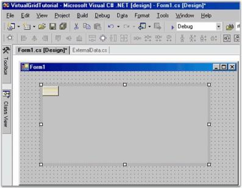 

2. Customize the other properties such as BorderStyle, etc.

   ### Initializing the Virtual Grid

   To initialize the Virtual Grid added to your application

   1. Double-click the form's background so that a handler for the form's load event is added to your code.
   2. Add an ExternalData member to your form with the code given below.

   ~~~ cs

				//Adds an external data member.

				private ExternalData _extData;

   ~~~				
   {:.prettyprint}

   ~~~ vbnet

				'Adds an external data member.

				Private _extData as ExternalData

   ~~~				
   {:.prettyprint}

3. Then in your Form1_Load handler, add the following code to initialize the external data source and hook up the Grid control events so that the grid can use external data source to get data in demand. The events of interest are GridControl.QueryRowCount, GridControl.QueryColCount and GridControl.QueryCellInfo. The call to ResetVolatileData tells the grid that it needs to reset properties like RowCount and ColCount the next time they are needed. This will allow the event handlers to set these values.

   ~~~ cs

					private void Form1_Load(object sender, System.EventArgs e)

					{

					//Creates a new external data source with 100 rows and 20 columns.

						this._extData = new ExternalData(100, 20);

					//Prepares the grid for virtual data.

						gridControl1.ResetVolatileData();

					//Hooks up the events needed for the virtual grid.

						gridControl1.QueryCellInfo += new GridQueryCellInfoEventHandler(GridQueryCellInfo);

						gridControl1.QueryRowCount += new GridRowColCountEventHandler(GridQueryRowCount);

						gridControl1.QueryColCount += new GridRowColCountEventHandler(GridQueryColCount);

					}

   ~~~
   {:.prettyprint}
   
   ~~~ vbnet

					Private Sub Form1_Load(ByVal sender As Object, ByVal e As EventArgs)

					'Creates a new external data source with 100 rows and 20 columns.

					Me._extData = New ExternalData(100, 20)

					'Prepares the grid for virtual data.

					gridControl1.ResetVolatileData()

					' Hooks up the events needed for the virtual grid.

					'While only the QueryCellInfo is absolutely required, it would be unusual not to handle at least one of the count events.

					AddHandler gridControl1.QueryCellInfo, New _GridQueryCellInfoEventHandler(AddressOf GridQueryCellInfo)

					AddHandler gridControl1.QueryRowCount, New _GridRowColCountEventHandler(AddressOf GridQueryRowCount)

					AddHandler gridControl1.QueryColCount, New _GridRowColCountEventHandler(AddressOf GridQueryColCount)

					End Sub

   ~~~				
   {:.prettyprint}
   
### Style Properties

In your GridQueryCellInfo handler, it is possible to set style properties other than CellValue. For example, the code that follows will color any value that is divisible by three. To set properties other than the CellValue, change your QueryCellInfo event handler as shown below.



void GridQueryCellInfo(object sender, GridQueryCellInfoEventArgs e) 

{

    if (e.RowIndex > 0 && e.ColIndex > 0)

    {

//Sets Cell Value.

        e.Style.CellValue = this._extData[e.RowIndex - 1, e.ColIndex - 1];

//Applies conditional formatting.

        if(this._extData[e.RowIndex - 1, e.ColIndex - 1] % 3 == 0)

                e.Style.BackColor = Color.LightPink;

        e.Handled = true;

    }

}





Private Sub GridQueryCellInfo(ByVal sender As Object, ByVal e _As GridQueryCellInfoEventArgs)

If ((e.RowIndex > 0) AndAlso (e.ColIndex > 0)) Then

'Sets Cell Value.

e.Style.CellValue = Me._extData(e.RowIndex - 1, e.ColIndex - 1)

'Applies conditional formatting.

If ((Me._extData(e.RowIndex - 1, e.ColIndex - 1) Mod 3) = 0) Then

e.Style.BackColor = Color.LightPink

End If

e.Handled = True

End If

End Sub



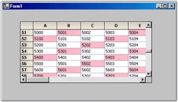 

### Handling Events to Retrieve Data for Virtual Grid

To retrieve data for the Virtual Grid from the external data source,

1. Add event handlers for QueryRowCount and QueryColCount events. Use the following code in your event handlers.

   GridQueryRowCount and GridQueryColCount provide the number of rows and columns from the external data source. Thus, the implementation code will access public properties of our external data object to get these values.

   ~~~ cs

				//Sets number of rows from external data source.

				void GridQueryRowCount(object sender, GridRowColCountEventArgs e) 

				{

					e.Count = this._extData.RowCount;

					e.Handled = true;

				}

				//Sets number of columns from external data source.

				void GridQueryColCount(object sender, GridRowColCountEventArgs e) 

				{

					e.Count = this._extData.ColCount;

					e.Handled = true;

				}
   ~~~
   {:.prettyprint}

   ~~~ vbnet

				'Sets number of rows from external data source.

				Private Sub GridQueryRowCount(ByVal sender As Object, ByVal e _As GridRowColCountEventArgs)

				e.Count = Me._extData.RowCount

				e.Handled = True

				End Sub

				'Sets number of columns from external data source.

				Private Sub GridQueryColCount(ByVal sender As Object, ByVal e _As GridRowColCountEventArgs)

				e.Count = Me._extData.ColCount

				e.Handled = True

				End Sub

   ~~~
   {:.prettyprint}

2. Add QueryCellInfo event handler.
3. GridQueryCellInfo is the event handler where the grid expects external data source to provide cell values that are in demand. Here is how it can be implemented with external data source. Recall that row 0 and column 0 are usually the header columns in a grid. In the GridQueryCellInfo, do not provide these values and use the default headers. If you need to provide special header values, you can do so.

   ~~~ cs

				void GridQueryCellInfo(object sender, GridQueryCellInfoEventArgs e) 

				{

					if (e.RowIndex > 0 && e.ColIndex > 0)

					{

						e.Style.CellValue = this._extData[e.RowIndex - 1, e.ColIndex - 1];

						e.Handled = true;

					}

				}

   ~~~				
   {:.prettyprint}

   ~~~ vbnet
				Private Sub GridQueryCellInfo(ByVal sender As Object, ByVal e _As GridQueryCellInfoEventArgs)

				If ((e.RowIndex > 0) AndAlso (e.ColIndex > 0)) Then

				e.Style.CellValue = Me._extData(e.RowIndex - 1, e.ColIndex - 1)

				e.Handled = True

				End If

				End Sub

				Notice that all the three handlers set Handled property on EventArgs when a value is provided. This informs the grid that no further processing is needed. Do not forget this or you will lose some of the benefits of using a virtual grid. 

   ~~~
   {:.prettyprint}

4. Compile and run the project. You will see something similar to the screen shot below. The point is that the grid itself does not hold any data. All the information is provided on demand through the three events that you have added.

   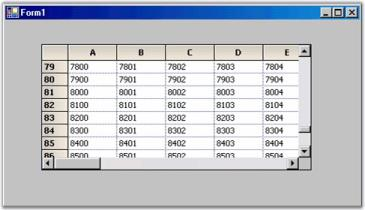 

   {:.prettyprint}

### Saving Edited Values

While working on Virtual Grid, you will see that the changes do not stay around after you leave the current cell, i.e., if you over type a cell entry, when you move off the cell, the old value is restored. The reason is that currently, there is no way for the changed value to be moved back to the external data source. So, as you move off the cell, when the grid redraws the old cell, it will query the external data source (through GridQueryCellInfo), get the original value and display it. The value you had typed will be lost. In order to edit and save values in the Virtual Grid, you must get the changed value back to the external data source. This is accomplished through GridControl.SaveCellInfo event. You must add a handler for this event and in this handler, you must save the changed value back to the external data source.



private void Form1_Load(object sender, System.EventArgs e)

{

//Creates a new external data source with 100 rows and 20 columns.

    this._extData = new ExternalData(100, 20);

//Hooks up the events needed for the virtual grid.

    gridControl1.ResetVolatileData();

    gridControl1.QueryCellInfo += new GridQueryCellInfoEventHandler( GridQueryCellInfo);

    gridControl1.QueryRowCount += new GridRowColCountEventHandler( GridQueryRowCount);

    gridControl1.QueryColCount += new GridRowColCountEventHandler( GridQueryColCount);

//Handles saving data back to the data source.

    gridControl1.SaveCellInfo += new GridSaveCellInfoEventHandler( GridSaveCellInfo);

}

void GridSaveCellInfo(object sender, GridSaveCellInfoEventArgs e)

{

    try

    {

//Moves the changes back to the external data object.

        if( e.ColIndex > 0 && e.RowIndex > 0)

        {

            this._extData[e.RowIndex - 1, e.ColIndex - 1] = int.Parse(e.Style.CellValue.ToString());

        }

    }

    catch{}

    e.Handled = true;

}




Private Sub Form1_Load(ByVal sender As Object, ByVal e As EventArgs)

'Creates a new external data source with 100 rows and 20 columns.

Me._extData = New ExternalData(100, 20)

'Prepares the grid for virtual data.

gridControl1.ResetVolatileData()

'Hooks up the events needed for the virtual grid.

'While only the QueryCellInfo is absolutely required, it would be unusual not to handle at least one of the count events.

AddHandler gridControl1.QueryCellInfo, New _GridQueryCellInfoEventHandler(AddressOf GridQueryCellInfo)

AddHandler gridControl1.QueryRowCount, New _GridRowColCountEventHandler(AddressOf GridQueryRowCount)

AddHandler gridControl1.QueryColCount, New _GridRowColCountEventHandler(AddressOf GridQueryColCount)

'Handles saving data back to the data source.

AddHandler gridControl1.SaveCellInfo, New _GridSaveCellInfoEventHandler(AddressOf GridSaveCellInfo)

End Sub

Private Sub GridSaveCellInfo(ByVal sender As Object, ByVal e _As GridSaveCellInfoEventArgs)

Try

'Moves the changes back to the external data object.

If ((e.ColIndex > 0) AndAlso (e.RowIndex > 0)) Then

Me._extData((e.RowIndex - 1), (e.ColIndex - 1)) = _System.Int32.Parse(e.Style.CellValue.ToString)

End If

Catch ex As System.Exception

End Try

e.Handled = True

End Sub



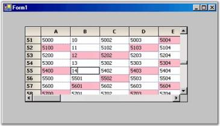 

### Setting Properties in a Virtual Grid

So far you have seen that you can provide any GridStyleInfo property in a virtual manner by merely handling the Grid control's QueryCellInfo event. You can also provide the row count and column count in a virtual manner.

Here is a list of the other events that will allow virtual access to an Essential Grid.

* QueryRowHeight-This event allows you to dynamically provide row heights.
* QueryColWidth-This event allows you to dynamically provide column widths.
* QueryCoveredRange-This event allows you to dynamically provide covered cell ranges.



//Provides the row heights on demand - optional...

void GridQueryRowHeight(object sender, GridRowColSizeEventArgs e)

{

    if( e.Index % 2 == 0)

    {

        e.Size = 20;

        e.Handled = true;

    }

}

//Provides the col widths on demand - optional...

void GridQueryColWidth(object sender, GridRowColSizeEventArgs e)

{

    if( e.Index % 3 == 0)

    {

        e.Size = 40;

        e.Handled = true;

    }

}

//Provides covered range on demand - optional...

void GridQueryCoveredRange(object sender, GridQueryCellRangeEventArgs e) 

{

//Covers odd rows, columns 1 through 3.

    if (e.RowIndex % 2 == 1 && e.ColIndex >= 1 && e.ColIndex <= 3)

    {

        e.Range = GridRangeInfo.Cells(e.RowIndex, 1, e.RowIndex, 3);

        e.Handled = true;

    }

//Covers column 6 with odd-even row pairs.

    if (e.RowIndex > 0 && e.ColIndex == 6)

    {

        int row = (e.RowIndex-1) /2 * 2 + 1;

        int col = e.ColIndex;

        e.Range = GridRangeInfo.Cells(row, col, row+1, col);

        e.Handled = true;

    }

}




Private Sub GridQueryRowHeight(ByVal sender As Object, ByVal e As _GridRowColSizeEventArgs)

If ((e.Index Mod 2) = 0) Then

e.Size = 20

e.Handled = True

End If

End Sub

Private Sub GridQueryColWidth(ByVal sender As Object, ByVal e As _GridRowColSizeEventArgs)

If ((e.Index Mod 3) = 0) Then

e.Size = 40

e.Handled = True

End If

End Sub

Private Sub GridQueryCoveredRange(ByVal sender As Object, ByVal e As _GridQueryCellRangeEventArgs)

'Covers odd rows, columns 1 through 3.

'Covers column 6 with odd-even row pairs.

If ((((e.RowIndex Mod 2) = 1) AndAlso (e.ColIndex >= 1)) _AndAlso (e.ColIndex <= 3)) Then

e.Range = GridRangeInfo.Cells(e.RowIndex, 1, e.RowIndex, 3)

e.Handled = True

End If

If ((e.RowIndex > 0) AndAlso (e.ColIndex = 6)) Then

Dim row As Integer

row = ((((e.RowIndex - 1) / 2) * 2) + 1)

Dim col As Integer

col = e.ColIndex

e.Range = GridRangeInfo.Cells(row, col, (row + 1), col)

e.Handled = True

End If

End Sub


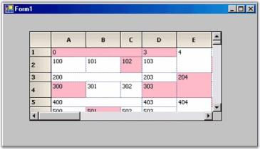 

### Type Conversions

You will notice that in GridSaveCellInfo method, you had used int.Parse method to convert string value in the GridStyleInfo object to the integer you needed for the external data source. You can instead make use of the more general Convert class provided by Essential Grid to handle conversions between various data types. This class, for example, can convert the value in CellValue property to DataTime object or to Color object, depending upon the need. The following code example illustrates how to use this Convert class.


// Converts a value in CellValue property to 'int' (as required by our data source) by using Convert class.

this._extData[e.RowIndex - 1, e.ColIndex - 1] = (int)GridCellValueConvert.ChangeType(e.Style.CellValue, typeof(int), null);




'Converts a value in CellValue property to 'int' (as required by our data source) by using Convert class.

Me._extData(e.RowIndex - 1, e.ColIndex - 1) = CInt(GridCellValueConvert.ChangeType(e.Style.CellValue, GetType(Integer), Nothing))

N> This conversion problem may occur when the value that is stored in the style object is a string. This happens when the CellValueType property is not explicitly set on the style object in your GridQueryCellInfo method. But when this is set to "int", then you can cast the CellValue in SaveCellInfo to an int, and do not have to worry about conversions.

## Required Events

These are the three events that you should handle in order to implement a virtual grid. They provide the basic information about the number of rows, columns, and the values for your data. 

### QueryRowCount Event

This event is used to return the row count on demand. Here is a sample handler. 


private void GridQueryRowCount(object sender, GridRowColCountEventArgs e)

{

//Determines number of rows.

    e.Count = this.numArrayRows;

    e.Handled = true;

}




Private Sub GridQueryRowCount(ByVal sender As Object, ByVal e As GridRowColCountEventArgs)

'Determines number of rows.

e.Count = Me.numArrayRows

e.Handled = True

End Sub


### QueryColCount Event

QueryColCount event is used to return column count on demand. Note that when you handle the event by assigning e.Count, you are setting the e.Handled property to true. 



private void GridQueryColCount(object sender, GridRowColCountEventArgs e)

{

//Determines the number of columns.

    e.Count = this.numArrayCols;

    e.Handled = true;

}




Private Sub GridQueryColCount(ByVal sender As Object, ByVal e As GridRowColCountEventArgs)

'Determines the number of columns.

e.Count = Me.numArrayCols

e.Handled = True

End Sub


### QueryCellInfo Event

QueryCellInfo is the workhorse event. It is used to provide GridStyleInfo object for a given cell. In your handler for this event, you would normally set CellValue for GridStyleInfo object passed in with event arguments. But, you can also set other members of this GridStyleInfo object. For example, you can set BackColor to change the cell background. All of this is done on a demand basis. BackColor value is not stored in any grid storage. There is another event, PrepareViewStyleInfo that you can handle to make transient adjustment to a style just before it is displayed. This event is discussed in more detail later in this section. 

GridQueryCellInfoEventArgs members, e.ColIndex and e.RowIndex, specify the column and row of the requested style. The e.Style member holds GridStyleInfo object whose value this event should set provided it is a cell that you want to populate. It is possible that e.ColIndex and / or e.RowIndex may have the value of -1. A -1 indicating that rowstyle or columnstyle is being requested. So, e.ColIndex = -1 and e.RowIndex = 4 indicates that the rowstyle for row 4 is being requested (GridControl.RowStyles[4]). Similarly, positive column value with row value = -1 would be a request for that particular columnstyle. If both values are -1, then TableStyle property is being requested. 

One last comment before we look at the code. Header rows and columns in an Essential Grid are treated the same as other rows and columns with respect to QueryCellInfo. If you have a single header row, then anytime e.ColIndex is 0, a row header is being requested. Similarly, if you have a single column header row, e.RowIndex = 0 is a request for the column header.


private void GridQueryCellInfo(object sender, GridQueryCellInfoEventArgs e)

{

    if(e.ColIndex > 0 && e.RowIndex > 0)

    {

//By using indexers, pass value to a cell from a given data source.

        e.Style.CellValue = this.intArray[e.RowIndex - 1, e.ColIndex - 1];

        e.Handled = true;

    }

}




Private Sub GridQueryCellInfo(ByVal sender As Object, ByVal e As GridQueryCellInfoEventArgs)

If ((e.ColIndex > 0) AndAlso (e.RowIndex > 0)) Then

'By using indexers indexers, pass value to a cell from a given data source.

e.Style.CellValue = Me.intArray(e.RowIndex - 1, e.ColIndex - 1)

e.Handled = True

End If

End Sub


## Optional Events

Optional events can be used to extend the functionality of the basic Read-only virtual grid that you get by handling these three required events. One event lets you save information back into your external datasource while other events let you dynamically specify row heights and column widths. You can also dynamically provide covered cell ranges. 

### SaveCellInfo Event

This event is used to store data back into your data source when it has been changed by the user. Here is a sample handler. 



void GridSaveCellInfo(object sender, GridSaveCellInfoEventArgs e)

{

    if( e.ColIndex > 0 && e.RowIndex > 0)

    {

//Stores data back to the data source from the grid cell.

        this._extData[e.RowIndex - 1, e.ColIndex - 1] = int.Parse(e.Style.CellValue.ToString());

        e.Handled = true;

    }

}




Private Sub GridSaveCellInfo(ByVal sender As Object, ByVal e As GridSaveCellInfoEventArgs)

If ((e.ColIndex > 0) AndAlso (e.RowIndex > 0)) Then

'Stores data back to the data source from the grid cell.

Me._extData((e.RowIndex - 1), (e.ColIndex - 1)) = System.Int32.Parse(e.Style.CellValue.ToString())

e.Handled = True

End If

End Sub


### QueryRowHeight

This event is used to return row heights that are in demand. 


void GridQueryRowHeight(object sender, GridRowColSizeEventArgs e)

{

    if( e.Index % 2 == 0)

    {

//Determines Row Height.

        e.Size = 20;

        e.Handled = true;

    }

}




Private Sub GridQueryRowHeight(ByVal sender As Object, ByVal e As GridRowColSizeEventArgs)

If ((e.Index Mod 2) = 0) Then

'Determines Row Height.

e.Size = 20

e.Handled = True

End If

End Sub


### QueryColWidth

This event is used to return column widths that are in demand. Here is a sample handler. 


void GridQueryColWidth(object sender, GridRowColSizeEventArgs e)

{

if( e.Index % 3 == 0)

{

//Assigns Column Width.

e.Size = 40;

e.Handled = true;

}

}




Private Sub GridQueryColWidth(ByVal sender As Object, ByVal e As GridRowColSizeEventArgs)

If ((e.Index Mod 3) = 0) Then

'Assigns Column Width.

e.Size = 40

e.Handled = True

End If

End Sub


### QueryCoveredRange

This event is used to provide covered ranges on demand. If you have a pattern of cells covered, then you can use this event to provide the ranges.


void GridQueryCoveredRange(object sender, GridQueryCoveredRangeEventArgs e) 

{

//Covers odd rows, columns 1 through 3.

    if (e.RowIndex % 2 == 1 && e.ColIndex >= 1 && e.ColIndex <= 3)

    {

        e.Range = GridRangeInfo.Cells(e.RowIndex, 1, e.RowIndex, 3);

        e.Handled = true;

    }

//Covers column 6 with odd-even row pairs.

    if (e.RowIndex > 0 && e.ColIndex == 6)

    {

        int row = (e.RowIndex-1)/2 * 2 + 1;

        int col = e.ColIndex;

        e.Range = GridRangeInfo.Cells(row, col, row+1, col);

        e.Handled = true;

    }

}




Private Sub GridQueryCoveredRange(ByVal sender As Object, ByVal e As GridQueryCoveredRangeEventArgs)

'Covers odd rows, columns 1 through 3.

If ((((e.RowIndex Mod 2) = 1) AndAlso (e.ColIndex >= 1)) _

AndAlso (e.ColIndex <= 3)) Then

e.Range = GridRangeInfo.Cells(e.RowIndex, 1, e.RowIndex, 3)

e.Handled = True

End If

'Covers column 6 with odd-even row pairs.

If ((e.RowIndex > 0) AndAlso (e.ColIndex = 6)) Then

Dim row As Integer

row = ((((e.RowIndex - 1) / 2) * 2) + 1)

Dim col As Integer

col = e.ColIndex

e.Range = GridRangeInfo.Cells(row, col, (row + 1), col)

e.Handled = True

End If

End Sub


### Pivot Grid

Essential Pivot Grid simulates Pivot Table feature of MS Excel. Pivot Grid pivots data via drag-and-drop to organize data in a cross-tabulated form. The major advantage of pivot grid is that you can extract any desired information within a limited span of time. Apart from being able to present the data in a proper manner, you can also summarize and group data. Pivot Grid has its main application in the financial domain. It is used to organize and analyze business data.

Pivot Grid control is built on the foundation of the Grid control. It comprises of the following components.

* Display Grid - Displays data extracted from the underlying database.
* Pivot Table Field List - Lists available fields from the database. Provides a way to add/remove fields from the grid.
* Drag-Drop Panel - Serves as a view state of the pivot grid, where you can rearrange the fields by performing drag-and-drop operation between row and column label areas.
* Filter Area - Lets you filter the results according to certain criteria in a desired manner.

 Pivot Grid provides UI that allows you to specify the rows and columns in the pivot table through drag-and-drop operations. The visual aspects of the control are saved in an Appearance object. The control supports Office 2003 and Office 2007 styles.

Calculations are done through Grouping Engine, which is a part of Essential Grouping. The default calculation is Summation, but there exists an option to change calculation type to Average, Median, Percentiles, Variances, Standard Deviations, etc. You can also provide "custom" calculations through the grouping engine.

### Features

* Data-binding support
* Auto-calculation of Total Summary
* Filters
* Grouping support
* Customizable Appearance
* Support for XML and Binary Serialization

### APIs

Here is a brief explanation on some of the important methods implemented in Pivot Grid.

* CollapseAll() - This will collapse all the expanded tables in the Pivot Grid.



pivotGridControl1.CollapseAll();



* ExpandAll() - Expands all the collapsed nodes in the Pivot Grid.



pivotGridControl1.ExpandAll();


* InitSchema() - A new Pivot schema will be created and it will be associated with the Pivot Grid.



pivotGridControl1.InitSchema();



* ResetSchema() - Resets Pivot Grid control into an initial schema, which will be empty.



pivotGridControl1.ResetSchema();


* SetAppearance() - This method sets the appearance of the Pivot Grid.


pivotGridControl1.SetAppearance(new PivotGridLibrary.PivotAppearance(pivotGridControl2));

Here is a brief explanation on some of the important properties implemented in the Pivot Grid.

* AllString - This will get the string values that appear in the dropdown filter, when all the filter values get selected.


pivotGridControl1.AllString = "All";


* AutoSizeColumns - Sizes the column according to the calculated value of the display width.


pivotGridControl1.AutoSizeColumns = true;


* ColumnCount - This specifies the number of columns in the main display grid.



int i = pivotGridControl1.ColumnCount;


* ColumnsCount - This specifies the number of distinct fields in the pivot grid.


int i = pivotGridControl1.ColumnsCount;



* DataRowCount - This specifies the number of rows in the underlying IList datasource.



int i = pivotGridControl1.DataRowCount;



* DefaultComputationName - This specifies the name of the default calculation. The default value is _Sum_.



pivotGridControl1.DefaultComputationName = "Sum";



* DefaultDescriptionFormat - This specifies the format of calculated description. By default it will be, _{0} of {1}_, where {0} is the value of computation name and {1} is the value of the field name.



pivotGridControl1.DefaultDescriptionFormat = "{0} of {1}";



* FilterCount - This specifies the number of distinct fields added to the filter.



int i = pivotGridControl1.FilterCount;



* FreezeHeaders - This determines whether the row and column headers should be frozen.


pivotGridControl1.FreezeHeaders = true;


* GrandTotalString - This provides the text for the summary cells of the Pivot Grid.



pivotGridControl1.GrandTotalString = "Grand Total";



* LeftPanelWidth - This specifies the width of the left-most Panel.


pivotGridControl1.LeftPanelWidth = 20;


* LeftPanelHeight - This specifies the height of the top-most Panel.



pivotGridControl1.LeftPanelHeight = 20;



* MainDisplayGrid - This is a basic grid, which stores the pivot results.
* MultipleString - This specifies the text that should appear when the Multiple Filter selected in the Filter Combo Box is changed. By default it will be set to Multiple.


pivotGridControl1.MultipleString = "Multiple";


* Print Option - The print option is extended for the PivotGrid control to allow users to preview the contents before the contents are printed on paper.

This feature is used to print PivotGrid control in landscape and portrait views. This feature has overridden GridPrintDocumentAdv from Syncfusion.GridHelperClasses.Windows. 

The pivot grid visual style color is automatically applied in the printed document based on the visual styles of the grid. 

The print functionality can be invoked using the following code:

 


private void button1_Click_1(object sender, EventArgs e)

{

 try

   {

PivotGridPrintDocumentAdv pd = new PivotGridPrintDocumentAdv(this.pivotGridControl1);

pd.DefaultPageSettings.Margins = new System.Drawing.Printing.Margins(25, 25, 25, 25);

PrintPreviewDialog previewDialog = new PrintPreviewDialog();

previewDialog.Document = pd;

previewDialog.Show();

   }

catch (Exception ex)

   {

MessageBox.Show("Error while print preview" + ex.ToString());

   }

}





Private Sub button1_Click_1(ByVal sender As Object, ByVal e As EventArgs)

 Try

Dim pd As New PivotGridPrintDocumentAdv(Me.pivotGridControl1)

pd.DefaultPageSettings.Margins = New System.Drawing.Printing.Margins(25, 25, 25, 25)

Dim previewDialog As New PrintPreviewDialog()

previewDialog.Document = pd

previewDialog.Show()

Catch ex As Exception

MessageBox.Show("Error while print preview" & ex.ToString())

End Try

End Sub



The following screen shots illustrate the print feature of the PivotGrid control: Headers and footers can also be added by using DrawGridPrintHeader and DrawGridPrintFooter events. The following code illustrates how to add the header and footer.


pd.DrawGridPrintHeader+=new GridPrintDocumentAdv.DrawGridHeaderFooterEventHandler(pd_DrawGridPrintHeader);



pd.DrawGridPrintFooter+=new GridPrintDocumentAdv.DrawGridHeaderFooterEventHandler(pd_DrawGridPrintFooter);





AddHandler pd.DrawGridPrintHeader, AddressOf pd_DrawGridPrintHeader




AddHandler pd.DrawGridPrintFooter, AddressOf pd_DrawGridPrintFooter



The following image shows the printed output of the pivot grid:

 

### Sample Link

    <Install Location>\Syncfusion\EssentialStudio\[Version Number]\Windows\PivotGrid.Windows\Samples\Printing\Pivot Print Demo

### Appearance

This section comprises the following:

### GridFormatCellDialog

GridFormatCellDialog simulates FormatCells dialog feature of MS Excel. It provides numerous formatting options such as Font, Alignment, Background, and Number, which aid in formatting grid cells dynamically. It is now available as an add-on feature for Essential Grid control. GridFormatCellDialog class accepts an instance of the Grid control to be formatted, and exposes the above mentioned formatting options to operate on grid cells that are selected. Below image illustrates such a sample dialog.

 

### Setting up GridFormatCellDialog

This GridFormatCellDialog can be enabled by instantiating GridFormatCellDialog class and invoking its ShowDialog method. 

N> You must select the cells to be formatted before activating this dialog.



GridFormatCellDialog formatDialog = new GridFormatCellDialog(this.gridControl1);

formatDialog.ShowDialog();





Dim formatDialog As GridFormatCellDialog = New GridFormatCellDialog(Me.gridControl1)

formatDialog.ShowDialog()



### Formatting Options

#### Font Tab

This provides options to set the font, font style, font size, font effects, and font color for the desired grid cells.

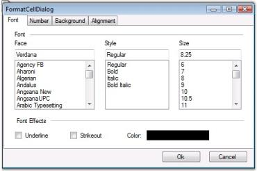

#### Number Tab

This allows you to specify text format for grid cells. The possible options are Number, Currency, Percentage, Date, Time, Scientific and Text.

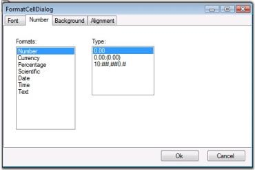

#### Background Tab

This allows you to set background color for grid cells. You can set gradient shades and pattern styles as well.

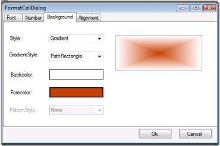

#### Alignment Tab

This provides various cell alignment options such as Horizontal Alignment, Vertical Alignment, Merge Cells, Wrap Text, and so on.

### Grid Visual Styles

This section provides information on VisualStyles and ThemesEnabled properties (XP themes) of the Essential Grid. Essential Grid supports a range of appearances for grid cells. Styles can be set to the grid control by assigning Syncfusion.Windows.Forms.GridVisualStyles enumeration value to the GridVisualStyles property.

 

The figure above displays various visual styles in VisualStyles group box in UI for Essential Grid.

Following code example illustrates how to set visual style for Grid control.


//Sets an Office 2007 Blue skin theme to the Essential Grid control.

gridControl1.GridVisualStyles = Syncfusion.Windows.Forms.GridVisualStyles.Office2007Blue;





'Sets an Office 2007 Blue skin theme to the Essential Grid control.

gridControl1.GridVisualStyles = Syncfusion.Windows.Forms.GridVisualStyles.Office2007Blue



ThemesEnabled property determines whether XP Themes (visual styles) can be used for this control or not, when available. Following code example illustrates how to set the theme for the Grid control.



this.gridControl1.ThemesEnabled = true;




Me.gridControl1.ThemesEnabled = True


### Grid Control Designer

This section elaborates upon Grid control's edit designer. Grid control has an excellent user friendly design-time support. A Grid control's edit designer is added to the grid to ease the process of designing Grid control on a cell level. Using the editor, Grid can be modified, saved, and loaded to XML formatted files or to SOAP formatted templates. 

Following is the step-by-step procedure to edit Grid control's cell styles using GridControl Designer window:

1. Right click the Grid control. A context menu is displayed.
2. Select Edit from the context menu drop-down. The figure below illustrates this user-action:

    

   N> Editor opens up on the right hand side of the page and Grid Properties tab is highlighted by default. The cell content, styles and general grid properties can be modified under Grid Properties tab.

   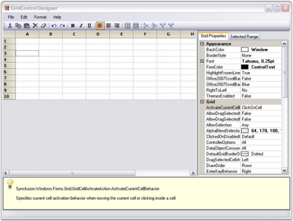 

   The figure above shows GridControl Designer window with Grid Properties tab.

   Modifying the Properties of a Selected Range

   To modify properties of a selected range, follow the steps listed below:

   1. Select a range of cells.
   2. Click Selected Range tab to view Property grid for the selection.

   

   The figure above shows the Property grid under Selected Range tab in GridControl Designer window.

3. Make the required modifications in the property grid so that they are affected in the selected range of the main grid.
4. Exit editor after modifications are done. 

   N> The system prompts you to save the changes to the Grid control in the designer if exited without saving.
   
   
### Grid Properties

Essential Grid provides support to customize the appearance and behavior of grid cells. This section would provide you more insight on the properties affecting Appearance, Print Styles, and Scroll Bar Settings available. It includes the following topics.

### Appearance Properties

The properties that majorly affect the appearance cells and data in cells of a grid can be named as Appearance properties.

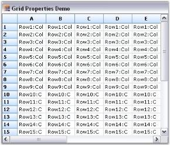

The following properties are used to customize the appearance of Grid.

* TransparentBackground - Specifies whether to display grid with background image. When this property is set to false, the background image will not be displayed even if it is set by using BackgroundImage property.

The following code examples can be used to set this property:



//Enables TransparentBackground property.

this.gridControl1.TransparentBackground = true;




'Enables TransparentBackground property.

Me.gridControl1.TransparentBackground = True


The following illustration shows how the Grid in "Figure 1" is transformed when the TransparentBackground property is set to true.

* DisplayHorzLines - Specifies whether horizontal grid lines marking the cells are to be displayed. Default value is set to _true_.

The following code examples can be used to set this property:


//Enables DisplayHorzLines property.

this.gridControl1.Properties.DisplayHorzLines = false;





'Enables DisplayHorzLines property.

Me.gridControl1.Properties.DisplayHorzLines = False


The following illustration shows how the Grid in "Figure 1" is transformed when the Properties.DisplayHorzLines property is set to false.

 

* DisplayVertLines-Specifies whether vertical grid lines marking the cells are to be displayed. Default value is set to _true_.

The following code examples can be used to set this property:


//Enables DisplayVertLines property.

this.gridControl1.Properties.DisplayVertLines = false;




'Enables DisplayVertLines property.

Me.gridControl1.Properties.DisplayVertLines = False


The following illustration shows how the Grid in "Figure 1" is transformed when the Properties.DisplayVertLines property is set to false.

 

* ColHeaders-Specifies whether column headers are to be displayed. Default value is set to _true_.

The following code examples can be used to set this property:


//Hides the column headers.

this.gridControl1.Properties.ColHeaders = false;




'Hides the column headers.

Me.gridControl1.Properties.ColHeaders = False



The following illustration shows how the Grid in "Figure 1" is transformed when Properties.ColHeaders property is set to false.

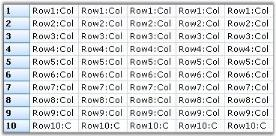

* RowHeaders - Specifies whether row headers are to be displayed. Default value is set to _true_.

The following code examples can be used to set this property:



//Hides the row headers.

this.gridControl1.Properties.RowHeaders = false;





'Hides the row headers.

Me.gridControl1.Properties.RowHeaders = False


The following illustration shows how the Grid in "Figure 1" is transformed when the Properties.RowHeaders property is set to false.

* Buttons3D - Specifies if the row and column headers should have a three dimensional look, which in turn makes headers visually appealing. If this property is set to false, the row and column headers will appear flat. Default value is set to _true_.

The following code examples can be used to set this property:



//Enables Buttons3D property.

this.gridControl1.Properties.Buttons3D = false;




'Enables Buttons3D property.

Me.gridControl1.Properties.Buttons3D = False


The following illustration shows how the Grid in "Figure 1" is transformed when Properties.Buttons3D property is set to false.

* GridLineColor - Specifies the color for the grid lines (for example, active border). Default value is set to _GrayText_.

The following code examples can be used to set this property:



//Specifiesthe color for the grid lines.

this.gridControl1.Properties.GridLineColor = System.Drawing.Color.IndianRed;




'Specifies the color for the grid lines.

Me.gridControl1.Properties.GridLineColor = System.Drawing.Color.IndianRed



The following illustration shows how the Grid in "Figure 1" is transformed when the Properties.GridLineColor property is set to IndianRed.

 

* BackgroundImage - Enables background image to be inserted for the grid.

The following code examples can be used to set this property:


// Specifies the background image.

this.gridControl1.BackgroundImage = Image.FromFile(FindImageFile(@"..\..\..\..pic.jpg"));




'Specifies the background image.

Me.gridControl1.BackgroundImage = Image.FromFile(FindImageFile("..\..\..\..pic.jpg"))


The following illustration shows how the Grid in "Figure 1" is transformed when the BackgroundImage property is set.

 

* TextColor-Specifies the color of the text in the grid.

The following code examples can be used to set this property:


//Sets grid text color.

this.gridControl1.TableStyle.TextColor = Color.MidnightBlue;




'Sets grid text color.

Me.gridControl1.TableStyle.TextColor = Color.MidnightBlue



The following illustration shows how the Grid in "Figure 1" is transformed when TableStyle.TextColor property is set to MidnightBlue.

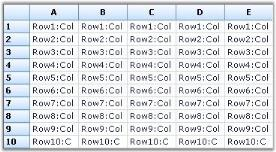

* BackColor-Specifies the color of the grid line marker when the user resizes rows or columns by dragging row or column headers. Default value is set to _Red_.

The following code examples can be used to set this property:



//Sets the grid background color.

this.gridControl1.BackColor = Color.Beige;





'Sets the grid background color.

Me.gridControl1.BackColor = Color.Beige


The following illustration shows how the Grid in "Figure 1" is transformed when the BackColor property is set to Beige.

* ResizingCellsLinesColor - Specifies the color for the grid lines (for example, active border). Default value is set to _GrayText_.

The following code examples can be used to set this property:


//Specifies the color for the grid line marker while resizing rows and columns.

this.gridControl1.Properties.ResizingCellsLinesColor = Color.PaleVioletRed;





'Specifies the color for the grid line marker while resizing rows and columns.

Me.gridControl1.Properties.ResizingCellsLinesColor = Color.PaleVioletRed



* Borders - Specifies settings for Top, Left, Bottom, and Right borders.

The following code examples can be used to set this property:



//Sets border settings for the grid.

this.gridControl1.TableStyle.Borders.All = new GridBorder(GridBorderStyle.Solid, Color.SteelBlue);




'Sets border settings for the grid.

Me.gridControl1.TableStyle.Borders.All = New GridBorder(GridBorderStyle.Solid, Color.SteelBlue)



* FixedLinesColor - Specifies the color of frozen grid lines (for example, row or column headers). Default value is set to _ActiveCaption_.

The following code examples can be used to set this property:

 


//Sets the color of frozen grid lines.

this.gridControl1.Properties.FixedLinesColor = Color.YellowGreen;




'Sets the color of frozen grid lines.

Me.gridControl1.Properties.FixedLinesColor = Color.YellowGreen


A sample demonstrating these properties is available under the following sample installation path.

    <Install Location>\Syncfusion\EssentialStudio\[Version Number]\Windows\Grid.Windows\Samples\Appearance\Properties Demo

### Print Properties

   The following properties are associated with printing in Grid. They are generally referred to as Print Styles.

* BlackWhite - Specifies if the grid should be printed only in black and white.

The following code examples illustrate how to set this property:



//Specifies if the grid should print only in black and white.

this.gridControl1.Properties.BlackWhite = true;




 

'Specifies if the grid should print only in black and white.

Me.gridControl1.Properties.BlackWhite = True


* Printing - Prints the grid.

The following code examples illustrate how to set this property:


//Prints the grid.

this.gridControl1.Properties.Printing = true;




'Prints the grid.

Me.gridControl1.Properties.Printing = True\


* PrintFrame - Specifies the appearance of a frame around the grid while printing.

The following code examples illustrate how to set this property:



//Specifies if a frame should be drawn around the grid while printing.

this.gridControl1.Properties.PrintFrame = true;




' Specifies if a frame should be drawn around the grid while printing.

Me.gridControl1.Properties.PrintFrame = True



* PrintColHeader - Specifies if column headers should be printed.

The following code examples illustrate how to set this property:


// Specify if column headers should be printed.

this.gridControl1.Properties.PrintColHeader = true;

 
 

'Specifies if column headers should be printed.

Me.gridControl1.Properties.PrintColHeader = True



* PrintRowHeader - Specifies if row headers should be printed.

 The following code example illustrates how to set this property:



//Specifies if row headers should be printed.

this.gridControl1.Properties.PrintRowHeader = true;




'Specifies if row headers should be printed.

Me.gridControl1.Properties.PrintRowHeader = True


* CenterVertical - Specifies if the grid should be centered vertically on printing.

The following code examples illustrate how to set this property:

 



//Specifies if the grid should be centered vertically on printing.

this.gridControl1.Properties.CenterVertical = true;




'Specifies if the grid should be centered vertically on printing.

Me.gridControl1.Properties.CenterVertical = True


* PrintHorzLines - Specifies if horizontal lines of the grid should be printed.

The following code example illustrates how to set this property:

 



//Specifies if horizontal lines of the grid should be printed.

this.gridControl1.Properties.PrintHorzLines = true;




'Specifies if horizontal lines of the grid should be printed.

Me.gridControl1.Properties.PrintHorzLines = True



* PrintVertLines - Specifies if vertical lines of the grid should be printed.

The following code example illustrates how to set this property:

 



//Specifies if vertical lines of the grid should be printed.

this.gridControl1.Properties.PrintVertLines = true;





'Specifies if vertical lines of the grid should be printed.

Me.gridControl1.Properties.PrintVertLines = True


* CenterHorizontal - Specifies if a grid should be centered horizontally while printing.

The following code example illustrates how to set this property in Grid control. 



//Specifies if the grid should be centered horizontally while printing.

this.gridControl1.Properties.CenterHorizontal = true;




'Specifies if the grid should be centered horizontally while printing.

Me.gridControl1.Model.Properties.CenterHorizontal = False


A sample demonstrating these properties is available under the following sample installation path.

    <Install Location>\Syncfusion\EssentialStudio\[Version Number]\Windows\Grid.Windows\Samples\Printing\Print Grid Demo

### Scroll Bar Properties

Essential Grid provides support to control functionalities and appearance of the grid scroll bars.

 

The following properties are associated with scrolling in grid.

* HscrollPixel - Specifies whether to enable or disable horizontal pixel scrolling for the grid. Default value is set to _false_.

The following code examples can be used to set this property:



//Enables horizontal pixel scrolling for the grid.

this.gridControl1.HScrollPixel = true;





'Enables horizontal pixel scrolling for the grid.

Me.gridControl1.HScrollPixel = True



* VscrollPixel - Specifies whether to enable or disable vertical pixel scrolling for the grid. Default value is set to _false_.

The following code examples can be used to set this property:

 



//Enables vertical pixel scrolling for the grid.

this.gridControl1.VScrollPixel = true;




'Enables vertical pixel scrolling for the grid.

Me.gridControl1.VScrollPixel = True



* HorizontalScrollTips - Specifies if the control should display scroll tips while the user is dragging a horizontal scroll bar thumb. Default value is set to _false_.

The following code examples can be used to set this property:

 



//Specifies whether scroll tips should be displayed while dragging the horizontal scroll bar thumb.

this.gridControl1.HorizontalScrollTips = true;




'Specifies whether scroll tips should be displayed while dragging the horizontal scroll bar thumb.

Me.gridControl1.HorizontalScrollTips = True



The following illustration shows how the Grid in "Figure 1" is transformed when thorizontalScrollTips if  property is set to true.

 

* VerticalScrollTips - Specifies if the control should display scroll tips while the user is dragging a vertical scroll bar thumb. Default value is set to _false_.

The following code examples can be used to set this property:

 


//Specifieswhether scroll tips should be displayed while dragging the vertical scroll bar thumb.

this.gridControl1.VerticalScrollTips = true;




'Specifies whether scroll tips should be displayed while dragging the vertical scroll bar thumb.

Me.gridControl1.VerticalScrollTips = True



The following illustration shows how the Grid in "Figure 1" is transformed when the VerticalScrollTips property is set to true.

* HscrollBehavior - Specifies the behavior of the horizontal scroll bar. GridScrollbarMode enumeration provides the following options to control the scroll bar behavior: Automatic, AutoScroll, DetectIfShared, DisableAutoScroll, Disabled, Enabled, and Shared.

The following code example can be used to set this property:

 



//Sets the behavior of the horizontal scroll bar.

this.gridControl1.HScrollBehavior = GridScrollbarMode.Shared;





'Sets the behavior of the horizontal scroll bar.

Me.gridControl1.HScrollBehavior = GridScrollbarMode.Shared



* VScrollBehavior - Specifies the behavior of the vertical scroll bar. GridScrollbarMode enumeration provides the following options to control the scroll bar behavior: Automatic, AutoScroll, DetectIfShared, DisableAutoScroll, Disabled, Enabled, and Shared_._

The following code example can be used to set this property:



//Sets the behavior of the vertical scroll bar.

this.gridControl1.VScrollBehavior = GridScrollbarMode.Shared;




'Sets the behavior of the vertical scroll bar.

Me.gridControl1.VScrollBehavior = GridScrollbarMode.Shared


* HorizontalThumbTrack - Specifies whether the control should scroll while the user is dragging the horizontal scroll bar thumb. Default value is set to _false_.

The following code example can be used to set this property:

 



//Specifies whether the control should scroll while dragging the horizontal scroll bar thumb.

this.gridControl1.HorizontalThumbTrack = true;




'Specifies whether the control should scroll while dragging the horizontal scroll bar thumb.

Me.gridControl1.HorizontalThumbTrack = True



The following illustration shows how the Grid in "Figure 1" is transformed when the HorizontalThumbTrack property is set to true.

* VerticalThumbTrack - Specifies whether the control should scroll while the user is dragging vertical scroll bar thumb. Default value is set to _false_.

The following code examples can be used to set this property:

 



//Specifies whether the control should scroll while dragging the vertical scroll bar thumb.

this.gridControl1.VerticalThumbTrack = true;





'Specifies whether the control should scroll while dragging the vertical scroll bar thumb.

Me.gridControl1.VerticalThumbTrack = True



The following illustration shows how the Grid in "Figure 1" is transformed when the VerticalThumbTrack property is set to true.

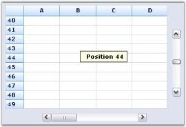 

* Office2007ScrollBars - Toggles between standard and Office 2007 scroll bars. Default value is set to _false_.

The following code examples can be used to set this property:

 


//Toggles to Office 2007 scroll bar.

this.gridControl1.Office2007ScrollBars = true;


 


'Toggles to Office 2007 scroll bar.

Me.gridControl1.Office2007ScrollBars = True


* Office2007ScrollBarsColorScheme - Specifies the style for Office 2007 scroll bars. Default value is set to _Blue_.

The following code example can be used to set this property:

 



//Sets the style for Office 2007 scroll bar.

this.gridControl1.Office2007ScrollBarsColorScheme = Office2007ColorScheme.Blue;





'Sets the style for Office 2007 scroll bar.

Me.gridControl1.Office2007ScrollBarsColorScheme = Office2007ColorScheme.Blue


* ScrollFrozen - Defines scroll behavior when user moves current cell with arrow keys into frozen cells area. Default value is set to _true_.

The following code examples can be used to set this property:

 


//Defines scroll behavior in frozen cells.

this.gridControl1.ScrollFrozen = true;





'Defines scroll behavior in frozen cells.

Me.gridControl1.ScrollFrozen = True


* ScrollTipFormat - Specifies the text to be displayed in the ScrollTip window with a place holder for scroll position.

The following code example can be used to set this property:



//Sets the text to be displayed in the ScrollTip window with a place holder for scroll position.

this.gridControl1.ScrollTipFormat = "Position {0}";




'Sets the text to be displayed in the ScrollTip window with a place holder for scroll position.

Me.gridControl1.ScrollTipFormat = "Position {0}"


* AutoScrolling - Specifies whether to enable or disable automatic scrolling.

The following code example can be used to set this property:

 



//Enables AutoScrolling.

this.gridControl1.AutoScrolling = true;


 


'Enables AutoScrolling.

Me.gridControl1.AutoScrolling = True


* Hscroll - Specifies whether to enable orv disable horizontal scroll bar.

The following code examples can be used to set this property:

 


//Enables horizontal scroll bar.

this.gridControl1.HScroll = true;





'Enables horizontal scroll bar.

Me.gridControl1.HScroll = True



* VScroll - Specifies whether to enable or disable vertical scroll bar.

The following code example can be used to set this property:

 



//Enables vertical scroll bar.

this.gridControl1.VScroll = true;




' Enables vertical scroll bar.

Me.gridControl1.VScroll = True

A sample demonstrating these properties is available under the following sample installation path.

    <Install Location>\Syncfusion\EssentialStudio\[Version Number]\Windows\Grid.Windows\Samples\Zoom and Scroll\ScrollBar Demo

### Custom Drawing

Essential Grid enables custom drawing on its cells. Custom Drawing denotes adding text and drawings such as lines, polygons, etc., to the cell. It has custom draw events such as CellDrawn event and DrawCell event. By using these events, you can provide the exact appearance that you desire for your applications. 

* DrawCell - This event is handled for every cell before the grid draws a specified cell. This event is generally used to add custom drawing to a cell. It can also be used to draw shapes like lines, polygons, etc.
* CellDrawnevent - This event is handled for every cell when the grid has drawn the specified cell. You can handle the CellDrawn event and use its Graphics argument to do custom drawing after the grid has finished drawing the cell.

Following code example illustrates handling the Draw Cell event.

 


//DrawCell event is used to apply styles to the grid.

private void gridControl1_DrawCell(object sender, GridDrawCellEventArgs e)

{

    if (e.RowIndex == 0)

    {

        e.Style.Interior = new BrushInfo(GradientStyle.Vertical, Color.FromArgb(255, 229, 201), Color.FromArgb(255, 153, 52));

    }

    else if (e.ColIndex == 0)

    {

        e.Style.Interior = new BrushInfo(GradientStyle.Horizontal, Color.White, Color.FromArgb(102, 110, 152));

    }

    else if (e.RowIndex % 2 == 0)

    {

        e.Style.Interior = new BrushInfo(GradientStyle.BackwardDiagonal, Color.FromArgb(51, 51, 101), Color.White);

    }

}





'DrawCell event is used to apply styles to the grid.

Private Sub gridControl1_DrawCell(ByVal sender As Object, ByVal e As GridDrawCellEventArgs)

If e.RowIndex = 0 Then

e.Style.Interior = New BrushInfo(GradientStyle.Vertical, Color.FromArgb(255, 229, 201), Color.FromArgb(255, 153, 52))

ElseIf e.ColIndex = 0 Then

e.Style.Interior = New BrushInfo(GradientStyle.Horizontal, Color.White, Color.FromArgb(102, 110, 152))

ElseIf e.RowIndex Mod 2 = 0 Then

e.Style.Interior = New BrushInfo(GradientStyle.BackwardDiagonal, Color.FromArgb(51, 51, 101), Color.White)

End If

End Sub



The above code identifies the first row, first column and the even rows using their index values and paints them with unique interior styles.

Following code example illustrates handling the CellDrawn Event.

 


//Handles CellDrawn Event to customize the appearance of grid cells.

private void gridControl1_CellDrawn(object sender, GridDrawCellEventArgs e)

{

    if(e.ColIndex==6 &&e.RowIndex>0)

    {

        Rectangle rec = e.Bounds,rect=e.Bounds;

        rec.X=(e.Bounds.Left+e.Bounds.Right)/2;

        if(e.Style.CellValue.ToString()=="1")

        {

            e.Graphics.FillEllipse(Brushes.Gray,rect);

            GridImageCellRenderer.DrawImage(e.Graphics,this.imageList1,1,rec,false);

        }

        else

        {

            e.Graphics.FillEllipse(Brushes.LightGray,rect);

            GridImageCellRenderer.DrawImage(e.Graphics,this.imageList1,0,rec,false);

        }

    }

}




'Handles CellDrawn Event to customize the appearance of grid cells.

Private Sub gridControl1_CellDrawn(ByVal sender As Object, ByVal e As GridDrawCellEventArgs)

If e.ColIndex = 6 AndAlso e.RowIndex > 0 Then

Dim rec As Rectangle = e.Bounds, rect As Rectangle = e.Bounds

rec.X = (e.Bounds.Left + e.Bounds.Right) / 2

If e.Style.CellValue.ToString() = "1" Then

e.Graphics.FillEllipse(Brushes.Gray, rect)

GridImageCellRenderer.DrawImage(e.Graphics, Me.imageList1, 1, rec, False)

Else

e.Graphics.FillEllipse(Brushes.LightGray, rect)

GridImageCellRenderer.DrawImage(e.Graphics, Me.imageList1, 0, rec, False)

End If

End If

End Sub



The above code identifies the cells of the sixth column except the cell corresponding to the column header, using their index values, and customizes their appearance.

### Formatting Drop-down List

Essential Grid has built-in support for displaying a Grid List control as a drop-down inside a grid cell. We can embed grid list controls into the grid cells and customize them.

The following screen shot shows grid cell with Grid List control as its drop-down.

 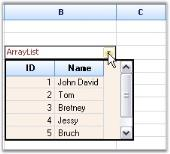

To add a Grid List control to grid cell and bind some data:

To have a Grid List control in a Grid cell, set its CellType property as _GridListControl_. An array is used as data source in the following example. You can set its DataSource and DisplayMember properties as follows:


ArrayList array = new ArrayList();

array.Add(new MyClass(001, "John David"));

array.Add(new MyClass(002, "Tom"));

array.Add(new MyClass(003, "Bretney"));

array.Add(new MyClass(004, "Jessy"));

array.Add(new MyClass(005, "Bruch"));

array.Add(new MyClass(006, "Johny"));

//Sets up a Grid List control cell.

this.gridControl1[rowIndex, 2].CellType = "GridListControl";

//Specifies the data source and displays member for Grid List control.

this.gridControl1[rowIndex, 2].DataSource = array;

this.gridControl1[rowIndex, 2].DisplayMember = "Name";

Dim array As ArrayList = New ArrayList()

array.Add(New [MyClass](1, "John David"))

array.Add(New [MyClass](2, "Tom"))

array.Add(New [MyClass](3, "Bretney"))

array.Add(New [MyClass](4, "Jessy"))

array.Add(New [MyClass](5, "Bruch"))

array.Add(New [MyClass](6, "Johny"))



'Sets up a Grid List control cell.

Me.gridControl1(rowIndex, 2).CellType = "GridListControl"

'Specifies the data source and displays member for the Grid List control.

Me.gridControl1(rowIndex, 2).DataSource = array

Me.gridControl1(rowIndex, 2).DisplayMember = "Name"


We have now added a Grid List control in a Grid cell and bound the data to it. This Grid List control can be customized by accessing GridDropDownGridListControlCellRenderer class inside the CurrentCellShowedDropDown event handler.

N> CurrentCellShowedDropDown event is handled once the drop-down of the specified grid cell is made visible by clicking the downward arrow at the end of the cell.

The following code illustrates this event:



private void gridControl1_CurrentCellShowedDropDown(object sender, EventArgs e)

{

//Retrieves the DropDownList Cell Renderer.

    GridDropDownGridListControlCellRenderer listRenderer =

    (GridDropDownGridListControlCellRenderer)this.gridControl1.CellRenderers["GridListControl"];

//Applies styles to Grid List control in the drop-down.

    listRenderer.ListControlPart.Grid.TableStyle.Font.Size = 17.8f;

    listRenderer.ListControlPart.BorderStyle = BorderStyle.FixedSingle;

    listRenderer.ListControlPart.Grid.BackColor = Color.FromArgb(250, 240, 230);

    listRenderer.ListControlPart.Grid.DefaultGridBorderStyle = GridBorderStyle.Solid;

    listRenderer.ListControlPart.Grid.TableStyle.TextColor = Color.MidnightBlue;

    listRenderer.ListControlPart.Grid.Properties.GridLineColor = Color.FromArgb(208, 215, 229);

    listRenderer.ListControlPart.FillLastColumn = false;

}




Private Sub gridControl1_CurrentCellShowedDropDown(ByVal sender As Object, ByVal e As EventArgs)

'Retrieves the DropDownList Cell Renderer.

    Dim listRenderer As GridDropDownGridListControlCellRenderer =

    CType(Me.gridControl1.CellRenderers("GridListControl"), GridDropDownGridListControlCellRenderer)

'Applies styles to Grid List control in the drop-down.

    listRenderer.ListControlPart.Grid.TableStyle.Font.Size = 17.8F

    listRenderer.ListControlPart.BorderStyle = BorderStyle.FixedSingle

    listRenderer.ListControlPart.Grid.BackColor = Color.FromArgb(250, 240, 230)

    listRenderer.ListControlPart.Grid.DefaultGridBorderStyle = GridBorderStyle.Solid

    listRenderer.ListControlPart.Grid.TableStyle.TextColor = Color.MidnightBlue

    listRenderer.ListControlPart.Grid.Properties.GridLineColor = Color.FromArgb(208, 215, 229)

    listRenderer.ListControlPart.FillLastColumn = False

End Sub

You can apply various styles such as table style, border style, text color, grid line color, etc, to the Grid List control inside a grid cell as in Figure 1. 

### Working with Rows and Columns

Grid control has properties that allow users to manipulate rows and columns programmatically. The following properties will be discussed in this section.

* GridControl.Cols, GridControl.Rows - Allows you to hide rows and columns, to freeze them to prevent scrolling and to control the number of headers.
* GridControl.ColWidths, GridControl.RowHeights - Allows you to set the row heights and column widths programmatically.
* GridListControl.ColStyles, GridListControl.RowStyles - Allows you to set the row or column styles.

For a DataBound Grid, you can access the first two items through the GridDataBoundGrid.Model property. The DataBound Grid does not use RowStyles or ColStyles. It uses the GridBoundColumn.StyleInfo object to set column styles with row styles not being directly supported. See the section on Grid Data Bound Grid for more information on how to set its styles.

### Hiding Rows and Columns

GridControl.Cols.Hidden collection will allow you to specify whether a column is hidden or not. You can index these properties directly as shown in the code below or you can use Hidden.SetRange method to provide settings for a range of rows or columns.



//Hides column 2.

this.gridControl1.Cols.Hidden[2] = true;

//Hides row 3.

this.gridControl1.Rows.Hidden[3] = true; 





'Hides column 2.

Me.GridControl1.Cols.Hidden(2) = True  

'Hides row 3. 

Me.GridControl1.Rows.Hidden(3) = True  


You can also use this property to hide the default row headers and column headers. These headers are just column zero and row zero respectively. To hide them you can use code like the one given below.



//Hides default row headers.

this.gridControl1.Cols.Hidden[0] = true; 

//Hides default column headers.

this.gridControl1.Rows.Hidden[0] = true; 





'Hides default row headers.       

Me.GridControl1.Cols.Hidden(0) = True  

'Hides default column headers. 

Me.GridControl1.Rows.Hidden(0) = True  


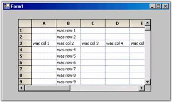 

### Header Rows and Columns

As we have seen in the previous section, it is possible to hide both the row and column headers. We can also have more than one header row and/or more than one header column. The properties that control the number of header rows and columns is GridControl.Rows.HeaderCount and GridControl.Cols.HeaderCount. This HeaderCount property is the index of the last header row or column. So, to have a total of three column header rows, set Rows.HeaderCount to two.



//Total of three column header rows.        

this.gridControl1.Rows.HeaderCount = 2;





'Total of three column header rows.        

Me.GridControl1.Cols.Rows.HeaderCount = 2  


 

### Frozen Rows and Columns

A  frozen row is one that cannot be scrolled. For example, the default column header (row 0) is a frozen row. Frozen rows will always be displayed at the top of the grid. You can set the number of frozen rows using GridControl.Rows.FrozenCount property. In our previous code sample, we used the Rows.HeaderCount property to set up two additional column header rows. To cause the new headers to be fixed and not to scroll, you need to set the Rows.FrozenCount to two. Note that you can freeze non-header type rows as well, but in the following code samples we are freezing headers only.



//Has 3 non-scrollable rows at the top.        

this.gridControl1.Rows.FrozenCount = 2;  

//Total of three column header rows.        

this.gridControl1.Rows.HeaderCount = 2;  




'Has 3 non-scrollable rows at the top.        

Me.GridControl1.Rows.FrozenCount = 2    

'Total of three column header rows.        

Me.GridControl1.Rows.HeaderCount = 2   


 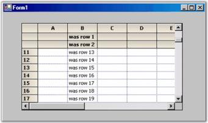

As we have said, frozen rows will always appear at the top of the grid and frozen columns will always appear to the left of the grid. It is possible to freeze an interior range of rows or columns by using GridControl.Rows.FreezeRange or GridControl.Cols.FreezeRange method. But, the FreezeRange method will move the requested rows or columns to the top or left and then it will set FrozenCount to actually freeze the rows or columns. 



//Moves rows 3 and 4 to the top of the grid and freezes them.        

this.gridControl1.Rows.FreezeRange(3,4);





'Moves rows 3 and 4 to the top of the grid and freezes them.        

Me.GridControl1.Rows.FreezeRange(3,4)  


### Moving Rows and Columns

The methods GridControl.Rows.MoveRange and GridControl.Cols.MoveRange are used to move rows and columns in a grid. The MoveRange method takes three parameters that are used to determine the start position, number of items to move and the target position. 



//Starts at row 7, moves 2 rows to row 4.        

this.gridControl1.Rows.MoveRange(7, 2, 4); 





'Starts at row 7, moves 2 rows to row 4.      

Me.GridControl1.Rows.MoveRange(7, 2, 4)


 

### Setting Column Widths and Row Heights

GridControl.ColWidths and GridControl.RowHeights collections will allow you to programmatically set the width of a column and/or the height of a row.

N> Before you can use GridDataBoundGrid.Model.ColWidths to explicitly set column widths in Data Bound Grid, you must first set GridDataBoundGrid.AllowResizeToFit to false. Otherwise, the grid will try to size columns based on the width of the header text.



//Sets the width of column 3.       

this.gridControl1.ColWidths[3] = 40; 

//Sets the height of row 4.        

this.gridControl1.RowHeights[4] = 40; 





'Sets the width of column 3.        

Me.GridControl1.ColWidths(3) = 40   

'Sets the height of row 4.

Me.GridControl1.RowHeights(4) = 40 


### Setting Column Styles and Row Styles

GridControl.ColStyles and GridControl.RowStyles collections will allow you to programmatically set the default row or column style. This code will set backcolor and text color as well as set the font to bold for column two and row three.

N> RowStyles and ColStyles are not supported in DataBound Grid. For that grid, you will need to use  GridBoundColumn.StyleInfo property to set column styles and you will need to use grid.Model.QueryCellInfo event to set row styles.



//Sets Back Color, Text Color and Font Style of Column 2.

this.gridControl1.ColStyles[2].BackColor = Color.Red;

this.gridControl1.ColStyles[2].TextColor = Color.White;

this.gridControl1.ColStyles[2].Font.Bold = true;

//Sets Back Color, Text Color and Font Style of Row 3.

this.gridControl1.RowStyles[3].BackColor = Color.Red;

this.gridControl1.RowStyles[3].TextColor = Color.White;

this.gridControl1.RowStyles[3].Font.Bold = true;





'Sets Back Color, Text Color and Font Style of Column 2.

Me.GridControl1.ColStyles(2).BackColor = Color.Red

Me.GridControl1.ColStyles(2).TextColor = Color.White

Me.GridControl1.ColStyles(2).Font.Bold = True

'Sets Back Color, Text Color and Font Style of Row 3.

Me.GridControl1.RowStyles(3).BackColor = Color.Red

Me.GridControl1.RowStyles(3).TextColor = Color.White

Me.GridControl1.RowStyles(3).Font.Bold = True



 

### Controlling the Resize Behavior

Essential Grid supports resizing behavior of columns and rows in Grid control. This is achieved by using ResizeColsBehavior and ResizeRowsBehavior properties.

GridResizeCellsBehavior enumeration provides the following options to control resizing behavior. 

* AllowDragOutside - Allows the user to drag the cell boundary outside grid client area and resize specific row or column.

N> Grid client area is the area where cells along with row and column headers are visible to the client. Dragging outside the client area means dragging beyond the boundary of the grid.

* InsideGrid - Allows the user to resize rows or columns from anywhere inside the grid by dragging the divider between any two row or column headers.
* None - Turns off the mouse control over resizing rows and columns.
* OutlineBounds - Highlights the original cell boundaries of resizing row or column.
* OutlineHeaders - Highlights the header boundaries when the user resizes the associated row or column.
* ResizeAll - Resizes all rows or columns automatically when the user resizes one row or column with the mouse. All rows and columns are resized to the same size as the current row or column being resized.
* ResizeSingle - Resizes the row or column being resized by the user using the mouse.

N> You can also control the mouse controller's behavior at run time while the user is performing the action by subscribing to ResizingColumns and ResizingRows events.

The following code illustrates how to use this method in Grid control:

 

this.gridControl1.ResizeColsBehavior = GridResizeCellsBehavior.InsideGrid;

this.gridControl1.ResizeRowsBehavior = GridResizeCellsBehavior.InsideGrid;




Me.gridControl1.ResizeColsBehavior = GridResizeCellsBehavior.InsideGrid

Me.gridControl1.ResizeRowsBehavior = GridResizeCellsBehavior.InsideGrid


### Resize To Fit

Essential Grid supports this feature to enable resizing columns and rows based on the content of cells. ResizeToFit method is used for this purpose. The following code illustrates how to use this method in Grid control:

 


//Resizes the column widths.

this.gridControl1.ColWidths.ResizeToFit(GridRangeInfo.Cols(1, 5));

//Resizes the row heights.

this.gridControl1.RowHeights.ResizeToFit(GridRangeInfo.Rows(1, 5));




'Resizes the column widths.

Me.gridControl1.ColWidths.ResizeToFit(GridRangeInfo.Cols(1, 5))

'Resizes the row heights.

Me.gridControl1.RowHeights.ResizeToFit(GridRangeInfo.Rows(1, 5))


N> The parameter passed to ResizeToFit method is either GridRangeInfo.Cols or GridInfo.Rows method, which in turn has two parameters:

1. The first parameter corresponds to the starting row or column that is to be resized to fit. 
2. The second parameter corresponds to the ending row or column upto which the resize has to be done.

The following image shows the application of resize to fit operation to the first five rows of the grid.

N> The preceding image is the output of a demo that is available in the samples in the following installed location.

    <Install Location>\Syncfusion\EssentialStudio\[Version Number]\Windows\Grid.Windows\Samples\Grid Layout\Resize To Fit Demo

The two buttons, Set RowHeight and Set Column Width seen in the image above are used to set irregular height and width to the specified rows and columns of the grid respectively. The ColWidths – Resize To Fit and RowHeights – Resize To Fit are enabled only when the rows or columns are set to irregular height and width by using the Set RowHeight and Set Column Width buttons respectively.

### ResizeToFitOptimized

Essential Grid supports ResizeToFitOptimized feature to enable resizing columns and rows based on the contents of grid cells. The existing ResizeToFit method does not resize the columns or rows to make the entire cell value visible in the control. ResizeToFitOptimized method is used for this purpose.

### Use Case Scenarios

This feature enables you to display the entire cell with resized columns and rows even if the grid cells has special characters such as tab, newline, etc.

#### Methods Table

_Table71: Method Table_

<table>
<tr>
<th>
METHOD </th><th>
DESCRIPTION </th><th>
PARAMETERS </th><th>
RETURN TYPE </th></tr>
<tr>
<td>
ResizeToFitOptimized</td><td>
Resizes a range of rows or columns to optimally fit contents of the specified range of cells.</td><td>
Overloads: 1. ResizeToFitOptimized(GridRangeInfo range) 2. ResizeToFitOptimized(GridRangeInfo range, GridResizeToFitOptions option)3. ResizeToFitOptimized(GridRangeInfo range, GridTextOptions textOption)</td><td>
 Void </td></tr>
</table>
Applying ResizeToFitOptimized to an Application

The following code example illustrates how to use this ResizeToFitOptimized method in Grid control.



//Resizes the column width.

this.gridControl1.ColWidths.ResizeToFitOptimized(GridRangeInfo.Col(1));

//Resizes the row height.

this.gridControl1.RowHeights.ResizeToFitOptimized(GridRangeInfo.Rows(1,8));




'Resizes the column width.

Me.gridControl1.ColWidths.ResizeToFitOptimized(GridRangeInfo.Col(1)); 

'Resizes the row height.

Me.gridControl1.RowHeights.ResizeToFitOptimized(GridRangeInfo.Rows(1,8));


 The following image shows the application of ResizeToFitOptimized to the first column of the grid.

 

### ResizeToFit Behavior in AutoSize

Essential Grid supports resizing columns and rows based on the content of cells. This is achieved by using ResizeToFit() method. 

AutoSize enables the cell height to be automatically increased when the edited text does not fit into the cell and when WrapText is set to true. If WrapText is set to false, AutoSize will affect the column width, but it does not have the functionality of resizing the rows or columns after text has been entered as the ResizeToFit() method does. AutoSize also supports resizing rows and columns based on their cell content during the binding of the data source to the grid. Content can be entered in the grid and then the AutoSize property can be applied. This will resize the altered rows and columns.


this.gridGroupingControl1.Appearance.AnyCell.AutoSize = true;




 me.gridGroupingControl1.Appearance.AnyCell.AutoSize = true;


 AutoSize can also be applied to different cell types to resize the rows and columns to fit the contents of the cell, and the row height and column width will be resized when editing cell contents.

### Autosizing Custom Cell

Essential Grid supports automatic resizing of cells in the Grid control when custom controls are placed inside the cells.

The Grid lets you add custom controls to cells by creating CellModel class and CellRenderer class. These custom controls can have different sizes. When these controls are placed in the Grid, the corresponding cell is automatically resized to fit the controls. This is achieved by overriding the OnQueryPrefferedClientSize method in the model class. The proper size of the control can be returned by using this method. ResizeToFit method will then resize the cell to the size returned by the OnQueryPrefferedClientSize method. 

The following code example illustrates how to implement this feature in the Grid control:

 


// Overrides this method to calculate proper control size and returns the same.

protected override Size OnQueryPrefferedClientSize(Graphics g, int rowIndex, int colIndex, GridStyleInfo style, GridQueryBounds queryBounds)

{

if(Grid[rowIndex,colIndex].Tag == null)

throw new Exception("No User Control is tagged");

else

{

//Gets the type of the control from Style.Tag.

Control userControl = Grid[rowIndex,colIndex].Tag as Control;

//Calculates the size of the control.

Size size = userControl.Size;

size.Height += 2;

//Returns the size.

return size;

}

}





'Overrides this method to calculate proper control size and return the same.

Protected Overrides Function OnQueryPrefferedClientSize(ByVal g As Graphics, ByVal rowIndex As Integer, ByVal colIndex As Integer, ByVal style As GridStyleInfo, ByVal queryBounds As GridQueryBounds) As Size

If Grid(rowIndex, colIndex).Tag Is Nothing Then

Throw New Exception("No User Control is tagged")

Else

'Gets the type of the control from Style.Tag.

Dim userControl As Control = TryCast(Grid(rowIndex, colIndex).Tag, Control)

'Calculates the size of the control.

Dim size As Size = userControl.Size

size.Height += 2

'Retur the size.

Return size

End If

End Function


The following image shows how the cell resizes itself automatically to the size of the control, when a custom control is added to it.

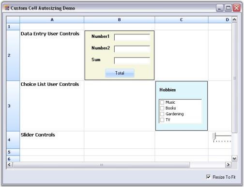

### Enter Key Behavior

This feature enables you to apply Enter key behavior for the following Windows Forms Grid controls: Grid, GridGrouping, and GridDataBoundGrid. By default, Enter key behavior is set to move to the cell to the right. By using EnterKeyBehavior property, you can set how the cell selection navigates when Enter is pressed.  

EnterKeyBehavior property provides support for the following navigation options to move the cell selection when Enter is pressed. 

* Bottom
* BottomRight
* Down
* Left
* MostLeft
* MostRight
* None
* PageDown
* PageUp
* Right
* Top
* TopLeft
* Up

#### Use Case Scenarios

You can use this property to change navigation direction of Enter key behavior in the grid. The EnterKeyBehavior property works based on WrapCellBehavior. Enter key behavior navigates to the first column in the next row when at the end of a row, moving to the right.

_Table 72: Properties_

<table>
<tr>
<th>
PROPERTY</th><th>
DESCRIPTION</th><th>
TYPE</th><th>
DATA TYPE</th></tr>
<tr>
<td>
EnterKeyBehavior</td><td>
Navigate to other cells when Enter is pressed.</td><td>
GridDirectionType</td><td>
Enum</td></tr>
<tr>
<td>
WrapCellBehavior</td><td>
Go to first column in next row or last column in previous row when at end or beginning of a row and moving based on Enter key behavior.</td><td>
GridWrapCellBehavior</td><td>
Enum</td></tr>
</table>

#### Example

The following code illustrates how to set EnterKeyBehavior property for Syncfusion Windows Forms Grid controls.

#### For the Grid Control



this.gridControl1.EnterKeyBehavior = GridDirectionType.Top;

this.gridControl1.Model.Options.WrapCellBehavior = GridWrapCellBehavior.WrapGrid;





Me.gridControl1.EnterKeyBehavior = GridDirectionType.Top

        Me.gridControl1.Model.Options.WrapCellBehavior=GridWrapCellBehavior.WrapGrid;



#### For GridGroupingControl


this.gridGroupingControl1.TableModel.Options.EnterKeyBehavior = GridDirectionType.Top;

                    this.gridGroupingControl1.TableModel.Options.WrapCellBehavior = GridWrapCellBehavior.WrapGrid;




Me. gridGroupingControl1.TableModel.Options.EnterKeyBehavior = GridDirectionType.Top

Me.gridGroupingControl1.TableModel.Options.WrapCellBehavior = GridWrapCellBehavior.WrapGrid



#### For GridDataBoundGrid



this.gridDataBoundGrid1.Model.Options.EnterKeyBehavior = GridDirectionType.Top;

this.gridDataBoundGrid1.Model.Options.WrapCellBehavior = GridWrapCellBehavior.WrapGrid;




Me. gridDataBoundGrid1.Model.Options.EnterKeyBehavior = GridDirectionType.Top

Me. gridDataBoundGrid1.Model.Options.WrapCellBehavior = GridWrapCellBehavior.WrapGrid


#### Sample Link

Samples for this feature are available in the following location:

    <Install Location>\Syncfusion\EssentialStudio\[Version Number]\Windows\Grid.Grouping.Windows\Samples\Styling and Formatting\Cell Formatting Demo

### Covered Cells

Covered cells will allow you to group a range of cells together so that the group appears to be a single cell. For example, you might want a header to span two columns; this can be done using covered cells. Covered cells also support a large button, which occupies several cells.

To specify a covered range, you will have to use GridControl.CoveredRange collection. You must add GridRangeInfo object to this collection to specify the range of cells that you want covered. You can then use the top-left corner to control what is being displayed in this large cell. 



//Covers (2,2) through (3,4) so it is treated as a single cell.

this.gridControl1.Model.CoveredRanges.Add(GridRangeInfo.Cells(2, 2, 3, 4));

this.gridControl1[2, 2].CellType = "PushButton";

this.gridControl1[2, 2].CellAppearance = GridCellAppearance.Raised;

this.gridControl1[2, 2].Description = "Big Button";

this.gridControl1[2, 2].Font.Size = 12;

this.gridControl1[2, 2].Font.Bold = true;

//Covers (6,2) through (7,4) so it is treated as a large fancy label.

this.gridControl1.Model.CoveredRanges.Add(GridRangeInfo.Cells(6, 2, 7, 4));

this.gridControl1[6, 2].CellType = "Static";

this.gridControl1[6, 2].Text = "Big Label";

this.gridControl1[6, 2].HorizontalAlignment = GridHorizontalAlignment.Center;

this.gridControl1[6, 2].VerticalAlignment = GridVerticalAlignment.Middle;

this.gridControl1[6, 2].Font.Size = 12;

this.gridControl1[6, 2].Font.Bold = true;

this.gridControl1[6, 2].Interior = new BrushInfo(GradientStyle.PathRectangle, Color.FromArgb(0xED, 0xF0, 0xF6), Color.FromArgb(0x2A, 0x43, 0x7E));

this.gridControl1[6, 2].TextColor = Color.FromArgb(0x66, 0x6E, 0x98);




'Covers (2,2) through (3,4) so it is treated as a single cell.

Me.gridControl1.Model.CoveredRanges.Add(GridRangeInfo.Cells(2, 2, 3, 4))

Me.gridControl1(2, 2).CellType = "PushButton"

Me.gridControl1(2, 2).CellAppearance = GridCellAppearance.Raised

Me.gridControl1(2, 2).Description = "Big Button"

Me.gridControl1(2, 2).Font.Size = 12

Me.gridControl1(2, 2).Font.Bold = True

'Covers (6,2) through (7,4) so it is treated as a large fancy label.

Me.gridControl1.Model.CoveredRanges.Add(GridRangeInfo.Cells(6, 2, 7, 4))

Me.gridControl1(6, 2).CellType = "Static"

Me.gridControl1(6, 2).Text = "Big Label"

Me.gridControl1(6, 2).HorizontalAlignment = GridHorizontalAlignment.Center

Me.gridControl1(6, 2).VerticalAlignment = GridVerticalAlignment.Middle

Me.gridControl1(6, 2).Font.Size = 12

Me.gridControl1(6, 2).Font.Bold = True

Me.GridControl1(6, 2).Interior = New BrushInfo(GradientStyle.PathRectangle, _Color.FromArgb(0xED, 0xF0, 0xF6),

_Color.FromArgb(0x2A, 0x43, 0x7E ))

Me.GridControl1(6, 2).TextColor = Color.FromArgb(0x66, 0x6E, 0x98)


### Deriving GridPrintDocument

GridPrintDocument has the events BeginPrint, PrintPage and EndPrint inherited from PrintDocument, which allows you access to the printing flow at certain points. To gain more control, you can derive GridPrintDocument and override members like OnPrint. This will allow you to access grid members like ViewLayout and TopRowIndex to obtain information about the page that is being printed. The following code will show you how to print the top and bottom row of the page.



public class MyPrintDocument : GridPrintDocument

{

    GridControlBase _grid;

    public MyPrintDocument(GridControlBase grid, bool printPreview):base(grid, printPreview)

    {

        _grid = grid;

    }

    protected override void OnPrintPage(System.Drawing.Printing.PrintPageEventArgs ev)

    {

        base.OnPrintPage(ev);

        _grid.PrintingMode = true;

//Gets Top Row Index.

        int topRow = _grid.TopRowIndex;

        _grid.ViewLayout.Reset();

//Gets Bottom Row Index.

        int botRow = this._grid.ViewLayout.LastVisibleRow 

                        - (this._grid.ViewLayout.HasPartialVisibleRows ? 1 : 0);

        _grid.PrintingMode = false;

//Prints.

        Console.WriteLine("OnPrintPage " + topRow.ToString() + "   " + botRow.ToString());

    }

}




Public Class MyPrintDocument

Inherits GridPrintDocument

Private _grid As GridControlBase

Public Sub New(grid As GridControlBase, printPreview As Boolean)

MyBase.New(grid, printPreview)

_grid = grid

End Sub

Protected Overrides Sub OnPrintPage(ByVal ev As System.Drawing.Printing.PrintPageEventArgs)

MyBase.OnPrintPage(ev)

_grid.PrintingMode = True

'Gets Top Row Index.

Dim topRow As Integer = _grid.TopRowIndex

_grid.ViewLayout.Reset()

'Gets Bottom Row Index.

Dim botRow As Integer = Me._grid.ViewLayout.LastVisibleRow

If Me._grid.ViewLayout.HasPartialVisibleRows Then

                        botRow = botRow - 1

End If

_grid.PrintingMode = False

//Prints.

Console.WriteLine(("OnPrintPage " + topRow.ToString() + "   " + botRow.ToString()))

'OnPrintPage.

End Sub

'MyPrintDocument.

End Class


### Floating Cells

Floating cells are those cells whose content floats over empty, adjacent cells. You can enable floating cells at the grid level by setting GridControl.FloatCellsMode. Setting this property to GridFloatCellsMode.BeforeDisplayCalculation will force the floating cells to always be calculated just prior to being displayed. Setting the property to GridFloatCellsMode.OnDemandCalculation will calculate the floating cells only if the cell contents or size changes. This latter option is more efficient. 

You can control a cell whether or not it floats over adjacent cells through FloatCell property in the cell's GridStyleInfo object. You can also prevent a cell from being flooded by using its GridStyleInfo.FloodCell property. In the code given below, all three lines (1, 3, 5) hold the same text in column one. But, the floating cells in lines three and five are stopped short; line three by an occupied cell and line five by a FloodCell false settings.



//Enables Float Cells.

this.gridControl1.FloatCellsMode = GridFloatCellsMode.OnDemandCalculation;

//Specifies Cell Text.

this.gridControl1[1, 1].Text = "This is a text that floats over several cells.";

this.gridControl1[3, 1].Text = "This is a text that floats over several cells.";

this.gridControl1[5, 1].Text = "This is a text that floats over several cells.";

this.gridControl1[3, 3].Text = "3.14159";

//Code to prevent cell(5,2) from being flooded.

this.gridControl1[5, 2].FloodCell = false;




'Enables Float Cells.

Me.gridControl1.FloatCellsMode = GridFloatCellsMode.OnDemandCalculation

'Specifies Cell Text.

Me.gridControl1(1, 1).Text = "This is a text that floats over several cells."

Me.gridControl1(3, 1).Text = "This is a text that floats over several cells."

Me.gridControl1(5, 1).Text = "This is a text that floats over several cells."

Me.gridControl1(3, 3).Text = "3.14159"

'Code to prevent cell(5,2) from being flooded.

Me.gridControl1(5, 2).FloodCell = False

Me.gridControl1(2, 2).Font.Bold = True



 

### TabBarSplitterControl

TabBarSplitterControl enables users to create Tab Pages with dynamic splitters; when used with a grid control, it gives a workbook like appearance. It comes with Office 2007 Style by default, and supports all the three color schemes.



this.tabBarSplitterControl.Style = Syncfusion.Windows.Forms.TabBarSplitterStyle.Office2007;

this.tabBarSplitterControl.Office2007ColorScheme = Syncfusion.Windows.Forms.Office2007Theme.Silver;




Me.tabBarSplitterControl.Style = Syncfusion.Windows.Forms.TabBarSplitterStyle.Office2007

Me.tabBarSplitterControl.Office2007ColorScheme = Syncfusion.Windows.Forms.Office2007Theme.Silver


 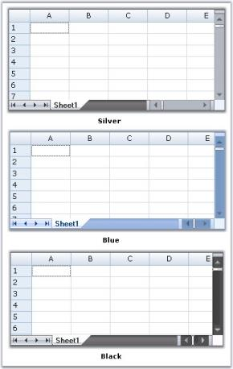

### Custom Colors

We can apply custom colors to the TabBarSplitterControl by setting Office2007ColorScheme property to "Managed" and by giving the color through ApplyManagedColor method as follows.



this.tabBarSplitterControl.Office2007ColorScheme = Syncfusion.Windows.Forms.Office2007Theme.Managed;

Office2007Colors.ApplyManagedColors(this, Color.PowderBlue);




Me.tabBarSplitterControl.Office2007ColorScheme = Syncfusion.Windows.Forms.Office2007Theme.Managed

Office2007Colors.ApplyManagedColors(Me, Color.PowderBlue)



 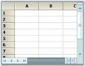 

### PrepareViewStyleInfo Event

PrepareViewStyleInfo event is raised to allow custom formatting of a cell by changing its style object just before it is drawn. This allows formatting based on the current view state, e.g. current cell context, focused control, and so on. For example, if you want draw the current row with a bold text, you can use PrepareViewStyleInfo to accomplish this task. The idea is to change the style to bold font for any cell in the current one. Given below are the steps that you can follow in order to implement this functionality.

* Add a handler for CurrentCellDeactivated to refresh the old row to remove its bold font. 
* Add a handler for CurrentCellActivated to refresh the new current row to add its bold font. 
* Add a handler for PrepareViewStyleInfo to conditionally change the bold style of the font if the requested cell is on the current row. 

To see a full working sample, check the HighlightCurrent sample that is shipped with Essential Grid. Notice that the work is done just by refreshing the grid (redraw) row. During refresh, PrepareViewStyleInfo is selected and the style is modified to be bold if the row is current. This means that no bold style information is saved anywhere. GridStyleInfo object is just temporarily modified immediately before it is used in the drawing.

### Print Preview and Printing

Essential Grid directly supports printing and print previews through the .NET Framework classes Systems.Windows.Forms.PrintPreviewDialog and Systems.Windows.Forms.PrintDialog. A derived PrintDocument, GridPrintDocument is passed to these classes. This GridPrintDocument implements the printing logic that is needed to print multi-page grids. Following code example illustrates how to enable print previewing.



//PrintPreview button handler.

private void PrintPreview_Click(object sender, System.EventArgs e)

{

    if (this.gridControl1 != null)

    {

        try 

        {

//Uses the default printer.

            GridPrintDocument pd = new GridPrintDocument(this.gridControl1, true); 

            PrintPreviewDialog dlg = new PrintPreviewDialog() ;

            dlg.Document = pd;

            dlg.ShowDialog();

        } 

        catch(Exception ex) 

        { 

            MessageBox.Show("An error occurred attempting to preview the grid - " + ex.Message);

        }

    }

}

private void Print_Click(object sender, System.EventArgs e)

{

    if (this.gridControl1 != null)

    {

        try 

        {

            GridPrintDocument pd = new GridPrintDocument(this.gridControl1, true); 

            PrintDialog dlg = new PrintDialog() ;

            dlg.Document = pd;

            if( dlg.ShowDialog() == DialogResult.OK)

                pd.Print();

        } 

        catch(Exception ex) 

        { 

            MessageBox.Show("An error occurred attempting to print the grid - " + ex.Message);

        }

    }

}

 




'PrintPreview button handler.

Private Sub PrintPreview_Click(ByVal sender As Object, ByVal e As EventArgs)

    If (Not (gridControl1) Is Nothing) Then

        Try

            Dim pd As GridPrintDocument

            pd = New GridPrintDocument(gridControl1, True)

'Uses the default printer.

            Dim dlg As PrintPreviewDialog

            dlg = New PrintPreviewDialog()

            dlg.Document = pd

            dlg.ShowDialog()

        Catch ex As Exception

            MessageBox.Show(("An error occurred attempting to preview the grid - " + ex.Message))

        End Try

    End If

End Sub

'Print button handler.

Private Sub Print_Click(ByVal sender As Object, ByVal e As EventArgs)

    If (Not (gridControl1) Is Nothing) Then

        Try

            Dim pd As GridPrintDocument

            pd = New GridPrintDocument(gridControl1, True)

            ' Uses the default printer.

            Dim dlg As PrintDialog

            dlg = New PrintDialog()

            dlg.Document = pd

            If dlg.ShowDialog() = DialogResult.OK Then

                pd.Print()

            End If

        Catch ex As Exception

             MessageBox.Show(("An error occurred attempting to print the grid - " + ex.Message))

        End Try

    End If

End Sub



### Grid Helper Features

The following are the features of Grid Helper that supports print preview and printing:

* Advanced printing
* Page layout
* Print Column To Fit

### Advanced Printing

Multiple grids can be printed across various pages using helper class GridPrintDocumentAdv. This is achieved by drawing full sized grid to a large bitmap and then scaling this bitmap to fit the output page.

* Print Preview can be enabled by using GridPrintDocumentAdv class or by clicking Print Preview button under Grid Printing Options in UI.
* Columns can be specified to fit in a single page using ScaleColumnsToFitPage property or selecting Scale Columns To Fit check box under Grid Printing Options in UI. 
* Headers and footers can be added by using DrawGridPrintHeader and DrawGridPrintFooter events or by selecting Show Header and Footer check box under Grid Printing Options in UI.

Following code example illustrates Advanced Printing in Grid.

 


Syncfusion.GridHelperClasses.GridPrintDocumentAdv pd = new

Syncfusion.GridHelperClasses.GridPrintDocumentAdv(this.gridControl1);

pd.DefaultPageSettings.Margins = new System.Drawing.Printing.Margins(25, 25, 25, 25);

pd.HeaderHeight = 70;

pd.FooterHeight = 50;

pd.ScaleColumnsToFitPage = true;

PrintPreviewDialog previewDialog = new PrintPreviewDialog();

previewDialog.Document = pd;

previewDialog.Show();




Dim pd As Syncfusion.GridHelperClasses.GridPrintDocumentAdv = New

Syncfusion.GridHelperClasses.GridPrintDocumentAdv(Me.gridControl1)

pd.DefaultPageSettings.Margins = New System.Drawing.Printing.Margins(25, 25, 25, 25)

pd.HeaderHeight = 70

pd.FooterHeight = 50

pd.ScaleColumnsToFitPage = True

Dim previewDialog As PrintPreviewDialog = New PrintPreviewDialog()

previewDialog.Document = pd

previewDialog.Show()



Following screen shot illustrates Advanced Printing functionality provided by the GridPrintDocumentAdv class.

 

### Page Layout

The print Page Layout feature helps view the printing layout for the grid by displaying segment line and page number with each segment. This helps users to analyze page breaks within the grid and manage them accordingly. Colors for the line and text of the page layout can be defined with the properties available. Following code example illustrates this.

 



LayoutSupportHelper layoutHelper;

layoutHelper = new LayoutSupportHelper(gridControl1);

layoutHelper.LineColor = Color.Blue;

layoutHelper.TextColor = Color.Green;





Dim layoutHelper As LayoutSupportHelper

layoutHelper = New LayoutSupportHelper(gridControl1)

layoutHelper.LineColor = Color.Blue

layoutHelper.TextColor = Color.Green



Following screen shot shows the page layout of the grid, with the segment line and page number.

 

N> The functionality mentioned above can also be achieved on UI by selecting Show Page Layout check box on the UI, which allows the user to view the page layout.

### Print To Fit

An entire grid can be printed on a single page by deriving GridPrintDocument class to handle the printing of entire grid on a single page. The class achieves this by drawing full-size grid to a large bitmap and then scaling the same to fit the output page. Following code example illustrates this.


GridPrintToFitDocument pd = new GridPrintToFitDocument(this.gridControl1, true);

PrintDialog dlg = new PrintDialog();

dlg.Document = pd;

if (dlg.ShowDialog() == DialogResult.OK)

pd.Print();





Dim dlg As PrintDialog = New PrintDialog()

dlg.Document = pd

If dlg.ShowDialog() = DialogResult.OK Then

pd.Print()

End If



Following screen shot illustrates the Grid's Print To Fit feature.

 

This functionality can also be achieved by clicking PrintToFit button on UI. Refer Figure 3 on this page.

### Multiple Grid Printing

Multiple grids can be printed across various pages using helper class MultipleGridPrintDocument. This is achieved by drawing full-size grid to a large bitmap and then scaling this bitmap to fit the output page.

* MultiGridPrinting - Customizes the way printing support is provided for grids. It enables multiple grids to be printed in a single print.
* PrintGridInNewPage - Multiple grids can be printed continuously. However, the consecutive grid’s starting page will begin on a new page.
* DefaultGridPrint - Multiple grids will be printed without considering column breaks.
* ScaleColumnsToFit - Multiple grid columns will be scaled to fit the printed page.

#### Properties

_Table 73: Properties Table_

<table>
<tr>
<th>
PROPERTY </th><th>
DESCRIPTION </th><th colspan = "2">
TYPE </th><th>
DATA TYPE </th><th>
REFERENCE LINKS </th></tr>
<tr>
<td>
GridPrintOptions</td><td>
Used to customize the printing of a grid.</td><td colspan = "2">
enum </td><td>
enum</td><td>
</td></tr>
<tr>
<td colspan = "3">
GRIDPRINTOPTIONS NAME</td><td colspan = "3">
DESCRIPTION</td></tr>
<tr>
<td colspan = "3">
MultiGridPrinting</td><td colspan = "3">
Multiple grids are printed in a single print continuously one after another. </td></tr>
<tr>
<td colspan = "3">
PrintGridInNewPage</td><td colspan = "3">
Prints multiple grids in a new page.</td></tr>
<tr>
<td colspan = "3">
DefaultGridPrint</td><td colspan = "3">
Default grid printing without column breaks for each new page.</td></tr>
<tr>
<td colspan = "3">
ScaleColumnsToFit </td><td colspan = "3">
Multiple grid columns are scaled to fit the printed page.</td></tr>
</table>

#### Sample Link

    <Install Location>\Syncfusion\EssentialStudio\[Version Number]\Windows\Grid.Windows\Samples\Printing\Multi-Grid Printing

### Adding Multi-Grid Printing to an Application

* The Print Preview can be enabled by using MultipleGridPrintDocument class or by clicking Print Preview button under Grid Printing Options in UI.
* Headers and footers can be added by using DrawGridPrintHeader and DrawGridPrintFooter events or by selecting Show Header and Footer check box under Grid Printing Options in UI.



List<Control> gridsToPrint = new List<Control>();

foreach (Control cd in this.Controls)

{

   if (cd is Control)

   {

     gridsToPrint.Add((Control)cd);

   }

}

MultiGridPrintDocument pd = new MultiGridPrintDocument(gridsToPrint);

pd.GridPrintOption = MultiGridPrintDocument.GridPrintOptions.MultipleGridPrint;            

pd.ShowHeaderFooterOnAllPages = true;

PrintPreviewDialog printDialog = new PrintPreviewDialog();

printDialog.Document = pd;

printDialog.ShowDialog();




Dim ctrls As New List(Of Control)()

Dim gridsToPrint As New List(Of Control)()

   For Each cd As Control In Me.Controls

       If TypeOf cd Is Control Then

         gridsToPrint.Add(CType(cd, Control))

       End If

   Next cd

Dim pd As New MultiGridPrintDocument(gridsToPrint)

pd.GridPrintOption = MultiGridPrintDocument.GridPrintOptions.MultipleGridPrint

pd.ShowHeaderFooterOnAllPages = True

Dim printDialog As New PrintPreviewDialog()

printDialog.Document = pd

printDialog.ShowDialog()



The following screen shot illustrates the advanced printing functionality provided by MultipleGridPrintDocument class:

  

### Drag Column Header

In Grid control, column header can be dragged to a new position by clicking on it, similar to how the fields in Microsoft Outlook are dragged without selecting the columns. This feature can be enabled in Grid control by adding DragColumnHeader option under ControllerOptions property. The event QueryAllowDragColumnHeader can be handled, while performing the drag operation.

The following code examples illustrate this feature.



this.gridControl1.ControllerOptions |= GridControllerOptions.DragColumnHeader;

void gridControl1_QueryAllowDragColumnHeader(object sender, GridQueryDragColumnHeaderEventArgs e)

{

if (e.Reason != GridQueryDragColumnHeaderReason.HitTest)

System.Diagnostics.Debug.WriteLine("gridControl1_QueryAllowDragColumnHeader: " + e.ToString());

}




Me.gridControl1.ControllerOptions = Me.gridControl1.ControllerOptions Or GridControllerOptions.DragColumnHeader

Private Sub gridControl1_QueryAllowDragColumnHeader(ByVal sender As Object, ByVal e As                                                    GridQueryDragColumnHeaderEventArgs)

    If e.Reason <> GridQueryDragColumnHeaderReason.HitTest Then

        System.Diagnostics.Debug.WriteLine("gridControl1_QueryAllowDragColumnHeader: " & e.ToString())

    End If

End Sub


 The following screen shot illustrates how to drag the column header.

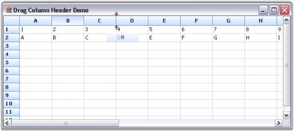 

### OLE Drag-and-Drop

Essential Grid offers support functionality like Object Linking and Embedding (OLE) Drag-and-Drop. A range in one grid can be selected and dragged to another grid or into a Rich Edit Box. The following screen shot shows selected region of grid that has been dragged and dropped into another grid:

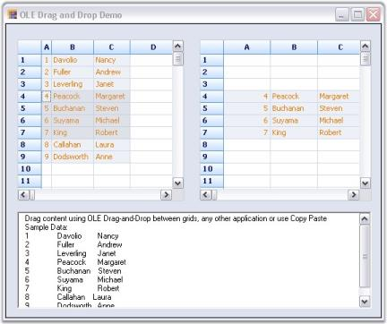

The following code example illustrates this feature.



gridControl1.AllowDrop = true;

gridControl2.AllowDrop = true;

private void gridControl1_DragOver(object sender, DragEventArgs e)

{

    e.Effect = DragDropEffects.Copy;

}

private void gridControl2_DragOver(object sender, DragEventArgs e)

{

    e.Effect = DragDropEffects.Copy;

}




gridControl1.AllowDrop = True

gridControl2.AllowDrop = True

private void gridControl1_DragOver(Object sender, DragEventArgs e)

e.Effect = DragDropEffects.Copy

private void gridControl2_DragOver(Object sender, DragEventArgs e)

e.Effect = DragDropEffects.Copy



### Selection Modes

Essential Grid supports different selection modes for grid cells. A specific selection behavior can be set through GridControl.AllowSelection property. The following screen shot shows a window with a list of selection modes.

  

Different types of selection modes are listed with their corresponding descriptions:

* Thealpha blending to highlight selected cellscan be achieved by using GridSelectionFlags.AlphaBlend option or selecting AlphaBlend check box under Selection Modes group box in UI. 
* Thedefault behavior for selecting cells, rows, columns, tables, multiple extending SHIFT key support, and alpha blendingcan be achieved by using GridSelectionFlags.Any option or selecting Any check box under Selection Modes group box in UI. 
* Column selectioncan be achieved by using GridSelectionFlags.Column option or selecting Column check box under Selection Modes group box in UI. 
* Row selectioncan be achieved by using GridSelectionFlags.Row option or selecting Row check box under Selection Modes group box in UI. 
* An existing selection can be extended when a user holds SHIFT key and uses arrow keys by using GridSelectionFlags.Keyboard option or selecting Keyboard check box under Selection Modes group box in UI. 
* Selection of both rows and columns simultaneously when multiple selection is enabledcan be achieved by using GridSelectionFlags.MixRangeType option or selecting MixRangeType check box under Selection Modes group box in UI.
* Selection of entire table can be achieved by using GridSelectionFlags.Table option or selecting Table check box under Selection Modes group box in UI.
* Selection of multiple ranges of cells using CTRL key can be achieved by using GridSelectionFlags.Multiple option or selecting Multiple check box under Selection Modes group box in UI.
* An existing selection using SHIFT key can be extended by using GridSelectionFlags.Shift option or selecting Shift check box under Selection Modes group box in UI. 
* Selection of cells using CTRL key can be disabled by using GridSelectionFlags.None option or selecting Cell check box under Selection Modes group box in UI. 

#### Setting Specific Selection Mode

Specific selection modes can be set by using the following code examples:



this.gridControl1.AllowSelection = GridSelectionFlags.Row;




Me.gridControl1.AllowSelection = GridSelectionFlags.Row


### Banner Cells

Banner cells are multiple cells spanning a single background image. An image to be displayed in the cell can be loaded on disk, by changing the BackgroundImage property for a cell in Property Grid and applying a Banner for the cell area, displaying the image. For a cell background color, Gradient style can be set. Custom cell backgrounds can be drawn by handling DrawCellBackground event. Banner cells can also be defined through a recurring pattern by handling QueryBanneredRange event.

The following screen shot shows an example of how multiple cells span a single background image to form banner cells.

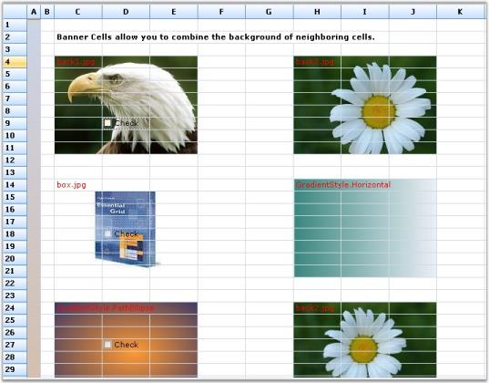 

Displaying Image using Banner Cells

The following code example illustrates how to display images by using banner cells:

 


GridStyleInfo style;

style = grid[4, 3];

grid.BanneredRanges.Add(GridRangeInfo.FromTlhw(4, 3, 8, 3));

style.BackgroundImage = GetImage(@"common\Images\Grid\BannerCells\back1.jpg");

style.Text = "back1.jpg";

style.TextColor = Color.Red;

style.BackgroundImageMode = GridBackgroundImageMode.StretchImage;




Dim style As GridStyleInfo

style = grid(4, 3)

grid.BanneredRanges.Add(GridRangeInfo.FromTlhw(4, 3, 8, 3))

style.BackgroundImage = GetImage("common\Images\Grid\BannerCells\back1.jpg")

style.Text = "back1.jpg"

style.TextColor = Color.Red

style.BackgroundImageMode = GridBackgroundImageMode.StretchImage


### Merge Cells Feature

Merge Cells feature merges two or more adjacent cells with the same value into one cell and displays the content in the merged cell. A single cell is created by combining two or more selected cells.

N> The data in the merged cells will be displayed on the first cell of the merged range.

To use merge cells, you need to set Model.Options.MergeCellsMode and MergeCell properties of the cells to select the required merge behavior for cells.

1. The GridMergeCellsMode enumeration specifies behavior of the merged cells in a grid. Following is the list of options under this enumeration:

   * None-

   Merge cells behavior is disabled.

   * OnDemandCalculation-

   The number of cells to be merged are calculated before the merged cells are displayed and the results are saved. Floating cells will only be recalculated if the width or content of the cells change.

   * BeforeDisplayCalculation-

   The number of cells to be merged are always calculated before cells are displayed.

   * MergeRowsInColumn-

   Enables merging of neighboring cells among rows in the same column.

   * MergeColumnsInRow-

   Enables merging of neighboring cells among columns in the same row.

   * SkipHiddenCells-

   Skips hidden rows and columns while merging the cells. This means that the hidden rows or columns in the grid are not considered during the merge process.

2. GridMergeCellDirection enumeration specifies the merge behavior for an individual cell when merging cells feature has been enabled. Here is the list of options offered:

   * None-

   Merging cells is disabled.

   * ColumnsInRow-

   Merges with neighboring columns in the same row.

   * RowsInColumn-

   Merges with neighboring rows in the same column.

The following code examples illustrate how to set the MergeCellsMode and MergeCell properties.



this.gridControl1.Model.Options.MergeCellsMode = GridMergeCellsMode.OnDemandCalculation | GridMergeCellsMode.MergeRowsInColumn;

//Merges cells in column 2.

this.gridControl1.ColStyles[2].MergeCell = GridMergeCellDirection.RowsInColumn;




Me.gridControl1.Model.Options.MergeCellsMode = GridMergeCellsMode.OnDemandCalculation Or GridMergeCellsMode.MergeRowsInColumn

'Merges cells in column 2.

Me.gridControl1.ColStyles(2).MergeCell = GridMergeCellDirection.RowsInColumn

The following screen shots illustrate the merge cells feature in Essential Grid.

 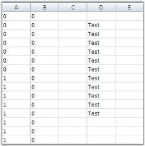 

  

### Real-time Applications

This section provides information on the real-time applications of Essential Grid. It includes the following topics.

### Gaming Applications

Essential Grid is used to implement gaming application

#### Example

Let us consider the Tetris game application, which is implemented by using Essential Grid. This game application makes use of arrow keys to move the blocks and change the block shape. It also provides an option to display the next block.

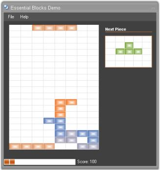 

A sample demonstrating this feature is available under the following sample installation path.

    <Install Location>\Syncfusion\EssentialStudio\[Version Number]\Windows\Grid.Windows\Samples\Product Showcase\Essential Blocks Demo

### MS Excel 2007-like UI

Essential Grid control provides support to implement Microsoft Excel 2007-like User Interface (UI). It contains Name Box that shows the current selection range and Formula Bar, which supports the formula cells. The row and column headers of the selected range are highlighted on the UI. This feature is similar to Excel.

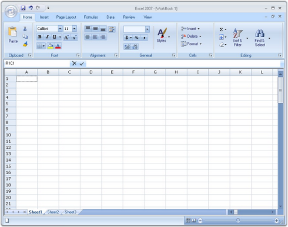

A sample demonstrating this feature is available under the following sample installation path.

    <Install Location>\Syncfusion\EssentialStudio\[Version Number]\Windows\Grid.Windows\Samples\Product Showcase\Excel Like UI Demo

### Grid Folder Browser

Essential Grid can be used to develop a powerful TreeView control owing to its flexibility. The tree nodes can be created through custom TreeCell cell type. GridStaticCellModel class is inherited to create this cell type. The plus/minus buttons of the tree nodes are selected by using ImageIndex property. 

#### Example

Let us consider the Grid Folder Browser sample which is available under the following installation path.

    <Install Location>\Syncfusion\EssentialStudio\[Version Number]\Windows\Grid.Windows\Samples\Product Showcase\Grid Folder Browser Demo

This sample operates grid in virtual mode in order to populate the data dynamically on demand, i.e., when the tree is expanded. QueryCellInfo, QueryColCount and QueryRowCount events must be handled in order to implement virtual grid. These events provide basic information about the number of rows and columns and the values of the data.

The following code example illustrates how to set the data from the data source.


void GridQueryCellInfo(object sender, GridQueryCellInfoEventArgs e) 

{

if (e.RowIndex > 0 && e.ColIndex > 0) 

{ 

e.Style.CellValue = externalData[e.RowIndex - 1].Items[e.ColIndex - 1]; 

if (e.ColIndex == 1) 

{

e.Style.CellType = "TreeCell"; 

e.Style.Tag = externalData[e.RowIndex - 1].IndentLevel; 

e.Style.ImageIndex = (int) externalData[e.RowIndex - 1].ExpandState; 

} 

}

e.Handled = true;

}



 

Private Sub GridQueryCellInfo(ByVal sender As Object, ByVal e As GridQueryCellInfoEventArgs)

If e.RowIndex > 0 AndAlso e.ColIndex > 0 Then

e.Style.CellValue = externalData(e.RowIndex - 1).Items(e.ColIndex - 1)

If e.ColIndex = 1 Then

e.Style.CellType = "TreeCell"

e.Style.Tag = externalData(e.RowIndex - 1).IndentLevel

e.Style.ImageIndex = CInt(Fix(externalData(e.RowIndex - 1).ExpandState))

End If

End If

e.Handled = True

End Sub



The implementation uses CollapsibleDataSource class. This class makes use of custom collection to hold a list of SampleData objects. (Consider each of these objects as a row in the underlying grid). Each row carries information on a specific folder. Each SampleData object has IndentValue property, ExpandState property, and Items string array that holds the different column values for this row. The column values display folder details like the name of the folder, folder size and so on. This class also contains InsertData method, which retrieves data of inner subtree and inserts data into the collection when a node is expanded.

 

### Multiple Document Interface (MDI) Support

Essential Grid supports Multiple Document Interface (MDI) by enabling users to work with multiple grid controls simultaneously. Here, multiple windows reside under a single parent window.

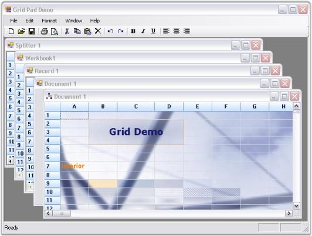 

A sample demonstrating this feature is available under the following sample installation path.

    <Install Location>\Syncfusion\EssentialStudio\[Version Number]\Windows\Grid.Windows\Samples\Product Showcase\Grid Pad Demo

### Clipboard Support

This section discusses clipboard support provided by Essential Grid. It includes the following topics.

### Managing Clipboard Operations with GridModelCutPaste

GridModelCutPaste class manages Cut, Copy and Paste operations for a grid. You can access this class from a grid with the Grid.Model.CutPaste property. This class provides many properties and functions.

Here is the list of properties and methods:

* ClipboardFlags -This property gets or sets various properties of GridDragDropFlags class, which specifies how the clipboard operations like cut, copy, and paste should be handled.

The following code examples illustrate how to set ClipboardFlags by using the GridDragDropFlags.Styles property:



this.gridControl1.Model.CutPaste.ClipboardFlags = GridDragDropFlags.Styles;



Me.gridControl1.Model.CutPaste.ClipboardFlags = GridDragDropFlags.Styles



* CanCopy - This method checks whether there are selected ranges of cells that can be copied to clipboard or if the current cell's contents can be copied. The return type of this method is Boolean. If it returns true, it indicates that the selected range of cells or the current cell's contents can be copied to the clipboard. If it is false, it indicates that the selected range of cells or the current cell's contents cannot be copied to the clipboard.
N> Any content copied is pasted to the Clipboard by default.

The following code example is used to call CanCopy method:



this.gridControl1.Model.CutPaste.CanCopy();




Me.gridControl1.Model.CutPaste.CanCopy()


* Copy - This method copies the contents of selected cells and the current cell's contents to the clipboard.

The following code example is used to call the Copy method:

 



this.gridControl1.Model.CutPaste.Copy();




Me.gridControl1.Model.CutPaste.Copy()



* CopyRange(GridRangeInfo range) - This method copies the contents of a specified range of cells to the clipboard. The range of cells to be copied is given to the method as a parameter. For example, if the range is specified to be (2,2), the selection is restricted to the cell with row index 2 and column index 2 of the grid.

The following code example shows how to call this method:



this.gridControl1.Model.CutPaste.CopyRange(GridRangeInfo.Cell(2, 2));




Me.gridControl1.Model.CutPaste.CopyRange(GridRangeInfo.Cell(2, 2))


* CopyTextToClipboard(GridRangeInfo range) - This method copies the formatted text of a specified range of cells to clipboard. The range of cells to be copied is given to the method as a parameter. For example, if the range is specified to be (1,2,1,4), the selection starts from the cell (1,2) – with row index 1 and column index 2 to the cell (1,4) – with row index 1 and column index 4 of the grid.

The following code example shows how to call this method:



this.gridControl1.Model.CutPaste.CopyTextToClipboard(GridRangeInfo.Cells(1, 2, 1, 4));




Me.gridControl1.Model.CutPaste.CopyTextToClipboard(GridRangeInfo.Cells(1, 2, 1, 4))



* CopyCellsToClipboard(GridRangeInfoList list, bool bLoadBaseStyles) - This method copies the style information of a specified range of cells to clipboard. The range of cells to be copied is given to the method as the first parameter. The second parameter represents a Boolean value. The base style will be copied along with default settings, if it is set to true. Only the default settings that were initialized to the cell are copied if it is set to false.

The following code example shows how to call this method:



GridRangeInfoList list = new GridRangeInfoList();

list.Add(GridRangeInfo.Cell(2, 2));

this.gridControl1.Model.CutPaste.CopyCellsToClipboard(list, true);




Dim list As New GridRangeInfoList()

list.Add(GridRangeInfo.Cell(2, 2))

Me.gridControl1.Model.CutPaste.CopyCellsToClipboard(list, True)



* CanCut-This method checks if there are selected ranges that can be cut or if the current cell's contents can be cut. The return type of this method is Boolean. If it returns true, it indicates that the content in the selected range of cells or the current cell's content can be cut. This method returns false, when no selected range is available to cut.
N> Any content cut is pasted to the clipboard by default.

The following code example shows how to call this method:


this.gridControl1.Model.CutPaste.CanCut();




Me.gridControl1.Model.CutPaste.CanCut()


* Cut - This method cuts the content of the selected cells and the current cell, and pastes them to the clipboard.

The following code example shows how to call this method:



this.gridControl1.Model.CutPaste.Cut();





Me.gridControl1.Model.CutPaste.Cut()



* CutRange(GridRangeInfo rangelist) - This method cuts the content of a specified range of cells and pastes it to the clipboard. The range of cells to be cut is specified as a parameter. 

The following code examples show how to call this method:


this.gridControl1.Model.CutPaste.CutRange(GridRangeInfo.Row(4), false);




Me.gridControl1.Model.CutPaste.CutRange(GridRangeInfo.Row(4), False)



* CanPaste - This method checks for the most recent content in the clipboard that can be pasted in the grid. The return type of this method is Boolean. If it returns true, it indicates that the contents in the clipboard can be pasted into the grid. If there is no content available in the clipboard to paste, this method returns false.

The following code example shows how to call this method:



this.gridControl1.Model.CutPaste.CanPaste();





Me.gridControl1.Model.CutPaste.CanPaste()


* Paste-This method pastes the content from the clipboard into the grid at the current selected range or current cell.
N> It is not mandatory to call this method after CanPaste method. If there is no content in the clipboard to be pasted, this method will not respond.

The following code examples show how to call this method:



this.gridControl1.Model.CutPaste.Paste();




Me.gridControl1.Model.CutPaste.Paste()


### Clipboard Events

Essential Grid exposes various events to manage the clipboard content while performing cut, paste and copy operations. Following is the list of clipboard events:

* ClipboardCanCopy - This event is to be handled when the CanCopy method of grid is called.
* ClipboardCanPaste - This event is to be handled when the CanPaste method of grid is called.
* ClipboardCanCut - This event is to be handled when the CanCut method of grid is called.
* ClipboardCopy - This event is to be handled when the Copy method of grid is called.
* ClipboardCut - This event is to be handled when the Cut method of grid is called.
* ClipboardPaste - This event is to be handled when the Paste method of grid is called.
* ClipboardPasted - This event is to be handled after a paste operation.

### Performance

Essential Grid control has an extremely high performance standard. It can handle high frequency updates and work with large amounts of data without its performance being affected.

### High Frequency Real Time Updates

Essential Grid supports frequent updates that occur in random cells across the grid while keeping CPU usage to a minimum level.

#### Example:

In this example, a timer changes the cell in short intervals, inserts and removes rows. This example draws cell changes directly to the graphics context instead of performing an Invalidate. It also shows you text using GDI instead of GDI+ and how to optimize updates for inserting and removing rows. You can start multiple instances without slowing down your machine. You can confirm the same by viewing TaskManager CPU usage while the sample runs.

 

A sample demonstrating this feature is available under the following sample installation path:

    <Install Location>\Syncfusion\EssentialStudio\[Version Number]\Windows\Grid.Windows\Samples\Performance\Trader Grid Test Demo

### Data Handling

Essential Grid control supports large amount of data without a performance hit.

#### Example:

This example will step you through following three ways of populating an Essential Grid:

* The first technique just loops through cells and uses an indexer on the Grid control to set the values.
* The second uses PopulateValues method that optimally places data from a data source into a grid range.
* The third technique uses an Essential Grid in a virtual manner.

You can specify the size of the grid that is to be populated while running the sample and then you can try all the three methods to compare the performance. However, the .NET Framework JIT slows the first population owing to one-time jitting of the code.

2. Using Indexer

   This technique loops through the cells and uses an indexer on the Grid control to set values.

   ~~~ cs

			for (int i = 0; i < this.numArrayRows; ++i)

				for (int j = 0; j < this.numArrayCols; ++j)

					this.gridControl1[i + 1, j + 1].CellValue = this.intArray[i, j]; 

   ~~~
   {:.prettyprint}
   
   ~~~ vbnet

			For i As Integer = 0 To Me.numArrayRows - 1

			For j As Integer = 0 To Me.numArrayCols - 1

			Me.gridControl1(i + 1, j + 1).CellValue = Me.intArray(i, j)

			Next j

			Next i

   ~~~
   {:.prettyprint}

3. Populating Values
4. PopulateValues method is used to move values from a given data source into the specified grid range. The first parameter specifies range of destination cells where data is to be copied and the second parameter specifies data source to the destination cells.

   ~~~ cs

				gridControl1.Model.PopulateValues(GridRangeInfo.Cells(top, left, bottom, right), this.intArray);

   ~~~
   {:.prettyprint}
   
   ~~~ vbnet

				gridControl1.Model.PopulateValues(GridRangeInfo .Cells(top, left, bottom, right), Me.intArray)

   ~~~
   {:.prettyprint}

5. Implementing Virtual Mode
6. Three events need to be handled in order to implement a virtual mode. They perform the following actions:
   * Determine number of rows
   * Determine number of columns
   * Pass value to a cell from a data source.

   ~~~ cs

				//Determines number of rows.      

				this.gridControl1.QueryRowCount += new GridRowColCountEventHandler(GridQueryRowCount); 

				private void GridQueryRowCount(object sender, GridRowColCountEventArgs e)

				{ 

					e.Count = this.numArrayRows;

					e.Handled = true;

				}  

				//Determines number of columns.

				this.gridControl1.QueryColCount += new GridRowColCountEventHandler(GridQueryColCount);       

				private void GridQueryColCount(object sender, GridRowColCountEventArgs e)

				{

					e.Count = this.numArrayCols;

					e.Handled = true;

				}

				//Passes value to a cell from a given data source.

				this.gridControl1.QueryCellInfo += new GridQueryCellInfoEventHandler(QueryCellInfoHandler);

				private void GridQueryCellInfo(object sender, GridQueryCellInfoEventArgs e)

				{

					if(e.ColIndex > 0 && e.RowIndex > 0)

					{

				//By using indexers, passes value to a cell from a given data source.

						e.Style.CellValue = this.intArray[e.RowIndex - 1, e.ColIndex - 1];

						e.Handled = true;

					}

				}

   ~~~
   {:.prettyprint}
   
   ~~~ vbnet

				'Determines number of rows.

				Private Me.gridControl1.QueryRowCount += New GridRowColCountEventHandler(AddressOf GridQueryRowCount)

				Private Sub GridQueryRowCount(ByVal sender As Object, ByVal e As GridRowColCountEventArgs)

				e.Count = Me.numArrayRows

				e.Handled = True

				End Sub

				'Determines the number of columns.

				Private Me.gridControl1.QueryColCount += New GridRowColCountEventHandler(AddressOf GridQueryColCount)

				Private Sub GridQueryColCount(ByVal sender As Object, ByVal e As GridRowColCountEventArgs)

				e.Count = Me.numArrayCols

				e.Handled = True

				End Sub

				'Passes value to a cell from a given data source.

				Private Me.gridControl1.QueryCellInfo += New GridQueryCellInfoEventHandler(AddressOf QueryCellInfoHandler)

				Private Sub GridQueryCellInfo(ByVal sender As Object, ByVal e As GridQueryCellInfoEventArgs)

				If e.ColIndex > 0 AndAlso e.RowIndex > 0 Then

				'By using indexers, passes value to a cell from a given data source.

				e.Style.CellValue = Me.intArray(e.RowIndex - 1, e.ColIndex - 1)

				e.Handled = True

				End If

				End Sub

   ~~~
   {:.prettyprint}

   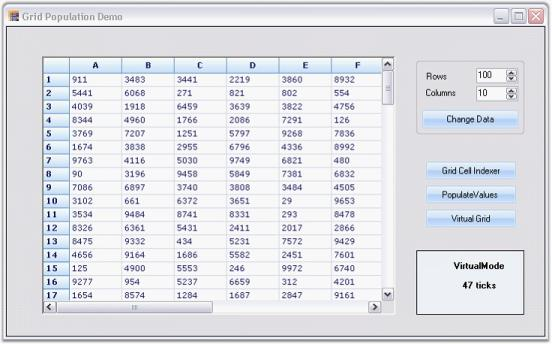

A sample demonstrating this feature is available under the following sample installation path.

    <Install Location>\Syncfusion\EssentialStudio\[Version Number]\Windows\Grid.Windows\Samples\Performance\Trader Grid Test Demo

### Zooming options

This section discusses the following zooming options:

### Cell-level and grid-level

We can implement zooming functionality in Essential Grid to show a magnified image of the Grid for better visualization. A method named ZoomGrid is used for this purpose. It accepts the percentage of zoom as the parameter and then uses this value to set the font size and cell size for the grid. Zooming can be implemented at cell-level and at grid-level.

The following screen shot shows a grid that is zoomed to the grid-level.

 

The following screen shot shows a grid that is zoomed to the cell-level.

 

#### Example

This example implements zooming functionality for Essential Grid at cell-level. Follow the steps listed below:

1. Call the ZoomGrid method by passing the percentage of zoom as the parameter. The below code illustrates this.

   ~~~ cs

				private void zoomGrid(float percent)

				{

					this.gridControl1.BeginUpdate();

					currentPercent = percent;

					for (int i = 0; i <= gridControl1.ColCount; i++)

					{

						for (int j = 0; j <= gridControl1.RowCount; j++)

						this.gridControl1[j, i].Font.Size = fontSize * currentPercent;

						this.gridControl1.Model.ColWidths[i] = (int)(percent * defColWidth);

					}

					this.gridControl1.ColWidths[0] = (int)(percent * headerColWd);

					this.gridControl1.DefaultColWidth = (int)(percent * defColWidth);

					this.gridControl1.DefaultRowHeight = (int)(percent * defRowHeight);

					this.gridControl1.RowHeights[0] = (int)(percent * headerRowHt);

					this.gridControl1.EndUpdate();

					this.gridControl1.Refresh();

				}

   ~~~
   {:.prettyprint}
   
   ~~~ vbnet

				Private Sub zoomGrid(ByVal percent As Single)

					Me.label1.Text = Me.trackBar1.Value.ToString() & "%"

					Me.label1.Refresh()

					Me.gridControl1.BeginUpdate()

					currentPercent = percent

					For i As Integer = 0 To gridControl1.ColCount

						For j As Integer = 0 To gridControl1.RowCount

							Me.gridControl1(j, i).Font.Size = fontSize * currentPercent

						Next j

						Me.gridControl1.Model.ColWidths(i) = CInt(Fix(percent * defColWidth))

					Next i

					Me.gridControl1.ColWidths(0) = CInt(Fix(percent * headerColWd))

					Me.gridControl1.DefaultColWidth = CInt(Fix(percent * defColWidth))

					Me.gridControl1.DefaultRowHeight = CInt(Fix(percent * defRowHeight))

					Me.gridControl1.RowHeights(0) = CInt(Fix(percent * headerRowHt))

					Me.gridControl1.EndUpdate()

					Me.gridControl1.Refresh()

				End Sub

   ~~~
   {:.prettyprint}

   The preceding code sets the font and cell size using the percent parameter.

2. When the cell to be zoomed is clicked, handle CellClick event to display it as a zoomed cell. Here we use a PictureBox to show the magnified view of the cell content. 
   N> A PictureBox is a Microsoft’s .NET Control used to display an image.

   ~~~ cs

				//Code to show zoomed window.

				private System.Windows.Forms.PictureBox zoomWindow;

				private void gridControl1_CellClick(object sender, GridCellClickEventArgs e)

				{

					if (e.RowIndex > 0 && e.ColIndex > 0)

					{

						if (checkBox1.Checked)

						{

							if (!zoomWindow.Visible)

							this.zoomWindow.Visible = true;

							Point p1 = new Point(0, 0);

							Size s = new Size(this.gridControl1.ColWidths[e.ColIndex] + 10, this.gridControl1.RowHeights[e.RowIndex] + 5);

							s.Width += 50;

							s.Height += 30;

							Rectangle rect = new Rectangle(p1, s);

							zoomWindow.Size = s;

							Bitmap bmp = new Bitmap(s.Width, s.Height);

							Graphics g = Graphics.FromImage(bmp);

							GridStyleInfo style = gridControl1[e.RowIndex, e.ColIndex];

							float size = style.Font.Size;

							style.Font.Size = 15.5f;

							gridControl1.DrawSingleCell(g, e.RowIndex, e.ColIndex, rect, style, true, true);

							g.Dispose();

							this.zoomWindow.Image = bmp;

							this.zoomWindow.BorderStyle = BorderStyle.FixedSingle;

							this.zoomWindow.Visible = true;

							Point pt = this.gridControl1.ViewLayout.RowColToPoint(e.RowIndex, e.ColIndex, GridCellSizeKind.VisibleSize);

							pt.Y += 60;

							zoomWindow.Location = pt;

							style.Font.Size = size;

						}

					}

					else

					{

						this.zoomWindow.Visible = false;

						MessageBox.Show("Not a record cell");

					}

				}

   ~~~
   {:.prettyprint}

   ~~~ vbnet

				Private zoomWindow As System.Windows.Forms.PictureBox

				'Code to show zoomed window.

				Private Sub gridControl1_CellClick(ByVal sender As Object, ByVal e As GridCellClickEventArgs)

					If e.RowIndex > 0 AndAlso e.ColIndex > 0 Then

						If checkBox1.Checked Then

							If (Not zoomWindow.Visible) Then

								Me.zoomWindow.Visible = True

							End If

							Dim p1 As Point = New Point(0, 0)

							Dim s As Size = New Size(Me.gridControl1.ColWidths(e.ColIndex) + 10, Me.gridControl1.RowHeights(e.RowIndex) + 5)

							s.Width += 50

							s.Height += 30

							Dim rect As Rectangle = New Rectangle(p1, s)

							zoomWindow.Size = s

							Dim bmp As Bitmap = New Bitmap(s.Width, s.Height)

							Dim g As Graphics = Graphics.FromImage(bmp)

							Dim style As GridStyleInfo = gridControl1(e.RowIndex, e.ColIndex)

							Dim size As Single = style.Font.Size

							style.Font.Size = 15.5F

							gridControl1.DrawSingleCell(g, e.RowIndex, e.ColIndex, rect, style, True, True)

							g.Dispose()

							Me.zoomWindow.Image = bmp

							Me.zoomWindow.BorderStyle = BorderStyle.FixedSingle

							Me.zoomWindow.Visible = True

							Dim pt As Point = Me.gridControl1.ViewLayout.RowColToPoint(e.RowIndex, e.ColIndex, GridCellSizeKind.VisibleSize)

							pt.Y += 60

							zoomWindow.Location = pt

							style.Font.Size = size

						End If

					Else

						Me.zoomWindow.Visible = False

						MessageBox.Show("Not a record cell")

					End If

				End Sub
   ~~~
   {:.prettyprint}

Now when you click any cell, it displays a picture box over the cell showing cell content in a magnified manner.

N> For more details on this feature, refer the following browser sample:

    <Install Location>\Syncfusion\EssentialStudio\[Version Number]\Windows\Grid.Windows\Samples\Zoom and Scroll\Zooming Demo

### Tile Image In Grid Cell 

Essential GridControl supports Tile Image feature in Grid cell. Set BackgroundImageMode property to GridBackgroundImageMode.TileImage to add title image in grid cell.

The following code illustrates how to add Tile Image feature in Grid cell.



this.gridControl1[2, 2].BackgroundImageMode = GridBackgroundImageMode.TileImage;




  Me.gridControl1(2, 2).BackgroundImageMode = GridBackgroundImageMode.TileImage
  

When the code runs, the following image is displayed.

