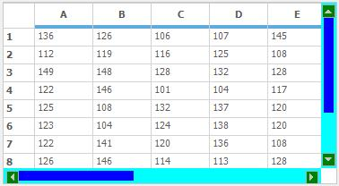
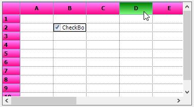

# Visual Styles
The GridControl can be displayed with the different themes by using the [GridVisulStyles](http://help.syncfusion.com/cr/cref_files/windowsforms/grid/Syncfusion.Grid.Windows~Syncfusion.Windows.Forms.Grid.GridControl~GridVisualStyles.html) property. The following themes are available for GridControl,

* Office2003
* Office2007Blue
* Office2007Black
* Office2007Silver
* Office2010Blue
* Office2010Black
* Office2010Silver
* Metro
* SystemTheme



//Applying Visual Styles to the Grid 
this.gridControl1.GridVisualStyles = Syncfusion.Windows.Forms.GridVisualStyles.Office2010Black;


'Applying Visual Styles to the Grid 
Me.gridControl1.GridVisualStyles = Syncfusion.Windows.Forms.GridVisualStyles.Office2010Black



N> To apply the enhanced themes to the GridControl, set [EnableLegacyStyle](http://help.syncfusion.com/cr/cref_files/windowsforms/grid/Syncfusion.Grid.Grouping.Windows~Syncfusion.Windows.Forms.Grid.Grouping.GridTableModel~EnableLegacyStyle.html) property to `false`. 
N> The change of visual styles can be handled by using the [ThemesChanged](http://help.syncfusion.com/cr/cref_files/windowsforms/grid/Syncfusion.Grid.Windows~Syncfusion.Windows.Forms.Grid.GridControlBase~ThemeChanged_EV.html) event. It will be fired while changing the[GridVisualStyles](http://help.syncfusion.com/cr/cref_files/windowsforms/grid/Syncfusion.Grid.Windows~Syncfusion.Windows.Forms.Grid.GridControl~GridVisualStyles.html) of the GridControl.

## Enabling Visual Styles	
In GridControl, themes can be enabled by setting the [ThemesEnabled](http://help.syncfusion.com/cr/cref_files/windowsforms/grid/Syncfusion.Grid.Windows~Syncfusion.Windows.Forms.Grid.GridControlBase~ThemesEnabled.html) property value as `true`. By default the grid will be loaded with the `SystemTheme`.


//To apply other visual styles except SystemTheme
this.gridControl1.ThemesEnabled = true;


'To apply other visual styles except SystemTheme
Me.gridControl1.ThemesEnabled = True



## Applying skin for ComboBox Cell
There will be no themes applied to the ComboBox cell by default. If you want to enable the theme, set [EnableGridListControlInCobmoBox](http://help.syncfusion.com/cr/cref_files/windowsforms/grid/Syncfusion.Grid.Windows~Syncfusion.Windows.Forms.Grid.GridModel~EnableGridListControlInComboBox.html)  property to false. It will add the [GridListControl](http://help.syncfusion.com/windowsforms/gridlist/creating-grid-list-control) to the ComboBox drop down and the visual style of the grid will be applied. 


// To Use GridComboBoxCellModel in Grid
this.gridControl1.Model.EnableGridListControlInComboBox = false;


' To Use GridComboBoxCellModel in Grid
Me.gridControl1.Model.EnableGridListControlInComboBox = False



## Modifying Metro Colors
Custom colors can be applied to the metro theme by using the [SetMetroStyle](http://help.syncfusion.com/cr/cref_files/windowsforms/grid/Syncfusion.Grid.Grouping.Windows~Syncfusion.Windows.Forms.Grid.Grouping.GridGroupingControl~SetMetroStyle.html) method. It can be used to change the colors of Mouse hover, pressed and clicked colors of the Headers and the embedded cell controls of the GridControl.


//Create GridMetroColors object for customizing the metro visual style
GridMetroColors metroColor = new GridMetroColors();

//Set custom colors to Metro Headers of the GridControl
metroColor.HeaderColor.NormalColor = Color.Pink;
metroColor.HeaderColor.HoverColor = Color.Orange;
metroColor.HeaderColor.PressedColor = Color.GhostWhite;

//set bottom border color of the column header
metroColor.HeaderBottomBorderColor = Color.Green;

//Set the back colors for the CheckBox and ComboBox
metroColor.CheckBoxColor.BackColor = Color.Brown;
metroColor.ComboboxColor.NormalBackColor = Color.Yellow;

//Apply Custom colors to the Metro visual style
this.gridControl1.SetMetroStyle(metroColor);


'Create GridMetroColors object for customizing the metro visual style
Dim metroColor As New GridMetroColors()

'Set custom colors to Metro Headers of the GridControl
metroColor.HeaderColor.NormalColor = Color.Pink
metroColor.HeaderColor.HoverColor = Color.Orange
metroColor.HeaderColor.PressedColor = Color.GhostWhite

'set bottom border color of the column header
metroColor.HeaderBottomBorderColor = Color.Green

'Set the back colors for the CheckBox and ComboBox
metroColor.CheckBoxColor.BackColor = Color.Brown
metroColor.ComboboxColor.NormalBackColor = Color.Yellow

'Apply Custom colors to the Metro visual style
Me.gridControl1.SetMetroStyle(metroColor)




### Modifying Metro Scrollbar Colors
The Scrollbars of the metro visual style can be customized by setting the [MetroColorTable](http://help.syncfusion.com/cr/cref_files/windowsforms/grid/Syncfusion.Shared.Base~Syncfusion.Windows.Forms.MetroColorTable.html) property as of follows. 


//Used to set the custom colors to the Metro scrollbars
this.gridControl1.MetroColorTable.ScrollerBackground = Color.Aqua;
this.gridControl1.MetroColorTable.ArrowNormalBackGround = Color.Green;
this.gridControl1.MetroColorTable.ThumbNormal = Color.Blue;


'Used to set the custom colors to the Metro scrollbars
Me.gridControl1.MetroColorTable.ScrollerBackground = Color.Aqua
Me.gridControl1.MetroColorTable.ArrowNormalBackGround = Color.Green
Me.gridControl1.MetroColorTable.ThumbNormal = Color.Blue



N> The scrollbar customization is briefly discussed in the [Scrolling](CellGrid_Scrolling_Adhi.docx) section.

### Apply Skins to the GridControl
The more advanced themes along with the basic themes defined by GridVisualStyles can be added to the grid by using the [GridSkins](http://help.syncfusion.com/cr/cref_files/windowsforms/gridconverter/Syncfusion.GridHelperClasses.Windows~Syncfusion.GridHelperClasses.GridSkins.html). It is available as an add-on feature in the [GridHelperClasses](http://help.syncfusion.com/cr/cref_files/windowsforms/gridconverter/Syncfusion.GridHelperClasses.Windows.html) library. `GridSkins` depict the custom skin of `GridVisualStyles`. Currently, it comes with Vista skin that makes the grid components appear in vista-like look and feel. This can be set to the grid by using the [ApplySkin](http://help.syncfusion.com/cr/cref_files/windowsforms/gridconverter/Syncfusion.GridHelperClasses.Windows~Syncfusion.GridHelperClasses.GridSkins~ApplySkin.html) method.


//Apply skin to the GridControl
GridSkins.ApplySkin(this.gridControl1.Model, Skins.Vista);


'Apply skin to the GridControl
GridSkins.ApplySkin(Me.gridControl1.Model, Skins.Vista)



## Skin Manager
Theme can also be applied to the GridControl by using [SetVisualStyle](http://help.syncfusion.com/cr/cref_files/windowsforms/grid/Syncfusion.Shared.Base~Syncfusion.Windows.Forms.IContextMenuProvider~SetVisualStyle.html) method of [SkinManager](http://help.syncfusion.com/cr/cref_files/windowsforms/grid/Syncfusion.Shared.Base~Syncfusion.Windows.Forms.SkinManager_members.html).



// Code for applying visual theme for only one control.
SkinManager.SetVisualStyle(this.gridControl1, VisualTheme.Office2010Blue );



' Code for applying visual theme for only one control.
SkinManager.SetVisualStyle(Me.gridControl1, VisualTheme.Office2010Blue)




The [SkinManager](http://help.syncfusion.com/cr/cref_files/windowsforms/grid/Syncfusion.Shared.Base~Syncfusion.Windows.Forms.SkinManager_members.html) provides the supports for all the [VisualTheme](http://help.syncfusion.com/cr/cref_files/windowsforms/grid/Syncfusion.Shared.Base~Syncfusion.Windows.Forms.VisualTheme.html) available in GridControl. It is also used to apply the same visual style for all the Syncfusion controls in the form.




// Code for applying visual theme for the whole form.
SkinManager.SetVisualStyle(this, VisualTheme.Office2010Blue);


' Code for applying visual theme for the whole form.
SkinManager.SetVisualStyle(Me, VisualTheme.Office2010Blue)



## Customizing Visual Styles
All the elements of the GridControl’s appearance can be customized. This section will explain about the customization of the themes using [IVisualStylesDrawing](http://help.syncfusion.com/cr/cref_files/windowsforms/gridconverter/Syncfusion.Shared.Base~Syncfusion.Windows.Forms.IVisualStylesDrawing.html). 

### Customization Using IVisualStylesDrawing
The grid can be applied with the [custom visual styles](https://www.syncfusion.com/kb/760/how-can-i-create-the-custom-themes-and-apply-to-the-gridcontrol) by implementing the [IVisualStylesDrawing](http://help.syncfusion.com/cr/cref_files/windowsforms/grid/Syncfusion.Shared.Base~Syncfusion.Windows.Forms.IVisualStylesDrawing_members.html) interface. This interface provides the list of methods for drawing the icons and header colors of the grid.



public class CustomTheme : IVisualStylesDrawing
{
    private GridVisualStyles visualStyle;

    public CustomTheme(GridVisualStyles style)
    {
        this.visualStyle = style;

    }
    public CustomTheme(GridVisualStyles style, bool legacyStyle)
    {
        this.visualStyle = style;
        this.isLegacyStyle = legacyStyle;
    }

    
    public void DrawHeaderStyle(Graphics g, Rectangle rect, ThemedHeaderDrawing.HeaderState state)
    {            
        //Check for empty headers
        if (rect.Height == 0 && rect.Width == 0)
            return;

        //Check for the current state of the header and paints the foreground accordingly.

        if (state == ThemedHeaderDrawing.HeaderState.Normal)
        {
            LinearGradientBrush br = new LinearGradientBrush(rect, Color.FromArgb(255, 128, 255), Color.FromArgb(255, 0, 128), LinearGradientMode.Vertical);
            g.FillRectangle(br, rect);                
            g.FillRectangle(br, new Rectangle(rect.X + 1, rect.Y + 1, rect.Width - 2, rect.Height - 2));
            br.Dispose();
        }            
        else
        {               
            LinearGradientBrush br = new LinearGradientBrush(rect, Color.FromArgb(0, 128, 0), Color.FromArgb(128, 255, 128), LinearGradientMode.Vertical);
            g.FillRectangle(br, rect);
            g.FillRectangle(br, new Rectangle(rect.X + 1, rect.Y + 1, rect.Width - 2, rect.Height - 2));
            br.Dispose();
        }
    }
    // IVisualStylesDrawing Members …
}



Public Class CustomTheme
	Implements IVisualStylesDrawing
	Private visualStyle As GridVisualStyles

	Public Sub New(ByVal style As GridVisualStyles)
		Me.visualStyle = style

	End Sub
	Public Sub New(ByVal style As GridVisualStyles, ByVal legacyStyle As Boolean)
		Me.visualStyle = style
		Me.isLegacyStyle = legacyStyle
	End Sub

	Public Sub DrawHeaderStyle(ByVal g As Graphics, ByVal rect As Rectangle, ByVal state As ThemedHeaderDrawing.HeaderState)
		'Check for empty headers
		If rect.Height = 0 AndAlso rect.Width = 0 Then
			Return
		End If

		'Check for the current state of the header and paints the foreground accordingly.

		If state Is ThemedHeaderDrawing.HeaderState.Normal Then
			Dim br As New LinearGradientBrush(rect, Color.FromArgb(255, 128, 255), Color.FromArgb(255, 0, 128), LinearGradientMode.Vertical)
			g.FillRectangle(br, rect)
			g.FillRectangle(br, New Rectangle(rect.X + 1, rect.Y + 1, rect.Width - 2, rect.Height - 2))
			br.Dispose()
		Else
			Dim br As New LinearGradientBrush(rect, Color.FromArgb(0, 128, 0), Color.FromArgb(128, 255, 128), LinearGradientMode.Vertical)
			g.FillRectangle(br, rect)
			g.FillRectangle(br, New Rectangle(rect.X + 1, rect.Y + 1, rect.Width - 2, rect.Height - 2))
			br.Dispose()
		End If
	End Sub
	' IVisualStylesDrawing Members …
End Class


For applying the customized theme settings to grid, `GridVisualStyles.Custom` option should be set to `GridVisualStyles` property. After that, the `CustomTheme` class can be assigned to [GridVisualStyleDrawing](http://help.syncfusion.com/cr/cref_files/windowsforms/grid/Syncfusion.Grid.Windows~Syncfusion.Windows.Forms.Grid.GridControl~GridVisualStylesDrawing.html) property.


//Adding custom visual styles to the GridControl
this.gridControl1.GridVisualStyles = GridVisualStyles.Custom;
this.gridControl1.Model.Options.GridVisualStylesDrawing = new CustomThemes(GridVisualStyles.Custom);


'Adding custom visual styles to the GridControl
Me.gridControl1.GridVisualStyles = GridVisualStyles.Custom
Me.gridControl1.Model.Options.GridVisualStylesDrawing = New CustomThemes(GridVisualStyles.Custom)



The following KB demonstrates the same with the sample,

[https://www.syncfusion.com/kb/760/how-can-i-create-the-custom-themes-and-apply-to-the-gridcontrol](https://www.syncfusion.com/kb/760/how-can-i-create-the-custom-themes-and-apply-to-the-gridcontrol) 

N> Each theme can be customized by deriving their `GridVisulaStylesDrawing` class. 
N> Ex:[GridVisualStylesOffice2007Black](http://help.syncfusion.com/cr/cref_files/windowsforms/grid/Syncfusion.Shared.Base~Syncfusion.Windows.Forms.GridVisualStylesOffice2007Black.html) 
