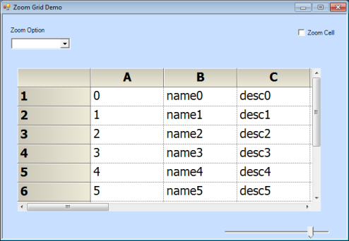
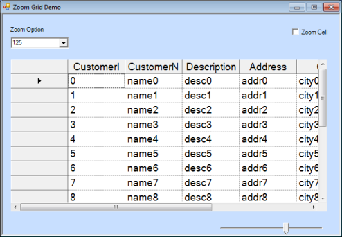
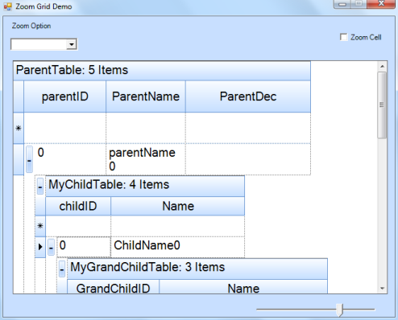

# Zoom Support

Essential Grid provides zoom support for the Grid, GridDataBoundGrid, and GridGrouping controls. With this support, users can zoom in or out of the entire grid as well as individual cells of the grid. 

## Use Case Scenarios

You can zoom in or out the Grid at the specified percentage level in your application by using this feature.

<table>
<tr>
<th>
PROPERTIES </th><th>
DESCRIPTION </th><th>
DATA TYPE </th></tr>
<tr>
<td>
ZoomGridControlCell</td><td>
Used to enable zooming at the cell level for the GridControl.</td><td>
Boolean</td></tr>
<tr>
<td>
ZoomGridDataBoundCell</td><td>
Used to enable zooming at the cell level for the GridDataBoundGrid.</td><td>
Boolean</td></tr>
</table>

<table>
<tr>
<th>
METHODS </th><th>
DESCRIPTION </th><th>
PARAMETERS </th><th>
RETURN TYPE </th></tr>
<tr>
<td>
zoomGrid</td><td>
Gets tde percentage value as tde parameter and uses tdis value to set font and cell size for tde grid. </td><td>
Overloads: 1) (string Arg1)</td><td>
Void</td></tr>
<tr>
<td>
ZoomGrid</td><td>
tdis constructor gets Grid control to be zoomed as a parameter.</td><td>
Overloads:1)(Class Arg1)</td><td>
Constructor </td></tr>
<tr>
<td>
ZoomGroupingGrid</td><td>
tdis constructor gets tde GridGrouping control as a parameter and defines zooming function for tde GridGroupingControl.</td><td>
Overloads:1)(Class Arg1)</td><td>
Constructor</td></tr>
</table>

### Sample Link

To open sample project, navigate to the following sample locations in your system:

#### For GridControl:

_&lt;Install Location&gt;\Syncfusion\EssentialStudio\[Version Number]\Windows\Grid.Windows\Samples\Zoom and Scroll\Zooming Demo_

#### For GridDataBoundGrid:

_&lt;Install Location&gt;\Syncfusion\EssentialStudio\[Version Number]\Windows\GridDataBound.Windows\Samples\Zoom\Zooming Demo_

#### For GridGroupingControl:

_&lt;Install Location&gt;\Syncfusion\EssentialStudio\[Version Number]\Windows\Grid.Grouping.Windows\Samples\Zooming\Zooming Demo_

## Zooming Grid Controls

To enable zooming support for a control, you need to pass the control as a parameter to implement zooming functionality. Then, you need to define percentage value of zooming by using zoomGrid method. The following code examples illustrate how to zoom the entire grid of the GridControl, GridDataBoundGrid, and GridGrouping controls.

### For GridControl



 ZoomGrid zoom = new ZoomGrid(this.gridControl1);

zoom.zoomGrid(this.trackBar1.Value.ToString());




Dim zoom As New ZoomGrid(Me.gridControl1)

       zoom.zoomGrid(Me.trackBar1.Value.ToString())



### For GridDataBoundGrid Control



 ZoomGrid zoom = new ZoomGrid(this.gridDataBoundGrid1);      

zoom.zoomGrid(this.trackBar1.Value.ToString());




Dim zoom As New ZoomGrid(Me.gridDataBoundGrid1)

       zoom.zoomGrid(Me.trackBar1.Value.ToString())


 

### For GridGrouping Control



 ZoomGroupingGrid zoom = new ZoomGroupingGrid(this.gridGroupingControl1);

 zoom.zoomGrid(this.trackBar1.Value.ToString());




Dim zoom As New ZoomGroupingGrid (Me.gridGroupingControl1)

zoom.zoomGrid(Me.trackBar1.Value.ToString())


 

## Zooming Individual Cells of the Grid

You can also zoom individual cells of a grid by using ZoomGridControlCell property.This facilitates display of selected cell content in a maximized form. When you click any cell, this sample displays a picture box control over the cell displaying the content in large fonts.


 ZoomGrid.ZoomGridControlCell = true;




 ZoomGrid.ZoomGridControlCell = True



  

