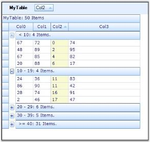

# Advanced Features in Windows Forms GridGrouping Control

## Custom Grouping

By default, data rows having matching values in a grouping column will be combined into a single group. If this does not suit your requirements, you can customize grouping logic so that you can categorize the records as you need. 

Custom Grouping can be achieved by adding a custom Categorizer object to SortColumnDescriptor that defines the group. You can also add a custom Comparer object to the SortColumnDescriptor. When a column is grouped, it is first sorted. The Comparer object allows you to control how sorting is done on your column. Once the column is sorted, custom Categorizer is used to determine which adjacent records in the sorted column belong to the same group. To create custom Comparer and Categorizer objects, you have to define classes that implement either IComparer (one method) or ICategorizer (two methods).

### Example

Say you have a column with values for 0 to 50, and you want to have them grouped so that values less than 10 are in one group, values 10-20 are in another, values 20-30 in another, and so on. The following code example illustrates how to achieve this by using Custom Categorizer.

1. Create a datasource and bind it to a grid grouping control.


  
//Creates the data source.

private DataTable GetADataTable()
{
    DataTable dataTable = new DataTable("MyTable");
    int nCols = 4;
    int nRows = 50;

    for(int i = 0; i < nCols; i++)
    dataTable.Columns.Add(new DataColumn(string.Format("Col{0}", i)));
    Random r = new Random();

    for(int i = 0; i < nRows; ++i)
    {
        DataRow dataRow = dataTable.NewRow();

        for(int j = 0; j < nCols; j++)
        dataRow[j] = r.Next(100).ToString();
        dataTable.Rows.Add(dataRow);
    }
    return dataTable;
}

//Sets up a grouping grid.
this.gridGroupingControl1.DataSource = GetADataTable();
this.gridGroupingControl1.ShowGroupDropArea = true;


 

'Creates the data source.

Private Function GetADataTable() As DataTable
    Dim dataTable As New DataTable("MyTable")
    Dim nCols As Integer = 4
    Dim nRows As Integer = 50
    Dim i As Integer

    For i = 0 To nCols - 1
        dataTable.Columns.Add(New DataColumn(String.Format("Col{0}", i)))
    Next i
    Dim r As New Random()
    i = 0

    While i < nRows
        Dim dataRow As DataRow = dataTable.NewRow()
        Dim j As Integer

        For j = 0 To nCols - 1
            dataRow(j) = r.Next(100).ToString()
        Next j
        dataTable.Rows.Add(dataRow)
        i += 1
    End While
    Return dataTable
End Function

'Sets up a grouping grid.

Me.gridGroupingControl1.DataSource = GetADataTable()

Me.gridGroupingControl1.ShowGroupDropArea = True



{{ codesnippet1 | OrderList_Indent_Level_1 }}

Define custom Categorizer by implementing IGroupByColumnCategorizer interface. It writes a method named GetCategory where it defines a group and returns category object, which in turn is used by the interface members GetGroupByCategoryKey and CompareCategoryKey methods. GetGroupByCategoryKey is used to return the key for the specified column and record, and the CompareCategoryKey determines if the current record belongs to the same category as previous record.


 

//Defines custom categorizer.

public class CustomCategorizer : Syncfusion.Grouping.IGroupByColumnCategorizer
{

//Defines a group and returns a group category object (here returns 1 through 5).

    public static int GetCategory(int i)
    {
    int value = 0;

    if(i < 10)
    value = 1;

    else if(i >= 10 && i < 20)
    value = 2;

    else if(i >= 20 && i < 30)
    value = 3;

    else if(i >= 30 && i < 40)
    value = 4;

    else  
    value = 5;

    return value;
    }

    public object GetGroupByCategoryKey(SortColumnDescriptor column, bool isForeignKey, Record record)
    {
        return GetCategory(int.Parse( record.GetValue(column).ToString()));
    }

    public int CompareCategoryKey(SortColumnDescriptor column, bool isForeignKey, object category, Record record)
    {
        return GetCategory( int.Parse(record.GetValue(column).ToString())) - (int)category;
    }
}
 
  

'Defines custom categorizer.

Public Class CustomCategorizer
    Implements Syncfusion.Grouping.IGroupByColumnCategorizer

'Defines a group and returns a group category object (here returns 1 through 5).

    Public Shared Function GetCategory(ByVal i As Integer) As Integer
        Dim value As Integer = 0

        If i < 10 Then
            value = 1

        ElseIf i >= 10 AndAlso i < 20 Then
            value = 2

        ElseIf i >= 20 AndAlso i < 30 Then
            value = 3

        ElseIf i >= 30 AndAlso i < 40 Then
            value = 4

        Else
            value = 5

        End If
        Return value
        End Function

    Public Function GetGroupByCategoryKey(ByVal column As SortColumnDescriptor, ByVal isForeignKey As Boolean,
    ByVal record As Record) As Object Implements IGroupByColumnCategorizer.GetGroupByCategoryKey
        Return GetCategory(Integer.Parse(record.GetValue(column).ToString()))
    End Function

    Public Function CompareCategoryKey(ByVal column As SortColumnDescriptor, ByVal isForeignKey As Boolean, ByVal category As Object,         ByVal record As Record) As Integer Implements IGroupByColumnCategorizer.CompareCategoryKey
        Return GetCategory(Integer.Parse(record.GetValue(column).ToString())) - Fix(category)
    End Function
End Class




2. Define a custom Comparer to ensure that the integer values are sorted as integers instead of strings.


 

public class CustomComparer : IComparer
{

    public int Compare(object x, object y)
    {

        if(x == null)
        return -1;

        else if(y == null)
        return 100;

        else 
        {
            int i = int.Parse(x.ToString());
            int j = int.Parse(y.ToString());
            return i - j;
        }
    }
}
 
  

Public Class CustomComparer Implements IComparer

    Public Function [Compare](ByVal x As Object, ByVal y As Object) As Integer Implements IComparer.Compare

        If x Is Nothing Then
            Return -1

        ElseIf y Is Nothing Then
            Return 100

        Else
            Dim i As Integer = Integer.Parse(x.ToString())
            Dim j As Integer = Integer.Parse(y.ToString())
            Return i - j
        End If
    End Function
End Class



{{ codesnippet2 | OrderList_Indent_Level_1 }}

3. Group the column Col2 using a custom categorizer and comparer.



  

//Groups "Col2" by using Custom Categorizer and Comparer.
SortColumnDescriptor columnDescriptor = new SortColumnDescriptor("Col2");
columnDescriptor.Categorizer = new CustomCategorizer();
columnDescriptor.Comparer = new CustomComparer();
this.gridGroupingControl1.TableDescriptor.GroupedColumns.Add(columnDescriptor);

 

'Groups "Col2" by using Custom Categorizer and Comparer.
Dim columnDescriptor As New Syncfusion.Grouping.SortColumnDescriptor("Col2")
columnDescriptor.Categorizer = New CustomCategorizer()
columnDescriptor.Comparer = New CustomComparer()
Me.gridGroupingControl1.TableDescriptor.GroupedColumns.Add(columnDescriptor)



{{ codesnippet3 | OrderList_Indent_Level_1 }}

4. Handle QueryCellStyleInfo event to display custom group caption.


 

//Subscribes to QueryCellStyleInfo event to display custom group caption.
this.gridGroupingControl1.QueryCellStyleInfo += new GridTableCellStyleInfoEventHandler(gridGroupingControl1_QueryCellStyleInfo);

private void gridGroupingControl1_QueryCellStyleInfo(object sender, GridTableCellStyleInfoEventArgs e)
{

    if (e.TableCellIdentity.GroupedColumn != null && e.TableCellIdentity.DisplayElement.ParentGroup != null
    && e.TableCellIdentity.DisplayElement.ParentGroup.Category is int)
    {

        if (e.TableCellIdentity.DisplayElement is CaptionRow
        && e.TableCellIdentity.GroupedColumn.Name == "Col2")
        {
            int cat = (int) e.TableCellIdentity.DisplayElement.ParentGroup.Category;
            string value = "";
            switch (cat)
            {
                case 1:     
                value = " < 10";
                break;

                case 2:     
                value = "10 - 19";
                break;

                case 3:     
                value = "20 - 29";
                break;

                case 4:     
                value = "30 - 39";
                break;

                case 5:     
                value = " >= 40";
                break;
            }
            e.Style.CellValue = String.Format("{0}: {1} Items.", value, e.TableCellIdentity.DisplayElement.ParentGroup.GetChildCount());
        }
    }
}

  

'Subscribes to QueryCellStyleInfo event to display custom group caption.
AddHandler Me.gridGroupingControl1.QueryCellStyleInfo, AddressOf gridGroupingControl1_QueryCellStyleInfo

Private Sub gridGroupingControl1_QueryCellStyleInfo(ByVal sender As Object, ByVal e As GridTableCellStyleInfoEventArgs)

If Not (e.TableCellIdentity.GroupedColumn Is Nothing) AndAlso Not (e.TableCellIdentity.DisplayElement.ParentGroup Is Nothing) AndAlso TypeOf e.TableCellIdentity.DisplayElement.ParentGroup.Category Is Integer Then

If TypeOf e.TableCellIdentity.DisplayElement Is CaptionRow AndAlso e.TableCellIdentity.GroupedColumn.Name = "Col2" Then
Dim cat As Integer = Fix(e.TableCellIdentity.DisplayElement.ParentGroup.Category)
Dim value As String = ""
Select Case cat

Case 1
value = " < 10"

Case 2
value = "10 - 19"

Case 3
value = "20 - 29"

Case 4
value = "30 - 39"

Case 5
value = " >= 40"
End Select
e.Style.CellValue = String.Format("{0}: {1} Items.", value, e.TableCellIdentity.DisplayElement.ParentGroup.GetChildCount())
End If
End If
End Sub



{{ codesnippet4 | OrderList_Indent_Level_1 }}

Given below is a sample screen shot.

 

## Custom Sorting

Custom Sorting allows you to implement custom sorting logic when the standard sorting techniques do not meet your needs. To support custom sorting in Grid Grouping control, the user needs to add an IComparer object and handle one event. The Comparer object allows you to control how the sorting is done on the column. This is the place where you can define your own sorting logic. After customizing the sorting logic through IComparer, you can make grouping grid use this special IComparer by handling an event.

### Example

Consider a scenario where one of the data columns of your datasource consists of Date-Numeric combination values. In this case, default sorting will not produce results we desire. The sorting has to be done first on date values and then on numeric values. Hence, we need to write custom sorting logic by defining special IComparer object. The grouping grid could then be made to use this custom comparer by handling an event that gets fired while sorting columns.

The example illustrates this process in a step-by-step manner.

1. Setup a datasource and bind it to a grid grouping control.


  

//Creates a Data Source.
DataTable dataTable = new DataTable("MyTable");
int nCols = 4;
int nRows = 30;

for (int i = 0; i < nCols; i++)
    dataTable.Columns.Add(new DataColumn(string.Format("Col{0}", i)));
Random r = new Random();

for (int i = 0; i < nRows; ++i)
{
    DataRow dataRow = dataTable.NewRow();

    for (int j = 0; j < nCols; j++)
        dataRow[j] = string.Format("row{0} col{1}", i, j);
    DateTime d = DateTime.Now.AddDays(r.Next(i < 20 ? 700 : 1));
    dataRow[nCols - 1] = string.Format("{0:MMM}{1:00} - {2:0.00}", d, d.Year, r.Next(1000000) / 100d);
    dataTable.Rows.Add(dataRow);
}

//Binds the data source to the grouping grid.
this.gridGroupingControl1.DataSource = new DataView(dataTable);

  

'Creates a Data Source.
Dim dataTable As DataTable = New DataTable("MyTable")
Dim nCols As Integer = 4
Dim nRows As Integer = 30
Dim i As Integer = 0

Do While i < nCols
dataTable.Columns.Add(New DataColumn(String.Format("Col{0}", i)))
i += 1
Loop
Dim r As Random = New Random()
i = 0

Do While i < nRows
Dim dataRow As DataRow = dataTable.NewRow()
Dim j As Integer = 0

Do While j < nCols
dataRow(j) = String.Format("row{0} col{1}", i, j)
j += 1
Loop
Dim d As DateTime = DateTime.Now.AddDays(r.Next(IIf(i < 20, 700, 1)))
dataRow(nCols - 1) = String.Format("{0:MMM}{1:00} - {2:0.00}", d, d.Year, r.Next(1000000) / 100.0R)
dataTable.Rows.Add(dataRow)
i += 1
Loop

'Binds the data source to the grouping grid.
Me.gridGroupingControl1.DataSource = New DataView(dataTable)



{{ codesnippet5 | OrderList_Indent_Level_1 }}

2. Define a Custom Comparer by implementing IComparer interface.


  

//Sorts first on date and then on value.

public class DateComparer : IComparer
{

//IComparer Members.

    public int Compare(object x, object y)
    {

        if (x == null && y == null)
        return 0;

        else if (x == null)
        return -1;

        else if (y == null)
        return 1;

        else
        {
            DateTime date1 = Convert.ToDateTime(x.ToString());
            DateTime date2 = Convert.ToDateTime(y.ToString());
            int c = date1.CompareTo(date2);
            return c;
        }
    }
}

  

'Sorts first on date and then on value.

Public Class DateComparer : Implements IComparer

'IComparer Members.

Public Function Compare(ByVal x As Object, ByVal y As Object) As Integer Implements IComparer.Compare

If x Is Nothing AndAlso y Is Nothing Then
Return 0

Else If x Is Nothing Then
Return -1

Else If y Is Nothing Then
Return 1

Else
Dim c As Integer = GetDate(x.ToString()).CompareTo(GetDate(y.ToString()))

If c = 0 Then
c = GetDouble(x.ToString()).CompareTo(GetDouble(y.ToString()))
End If
Return c
End If
End Function

Private Function GetDate(ByVal s As String) As DateTime
Dim dataTable As DateTime = DateTime.MinValue
Dim pos As Integer = s.IndexOf("-"c)

If pos > -1 Then
DateTime.TryParse(s.Substring(0, pos), dataTable)
End If
Return dataTable
End Function

Private Function GetDouble(ByVal s As String) As Double
Dim d As Double = Double.NaN
Dim pos As Integer = s.IndexOf("-"c)

If pos > -1 Then
Double.TryParse(s.Substring(pos + 1), d)
End If
Return d
End Function
End Class



{{ codesnippet6 | OrderList_Indent_Level_1 }}

3. Handle SortColumnsChanging event to make the grid use custom comparer.


  

private string specialDateColName = "Col3";

private DateComparer specialDateComparer = new DateComparer();

//Sets up support for custom sort on Grid Grouping control.
this.gridGroupingControl1.TableDescriptor.SortedColumns.Changing += new ListPropertyChangedEventHandler(SortedColumns_Changing);

//Makes the Grid Grouping control use special IComparer.
void SortedColumns_Changing(object sender, ListPropertyChangedEventArgs e)
{
    SortColumnDescriptor sortColumnDescriptor = e.Item as SortColumnDescriptor;

    if (e.Action == ListPropertyChangedType.Add && sortColumnDescriptor != null && sortColumnDescriptor.Name == specialDateColName)
    {
        ((SortColumnDescriptor)e.Item).Comparer = specialDateComparer;
    }
}

 

Private specialDateColName As String = "Col3"

Private specialDateComparer As DateComparer = New DateComparer()

'Sets up support for custom sort on Grid Grouping control.
AddHandler gridGroupingControl1.TableDescriptor.SortedColumns.Changing, AddressOf SortedColumns_Changing

'Makes the Grid Grouping control use special IComparer.

Private Sub SortedColumns_Changing(ByVal sender As Object, ByVal e As ListPropertyChangedEventArgs)
Dim sortColumnDescriptor As SortColumnDescriptor = CType(IIf(TypeOf e.Item Is SortColumnDescriptor, e.Item, Nothing), SortColumnDescriptor)

If e.Action = ListPropertyChangedType.Add AndAlso Not sortColumnDescriptor Is Nothing AndAlso sortColumnDescriptor.Name = specialDateColName Then
CType(e.Item, SortColumnDescriptor).Comparer = specialDateComparer
End If
End Sub



{{ codesnippet7 | OrderList_Indent_Level_1 }}

4. When you run the sample, click on Col3 to sort it. You will see the effect of the custom sorting logic. The screen shot given below shows the sorted grid with and without Custom Comparer.

 

  

## Custom Summary

This section deals with implementation of Custom Summaries. You can go for custom summaries when the standard summaries do not meet your needs.

Custom Summaries can be created by deriving SummaryBase class and by specifying SummaryType as Custom. In the derived class, you can customize CreateSummaryMethod in the way you want. It is the right place to define the way summaries need to be calculated. You can call this method each time the summary is queried, by assigning Custom CreateSummaryDelegate to CreateSummaryMethod property of SummaryDescriptor inside the QueryCustomSummary event handler. Optionally, you can also specify CreateSummaryFromElementMethod if summaries need to be calculated for elements other than records.

### Example

Here is an example that calculates summaries for both Minimum and Maximum values of the Date field. This can be achieved by using a custom summary field. For Custom summary, the summary Base class is derived and combine method is used to get the new summary value by comparing it with other summary values.

The following code example illustrates how the Combine method compares and gets maximum date value.


  

public override SummaryBase Combine(SummaryBase other)
{
     return Combine((DateMaxSummary) other);
}

public DateMaxSummary Combine(DateMaxSummary other)
{

     if(Max > other.Max)
         return new DateMaxSummary(this.Max);

    else
         return new DateMaxSummary(other.Max);
}

  

Public Overloads Overrides Function Combine(ByVal other As SummaryBase) As SummaryBase
Return Combine(CType(other,DateMaxSummary))
End Function

Public Overloads Function Combine(ByVal other As DateMaxSummary) As DateMaxSummary

If (Max > other.Max) Then
Return New DateMaxSummary(Me.Max)

Else
Return New DateMaxSummary(other.Max)
End If
End Function



The following are the classes and events used to create date summary field.

1. Creating GridSummaryColumnDescriptor instance.


  
GridSummaryColumnDescriptor sd1 = new GridSummaryColumnDescriptor();
sd1.Name = "MaxDate";
sd1.DataMember = "Date";
sd1.DisplayColumn = "Date";
sd1.Format = "{Max}";
sd1.SummaryType = SummaryType.Custom;
this.gridGroupingControl1.TableDescriptor.SummaryRows.Add(new GridSummaryRowDescriptor("Row 1", "Max", sd1));

  
Dim sd1 As GridSummaryColumnDescriptor = New GridSummaryColumnDescriptor
sd1.Name = "MaxDate"
sd1.DataMember = "Date"
sd1.DisplayColumn = "Date"
sd1.Format = "{Max}"
sd1.SummaryType = SummaryType.Custom
Me.gridGroupingControl1.TableDescriptor.SummaryRows.Add(New GridSummaryRowDescriptor("Row 1", "Max", sd1))



{{ codesnippet8 | OrderList_Indent_Level_1 }}

2. Using QueryCustomSummary event to instantiate custom summary for maximum and minimum date.


  

private void gridGroupingControl1_QueryCustomSummary(object sender, GridQueryCustomSummaryEventArgs e)
{

    switch (e.SummaryColumn.Name)
    {

        case "MaxDate":
        {
            e.SummaryDescriptor.CreateSummaryMethod = new CreateSummaryDelegate(DateMaxSummary.CreateSummaryMethod);
            break;
        }

        case "MinDate":
        {
            e.SummaryDescriptor.CreateSummaryMethod = new CreateSummaryDelegate(DateMinSummary.CreateSummaryMethod);
            break;
        }
    }
}

  

Private Sub gridGroupingControl1_QueryCustomSummary(ByVal sender As Object, ByVal e As GridQueryCustomSummaryEventArgs)

Select Case (e.SummaryColumn.Name)

Case "MaxDate"
e.SummaryDescriptor.CreateSummaryMethod = New CreateSummaryDelegate(AddressOf DateMaxSummary.CreateSummaryMethod)
Exit Select

Case "MinDate"
e.SummaryDescriptor.CreateSummaryMethod = New CreateSummaryDelegate(AddressOf DateMinSummary.CreateSummaryMethod)
Exit Select
End Select
End Sub



{{ codesnippet9 | OrderList_Indent_Level_1 }}

3. The CurrentRecordContextChange event is used to refresh the grid so that new values will be updated in the summary row.


  

private void gridGroupingControl1_CurrentRecordContextChange(object sender, CurrentRecordContextChangeEventArgs e)
{

    if (e.Action == CurrentRecordAction.EndEditComplete)
    {
        e.Record.InvalidateCounterBottomUp();
        this.gridGroupingControl1.Refresh();
    }
}

 

Private Sub gridGroupingControl1_CurrentRecordContextChange(ByVal sender As Object, ByVal e As CurrentRecordContextChangeEventArgs)

If (e.Action = CurrentRecordAction.EndEditComplete) Then
e.Record.InvalidateCounterBottomUp()
Me.gridGroupingControl1.Refresh()
End If
End Sub



{{ codesnippet10 | OrderList_Indent_Level_1 }}

## Custom Summary row with Custom Function

This section discusses about implementation of Custom Function in Custom Summaries. You can use custom summaries when the standard summaries do not meet your needs.

Earlier, custom summary rows calculated only standard arithmetic operation in Expression. But now, it is customized to calculate mathematical formulas and custom functions along with arithmetic functions.

### Adding custom function in ExpressionFieldEvaluator

The following code shows how to add custom function in ExpressionFieldEvaluator.


  
ExpressionFieldEvaluator evaluator = this.gridGroupingControl1.TableDescriptor.ExpressionFieldEvaluator;
            evaluator.AddFunction("CustomAdd", new ExpressionFieldEvaluator.LibraryFunction(ComputeCustomAdd));

  
Dim evaluator As ExpressionFieldEvaluator = Me.gridGroupingControl1.TableDescriptor.ExpressionFieldEvaluator
evaluator.AddFunction("CustomAdd", New ExpressionFieldEvaluator.LibraryFunction(ComputeCustomAdd))



### Change Expression to compute custom functions along with arithmetic functions

The following code shows how to change Expression to compute functions along with arithmetic functions.


 
ExpressionFieldDescriptor field2 = new ExpressionFieldDescriptor();
field2.Name = "CustomExpression";
            field2.Expression = "10 + CustomAdd([ColZero],[ColOne])";

 
 Dim field2 As New ExpressionFieldDescriptor()
 field2.Name = "CustomExpression"
field2.Expression = "10 + CustomAdd([ColZero],[ColOne])"



## Custom Filter Dialog

When you have a grouping grid with filter bar enabled, the drop down in a filter bar cell shows 'Custom' option too along with other filtering options. This option allows you to customize filtering mechanism. By default, custom option pops up the RecordFieldDescriptor collection editor for the table. This default behavior must be overridden when a custom defined filter dialog has to be displayed as a result of clicking custom option. It can be achieved by replacing default FilterBarCell with custom defined filter bar cell.

This section best demonstrates merging of user defined filter dialog with grid filter bar and also explores the code to implement it.

Implementation

To adopt our own filter dialog with respect to the 'Custom' filtering option, we must define Custom Filter CellType, which should then replace the filter bar cell that is shown by default. 

In general, a CellType requires a model class and a renderer class. The model class handles serialization requirements for the control and creates the renderer class. The renderer class handles UI requirements of the cell, such as drawing it, handling mouse actions, and so on.

For our FilterBarCell, we have to create the model and renderer classes by inheriting GridTableFilterBarCellModel and GridTableFilterBarCellRenderer classes. In the renderer, you should override ListBoxClick or ListBoxMouseUp event handlers (the event that gets fired upon clicking a filter option) in order to show up our own filter dialog. Once the dialog is closed, retrieve the filter string that has been setup using the dialog and add this filter string into the RecordFilters collection of the TableDescriptor. This would set up a filter using custom option.

Following steps illustrate how to add a custom filter dialog.

1. Set up a grouping grid and bind a data source into it. Enable the grid filter bar to show filter options for all the columns.


  

//Sets up a data source.
DataTable dataTable = new DataTable("MyTable");
int nCols = 6;
int nRows = 20;
Random r = new Random(100);

for (int i = 0; i < nCols; i++)
    dataTable.Columns.Add(new DataColumn(string.Format("Col{0}", i), typeof(int)));

for (int i = 0; i < nRows; ++i)
{
    DataRow dataRow = dataTable.NewRow();

    for (int j = 0; j < nCols; j++)
        dataRow[j] = r.Next(10);
    dataTable.Rows.Add(dataRow);
}

//Binds it to the grouping grid.
this.gridGroupingControl1.DataSource = dataTable;

//Enables the filter bar.
this.gridGroupingControl1.TopLevelGroupOptions.ShowFilterBar = true;

for (int i = 0; i < gridGroupingControl1.TableDescriptor.Columns.Count; i++)
gridGroupingControl1.TableDescriptor.Columns[i].AllowFilter = true;

  

'Sets up a data source.
Dim dataTable As DataTable = New DataTable("MyTable")
Dim nCols As Integer = 6
Dim nRows As Integer = 20
Dim r As Random = New Random(100)
Dim i As Integer = 0

Do While i < nCols
dataTable.Columns.Add(New DataColumn(String.Format("Col{0}", i), GetType(Integer)))
i += 1
Loop
i = 0

Do While i < nRows
Dim dataRow As DataRow = dataTable.NewRow()
Dim j As Integer = 0

Do While j < nCols
dataRow(j) = r.Next(10)
j += 1
Loop
dataTable.Rows.Add(dataRow)
i += 1
Loop

'Binds it to the grouping grid.
Me.gridGroupingControl1.DataSource = dataTable

'Enables the filter bar.
Me.gridGroupingControl1.TopLevelGroupOptions.ShowFilterBar = True
i = 0

Do While i < gridGroupingControl1.TableDescriptor.Columns.Count
gridGroupingControl1.TableDescriptor.Columns(i).AllowFilter = True
i += 1
Loop



{{ codesnippet11 | OrderList_Indent_Level_1 }}

2. Add another form, say FilterDialog to the project. This form will accept two filter conditions combined by a logical operator. Add a label to display the name of the filter column, two combo boxes to display the compare operator choices and two text boxes to accept the compare values, two radio buttons to determine logical combination of the filter conditions, and two buttons 'Ok' to pass the filter string to the parent grid and 'Cancel' to cancel the filter action. Here is a sample image of the form's designer.

 

 _Figure481__: Creating FilterDialog Dialog Box_ 

3. Add a method SetupOptions to fill the combo boxes with the operator choices. Inside the Ok_Button_Click event handler, form the filter string by writing the extracted values from the form in a valid syntax. Then close the form. The CancelButton would simply close the form.


 
internal FilterString = "";

//Fills up the combo boxes with the operator options.

public void SetupOptions(string[] filterOptions)
{
    this.comboBox1.Items.AddRange(filterOptions);
    this.comboBox2.Items.AddRange(filterOptions);
}

//Code that is implemented on clicking the OK button.

private void button1_Click(object sender, EventArgs e)
{

    if (this.comboBox1.Text.Length > 0 && this.textBox1.Text.Length > 0)
    {
        FilterString = '[' + colLabel.Text + ']' + GetFilter(this.comboBox1.SelectedIndex, this.textBox1.Text);

    }

    if (this.comboBox2.Text.Length > 0 && this.textBox2.Text.Length > 0)
    {
        FilterString += (this.radioButton1.Checked) ? " AND " : " OR ";
        FilterString += '[' + colLabel.Text + ']' + GetFilter(this.comboBox2.SelectedIndex, this.textBox2.Text);
    }
    this.DialogResult = DialogResult.OK;
    this.Close();
}

private string GetFilter(int index, string text)
{
    string s = "";

    switch (index)
    {

        case 0:
        s = " = '" + text + "'";
        break;

        case 1:
        s = " &lt;&gt; '" + text + "'";
        break;

        case 2:
        s = " > '" + text + "'";
        break;

        case 3:
        s = " >= '" + text + "'";
        break;

        case 4: 
        s = " < '" + text + "'";
        break;

        case 5: 
        s = " <= '" + text + "'";
        break; 
    }
    return s;
}   

//Code that is implemented on clicking the Cancel button.

private void button2_Click(object sender, EventArgs e)
{
    this.Close();
}
 
 
Friend FilterString As String = ""

'Fills up the combo boxes with the operator options.

Public Sub SetupOptions(ByVal filterOptions As String())
Me.comboBox1.Items.AddRange(filterOptions)
Me.comboBox2.Items.AddRange(filterOptions)
End Sub

'Code that is implemented on clicking the OK button.

Private Sub button1_Click(ByVal sender As Object, ByVal e As EventArgs)

If Me.comboBox1.Text.Length > 0 AndAlso Me.textBox1.Text.Length > 0 Then
FilterString = "["c + colLabel.Text & "]"c + GetFilter(Me.comboBox1.SelectedIndex, Me.textBox1.Text)
End If

If Me.comboBox2.Text.Length > 0 AndAlso Me.textBox2.Text.Length > 0 Then

If (Me.radioButton1.Checked) Then
FilterString &= " AND "

Else
FilterString &= " OR "
End If
FilterString &= "["c + colLabel.Text & "]"c + GetFilter(Me.comboBox2.SelectedIndex, Me.textBox2.Text)
End If
Me.DialogResult = DialogResult.OK
Me.Close()
End Sub

Private Function GetFilter(ByVal index As Integer, ByVal text As String) As String
Dim s As String = ""

Select Case index

Case 0 
s = " = '" + text + "'"

Case 1 
s = " &lt;&gt; '" + text + "'"

Case 2 
s = " > '" + text + "'"

Case 3 
s = " >= '" + text + "'"

Case 4 
s = " < '" + text + "'"

Case 5 
s = " <= '" + text + "'"
End Select
Return s
End Function

'Code that is implemented on clicking the Cancel button.

Private Sub button2_Click(ByVal sender As Object, ByVal e As EventArgs)
Me.Close()
End Sub



{{ codesnippet12 | OrderList_Indent_Level_1 }}

4. Once a filter dialog has been designed, our next step is to create the required model and renderer classes in order to adopt the custom filter dialog. Inside the renderer, override the ListBoxMouseUp event to make the custom filter dialog to pop up. When the dialog is closed, add the filter string into the RecordFilters collection to set up the filter.


 

//Cell Model class.
class CustomFilterCellModel : GridTableFilterBarCellModel
{
    internal GridFilterBar filterBar;

    public CustomFilterCellModel(GridModel grid) : base(grid)
    {
        filterBar = new GridFilterBar();
    }

    public override GridCellRendererBase CreateRenderer(GridControlBase control)
    {
        return new CustomFilterCellRenderer(control, this);
    }

    public string[] FilterBarOptions = new string[]
    {
        "equals",						
        "does not equal",				
        "is greater than",				
        "is greater than or equal to",	
        "is less than",					
        "is less than or equal to"		
    }; 
}

//Cell Renderer class.
class CustomFilterCellRenderer : GridTableFilterBarCellRenderer
{
    CustomFilterCellModel filterModel;

    public CustomFilterCellRenderer(GridControlBase grid, GridCellModelBase cellModel)
    : base(grid, cellModel)
    {
        filterModel = cellModel as CustomFilterCellModel;
    }

    protected override void ListBoxMouseUp(object sender, MouseEventArgs e)
    {
        GridTableCellStyleInfo tableStyleInfo = (GridTableCellStyleInfo) StyleInfo;
        GridTableCellStyleInfoIdentity tableCellIdentity = tableStyleInfo.TableCellIdentity;

        if( this.ListBoxPart.SelectedIndex == 1)
        {
            FilterDialog dlg = new FilterDialog();
            dlg.colLabel.Text = tableCellIdentity.Column.MappingName;
            dlg.SetupOptions(filterModel.FilterBarOptions);

            if(dlg.ShowDialog() == DialogResult.OK)
            {

 //Applies the filter.
                tableCellIdentity.Table.TableDescriptor.RecordFilters.Add(dlg.FilterString);
            }
        }

        else
        {

            if( this.ListBoxPart.SelectedIndex == 0)
            tableCellIdentity.Table.TableDescriptor.RecordFilters.Clear();
            base.ListBoxMouseUp(sender, e);
        }
    }
}
 
  

'Cell Model class.
Friend Class CustomFilterCellModel : Inherits GridTableFilterBarCellModel
Friend filterBar As GridFilterBar

Public Sub New(ByVal grid As GridModel)
MyBase.New(grid)
filterBar = New GridFilterBar()
End Sub

Public Overrides Function CreateRenderer(ByVal control As GridControlBase) As GridCellRendererBase
Return New CustomFilterCellRenderer(control, Me)
End Function

Public FilterBarOptions As String() = New String() {"equals", "does not equal", "is greater than",	"is greater than or equal to",
"is less than", "is less than or equal to"}
End Class

'Cell Renderer class.
Friend Class CustomFilterCellRenderer : Inherits GridTableFilterBarCellRenderer

Private filterModel As CustomFilterCellModel

Public Sub New(ByVal grid As GridControlBase, ByVal cellModel As GridCellModelBase)
MyBase.New(grid, cellModel)
filterModel = CType(IIf(TypeOf cellModel Is CustomFilterCellModel, cellModel, Nothing), CustomFilterCellModel)
End Sub

Protected Overrides Sub ListBoxMouseUp(ByVal sender As Object, ByVal e As MouseEventArgs)

Dim tableStyleInfo As GridTableCellStyleInfo = CType(StyleInfo, GridTableCellStyleInfo)
Dim tableCellIdentity As GridTableCellStyleInfoIdentity = tableStyleInfo.TableCellIdentity

If Me.ListBoxPart.SelectedIndex = 1 Then
Dim dlg As FilterDialog = New FilterDialog()

dlg.colLabel.Text = tableCellIdentity.Column.MappingName
dlg.SetupOptions(filterModel.FilterBarOptions)

If dlg.ShowDialog() = DialogResult.OK Then

'Applies the filter.
tableCellIdentity.Table.TableDescriptor.RecordFilters.Add(dlg.FilterString)
End If
Else

If Me.ListBoxPart.SelectedIndex = 0 Then
tableCellIdentity.Table.TableDescriptor.RecordFilters.Clear()

End If
MyBase.ListBoxMouseUp(sender, e)
End If
End Sub
End Class



{{ codesnippet13 | OrderList_Indent_Level_1 }}

5. Our final step is to replace the default filter bar cell with our custom filter bar cell. This can be done by registering our new cell model class into the existing cell model's collection by specifying a name for the new cell type. Then set the cell type of the FilterBarCell to this new cell type.


 
this.gridGroupingControl1.TableModel.CellModels.Add("MyFilterCell", new CustomFilterCellModel(this.gridGroupingControl1.TableModel));
this.gridGroupingControl1.Appearance.FilterBarCell.CellType = "MyFilterCell";
 
  
Me.gridGroupingControl1.TableModel.CellModels.Add("MyFilterCell", New CustomFilterCellModel(Me.gridGroupingControl1.TableModel))
Me.gridGroupingControl1.Appearance.FilterBarCell.CellType = "MyFilterCell"



{{ codesnippet14 | OrderList_Indent_Level_1 }}

6. When you run the sample, click the filter drop down and then select custom option to show up our filter dialog. This is shown in the screenshots below.

  

  

## Filter Optimization

The filter can be optimized for the performance over large data in GridGroupingControl. Set OptimizeFilterPerformance to true to optimize the filter.This boolean property enables the grid to optimize filtering of data by delegating the summary to filter the grid accordingly. 

The OptimizeFilterPerformance property can be assigned directly from the GridGroupingControl and can apply to any type of filter bar specified to the grid.

The following code illustrates how to optimize the filter.


  

        private void Form1_Load(object sender, EventArgs e)
        {
            this.gridGroupingControl1.OptimizeFilterPerformance = true;
        }

 

       Private Sub Form1_Load(ByVal sender As Object, ByVal e As EventArgs)
            Me.gridGroupingControl1.OptimizeFilterPerformance = True
        End Sub
  


 

## Enhancement of GridExcelFilter in Stacked Column Header

You can filter StackedColumnHeader by choosing any one of the columns from the collection (by default, the first column in the collection is taken for filtering).

The following screenshot displays the Filter Dialog.

  

Enabling Grid Excel like filter in Stacked Column header

Set EnableStackedColumnFilterIcon to ‘_True_’ when Grid Control is wired with GridExcelFilter.

The following code example illustrates how to add Grid Excel like Filter to the Stacked Column Header.


  
 GridExcelFilter filter = new GridExcelFilter();
filter.EnableStackedColumnFilterIcon = true;
filter.WireGrid(this.gridGroupingControl1);
gridStackedHeaderRowDescriptor1.Headers.AddRange(new Syncfusion.Windows.Forms.Grid.Grouping.GridStackedHeaderDescriptor[] {
new Syncfusion.Windows.Forms.Grid.Grouping.GridStackedHeaderDescriptor("StackedHeader 1","StackedHeader 1","SupplierID",new Syncfusion.Windows.Forms.Grid.Grouping.GridStackedHeaderVisibleColumnDescriptor[] {
new Syncfusion.Windows.Forms.Grid.Grouping.GridStackedHeaderVisibleColumnDescriptor("SupplierID"),
new Syncfusion.Windows.Forms.Grid.Grouping.GridStackedHeaderVisibleColumnDescriptor("CompanyName"),
new Syncfusion.Windows.Forms.Grid.Grouping.GridStackedHeaderVisibleColumnDescriptor("ContactName")}),
new Syncfusion.Windows.Forms.Grid.Grouping.GridStackedHeaderDescriptor("StackedHeader 2","StackedHeader 2","City",new Syncfusion.Windows.Forms.Grid.Grouping.GridStackedHeaderVisibleColumnDescriptor[] {
new Syncfusion.Windows.Forms.Grid.Grouping.GridStackedHeaderVisibleColumnDescriptor("ContactTitle"),
new Syncfusion.Windows.Forms.Grid.Grouping.GridStackedHeaderVisibleColumnDescriptor("Address"),
new Syncfusion.Windows.Forms.Grid.Grouping.GridStackedHeaderVisibleColumnDescriptor("City")}),
new Syncfusion.Windows.Forms.Grid.Grouping.GridStackedHeaderDescriptor("StackedHeader 3","StackedHeader 3","",new Syncfusion.Windows.Forms.Grid.Grouping.GridStackedHeaderVisibleColumnDescriptor[] {
new Syncfusion.Windows.Forms.Grid.Grouping.GridStackedHeaderVisibleColumnDescriptor("Country"),
new Syncfusion.Windows.Forms.Grid.Grouping.GridStackedHeaderVisibleColumnDescriptor("Fax"),
new Syncfusion.Windows.Forms.Grid.Grouping.GridStackedHeaderVisibleColumnDescriptor("Region")}),
new Syncfusion.Windows.Forms.Grid.Grouping.GridStackedHeaderDescriptor("StackedHeader 4","StackedHeader 4","Phone", new Syncfusion.Windows.Forms.Grid.Grouping.GridStackedHeaderVisibleColumnDescriptor[] {
new Syncfusion.Windows.Forms.Grid.Grouping.GridStackedHeaderVisibleColumnDescriptor("PostalCode"),
new Syncfusion.Windows.Forms.Grid.Grouping.GridStackedHeaderVisibleColumnDescriptor("Phone"),
new Syncfusion.Windows.Forms.Grid.Grouping.GridStackedHeaderVisibleColumnDescriptor("HomePage")})});

  
Dim filter As New GridExcelFilter()
GridExcelFilter.EnableStackedColumnFilterIcon = True
filter.WireGrid(Me.gridGroupingControl1)
gridStackedHeaderRowDescriptor1.Headers.AddRange(New Syncfusion.Windows.Forms.Grid.Grouping.GridStackedHeaderDescriptor() {New Syncfusion.Windows.Forms.Grid.Grouping.GridStackedHeaderDescriptor("StackedHeader 1", "StackedHeader 1", "SupplierID", New Syncfusion.Windows.Forms.Grid.Grouping.GridStackedHeaderVisibleColumnDescriptor() {New Syncfusion.Windows.Forms.Grid.Grouping.GridStackedHeaderVisibleColumnDescriptor("SupplierID"), New Syncfusion.Windows.Forms.Grid.Grouping.GridStackedHeaderVisibleColumnDescriptor("CompanyName"), New Syncfusion.Windows.Forms.Grid.Grouping.GridStackedHeaderVisibleColumnDescriptor("ContactName")}), New Syncfusion.Windows.Forms.Grid.Grouping.GridStackedHeaderDescriptor("StackedHeader 2", "StackedHeader 2", "City", New Syncfusion.Windows.Forms.Grid.Grouping.GridStackedHeaderVisibleColumnDescriptor() {New Syncfusion.Windows.Forms.Grid.Grouping.GridStackedHeaderVisibleColumnDescriptor("ContactTitle"), New Syncfusion.Windows.Forms.Grid.Grouping.GridStackedHeaderVisibleColumnDescriptor("Address"), New Syncfusion.Windows.Forms.Grid.Grouping.GridStackedHeaderVisibleColumnDescriptor("City")}), New Syncfusion.Windows.Forms.Grid.Grouping.GridStackedHeaderDescriptor("StackedHeader 3", "StackedHeader 3", "", New Syncfusion.Windows.Forms.Grid.Grouping.GridStackedHeaderVisibleColumnDescriptor() {New Syncfusion.Windows.Forms.Grid.Grouping.GridStackedHeaderVisibleColumnDescriptor("Country"), New Syncfusion.Windows.Forms.Grid.Grouping.GridStackedHeaderVisibleColumnDescriptor("Fax"), New Syncfusion.Windows.Forms.Grid.Grouping.GridStackedHeaderVisibleColumnDescriptor("Region")}), New Syncfusion.Windows.Forms.Grid.Grouping.GridStackedHeaderDescriptor("StackedHeader 4", "StackedHeader 4", "Phone", New Syncfusion.Windows.Forms.Grid.Grouping.GridStackedHeaderVisibleColumnDescriptor() {New Syncfusion.Windows.Forms.Grid.Grouping.GridStackedHeaderVisibleColumnDescriptor("PostalCode"), New Syncfusion.Windows.Forms.Grid.Grouping.GridStackedHeaderVisibleColumnDescriptor("Phone"), New Syncfusion.Windows.Forms.Grid.Grouping.GridStackedHeaderVisibleColumnDescriptor("HomePage")})})



N> The highlighted column name is the column based on which the corresponding stacked header gets filtered. By default, it takes the first column in stacked column collection.

