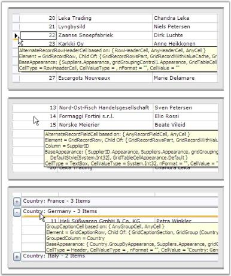
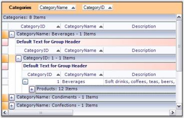
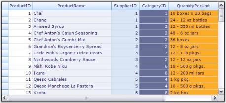
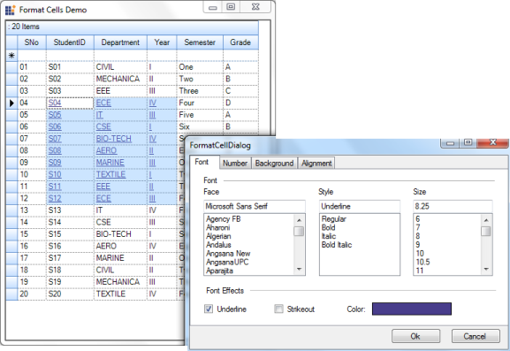
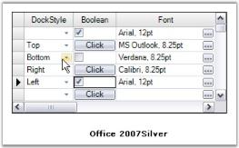
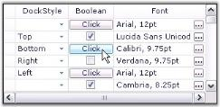

# Appearance

This property allows you to control the appearance of the grouping grid at design time as well as at run time. You can change the overall appearance of the grid and also the appearance of each element in the grid by setting this property. 

Appearance contains a list of GridStyleInfo properties as seen in the following graphic. GridStyleInfo object contains many properties such as BackColor, Font and CellType, which defines the look and behavior of a grid cell. Each of these properties identifies a particular set of cells that make up Grid Grouping control.

 

To understand exactly what is going on here, let us consider three of these GridStyleInfo properties: AnyCell, AnyRecordFieldCell and AnyAlternateRecordFieldCell. Say we set AnyCell.BackColor = Color.LightBlue. This will color any grid cell light blue.

N>: If you are using a Themed Operating system like Windows XP, turn the GridGroupingControl.ThemesEnabled property off so that the theme coloring does not affect things like header cell buttons. Otherwise, this will interfere with illustrating the concepts we are trying to communicate in this section.

Next, if we set AnyRecordFieldCell.BackColor = Color.Azure, we will see the color of any record field cell change to azure. If we then set AnyAlternateRecordFieldCell.BackColor = Color.LightGreen, we will see alternate records being displayed with a green background. Below is a picture illustrating the look of the grid after setting each property in order. 

There is an inheritance hierarchy that is associated with the Appearance properties. The general rule is that, if present, the more specific property takes precedence over the less specific property. This means thatAnyCell.BackColor is overridden by setting AnyRecordFieldCell.BackColor, which is again overridden by setting even more specific AnyAlternatingRecordFieldCell.BackColor. 

  

## Appearance Options

The simplest way to check the exact cells affected by setting one of these properties is to use Preview and Edit verb to display Grid Grouping control and then set the property to view the effect. 

When using Preview tool at design-time, there is a cell tip that is displayed over each cell that gives information about that cell. In particular, the first line of the tip will give the exact Appearance property that this cell is based on. In addition, it will also list the Appearance properties that the cell inherits. Here is a graphic showing some cell tip samples.

  

N>: When using Preview, make sure that you set ThemesEnabled to False, if you want to see the effect of setting the property on a header cell or a button type cell. If you do not, then the theme appearance will supersede the appearance properties you set here.

> _Some of the properties are not applicable unless the item they affect is used in the grid. For example, properties that affect nested tables or summaries will not change the appearance of a Grid Grouping control that does not have either of these items. In latter tutorials, you will be able to test such properties._

List of Appearance Properties

<table>
<tr>
<th>
APPEARANCE PROPERTIES</th><th>
DESCRIPTION</th></tr>
<tr>
<td>
AddNewRecordFieldCell</td><td>
Style information for any cell in a new record row.</td></tr>
<tr>
<td>
AddNewRecordRowHeaderCell</td><td>
Style information for header cell for any new record.</td></tr>
<tr>
<td>
AlternateRecordFieldCell</td><td>
Style information for any cell in alternate record rows.</td></tr>
<tr>
<td>
AlternateRecordRowHeaderCell</td><td>
Style information for any header cell in alternate record rows.</td></tr>
<tr>
<td>
AnyCell</td><td>
Style information for any cell in the Grid.</td></tr>
<tr>
<td>
AnyGroupCell</td><td>
Style information for any cell in a Group item.</td></tr>
<tr>
<td>
AnyHeaderCell</td><td>
Style information for any header cell.</td></tr>
<tr>
<td>
AnyIndentCell</td><td>
Style information for any indent cell.</td></tr>
<tr>
<td>
AnyNestedTableCell</td><td>
Style information for any nested table cell.</td></tr>
<tr>
<td>
AnyPreviewCell</td><td>
Style information for any preview cell.</td></tr>
<tr>
<td>
AnyRecordFieldCell</td><td>
Style information for any record cell.</td></tr>
<tr>
<td>
AnySummaryCell</td><td>
Style information for any summary cell.</td></tr>
<tr>
<td>
ColumnHeaderCell</td><td>
Style information for any column header cell.</td></tr>
<tr>
<td>
ColumnHeaderWithFilterCell</td><td>
Style information for any column header cell with filter.</td></tr>
<tr>
<td>
EmptyCell</td><td>
Style information for any empty cell.</td></tr>
<tr>
<td>
EmptySectionRowHeaderCell</td><td>
Style information for any row header cell in an empty section.</td></tr>
<tr>
<td>
FilterBarCell</td><td>
Style information for any filter bar cell.</td></tr>
<tr>
<td>
FilterBarRowHeaderCell</td><td>
Style information for any filter bar rowheader cell.</td></tr>
<tr>
<td>
GroupCaptionCell</td><td>
Style information for any cell in a group caption.</td></tr>
<tr>
<td>
GroupCaptionPlusMinusCell</td><td>
Style information for any plus-minus cell in a group caption.</td></tr>
<tr>
<td>
GroupCaptionRowHeaderCell</td><td>
Style information for any row header cell in a group caption.</td></tr>
<tr>
<td>
GroupCaptionSummaryCell</td><td>
Style information for any summary cell in a group caption.</td></tr>
<tr>
<td>
GroupFooterIndentCell</td><td>
Style information for any indent cell in a group footer.</td></tr>
<tr>
<td>
GroupFooterRowHeaderCell</td><td>
Style information for any header cell in a group footer.</td></tr>
<tr>
<td>
GroupFooterSectionCell</td><td>
Style information for any section cell in a group footer.</td></tr>
<tr>
<td>
GroupHeaderIndentCell</td><td>
Style information for any indent cell in a group.</td></tr>
<tr>
<td>
GroupHeaderRowHeaderCell</td><td>
Style information for any cell in a group header.</td></tr>
<tr>
<td>
GroupHeaderSectionCell</td><td>
Style information for any section cell in a group header.</td></tr>
<tr>
<td>
GroupIndentCell</td><td>
Style information for any indent cell in a group.</td></tr>
<tr>
<td>
GroupIndentICell</td><td>
Style information for any indent cell with no connected item.</td></tr>
<tr>
<td>
GroupIndentLCell</td><td>
Style information for any indent cell with a bottom connected item.</td></tr>
<tr>
<td>
GroupIndentTCell</td><td>
Style information for any indent cell with a middle connected item.</td></tr>
<tr>
<td>
GroupPreviewCell</td><td>
Style information for any preview cell.</td></tr>
<tr>
<td>
GroupPreviewRowHeaderCell</td><td>
Style information for any header cell in a preview row.</td></tr>
<tr>
<td>
NestedTableCell</td><td>
Style information for any cell in a nested table.</td></tr>
<tr>
<td>
NestedTableIndentCell</td><td>
Style information for any indent cell in a nested table.</td></tr>
<tr>
<td>
NestedTableIndentICell</td><td>
Style information for any nested table indent cell with a bottom connected item.</td></tr>
<tr>
<td>
NestedTableIndentLCell</td><td>
Style information for any nested table indent cell with a middle connected item.</td></tr>
<tr>
<td>
NestedTableIndentTCell</td><td>
Style information for any nested table indent cell with no connected item.</td></tr>
<tr>
<td>
NestedTableRowHeaderCell</td><td>
Style information for any row header cell in a nested table.</td></tr>
<tr>
<td>
RecordFieldCell</td><td>
Style information for any field cell in a record row.</td></tr>
<tr>
<td>
RecordPlusMinusCell</td><td>
Style information for any plus-minus cell in a record row.</td></tr>
<tr>
<td>
RecordPreviewCell</td><td>
Style information for any preview cell in a record row.</td></tr>
<tr>
<td>
RecordPreviewRowHeaderCell</td><td>
Style information for any header cell in a record preview row</td></tr>
<tr>
<td>
RecordRowHeaderCell</td><td>
Style information for any header cell in a record row.</td></tr>
<tr>
<td>
RowHeaderCell</td><td>
Style information for any row header cell.</td></tr>
<tr>
<td>
SummaryEmptyCell</td><td>
Style information for any empty cell in a summary row.</td></tr>
<tr>
<td>
SummaryFieldCell</td><td>
Style information for any field cell in a summary row.</td></tr>
<tr>
<td>
SummaryFillRowCell</td><td>
Style information for any fill cell in a summary row.</td></tr>
<tr>
<td>
SummaryRowHeaderCell</td><td>
Style information for any header cell in a summary row.</td></tr>
<tr>
<td>
SummaryTitleCell</td><td>
Style information for any title cell in a summary row.</td></tr>
<tr>
<td>
TopLeftHeaderCell</td><td>
Style information for any top left header cell.</td></tr>
</table>

### Styles At Table Level

This section demonstrates how to provide different appearances to the tables at different levels. Properties set through grid.TableDescriptor.Appearance property will be applied to the top level table(parent). To control the appearance of individual child tables, you need to first get the TableDescriptor of the desired Child Table. You can then use ChildTableDescriptor.Appearance property to provide the appearances to the respective child table.

Example

This implementation applies unique styles to the tables at different levels (Parent and Child). The grouping grid is bound to an hierarchical dataset with two tables. Below is the code to customize the appearance of these tables.

1.Set styles to the Parent Table.

 

//Column Header Cell styles.

this.gridGroupingControl1.Appearance.ColumnHeaderCell.CellTipText = "ColumnHeader";

this.gridGroupingControl1.Appearance.ColumnHeaderCell.Interior = new BrushInfo(GradientStyle.Vertical, Color.FromArgb(214, 220, 232), Color.FromArgb(106, 111, 151));

this.gridGroupingControl1.Appearance.ColumnHeaderCell.TextColor = System.Drawing.Color.White;

//Record Field Cell style.

this.gridGroupingControl1.Appearance.RecordFieldCell.Interior = new BrushInfo(Color.Lavender);

//Row Header Cell styles.

this.gridGroupingControl1.Appearance.RowHeaderCell.Interior = new Syncfusion.Drawing.BrushInfo(Syncfusion.Drawing.GradientStyle.Horizontal, SystemColors.Window, Color.FromArgb(206, 213, 231));

this.gridGroupingControl1.Appearance.RowHeaderCell.Themed = false;

//Top Left Header Cell style.

this.gridGroupingControl1.Appearance.TopLeftHeaderCell.Interior = new BrushInfo(GradientStyle.PathRectangle, SystemColors.Window, Color.FromArgb(255, 228, 221));

 

  

'Column Header Cell styles.

Me.gridGroupingControl1.Appearance.ColumnHeaderCell.CellTipText = "ColumnHeader"

Me.gridGroupingControl1.Appearance.ColumnHeaderCell.Interior = new BrushInfo(GradientStyle.Vertical, Color.FromArgb(214, 220, 232),Color.FromArgb(106, 111, 151))

Me.gridGroupingControl1.Appearance.ColumnHeaderCell.TextColor = Color.White

'Record Field Cell style.

Me.gridGroupingControl1.Appearance.RecordFieldCell.Interior = new BrushInfo(Color.Lavender)

'Row Header Cell styles.

Me.gridGroupingControl1.Appearance.RowHeaderCell.Interior = new BrushInfo(GradientStyle.Horizontal, SystemColors.Window, Color.FromArgb(206, 213, 231))

Me.gridGroupingControl1.Appearance.RowHeaderCell.Themed = false

'Top Left Header Cell style.

Me.gridGroupingControl1.Appearance.TopLeftHeaderCell.Interior = new BrushInfo(GradientStyle.PathRectangle, SystemColors.Window, Color.FromArgb(255, 228, 221))



2.Apply styles to the Child Table.

  

GridTableDescriptor gtd = this.gridGroupingControl1.GetTableDescriptor("Orders");

//Record Field Cell styles.

gtd.Appearance.AnyRecordFieldCell.BackColor = Color.FromArgb(223, 247, 252);

gtd.Appearance.AlternateRecordFieldCell.BackColor = Color.FromArgb(255, 229, 201);

//Column Header Cell styles.

gtd.Appearance.ColumnHeaderCell.Interior = new BrushInfo(GradientStyle.Vertical, Color.FromArgb(203, 201, 202), Color.FromArgb(253, 247, 215));

gtd.Appearance.ColumnHeaderCell.TextColor = Color.Black;

//Group Caption Cell styles.

gtd.Appearance.GroupCaptionCell.Interior = new BrushInfo(Color.FromArgb(255, 238, 220));

gtd.Appearance.GroupCaptionCell.Borders.Bottom = new GridBorder(GridBorderStyle.Solid, Color.FromArgb(242, 158, 32), GridBorderWeight.Medium);



  

Dim gtd As GridTableDescriptor = Me.gridGroupingControl1.GetTableDescriptor("Orders")

'Record Field Cell styles.

gtd.Appearance.AnyRecordFieldCell.BackColor = Color.FromArgb(223, 247, 252)

gtd.Appearance.AlternateRecordFieldCell.BackColor = Color.FromArgb(255, 229, 201)

'Column Header Cell styles.

gtd.Appearance.ColumnHeaderCell.Interior = New BrushInfo(GradientStyle.Vertical, Color.FromArgb(203, 201, 202), Color.FromArgb(253, 247, 215))

gtd.Appearance.ColumnHeaderCell.TextColor = Color.Black

'Group Caption Cell styles.

gtd.Appearance.GroupCaptionCell.Interior = New BrushInfo(Color.FromArgb(255, 238, 220))

gtd.Appearance.GroupCaptionCell.Borders.Bottom = New GridBorder(GridBorderStyle.Solid, Color.FromArgb(242, 158, 32), GridBorderWeight.Medium)



Here is a sample screenshot.

  

N>: For more details, refer To the following browser sample:

> _&lt;Install Location&gt;\Syncfusion\EssentialStudio\[Version Number]\Windows\Grid.Grouping.Windows\Samples\Styling and Formatting_

### Styles At Group Level

This section lets you customize the appearances of different group elements. You can provide unique appearances to every element of a group such as GroupCaptionCell and Group Header or Footer Cells by setting the following properties under Appearance section: GroupCaptionCell, GroupCaptionPlusMinusCell, GroupHeaderSectionCell, GroupIndentCell, GroupFooterSectionCell, GroupPreviewCell, and the like.

Example

Below is the code to apply different styles to various group members.

  

this.gridGroupingControl1.Appearance.AnyGroupCell.Interior = new BrushInfo(Color.White);

this.gridGroupingControl1.Appearance.AnyGroupCell.Themed = false;

this.gridGroupingControl1.Appearance.GroupCaptionCell.Borders.Bottom = GridBorder(GridBorderStyle.Solid, Color.FromArgb(157, 179, 200));

this.gridGroupingControl1.Appearance.GroupCaptionRowHeaderCell.Interior = new BrushInfo(GradientStyle.BackwardDiagonal, SystemColors.Window, Color.DarkOrange);

this.gridGroupingControl1.Appearance.GroupFooterSectionCell.Interior = new BrushInfo(GradientStyle.Horizontal, Color.White, Color.FromArgb(192, 255, 192));

this.gridGroupingControl1.Appearance.GroupHeaderRowHeaderCell.Interior = new BrushInfo(GradientStyle.Vertical, SystemColors.Window, Color.LightPink);

this.gridGroupingControl1.Appearance.GroupHeaderSectionCell.Interior = new BrushInfo(GradientStyle.Horizontal, Color.White, Color.FromArgb(255, 199, 190);



  

gridGroupingControl1.Appearance.AnyGroupCell.Interior = New BrushInfo(Color.White)

gridGroupingControl1.Appearance.AnyGroupCell.Themed = False

gridGroupingControl1.Appearance.GroupCaptionCell.Borders.Bottom = GridBorder(GridBorderStyle.Solid, Color.FromArgb(157, 179, 200))

gridGroupingControl1.Appearance.GroupCaptionRowHeaderCell.Interior = New BrushInfo(GradientStyle.BackwardDiagonal, SystemColors.Window, Color.DarkOrange)

gridGroupingControl1.Appearance.GroupFooterSectionCell.Interior = New BrushInfo(GradientStyle.Horizontal, Color.White, Color.FromArgb(192, 255, 192))

gridGroupingControl1.Appearance.GroupHeaderRowHeaderCell.Interior = New BrushInfo(GradientStyle.Vertical, SystemColors.Window, Color.LightPink)

gridGroupingControl1.Appearance.GroupHeaderSectionCell.Interior = New BrushInfo(GradientStyle.Horizontal, Color.White, Color.FromArgb(255, 199, 190)



Here is a sample screen shot.

  

N>: For more details, refer to the following browser sample:

> _&lt;Install Location&gt;\Syncfusion\EssentialStudio\[Version Number]\Windows\Grid.Grouping.Windows\Samples\Styling and Formatting\Group Style Demo_

### ColumnStyles

Grid Grouping control allows you to do Column-Based formatting. With this feature, you can provide an unique appearance to different grid columns. Grid columns can be customized by setting GridColumnDescriptor.Appearance property. 

ColumnFormatting can be done at design time. Once the data source is set, select TableDescriptor.Columns property in the property window of the grid grouping control. This will open the GridColumnDescriptor collection editor that is populated with the columns in the datasource. You can modify the appearance of the desired column by setting Appearance property of that column in this editor. The following picture shows this process.

  

Programmatically

You can control the appearance of the columns through code also. Below is the code that applies different styles to the various columns in the grid.

  

GridColumnDescriptor desc1 = new GridColumnDescriptor();

desc1.MappingName = "ProductName";

desc1.Appearance.RecordFieldCell.Interior = new BrushInfo(Color.FromArgb(237, 240, 246));

GridColumnDescriptor desc2 = new GridColumnDescriptor();

desc2.MappingName = "SupplierID";

desc2.Appearance.RecordFieldCell.Interior = new BrushInfo(Color.FromArgb(218, 229, 245));

GridColumnDescriptor desc3 = new GridColumnDescriptor();

desc3.MappingName = "CategoryID";

desc3.Appearance.RecordFieldCell.Interior = new BrushInfo(Color.FromArgb(102, 110, 152));

GridColumnDescriptor desc4 = new GridColumnDescriptor();

desc4.MappingName = "QuantityPerUnit";

desc4.Appearance.RecordFieldCell.Interior = new BrushInfo(Color.FromArgb(252, 172, 38));



  

Dim desc1 As GridColumnDescriptor = New GridColumnDescriptor

desc1.MappingName = "ProductName"

desc1.Appearance.RecordFieldCell.Interior = New BrushInfo(Color.FromArgb(237, 240, 246))

Dim desc1 As GridColumnDescriptor = New GridColumnDescriptor

desc1.MappingName = "ProductName"

desc1.Appearance.RecordFieldCell.Interior = New BrushInfo(Color.FromArgb(218, 229, 245))

Dim desc1 As GridColumnDescriptor = New GridColumnDescriptor

desc1.MappingName = "SupplierID"

desc1.Appearance.RecordFieldCell.Interior = New BrushInfo(Color.FromArgb(102, 110, 152))

Dim desc1 As GridColumnDescriptor = New GridColumnDescriptor

desc1.MappingName = "QuantityPerUnit"

desc1.Appearance.RecordFieldCell.Interior = New BrushInfo(Color.FromArgb(252, 172, 38))



Given below is a sample screen shot.

  

N>: For more details, refer to the following browser sample:

> _&lt;Install Location&gt;\Syncfusion\EssentialStudio\[Version Number]\Windows\Grid.Grouping.Windows\Samples\Styling and Formatting\Column Style Demo_

### Render Images in Header Cells

Header cells are enhanced to render images along with their header text to represent data more clearly. The user can align images as desired. 

Use Case Scenarios

In a payroll application, images in the header cells help the user understand the nature of data type in which the column is supposed to be bound.

  

<table>
<tr>
<th>
PROPERTY </th><th>
DESCRIPTION </th><th>
TYPE </th><th>
DATA TYPE </th></tr>
<tr>
<td>
HeaderImage </td><td>
Gets or sets images to display in the header cells.</td><td>
Image </td><td>
Image</td></tr>
<tr>
<td>
HeaderAlignment</td><td>
Gets or sets the alignment of the image in the header.</td><td>
Enumeration</td><td>
Enumeration</td></tr>
</table>

Sample Link

Find a sample in the following location:

_&lt;Install Location&gt;\Syncfusion\EssentialStudio\[Version Number]\Windows\Grid.Grouping.Windows\Samples\Grouping\Grouping Demo_

Adding Images at Header Cells to an Application 

To display images in the header cells, pass the image through GridColumnDescriptor. The following code helps you to set the image for a specific column header.

  

this.gridGroupingControl1.TableDescriptor.Columns[Name/Index].HeaderImage = Image.FromFile(@"\..\..image.PNG"));



  

Me.gridGroupingControl1.TableDescriptor.Columns (Name/Index).HeaderImage = Image.FromFile(@"\..\..image.PNG"))



To switch alignment of the image between right and left of the header cell, enumeration property HeaderImageAlignment is used. The code helps you to set the alignment.

  

this.gridGroupingControl1.TableDescriptor.Columns[Name/Index].HeaderImageAlignment = Syncfusion.Windows.Forms.Grid.Grouping.HeaderImageAlignment.Right;



  

Me.gridGroupingControl1.TableDescriptor.Columns(Name/Index).HeaderImageAlignment = Syncfusion.Windows.Forms.Grid.Grouping.HeaderImageAlignment.Right



  

## Format Cells Dialog Support

GridGrouping control provides support to apply styles using Format Cell dialog as found in Microsoft Excel.

Use Case Scenarios

This feature enables you to dynamically format such cell attributes as cell background color, font, text color, alignment, and more.

Methods

<table>
<tr>
<th>
METHOD </th><th>
DESCRIPTION </th><th>
PARAMETERS </th><th>
TYPE </th><th>
RETURN TYPE </th><th>
REFERENCE LINKS </th></tr>
<tr>
<th>
Grouping GridFormatCellDialog ()</th><th>
Uses to wire the Grid with FormatCell Dialog</th><th>
GridGroupingControl </th><th>
Method (Constructor)</th><th>
N/A.</th><th>
N/A. </th></tr>
</table>

Sample Link

A demo of this feature is available in the following location:

_&lt;Install Location&gt;\Syncfusion\EssentialStudio\[Version Number]\Windows\_

Adding GridFormatCellDialog To GridGroupingControl 

You can add cell formatting dialog using _GridFormatCellDialog_ class. To add _GridFormatCellDialog_, pass _GridGroupingControl_ as a parameter__of the _GroupingGridFormatCellDialog()_ method.

The following code illustrates this:

  

GroupingGridFormatCellDialog Dialog = new GroupingGridFormatCellDialog(this.gridGroupingControl1);

Dialog.ShowDialog();



  

Dim Dialog As GroupingGridFormatCellDialog = New GroupingGridFormatCellDialog(Me.gridGroupingControl1)

Dialog.ShowDialog()
 

 

## Conditional Formatting

Grid Grouping control has in-built support for Conditional Formatting. This feature allows you to format grid cells based on a certain condition. This can be achieved by defining GridConditionalFormatDescriptor for the grid. Using this descriptor, you can specify the filter criteria for the cells and the style to be applied for filtered cells. Once these specifications are defined, then the given styles are applied to only those cells that satisfy the condition specified.

Conditional Formatting can be specified through the designer itself by accessing the TableDescriptor.ConditionalFormats property. This will open GridConditionalFormatDescriptor editor wherein you can add as many formatters as you want. For each such formatter, you need to specify the filter criteria either by adding RecordFilters or by an Expression. The below property editor illustrates this process.

  

Programmatically

Following code example illustrates how to apply conditional formatting to the grouping grid.

1.Define Conditional Format Descriptor and specify filter criteria and style to be applied.

  

//Applies the following style to the records whose CustomerID starts with 'A'.

GridConditionalFormatDescriptor format1 = new GridConditionalFormatDescriptor();

format1.Appearance.AnyRecordFieldCell.Interior = new BrushInfo(Color.FromArgb(255, 191, 52));

format1.Appearance.AnyRecordFieldCell.TextColor = Color.White;

format1.Expression = "[CustomerID]  LIKE \'A*\'";

format1.Name = "ConditionalFormat 1";

//Applies the following style to the records whose ContactTitle = 'Sales Representative'.

GridConditionalFormatDescriptor format2 = new GridConditionalFormatDescriptor();

format2.Appearance.AnyRecordFieldCell.Font.Bold = true;

format2.Appearance.AnyRecordFieldCell.Interior = new BrushInfo(Color.FromArgb(102, 110, 152));

format2.Appearance.AnyRecordFieldCell.TextColor = Color.White;

format2.Expression = "[ContactTitle] LIKE \'Sales Representative\'";

format2.Name = "ConditionalFormat 2";



  

' Applies the following style to the records whose CustomerID starts with 'A'

Dim format1 As GridConditionalFormatDescriptor = New GridConditionalFormatDescriptor()

format1.Appearance.AnyRecordFieldCell.Interior = New BrushInfo(Color.FromArgb(255, 191, 52))

format1.Appearance.AnyRecordFieldCell.TextColor = Color.White

format1.Expression = "[CustomerID]  LIKE \'A*\'"

format1.Name = "ConditionalFormat 1"

' Applies the following style to the records whose ContactTitle = 'Sales Representative'

Dim format2 As GridConditionalFormatDescriptor = New GridConditionalFormatDescriptor()

format2.Appearance.AnyRecordFieldCell.Font.Bold = True

format2.Appearance.AnyRecordFieldCell.Interior = New BrushInfo(Color.FromArgb(102, 110, 152))

format2.Appearance.AnyRecordFieldCell.TextColor = Color.White

format2.Expression = "[ContactTitle] LIKE \'Sales Representative\'"

format2.Name = "ConditionalFormat 2"



2.Add the descriptor to the TableDescriptor.ConditionalFormats property.

  

this.gridGroupingControl1.TableDescriptor.ConditionalFormats.Add(format1);

this.gridGroupingControl1.TableDescriptor.ConditionalFormats.Add(format2);



  

Me.gridGroupingControl1.TableDescriptor.ConditionalFormats.Add(format1)

Me.gridGroupingControl1.TableDescriptor.ConditionalFormats.Add(format2)



Given below is a sample screenshot.

  

N>: For more details, refer the following browser sample:

> _&lt;Install Location&gt;\Syncfusion\EssentialStudio\[Version Number]\Windows\Grid.Grouping.Windows\Samples\Styling and Formatting\Conditional Formatting Demo_

## Dynamic Formatting

Style Settings can be applied to different grid elements dynamically at run time. This can be achieved by proper handling of the QueryCellStyleInfo event. It provides GridStyleInfo object for a cell on demand.

QueryCellStyleInfo is raised every time a request is made to access style information for a cell. You can do any type of formatting cells with this event. It accepts GridTableCellStyleInfoEventArgs as one of its parameters that can be used to customize cells of the grouping grid control. For instance, you can apply style settings for a given CellType by using TableCellIdentity.TableCellType property on the instances of GridTableCellStyleInfoEventArgs. style for a given cell.

Here is an example code that applies different styles to different cells in the grouping grid.

  

//Hooks up the event.

this.gridGroupingControl1.QueryCellStyleInfo += new GridTableCellStyleInfoEventHandler(gridGroupingControl1_QueryCellStyleInfo);

//QueryCellStyleInfo event : Formats Cell by Cell Basis on demand.

private void gridGroupingControl1_QueryCellStyleInfo(object sender, GridTableCellStyleInfoEventArgs e)

{

    if(e.TableCellIdentity.TableCellType == GridTableCellType.RecordFieldCell)

    {

        if(e.TableCellIdentity.ColIndex %2 == 0)

        {

            e.Style.BackColor = Color.FromArgb(255, 187, 111);

            e.Style.Font.FontStyle = FontStyle.Bold;

        }

        else

        {

            e.Style.TextColor = Color.White;

            e.Style.BackColor = Color.FromArgb(55, 91, 114);

        }

    }

    else if( e.TableCellIdentity.TableCellType == GridTableCellType.AlternateRecordFieldCell)

    {

        if(e.TableCellIdentity.ColIndex%2==0)

        {

            e.Style.Font.FontStyle = FontStyle.Underline;

            e.Style.BackColor = Color.FromArgb(0, 21, 84);

            e.Style.TextColor = Color.White;

        }

        else

        {

            e.Style.BackColor = Color.FromArgb(255, 188, 112);

            e.Style.Font.FontStyle = FontStyle.Italic;

        }

    }

}



  

'Hooks up the event.

AddHandler gridGroupingControl1.QueryCellStyleInfo, AddressOf gridGroupingControl1_QueryCellStyleInfo

'QueryCellStyleInfo event : Formats Cell by Cell Basis on demand. 

Private Sub gridGroupingControl1_QueryCellStyleInfo(ByVal sender As Object, ByVal e As GridTableCellStyleInfoEventArgs)

If e.TableCellIdentity.TableCellType = GridTableCellType.RecordFieldCell Then

If e.TableCellIdentity.ColIndex Mod 2 = 0 Then

e.Style.BackColor = Color.FromArgb(255, 187, 111)

e.Style.Font.FontStyle = FontStyle.Bold

Else

e.Style.TextColor = Color.White

e.Style.BackColor = Color.FromArgb(55, 91, 114)

End If

ElseIf e.TableCellIdentity.TableCellType = GridTableCellType.AlternateRecordFieldCell Then

If e.TableCellIdentity.ColIndex Mod 2 = 0 Then

e.Style.BackColor = Color.FromArgb(0, 21, 84)

e.Style.Font.FontStyle = FontStyle.Underline

e.Style.TextColor = Color.White

Else

e.Style.BackColor = Color.FromArgb(255, 188, 112)

e.Style.Font.FontStyle = FontStyle.Italic

End If

End If

End Sub



Given below is a sample screen shot.

 

N>: For more details, refer to the following browser sample:

> _&lt;Install Location&gt;\Syncfusion\EssentialStudio\[Version Number]\Windows\Grid.Grouping.Windows\Samples\Filters and Expressions\Dynamic Filter Demo_

## Merge Cells Dynamically

Merging can be applied to the cells dynamically based on cell values. The merged state will be preserved after any dynamic change such as sorting or grouping.  

By default, when merging is applied in the cells, the Grid’s bounds will be drawn with respect to the MergeCellsMode applied in the Grid. In the case of GridGrouping control, when the Grid’s view layout is changed, the merged state becomes invalid as the Grid still has its initial state bounds. 

To preserve this merging after the dynamic change in grid’s layout, the existing MergeCellsMode is modified to update grid bounds after they change and provides additional support to query the user whether to always update the range of cells to merge.

<table>
<tr>
<th>
PROPERTY </th><th>
DESCRIPTION </th><th>
TYPE </th><th>
DATA TYPE </th></tr>
<tr>
<td>
MergeCellsLayout</td><td>
Sets the range of cells to merge in the grid.</td><td>
Enum </td><td>
enumeration</td></tr>
</table>
Sample Link

{Installed Drive}\AppData\Local\Syncfusion\EssentialStudio\{version}\Windows\Grid.Grouping.Windows\Samples\2.0\Grouping\Grouping Demo

### Merging Cells Dynamically in a Grid

To apply dynamic merging in GridGrouping control, MergeCellsLayout needs to be applied along with the existing code to merge cells in the grid.

  

//Existing code to set merge cells.

this.gridGroupingControl1.TableDescriptor.Columns[colName]Appearance.AnyRecordFieldCell.MergeCell = GridMergeCellDirection.Both;

this.gridGroupingControl1.TableModel.Options.MergeCellsMode = GridMergeCellsMode.OnDemandCalculation ;

//Sets the range of cells.

this.gridGroupingControl1.TableModel.Options.MergeCellsLayout = GridMergeCellsLayout.Grid;



  

'Existing code to set merge cells.

Me.gridGroupingControl1.TableDescriptor.Columns(colName).Appearance.AnyRecordFieldCell.MergeCell = GridMergeCellDirection.Both

Me.gridGroupingControl1.TableModel.Options.MergeCellsMode = GridMergeCellsMode.OnDemandCalculation

'Sets the range of cells.

Me.gridGroupingControl1.TableModel.Options.MergeCellsLayout = GridMergeCellsLayout.Grid

 

## BaseStyles

In addition to the parent styles discussed in the previous topics, Essential Grid supports one other parent-type style that can contribute to a cell's appearance. They are BaseStyles of GridStyleInfo objects associated with an arbitrary collection of cells.

BaseStyles provide the way to create StyleTemplates that can be applied to the cells. It allows you to apply styles with ease and faster. For example, in a word processing software, there is a common task of defining particular style (such as style Header1 representing a bold, 20-point Helvetica font) and then using it repeatedly in your document. BaseStyles play the same role within Essential Grid. You can define a BaseStyle named Header1 as having certain properties and then you can place these properties onto any cell just by applying this BaseStyle Header1 to the cell. More importantly, if you want to change what Header1 means later on (for example, changing its BackColor property from white to red), you can make the change one time by just changing the Header1 BaseStyle and not having to relabel every other cell assigned to this BaseStyle.

BaseStyles are stored in GridGroupingControl.TableModel.BaseStylesMap class. In addition to the standard style, other BaseStyles used by all Essential Grids include Row Header, Header and Column Header. You can define and apply your own BaseStyles as well.

Users can add base styles to the engine and inherit the style settings through GridStyleInfo.BaseStyle property. You can create any number of style templates through BaseStyles. 

Applying BaseStyles

1.To add style templates at design time, you need to access BaseStyles property in the property editor. This will open GridTableStyle Collection Editor that lists StyleInfo properties that can be associated to a grid cell. Here is a property editor that shows the creation of two style templates named BaseStyle1 and BaseStyle2.

 

2.Your next step is to set base styles created above to the grid cells as required. Suppose you want to set BaseStyle1 for alternate record field cells and BaseStyle2 for the remaining cells, then this can be specified by setting Appearance.AlternateRecordFieldCell.BaseStyle property to BaseStyle1 and Appearance.AnyCell.BaseStyle property to BaseStyle2 as shown in the image below.

  

3.Here is a sample screenshot.

  

Programmatically

Base styles can also be set through code. The following code example illustrates how to create and apply the above styles to the grouping grid.

  

GridTableBaseStyle style1 = new GridTableBaseStyle("BaseStyle 1");

style1.Name = "BaseStyle 1";

style1.StyleInfo.Font.Facename = "Verdana";

style1.StyleInfo.Interior = new BrushInfo(Color.FromArgb(255, 128, 0));

GridTableBaseStyle style2 = new GridTableBaseStyle("BaseStyle 2");

style2.Name = "BaseStyle 2";

style2.StyleInfo.Font.Facename = "Arial";

style2.StyleInfo.Interior = new BrushInfo(Color.FromArgb(192, 192, 255));

gridGroupingControl1.BaseStyles.AddRange(new GridTableBaseStyle[] { style1, style2 });

gridGroupingControl1.Appearance.AlternateRecordFieldCell.BaseStyle = "BaseStyle 1";

gridGroupingControl1.Appearance.AnyCell.BaseStyle = "BaseStyle 2";



  

Dim style1 As GridTableBaseStyle = New GridTableBaseStyle("BaseStyle 1")

style1.Name = "BaseStyle 1"

style1.StyleInfo.Font.Facename = "Verdana"

style1.StyleInfo.Interior = New BrushInfo(Color.FromArgb(255, 128, 0))

Dim style2 As GridTableBaseStyle = New GridTableBaseStyle("BaseStyle 2")

style2.Name = "BaseStyle 2"

style2.StyleInfo.Font.Facename = "Arial"

style2.StyleInfo.Interior = New BrushInfo(Color.FromArgb(192, 192, 255))

gridGroupingControl1.BaseStyles.AddRange(New GridTableBaseStyle() { style1, style2 });

gridGroupingControl1.Appearance.AlternateRecordFieldCell.BaseStyle = "BaseStyle 1";

gridGroupingControl1.Appearance.AnyCell.BaseStyle = "BaseStyle 2";



## Get Cell Styles

This topic elaborates the way of retrieving style information of grid cells. On a mouse hit, when you want to retrieve the content of underlying cells and also its style information, it is good to use PointToTableCellStyle method on the instances of Grid Table control. 

PointToTableCellStyleInfo Method

For any given point on the grid, this method will return the style information of the underlying cell that is displayed under that point. If the underlying cell belongs to a nested table, then style information is returned for the cell inside the nested table. The details of this method are given below.

<table>
<tr>
<th>
METHOD NAME</th><th>
PARAMETER</th><th>
RETURN VALUE</th></tr>
<tr>
<td>
PointToTableCellStyle</td><td>
ptClient: A type of System.Drawing Point object that represents mouse position in client coordinates.</td><td>
GridTableCellStyleInfo object that stores style information of the underlying grid cell.</td></tr>
</table>

Implementation

The implementation of this method is a two-step process.

1.As a first step, it gets corresponding nested display element that is displayed at the given mouse position. This can be performed easily by employing PointToNestedDisplayElement method. This method is explained later in this chapter.
2.Once the display element is retrieved, style information of the corresponding cell can be got by using Table.GetTableCellStyleInfo method, which will return a cell style information given its row and column indices.

PointToNestedDisplayElement Method

This method returns nested display element that is displayed at the given mouse position. The details are given below.

<table>
<tr>
<th>
METHOD NAME</th><th>
PARAMETER</th><th>
RETURN VALUE</th></tr>
<tr>
<td>
PointToNestedDisplayElement</td><td>
ptClient: A type of System.Drawing Point object that represents mouse position in client coordinates.</td><td>
An Element object that represents underlying display element.</td></tr>
</table>

Example

Below is an example that demonstrates how to use PointToTableCellStyle method to retrieve cell style information. This example handles MouseMove handler of the Grid Table Control, retrieves the cell content using the above given method and then writes the content to a listbox control.

1.Setup a Grouping Grid and bind it to a dataset. Handle TableControl.MouseMove event to let the user get the cell style information printed while hovering the mouse over grid cells. Once you have the style, you can check Style.TableCellIdentity for information about the cell such as its column, underlying record, parent table, and so on.

  

private void TableControl_MouseMove(object sender, MouseEventArgs e)

{

    Point ptClient = new Point(e.X, e.Y);

    GridTableControl tableControl = this.groupingGrid1.TableControl;

    GridTableCellStyleInfo style = tableControl.PointToTableCellStyle(ptClient);

    Element displayElement = style.TableCellIdentity.DisplayElement;

    string info = "";

    if (style != null)

    {

        if (style.TableCellIdentity.Column != null)

            info = "Field Name - "+style.TableCellIdentity.Column.Name + ", Field Value - \"" + style.CellValue.ToString() + "\", Field Type - "+style.CellType.ToString();

        else

            info = style.TableCellIdentity.ToString();

    }

    listBox1.Items.Clear();

    listBox1.Items.Add("MousePosition: " + ptClient.ToString());

    listBox1.Items.Add("Category Keys: " + displayElement.ParentChildTable.CategoriesToString());

    listBox1.Items.Add("Display Element Type: " + displayElement.GetType().Name);

    listBox1.Items.Add("Cell Information: " + info);

}



  

Private Sub TableControl_MouseMove(ByVal sender As Object, ByVal e As MouseEventArgs)

Dim ptClient As New Point(e.X, e.Y)

Dim tableControl As GridTableControl = Me.groupingGrid1.TableControl

Dim style As GridTableCellStyleInfo = tableControl.PointToTableCellStyle(ptClient)

Dim displayElement As Element = style.TableCellIdentity.DisplayElement

Dim info As String = ""

If Not (style Is Nothing) Then

If Not (style.TableCellIdentity.Column Is Nothing) Then

info = "Field Name - " & style.TableCellIdentity.Column.Name & ", Field Value - """ & style.CellValue.ToString() & """, Field Type - " & style.CellType.ToString()

Else

info = style.TableCellIdentity.ToString()

End If

End If

listBox1.Items.Clear()

listBox1.Items.Add("MousePosition: " & ptClient.ToString())

listBox1.Items.Add("Category Keys: " & displayElement.ParentChildTable.CategoriesToString())

listBox1.Items.Add("Display Element Type: " & displayElement.GetType().Name)

listBox1.Items.Add("Cell Information: " & info)

End Sub



2.Here is a sample output.

  

## Look and Feel

GridGroupingControl implements Themes and VisualStyles that set up a common Look and Feel to all the components in the grid. The term 'Look and Feel' refers not only to the way grid elements appear, but also to the way they behave in response to the user interactions like hovering mouse over them, clicking, and so on. Grid has in-built support for the following skins: WindowsXP, Office2007 (Blue/Black/Silver) and Office2003.

ThemesEnabled

Grouping Grid enables as well as disables XP themes via ThemesEnabled property. When it is set to true, XP themes are enabled.

  

this.gridGroupingControl1.ThemesEnabled = true;



  

Me.gridGroupingControl1.ThemesEnabled = True



  

GridVisualStyles

GridVisualStyles property is used to set different VisualStyles (skins) for grid like Office2007 and Office2003. Every component that is incorporated into the grid will be affected by these visual styles.

GridVisualStyles enumeration defines the skins exposed by the grouping grid. They are Office2003, Office2007Blue, Office2007Black, Office2007Silver and SystemTheme. Default is SystemTheme.

Visual Styles can be set by assigning GridVisualStyles enumeration value to the TableOptions.GridVisualStyles property.

  

this.gridGroupingControl1.TableOptions.GridVisualStyles = GridVisualStyles.Office2007Blue;



  

Me.gridGroupingControl1.TableOptions.GridVisualStyles = GridVisualStyles.Office2007Blue



  

 _Figure 345: Grid Grouping Control with Office 2007 Blue Visual Style_

 

  

Since visual styles also affect how the cells behave, cell controls are painted with a different gradient when users interact with them either by clicking or by hovering the mouse over them. Below is the image that exposes these cases.

  

Grid Skins

GridSkins, an extension of GridVisualStyles, is built on the idea of providing more advanced themes for your grid along with basic themes defined by GridVisualStyles. It is available as an add-on feature in the GridHelperClasses library. GridSkins depict the custom skin of GridVisualStyles. Currently, it comes with new Vista skin that makes your grid components appear in vista-like look and feel.

Grid Skins can be set by invoking static method ApplySkin of the GridSkins helper class. This method accepts two parameters, a grid that needs to be styled and a Skins enumeration value that specifies the desired skin, and applies this desired skin to all the grid components. 

  

GridSkins.ApplySkin(this.gridControl1.Model, Skins.Vista);



  

GridSkins.ApplySkin(Me.gridControl1.Model, Skins.Vista)



The image below illustrates a sample output.

  

## Table Options

TableOptions lets you set various properties that will affect the look and behavior of a grouping grid across all groups and child groups. Properties such as default height of a Caption Row, GroupHeader and Footer, PreviewRow, or whether TreeLines are visible between PlusMinus cells are controlled by this property. Here is a screen shot that shows the list of properties you can set under TableOptions.

  

The table below gives a brief description on the above properties.

<table>
<tr>
<th>
TABLEOPTIONS PROPERTIES</th><th>
DESCRIPTION</th></tr>
<tr>
<td>
AllowDragColumns</td><td>
Allows the user to rearrange columns by dragging the headers.</td></tr>
<tr>
<td>
AllowDropDownCell</td><td>
Decides whether combo boxes are displayed for foreign key reference columns.</td></tr>
<tr>
<td>
AllowSelection</td><td>
Defines selection behavior. Set it to none to use record selections.</td></tr>
<tr>
<td>
AllowSortColumns</td><td>
Allows user to sort columns by clicking column header.</td></tr>
<tr>
<td>
AllowMultiColumnSort</td><td>
Allows user to sort the table by multiple columns.</td></tr>
<tr>
<td>
CaptionRowHeight</td><td>
Displays height of caption rows in pixels.</td></tr>
<tr>
<td>
ColumnHeaderRowHeight</td><td>
Displays height of column header rows in pixels.</td></tr>
<tr>
<td>
ColumnsMaxLengthFirstNRecords</td><td>
Number of rows to be evaluated for GridColumnsMaxLengthStrategy.FirstNRecords.</td></tr>
<tr>
<td>
ColumnsMaxLengthStrategy</td><td>
Defines strategy for resizing columns to optimal width.</td></tr>
<tr>
<td>
DefaultColumnWidth</td><td>
Default width for columns.</td></tr>
<tr>
<td>
DrawTextWithGdiInterop</td><td>
Specifies whether the text should be drawn using GDI interop routines.</td></tr>
<tr>
<td>
GridLineBorder</td><td>
Controls the style of the lines used to draw grid lines.</td></tr>
<tr>
<td>
GridVisualStyles</td><td>
Specifies the skin for the grid.</td></tr>
<tr>
<td>
GroupFooterSectionHeight</td><td>
Displays height of group footers in pixels.</td></tr>
<tr>
<td>
GroupHeaderSectionHeight</td><td>
Displays height of group headers in pixels.</td></tr>
<tr>
<td>
GroupPreviewSectionHeight</td><td>
Displays height of group previews in pixels.</td></tr>
<tr>
<td>
IndentWidth</td><td>
Displays width of the indentation of each child group in pixels.</td></tr>
<tr>
<td>
ListBoxSelectionColor Option</td><td>
Controls the appearance of selected cells.</td></tr>
<tr>
<td>
ListBoxSelectionCurrentCell Options</td><td>
Controls the appearance and behavior of the current cell when ListBoxSelectionMode is set.</td></tr>
<tr>
<td>
ListBoxSelectionMode</td><td>
Enables list box-type selection behavior when the user moves the current cell.</td></tr>
<tr>
<td>
MaxDropDownTableSize</td><td>
Maximum size for the dropdown table associated with foreign keys.</td></tr>
<tr>
<td>
RecordPreviewRowHeight</td><td>
Displays height of the record previews in pixels.</td></tr>
<tr>
<td>
RecordRowHeight</td><td>
Displays height of the record rows in pixels.</td></tr>
<tr>
<td>
RowHeaderWidth</td><td>
Displays width of the row header cells in pixels.</td></tr>
<tr>
<td>
SelectionBackColor</td><td>
Sets background color for selected records.</td></tr>
<tr>
<td>
SelectionTextColor</td><td>
Sets text color for selected records.</td></tr>
<tr>
<td>
ShowRecordPlusMinus</td><td>
Indicates whether a PlusMinus cell should appear next to the records; only applicable for nested tables.</td></tr>
<tr>
<td>
ShowRecordPreviewRow</td><td>
Indicates whether a nested table has a preview row; only applicable for nested tables.</td></tr>
<tr>
<td>
ShowRowHeader</td><td>
Indicates whether the row header column should be visible.</td></tr>
<tr>
<td>
ShowTableIndent</td><td>
Indicates whether children of the records in the parent table should be indented; only applicable for nested tables.</td></tr>
<tr>
<td>
ShowTableIndentAsCoveredRange</td><td>
Indicates whether the cells in a particular indent level are treated as a single covered cell; only applicable for nested tables.</td></tr>
<tr>
<td>
ShowTableRowHeaderAsCoveredRange</td><td>
Indicates whether the row header cells for a particular nested table is treated as a single covered cell; only applicable for nested tables.</td></tr>
<tr>
<td>
ShowTreeLines</td><td>
Indicates whether the PlusMinus cells are shown connected with lines.</td></tr>
<tr>
<td>
SummaryRowHeight</td><td>
Height in pixels of the summary rows. The value -1 is a special setting to indicate that the summary row height should always be the same as the RecordRowHeight.</td></tr>
<tr>
<td>
TreeLineBorder</td><td>
Controls the style of the line that is used to draw the tree lines.</td></tr>
</table>

In the Preview, try various property settings to see their effect on display. Below is a sample of what you might see. The properties changed here are CaptionRowHeight, ColumnHeaderRowHeight, GridLineBorder, GridVisualStyles, ListBoxSelectionMode, SelectionBackColor, SelectionTextColor and ShowTreeLines.

  

N>: For more details, refer to the following browser sample:

> _&lt;Install Location&gt;\Syncfusion\EssentialStudio\[Version Number]\Windows\Grid.Grouping.Windows\Samples\Grouping Grid Options\Table Options Demo_

