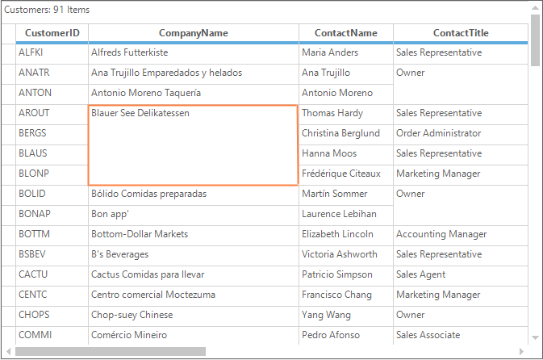

# Cell Merging in Windows Forms GridGrouping Control
Merging is the process of combining two or more adjacent cells with the same data into a single cell. The merge cells can be enabled in the GridGroupingControl by setting the [MergeCell](https://help.syncfusion.com/cr/windowsforms/Syncfusion.Windows.Forms.Grid.GridStyleInfo.html#Syncfusion_Windows_Forms_Grid_GridStyleInfo_MergeCell), [MergeCellsMode](https://help.syncfusion.com/cr/windowsforms/Syncfusion.Windows.Forms.Grid.GridModelOptions.html#Syncfusion_Windows_Forms_Grid_GridModelOptions_MergeCellsMode) and [MergeCellsLayout](https://help.syncfusion.com/cr/windowsforms/Syncfusion.Windows.Forms.Grid.GridMergeCellsLayout.html) properties.




//Setting the merge cell direction
this.gridGroupingControl1.TableDescriptor.Appearance.AnyRecordFieldCell.MergeCell = GridMergeCellDirection.Both;

// Set merge cells behavior for the Grid
this.gridGroupingControl1.TableModel.Options.MergeCellsMode = GridMergeCellsMode.OnDemandCalculation | GridMergeCellsMode.MergeColumnsInRow | GridMergeCellsMode.MergeRowsInColumn;
this.gridGroupingControl1.TableModel.Options.MergeCellsLayout = GridMergeCellsLayout.Grid;



'Setting the merge cell direction
Me.gridGroupingControl1.TableDescriptor.Appearance.AnyRecordFieldCell.MergeCell = GridMergeCellDirection.Both

' Set merge cells behavior for the Grid
Me.gridGroupingControl1.TableModel.Options.MergeCellsMode = GridMergeCellsMode.OnDemandCalculation Or GridMergeCellsMode.MergeColumnsInRow Or GridMergeCellsMode.MergeRowsInColumn



## Setting Merge Cells Behavior 
The calculating behavior of the merge cells can be set by using the `MergeCellsMode` property. It is used to set whether the merge cells need to be calculated at the time of loading grid or calculate on demand basis. It can also be used to set the behavior of the merging such as rows in columns, columns in rows and hidden range of cells using the [GridMergeCellsMode](https://help.syncfusion.com/cr/windowsforms/Syncfusion.Windows.Forms.Grid.GridMergeCellsMode.html) enumeration.

### Merging Rows in Columns
The adjacent rows with the same data can be merged into the single column by using the `MergeRowsInColumns` option.

### Merging Columns in Rows
The adjacent columns with the same data can be merged into the single row by setting the `MergeColumnsInRows` option to the `MergeCellsMode`.

N> The hidden rows and columns can be ignored when comparing the values and merge across them by using the `SkipHiddencells` option.

## Dynamic Merging 
Merging can be applied to the cells dynamically based on the cell values. The merged state will be preserved after any dynamic change such as sorting or grouping.  

By default, when merging is applied in the cells, the grid’s bounds will be drawn with respect to the `MergeCellsMode` applied in the grid. In the case of GridGroupingControl, when the grid’s view layout is changed, the merged state becomes invalid and the grid still have its initial state of bounds. 




//Existing code to set merge cells.
this.gridGroupingControl1.TableDescriptor.Columns["ColumnName"].Appearance.AnyRecordFieldCell.MergeCell = GridMergeCellDirection.Both;
this.gridGroupingControl1.TableModel.Options.MergeCellsMode = GridMergeCellsMode.OnDemandCalculation;

//Sets the range of cells.
this.gridGroupingControl1.TableModel.Options.MergeCellsLayout = GridMergeCellsLayout.Grid;



'Existing code to set merge cells.
Me.gridGroupingControl1.TableDescriptor.Columns("ColumnName").Appearance.AnyRecordFieldCell.MergeCell = GridMergeCellDirection.Both
Me.gridGroupingControl1.TableModel.Options.MergeCellsMode = GridMergeCellsMode.OnDemandCalculation

'Sets the range of cells.
Me.gridGroupingControl1.TableModel.Options.MergeCellsLayout = GridMergeCellsLayout.Grid



## Delaying and Evaluating merge cells
The merging can be delayed for specified range of cells by using [DelayMergeCells](https://help.syncfusion.com/cr/windowsforms/Syncfusion.Windows.Forms.Grid.GridModelMergeCells.html#Syncfusion_Windows_Forms_Grid_GridModelMergeCells_DelayMergeCells_Syncfusion_Windows_Forms_Grid_GridRangeInfo_) methods. The delayed merged cells can be re-evaluated later by using[EvaluateMergeCells](https://help.syncfusion.com/cr/windowsforms/Syncfusion.Windows.Forms.Grid.GridModelMergeCells.html#Syncfusion_Windows_Forms_Grid_GridModelMergeCells_EvaluateMergeCells_Syncfusion_Windows_Forms_Grid_GridRangeInfo_) methods. Therefore the merged cells which are delayed will not be re-evaluated until `EvaluateMergeCells` method is called for that specified range.




// Delaying the merging of cells for specified range
this.gridGroupingControl1.TableModel.MergeCells.DelayMergeCells(GridRangeInfo.Rows(4, 5));

// Re-evaluating of merged cells
this.gridGroupingControl1.TableModel.MergeCells.EvaluateMergeCells(GridRangeInfo.Rows(4, 5));



' Delaying the merging of cells for specified range
Me.gridGroupingControl1.TableModel.MergeCells.DelayMergeCells(GridRangeInfo.Rows(4, 5))

' Re-evaluating of merged cells
Me.gridGroupingControl1.TableModel.MergeCells.EvaluateMergeCells(GridRangeInfo.Rows(4, 5))



## Finding the Merged Range
The [MergeCells](https://help.syncfusion.com/cr/windowsforms/Syncfusion.Windows.Forms.Grid.GridModelMergeCells.html) collection maintains all the merged ranges of a GridGroupingControl. To find a merged range of a cell, [FindRange](https://help.syncfusion.com/cr/windowsforms/Syncfusion.Windows.Forms.Grid.GridModelMergeCells.html#Syncfusion_Windows_Forms_Grid_GridModelMergeCells_FindRange_System_Int32_System_Int32_) method can be used. If the specified cell with row index and column index is inside a ` MergedRange `, a range will be returned. Otherwise it will return the empty range.



GridRangeInfo range1 = this.gridGroupingControl1.TableModel.MergeCells.FindRange(5, 2);
GridRangeInfo range2 = this.gridGroupingControl1.TableModel.MergeCells.FindRange(7, 9);

// Display the MergeCells range
MessageBox.Show("MergedRange for cell(5,2) is " + range1.Info.ToString()
                + "\n" + "MergedRange for cell(7,9) is " + range2.RangeType.ToString());


Dim range1 As GridRangeInfo = Me.gridGroupingControl1.TableModel.MergeCells.FindRange(5, 2)
Dim range2 As GridRangeInfo = Me.gridGroupingControl1.TableModel.MergeCells.FindRange(7, 9)

' Display the MergeCells range
MessageBox.Show("MergedRange for cell(5,2) is " & range1.Info.ToString() & Constants.vbLf & "MergedRange for cell(7,9) is " & range2.RangeType.ToString())



N> The merged range of a cell can also be get by using [GetSpannedRangeInfo](https://help.syncfusion.com/windowsforms/grid-control/managing-the-rows-and-columns#finding-covered-range-floating-range-or-merged-range-of-a-cell) method.

## Custom Cell Merging
The cell merging can be customized by handling the [QueryCanMergeCells](https://help.syncfusion.com/cr/windowsforms/Syncfusion.Windows.Forms.Grid.GridControl.html) event. This event will be raised when grid compares the content of the two cells to determine if they should be merged. It can merge the cells when the `e.Result` and `e.Handled` is set to `true`.

The below code snippet is used to merge the two columns with the different data,



this.gridGroupingControl1.TableModel.QueryCanMergeCells += new GridQueryCanMergeCellsEventHandler(TableModel_QueryCanMergeCells);
void TableModel_QueryCanMergeCells(object sender, GridQueryCanMergeCellsEventArgs e)
{
    
    // Checking whether it is already merged cells
    if (!e.Result)
    {
    
        // Sets merging for two columns with different data
        if (e.Style1.CellIdentity.ColIndex == 1 && e.Style2.CellIdentity.ColIndex== 2)
        {
            e.Result = true;
            e.Handled = true;
        }
    }
}


AddHandler gridGroupingControl1.TableModel.QueryCanMergeCells, AddressOf TableModel_QueryCanMergeCells
Private Sub TableModel_QueryCanMergeCells(ByVal sender As Object, ByVal e As GridQueryCanMergeCellsEventArgs)
    
    ' Checking whether it is already merged cells
    If Not e.Result Then
    
        ' Sets merging for two columns with different data
        If e.Style1.CellIdentity.ColIndex = 1 AndAlso e.Style2.CellIdentity.ColIndex= 2 Then
            e.Result = True
            e.Handled = True
        End If
    End If
End Sub



