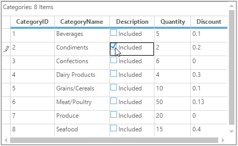
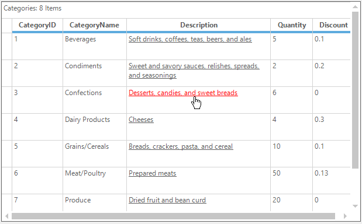

# Cell Types in Windows Forms GridGrouping Control
GridGroupingControl allows the inclusion of some special controls in the grid cells. This attribute of a grid cell is referred to as its Cell Type. This section explains about the built in cell types and how to create a custom cell types in GridGroupingControl.
In grid each cell has been created by using [GridCellModelBase](http://help.syncfusion.com/cr/windowsforms/Syncfusion.Windows.Forms.Grid.GridCellModelBase.html#) and [GridCellRendererBase](http://help.syncfusion.com/cr/windowsforms/Syncfusion.Windows.Forms.Grid.GridCellRendererBase.html#) class. `GridCellModelBase` defines the data or model part of a cell type. It holds all the data information of a cell. Rendering generally refers to the process of creating a visual representation on a user's screen. `GridCellRendererBase` acts a base class for all the renderer part of the cell type.

N> The GridGroupingControl supports all the [basic cell types](http://help.syncfusion.com/windowsforms/grid/cell-types#basic-cell-types) used in GridControl.

## Setting cell type 
The cell type of a cell can be specified by using the [CellType](https://help.syncfusion.com/cr/windowsforms/Syncfusion.Windows.Forms.Grid.Grouping.GridTableCellStyleInfo.html#Syncfusion_Windows_Forms_Grid_Grouping_GridTableCellStyleInfo_CellType) property. There are two ways to assign the value for `CellType` property, by string format or by using the [GridCellTypeName](http://help.syncfusion.com/cr/windowsforms/Syncfusion.Windows.Forms.Grid.GridCellTypeName.html#) static class which contains all the built-in cell type names in it.



//Setting checkbox as the CellType for the column
this.gridGroupingControl1.TableDescriptor.Columns[2].Appearance.AnyRecordFieldCell.CellType = GridCellTypeName.CheckBox;

//Adding the Description for the checkbox column
this.gridGroupingControl1.TableDescriptor.Columns[2].Appearance.AnyRecordFieldCell.Description = "Included";



'Setting checkbox as the CellType for the column
Me.gridGroupingControl1.TableDescriptor.Columns(2).Appearance.AnyRecordFieldCell.CellType = GridCellTypeName.CheckBox

'Adding the Description for the checkbox column
Me.gridGroupingControl1.TableDescriptor.Columns(2).Appearance.AnyRecordFieldCell.Description = "Included"



## Enhanced cell types 
GridGroupingControl supports more than 10 enhanced cell types. These enhanced cell types are listed in the [CustomCellTypes](http://help.syncfusion.com/cr/windowsforms/Syncfusion.GridHelperClasses.CustomCellTypes.html#) enumerator which can be found in `Syncfusion.GridHelperClasses.Windows` library.

### Registering helper cell types
Before setting any [enhanced](http://help.syncfusion.com/windowsforms/grid/cell-types#enhanced-cell-types) cell type to the particular cell, it is needed to be registered in the GridGroupingControl. This can be achieved by using the [GridGroupingCellType](https://help.syncfusion.com/cr/windowsforms/Syncfusion.GridHelperClasses.RegisterCellModel.html#Syncfusion_GridHelperClasses_RegisterCellModel_GridGroupingCellType_Syncfusion_Windows_Forms_Grid_Grouping_GridGroupingControl_Syncfusion_GridHelperClasses_CustomCellTypes_) static method of the [RegisterCellModel](http://help.syncfusion.com/cr/windowsforms/Syncfusion.GridHelperClasses.RegisterCellModel.html#) class.



//Registering the custom cell type to the GridGroupingControl
RegisterCellModel.GridGroupingCellType(this.gridGroupingControl1, CustomCellTypes.PercentTextBox);



'Registering the custom cell type to the GridGroupingControl
RegisterCellModel.GridGroupingCellType(Me.gridGroupingControl1, CustomCellTypes.PercentTextBox)



N> The above code shows how to register a `PercentTextBox` custom cell type to a GridGroupingControl.
 
The following sample shows how to include the helper cell types to the grid cell,
&lt;Installation_Location&gt;\Syncfusion\EssentialStudio\&lt;version&gt;\Windows\Grid.Windows\Samples\Custom Cell Types

## Creating a custom cell type
Apart from the built-in and the enhanced helper cell types, it is also possible to create a custom cell type in grid.  The following steps are used to create the custom cell types in GridGroupingControl,

* [Creating Cell Model](#creating-cell-model)
* [Creating Cell Renderer](#creating-cell-renderer)
* [Registering Cell Model into a Control](#registering-cell-model)
* [Assigning Cell Type](#assigning-cell-type)

### Creating cell model
The custom cell model need to be derived from the `GridCellModelBase` class. The main function of `GridCellModelBase` derived class is to serialize the user control. It can hold any persistent state independent data that your control uses.
Another major function of this class is to create cell renderer object for the custom cell type. In fact, the only required override in `GridCellModelBase` derived class is the [CreateRenderer](https://help.syncfusion.com/cr/windowsforms/Syncfusion.GridHelperClasses.GridInCellModel.html#Syncfusion_GridHelperClasses_GridInCellModel_CreateRenderer_Syncfusion_Windows_Forms_Grid_GridControlBase_) method. In that override, it is possible to create and return GridCellRendererBase derived object that would handle the user interactions in new custom cell type.
In general, it is unlikely to derive directly from the base class. Instead of that, override an existing GridGroupingControl derived class such as [GridStaticCellModel](http://help.syncfusion.com/cr/windowsforms/Syncfusion.Windows.Forms.Grid.GridStaticCellModel.html#). The following code example illustrates this.



//Defines custom Cell Model by inheriting GridStaticCellModel.
public class LinkLabelCellModel : GridStaticCellModel
{

    protected LinkLabelCellModel(SerializationInfo info, StreamingContext context)
        : base(info, context)
    {
    }

    public LinkLabelCellModel(GridModel grid)
        : base(grid)
    {
    }

    //Overrides CreateRenderer Method to create CellRenderer object.   

    public override GridCellRendererBase CreateRenderer(GridControlBase control)
    {
        return new LinkLabelCellRenderer(control, this);
    }
}



'Defines custom Cell Model by inheriting GridStaticCellModel.

Public Class LinkLabelCellModel
	Inherits GridStaticCellModel

	Protected Sub New(ByVal info As SerializationInfo, ByVal context As StreamingContext)
		MyBase.New(info, context)
	End Sub

	Public Sub New(ByVal grid As GridModel)
		MyBase.New(grid)
	End Sub

	'Overrides CreateRenderer Method to create CellRenderer object.   

	Public Overrides Function CreateRenderer(ByVal control As GridControlBase) As GridCellRendererBase
		Return New LinkLabelCellRenderer(control, Me)
	End Function
End Class



### Creating cell renderer
The custom renderer is need to be inherited from the `GridCellRendererBase` class. This base class handles drawing of the cell and user interaction aspects of the cell architecture.
This renderer class will take care of the handling of mouse and keyboard messages, also the UI related changes. It is necessary to override the required methods and properties and modify them as per your needs.
In general, it is unlikely to derive directly from the `GridCellRendererBase` class. Instead of that, override an existing GridGroupingControl derived class such as [GridStaticCellModel](http://help.syncfusion.com/cr/windowsforms/Syncfusion.Windows.Forms.Grid.GridStaticCellModel.html#), [GridGenericControlCellModel](http://help.syncfusion.com/cr/windowsforms/Syncfusion.Windows.Forms.Grid.GridGenericControlCellModel.html#) etc.


public class LinkLabelCellRenderer : GridStaticCellRenderer
{
    private bool _isMouseDown;
    private bool _drawHotLink;
    private Color _hotColor;
    private Color _visitedColor;
    private string _EXEName;

    public LinkLabelCellRenderer(GridControlBase grid, GridCellModelBase cellModel)
        : base(grid, cellModel)
    {
        _isMouseDown = false;
        _drawHotLink = false;
        _hotColor = Color.Red;
        _visitedColor = Color.Purple;
        _EXEName = "iexplore.exe";
    }

    public Color VisitedLinkColor
    {
        get { return _visitedColor; }
        set { _visitedColor = value; }
    }

    public Color ActiveLinkColor
    {
        get { return _hotColor; }
        set { _hotColor = value; }
    }

    public string EXEName
    {
        get { return _EXEName; }
        set { _EXEName = value; }
    }

    protected virtual void LaunchBrowser(GridStyleInfo style)
    {
        try
        {
            System.Diagnostics.Process process = new System.Diagnostics.Process();
            process.StartInfo.FileName = EXEName;
            process.StartInfo.Arguments = (string)style.Tag;
            process.Start();
        }
        catch (Exception ex)
        {
            MessageBox.Show("Error: " + ex.ToString());
        }
    }

    private void DrawLink(bool useHotColor, int rowIndex, int colIndex)
    {
        if (useHotColor)
            _drawHotLink = true;
        this.Grid.RefreshRange(GridRangeInfo.Cell(rowIndex, colIndex), GridRangeOptions.None);
        _drawHotLink = false;
    }

    protected override void OnMouseDown(int rowIndex, int colIndex, System.Windows.Forms.MouseEventArgs e)
    {
        base.OnMouseDown(rowIndex, colIndex, e);
        DrawLink(true, rowIndex, colIndex);
        _isMouseDown = true;
    }

    protected override void OnMouseUp(int rowIndex, int colIndex, System.Windows.Forms.MouseEventArgs e)
    {
        base.OnMouseUp(rowIndex, colIndex, e);
        int row, col;
        this.Grid.PointToRowCol(new Point(e.X, e.Y), out row, out col);
        if (row == rowIndex && col == colIndex)
        {
            GridStyleInfo style = this.Grid.Model[row, col];
            LaunchBrowser(style);
            style.TextColor = VisitedLinkColor;
        }
        DrawLink(false, rowIndex, colIndex);
        _isMouseDown = false;
    }

    protected override void OnCancelMode(int rowIndex, int colIndex)
    {
        base.OnCancelMode(rowIndex, colIndex);
        _isMouseDown = false;
        _drawHotLink = false;
    }

    protected override System.Windows.Forms.Cursor OnGetCursor(int rowIndex, int colIndex)
    {
        
        //If over cell, return HandPointerCursor otherwise NoCursor.
        Point pt = this.Grid.PointToClient(Cursor.Position);
        int row, col;
        this.Grid.PointToRowCol(pt, out row, out col);
        return (row == rowIndex && col == colIndex) ? Cursors.Hand : (this._isMouseDown) ? Cursors.No : base.OnGetCursor(rowIndex, colIndex);
    }

    protected override int OnHitTest(int rowIndex, int colIndex, MouseEventArgs e, IMouseController controller)
    {

        //Return a nonzero so the mouse messages will be forwarded to the cell render

        //But don't include the cell borders so D&D can be handled
        if (controller != null && controller.Name == "OleDataSource")
            
            // Other controllers have higher priority than me
            return 0;

        return 1;

    }

    protected override void OnDraw(System.Drawing.Graphics g, System.Drawing.Rectangle clientRectangle, int rowIndex, int colIndex, Syncfusion.Windows.Forms.Grid.GridStyleInfo style)
    {
        style.Font.Underline = true;

        if (_drawHotLink)
        {
            style.TextColor = ActiveLinkColor;
        }
        base.OnDraw(g, clientRectangle, rowIndex, colIndex, style);
   }

    protected override void OnMouseHoverEnter(int rowIndex, int colIndex)
    {
        base.OnMouseHoverEnter(rowIndex, colIndex);
        DrawLink(true, rowIndex, colIndex);
    }

    protected override void OnMouseHoverLeave(int rowIndex, int colIndex, System.EventArgs e)
    {
        base.OnMouseHoverLeave(rowIndex, colIndex, e);
        DrawLink(false, rowIndex, colIndex);
    }
}


Public Class LinkLabelCellRenderer
	Inherits GridStaticCellRenderer
	Private _isMouseDown As Boolean
	Private _drawHotLink As Boolean
	Private _hotColor As Color
	Private _visitedColor As Color
	Private _EXEName As String

	Public Sub New(ByVal grid As GridControlBase, ByVal cellModel As GridCellModelBase)
		MyBase.New(grid, cellModel)
		_isMouseDown = False
		_drawHotLink = False
		_hotColor = Color.Red
		_visitedColor = Color.Purple
		_EXEName = "iexplore.exe"
	End Sub

	Public Property VisitedLinkColor() As Color
		Get
			Return _visitedColor
		End Get
		Set(ByVal value As Color)
			_visitedColor = value
		End Set
	End Property

	Public Property ActiveLinkColor() As Color
		Get
			Return _hotColor
		End Get
		Set(ByVal value As Color)
			_hotColor = value
		End Set
	End Property

	Public Property EXEName() As String
		Get
			Return _EXEName
		End Get
		Set(ByVal value As String)
			_EXEName = value
		End Set
	End Property

	Protected Overridable Sub LaunchBrowser(ByVal style As GridStyleInfo)
		Try
			Dim process As New System.Diagnostics.Process()
			process.StartInfo.FileName = EXEName
			process.StartInfo.Arguments = CStr(style.Tag)
			process.Start()
		Catch ex As Exception
			MessageBox.Show("Error: " & ex.ToString())
		End Try
	End Sub

	Private Sub DrawLink(ByVal useHotColor As Boolean, ByVal rowIndex As Integer, ByVal colIndex As Integer)
		If useHotColor Then
			_drawHotLink = True
		End If
		Me.Grid.RefreshRange(GridRangeInfo.Cell(rowIndex, colIndex), GridRangeOptions.None)
		_drawHotLink = False
		End Sub

	Protected Overrides Sub OnMouseDown(ByVal rowIndex As Integer, ByVal colIndex As Integer, ByVal e As System.Windows.Forms.MouseEventArgs)
		MyBase.OnMouseDown(rowIndex, colIndex, e)
		DrawLink(True, rowIndex, colIndex)
		_isMouseDown = True
	End Sub

	Protected Overrides Sub OnMouseUp(ByVal rowIndex As Integer, ByVal colIndex As Integer, ByVal e As System.Windows.Forms.MouseEventArgs)
		MyBase.OnMouseUp(rowIndex, colIndex, e)
		Dim row, col As Integer
		Me.Grid.PointToRowCol(New Point(e.X, e.Y), row, col)
		If row = rowIndex AndAlso col = colIndex Then
			Dim style As GridStyleInfo = Me.Grid.Model(row, col)
			LaunchBrowser(style)
			style.TextColor = VisitedLinkColor
		End If
		DrawLink(False, rowIndex, colIndex)
		_isMouseDown = False
	End Sub

	Protected Overrides Sub OnCancelMode(ByVal rowIndex As Integer, ByVal colIndex As Integer)
		MyBase.OnCancelMode(rowIndex, colIndex)
		_isMouseDown = False
		_drawHotLink = False
	End Sub

	Protected Overrides Function OnGetCursor(ByVal rowIndex As Integer, ByVal colIndex As Integer) As System.Windows.Forms.Cursor
		'if over cell, return HandPointerCursor otherwise NoCursor.
		Dim pt As Point = Me.Grid.PointToClient(Cursor.Position)
		Dim row, col As Integer
		Me.Grid.PointToRowCol(pt, row, col)

		Return If((row = rowIndex AndAlso col = colIndex), Cursors.Hand, If((Me._isMouseDown), Cursors.No, MyBase.OnGetCursor(rowIndex, colIndex)))
	End Function

	Protected Overrides Function OnHitTest(ByVal rowIndex As Integer, ByVal colIndex As Integer, ByVal e As MouseEventArgs, ByVal controller As IMouseController) As Integer
		'return a nonzero so the mouse messages will be forwarded to the cell render
		'but don't include the cell borders so D&D can be handled
		If controller IsNot Nothing AndAlso controller.Name = "OleDataSource" Then
			' other controllers have higher priority than me
			Return 0
		End If
		Return 1
	End Function

	Protected Overrides Sub OnDraw(ByVal g As System.Drawing.Graphics, ByVal clientRectangle As System.Drawing.Rectangle, ByVal rowIndex As Integer, ByVal colIndex As Integer, ByVal style As Syncfusion.Windows.Forms.Grid.GridStyleInfo)
		style.Font.Underline = True

		If _drawHotLink Then
			style.TextColor = ActiveLinkColor
		End If
		MyBase.OnDraw(g, clientRectangle, rowIndex, colIndex, style)
	End Sub

	Protected Overrides Sub OnMouseHoverEnter(ByVal rowIndex As Integer, ByVal colIndex As Integer)
		MyBase.OnMouseHoverEnter(rowIndex, colIndex)
		DrawLink(True, rowIndex, colIndex)
	End Sub

	Protected Overrides Sub OnMouseHoverLeave(ByVal rowIndex As Integer, ByVal colIndex As Integer, ByVal e As System.EventArgs)
		MyBase.OnMouseHoverLeave(rowIndex, colIndex, e)
		DrawLink(False, rowIndex, colIndex)
	End Sub
End Class



### Registering cell model
After creating the Cell Model and Cell Renderer for the custom cell type it is necessary to register that custom cell type to the GridGroupingControl. 


//Register the custom cell model to the GridGroupingControl
this.gridGroupingControl1.TableModel.CellModels.Add("LinkLabelCell", new LinkLabelCellModel(this.gridGroupingControl1.TableModel));


'Register the custom cell model to the GridGroupingControl
Me.gridGroupingControl1.TableModel.CellModels.Add("LinkLabelCell", New LinkLabelCellModel(Me.gridGroupingControl1.TableModel))



### Assigning cell type
Assign the registered cell type to a GridGroupingControl like a normal cell type. The custom cell type `LinkLabelCell` acts as a hyperlink. The link for the [LinkLabelCell](http://www.syncfusion.com/downloads/support/forum/119834/ze/CellTypes402757381#) will be assigned in the [Tag](https://help.syncfusion.com/cr/windowsforms/Syncfusion.Windows.Forms.Grid.GridStyleInfo.html#Syncfusion_Windows_Forms_Grid_GridStyleInfo_Tag) property of that cell. This cell displays the ordinary text, but on clicking it will relocate to the link given in the Tag. 


//Setting Custom cell types as the CellType for the column
this.gridGroupingControl1.TableDescriptor.Columns[2].Appearance.AnyRecordFieldCell.CellType = "LinkLabelCell";


'Setting Custom cell types as the CellType for the column
Me.gridGroupingControl1.TableDescriptor.Columns(2).Appearance.AnyRecordFieldCell.CellType = "LinkLabelCell"



