# Coded UI Automation in Windows Forms GridGrouping
The GridGroupingControl can be automated with Coded UI testing automation. Using Visual Studio Premium, Visual Studio Ultimate or Visual Studio Enterprise, user can create a coded UI Test Project which will be used to test and automate the UI of the GridGroupingControl. The validation can be done at grid level or cell level.

Levels of Microsoft Coded UI Test (CUIT) support,

* **Level 1** - Record and Detecting the UIElement
* **Level 2** – Rich text property validation
* **Level 3** - Code Generation with custom classes
* **Level 4** - Support of intent aware action

N> All these levels are supported in GridGroupingControl.

## Getting Started
A `Coded UI Test Project` needs to be created for testing the application. The following steps are used to test the user application with Coded UI test,

1. Create Coded UI Test Project ,

   

2. A `Generate Code for Coded UI test` dialog box will be opened. Click `OK` button,

   

3. The Coded UI Test Builder will be displayed above the notification bar,
   
   

4. Then run the sample application which needs to be automated.

The GridGroupingControl supports Coded UI as the two ways,

* In-built support
* External plugin

## Control Assertion
The **Coded UI Test** performs action on the user interface (UI) controls and verifies that the `UIElement` properties are displayed with the correct values. The assertion of the UI element can be done by the following steps,

1. Create the **Coded UI Test Project** as explained in the [Getting Started](#getting-started) section.
2. In the **Coded UI Test Builder** dialog, select and drag the assertion button to the UI element which needs to be tested,

   

3. The GridGroupingControl or Cell will be highlighted with a rectangular bounds like below,
   
   

### Assertion of GridGroupingControl
For asserting the GridGroupingControl, the whole grid will be highlighted with that rectangular bounds.  After assertion, the properties related to GridGroupingControl will be displayed in **Coded UI Test Builder**.

### Assertion of a Cell
For asserting a particular cell, the cell will be highlighted with that rectangular bounds.  After assertion, the properties related to that particular cell will be displayed in **Coded UI Test Builder**.

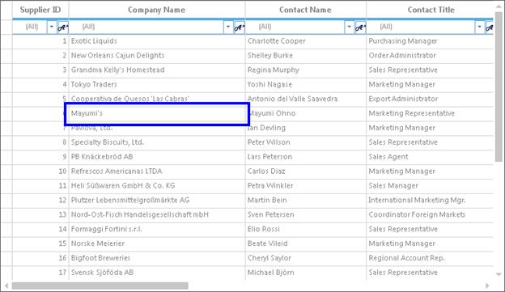

### Assertion of Merged Cells
For asserting the merged cell, the merged range will be treated as a single cell and it will be highlighted with rectangular bounds.  After assertion, the properties related to the merged cell will be displayed in **Coded UI Test Builder**.

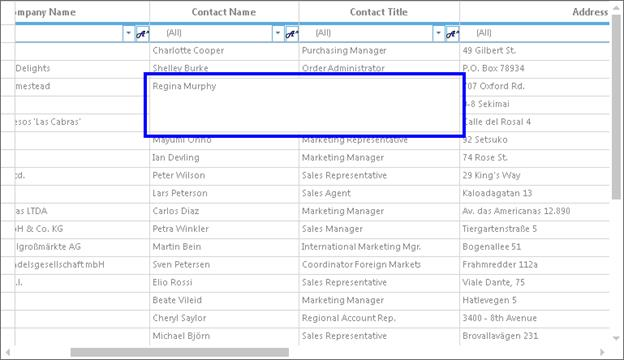

### Assertion of GridGroupDropArea
The GridGroupDropArea of the GridGroupingControl can also be asserted. For asserting the GridGroupDropArea, the GridGroupDropArea will be highlighted with that rectangular bounds.  After assertion, the properties related to that GridGroupDropArea will be displayed in **Coded UI Test Builder**.

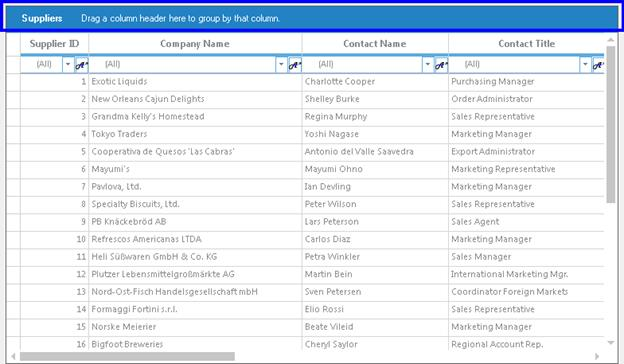

## Record and Playback
The GridGroupingControl lets you record the automation and play back those automated actions whenever application needs to be tested. 

### Recording
The following steps are used to record and playback the application,

1. Create the **Coded UI Test Project** as explained in the [Getting Started](#getting-started) section,
2. Select the `Start Recording` button as follows,

   

3. Perform the needed actions in the application. Ensure that a notification is displaying for each and every actions performed in the application like below,

   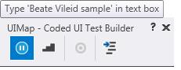

4. Then Click the `Generate Code` button as follows,
   
   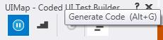

5. The Coded UI test code will be generated in Coded UI Test Project as follows,

   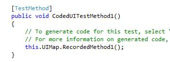

6. The each and every recorded actions will be generated in Coded UI like below,
   
   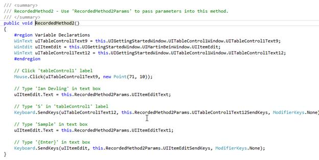

### Playback
The recorded automation codes can be played back. The following steps are used to playback the automated methods,

1. Open the Coded UI Test class file.
2. Run the application which is tested for automation.
3. Right Click on the `CodedUITestMethod1` method.
4. Select the `Run Tests` option.

## In-built Support
The GridGroupingControl supports automated UI testing with Coded UI technology without any external plugin. In this technique, the grid will be detected as an **MSAA** object and the automation code will be generated based on MSAA technology element.  

### System Requirements
The following IDEs and .NET frameworks are supported for automating the GridGroupingControl.

<table>
<tr>
<td>
{{'**Visual Studio**'| markdownify }}
</td>
<td>
Premium, Ultimate, Enterprise editions of
<li>VS2010,</li>
<li>VS2012,</li>
<li>VS2013,</li>
<li>VS2015</li>
</td>
</tr>
<tr>
<td>
{{'**.Net framework**'| markdownify }}

</td>
<td>
<li>3.5,</li> <li>4.0,</li> <li>4.5,</li><li>4.5.1,</li><li>4.6</li>
</td>
</tr>
</table>

### Enabling Coded UI support
The Coded UI support for GridGroupingControl can be enabled using [AccessibilityEnabled](https://help.syncfusion.com/cr/windowsforms/Syncfusion.Windows.Forms.Grid.GridControlBaseImp.html#Syncfusion_Windows_Forms_Grid_GridControlBaseImp_AccessibilityEnabled) property.



this.GridGroupingControl1.AccessibilityEnabled = true;


Me.GridGroupingControl1.AccessibilityEnabled = True



### Assertion
The GridGroupingControl lets you test the user application by asserting the properties which are displayed in the **Coded UI Test Builder**. The grid and the cell bounds will be asserted as an `MSAA` object and the properties will be displayed based on cell types.

For example, TextBox cell will be asserted as `WinText` MSAA control, CheckBox cell will be asserted as `WinCheckBox` MSAA control. The GridGroupingControl will be detected as `WinWindow` MSAA control.

The following table provides the information about the cell types and its equivalent MSAA control on asserting,

<table>
<tr>
<th>
S.No
</th>
<th>
Grid Cell Type
</th>
<th>
MSAA control
</th>
</tr>
<tr>
<td>
1.
</td>
<td>
TextBox
</td>
<td>
WinText
</td>
</tr>
<tr>
<td>
2.
</td>
<td>
ComboBox
</td>
<td>
WinCombobox
</td>
</tr>
<tr>
<td>
3.
</td>
<td>
CheckBox
</td>
<td>
WinCheckBox
</td>
</tr>
<tr>
<td>
4.
</td>
<td>
PushButton
</td>
<td>
WinButton
</td>
</tr>
<tr>
<td>
5.
</td>
<td>
NumericUpDown
</td>
<td>
WinSpinner
</td>
</tr>
</table>

The below example shows the properties that are displayed in the Coded UI test builder,

N> The properties will be displayed based on the respective MSAA control properties. 

### Getting Cell Values
As GridGroupingControl and cell are asserted like MSAA control, a value of a cell will be displayed in the `HelpText` property. 

The below example shows the checkbox is asserted and the checked state of the check box is displayed in `HelpText` property,

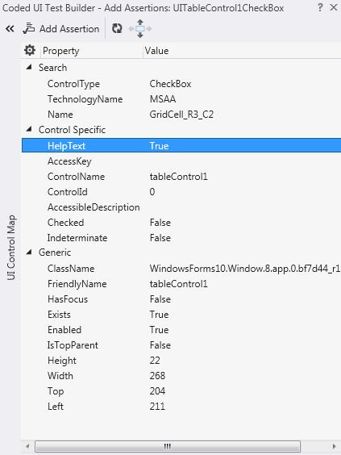

### Finding a cell and getting the cell value
To find a cell in the GridGroupingControl, `SearchProperties` property can be used and to get the cell value, `GetPropertyValue` method can be used. The corresponding cell name has to be given for searching the control. 



[TestMethod]

public void GetGridCell()
{
    UITestControl grid = this.UIMap.UIGettingStartedWindow.UITableControl1Window;
    UITestControl cell = new UITestControl(grid);
    cell.SearchProperties["Name"] = "GridCell_R6_C3";

    if (cell.TryFind())
    {
     MessageBox.Show(cell.GetProperty("HelpText").ToString());
    }
}


<TestMethod>

Public Sub GetGridCell()
    Dim grid As UITestControl = Me.UIMap.UIGettingStartedWindow.UITableControl1Window
    Dim cell As New UITestControl(grid)
    cell.SearchProperties("Name") = "GridCell_R6_C3"
    If cell.TryFind() Then
     MessageBox.Show(cell.GetProperty("HelpText").ToString())
    End If
End Sub



The below example shows the getting of a cell value from grid,

### Highlighting a cell
To highlight a cell in GridGroupingControl, `DrawHighlight` method of corresponding `UITestControl` can be used.



[TestMethod]

public void HighlightCell()
{
UITestControl grid = this.UIMap.UIGettingStartedWindow.UITableControl1Window;
 UITestControl cell = new UITestControl(grid);
 cell.SearchProperties["Name"] = "GridCell_R7_C5";

 if (cell.TryFind())
 {
   cell.DrawHighlight();
 } 
}


<TestMethod>

Public Sub HighlightCell()
 Dim grid As UITestControl = Me.UIMap.UIGettingStartedWindow.UITableControl1Window
 Dim cell As New UITestControl(grid)
 cell.SearchProperties("Name") = "GridCell_R7_C5"

 If cell.TryFind() Then
   cell.DrawHighlight()
 End If
End Sub



The below example shows the highlighting of a cell,

### Highlighting a grid
To highlight a GridGroupingControl, `DrawHighlight` method of corresponding `UITestControl` can be used.



[TestMethod]

public void HighlightGrid()
{
UITestControl grid = this.UIMap.UIGettingStartedWindow.UITableControl1Window;

if (grid.TryFind())
{
  grid.DrawHighlight();
}
}


<TestMethod>

Public Sub HighlightGrid()
Dim grid As UITestControl = Me.UIMap.UIGettingStartedWindow.UITableControl1Window

If grid.TryFind() Then
  grid.DrawHighlight()
End If
End Sub



The below example shows the highlighting of grid,

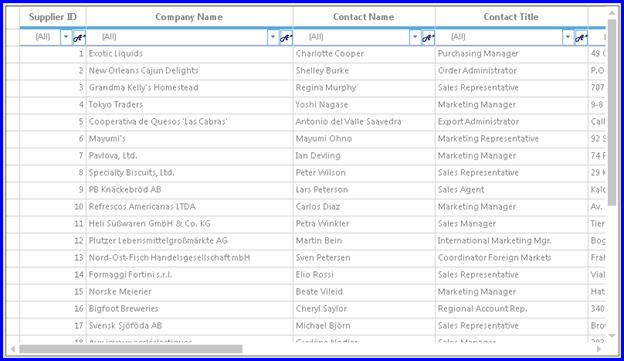

## External Plugin
The GridGroupingControl also provides Coded UI support via external plugin. In this technique, the grid will be detected as `SyncControl` technology instead of detecting as `MSAA` object. The properties will be displayed based on the inner control of the asserted cell or grid. 

### System Requirements
The following IDEs and .NET frameworks are supported for automating the GridGroupingControl.

<table>
<tr>
<td>
{{'**Visual Studio**'| markdownify }}
</td>
<td>
Premium, Ultimate, Enterprise editions of
<li>VS2010,</li>
<li>VS2012,</li>
<li>VS2013</li>
</td>
</tr>
<tr>
<td>
{{'**.Net framework**'| markdownify }}

</td>
<td>
<li>3.5,</li> <li>4.0,</li> <li>4.5,</li><li>4.5.1</li>
</td>
</tr>
</table>

### Enabling Coded UI support
To enable the Coded UI support for grid, the following steps has to be implemented,

* Deploying Extensions Assemblies
* Preparing Grid sample application

The assemblies and copydrop.bat file can be downloaded from [this](https://www.syncfusion.com/downloads/support/directtrac/general/ze/Coded_UI_Assemblies-378283712.zip) link.

#### Deploying Extensions Assemblies
This section explains about deploying the external assemblies through batch file or manual deployment. 

##### Using copydrop.bat file

* Navigate to copydrop.bat file in UI test folder.
* Edit the copydrop.bat file destination path to ship the assemblies. 
* Run the batch file to place the `Extension` and `Provider` assemblies in the appropriate directories. These assemblies are needed as reference for the Visual Studio IDE. 

##### Manual deployment
The following Extensions assemblies can be located in the UI test folder and these should be deployed in the below mentioned directory manually,

* Syncfusion.VisualStudio.TestTools.UITest.GridCommunication.dll
* Syncfusion.VisualStudio.TestTools.UITest.GridExtension.dll

**Directory**
The above extension assemblies should be deployed to the following locations,

* **C:\Program Files (x86)\Common Files\Microsoft Shared\VSTT\&lt;Visual Studio Version&gt;\UITestExtensionPackages***
* **C:\Program Files (x86)\Microsoft Visual Studio &lt;Visual Studio Version&gt;\Common7\IDE\PublicAssemblies***
* **C:\Program Files (x86)\Microsoft Visual Studio &lt;Visual Studio Version&gt;\Common7\IDE\PrivateAssemblies***

For example, the assemblies can be deployed for the `Visual Studio 2013`,

* C:\Program Files (x86)\Common Files\Microsoft Shared\VSTT\12.0\UITestExtensionPackages
* C:\Program Files (x86)\Microsoft Visual Studio 12.0\Common7\IDE\PublicAssemblies
* C:\Program Files (x86)\Microsoft Visual Studio 12.0\Common7\IDE\PrivateAssemblies

### Modifying the Sample Application for Communication
The grid application host runs with .NET Remoting channel hosted internally to communicate with test plugin through an interface. Data is then channeled across the Visual Studio Test Framework to identify the Cells and GridGroupingControl. The following steps helps the users to prepare the grid sample application to support Coded UI plugin.

* Add the Syncfusion.VisualStudio.TestTools.UITest.GridCommunication.dll which contains implementation to easily change an existing application to the test application that the plugin would require.
* Let the parent container inherit `GridGroupingControlTestApplication` class as shown below,




public class Form1 : GridGroupingControlTestApplication
{
}



Public Class Form1
        Inherits GridGroupingControlTestApplication
End Class



### Assertion
The GridGroupingControl can be detected as `Window` control type and Cell can be detected as `Cell` control type with custom rich properties. 

The following table provides the details about the list of properties that will be displayed for Cell,

#### Asserting a Cell

<table>
<tr>
<th>
S.No
</th>
<th>
Property name
</th>
<th>
Description
</th>
</tr>
<tr>
<td>
1.
</td>
<td>
CellValue
</td>
<td>
Indicates a value of a cell.
</td>
</tr>
<tr>
<td>
2.
</td>
<td>
Text
</td>
<td>
Indicates a text of a cell.
</td>
</tr>
<tr>
<td>
3.
</td>
<td>
Description
</td>
<td>
Indicates the description of a cell. This used for checkbox cell which needs to be displayed with text.
</td>
</tr>
<tr>
<td>
4.
</td>
<td>
Format
</td>
<td>
Indicates the number format of the cell.
</td>
</tr>
<tr>
<td>
5.
</td>
<td>
CellWidth
</td>
<td>
Indicates the width of a cell.
</td>
</tr>
<tr>
<td>
6.
</td>
<td>
CellHeight
</td>
<td>
Indicates the height of a cell.
</td>
</tr>
<tr>
<td>
7.
</td>
<td>
FormattedText
</td>
<td>
Indicates the formatted text of a cell.
</td>
</tr>
<tr>
<td>
8.
</td>
<td>
CellType
</td>
<td>
Indicates the type of a cell.
</td>
</tr>
<tr>
<td>
9.
</td>
<td>
FormulaTag
</td>
<td>
Indicates the formula information if it is formula cell.
</td>
</tr>
<tr>
<td>
10.
</td>
<td>
Checked
</td>
<td>
Indicates the checked state information if it is checkbox cell. 
</td>
</tr>
<tr>
<td>
11.
</td>
<td>
AutoCompleteInEditMode
</td>
<td>
Indicates the autocomplete behavior of a cell if it is combobox cell. 
</td>
</tr>
<tr>
<td>
12.
</td>
<td>
DropDownStyle
</td>
<td>
Indicates the dropdown style behavior of a cell if it is combobox cell. 
</td>
</tr>
</table>

### Finding a cell and getting the cell value
To find a cell in the GridGroupingControl, `SearchProperties` property can be used and to get a cell value, the `GetPropertyValue` method can be used. The corresponding control type, RowIndex and columnIndex has to be given for searching the control.



[TestMethod]

public void HighlightCell()
{
  var dataGrid = this.UIMap.UICellCustomizationWindow.UIGridGroupingControl1Window.UIGridGroupingControl1Table;
  UITestControl dataGridCell = new UITestControl(dataGrid);
  dataGridCell.SearchProperties["ControlType"] = "Cell";
  dataGridCell.SearchProperties["RowIndex"] = "6";
  dataGridCell.SearchProperties["ColumnIndex"] = "3";

  if (dataGridCell.TryFind())
    {
       dataGridCell.DrawHighlight();
    }
}


<TestMethod>

Public Sub HighlightCell()
  Dim dataGrid = Me.UIMap.UICellCustomizationWindow.UIGridGroupingControl1Window.UIGridGroupingControl1Table
  Dim dataGridCell As New UITestControl(dataGrid)
  dataGridCell.SearchProperties("ControlType") = "Cell"
  dataGridCell.SearchProperties("RowIndex") = "6"
  dataGridCell.SearchProperties("ColumnIndex") = "3"

  If dataGridCell.TryFind() Then
       dataGridCell.DrawHighlight()
  End If
End Sub



The below example shows the getting of a cell value from grid,

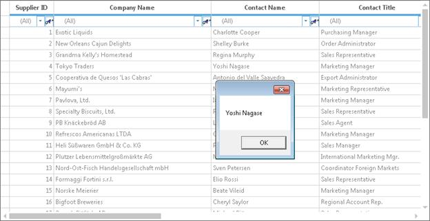

### Highlighting a cell
To highlight a cell in GridGroupingControl, the GridGroupingControl has to be searched with the needed searching properties and `DrawHighlight` method of corresponding `UITestControl` can be used.



[TestMethod]

public void HighlightCell()
{
  var dataGrid = this.UIMap.UICellCustomizationWindow.UIGridGroupingControl1Window.UIGridGroupingControl1Table;
  UITestControl dataGridCell = new UITestControl(dataGrid);
  dataGridCell.SearchProperties["ControlType"] = "Cell";
  dataGridCell.SearchProperties["RowIndex"] = "4";
  dataGridCell.SearchProperties["ColumnIndex"] = "2";

  if (dataGridCell.TryFind())
    {
       dataGridCell.DrawHighlight();
    }
}


<TestMethod>

Public Sub HighlightCell()
  Dim dataGrid = Me.UIMap.UICellCustomizationWindow.UIGridGroupingControl1Window.UIGridGroupingControl1Table
  Dim dataGridCell As New UITestControl(dataGrid)
  dataGridCell.SearchProperties("ControlType") = "Cell"
  dataGridCell.SearchProperties("RowIndex") = "4"
  dataGridCell.SearchProperties("ColumnIndex") = "2"

  If dataGridCell.TryFind() Then
	   dataGridCell.DrawHighlight()
  End If
End Sub


The below example shows the highlighting of a cell,

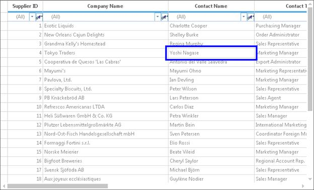

