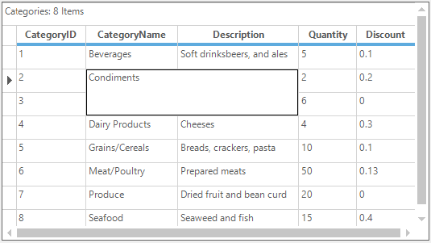
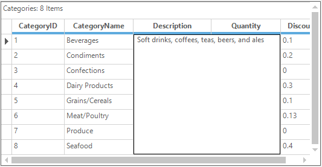
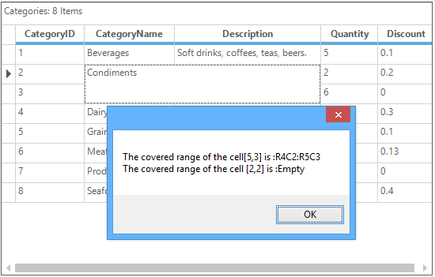

# Covered Ranges in Windows Forms GridGrouping Control
The GridGroupingControl supports the options for adding the covered ranges. It is the process of combining two or more adjacent cells, rows or columns and displayed with in a single cell. This can be achieved by adding the range of cells to the [CoveredRanges](https://help.syncfusion.com/cr/windowsforms/Syncfusion.Windows.Forms.Grid.GridModel.html#Syncfusion_Windows_Forms_Grid_GridModel_CoveredRanges) collection.



//Adding the range of cells into the covered range
this.gridGroupingControl1.TableModel.CoveredRanges.Add(GridRangeInfo.Cells(5, 3, 4, 2));


'Adding the range of cells into the covered range
Me.gridGroupingControl1.TableModel.CoveredRanges.Add(GridRangeInfo.Cells(5, 3, 4, 2))



N> When the sorting is applied on the columns, the covered ranges will not move according to the record index. It will remain covered for the previous range of cells.

## Adding Covered Ranges Using Events
The range of cells can be covered by handling the [QueryCoveredRange](https://help.syncfusion.com/cr/windowsforms/Syncfusion.Windows.Forms.Grid.GridModel.html) event.  It will cover the given range of cells to the `e.Range`.



this.gridGroupingControl1.QueryCoveredRange += new GridTableQueryCoveredRangeEventHandler(gridGroupingControl1_QueryCoveredRange);
this.gridGroupingControl1.QueryCoveredRange += gridGroupingControl1_QueryCoveredRange;
void gridGroupingControl1_QueryCoveredRange(object sender, Syncfusion.Windows.Forms.Grid.Grouping.GridTableQueryCoveredRangeEventArgs e)
{
    int index = 3;   
    
    if(e.Table.Records[index].GetValue("Description").ToString()== "Cheeses")
    {
    
        if (e.RowIndex > 4 && e.RowIndex < 7 && e.ColIndex >1 && e.ColIndex <3)
        {
            e.Range = GridRangeInfo.Cells(e.RowIndex, e.ColIndex, e.RowIndex +1, e.ColIndex +1);
            e.Handled = true;
        }
    }
}


AddHandler gridGroupingControl1.QueryCoveredRange, AddressOf gridGroupingControl1_QueryCoveredRange

Private Sub gridGroupingControl1_QueryCoveredRange(ByVal sender As Object, ByVal e As Syncfusion.Windows.Forms.Grid.Grouping.GridTableQueryCoveredRangeEventArgs)
    Dim index As Integer = 3

    If e.Table.Records(index).GetValue("Description").ToString()= "Cheeses" Then

        If e.RowIndex > 4 AndAlso e.RowIndex < 7 AndAlso e.ColIndex >1 AndAlso e.ColIndex <3 Then
            e.Range = GridRangeInfo.Cells(e.RowIndex, e.ColIndex, e.RowIndex +1, e.ColIndex +1)
            e.Handled = True
        End If
    End If
End Sub



## Finding the Covered Range of a Cell
The covered range for the given cell can be found by using the [Find](https://help.syncfusion.com/cr/windowsforms/Syncfusion.Windows.Forms.Grid.GridModelCoveredRanges.html#Syncfusion_Windows_Forms_Grid_GridModelCoveredRanges_Find_System_Int32_System_Int32_Syncfusion_Windows_Forms_Grid_GridRangeInfo__) and [FindRange](https://help.syncfusion.com/cr/windowsforms/Syncfusion.Windows.Forms.Grid.GridModelCoveredRanges.html#Syncfusion_Windows_Forms_Grid_GridModelCoveredRanges_FindRange_System_Int32_System_Int32_) methods.



//Adding the range of cells into the CoveredRange
this.gridGroupingControl1.TableModel.CoveredRanges.Add(GridRangeInfo.Cells(5, 3, 4, 2));
GridRangeInfo range1, range2;

//Find covered range for the cell(5,3)
this.gridGroupingControl1.TableModel.CoveredRanges.Find(5, 3, out range1);

//Find covered range for the cell(2,3)
range2 = this.gridGroupingControl1.TableModel.CoveredRanges.FindRange(2, 3);
MessageBox.Show("The covered range of the cell[5,3] is :" + range1.ToString()
    + "\nThe covered range of the cell [2,2] is :" + range2.RangeType.ToString());


'Adding the range of cells into the CoveredRange
Me.gridGroupingControl1.TableModel.CoveredRanges.Add(GridRangeInfo.Cells(5, 3, 4, 2))
Dim range1, range2 As GridRangeInfo

'Find covered range for the cell(5,3)
Me.gridGroupingControl1.TableModel.CoveredRanges.Find(5, 3, range1)

'Find covered range for the cell(2,3)
range2 = Me.gridGroupingControl1.TableModel.CoveredRanges.FindRange(2, 3)
MessageBox.Show("The covered range of the cell[5,3] is :" & range1.ToString() & Constants.vbLf & "The covered range of the cell [2,2] is :" & range2.RangeType.ToString())



N> The `CoveredRange` of a cell can also be determined by using [GetSpannedRangeInfo](https://help.syncfusion.com/cr/windowsforms/Syncfusion.Windows.Forms.Grid.GridModel.html#Syncfusion_Windows_Forms_Grid_GridModel_GetSpannedRangeInfo_System_Int32_System_Int32_Syncfusion_Windows_Forms_Grid_GridRangeInfo__) method instead of using `FindRange` method. 

## Removing Particular range from Covered Range
To remove the particular covered range from the grid, use [CoveredRanges.Remove](https://help.syncfusion.com/cr/windowsforms/Syncfusion.Windows.Forms.Grid.GridModelCoveredRanges.html#Syncfusion_Windows_Forms_Grid_GridModelCoveredRanges_Remove_Syncfusion_Windows_Forms_Grid_GridRangeInfo_) method.



//Remove particular range from the CoveredRanges collection 
this.gridGroupingControl1.TableModel.CoveredRanges.Remove(GridRangeInfo.Cells(5, 3, 2, 1));


'Remove particular range from the CoveredRanges collection 
Me.gridGroupingControl1.TableModel.CoveredRanges.Remove(GridRangeInfo.Cells(5, 3, 2, 1))



## Clearing Covered Ranges 
The covered ranges of the grid can be cleared by using the [CoveredRanges.Clear](https://help.syncfusion.com/cr/windowsforms/Syncfusion.Windows.Forms.Grid.GridModelCoveredRanges.html#Syncfusion_Windows_Forms_Grid_GridModelCoveredRanges_Clear) method. It will remove all the `CoveredRanges` from the GridGroupingControl.



//Clear all the Covered ranges from the GridGroupingControl
this.gridGroupingControl1.TableModel.CoveredRanges.Clear();


'Clear all the Covered ranges from the GridGroupingControl
Me.gridGroupingControl1.TableModel.CoveredRanges.Clear()


