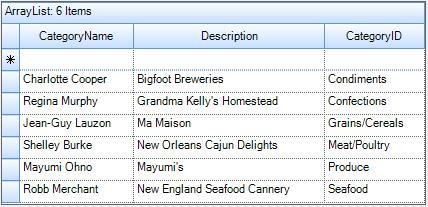
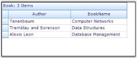
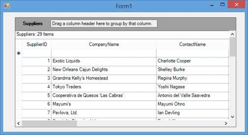
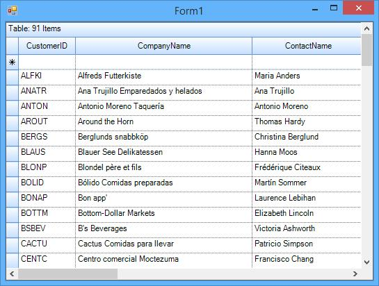

# Data Binding in Windows Forms GridGrouping control
To display data in GridGroupingControl, it must be bound to the data source. GridGroupingControl supports variety of data sources such as [DataTables](https://learn.microsoft.com/en-us/dotnet/api/system.data.datatable?view=net-5.0), [DataSets](https://learn.microsoft.com/en-us/dotnet/api/system.data.dataset?view=net-5.0), or any component that implements interface [IList](https://learn.microsoft.com/en-us/dotnet/api/system.collections.ilist?view=net-5.0), [IBindingList](https://learn.microsoft.com/en-us/dotnet/api/system.componentmodel.bindinglist-1?view=net-5.0), [ITypedList](https://learn.microsoft.com/en-us/dotnet/api/system.componentmodel.itypedlist?view=net-5.0), or [IListSource](https://learn.microsoft.com/en-us/dotnet/api/system.componentmodel.ilistsource?view=net-5.0). The data source can have multiple nested tables, which will be displayed hierarchically by GridGroupingControl. This section explains about the different types of data binding mechanisms supported by GridGroupingControl.

## Data binding using ADO.NET
ADO.NET is an object-oriented set of libraries which is used to interact with different types of data sources and databases. These libraries are called[DataProviders](https://learn.microsoft.com/en-us/dotnet/framework/data/adonet/data-providers) and they allow a common way to interact with specific data sources or protocols. 

The widely used data providers are,

[Ole Db Data Provider](https://learn.microsoft.com/en-us/previous-versions/windows/desktop/ms709836(v=vs.85))- Data Sources that expose an OLEDB interface, i.e. Access or Excel.
[SQL Data Provider](https://learn.microsoft.com/en-us/dotnet/api/system.data.sqlclient?view=windowsdesktop-7.0&viewFallbackFrom=net-5.0)- For interacting with Microsoft SQL Server.

### ADO.Net Objects and its usages
ADO.NET objects are used by ADO data model to support database interaction. These objects must be created to supply data-aware control like grid with database data. Data-aware controls possess two data binding properties,[DataSource](https://learn.microsoft.com/en-us/dotnet/api/system.windows.forms.bindingsource.datasource?view=windowsdesktop-7.0&viewFallbackFrom=net-5.0) and [DataMember](https://learn.microsoft.com/en-us/dotnet/api/system.windows.forms.bindingsource.datamember?view=windowsdesktop-7.0&viewFallbackFrom=net-5.0). Any data source can be bound to the control by assigning it to `DataSource` and `DataMember` properties.

#### Connection Object
It is used for connection to database and managing transactions against database. Database location and access method will be specified through this connection object. The connection object should be a type of [OleDBConnection](https://learn.microsoft.com/en-us/dotnet/api/system.data.oledb.oledbconnection?view=dotnet-plat-ext-5.0) in case of OLE DB data sources or should be a [SqlConnection](https://learn.microsoft.com/en-us/dotnet/api/system.data.sqlclient.sqlconnection?view=dotnet-plat-ext-5.0) object for data sources provided by MS SQL Server.

#### DataAdapter Object
Data adapter acts like a bridge between dataset and data source. It is used to retrieve data from database and populate tables within a dataset. It uses connection object to connect database in order to fill dataset and update changes back to database. There are two adapter components supplied: [OleDBDataAdapter](https://learn.microsoft.com/en-us/dotnet/api/system.data.oledb.oledbdataadapter?view=dotnet-plat-ext-5.0) and [SqlDataAdapter](https://learn.microsoft.com/en-us/dotnet/api/system.data.sqlclient.sqldataadapter?view=dotnet-plat-ext-5.0). The former accesses data sources exposed using OLE DB and the latter is designed to work with data sources provided by MS SQL Server version 7.0 or later.

#### DataSet
Dataset acts like a memory resident cache to hold data. It represents a complete set of data including tables that organize data and relationships between tables. Dataset is designed to help manage data in memory and to support disconnected operations on data. It can be populated by calling `Fill` method of the `DataAdapter`.

#### Command Object
Commands contain information that is submitted to database, and are represented by provider-specific classes such as [SQLCommand](https://learn.microsoft.com/en-us/dotnet/api/system.data.sqlclient.sqlcommand?view=dotnet-plat-ext-5.0). A command can be a stored procedure call, an UPDATE statement, or a statement that returns results.

#### DataReader Object
This is a suitable object when the user want to only get the stream of data for reading. The data returned from data reader is a fast forward-only stream of data. This means that, it can only pull data from the stream in a sequential manner. This is good for speed, but while manipulating the data, then [DataSet](#_DataSet "") is a better object to work with.

### Binding Methods
The following binding methods are available to bind the grid to a database,

* [Binding At Design Time](#binding-at-design-time) 
* [Binding At Run Time](#binding-at-runtime) 

## Binding to XML Data
GridGroupingControl can be bound to data from XML files. This can be achieved by using the `DataSet` object which provides the necessary methods that is used to read XML data into dataset. After loading the data, the grid can be bind to this dataset by setting data binding properties such as `DataSource` and `DataMember` to the dataset and table name respectively. It is also possible to save the changes back to XML file.

The following are the some of the important methods provided by dataset that are used to manipulate XML data. In this, the [XmlSchema](https://learn.microsoft.com/en-us/dotnet/api/system.xml.schema.xmlschema?view=net-5.0) represents the type of data stored in XML file.

**ReadXml**- Reads XML Schema and data into dataset using the specified XML file.
**ReadXmlSchema**- Reads XML Schema from the specified file into dataset.
**WriteXml**- Writes the current data and optionally the schema, for dataset into the specified XML file.
**WriteXmlSchema**- Writes dataset structure as an XML schema into the specified file.



//Creates a Data Set.
DataSet XmlData = new DataSet();

//Populates it with data from an XML file.
XmlData.ReadXml("C:\\Data\\Customers_Orders.xml");

//Binds the grid to Data Set.
gridGroupingControl1.DataSource = XmlData;
gridGroupingControl1.DataMember = XmlData.Tables[0];


'Creates a Data Set.
Dim XmlData As New DataSet()

'Populates it with data from an XML file.
XmlData.ReadXml("C:\Data\Customers_Orders.xml")

'Binds the grid to Data Set.
gridGroupingControl1.DataSource = XmlData
gridGroupingControl1.DataMember = XmlData.Tables(0)



## Binding to Custom Collections
Custom Collections provide a way to store arbitrary objects in a structured fashion that can be bound to GridGroupingControl. All the data binding is based on a set of interfaces that defines different capabilities of objects and collections within the context of accessing and navigating through data. These interfaces set up a two-way communication between bound grid and objects collection used by the same grid. Those collections may be custom business objects collection or may be the one provided by .NET Framework itself like [DataView](https://learn.microsoft.com/en-us/dotnet/api/system.data.dataview?view=net-5.0).

Data binding interfaces will allows the user to create collections of custom objects to present those collections through the grid or navigate through the objects to view them through the same grid and interact with them. Some of these interfaces are `IList`, `ITypedList`, and `IBindingList`.

### IList Interface
Using this interface, the user can create an ordered, indexed set of data items. `IList` interface is one of the most important interfaces in data binding because complex data-bound controls can only be bound to collections that implement `IList`. This interface is used to manage collection’s data by adding, removing, inserting, and accessing items.

Data source implementing the `IList` interface must have at least one record in order to make bound controls like grid to create any rows. It will not be notified of any data changes and thus the changes should be updated manually.

### ITypedList Interface
It is suitable for complex data binding process where user can control the columns that are visible with which description and how they should be treated. For example, the columns can be read only, even there is a set clause in the property definition. Using this interface, the user can tell the bound grid exactly how the objects inside a bound collection have to show up in the control and which properties should show up and how they should be treated.

In this case, it is not necessary to have any records for the rows to be created. Like IList, data source will not be notified when items are added or removed from the list.

### IBindingList Interface
IBindingList interface is the most important data-binding interface that provides rich data binding support. Implementing this interface lets the user to control changes to the list, sorting and searching the list. One important benefit is support for providing change notifications to the collection subscribing to this interface.

IBindingList interface overcomes shortcomings of other interfaces by declaring [ListChanged](https://learn.microsoft.com/en-us/dotnet/api/system.componentmodel.bindinglist-1.listchanged?view=net-5.0) event. Data sources referencing this interface will hook onto this event and so will be aware of items that are added or removed from the list. This makes bound grid update itself automatically.

The chapters in this section will demonstrate how to create such collections by implementing collection interfaces and how to bind grouping grid to these collections.

### Binding IList Collection
This section demonstrates implementation of a collection using `ArrayList` and shows how to bind this collection to a GridGroupingControl. ArrayList is an implementation of `IList` that could be best defined as a hybrid of normal array and collection. It holds items in the order they were added. The items can be retrieved in any order via their index. As elements are added, the capacity of the ArrayList increases automatically. It allows null references and duplicate elements. Objects implementing `IList` interface should have at least one record for data rows to be created. Data rows correspond to data objects in the collection and the data columns represents properties of data.

#### Implementation 
Follow these steps to bind an array of custom objects to a GridGroupingControl.

1. Create a class (Data) whose instances represent records and properties represent record fields.

​


public class Data
{

    public Data()
        : this("", "", "")
    { }

    public Data(string cat_Id, string cat_Name, string desc)
    {
        this.cat_Id = cat_Id;
        this.cat_Name = cat_Name;
        this.desc = desc;
    }

    private string cat_Name;

    public string CategoryName
    {
        get
        {
            return this.cat_Name;
        }
        set
        {
            this.cat_Name = value;
        }
    }

    private string desc;

    public string Description
    {
        get
        {
            return this.desc;
        }
        set
        {
            this.desc = value;
        }
    }
    private string cat_Id;

    public string CategoryID
    {
        get
        {
            return this.cat_Id;
        }
        set
        {
            this.cat_Id = value;
        }
    }
}


Public Class Data

    Public Sub New()
        Me.New("", "", "")
    End Sub

    Public Sub New(ByVal cat_Id As String, ByVal cat_Name As String, ByVal desc As String)
        Me.cat_Id = cat_Id
        Me.cat_Name = cat_Name
        Me.desc = desc
    End Sub

    Private cat_Name As String

    Public Property CategoryName() As String
        Get
            Return Me.cat_Name
        End Get
        Set(ByVal value As String)
            Me.cat_Name = value
        End Set
    End Property

    Private desc As String

    Public Property Description() As String
        Get
            Return Me.desc
        End Get
        Set(ByVal value As String)
            Me.desc = value
        End Set
    End Property
    Private cat_Id As String

    Public Property CategoryID() As String
        Get
            Return Me.cat_Id
        End Get
        Set(ByVal value As String)
            Me.cat_Id = value
        End Set
    End Property
End Class



{{ codesnippet1 | OrderList_Indent_Level_1 }}

2. Create an instance of [ArrayList](https://learn.microsoft.com/en-us/dotnet/api/system.collections.arraylist?view=net-5.0) and add a list of Data type objects into it. This represents collection.

​


using System;
using System.Collections;

ArrayList al = new ArrayList();
al.Add(new Data("Condiments", "Charlotte Cooper", "Bigfoot Breweries"));
al.Add(new Data("Confections", "Regina Murphy", "Grandma Kelly's Homestead"));
al.Add(new Data("Grains/Cereals", "Jean-Guy Lauzon", "Ma Maison"));
al.Add(new Data("Meat/Poultry", "Shelley Burke", "New Orleans Cajun Delights"));
al.Add(new Data("Produce", "Mayumi Ohno", "Mayumi's"));
al.Add(new Data("Seafood", "Robb Merchant", "New England Seafood Cannery"));


Imports System
Imports System.Collections

Dim al As New ArrayList()
al.Add(New Data("Condiments", "Charlotte Cooper", "Bigfoot Breweries"))
al.Add(New Data("Confections", "Regina Murphy", "Grandma Kelly's Homestead"))
al.Add(New Data("Grains/Cereals", "Jean-Guy Lauzon", "Ma Maison"))
al.Add(New Data("Meat/Poultry", "Shelley Burke", "New Orleans Cajun Delights"))
al.Add(New Data("Produce", "Mayumi Ohno", "Mayumi's"))
al.Add(New Data("Seafood", "Robb Merchant", "New England Seafood Cannery"))



{{ codesnippet2 | OrderList_Indent_Level_1 }}

3. Assign this array list to the grid’s `DataSource` and run the sample.

​


this.gridGroupingControl1.DataSource = al;


Me.gridGroupingControl1.DataSource = al



{{ codesnippet3 | OrderList_Indent_Level_1 }}

The Grid will be populated as follows,

**Sample Link:**
&lt;Installed_Location&gt;\Syncfusion\EssentialStudio[Version_Number]\Windows\Grid.Grouping.Windows\Samples\Data Sources\Array List Demo

### Binding IBindingList Collection
This section demonstrates implementation of `IBindingList` and how to bind this list to GridGrouping control. As `IBindingList` derives from `IList`, it requires the implementation of all the members of the `IList`, `ICollection` and `IEnumerable` interfaces.

#### Benefits
The benefit of using `IBindingList` includes support for change notifications when the list is modified. It does have `ListChanged` event, which will be fired upon any data change. If the collection supports changes, it should also support firing `ListChanged` event when the collection changes. To indicate that, the collection should return true from `SupportsChangeNotification` property. Hence when items are added or removed from the collection, the grouping grid will be notified of these changes and will update itself automatically.

#### Implementation Procedure
Follow these steps to create the own collection that implements `IBindingList` and to bind this collection to a grouping grid.

1. Create a class(Class1) whose instances will represent records. Its properties represent record fields.
2. Create another class(Class2) that implements interfaces `IBindingList` and `INotifiedPropertyChanged`, in order to be notified of any property value change. This class will represent the list of records and will act as data store for your grouping grid.
3. Implements the necessary events: `ListChanged` and `PropertyChanged`.
4. Raise ListChanged event once the list is modified.
5. Make SupportChangeNotifications property to return true.
6. Create an instance of Class2 and add a list of records into it. Then assign this list to DataSource of grouping grid.

**Sample Location:**
&lt;Install_Location&gt;\Syncfusion\EssentialStudio[Version_Number]\Windows\Grid.Grouping.Windows\Samples\Data Sources\IBindingList Demo

### Binding ITypedList Collection
This section demonstrates implementation of `ITypedList`, which is used for complex data binding. It is best to use this interface where user want a type to explicitly specify properties it exposes instead of letting `TypeDescriptor` to find out using reflection. The interface contains two methods: `GetItemProperties` and `GetListName`.

GetItemProperties accepts no parameters and returns `PropertyDescriptorCollection`. In this method, you can use `TypeDescriptor.GetProperties` to load properties from your type. `GetListName` returns the name of the list.

#### Implementation
Follow the steps below to create a collection (Books Collection) that implements `ITypedList` and binds this collection to the grouping grid.

1. Create a class Book that represents the structure of the record.

​


class Book
{

    public Book(string bookName, string author)
    {
        this.bookName = bookName;
        this.author = author;
    }

    private string bookName;

    public string BookName
    {
        get
        {
            return this.bookName;
        }
        set
        {
            this.bookName = value;
        }
    }

    private string author;

    public string Author
    {
        get
        {
            return this.author;
        }
        set
        {
            this.author = value;
        }
    }
}


Friend Class Book

    Public Sub New(ByVal bookName As String, ByVal author As String)
        Me.bookName_Renamed = bookName
        Me.author_Renamed = author
    End Sub

    Private bookName_Renamed As String

    Public Property BookName() As String
        Get
            Return Me.bookName_Renamed
        End Get
        Set(ByVal value As String)
            Me.bookName_Renamed = value
        End Set
    End Property

    Private author_Renamed As String

    Public Property Author() As String
        Get
            Return Me.author_Renamed
        End Get
        Set(ByVal value As String)
            Me.author_Renamed = value
        End Set
    End Property
End Class




{{ codesnippet4 | OrderList_Indent_Level_1 }}

2. Create another class Books that inherits `ArrayList` class and implements `ITypedList`. A list of its instances will act as data store for GridGroupingControl. Implement `GetItemProperties` and `GetListName` methods.

​



public class Books : ArrayList, ITypedList
{

    public PropertyDescriptorCollection GetItemProperties(PropertyDescriptor[] listAccessors)
    {
        return TypeDescriptor.GetProperties(typeof(Book));
    }
    
    public string GetListName(PropertyDescriptor[] listAccessors)
    {
        return "Book";
    }
}


Public Class Books
    Inherits ArrayList
    Implements ITypedList

    Public Function GetItemProperties(ByVal listAccessors() As PropertyDescriptor) As PropertyDescriptorCollection
        Return TypeDescriptor.GetProperties(GetType(Book))
    End Function

    Public Function GetListName(ByVal listAccessors() As PropertyDescriptor) As String
        Return "Book"
    End Function
End Class



{{ codesnippet5 | OrderList_Indent_Level_1 }}

3. Create an instance of Books and add a few records into it.

​


Books MyBooks = new Books();
MyBooks.Add(new Book("Computer Networks", "Tanenbaum"));
MyBooks.Add(new Book("Data Structures", "Tremblay and Sorenson"));
MyBooks.Add(new Book("Database Management", "Alexis Leon"));


Dim MyBooks As New Books()
MyBooks.Add(New Book("Computer Networks", "Tanenbaum"))
MyBooks.Add(New Book("Data Structures", "Tremblay and Sorenson"))
MyBooks.Add(New Book("Database Management", "Alexis Leon"))



{{ codesnippet6 | OrderList_Indent_Level_1 }}

4. Assign this list to the grouping grid’s DataSource. Run the sample.

​


this.gridGroupingControl1.DataSource = MyBooks;


Me.gridGroupingControl1.DataSource = MyBooks



{{ codesnippet7 | OrderList_Indent_Level_1 }}

**Sample Link:**
&lt;Install_Location&gt;\Syncfusion\EssentialStudio[Version_Number]\Windows\Grid.Grouping.Windows\Samples\Data Sources\Array List Demo

### Binding a list with primitive data type 
The primitive data type (int, float, double Etc.) does not contain any properties. For example, `string` data type has the `Length` property. But `int` data type does not have any properties. Therefore, columns will not be populated for primitive data types when bind the list with primitive data type which has no properties to the grid.
If you want to bind the primitive data type collections to the grid, you can create a class which contains the property with the type that you want to add to the collection.


public Form1()
{
    InitializeComponent();

    //Create a list of Items.
    List<Items> list = new List<Items>();
    list.Add(new Items(1));
    list.Add(new Items(2));

    //Set the data source.
    gridGroupingControl1.DataSource = list;
}

//Class that contains one property with Primitive data type
public class Items
{
    public int No { get; set; }
    public Items(int no)
    {
        No = no;
    }
}


Public Sub New()
	InitializeComponent()

	'Create a list of Items.
	Dim list As New List(Of Items)()
	list.Add(New Items(1))
	list.Add(New Items(2))

	'Set the data source.
	gridGroupingControl1.DataSource = list
End Sub

'Class that contains one property with Primitive data type
Public Class Items
	Public Property No() As Integer
	Public Sub New(ByVal no As Integer)
		Me.No = no
	End Sub
End Class

  

### Strongly Typed Collections
GridGroupingControl can be bound to a strongly typed collection. Strongly Typed Collection is a collection that stores a Known Type. It can be viewed as an array of specific object. For example, suppose the application needs to store information about products in a factory, user can create a Strongly Typed collection of Product objects.

#### Benefits
Since the collection knows the type of object, it does not need to type cast items between the type you are really storing and a generic object type stored in a collection.

While writing the code to manage collection items, user can perform any other operation on the items that are being written into and read from the collection.

### Collection Base
Strongly Typed collection can be created by inheriting from the `System.Collections.CollectionBase` class. `CollectionBase` class implements IList, IListSource, and IEnumerable. These interfaces enable the users to implement methods and properties that support binding, enumerating, and looping using ForEach construct. The result is that your strongly typed collections can be bound directly to our grid grouping control as data source.

1. Create a class Product whose instances represent the records and properties represent the record fields.

​


class Product
{
    string productName, qtyPerUnit;

    public Product(string name, string qty)
    {
        this.productName = name;
        this.qtyPerUnit = qty;
    }

    public string ProductName
    {
        get
        {
            return productName;
        }
        set
        {
            productName = value;
        }
    }

    public string QuantityPerUnit
    {
        get
        {
            return qtyPerUnit;
        }
        set
        {
            qtyPerUnit = value;
        }
    }
}


Friend Class Product

    Private productName_Renamed, qtyPerUnit As String

    Public Sub New(ByVal name As String, ByVal qty As String)
        Me.productName_Renamed = name
        Me.qtyPerUnit = qty
    End Sub

    Public Property ProductName() As String
        Get
            Return productName_Renamed
        End Get
        Set(ByVal value As String)
            productName_Renamed = value
        End Set
    End Property

    Public Property QuantityPerUnit() As String
        Get
            Return qtyPerUnit
        End Get
        Set(ByVal value As String)
            qtyPerUnit = value
        End Set
    End Property
End Class



{{ codesnippet8 | OrderList_Indent_Level_1 }}

2. Create another class Product that derives the `CollectionBase` class. To make it Strongly Typed, add a default property that will return a typed object. Also, implement an ADD method.

​


using System;
using System.Collections;

class Products : CollectionBase
{

    //Default Property.

    public Product this[int index]
    {
        get { return (Product)List[index]; }
        set { List[index] = (Product)value; }
    }

    public int Add(Product item)
    {
        return List.Add(item);
    }
}


Imports System
Imports System.Collections

Friend Class Products
    Inherits CollectionBase

    'Default Property.
    Default Public Property Item(ByVal index As Integer) As Product
        Get
            Return CType(List(index), Product)
        End Get
        Set(ByVal value As Product)
            List(index) = CType(value, Product)
        End Set
    End Property

    Public Function Add(ByVal item As Product) As Integer
        Return List.Add(item)
    End Function
End Class




{{ codesnippet9 | OrderList_Indent_Level_1 }}

3. Create Products Collection by instantiating Products class and adding few records to it.

​


Products MyProducts = new Products();
MyProducts.Add(new Product("Chai", "10 boxes x 20 bags"));
MyProducts.Add(new Product("Aniseed Syrup", "12 - 550 ml bottles"));
MyProducts.Add(new Product("Sir Rodney's Marmalade", "30 gift boxes"));


Dim MyProducts As New Products()
MyProducts.Add(New Product("Chai", "10 boxes x 20 bags"))
MyProducts.Add(New Product("Aniseed Syrup", "12 - 550 ml bottles"))
MyProducts.Add(New Product("Sir Rodney's Marmalade", "30 gift boxes"))



{{ codesnippet10 | OrderList_Indent_Level_1 }}

4. Finally assign this collection to the `DataSource` property of the GridGroupingControl and run the sample.

​


this.gridGroupingControl1.DataSource = MyProducts;


Me.gridGroupingControl1.DataSource = MyProducts



{{ codesnippet11 | OrderList_Indent_Level_1 }}

**Sample Location:**
&lt;Install_Location&gt;\Syncfusion\EssentialStudio[Version_Number]\Windows\Grid.Grouping.Windows\Samples\Data Sources\Collection Base Demo

### Generic Collection
Generics refer to those classes, structure, methods, and interfaces that have place holders for the types they can contain or use. A generic collection class uses type parameters as place holders for the type of objects it stores, for the type of its fields, and the parameter types for its methods. The actual types are assigned to these place holders while creating the instances.

It provides a standard way to create non-type-specific collection. Hence, we can get immediate benefit of type safety without having to derive from base collection type and implement type-specific members. Through generics, it is possible to have a single array class to store a list of Players or even a list of Products.

The .NET 2.0 Framework provides a number of generic collections to work with. The generic collection classes have been defined in the `System.Collections.Generic` namespace. Some of them are listed below.

* **List&lt;T&gt;**is the generic version of ArrayList based on generic interface **IList**.
* **BindingList&lt;T&gt;**is the generic collection based on **IBindingList**.
* **BindingListView&lt;T&gt;**is a generic collection based on **IBindingListView**.

Where T is the place-holder for type parameter.
Off these classes, IBindingList implementation has some specialties. BindingList&lt;T&gt; automatically raises `ListChanged` event when `INotifyPropertyChanged.PropertyChanged` event is raised in a child object. It also raises it when items are added or removed. When you implement custom collection and want the grid to react to changes in data source, you should implement IBindingList and raise ListChanged events.

#### Implementation
Follow the steps below to implement generic collection and bind it to grid. This implementation uses `BindingList` class.

1. Create a class (CustomClass) whose objects represent records, and properties represent the record fields. This class implements `INotifyPropertyChanged` interface in order to trigger the grid to react to changes in the list.

​


class Products : CollectionBase
{

    //Default Property.

    public Product this[int index]
    {
        get { return (Product)List[index]; }
        set { List[index] = (Product)value; }
    }

    public int Add(Product item)
    {
        return List.Add(item);
    }
}

public class CustomClass : INotifyPropertyChanged
{
    int id;
    string first_name;
    string last_name;
    string address;
    string city;

    public CustomClass(int id, string firstName, string lastName, string address, string city)
    {
        this.id = id;
        first_name = firstName;
        last_name = lastName;
        this.address = address;
        this.city = city;
    }

    public int ID
    {
        get { return id; }
        set
        {
            if (id != value)
            {
                id = value;
                RaisePropertyChanged("ID");
            }
        }
    }

    public string FirstName
    {
        get { return first_name; }
        set
        {
            if (first_name != value)
            {
                first_name = value;
                RaisePropertyChanged("FirstName");
            }
        }
    }

    public string LastName
    {
        get { return last_name; }
        set
        {
            if (last_name != value)
            {
                last_name = value;
                RaisePropertyChanged("LastName");
            }
            last_name = value;
        }
    }

    public string Address
    {
        get { return address; }
        set
        {
            if (address != value)
            {
                address = value;
                RaisePropertyChanged("Address");
            }
        }
    }

    public string City
    {
        get { return city; }
        set
        {
            if (city != value)
            {
                city = value;
                RaisePropertyChanged("City");
            }
        }
    }
    void RaisePropertyChanged(string name)
    {

        if (PropertyChanged != null)
            PropertyChanged(this, new PropertyChangedEventArgs(name));
    }

    //INotifyPropertyChanged Members.

    public event PropertyChangedEventHandler PropertyChanged;
}


Friend Class Products
    Inherits CollectionBase

    'Default Property.

    Default Public Property Item(ByVal index As Integer) As Product
        Get
            Return CType(List(index), Product)
        End Get
        Set(ByVal value As Product)
            List(index) = CType(value, Product)
        End Set
    End Property

    Public Function Add(ByVal item As Product) As Integer
        Return List.Add(item)
    End Function
End Class

Public Class CustomClass
    Implements INotifyPropertyChanged

'INSTANT VB NOTE: The variable id was renamed since Visual Basic does not allow class members with the same name:
    Private id_Renamed As Integer
    Private first_name As String
    Private last_name As String

'INSTANT VB NOTE: The variable address was renamed since Visual Basic does not allow class members with the same name:
    Private address_Renamed As String

'INSTANT VB NOTE: The variable city was renamed since Visual Basic does not allow class members with the same name:

    Private city_Renamed As String

    Public Sub New(ByVal id As Integer, ByVal firstName As String, ByVal lastName As String, ByVal address As String, ByVal city As String)
        Me.id_Renamed = id
        first_name = firstName
        last_name = lastName
        address_Renamed = address
        Me.city_Renamed = city
    End Sub

    Public Property ID() As Integer
        Get
            Return id_Renamed
        End Get
        Set(ByVal value As Integer)
            If id_Renamed <> value Then
                id_Renamed = value
                RaisePropertyChanged("ID")
            End If
        End Set
    End Property

    Public Property FirstName() As String
        Get
            Return first_name
        End Get
        Set(ByVal value As String)
            If first_name <> value Then
                first_name = value
                RaisePropertyChanged("FirstName")
            End If
        End Set
    End Property

    Public Property LastName() As String
        Get
            Return last_name
        End Get
        Set(ByVal value As String)
            If last_name <> value Then
                last_name = value
                RaisePropertyChanged("LastName")
            End If
            last_name = value
        End Set
    End Property

    Public Property Address() As String
        Get
            Return address_Renamed
        End Get
        Set(ByVal value As String)
            If address_Renamed <> value Then
                address_Renamed = value
                RaisePropertyChanged("Address")
            End If
        End Set
    End Property

    Public Property City() As String
        Get
            Return city_Renamed
        End Get
        Set(ByVal value As String)
            If city_Renamed <> value Then
                city_Renamed = value
                RaisePropertyChanged("City")
            End If
        End Set
    End Property

    Private Sub RaisePropertyChanged(ByVal name As String)
        RaiseEvent PropertyChanged(Me, New PropertyChangedEventArgs(name))
    End Sub

    'INotifyPropertyChanged Members.

    Public Event PropertyChanged As PropertyChangedEventHandler
End Class



{{ codesnippet12 | OrderList_Indent_Level_1 }}

2. Instantiate BindingList &lt;T&gt; class by specifying the type of collection as `CustomClass` and add few records to it. This will create a collection of `CustomClass` type objects.

​


using System.Collections.Generic;

BindingList<CustomClass> bl = new BindingList<CustomClass>();
bl.Add(new CustomClass(0101, "Charlotte", "Cooper", "49 Gilbert St.", "London"));
bl.Add(new CustomClass(0102, "Shelley", "Burke", "P.O. Box 78934", "New Orleans"));
bl.Add(new CustomClass(0103, "Regina", "Murphy", "707 Oxford Rd.", "Ann Arbor"));
bl.Add(new CustomClass(0104, "Yoshi", "Nagase", "9-8 Sekimai Musashino-shi", "Tokyo"));
bl.Add(new CustomClass(0105, "Mayumi", "Ohno", "Calle del Rosal 4", "Oviedo"));


Imports System.Collections.Generic

Dim bl As New BindingList(Of CustomClass)()
bl.Add(New CustomClass(0101, "Charlotte", "Cooper", "49 Gilbert St.", "London"))
bl.Add(New CustomClass(0102, "Shelley", "Burke", "P.O. Box 78934", "New Orleans"))
bl.Add(New CustomClass(0103, "Regina", "Murphy", "707 Oxford Rd.", "Ann Arbor"))
bl.Add(New CustomClass(0104, "Yoshi", "Nagase", "9-8 Sekimai Musashino-shi", "Tokyo"))
bl.Add(New CustomClass(0105, "Mayumi", "Ohno", "Calle del Rosal 4", "Oviedo"))




{{ codesnippet13 | OrderList_Indent_Level_1 }}

3. Assign this list to the grouping grid’s DataSource and run this sample.

​


this.gridGroupingControl1.DataSource = bl;


Me.gridGroupingControl1.DataSource = bl



{{ codesnippet14 | OrderList_Indent_Level_1 }}

The Grid will be loaded with the data looks like the following screenshot,

**Sample Link:**
*&lt;Installed_Location&gt;\Syncfusion\EssentialStudio[Version_Number]\Windows\Grid.Grouping.Windows\Samples\Data Sources\Generic Collection Demo*

### Dynamic Object Binding
The grid can be bounded to the [DynamicObject](https://learn.microsoft.com/en-us/dotnet/api/system.dynamic.dynamicobject?view=net-5.0) by enabling the [IsDynamicData](https://help.syncfusion.com/cr/windowsforms/Syncfusion.Windows.Forms.Grid.Grouping.GridGroupingControl.html#Syncfusion_Windows_Forms_Grid_Grouping_GridGroupingControl_IsDynamicData) property. It will prepare the grid for the dynamic data source. This feature is only available for the .NET Framework 4.0 and above.

The following steps are used to have the dynamic object binding for the GridGroupingControl.

1. Derive the `DynamicDictionary` class by deriving it from the `DynamicObject`.

​


// The class derived from DynamicObject.  
public class DynamicDictionary : DynamicObject, IDictionary<string, object>
{

    // The inner dictionary.

    public Dictionary<string, object> dictionary = new Dictionary<string, object>();

    // This property returns the number of elements 

    // in the inner dictionary. 
 
    public int Count
    {
        get
        {
            return dictionary.Count;
        }
    }

    // If you try to get a value of a property  
 
    // Not defined in the class, this method is called. 
 
    public override bool TryGetMember(
        GetMemberBinder binder, out object result)
    {
 
        // Converting the property name to lowercase 
 
        // so that property names become case-insensitive. 
        string name = binder.Name;

        // If the property name is found in a dictionary, 
 
        // set the result parameter to the property value and return true. 
 
        // Otherwise, return false. 
        return dictionary.TryGetValue(name, out result);
    }

    // If you try to set a value of a property that is 
 
    // not defined in the class, this method is called. 
    public override bool TrySetMember(
        SetMemberBinder binder, object value)
    {
 
        // Converting the property name to lowercase 
 
        // so that property names become case-insensitive.
        dictionary[binder.Name] = value;

        // You can always add a value to a dictionary, 
 
        // so this method always returns true. 
        return true;
    }

    public void Add(string key, object value)
    {
        dictionary.Add(key, value);
    }

    public void Clear()
    {
        dictionary.Clear();
    }

    public bool Contains(string key)
    {
        return dictionary.ContainsKey(key);
    }

    public IDictionaryEnumerator GetEnumerator()
    {
        return dictionary.GetEnumerator();
    }

    public bool IsFixedSize
    {
        get { return false; }
    }

    public bool IsReadOnly
    {
        get { return false; }
    }

    public ICollection Keys
    {
        get { return dictionary.Keys; }
    }

    public void Remove(string key)
    {
        dictionary.Remove(key);
    }

    public ICollection Values
    {
        get { return dictionary.Values; }
    }

    public object this[string key]
    {
        get
        {
            if(dictionary.ContainsKey(key))
                return dictionary[key];
            return null;
        }
        set
        {
            dictionary[key] = value;
        }
    }

    public bool ContainsKey(string key)
    {
        return dictionary.ContainsKey(key);
    }

    ICollection<string> IDictionary<string, object>.Keys
    {
        get { return dictionary.Keys; }
    }

    bool IDictionary<string, object>.Remove(string key)
    {
        return dictionary.Remove(key);
    }

    public bool TryGetValue(string key, out object value)
    {
        value = dictionary[key];
        return true;
    }

    ICollection<object> IDictionary<string, object>.Values
    {
        get { return dictionary.Values; }
    }

    public void Add(KeyValuePair<string, object> item)
    {
        dictionary.Add(item.Key, item.Value);
    }

    public bool Contains(KeyValuePair<string, object> item)
    {
        return dictionary.ContainsKey(item.Key);
    }

    public void CopyTo(KeyValuePair<string, object>[] array, int arrayIndex)
    {
        throw new NotImplementedException();
    }

    public bool Remove(KeyValuePair<string, object> item)
    {
        return dictionary.Remove(item.Key);
    }

    IEnumerator<KeyValuePair<string, object>> IEnumerable<KeyValuePair<string, object>>.GetEnumerator()
    {
        return dictionary.GetEnumerator();
    }

    IEnumerator IEnumerable.GetEnumerator()
    {
        return dictionary.GetEnumerator();
    }
}


' The class derived from DynamicObject.  
Public Class DynamicDictionary
    Inherits DynamicObject
    Implements IDictionary(Of String, Object)
 
    ' The inner dictionary.
    Public dictionary As New Dictionary(Of String, Object)()

    ' This property returns the number of elements 
 
    ' in the inner dictionary. 
    Public ReadOnly Property Count() As Integer
        Get
            Return dictionary.Count
        End Get
    End Property

    ' If you try to get a value of a property  
 
    ' not defined in the class, this method is called. 
 
    Public Overrides Function TryGetMember(ByVal binder As GetMemberBinder, <System.Runtime.InteropServices.Out()> ByRef result As Object) As Boolean
 
        ' Converting the property name to lowercase 
 
        ' so that property names become case-insensitive. 
        Dim name As String = binder.Name

        ' If the property name is found in a dictionary, 
 
        ' set the result parameter to the property value and return true. 
 
        ' Otherwise, return false. 
        Return dictionary.TryGetValue(name, result)
    End Function

    ' If you try to set a value of a property that is 
 
    ' not defined in the class, this method is called. 
 
    Public Overrides Function TrySetMember(ByVal binder As SetMemberBinder, ByVal value As Object) As Boolean
 
        ' Converting the property name to lowercase 
 
        ' so that property names become case-insensitive.
        dictionary(binder.Name) = value

        ' You can always add a value to a dictionary, 
 
        ' so this method always returns true. 
        Return True
    End Function

    Public Sub Add(ByVal key As String, ByVal value As Object)
        dictionary.Add(key, value)
    End Sub

    Public Sub Clear()
        dictionary.Clear()
    End Sub

    Public Function Contains(ByVal key As String) As Boolean
        Return dictionary.ContainsKey(key)
    End Function

    Public Function GetEnumerator() As IDictionaryEnumerator
        Return dictionary.GetEnumerator()
    End Function

    Public ReadOnly Property IsFixedSize() As Boolean
        Get
            Return False
        End Get
    End Property

    Public ReadOnly Property IsReadOnly() As Boolean
        Get
            Return False
        End Get
    End Property

    Public ReadOnly Property Keys() As ICollection
        Get
            Return dictionary.Keys
        End Get
    End Property

    Public Sub Remove(ByVal key As String)
        dictionary.Remove(key)
    End Sub

    Public ReadOnly Property Values() As ICollection
        Get
            Return dictionary.Values
        End Get
    End Property

    Default Public Property Item(ByVal key As String) As Object
        Get
            If dictionary.ContainsKey(key) Then
                Return dictionary(key)
            End If
            Return Nothing
        End Get
        Set(ByVal value As Object)
            dictionary(key) = value
        End Set
    End Property

    Public Function ContainsKey(ByVal key As String) As Boolean
        Return dictionary.ContainsKey(key)
    End Function

    Private ReadOnly Property IDictionary_Keys() As ICollection(Of String) Implements IDictionary(Of String, Object).Keys
        Get
            Return dictionary.Keys
        End Get
    End Property

    Private Function IDictionary_Remove(ByVal key As String) As Boolean Implements IDictionary(Of String, Object).Remove
        Return dictionary.Remove(key)
    End Function

    Public Function TryGetValue(ByVal key As String, <System.Runtime.InteropServices.Out()> ByRef value As Object) As Boolean
        value = dictionary(key)
        Return True
    End Function

    Private ReadOnly Property IDictionary_Values() As ICollection(Of Object) Implements IDictionary(Of String, Object).Values
        Get
            Return dictionary.Values
        End Get
    End Property

    Public Sub Add(ByVal item As KeyValuePair(Of String, Object))
        dictionary.Add(item.Key, item.Value)
    End Sub

    Public Function Contains(ByVal item As KeyValuePair(Of String, Object)) As Boolean
        Return dictionary.ContainsKey(item.Key)
    End Function

    Public Sub CopyTo(ByVal array() As KeyValuePair(Of String, Object), ByVal arrayIndex As Integer)
        Throw New NotImplementedException()
    End Sub

    Public Function Remove(ByVal item As KeyValuePair(Of String, Object)) As Boolean
        Return dictionary.Remove(item.Key)
    End Function

    Private Function IEnumerable_GetEnumerator() As IEnumerator(Of KeyValuePair(Of String, Object)) Implements IEnumerable(Of KeyValuePair(Of String, Object)).GetEnumerator
        Return dictionary.GetEnumerator()
    End Function

    Private Function IEnumerable_GetEnumerator() As IEnumerator Implements IEnumerable.GetEnumerator
        Return dictionary.GetEnumerator()
    End Function
End Class



{{ codesnippet15 | OrderList_Indent_Level_1 }}

2. Create the `DynamicOrders` collection for to store the dynamic objects.

​


public class DynamicOrders : List<dynamic>
{

    public DynamicOrders(bool isComplex)
    {
            var orders = NorthwindOrders.Model;

            foreach (var o in orders)
            {
                dynamic d = new ExpandoObject();
                d.OrderID = o.OrderID;
                d.CustomerID = o.CustomerID;
                d.EmployeeID = o.EmployeeID;
                d.ShipCity = o.ShipCity;
                d.Freight = o.Freight;

                if (isComplex)
                {
                    d.ShipCountry = new DynamicDictionary();
                    d.ShipCountry.DestinateCity = o.ShipCity;
                    d.ShipCountry.DestinateCountry = o.ShipCountry;
                }

                else
                {
                    d.ShipCountry = o.ShipCountry; 
                }
                this.Add(d);
            }
    }
}


Public Class DynamicOrders
    Inherits List(Of dynamic)

    Public Sub New(ByVal isComplex As Boolean)
            Dim orders = NorthwindOrders.Model

            For Each o In orders
                Dim d As dynamic = New ExpandoObject()
                d.OrderID = o.OrderID
                d.CustomerID = o.CustomerID
                d.EmployeeID = o.EmployeeID
                d.ShipCity = o.ShipCity
                d.Freight = o.Freight
 
                If isComplex Then
                    d.ShipCountry = New DynamicDictionary()
                    d.ShipCountry.DestinateCity = o.ShipCity
                    d.ShipCountry.DestinateCountry = o.ShipCountry

                Else
                    d.ShipCountry = o.ShipCountry
                End If
                Me.Add(d)
            Next o
    End Sub
End Class



{{ codesnippet16 | OrderList_Indent_Level_1 }}

3. Create a DynamicList collection for the type of `DynamicDictionary` by deriving it from the `IBindingList`.

​


public class DynamicList:BindingList<DynamicDictionary>
{

    public DynamicList(bool isComplex)
    {

        for (int i = 0; i < 1000; i++)
        {

            // Creating a dynamic dictionary.
            dynamic person = new DynamicDictionary();

            // Adding new dynamic properties.  

            // The TrySetMember method is called.

            if (isComplex)
            {
                person.Name = "Adams";
                person.Address = new DynamicDictionary();
                person.City = "North Caroline";
                person.Country = "United States";
            }

            else
            {
                person.Name = "Adams";
                person.Address = "United States";
            }
            this.Add(person);
        }
    }
}


Public Class DynamicList
    Inherits BindingList(Of DynamicDictionary)

    Public Sub New(ByVal isComplex As Boolean)

        For i As Integer = 0 To 999

            ' Creating a dynamic dictionary.
            Dim person As dynamic = New DynamicDictionary()

            ' Adding new dynamic properties.  

            ' The TrySetMember method is called.

            If isComplex Then
                person.Name = "Adams"
                person.Address = New DynamicDictionary()
                person.City = "North Caroline"
                person.Country = "United States"

            Else
                person.Name = "Adams"
                person.Address = "United States"
            End If
            Me.Add(person)
        Next i
    End Sub
End Class



{{ codesnippet17 | OrderList_Indent_Level_1 }}

4. Create the `NorthwindOrders` data model class.

​


public class NorthwindOrders : List<Orders>
{

    public static NorthwindOrders Model
    {
        get
        {
            return new NorthwindOrders(1000);
        }
    }

    public NorthwindOrders()
    {
    }

    public NorthwindOrders(int count)
    {
        SetShipCity();
        for (int i = 10000; i < count + 10000; i++)
        {
            this.Add(GetOrder(i));
        }
    }

    public List<string> Customers
    {
        get
        {
            return this.CustomerID.ToList();
        }
    }

    public List<string> ShipCountries
    {
        get
        {
            return this.ShipCountry.ToList();
        }
    }

    Random r = new Random();
 
    private Orders GetOrder(int i)
    {
        var shipCountry = ShipCountry[r.Next(5)];
        var shipCityColl = ShipCity[shipCountry];
        return new Orders()
        {
            OrderID = i,
            CustomerID = CustomerID[r.Next(15)],
            EmployeeID = r.Next(9),
            Freight = Math.Round(r.Next(1000) + r.NextDouble(), 2),
            ShipCountry = shipCountry,
            ShipCity = shipCityColl[r.Next(shipCityColl.Length - 1)],
        };
    }

    string[] ShipCountry = new string[]
    {
        
        "Argentina",
        "Austria",
        "Belgium",
        "Brazil",            
        "Canada",
        "Denmark",
        "Finland",
        "France",
        "Germany",
        "Ireland",
        "Italy",
        "Mexico",
        "Norway",
        "Poland",
        "Portugal",
        "Spain",
        "Sweden",
        "Switzerland",
        "UK",
        "USA",
        "Venezuela"
    };

    Dictionary<string, string[]> ShipCity = new Dictionary<string, string[]>();

    private void SetShipCity()
    {
        string[] states1 = new string[] { "Buenos Aires" };
        string[] states2 = new string[] { "Graz", "Salzburg" };
        string[] states3 = new string[] { "Bruxelles", "Charleroi" };
        string[] states4 = new string[] { "Campinas", "Resende", "Rio de Janeiro", "São Paulo" };
        string[] states5 = new string[] { "Montréal", "Tsawassen", "Vancouver" };
        string[] states6 = new string[] { "Århus", "København" };
        string[] states7 = new string[] { "Helsinki", "Oulu" };
        string[] states8 = new string[] { "Lille", "Lyon", "Marseille", "Nantes", "Paris", "Reims", "Strasbourg", "Toulouse", "Versailles" };
        string[] states9 = new string[] { "Aachen", "Berlin", "Brandenburg", "Cunewalde", "Frankfurt a.M.", "Köln", "Leipzig", "Mannheim", "München", "Münster", "Stuttgart" };
        string[] states10 = new string[] { "Cork" };
        string[] states11 = new string[] { "Bergamo", "Reggio Emilia", "Torino" };
        string[] states12 = new string[] { "México D.F." };
        string[] states13 = new string[] { "Stavern" };
        string[] states14 = new string[] { "Warszawa" };
        string[] states15 = new string[] { "Lisboa" };
        string[] states16 = new string[] { "Barcelona", "Madrid", "Sevilla" };
        string[] states17 = new string[] { "Bräcke", "Luleå" };
        string[] states18 = new string[] { "Bern", "Genève" };
        string[] states19 = new string[] { "Colchester", "Hedge End", "London" };
        string[] states20 = new string[] { "Albuquerque", "Anchorage", "Boise", "Butte", "Elgin", "Eugene", "Kirkland", "Lander", "Portland", "San Francisco", "Seattle", "Walla Walla" };
        string[] states21 = new string[] { "Barquisimeto", "Caracas", "I. de Margarita", "San Cristóbal" };

        ShipCity.Add("Argentina", states1);
        ShipCity.Add("Austria", states2);
        ShipCity.Add("Belgium", states3);
        ShipCity.Add("Brazil", states4);
        ShipCity.Add("Canada", states5);
        ShipCity.Add("Denmark", states6);
        ShipCity.Add("Finland", states7);
        ShipCity.Add("France", states8);
        ShipCity.Add("Germany", states9);
        ShipCity.Add("Ireland", states10);
        ShipCity.Add("Italy", states11);
        ShipCity.Add("Mexico", states12);
        ShipCity.Add("Norway", states13);
        ShipCity.Add("Poland", states14);
        ShipCity.Add("Portugal", states15);
        ShipCity.Add("Spain", states16);
        ShipCity.Add("Sweden", states17);
        ShipCity.Add("Switzerland", states18);
        ShipCity.Add("UK", states19);
        ShipCity.Add("USA", states20);
        ShipCity.Add("Venezuela", states21);
    }

    string[] CustomerID = new string[]
    {
        "ALFKI",
        "FRANS",
        "MEREP",
        "FOLKO",
        "SIMOB",
        "WARTH",
        "VAFFE",
        "FURIB",
        "SEVES",
        "LINOD",
        "RISCU",
        "PICCO",
        "BLONP",
        "WELLI",
        "FOLIG"
    };
}

public class Orders : INotifyPropertyChanged
{

    private int _OrderID;
    private string _CustomerID;
    private System.Nullable<int> _EmployeeID;
    private string _ShipCity;
    private string _ShipCountry;
    private double _Freight;
    private bool _isClosed;

    public Orders()
    {

    }

    public int OrderID
    {
        get
        {
            return this._OrderID;
        }
        set
        {
            this._OrderID = value;
            this.RaisePropertyChanged("OrderID");
        }
    }

    public string CustomerID
    {
        get
        {
            return this._CustomerID;
        }
        set
        {
            this._CustomerID = value;
            this.RaisePropertyChanged("CustomerID");
        }
    }

    public System.Nullable<int> EmployeeID
    {
        get
        {
            return this._EmployeeID;
        }
        set
        {
            this._EmployeeID = value;
            this.RaisePropertyChanged("EmployeeID");
        }
    }

    public string ShipCity
    {
        get
        {
            return this._ShipCity;
        }
        set
        {
            this._ShipCity = value;
            this.RaisePropertyChanged("ShipCity");
        }
    }

    public string ShipCountry
    {
        get
        {
            return this._ShipCountry;
        }
        set
        {
            this._ShipCountry = value;
            this.RaisePropertyChanged("ShipCountry");
        }
    }

    public double Freight
    {
        get
        {
            return this._Freight;
        }
        set
        {
            this._Freight = value;
            this.RaisePropertyChanged("Freight");
        }
    }

    public bool IsClosed
    {
        get
        {
            return this._isClosed;
        }

        set
        {
            this._isClosed = value;
            this.RaisePropertyChanged("IsClosed");
        }
    }

    #region INotifyPropertyChanged Members

    private void RaisePropertyChanged(string propertyName)
    {
        var handler = this.PropertyChanged;
        if (handler != null)
        {
            handler(this, new PropertyChangedEventArgs(propertyName));
        }
    }

    public event PropertyChangedEventHandler PropertyChanged;

    #endregion
}



Public Class NorthwindOrders
Inherits List(Of Orders)

Public Shared ReadOnly Property Model() As NorthwindOrders
Get
Return New NorthwindOrders(1000)
End Get
End Property

Public Sub New()
End Sub

Public Sub New(ByVal count As Integer)
SetShipCity()
For i As Integer = 10000 To count + 10000 - 1
Me.Add(GetOrder(i))
Next i
End Sub

Public ReadOnly Property Customers() As List(Of String)
Get
Return Me.CustomerID.ToList()
End Get
End Property

Public ReadOnly Property ShipCountries() As List(Of String)
Get
Return Me.ShipCountry.ToList()
End Get
End Property

Private r As New Random()

Private Function GetOrder(ByVal i As Integer) As Orders
Dim shipCountry = Me.ShipCountry(r.Next(5))
Dim shipCityColl = ShipCity(shipCountry)
Return New Orders() With {.OrderID = i, .CustomerID = CustomerID(r.Next(15)), .EmployeeID = r.Next(9), .Freight = Math.Round(r.Next(1000) + r.NextDouble(), 2), .ShipCountry = shipCountry, .ShipCity = shipCityColl(r.Next(shipCityColl.Length - 1))}
End Function

Private ShipCountry() As String = { "Argentina", "Austria", "Belgium", "Brazil", "Canada", "Denmark", "Finland", "France", "Germany", "Ireland", "Italy", "Mexico", "Norway", "Poland", "Portugal", "Spain", "Sweden", "Switzerland", "UK", "USA", "Venezuela" }

Private ShipCity As New Dictionary(Of String, String())()

Private Sub SetShipCity()
Dim states1() As String = { "Buenos Aires" }
Dim states2() As String = { "Graz", "Salzburg" }
Dim states3() As String = { "Bruxelles", "Charleroi" }
Dim states4() As String = { "Campinas", "Resende", "Rio de Janeiro", "São Paulo" }
Dim states5() As String = { "Montréal", "Tsawassen", "Vancouver" }
Dim states6() As String = { "Århus", "København" }
Dim states7() As String = { "Helsinki", "Oulu" }
Dim states8() As String = { "Lille", "Lyon", "Marseille", "Nantes", "Paris", "Reims", "Strasbourg", "Toulouse", "Versailles" }
Dim states9() As String = { "Aachen", "Berlin", "Brandenburg", "Cunewalde", "Frankfurt a.M.", "Köln", "Leipzig", "Mannheim", "München", "Münster", "Stuttgart" }
Dim states10() As String = { "Cork" }
Dim states11() As String = { "Bergamo", "Reggio Emilia", "Torino" }
Dim states12() As String = { "México D.F." }
Dim states13() As String = { "Stavern" }
Dim states14() As String = { "Warszawa" }
Dim states15() As String = { "Lisboa" }
Dim states16() As String = { "Barcelona", "Madrid", "Sevilla" }
Dim states17() As String = { "Bräcke", "Luleå" }
Dim states18() As String = { "Bern", "Genève" }
Dim states19() As String = { "Colchester", "Hedge End", "London" }
Dim states20() As String = { "Albuquerque", "Anchorage", "Boise", "Butte", "Elgin", "Eugene", "Kirkland", "Lander", "Portland", "San Francisco", "Seattle", "Walla Walla" }
Dim states21() As String = { "Barquisimeto", "Caracas", "I. de Margarita", "San Cristóbal" }

ShipCity.Add("Argentina", states1)
ShipCity.Add("Austria", states2)
ShipCity.Add("Belgium", states3)
ShipCity.Add("Brazil", states4)
ShipCity.Add("Canada", states5)
ShipCity.Add("Denmark", states6)
ShipCity.Add("Finland", states7)
ShipCity.Add("France", states8)
ShipCity.Add("Germany", states9)
ShipCity.Add("Ireland", states10)
ShipCity.Add("Italy", states11)
ShipCity.Add("Mexico", states12)
ShipCity.Add("Norway", states13)
ShipCity.Add("Poland", states14)
ShipCity.Add("Portugal", states15)
ShipCity.Add("Spain", states16)
ShipCity.Add("Sweden", states17)
ShipCity.Add("Switzerland", states18)
ShipCity.Add("UK", states19)
ShipCity.Add("USA", states20)
ShipCity.Add("Venezuela", states21)
End Sub

Private CustomerID() As String = { "ALFKI", "FRANS", "MEREP", "FOLKO", "SIMOB", "WARTH", "VAFFE", "FURIB", "SEVES", "LINOD", "RISCU", "PICCO", "BLONP", "WELLI", "FOLIG" }
End Class

Public Class Orders
Implements INotifyPropertyChanged
Private _OrderID As Integer
Private _CustomerID As String
Private _EmployeeID? As Integer
Private _ShipCity As String
Private _ShipCountry As String
Private _Freight As Double
Private _isClosed As Boolean
Public Sub New()
End Sub

Public Property OrderID() As Integer
Get
Return Me._OrderID
End Get
Set(ByVal value As Integer)
Me._OrderID = value
Me.RaisePropertyChanged("OrderID")
End Set
End Property

Public Property CustomerID() As String
Get
Return Me._CustomerID
End Get
Set(ByVal value As String)
Me._CustomerID = value
Me.RaisePropertyChanged("CustomerID")
End Set
End Property

Public Property EmployeeID() As Integer?
Get
Return Me._EmployeeID
End Get
Set(ByVal value? As Integer)
Me._EmployeeID = value
Me.RaisePropertyChanged("EmployeeID")
End Set
End Property

Public Property ShipCity() As String
Get
Return Me._ShipCity
End Get
Set(ByVal value As String)
Me._ShipCity = value
Me.RaisePropertyChanged("ShipCity")
End Set
End Property

Public Property ShipCountry() As String
Get
Return Me._ShipCountry
End Get
Set(ByVal value As String)
Me._ShipCountry = value
Me.RaisePropertyChanged("ShipCountry")
End Set
End Property

Public Property Freight() As Double
Get
Return Me._Freight
End Get
Set(ByVal value As Double)
Me._Freight = value
Me.RaisePropertyChanged("Freight")
End Set
End Property

Public Property IsClosed() As Boolean
Get
Return Me._isClosed
End Get
Set(ByVal value As Boolean)
Me._isClosed = value
Me.RaisePropertyChanged("IsClosed")
End Set
End Property

#Region "INotifyPropertyChanged Members"

Private Sub RaisePropertyChanged(ByVal propertyName As String)
Dim handler = Me.PropertyChangedEvent

If handler IsNot Nothing Then
handler(Me, New PropertyChangedEventArgs(propertyName))
End If
End Sub

Public Event PropertyChanged As PropertyChangedEventHandler

#End Region
End Class



{{ codesnippet18 | OrderList_Indent_Level_1 }}

5. Assign the dynamic binding source as the DataSource for the GridGroupingControl.

​


this.gridGroupingControl1.DataSource = new DynamicList(true);


Me.gridGroupingControl1.DataSource = New DynamicList(True)



{{ codesnippet19 | OrderList_Indent_Level_1 }}
The dashboard sample given below has the Dynamic data source for having the dynamic DataBinding in GridGroupingControl.

**Sample Location**
&lt;Installed_Location&gt;\Syncfusion\EssentialStudio\[Version_No]\Windows\Grid.Grouping.Windows\Samples\Data Sources\Dynamic Object Binding Demo\CS

## Unbound Mode
GridGroupingControl can be operated in Unbound Mode. In unbound mode, user can add their own columns to the grid along with other bound columns. 

### Adding Unbound Columns to GGC
This section demonstrates how to add custom columns to a GridGroupingControl. The `UnboundFields.Add` method will allows to add unbound fields to the grid. Unbound values can be provided in `QueryValue` event and any changes in the values can be stored back to the data store by handling `SaveValue` event. Additionally, you can handle `QueryCellStyleInfo` event to customize unbound cells individually.

The values of the unbound columns must be saved somewhere because the grid does not maintain any data structure to store cell values. Since values are unbound, they cannot be stored into bound data source too. In this example, a `HashTable` is used to save the values of unbound column. The example displays an unbound CheckBox column along with other bound columns using GridGroupingControl.

1. Create a GridGroupingControl and bind it to data store.

​


private Syncfusion.Windows.Forms.Grid.Grouping.GridGroupingControl gridGroupingControl1;

//Defines Grouping Grid.
this.gridGroupingControl1 = new Syncfusion.Windows.Forms.Grid.Grouping.GridGroupingControl();
this.gridGroupingControl1.Size = new System.Drawing.Size(160, 200);

//Creates Data Store.
DataTable dataTable = new DataTable("MyTable");
int nCols = 2;
int nRows = 5;

for (int i = 0; i < nCols; i++)
    dataTable.Columns.Add(new DataColumn(string.Format("Col{0}", i)));

for (int i = 0; i < nRows; ++i)
{
    DataRow dataRow = dataTable.NewRow();
    for (int j = 0; j < nCols; j++)
        dataRow[j] = string.Format("row{0} col{1}", i, j);
    dataTable.Rows.Add(dataRow);
}

//Binds data source to grouping grid.
this.gridGroupingControl1.DataSource = dataTable;


Private gridGroupingControl1 As Syncfusion.Windows.Forms.Grid.Grouping.GridGroupingControl

'Defines Grouping Grid.
Me.gridGroupingControl1 = New Syncfusion.Windows.Forms.Grid.Grouping.GridGroupingControl()
Me.gridGroupingControl1.Size = New System.Drawing.Size(160, 200)

'Creates Data Store.
Dim dataTable As New DataTable("MyTable")
Dim nCols As Integer = 2
Dim nRows As Integer = 5

For i As Integer = 0 To nCols - 1
    dataTable.Columns.Add(New DataColumn(String.Format("Col{0}", i)))
Next i

For i As Integer = 0 To nRows - 1
    Dim dataRow As DataRow = dataTable.NewRow()
    For j As Integer = 0 To nCols - 1
        dataRow(j) = String.Format("row{0} col{1}", i, j)
    Next j
    dataTable.Rows.Add(dataRow)
Next i

'Binds data source to grouping grid.
Me.gridGroupingControl1.DataSource = dataTable



{{ codesnippet20 | OrderList_Indent_Level_1 }}

2. Create `FieldDescriptor` to describes the custom column and adds it to `UnboundFieldDescriptor` collection of GridGroupingControl.

​


FieldDescriptor unboundField = new FieldDescriptor("CheckboxCol", "", false, "");
unboundField.ReadOnly = false;
this.gridGroupingControl1.TableDescriptor.UnboundFields.Add(unboundField);


Dim unboundField As New FieldDescriptor("CheckboxCol", "", False, "")
unboundField.ReadOnly = False
Me.gridGroupingControl1.TableDescriptor.UnboundFields.Add(unboundField)



{{ codesnippet21 | OrderList_Indent_Level_1 }}

3. Setup check boxes in the unbound column. The unbound cells can be customized through the `Appearance` property.

​


gridGroupingControl1.TableDescriptor.Columns["CheckboxCol"].Appearance.AnyRecordFieldCell.CellType = "CheckBox";
gridGroupingControl1.TableDescriptor.Columns["CheckboxCol"].Appearance.AnyRecordFieldCell.CheckBoxOptions.CheckedValue = "True";
gridGroupingControl1.TableDescriptor.Columns["CheckboxCol"].Appearance.AnyRecordFieldCell.CheckBoxOptions.UncheckedValue = "False";
gridGroupingControl1.TableDescriptor.Columns["CheckboxCol"].Appearance.AnyRecordFieldCell.HorizontalAlignment = GridHorizontalAlignment.Center;
gridGroupingControl1.TableDescriptor.Columns["CheckboxCol"].Appearance.AnyRecordFieldCell.VerticalAlignment = GridVerticalAlignment.Middle;



gridGroupingControl1.TableDescriptor.Columns("CheckboxCol").Appearance.AnyRecordFieldCell.CellType = "CheckBox"
gridGroupingControl1.TableDescriptor.Columns("CheckboxCol").Appearance.AnyRecordFieldCell.CheckBoxOptions.CheckedValue = "True"
gridGroupingControl1.TableDescriptor.Columns("CheckboxCol").Appearance.AnyRecordFieldCell.CheckBoxOptions.UncheckedValue = "False"
gridGroupingControl1.TableDescriptor.Columns("CheckboxCol").Appearance.AnyRecordFieldCell.HorizontalAlignment = GridHorizontalAlignment.Center
gridGroupingControl1.TableDescriptor.Columns("CheckboxCol").Appearance.AnyRecordFieldCell.VerticalAlignment = GridVerticalAlignment.Middle



{{ codesnippet22 | OrderList_Indent_Level_1 }}

4. Handle `QueryValue` and `SaveValue` events to set and save the unbound values. Define a `HashTable` to store unbound values.

​


Hashtable unboundValues = new Hashtable();
void gridGroupingControl1_QueryValue(object sender, FieldValueEventArgs e)
{

    if (e.Field.Name == "CheckboxCol")
    {
        string key = e.Record.GetValue("Col1").ToString();

        if (key != null)
        {
            object val = unboundValues[key];
            e.Value = val;
        }
    }
}

void gridGroupingControl1_SaveValue(object sender, FieldValueEventArgs e)
{

    if (e.Field.Name == "CheckboxCol")
    {
        string key = e.Record.GetValue("Col1").ToString();

        if (key != null)
        {
            object val = e.Value;
            unboundValues[key] = val;
        }
    }
}


Private unboundValues As New Hashtable()

Private Sub gridGroupingControl1_QueryValue(ByVal sender As Object, ByVal e As FieldValueEventArgs)

    If e.Field.Name = "CheckboxCol" Then
        Dim key As String = e.Record.GetValue("Col1").ToString()

        If key IsNot Nothing Then
            Dim val As Object = unboundValues(key)
            e.Value = val
        End If
    End If
End Sub

Private Sub gridGroupingControl1_SaveValue(ByVal sender As Object, ByVal e As FieldValueEventArgs)

    If e.Field.Name = "CheckboxCol" Then
        Dim key As String = e.Record.GetValue("Col1").ToString()

        If key IsNot Nothing Then
            Dim val As Object = e.Value
            unboundValues(key) = val
        End If
    End If
End Sub



{{ codesnippet23 | OrderList_Indent_Level_1 }}

5. Customize the unbound cells by handling the `QueryCellStyleInfo` event.

​


this.gridGroupingControl1.QueryCellStyleInfo += new Syncfusion.Windows.Forms.Grid.Grouping.GridTableCellStyleInfoEventHandler(gridGroupingControl1_QueryCellStyleInfo);

void gridGroupingControl1_QueryCellStyleInfo(object sender, Syncfusion.Windows.Forms.Grid.Grouping.GridTableCellStyleInfoEventArgs e)
{

    if (e.TableCellIdentity.ColIndex == 3 && e.TableCellIdentity.RowIndex > 2)
    {

        if (e.TableCellIdentity.RowIndex % 4 == 0)
            e.Style.CellValue = false;

        else
            e.Style.CellValue = true;
    }
}


AddHandler gridGroupingControl1.QueryCellStyleInfo, AddressOf gridGroupingControl1_QueryCellStyleInfo

Private Sub gridGroupingControl1_QueryCellStyleInfo(ByVal sender As Object, ByVal e As Syncfusion.Windows.Forms.Grid.Grouping.GridTableCellStyleInfoEventArgs)

    If e.TableCellIdentity.ColIndex = 3 AndAlso e.TableCellIdentity.RowIndex > 2 Then

        If e.TableCellIdentity.RowIndex Mod 4 = 0 Then
            e.Style.CellValue = False

        Else
            e.Style.CellValue = True
        End If
    End If
End Sub




{{ codesnippet24 | OrderList_Indent_Level_1 }}

After finishing the above steps run the sample, the Grid will be loaded with the unbound column as shown in the following screenshot,

## Binding at Design Time 
The GridGroupingControl can be bound to the data source through the designer. It will bind the given data source without a single line of code written manually. 

### Binding MDB file 
This section will explain about the MDB file can be bounded to the GridGroupingControl through the designer using the following steps,

#### Binding MDB File by using Visual Studio 2015
The following steps are used to binding the data source to the GridGroupingControl using the designer. User can make use of the Smart Tags that are available in the Designer to hook into the MDB file. 

1. From the Syncfusion® tab in the toolbox and drag and drop GridGroupingControl onto the form. In the GridGroupingControl smart tag, click `Choose DataSource` list, and then click `Add Project Data Source`. Data Source Configuration Wizard dialog box appears.
   
   

2. In the Choose a Data Source Type window, click Database, and then click Next.
   
   

3. Choose Data Source dialog will be open, Select the Microsoft Access Database file from the Data source list. Click on Continue.
   
   

4.  Choose the Database file name by clicking the Browse button, and then click the OK Button.
    
    

5. The Data Source configuration Wizard will show the connection string as of follows, Click Next.
   
   

6. A message box will open like the below screenshot, click No to indicate that do not want to save the MDB in the project.
   
   

7.  Save the Connection String to the Application Configuration file then click Next.
8. Select the data tables which are need to be bind to the GridGroupingControl from the Choose Your Database Objects, Click Finish.

   

9. The GridGroupingControl will populate the columns from the bonded source like below, 

10. The GroupDropArea can be shown by enabling the `ShowGroupDropArea` using the property window of GridGroupingControl,
    
    

11. Run the application to view the MDB file data displayed by the GridGroupingControl (without having written a single line of code). The grid will loaded with the data as shown in the below screenshot.
    
    

### Binding SQL Server 
This section explains on bounding of GridGroupingControl to the SQL server database using Visual Studio designer.

#### Binding SQL server by using VS 2015
The steps given below is used to bind the SQL server database with Visual Studio 2015 and .NET 4.6.2 The **Smart** Tags which are available in the **.NET 4.6.2 Designer**can be used to hook into the SQL server database.

1. From the **Syncfusion®** tab in the **Toolbox**, drag a **Grid Grouping** control onto your form. In the **Grid Grouping** control smart tag, click **Choose DataSource** list, and then click**Add Project Data Source**. The Data Source Configuration Wizard dialog box appears.
   
   

2. In the **Choose a Data Source Type** window, click**Database**, and then click **Next**.
   
   

3. Then, in the**Choose a Database Model** window, click**Dataset**, and then click **Next**.
   
   

4. In the **Choose Your Data Connection** window, click **New Connection**.

5. In the **Change Data Source** dialog box, select the **SQL Server** option, and then click **Continue**. The **Add Connection** dialog box is displayed.

   

6. Choose Server Name.
7. Choose Database Name or Click **Browse** to choose the Data Source: 
   C:\Users\&lt;User Name&gt;\AppData\Local\Syncfusion\EssentialStudio\&lt;Version number&gt;\Common\Data\NWIND.sdf
   
   This path varies according to your installation location.
8. Select either the Windows Authentication option or the SQL Server Authentication option. If you want to authenticate with SQL server, give your SQL server credentials.   

   

9. Click **OK**. The connection string is displayed in the **Data Source Configuration Wizard** dialog box.
   
   

10. Click **Next**. In the**Choose your Database Objects** window that opens, select the required tables.
    
    

11. Click **Finish**. The columns in the GridGroupingControl get populated, as shown in the following screenshot.

    

12. Finally, set the `Anchor` property of the GridGroupingControl to `All`, so that it can be easily sized with the form as shown in the following screenshot.

    

13. The columns can be grouped at run time by dragging columns headers to the **GroupDropArea** of the GridGroupingControl. To display the GroupDropArea of the GridGroupingControl, set the `ShowGroupDropArea` property to `True`, as shown in the following screenshot.

    

14. Run the application to view the **SQL Server database** data displayed by the GridGroupingControl. Your form should look similar to the one in the following screenshot.

    

## Binding at Runtime 
This section explains about the programmatic binding of GridGroupingControl to the MDB file and a manual data source. 

### Programmatic Binding of MDB file 

1. Include the required name space to the file.

​


using Syncfusion.Grouping;
using System.Data.OleDb;


Imports Syncfusion.Grouping
Imports System.Data.OleDb



{{ codesnippet25 | OrderList_Indent_Level_1 }}

2. Create the object for the GridGroupingControl and initialize with the size and other properties.

​


private Syncfusion.Windows.Forms.Grid.Grouping.GridGroupingControl gridGroupingControl1;

//Initializing the GridGroupingControl 
this.gridGroupingControl1 = new Syncfusion.Windows.Forms.Grid.Grouping.GridGroupingControl();
this.gridGroupingControl1.Size = new System.Drawing.Size(500, 350);


Private gridGroupingControl1 As Syncfusion.Windows.Forms.Grid.Grouping.GridGroupingControl

'Initializing the GridGroupingControl 
Me.gridGroupingControl1 = New Syncfusion.Windows.Forms.Grid.Grouping.GridGroupingControl()
Me.gridGroupingControl1.Size = New System.Drawing.Size(500, 350)



{{ codesnippet26 | OrderList_Indent_Level_1 }}

3. Create the Database connection for binding the MDB file.

​


//Creates Connection Object. 
OleDbConnection connection = new OleDbConnection("Provider=Microsoft.Jet.OLEDB.4.0;Data Source=C:\\Data\\NWIND.MDB");

//Creates Data Adapter. 
OleDbDataAdapter adapter = new OleDbDataAdapter("SELECT * FROM Customers", connection);

// Creates and fills Data Set. 
DataSet dataSet = new DataSet();
adapter.Fill(dataSet);


'Creates Connection Object. 
Dim connection As New OleDbConnection("Provider=Microsoft.Jet.OLEDB.4.0;Data Source=C:\Data\NWIND.MDB")

'Creates Data Adapter. 
Dim adapter As New OleDbDataAdapter("SELECT * FROM Customers", connection)

' Creates and fills Data Set. 
Dim dataSet As New DataSet()
adapter.Fill(dataSet)



{{ codesnippet27 | OrderList_Indent_Level_1 }}

4. Bind the GridGroupingControl to the dataset by using the `DataSource` property.

​


//Bind the dataset to the grid's data source 
this.gridGroupingControl1.DataSource = dataSet.Tables[0];


'Bind the dataset to the grid's data source 
Me.gridGroupingControl1.DataSource = dataSet.Tables(0)



{{ codesnippet28 | OrderList_Indent_Level_1 }}

5. Now add the GridGroupingControl to the ‘Form’ and run the project,

​


//Add the GridGroupingControl to the form
this.Controls.Add(this.gridGroupingControl1);


'Add the GridGroupingControl to the form
Me.Controls.Add(Me.gridGroupingControl1)



{{ codesnippet29 | OrderList_Indent_Level_1 }}

The GridGroupingControl will be populated with the table specified in the dataset as of follows,

### Binding Manual Data Source
The `DataTable` can be created manually and bounded to the GridGroupingControl. Once the `DataTable` object is populated, it can be bounded to grid by using the `DataSource` property.

The following steps are used to create the DataTable and binding to the GridGroupingControl,

1. Include the following namespace.

​


using Syncfusion.Grouping;


Imports Syncfusion.Grouping



{{ codesnippet30 | OrderList_Indent_Level_1 }}

2. Create an instance for the GridGroupingControl and specify the size of it,

​


//Initializing the GridGroupingControl 
this.gridGroupingControl1 = new Syncfusion.Windows.Forms.Grid.Grouping.GridGroupingControl();
this.gridGroupingControl1.Size = new System.Drawing.Size(500, 350);

//Set the Appearance of the GridGroupingControl
this.gridGroupingControl1.ThemesEnabled = true;
this.gridGroupingControl1.GridVisualStyles = Syncfusion.Windows.Forms.GridVisualStyles.Office2007Blue;


'Initializing the GridGroupingControl 
Me.gridGroupingControl1 = New Syncfusion.Windows.Forms.Grid.Grouping.GridGroupingControl()
Me.gridGroupingControl1.Size = New System.Drawing.Size(500, 350)

'Set the Appearance of the GridGroupingControl
Me.gridGroupingControl1.ThemesEnabled = True
Me.gridGroupingControl1.GridVisualStyles = Syncfusion.Windows.Forms.GridVisualStyles.Office2007Blue



{{ codesnippet31 | OrderList_Indent_Level_1 }}

3. Create a DataTable for populate the GridGroupingControl.

​


DataTable myDataTable = new DataTable("MyDataTable");

//Declares Data Column and Data Row variables.
DataColumn myDataColumn;
DataRow myDataRow;

//Creates new Data Column, sets Data Type and Column Name and adds to the Data Table.
myDataColumn = new DataColumn();
myDataColumn.DataType = System.Type.GetType("System.Int32");
myDataColumn.ColumnName = "id";
myDataTable.Columns.Add(myDataColumn);

//Creates a second column.
myDataColumn = new DataColumn();
myDataColumn.DataType = Type.GetType("System.String");
myDataColumn.ColumnName = "item";
myDataTable.Columns.Add(myDataColumn);

//Creates new Data Row objects and adds to the Data Table.

for (int i = 0; i <= 10; i++)
{
    myDataRow = myDataTable.NewRow();
    myDataRow["id"] = i;
    myDataRow["item"] = "item " + i.ToString();
    myDataTable.Rows.Add(myDataRow);
}


Dim myDataTable As New DataTable("MyDataTable")

'Declares Data Column and Data Row variables.
Dim myDataColumn As DataColumn
Dim myDataRow As DataRow

'Creates new Data Column, sets Data Type and Column Name and adds to the Data Table.   
myDataColumn = New DataColumn()
myDataColumn.DataType = System.Type.GetType("System.Int32")
myDataColumn.ColumnName = "id"
myDataTable.Columns.Add(myDataColumn)

'Creates a second column.
myDataColumn = New DataColumn()
myDataColumn.DataType = Type.GetType("System.String")
myDataColumn.ColumnName = "item"
myDataTable.Columns.Add(myDataColumn)

'Creates new Data Row objects and adds to the Data Table.    
For i As Integer = 0 To 10
    myDataRow = myDataTable.NewRow()
    myDataRow("id") = i
    myDataRow("item") = "item " & i.ToString()
    myDataTable.Rows.Add(myDataRow)
Next i




{{ codesnippet32 | OrderList_Indent_Level_1 }}

4. Bind the GridGroupingControl to the data table by using the `DataSource` property.

​


//Binding the data table to the grid
this.gridGroupingControl1.DataSource = myDataTable;


'Binding the data table to the grid
Me.gridGroupingControl1.DataSource = myDataTable



{{ codesnippet33 | OrderList_Indent_Level_1 }}

5. Now add the GridGroupingControl to the form and run the project,

​


//Add the GridGroupingControl to the form
this.Controls.Add(this.gridGroupingControl1);


'Add the GridGroupingControl to the form
Me.Controls.Add(Me.gridGroupingControl1)



{{ codesnippet34 | OrderList_Indent_Level_1 }}

The grid will be populated with the data present in the data table as of follows,

