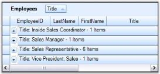
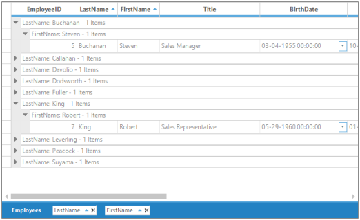
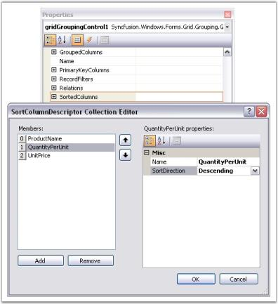
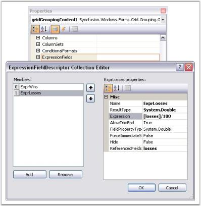
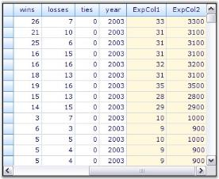
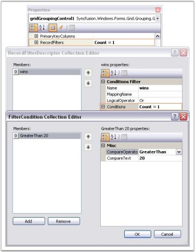
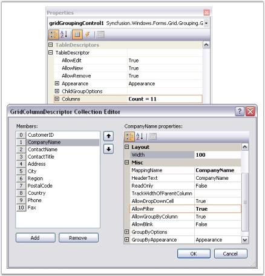
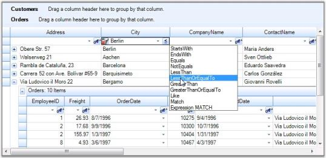
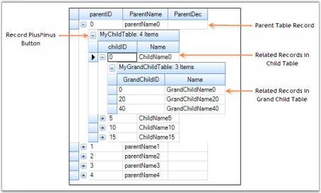

# Data Representation in Windows Forms GridGrouping

This section deals with different layouts supported by grid grouping control. These layouts help grouping grid to organize data display. For example, if you want to view the data arranged based on values of a specific field, then you can group data columns by the required field.

## Grouping

A Group represents a collection of records that belong to a category. Grid Grouping control allows the user to group data by one or more columns. When grouping is applied, data will be organized into a hierarchical structure based on the matching field values. Records having identical values in grouped column will be combined to form a group. Each group is identified by its GroupCaptionSection that can be expanded to bring underlying records into view. GroupCaptionSection carries information about a particular group like group name, number of items(records) in the group, etc. It also contains plus and minus buttons that allow the user to expand or collapse groups individually. By default, a grid table has one group.

### GroupedColumns Collection

GroupedColumns collection defines the fields to group by and the sort order. The collection can have multiple entries resulting in nested groups. GroupedColumns collection of grouping grid can be accessed via its TableDescriptor. The collection consists of various properties, methods, and events that allows the user to manage the elements in it.

#### Adding Data Groups

##### Simple Grouping

The data can be grouped by adding the column name to TableDescriptor.GroupedColumns property.


  
this.gridGroupingControl1.TableDescriptor.GroupedColumns.Add("Title");

 
Me.gridGroupingControl1.TableDescriptor.GroupedColumns.Add("Title")



The grid below displays data columns from the Employees Table grouped by the values of Title field.

  

By default, the grouping of a column sorts records in the ascending order of their GroupedColumn values. It is possible to specify the sort order while grouping. The code below arranges the data in the descending order of their Title field values.


 
this.gridGroupingControl1.TableDescriptor.GroupedColumns.Add("Title", ListSortDirection.Descending);
 
 
Me.gridGroupingControl1.TableDescriptor.GroupedColumns.Add("Title", ListSortDirection.Descending)



The screenshot below reflects this process.

  

When multiple tables are used in nested manner, a child table can also be grouped by getting access to 

GroupedColumns property of the desired ChildTableDescriptor. The code below shows this process.


  
this.gridGroupingControl1.TableDescriptor.Relations[0].ChildTableDescriptor.GroupedColumns.Add("CategoryName", ListSortDirection.Descending);

 
Me.gridGroupingControl1.TableDescriptor.Relations(0).ChildTableDescriptor.GroupedColumns.Add("CategoryName", ListSortDirection.Descending)



N> For more details, refer to the following browser sample:

> _&lt;Install Location&gt;\Syncfusion\EssentialStudio\[Version Number]\Windows\Grid.Grouping.Windows\Samples\2.0\Grouping\Grouping Demo_

##### Multi Column Grouping

Grid Grouping control provides built-in support to group the data by more than one column. It is as simple as adding the column names to the GroupedColumns collection. With multicolumn grouping, grouping grid organizes data in a hierarchical structure showing groups in different levels. In the image below, you see Employees data grouped by Title and Country columns.

 

N> For more details, refer to the following browser sample:

> _&lt;Install Location&gt;\Syncfusion\EssentialStudio\[Version Number]\Windows\Grid.Grouping.Windows\Samples\2.0\Grouping\Multi Column Grouping Demo_

### Grouping Through Designer

Grouping can also be done at design time. After binding dataset to the grouping grid, open TableDescriptor node in property grid of Grid Grouping control. In that, accessing GroupedColumns property will open SortColumnDescriptorCollection Editor. Clicking Add button will add an existing column from the dataset. By using drop down Name, you can change the column by which you want to group table data. You can also specify the sort order for that column by using SortDirection property.

The image below depicts this process.

  

### Using GroupDropArea

Table data can also be grouped simply by dragging the desired column header and dropping it into the GroupDropArea. Removing column header from the drop area will ungroup data. You can also change the grouping order by simple drag and drop action on column headers.

For more information on GroupDropArea, refer GroupDropArea.

### Preventing a Column from Grouping

To disallow a column being grouped, AllowGroupByColumn property should be set to False for that column. This property determines whether the grid can be grouped by a column when the user drags the column to GroupDropArea.


  
this.gridGroupingControl1.TableDescriptor.Columns[0].AllowGroupByColumn = false;

 
Me.gridGroupingControl1.TableDescriptor.Columns(0).AllowGroupByColumn = False


Clearing Groups

GroupedColumns.Clear() method will remove all the elements from GroupedColumns Collection and hence the data will get ungrouped.


 
this.gridGroupingControl1.TableDescriptor.GroupedColumns.Clear();
 
 
Me.gridGroupingControl1.TableDescriptor.GroupedColumns.Clear()



### Removing a given Group

GroupedColumns property provide two methods to remove a specific group from the collection. Remove() method deletes the column with a given name from GroupedColumns collection. As a result, the table data is ungrouped by that column. RemoveAt() method deletes the element at the specified index from the collection.


  

//Removes the first element.
this.gridGroupingControl1.TableDescriptor.GroupedColumns.RemoveAt(0);

//Removes the Title element from the columns collection.
this.gridGroupingControl1.TableDescriptor.GroupedColumns.Remove("Title");

 

'Removes the first element.
Me.gridGroupingControl1.TableDescriptor.GroupedColumns.RemoveAt(0)

'Removes the Title element from the columns collection.
Me.gridGroupingControl1.TableDescriptor.GroupedColumns.Remove("Title")



### GroupDropArea

GroupDropArea provides drop panel onto which the user can drag and drop the column headers to group table data by those columns. Its visibility can be controlled by ShowGroupDropArea property. Once it is set to true, a Drop Panel will be added at the top of the grouping grid.

Following code example illustrates how to enable Group Drop Area.


  
this.gridGroupingControl1.ShowGroupDropArea = true;

 
Me.gridGroupingControl1.ShowGroupDropArea = True



Here are runtime screens showing the effect of setting ShowGroupDropArea property.

  

  

  

  

  

#### Adding GroupDropArea

ShowGroupDropArea property will enable GroupDropArea only for the table at the top level. When nested tables are used, drop areas for the child tables need to be added at run time. It is achieved by calling AddGroupDropArea method, by specifying the respective child table name in its parameter.

In this example, the grid is bound to a hierarchical dataset containing three tables Categories, Products, and OrderDetails. The following code example illustrates how to add the group drop area for the child tables Products and OrderDetails.


  
//ShowGroupDropArea adds Group Drop Area for parent Categories table.
this.gridGroupingControl1.ShowGroupDropArea = true;

//Adds Group Drop Areas for nested tables.
this.groupingGrid1.AddGroupDropArea("Products");

this.groupingGrid1.AddGroupDropArea("OrderDetails");

 
'ShowGroupDropArea adds Group Drop Area for parent Categories table.
Me.gridGroupingControl1.ShowGroupDropArea = True

'Adds Group Drop Areas for nested tables.
Me.gridGroupingControl1.AddGroupDropArea("Products")
Me.gridGroupingControl1.AddGroupDropArea("OrderDetails")



Given below is a sample screenshot.

  

#### Customizing GroupDropArea

Grid Group Drop Area is made up of a collection of Grid controls packed in a panel named GroupDropPanel. A Splitter provides the insulation between Group Drop Panel and Grid Table Panel by using the size of Drop Panel that can be adjusted at run time. While formatting Group Drop Area, the user should take care of these controls too.

##### Properties affecting GroupDropArea

The table given below lists the properties that allow you to customize the look and feel of Grid Group Drop Area.

<table>
<tr>
<th>
PROPERTIES</th><th>
DESCRIPTION</th></tr>
<tr>
<td>
gridGroupingControl1.GridGroupDropArea</td><td>
Lists the properties and events to customize drop area.</td></tr>
<tr>
<td>
gridGroupingControl1.GroupDropPanel</td><td>
Lets the user to control drop panel behavior.</td></tr>
<tr>
<td>
gridGroupingControl1.Splitter</td><td>
Provides splitter related properties.</td></tr>
</table>

##### Example

In this example, grouping grid is built with hierarchical dataset created at runtime. The formatting of Group Drop Area can be controlled by handling PrepareViewStyleInfo event for each of the grids in Group Drop Panel.

1.Formatting Splitter and GroupDropPanel.


  

//Splitter Color.
this.gridGroupingControl1.Splitter.BackColor = Color.Red;

//Panel Color.
this.gridGroupingControl1.GroupDropPanel.BackColor = Color.YellowGreen;

 

'Splitter Color.

Private Me.gridGroupingControl1.Splitter.BackColor = Color.Red

'Panel Color.

Private Me.gridGroupingControl1.GroupDropPanel.BackColor = Color.YellowGreen



2.PrepareViewStyleInfo event for each of the grids can be hooked by looping through controls in the panel.


  

foreach (Control ctrl in this.gridGroupingControl1.GroupDropPanel.Controls)
{
    GridGroupDropArea groupDropArea = ctrl as GridGroupDropArea;

    switch (groupDropArea.Model.Table.TableDescriptor.Name)
    {

        case "ParentTable":
        groupDropArea.Model.ColCount = 80;
        groupDropArea.PrepareViewStyleInfo += new GridPrepareViewStyleInfoEventHandler(ParentTable_PrepareViewStyleInfo);
        break;

        case "ChildTable":
        groupDropArea.Model.ColCount = 80;
        groupDropArea.PrepareViewStyleInfo += new GridPrepareViewStyleInfoEventHandler(ChildTable_PrepareViewStyleInfo);
        break;
    }
}


 
Dim ctrl As Control

For Each ctrl In Me.gridGroupingControl1.GroupDropPanel.Controls
Dim groupDropArea As GridGroupDropArea = ctrl

Select Case groupDropArea.Model.Table.TableDescriptor.Name

Case "ParentTable"
groupDropArea.Model.ColCount = 80
AddHandler groupDropArea.PrepareViewStyleInfo, AddressOf ParentTable_PrepareViewStyleInfo

Case "ChildTable"
groupDropArea.Model.ColCount = 80
AddHandler groupDropArea.PrepareViewStyleInfo, AddressOf ChildTable_PrepareViewStyleInfo
End Select
Next ctrl



3.Setting the style properties in PrepareViewStyleInfo event.


 

private void ParentTable_PrepareViewStyleInfo(object sender, GridPrepareViewStyleInfoEventArgs e)
{

//Sets color to the text displaying table name.

    if (e.ColIndex == 2 && e.RowIndex == 2)
    {
        e.Style.Text = "ParentTable";
        e.Style.Font.Bold = true;
        e.Style.BackColor = Color.YellowGreen;
        e.Style.TextColor = Color.Blue;			
        e.Style.CellType = "Static";
        e.Style.HorizontalAlignment = GridHorizontalAlignment.Left;				
        e.Style.Enabled = false;
    }

//Sets color to the drop area.

    else if (e.Style.Text.StartsWith("Drag a"))
    {
        e.Style.Text = "Drag and Drop Parent Table Column headers";
        e.Style.BackColor = Color.White;
    }		

//Sets color to the dropped columns.

    else if (e.Style.Text.StartsWith("Par"))
    {
        e.Style.BackColor = Color.Tomato;				
        e.Style.Themed = false;
    }

//Sets color to the remaining part.

    else
    e.Style.BackColor = Color.YellowGreen;			
}

private void ChildTable_PrepareViewStyleInfo(object sender, GridPrepareViewStyleInfoEventArgs e)
{

//Sets color to the text displaying table name.

    if (e.ColIndex == 2 && e.RowIndex == 2)
    {
        e.Style.Text = "ChildTable ";
        e.Style.Font.Bold = true;
        e.Style.BackColor = Color.YellowGreen;
        e.Style.TextColor = Color.Yellow;	
        e.Style.CellType = "Static";
        e.Style.HorizontalAlignment = GridHorizontalAlignment.Left;				
        e.Style.Enabled = false;
    }

//Sets color to the drop area.

    else if (e.Style.Text.StartsWith("Drag a"))
    {
        e.Style.Text = "Drag and Drop Parent Table Column headers";
        e.Style.BackColor = Color.Orange;
        e.Style.TextColor = Color.White;
    }

//Sets color to the dropped columns.

    else if (e.Style.Text.StartsWith("Child"))
    {
        e.Style.BackColor = Color.Orange;
        e.Style.TextColor = Color.White;
        e.Style.Themed = false;
    }

//Sets color to the remaining part.

    else
    e.Style.BackColor = Color.YellowGreen;			
}
 

 

Private Sub ParentTable_PrepareViewStyleInfo(ByVal sender As Object, ByVal e As GridPrepareViewStyleInfoEventArgs)

'Sets color to the text displaying table name.

If e.ColIndex = 2 AndAlso e.RowIndex = 2 Then
e.Style.Text = "ParentTable"
e.Style.Font.Bold = True
e.Style.BackColor = Color.YellowGreen
e.Style.TextColor = Color.Blue
e.Style.CellType = "Static"
e.Style.HorizontalAlignment = GridHorizontalAlignment.Left
e.Style.Enabled = False

'Sets color to the drop area.

ElseIf e.Style.Text.StartsWith("Drag a") Then
e.Style.Text = "Drag and Drop Parent Table Column headers"
e.Style.BackColor = Color.White

'Sets color to the dropped columns.

ElseIf e.Style.Text.StartsWith("Par") Then
e.Style.BackColor = Color.Tomato
e.Style.Themed = False

'Sets color to the remaining part.

Else
e.Style.BackColor = Color.YellowGreen
End If
End Sub

Private Sub ChildTable_PrepareViewStyleInfo(ByVal sender As Object, ByVal e As GridPrepareViewStyleInfoEventArgs)

'Sets color to the text displaying table name.

If e.ColIndex = 2 AndAlso e.RowIndex = 2 Then
e.Style.Text = "ChildTable "

e.Style.Font.Bold = True
e.Style.BackColor = Color.YellowGreen
e.Style.TextColor = Color.Yellow
e.Style.CellType = "Static"
e.Style.HorizontalAlignment = GridHorizontalAlignment.Left
e.Style.Enabled = False

'Sets color to the drop area.

ElseIf e.Style.Text.StartsWith("Drag a") Then
e.Style.Text = "Drag and Drop Parent Table Column headers"
e.Style.BackColor = Color.Orange
e.Style.TextColor = Color.White

'Sets color to the dropped columns.

ElseIf e.Style.Text.StartsWith("Child") Then
e.Style.BackColor = Color.Orange
e.Style.TextColor = Color.White
e.Style.Themed = False

'Sets color to the remaining part.

Else
e.Style.BackColor = Color.YellowGreen
End If
End Sub



4.Here is a sample output.

  

#### Display GroupDropArea in Hierarchy

This feature allows users to display items in GroupDropArea in a hierarchical order. The items will follow a stacked order. Hierarchical grouping enables the following interactive features in GridGrouping control:

* Dynamically remove columns from grouping area.
* Switch tree line placement between top and bottom of hierarchy levels.
* Resize group drop area dynamically up to the last level of hierarchy.
* Set the tree lines with desired color.

<table>
<tr>
<th>
PROPERTIES </th><th>
DESCRIPTION </th><th>
TYPE </th><th>
DATA TYPE </th></tr>
<tr>
<td>
HierarchicalGroupDropArea</td><td>
Gets or sets a value to enable GroupDropArea hierarchy in the grid. </td><td>
Boolean </td><td>
Boolean, true/false</td></tr>
<tr>
<td>
GridGroupDropArea.AllowRemove</td><td>
Gets or sets whether GroupDropArea should support removal of groups dynamically.</td><td>
Boolean</td><td>
Boolean, true/false</td></tr>
<tr>
<td>
GridGroupDropArea.TreeLinePlacement</td><td>
Gets or sets the location for tree line, which will be drawn between hierarchy items.</td><td>
Enum</td><td>
enumeration</td></tr>
<tr>
<td>
GridGroupDropArea.DynamicResizing</td><td>
Gets or sets the value to resize GroupDropArea dynamically.</td><td>
Boolean</td><td>
Boolean, true/false</td></tr>
<tr>
<td>
GridGroupDropArea.TreeLineColor</td><td>
Gets or sets the color of tree lines.</td><td>
Color</td><td>
Color</td></tr>
</table>

##### Sample Link

{installed drive}\AppData\Local\Syncfusion\EssentialStudio\{version}\Windows\Grid.Grouping.Windows\

Samples\2.0\Grouping\GroupingDemo

##### Adding Hierarchical GroupDropArea to an Application 

To enable this feature, HierarchicalGroupDropArea property must be set to true.


  

this.gridGroupingControl1.HierarchicalGroupDropArea = true;   

 
Me.gridGroupingControl1.HierarchicalGroupDropArea = True
 


To enable other features supported within hierarchical GroupDropArea, the following properties can be used:


  

//Supports dynamic removal of the column from being grouped (adds support in default GroupDropArea too).
this.gridGroupingControl1. GridGroupDropArea.AllowRemove = true;

//Supports switching tree line placement to the top and bottom between hierarchy levels.
this.gridGroupingControl1.GridGroupDropArea.TreeLinePlacement = TreeLinePlacement.Bottom;

//Supports resizing GroupDropArea dynamically up to the last level of the hierarchy.
this.gridGroupingControl1.GridGroupDropArea.DynamicResizing = true;

//Supports setting tree lines to a desired color.
this_.gridGroupingControl1.GridGroupDropArea.TreeLineColor = Color.Red;_   



 

'Supports dynamic removal of the column from being grouped (adds support in default GroupDropArea too).
Me.gridGroupingControl1.GridGroupDropArea.AllowRemove = True

 'Supports switching tree tree line placement to the top and bottom between hierarchy levels.
Me.gridGroupingControl1.GridGroupDropArea.TreeLinePlacement = TreeLinePlacement.Bottom

'Supports resizing GroupDropArea dynamically up to the last level of the hierarchy.
Me.gridGroupingControl1.GridGroupDropArea.DynamicResizing = True

'Supports setting tree lines to a desired color.
Me.gridGroupingControl1.GridGroupDropArea.TreeLineColor = Color.Red 
 


 

#### Aligning the GroupDropArea

By default, GroupDropArea is displayed at the top of the Grid Grouping control. With GroupDropAreaAlignment property, you can align it at the bottom, left, or right of the Grid Grouping control.

N> For GroupDropAreaAlignment property to take effect, HierarchicalGroupDropArea property must be set to false.


  

//Top alignment for GroupDropArea.
this.gridGroupingControl1.GroupDropAreaAlignment = GridGroupDropAreaAlignment.Top;

//Left alignment for GroupDropArea.
this.gridGroupingControl1.GroupDropAreaAlignment = GridGroupDropAreaAlignment.Left;

//Bottom alignment for GroupDropArea.
this.gridGroupingControl1.GroupDropAreaAlignment = GridGroupDropAreaAlignment.Bottom;

//Right alignment for GroupDropArea.
this.gridGroupingControl1.GroupDropAreaAlignment = GridGroupDropAreaAlignment.Right;

 

'Top alignment for GroupDropArea.
Me.gridGroupingControl1.GroupDropAreaAlignment = GridGroupDropAreaAlignment.Top;

'Left alignment for GroupDropArea.
Me.gridGroupingControl1.GroupDropAreaAlignment = GridGroupDropAreaAlignment.Left;

'Bottom alignment for GroupDropArea.
Me.gridGroupingControl1.GroupDropAreaAlignment = GridGroupDropAreaAlignment.Bottom;

'Right alignment for GroupDropArea.
Me.gridGroupingControl1.GroupDropAreaAlignment = GridGroupDropAreaAlignment.Right;



The following screen shot shows GroupDropArea positioned at the top of Grid Grouping control.

 

The following screen shot shows GroupDropArea positioned at the left of Grid Grouping control.

  

 GroupDropArea aligned at the Left
 {:.caption}

The following screen shot shows GroupDropArea positioned at the bottom of Grid Grouping control.

 

The following screen shot shows GroupDropArea positioned at the right of Grid Grouping control.

  

For more information on setting the alignment of GroupDropArea, see 

&lt;Installed Location&gt;\Syncfusion\EssentialStudio\&lt;Version&gt;\Windows\Grid.Grouping.Windows\

Samples\Grouping\Grouping Demo.

### GroupByOptions

Grid Grouping control provides a number of options that allows you to control the look and behavior of the groups. You can control the caption text, where and if AddNew row will be displayed and whether captions, headers, footers, preview rows and summaries will be displayed.

#### GridGroupOptionsStyleInfo class

GridGroupOptionsStyleInfo class derives StyleInfoBase and defines the properties to control the look and feel of the groups. A grouping grid distinguishes between three different kinds of group options listed below.

<table>
<tr>
<th>
GROUP OPTION</th><th>
DESCRIPTION</th></tr>
<tr>
<td>
TopLevelGroupOptions</td><td>
Lets you control the look and behavior of top level group.</td></tr>
<tr>
<td>
ChildGroupOptions</td><td>
Lets you control the look and behavior of child groups.</td></tr>
<tr>
<td>
NestedTableGroupOptions</td><td>
Lets you control the look and behavior of groups in nested child relations.</td></tr>
</table>

#### Properties of Group Options

The table below describes the properties defined in the GridGroupOptionsStyleInfo class. These properties are available for all kinds of Group Options.

<table>
<tr>
<th>
GROUP OPTIONS</th><th>
DESCRIPTION</th></tr>
<tr>
<td>
CaptionText</td><td>
Lets you control the caption text that is displayed.</td></tr>
<tr>
<td>
ShowCaption</td><td>
Indicates whether a caption row is visible.</td></tr>
<tr>
<td>
ShowCaptionPlusMinus</td><td>
Indicates whether a plus/minus cell is to be displayed next to the caption.</td></tr>
<tr>
<td>
ShowAddNewBeforeDetails</td><td>
When true, AddNew record is shown at the top of a group.</td></tr>
<tr>
<td>
ShowAddNewAfterDetails</td><td>
When true, AddNew record is shown at the bottom of a group.</td></tr>
<tr>
<td>
ShowColumnHeaders</td><td>
Indicates whether the column headers are visible.</td></tr>
<tr>
<td>
ShowEmptyGroups</td><td>
Indicates whether a preview is visible when the group is collapsed.</td></tr>
<tr>
<td>
ShowGroupHeader</td><td>
Indicates whether a header is visible.</td></tr>
<tr>
<td>
ShowGroupFooter</td><td>
Indicates whether a footer is visible.</td></tr>
<tr>
<td>
ShowGroupPreview</td><td>
Indicates whether a preview is visible when the group is collapsed.</td></tr>
<tr>
<td>
ShowSummaries</td><td>
Indicates whether summaries are visible.</td></tr>
<tr>
<td>
ShowGroupSummaryWhenCollapsed</td><td>
Indicates whether summary items are visible when the group is collapsed.</td></tr>
<tr>
<td>
ShowFilterBar</td><td>
Indicates whether a filter bar is visible.</td></tr>
<tr>
<td>
ShowStackedHeaders</td><td>
Indicates whether the stacked headers are visible.</td></tr>
<tr>
<td>
ShowGroupIndentAsCoveredRange</td><td>
Indicates whether to treat all indent cells for a group as a single covered cell.</td></tr>
<tr>
<td>
ShowCaptionSummaryCells</td><td>
Indicates whether a group caption should display summaries in columns instead of only one large caption bar.</td></tr>
</table>
Next chapter in this section discuss these properties in detail with a suitable example.

#### Working with Group Elements

This section explores various properties that can be used to manipulate different group elements.

##### Group Headers and Footers

The headers and footers of a group can be used to display any information that is common to all elements of that group. You can toggle the display of these headers and footers by using the boolean properties given below.

* &lt;GroupOptions&gt;.ShowGroupHeader
* &lt;GroupOptions&gt;.ShowGroupFooter

where &lt;GroupOptions&gt; can be any one of the following: TopLevelGroupOptions to affect only the top most group, ChildGroupOptions to affect the child groups, or NestedTableGroupOptions to affect the groups in nested tables.

You can also set header and footer attributes such as HeaderSectionHeight and FooterSectionHeight by using the properties given below.

* TableOptions.GroupHeaderSectionHeight
* TableOptions.GroupFooterSectionHeight

Group headers and footers can be populated by handling QueryCellStyleInfo event wherein you can check Header and Footer cell types and provide the data.

 

##### GroupPreviewRows

GroupPreviewSection is the suitable place when you want to display memo fields or add custom notes for a given group. It can be enabled by setting &lt;GroupOptions&gt;.ShowGroupPreview property to True. You can adjust the size of preview row through TableOptions.GroupPreviewSectionHeight property. QueryCellStyleInfo event can be used to populate preview rows.

  

##### AddNew Records

Each group can optionally have an AddNew row where you can provide the values for a new record. Once a new record is entered, the record will be sorted into the existing record set and will be assigned a group's category automatically. The visibility of the AddNewRecord can be controlled through the following two boolean properties.

* &lt;GroupOptions&gt;.ShowAddNewRecordBeforeDetails - adds the AddNew row at the top of a group.
* &lt;GroupOptions&gt;.ShowAddNewRecordAfterDetails - adds the AddNew row at the bottom of a group.

  

##### GroupCaptionSection

This is the first section within a group that provides a caption bar above column headers. GroupCaptionRows are unbound rows that are created only to combine records into a group. By default, they display group category and the number of items in that group. The following properties can be used to control CaptionSection display.

* &lt;GroupOptions&gt;.ShowCaption - enables the display of caption section; True by default. 
* &lt;GroupOptions&gt;.CaptionText - used to get and set caption text.

  

##### CaptionText Tokens

The following table lists the available token formats for &lt;GroupOptions&gt;.CaptionText.

<table>
<tr>
<th>
TOKEN</th><th>
DESCRIPTION</th></tr>
<tr>
<td>
{TableName}</td><td>
Displays the CaptionSection.ParentTableDescriptor.Name.</td></tr>
<tr>
<td>
{CategoryName}</td><td>
Displays the CaptionSection.ParentGroup.Name.</td></tr>
<tr>
<td>
{CategoryCaption}</td><td>
Displays the Header Text of the column that this group belongs to.</td></tr>
<tr>
<td>
{Category}</td><td>
Displays the CaptionSection.ParentGroup.Category.</td></tr>
<tr>
<td>
{RecordCount}</td><td>
Displays the CaptionSection.ParentGroup.GetFilteredRecordCount().</td></tr>
<tr>
<td>
Summary Tokens</td><td>
Allows you to display any item you enter as a Summary Column. See discussion below.</td></tr>
</table>

##### Custom Summary Tokens 

Any summary item you add can be included in the CaptionText and you have the option of hiding summaries; so it is possible to add summaries only for the purpose of displaying values in the CaptionText. If you have added a summary row named Row1 and a summary column named Column1, then you can also use the value of this summary item in the caption with the token {Row1.Column1}. 

##### Example

Here is a sample implementation that illustrates usage of the above properties.

1.Set up a Grid Grouping control and bind a data source into it.
2.Setup the necessary Group Options as required.


  

//Group Options Setting.
this.gridGroupingControl1.ShowGroupDropArea = true;
this.gridGroupingControl1.TopLevelGroupOptions.ShowGroupHeader = true;
this.gridGroupingControl1.TopLevelGroupOptions.ShowGroupFooter = true;
this.gridGroupingControl1.TopLevelGroupOptions.ShowCaption = true;
this.gridGroupingControl1.TopLevelGroupOptions.ShowGroupPreview = true;
this.gridGroupingControl1.ChildGroupOptions.ShowGroupPreview = true;
this.gridGroupingControl1.TableOptions.GroupFooterSectionHeight = 30;
this.gridGroupingControl1.TableOptions.GroupHeaderSectionHeight = 30;
this.gridGroupingControl1.TableOptions.GroupPreviewSectionHeight = 25;
this.gridGroupingControl1.TopLevelGroupOptions.ShowAddNewRecordBeforeDetails = true;
this.gridGroupingControl1.TopLevelGroupOptions.ShowAddNewRecordAfterDetails = true;
this.gridGroupingControl1.ChildGroupOptions.CaptionText = "There are {RecordCount} items under {CategoryName} : {Category}";

 

'Group Options Setting.
Me.gridGroupingControl1.ShowGroupDropArea = True
Me.gridGroupingControl1.TopLevelGroupOptions.ShowGroupHeader = True
Me.gridGroupingControl1.TopLevelGroupOptions.ShowGroupFooter = True
Me.gridGroupingControl1.TopLevelGroupOptions.ShowCaption = True
Me.gridGroupingControl1.TopLevelGroupOptions.ShowGroupPreview = True
Me.gridGroupingControl1.ChildGroupOptions.ShowGroupPreview = True
Me.gridGroupingControl1.TableOptions.GroupFooterSectionHeight = 30
Me.gridGroupingControl1.TableOptions.GroupHeaderSectionHeight = 30
Me.gridGroupingControl1.TableOptions.GroupPreviewSectionHeight = 25
Me.gridGroupingControl1.TopLevelGroupOptions.ShowAddNewRecordBeforeDetails = True
Me.gridGroupingControl1.TopLevelGroupOptions.ShowAddNewRecordAfterDetails = True
Me.gridGroupingControl1.ChildGroupOptions.CaptionText = "There are {RecordCount} items under {CategoryName} : {Category}"



3.Handle the QueryCellStyleInfo event to manipulate the group elements.


  
this.gridGroupingControl1.QueryCellStyleInfo += new GridTableCellStyleInfoEventHandler(gridGroupingControl1_QueryCellStyleInfo);
void gridGroupingControl1_QueryCellStyleInfo(object sender, GridTableCellStyleInfoEventArgs e)
{

    if (e.TableCellIdentity.TableCellType == GridTableCellType.GroupFooterSectionCell || e.TableCellIdentity.TableCellType == GridTableCellType.GroupHeaderSectionCell)
    {
        e.Style.Enabled = false;

        if (e.TableCellIdentity.TableCellType == GridTableCellType.GroupFooterSectionCell)
        e.Style.Text = "The details in the footer can be placed by enabling ShowGroupFooter and handling QueryCellStyleInfo";

        if (e.TableCellIdentity.TableCellType == GridTableCellType.GroupHeaderSectionCell)
        e.Style.Text = "The details in the header can be placed by enabling ShowGroupHeader and handling QueryCellStyleInfo";
    }

    if (e.TableCellIdentity.TableCellType == GridTableCellType.GroupPreviewCell)
    {
        Element el = e.TableCellIdentity.DisplayElement;
        e.Style.CellValue = "Preview notes for Group (" + el.ParentGroup.Name + ": " + el.ParentGroup.Category.ToString() + ")";
    }
}

 

Private Sub gridGroupingControl1_QueryCellStyleInfo(ByVal sender As Object, ByVal e As GridTableCellStyleInfoEventArgs) Handles gridGroupingControl1.QueryCellStyleInfo

If e.TableCellIdentity.TableCellType = GridTableCellType.GroupFooterSectionCell OrElse e.TableCellIdentity.TableCellType = GridTableCellType.GroupHeaderSectionCell Then
e.Style.Enabled = False

If e.TableCellIdentity.TableCellType = GridTableCellType.GroupFooterSectionCell Then
e.Style.Text = "The details in the footer can be placed by enabling ShowGroupFooter and handling QueryCellStyleInfo"
End If

If e.TableCellIdentity.TableCellType = GridTableCellType.GroupHeaderSectionCell Then
e.Style.Text = "The details in the header can be placed by enabling ShowGroupHeader and handling QueryCellStyleInfo"
End If
End If

If e.TableCellIdentity.TableCellType = GridTableCellType.GroupPreviewCell Then
Dim el As Element = e.TableCellIdentity.DisplayElement
e.Style.CellValue = "Preview notes for Group (" & el.ParentGroup.Name & ": " & el.ParentGroup.Category.ToString() & ")"
End If
End Sub



4.You can control the appearance of different group elements by using Appearance property.


  
this.gridGroupingControl1.Appearance.AddNewRecordFieldCell.Interior = new BrushInfo(Color.FromArgb(255, 255, 192));
this.gridGroupingControl1.Appearance.GroupCaptionCell.Interior = new BrushInfo(SystemColors.Control);
this.gridGroupingControl1.Appearance.GroupCaptionCell.TextColor = Color.FromArgb(192, 64, 0);
this.gridGroupingControl1.Appearance.GroupFooterSectionCell.Interior = new BrushInfo(Color.Pink);
this.gridGroupingControl1.Appearance.GroupHeaderSectionCell.Interior = new BrushInfo(Color.Pink);
this.gridGroupingControl1.Appearance.GroupIndentCell.Interior = new BrushInfo(Color.FromArgb(192, 192, 255));
this.gridGroupingControl1.Appearance.GroupPreviewCell.Interior = new BrushInfo(Color.FromArgb(192, 255, 192));

 
Me.gridGroupingControl1.Appearance.AddNewRecordFieldCell.Interior = New BrushInfo(Color.FromArgb(255, 255, 192))
Me.gridGroupingControl1.Appearance.GroupCaptionCell.Interior = New BrushInfo(SystemColors.Control)
Me.gridGroupingControl1.Appearance.GroupCaptionCell.TextColor = Color.FromArgb(192, 64, 0)
Me.gridGroupingControl1.Appearance.GroupFooterSectionCell.Interior = New BrushInfo(Color.Pink)
Me.gridGroupingControl1.Appearance.GroupHeaderSectionCell.Interior = New BrushInfo(Color.Pink)
Me.gridGroupingControl1.Appearance.GroupIndentCell.Interior = New BrushInfo(Color.FromArgb(192, 192, 255))
Me.gridGroupingControl1.Appearance.GroupPreviewCell.Interior = New BrushInfo(Color.FromArgb(192, 255, 192))



5.Run the sample and group the table against any data column. Here is a sample screen shot that shows the grouped grid against 'Sport' column.

 

N> For more details, refer to the following browser samples:

* _&lt;Install Location&gt;\Syncfusion\EssentialStudio\[Version Number]\Windows\Grid.Grouping.Windows\Samples\Grouping Grid Options\Top-Level-Group Options Demo_
* _&lt;Install Location&gt;\Syncfusion\EssentialStudio\[Version Number]\Windows\Grid.Grouping.Windows\Samples\Grouping Grid Options\Child-Group Options Demo_
* _&lt;Install Location&gt;\Syncfusion\EssentialStudio\[Version Number]\Windows\Grid.Grouping.Windows\Samples\Grouping Grid Options\Nested-Table Group Options Demo_

#### Working with Groups

This section best demonstrates how to work with group rows and also shows how the groups are organized into a grouping grid. Grouping Grid architecture can be viewed as a binary where different grid elements like group rows, summary rows, filter rows, etc. form the nodes of the tree having data records at the bottom as leaf nodes. A group can be a final node with records or it can be a node with nested groups rooting a sub tree.

This lesson will guide you on the ways to access individual groups in a collection, to retrieve all the groups, to expand or collapse groups, and will discuss some of the properties and events used to process groups.

##### Expanding or Collapsing Groups

All the groups can be expanded as well as collapsed at once by calling the respective methods, Table.ExpandAllGroups and Table.CollapseAllGroups. To expand or collapse a specific group, set Group.IsExpanded property to true or false respectively. Following code example illustrates this.


  

//Expands all groups.
this.gridGroupingControl1.Table.ExpandAllGroups();

//Collapses all groups.
this.gridGroupingControl1.Table.CollapseAllGroups();

//Expands the group with index 3.
this.gridGroupingControl1.Table.TopLevelGroup.Groups[3].IsExpanded = true;

//Collapses the group with index 4.
this.gridGroupingControl1.Table.TopLevelGroup.Groups[4].IsExpanded = false;

 

'Expands all groups.
Me.gridGroupingControl1.Table.ExpandAllGroups()

'Collapses all groups.
Me.gridGroupingControl1.Table.CollapseAllGroups()

'Expands the group with index 3.
Me.gridGroupingControl1.Table.TopLevelGroup.Groups(3).IsExpanded = True

'Collapses the group with index 4.
Me.gridGroupingControl1.Table.TopLevelGroup.Groups(4).IsExpanded = False



Accessing a Given Group

Table.TopLevelGroup.Groups collection maintains details of individual groups in this collection that can be used to retrieve the details of any group. The code below lets you access details of a group with the category ‘Sport’. It also defines a method named IterateGroup that is used to iterate through the records and also the nested groups in a given group. It provides you with group details such as the level of the group, number of items in that group, its category, and so on.

Accessing all the groups

Table.TopLevelGroup is the topmost group in a grouping grid. It forms the root node of the group hierarchy where its categorized records and nested groups form the child nodes. To access all the groups, you can make use of the same IterateThrough method by passing TopLevelGroup as the method parameter. Then this method will loop through categorized records and nested groups of the top level group and will print details of all the groups.


  

//Calls IterateThrough method for a given group.
Group g = this.gridGroupingControl1.Table.TopLevelGroup.Groups["Sport"];
IterateGroup(g);

//Calls IterateThrough method for all the groups in a grid table.
IterateGroup(this.gridGroupingControl1.Table.TopLevelGroup);

//IterateThrough method iterates through records and nested groups.

public void IterateThrough(Group g)
{
    System.Diagnostics.Trace.WriteLine("GroupLevel = "+g.GroupLevel);
    System.Diagnostics.Trace.WriteLine(g.Info);

    foreach(Record r in g.Records)
    {
        System.Diagnostics.Trace.WriteLine(r.Info);
    }

    foreach(Group gr in g.Groups)
    {
        IterateGroup(gr);
    }
}



'Calls IterateThrough method for a given group.
Dim g As Group
g = Me.gridGroupingControl1.Table.TopLevelGroup.Groups("Sport")
IterateThrough(g)

'Calls IterateThrough method for all the groups in a grid table.
IterateThrough(Me.gridGroupingControl1.Table.TopLevelGroup)

'IterateThrough method iterates through the records and nested groups.

Public Sub IterateThrough(ByVal g As Group)
System.Diagnostics.Trace.WriteLine("GroupLevel = "+ g.GroupLevel.ToString())
System.Diagnostics.Trace.WriteLine(g.Info)

For Each r As Record In g.Records
System.Diagnostics.Trace.WriteLine(r.Info)
Next r

For Each gr As Group In g.Groups
IterateThrough(gr)
Next gr
End Sub
 


Accessing the group for a given record

It is the grid.Table object that provides access to the records and the grouped elements. The Table.Records collection returns a read only collection of the data records. The following code can be used to get access to the group for a particular record. Record.ParentGroup property is used to obtain the group that a record belongs to.


  
System.Diagnostics.Trace.WriteLine(this.gridGroupingControl1.Table.Records[3].ParentGroup.Info);

 
System.Diagnostics.Trace.WriteLine(Me.gridGroupingControl1.Table.Records(3).ParentGroup.Info)



#### Events

This section discusses some of the important events that could be handled to catch grouping actions. Below is a list of such events.

<table>
<tr>
<th>
EVENT</th><th>
DESCRIPTION</th></tr>
<tr>
<td>
GroupedColumns_Changing</td><td>
Occurs before a property in the collection is changed.</td></tr>
<tr>
<td>
GroupedColumns_Changed</td><td>
Occurs after a property in the collection is changed.</td></tr>
<tr>
<td>
GroupExpanding</td><td>
Occurs before a group is expanded.</td></tr>
<tr>
<td>
GroupExpanded</td><td>
Occurs after a group is expanded.</td></tr>
<tr>
<td>
GroupCollapsing</td><td>
Occurs before a group is collapsed.</td></tr>
<tr>
<td>
GroupCollapsed</td><td>
Occurs after a group is collapsed.</td></tr>
<tr>
<td>
SortingItemsInGroup</td><td>
Occurs before the records for a group are sorted.</td></tr>
<tr>
<td>
SortedItemsInGroup</td><td>
Occurs after the records for a group are sorted.</td></tr>
</table>

##### Example

The GroupedColumns Changing/Changed events get fired when the list is modified i.e. when any item is added, removed, or modified. It accepts an argument of type ListPropertyChangedEventArgs that lets you check the reason for a list change. The reason could be ItemAdded, ItemInserted, ItemRemoved, ItemModified, ItemMoved, ItemPropertyChanged, or the whole collection is modified.

The following code examples show you how to capture the events. 


  

//Subscribes to the events.
this.gridGroupingControl1.TableDescriptor.GroupedColumns.Changing += new ListPropertyChangedEventHandler(GroupedColumns_Changing);
this.gridGroupingControl1.TableDescriptor.GroupedColumns.Changed += new ListPropertyChangedEventHandler(GroupedColumns_Changed);

//Event Handlers.

//GroupedColumns_Changing event.
void GroupedColumns_Changing(object sender, ListPropertyChangedEventArgs e)
{
SortColumnDescriptor sortColumnDescriptor = e.Item as SortColumnDescriptor;

if (e.Action == Syncfusion.Collections.ListPropertyChangedType.Insert)
Console.WriteLine("Column Added - {0}", sortColumnDescriptor.Name);
}

//GroupedColumns_Changed event.
void GroupedColumns_Changed(object sender, ListPropertyChangedEventArgs e)
{
SortColumnDescriptor sortColumnDescriptor = e.Item as SortColumnDescriptor;

if (e.Action == Syncfusion.Collections.ListPropertyChangedType.Remove)
Console.WriteLine("Column Removed - {0}", sortColumnDescriptor.Name);
}

 

'Subscribes to the events.
AddHandler gridGroupingControl1.TableDescriptor.GroupedColumns.Changing, AddressOf GroupedColumns_Changing

'Event Handlers.

'GroupedColumns_Changing event.

Private Sub GroupedColumns_Changed(ByVal sender As Object, ByVal e As ListPropertyChangedEventArgs)
Dim sortColumnDescriptor As SortColumnDescriptor = CType(e.Item, SortColumnDescriptor)

If e.Action = ListPropertyChangedType.Insert Then
Console.WriteLine("Column Added - {0}" + sortColumnDescriptor.Name)
End If
End Sub

'GroupedColumns_Changed event.

Private Sub GroupedColumns_Changing(ByVal sender As Object, ByVal e As ListPropertyChangedEventArgs)
Dim sortColumnDescriptor As SortColumnDescriptor = CType(e.Item, SortColumnDescriptor)

If e.Action = ListPropertyChangedType.Remove Then
Console.WriteLine("Column Removed - {0}" + sortColumnDescriptor.Name)
End If
End Sub



GroupExpanding/GroupExpanded and GroupCollapsing/GroupCollapsed event handlers are best to use when you want to do some actions as a result of the group operations, GroupExpand, and GroupCollapse.

The SortingItemsInGroup and SortedItemsInGroup events are raised when the records for a group are sorted. The grid should have at least one group for these events to occur. It does have no relationship with normal sorting. It occurs only when a grouped column is sorted.

##### Tracking the changes in Nested Table

It is possible to get notified of the changes in table descriptors other than the default table. This can be achieved by listening to Engine.PropertyChanging event and using GetNestedChildTableDescriptorEvent method. This method lets you get information about a change in the table descriptor of the nested child table. For example, when a column is changed in a nested table, the above method allows you to get details such as table descriptor of the affected table and the original EventArgs which was raised in response to the column changes (eg. ColumnsChanged event). Once you have the event data, you can check whether just the width of the column was changed or if other settings were also changed.

Following code example illustrates the usage of this method.


  

protected override void Engine_PropertyChanging(object sender, DescriptorPropertyChangedEventArgs e)
{

if (e.PropertyName == "TableDescriptor")
{
TableDescriptor tableDescriptor = ((Engine) sender).TableDescriptor;
e = (DescriptorPropertyChangedEventArgs) e.Inner;

if (e.PropertyName == "Relations")
e = e.GetNestedChildTableDescriptorEvent(ref tableDescriptor);

if (e.PropertyName == "Columns")
{
ListPropertyChangedEventArgs listEventArgs = (ListPropertyChangedEventArgs) e.Inner;

if (listEventArgs.Action == ListPropertyChangedType.ItemPropertyChanged)
{

if (listEventArgs.Property == "Appearance" || listEventArgs.Property == "Width"
|| listEventArgs.Property == "ReadOnly" || listEventArgs.Property == "HeaderText"
|| listEventArgs.Action == ListPropertyChangedType.Remove
|| listEventArgs.Action == ListPropertyChangedType.Move
|| listEventArgs.Property == "AllowFilter")
{
return;
}
}
}
}

else if (e.PropertyName == "Appearance")
{

//Base class will end edit mode, which is not necessary.
return;
}
base.Engine_PropertyChanging (sender, e);
}

 

Protected Overrides Sub Engine_PropertyChanging(ByVal sender As Object, ByVal e As DescriptorPropertyChangedEventArgs)

If e.PropertyName = "TableDescriptor" Then
Dim tableDescriptor As TableDescriptor = (CType(sender, Engine)).TableDescriptor
e = CType(e.Inner, DescriptorPropertyChangedEventArgs)

If e.PropertyName = "Relations" Then
e = e.GetNestedChildTableDescriptorEvent(tableDescriptor)
End If

If e.PropertyName = "Columns" Then
Dim listEventArgs As ListPropertyChangedEventArgs = CType(e.Inner, ListPropertyChangedEventArgs)

If listEventArgs.Action = ListPropertyChangedType.ItemPropertyChanged Then

If listEventArgs.Property = "Appearance" OrElse listEventArgs.Property = "Width" OrElse listEventArgs.Property = "ReadOnly" OrElse listEventArgs.Property = "HeaderText" OrElse listEventArgs.Action = ListPropertyChangedType.Remove OrElse listEventArgs.Action = ListPropertyChangedType.Move OrElse listEventArgs.Property = "AllowFilter" Then
Return
End If
End If
End If

ElseIf e.PropertyName = "Appearance" Then

'Base class will end edit mode, which is not necessary.
Return
End If
MyBase.Engine_PropertyChanging(sender, e)
End Sub



#### Freezing the Caption Row

Grid Grouping control provides support to freeze Caption Row to make sure it stays visible while scrolling content to the left or right. With FreezeCaption property, you can freeze or unfreeze the Caption Row in the Grid Grouping control. A frozen Caption Cell belongs to the GroupCaptionCell Cell Type. Visual Style of the Caption Cell Type is based on Visual Style of Grid Grouping control. Caption Cell text can be changed according to user requirements.


 
this.gridGroupingControl.FreezeCaption = true
 
 
Me.gridGroupingControl.FreezeCaption = True



 

  

To view a sample on Freezing the Caption Row, see &lt;Installed Location&gt;\Syncfusion\EssentialStudio

\&lt;Version&gt;\Windows\Grid.Grouping.Windows\Samples\Grouping\Grouping Demo

## Sorting

Grid Grouping control allows you to sort table data against one or more columns. The number of columns by which data can be sorted is unlimited. When sorting is applied, grid will rearrange data to match the current sort criteria.

#### SortedColumns Collection

SortedColumns collection defines the sort order for records within groups. Multiple entries can be added with the first entry having precedence while sorting records. The properties and methods in this collection lets you manage elements in the collection. The collection can be viewed as a set of SortColumnDescriptors, one for every column against which the data is sorted. SortColumnDescriptor of a field contains details like the name of a field, sort direction, and optionally a custom comparer and categorization object. The custom comparer and categorizer will allow you to customize sorting.

### Sorting Methods

There are multiple ways to sort table data. A simple one is to click the desired column headers that needs to be sorted. Once sorting is applied, the grid will display a sort icon in the respective column headers showing sort direction. Sorting can also be done against multiple columns by holding Ctrl key and clicking on the desired column headers.

### Through Designer

At design time, data can be sorted by accessing SortedColumns property under TableDescriptor section in the property grid of Grid Grouping control. This will open SortColumnDescriptorCollection Editor. In that Editor, clicking Add button will add existing columns into the collection. Name and SortDirection in the property window of the editor will let you specify your desired field name to sort and the sort order. The image given below illustrates this process.

  

### Programmatic Sorting

Sorting can be applied to the grid data by specifying the desired field name to the TableDescriptor.SortedColumns.Add() method.


  
this.gridGroupingControl1.TableDescriptor.SortedColumns.Add("ProductName");

 
Me.gridGroupingControl1.TableDescriptor.SortedColumns.Add("ProductName")



Multicolumn Sorting can be achieved by adding field names into SortedColumns property and optionally specifying sort direction. The following code example sorts data by ProductName and UnitPrice in ascending Order and by column Quantity in descending Order.


  
this.gridGroupingControl1.TableDescriptor.SortedColumns.Add("ProductName", ListSortDirection.Ascending);
this.gridGroupingControl1.TableDescriptor.SortedColumns.Add("QuantityPerUnit", ListSortDirection.Descending);
this.gridGroupingControl1.TableDescriptor.SortedColumns.Add("UnitPrice", ListSortDirection.Ascending);

 
Me.gridGroupingControl1.TableDescriptor.SortedColumns.Add("ProductName", ListSortDirection.Ascending)
Me.gridGroupingControl1.TableDescriptor.SortedColumns.Add("QuantityPerUnit", ListSortDirection.Descending)
Me.gridGroupingControl1.TableDescriptor.SortedColumns.Add("UnitPrice", ListSortDirection.Ascending)



Here is a sample output. To indicate sort direction, a sort icon will be displayed in the column headers. When multicolumn sorting is applied, an index number will be displayed in the column headers along with sort icon that facilitates sort order. In the example below, the order of sorting would be ProductName(0), Quantity(1) and then UnitPrice(2). 

  

N> For more details, refer to the following browser sample:

> _&lt;Install Location&gt;\Syncfusion\EssentialStudio\[Version Number]\Windows\Grid.Grouping.Windows\Samples\Sorting\Multi Column Sorting Demo_

#### Sorting By Display Member

Grid Grouping control sorts the grid based on Value member of the grid data, by default. The user can also sort grid data by Display members of foreign-key combo boxes by setting up a foreign-key reference relation between related tables. 

N> A foreign-key reference relation allows the user to look up values in a related table using an id column in the main table.

The following code example illustrates the usage of foreign-key relation:

1.Save the location of the mainTable.Customer column, so that it can be swapped after foreign table reference has been set.


  
GridTableDescriptor td = this.gridGroupingControl1.TableDescriptor; td.VisibleColumns.LoadDefault();
int lookUpIndex = td.VisibleColumns.IndexOf("Customer");

 
Dim td As GridTableDescriptor = Me.gridGroupingControl1.TableDescriptor
td.VisibleColumns.LoadDefault()
Dim lookUpIndex As Integer = td.VisibleColumns.IndexOf("Customer")



2.Add foreign table to the Engine's source list.


 
this.gridGroupingControl1.Engine.SourceListSet.Add(ForeignTableName, ForeignTable.DefaultView);

 
Me.gridGroupingControl1.Engine.SourceListSet.Add(ForeignTableName, ForeignTable.DefaultView)



3.Create and setup RelationKind.ForeignKeyReference relation. 


  
GridRelationDescriptor rd = new GridRelationDescriptor();
rd.Name = "CustomerColDisplay";
rd.RelationKind = RelationKind.ForeignKeyReference;
rd.ChildTableName = ForeignTableName;

 
Dim rd As GridRelationDescriptor = New GridRelationDescriptor()
rd.Name = "CustomerColDisplay"
rd.RelationKind = RelationKind.ForeignKeyReference
rd.ChildTableName = ForeignTableName



4.Set any optional properties on the relation. 


  
//Displays column.     
rd.ChildTableDescriptor.VisibleColumns.Add("CustomerName");

//Sorts it for dropdown display.
rd.ChildTableDescriptor.SortedColumns.Add("CustomerName");

 

'Displays column.    
rd.ChildTableDescriptor.VisibleColumns.Add("CustomerName")

'Sorts it for dropdown display. 
rd.ChildTableDescriptor.SortedColumns.Add("CustomerName")



5.Add relation descriptor to MainTableDescriptor. 


  
td.Relations.Add(rd); 

 
td.Relations.Add(rd)



6.Replace mainTable.Customer with foreignTable.CustomerName.    


 
string foreignCustomerColInMainTable = rd.Name + "_" + "CustomerName"; 
td.VisibleColumns.Insert(CustomerColIndex, foreignCustomerColInMainTable);
 
 
Dim foreignCustomerColInMainTable As String = rd.Name & "_" & "CustomerName"
td.VisibleColumns.Insert(CustomerColIndex, foreignCustomerColInMainTable)



7.Run the application. The following output is generated.

  

In the figure above, CustomerName column is displayed in Foreign Table whereas a column named Customer is located in the Main Table. Customer column holds key values that match the values in a column named CustomerID in the Foreign Table.

N> For more details, refer to the following browser sample: &lt;Install Location&gt;\Syncfusion\EssentialStudio\[Version Number]\Windows\Grid.Grouping.Windows\Samples\Sorting\Sort By Display Member Demo

### Enable or Disable Sorting

By default, Grouping Grid supports automatic sorting. When you want to disable this automatic sorting, you can use the following methods to prevent sorting on specific columns. 

#### Properties used to control Sorting

Sorting on the grid data can be controlled by two boolean properties under TableOptions: AllowSortColumns and AllowMultiColumnSort. These properties are used to enable and disable sorting action. They are set to True by default. To prevent sorting against multiple columns, you should set AllowMultiColumnSort to False whereas the AllowSortColumns property should be set to True to allow single column sorting. The screenshot given below highlights these properties in the property window.

 

Event used to Prevent Sorting

Sorting specified columns can also be controlled by handling TableControlQueryAllowSortColumn event. The event accepts an instance of GridQueryAllowSortColumnEventArgs as a parameter that contains details of the column being affected. Using this instance, you can check for a particular column and cancel sorting behavior.

The following code example prevents sorting on CompanyName field.


  
this.gridGroupingControl1.TableControlQueryAllowSortColumn+=new GridQueryAllowSortColumnEventHandler(gridGroupingControl1_TableControlQueryAllowSortColumn);

private void gridGroupingControl1_TableControlQueryAllowSortColumn(object sender, GridQueryAllowSortColumnEventArgs e)
{

    if(e.Column.GetName() == "CompanyName")
    {
        e.AllowSort=false;
    }
}

 
AddHandler gridGroupingControl1.TableControlQueryAllowSortColumn, AddressOf gridGroupingControl1_TableControlQueryAllowSortColumn

Private Sub gridGroupingControl1_TableControlQueryAllowSortColumn(ByVal sender As Object, ByVal e As GridQueryAllowSortColumnEventArgs)

If e.Column.GetName() = "CompanyName" Then
e.AllowSort=False
End If
End Sub



N> For more details, refer to the following browser sample:

_&lt;Install Location&gt;\Syncfusion\EssentialStudio\[Version Number]\Windows\Grid.Grouping.Windows\Samples\Sorting\Sorting Demo_

## Summaries

Grid Grouping control allows you to display summaries for each group. Summaries lets you derive additional information from your data like averages, maximums, summations, count, and so on. For instance, you can get number of records, maximum value, etc. They display calculation results in separate display rows. The calculation of summary values is very fast with only O(log2 n) operations (n being the number of records in the table), because of highly optimized balanced tree structures used in the grouping engine.

The grouping grid provides the following built-in summary types.

* Int32Aggregate, DoubleAggregate (Count, Min, Max, Sum) 
* StringAggregate (MaxLength, Count)
* Count 
* DistinctCount (Count, Values array) 
* Vector (Values) 
* DoubleVector (statistical methods: Median, Min, Max, 25% Quartile, 75% Quartile) 
* Custom (Custom Summaries)

The engine supports summaries that operate on vectors such as Distinct Count, Median, 25% and 75% Quartile. Users may also easily add custom summaries.

### SummaryRows Collection

TableDescriptor.SummaryRows manages a collection of summary rows for the grid table. This collection implements an abstracted view to summaries that lets users define where to display the summary in the grid. Behind the scenes, GridEngine adds many more hidden summaries to the Summaries collection. Examples for such hidden summaries are: maximum width for contents of a cell, filter bar choices, and display entries of a ForeignKeyKeyWords relation. You can have summaries for individual columns (SummaryColumns) that can be combined into a single Summary Row for display.

It is the SummaryDescriptorCollection that manages summaries for a given table containing one entry for each summary. Each SummaryDescriptor in this collection has a MappingName that identifies FieldDescriptor for summaries calculation and SummaryType property that defines the type of calculations to be performed. Possible options for SummaryType are: Count, BooleanAggregate, ByteAggregate, CharAggregate, DistinctCount, DoubleAggregate, Int32Aggregate, MaxLength, StringAggregate, Vector, DoubleVector, and Custom. By default, SummaryDescriptor ignores records that do not satisfy filter criteria. This behavior can be changed with IgnoreRecordFilterCriteria flag.

### Summaries Through Designer

Summaries can be set at design time itself through property window of the grid grouping control. In the property window, SummaryRows under TableDescriptor node will let you manage summaries for a grouping grid. Accessing SummaryRows property will the GridSummaryRowDescriptor collection editor. The editor contains a list of properties such as Title, SummaryColumn, Appearance, etc. that allows you to define summaries for the desired columns and to control the appearance of these summaries.

  

### Through Code

This example shows a grouping grid bound with Statistics table whose columns are ID, School, Sport, wins, losses, ties and year. Follow the steps below to create a summary for wins column that displays the sum of wins's values.

1.Setup a SummaryColumn by instantiating GridSummaryColumnDescriptor specifying the SummaryType and format.


  
GridSummaryColumnDescriptor sortColumnDescriptor = new GridSummaryColumnDescriptor();
sortColumnDescriptor.Appearance.AnySummaryCell.Interior = new BrushInfo(Color.FromArgb(192, 255, 162));
sortColumnDescriptor.DataMember = "wins";
sortColumnDescriptor.Format = "{Sum}";
sortColumnDescriptor.Name = "TotalWins";
sortColumnDescriptor.SummaryType = SummaryType.Int32Aggregate;

 
Dim sortColumnDescriptor As GridSummaryColumnDescriptor = New GridSummaryColumnDescriptor()
sortColumnDescriptor.Appearance.AnySummaryCell.Interior = New BrushInfo(Color.FromArgb(192, 255, 162))
sortColumnDescriptor.DataMember = "wins"
sortColumnDescriptor.Format = "{Sum}"
sortColumnDescriptor.Name = "TotalWins"
sortColumnDescriptor.SummaryType = SummaryType.Int32Aggregate



2.Define a SummaryRow and add SummaryColumn into it.


  
GridSummaryRowDescriptor summaryRowDescriptor = new GridSummaryRowDescriptor();
summaryRowDescriptor.SummaryColumns.Add(sortColumnDescriptor);
summaryRowDescriptor.Appearance.AnySummaryCell.Interior = new BrushInfo(Color.FromArgb(255, 231, 162));

 
Dim summaryRowDescriptor As GridSummaryRowDescriptor = New GridSummaryRowDescriptor()
summaryRowDescriptor.SummaryColumns.Add(sortColumnDescriptor)
summaryRowDescriptor.Appearance.AnySummaryCell.Interior = new BrushInfo(Color.FromArgb(255, 231, 162))



3.Finally add Summary Row into the grouping grid.


  
this.gridGroupingControl1.TableDescriptor.SummaryRows.Add(summaryRowDescriptor);

 
Me.gridGroupingControl1.TableDescriptor.SummaryRows.Add(summaryRowDescriptor)



4.Run the sample. The grid will look like this.

  

N> For more details, refer to the following browser sample:

> _&lt;Install Location&gt;\Syncfusion\EssentialStudio\[Version Number]\Windows\Grid.Grouping.Windows\Samples\Summaries\Getting Started_

### Exploring Summaries

In the previous chapter, you learned how to create simple summaries for a grid table. This chapter will explore the different forms of summaries. It is possible to have multiple summary rows for a single data table. We can define summary for each group and also for each table when nested tables are used.

#### Multicolumn Summaries

A Summary Row can have any number of summary columns. To display summaries for more than one field, you must first create summary columns for the desired fields. Then add those summary columns into a summary row. The code given below illustrates this.


  
GridSummaryColumnDescriptor scd1 = new GridSummaryColumnDescriptor("Wins", SummaryType.Int32Aggregate, "wins", "{Sum}");
scd1.Appearance.AnySummaryCell.Interior = new BrushInfo(Color.FromArgb(192, 255, 162));

GridSummaryColumnDescriptor scd2 = new GridSummaryColumnDescriptor("Losses", SummaryType.Int32Aggregate, "losses", "{Sum}");
scd2.Appearance.AnySummaryCell.Interior = new BrushInfo(Color.LavenderBlush);

GridSummaryRowDescriptor summaryRowDescriptor = new GridSummaryRowDescriptor();
summaryRowDescriptor.SummaryColumns.AddRange(new GridSummaryColumnDescriptor[] { scd1, scd2 });
summaryRowDescriptor.Appearance.AnySummaryCell.Interior = new BrushInfo(Color.FromArgb(255, 231, 162));
this.gridGroupingControl1.TableDescriptor.SummaryRows.Add(summaryRowDescriptor);

 
Dim scd1 As GridSummaryColumnDescriptor = New GridSummaryColumnDescriptor("Wins", SummaryType.Int32Aggregate, "wins", "{Sum}")
scd1.Appearance.AnySummaryCell.Interior = New BrushInfo(Color.FromArgb(192, 255, 162))

Dim scd2 As GridSummaryColumnDescriptor = New GridSummaryColumnDescriptor("Losses", SummaryType.Int32Aggregate, "losses", "{Sum}")
scd2.Appearance.AnySummaryCell.Interior = New BrushInfo(Color.LavenderBlush)

Dim summaryRowDescriptor As GridSummaryRowDescriptor = New GridSummaryRowDescriptor()
summaryRowDescriptor.SummaryColumns.AddRange(New GridSummaryColumnDescriptor() {scd1, scd2})
summaryRowDescriptor.Appearance.AnySummaryCell.Interior = New BrushInfo(Color.FromArgb(255, 231, 162))
Me.gridGroupingControl1.TableDescriptor.SummaryRows.Add(summaryRowDescriptor)



Here is a sample screenshot displaying the summaries for the columns wins and losses.

  

#### MultiRow Summaries

Grouping Grid allows you to have summaries for more than one row. It is achieved by defining the required number of summary row descriptors. Each of the summary rows can have its own format for calculating summaries. Here is an example that shows how to add two different summary rows for a grid table.


  
GridSummaryColumnDescriptor scd1 = new GridSummaryColumnDescriptor("Wins", SummaryType.Int32Aggregate, "wins", "{Sum}");
scd1.Appearance.AnySummaryCell.Interior = new BrushInfo(Color.FromArgb(192, 255, 162));

GridSummaryColumnDescriptor scd2 = new GridSummaryColumnDescriptor("Losses", SummaryType.Int32Aggregate, "losses", "{Sum}");
scd2.Appearance.AnySummaryCell.Interior = new BrushInfo(Color.LavenderBlush);

GridSummaryRowDescriptor summaryRowDescriptor = new GridSummaryRowDescriptor();
summaryRowDescriptor.SummaryColumns.AddRange(new GridSummaryColumnDescriptor[] { scd1, scd2 });
summaryRowDescriptor.Appearance.AnySummaryCell.Interior = new BrushInfo(Color.FromArgb(255, 231, 162));

GridSummaryColumnDescriptor scd3 = new GridSummaryColumnDescriptor("Total", SummaryType.Count, "{Count} Records.");
GridSummaryRowDescriptor summaryRowDescriptor = new GridSummaryRowDescriptor("Row2", scd3);
srd2.Appearance.AnySummaryCell.Interior = new BrushInfo(Color.FromArgb(255, 231, 162));
this.gridGroupingControl1.TableDescriptor.SummaryRows.AddRange(new GridSummaryRowDescriptor[] { srd1, srd2 });

 
Dim scd1 As GridSummaryColumnDescriptor = New GridSummaryColumnDescriptor("Wins", SummaryType.Int32Aggregate, "wins", "{Sum}")
scd1.Appearance.AnySummaryCell.Interior = New BrushInfo(Color.FromArgb(192, 255, 162))

Dim scd2 As GridSummaryColumnDescriptor = New GridSummaryColumnDescriptor("Losses", SummaryType.Int32Aggregate, "losses", "{Sum}")
scd2.Appearance.AnySummaryCell.Interior = New BrushInfo(Color.LavenderBlush)

Dim srd1 As GridSummaryRowDescriptor = New GridSummaryRowDescriptor()
srd1.SummaryColumns.AddRange(New GridSummaryColumnDescriptor() {scd1, scd2})
srd1.Appearance.AnySummaryCell.Interior = New BrushInfo(Color.FromArgb(255, 231, 162))

Dim scd3 As GridSummaryColumnDescriptor = New GridSummaryColumnDescriptor("Total", SummaryType.Count, "{Count} Records.")
Dim srd2 As GridSummaryRowDescriptor = New GridSummaryRowDescriptor("Row2", scd3)
srd2.Appearance.AnySummaryCell.Interior = New BrushInfo(Color.FromArgb(255, 231, 162))
Me.gridGroupingControl1.TableDescriptor.SummaryRows.AddRange(New GridSummaryRowDescriptor() {srd1, srd2})



Given below is a sample screenshot.

  

#### Summaries for Nested Tables and Groups

For example, if your datasource has two tables nested, Orders and Order Details, with summaries for the parent table. The summaries that are set for the top level table are sufficient enough for the groups. You need to define summary rows only for child tables. It can be achieved by creating summaries through ChildTableDescriptor. The following code illustrates this process.


  
//Adds Summaries for the Parent Table(Orders).
GridSummaryColumnDescriptor sortColumnDescriptor = new GridSummaryColumnDescriptor("Sum", SummaryType.DoubleAggregate, "Freight", "{Sum:#}");
GridSummaryRowDescriptor summaryRowDescriptor = new GridSummaryRowDescriptor("Sum", "$", sortColumnDescriptor);
summaryRowDescriptor.Appearance.AnyCell.HorizontalAlignment = GridHorizontalAlignment.Right;
summaryRowDescriptor.Appearance.AnyCell.BackColor = Color.FromArgb(255, 231, 162);
this.gridGroupingControl1.TableDescriptor.SummaryRows.Add(summaryRowDescriptor);

//Adds Summaries for the Child Table(Order Details).
sortColumnDescriptor = new GridSummaryColumnDescriptor("Sum", SummaryType.Int32Aggregate, "Quantity", "{Sum:#}");
summaryRowDescriptor = new GridSummaryRowDescriptor("Sum", "Total", sortColumnDescriptor);
summaryRowDescriptor.Appearance.AnyCell.HorizontalAlignment = GridHorizontalAlignment.Right;
summaryRowDescriptor.Appearance.AnyCell.BackColor = Color.FromArgb(255, 231, 162);
this.gridGroupingControl1.GetTableDescriptor("Order Details").SummaryRows.Add(summaryRowDescriptor);

 

'Adds Summaries for the Parent Table(Orders).
Dim sortColumnDescriptor As GridSummaryColumnDescriptor = New GridSummaryColumnDescriptor("Sum", SummaryType.DoubleAggregate, "Freight", "{Sum:#}")
Dim summaryRowDescriptor As GridSummaryRowDescriptor = New GridSummaryRowDescriptor("Sum", "$", sortColumnDescriptor)
summaryRowDescriptor.Appearance.AnyCell.HorizontalAlignment = GridHorizontalAlignment.Right
summaryRowDescriptor.Appearance.AnyCell.BackColor = Color.FromArgb(255, 231, 162)
Me.gridGroupingControl1.TableDescriptor.SummaryRows.Add(summaryRowDescriptor)

'Adds Summaries for the Child Table(Order Details).
sortColumnDescriptor = New GridSummaryColumnDescriptor("Sum", SummaryType.Int32Aggregate, "Quantity", "{Sum:#}")
summaryRowDescriptor = New GridSummaryRowDescriptor("Sum", "Total", sortColumnDescriptor)
summaryRowDescriptor.Appearance.AnyCell.HorizontalAlignment = GridHorizontalAlignment.Right
summaryRowDescriptor.Appearance.AnyCell.BackColor = Color.FromArgb(255, 231, 162)
Me.gridGroupingControl1.GetTableDescriptor("Order Details").SummaryRows.Add(summaryRowDescriptor)



Here is a sample screen shot.

 

N> For more details, refer to the following browser sample:

> _&lt;Install Location&gt;\Syncfusion\EssentialStudio\[Version Number]\Windows\Grid.Grouping.Windows\Samples\Summaries\Nested-Table and Group Summary Demo_

### Summary In Caption

Grid Grouping control provides built-in options to display group summaries for the columns in GroupCaptions instead of creating distinct rows for summaries. It can be easily achieved with few property settings. The table below describes these properties, which can be accessed through GroupOptions.

<table>
<tr>
<th>
PROPERTY NAME</th><th>
DESCRIPTION</th></tr>
<tr>
<td>
ShowCaptionSummaryCells</td><td>
Decides whether GroupCaptionCells are allowed to display summaries for the columns.</td></tr>
<tr>
<td>
ShowSummaries</td><td>
Indicates whether summaries are visible.</td></tr>
<tr>
<td>
CaptionSummaryRow</td><td>
Lets you specify a summary row that should be displayed in the caption cells when ShowCaptionSummaryCells is set to true.</td></tr>
<tr>
<td>
CaptionText</td><td>
Lets you control the caption text to be displayed.</td></tr>
</table>

#### Steps to create Caption Summaries

1.First, define a summary for the grid table. Then group the table against a data column.


  

//Adds Summaries.
GridSummaryColumnDescriptor sortColumnDescriptor = new GridSummaryColumnDescriptor("Sum", SummaryType.DoubleAggregate, "Freight", "{Sum:#}");
GridSummaryRowDescriptor summaryRowDescriptor = new GridSummaryRowDescriptor("Sum", "$", sortColumnDescriptor);
summaryRowDescriptor.Appearance.AnyCell.HorizontalAlignment = GridHorizontalAlignment.Right;
summaryRowDescriptor.Appearance.AnyCell.BackColor = Color.Cornsilk;
this.gridGroupingControl1.GetTableDescriptor("Orders").SummaryRows.Add(summaryRowDescriptor);
this.gridGroupingControl1.ShowGroupDropArea = true;
this.gridGroupingControl1.TableDescriptor.GroupedColumns.Add("RequiredDate");

 

'Adds Summaries.
Dim sortColumnDescriptor As GridSummaryColumnDescriptor = New GridSummaryColumnDescriptor("Sum", SummaryType.DoubleAggregate, "Freight", "{Sum:#}")
Dim summaryRowDescriptor As GridSummaryRowDescriptor = New GridSummaryRowDescriptor("Sum", "$", sortColumnDescriptor)
summaryRowDescriptor.Appearance.AnyCell.HorizontalAlignment = GridHorizontalAlignment.Right
summaryRowDescriptor.Appearance.AnyCell.BackColor = Color.Cornsilk
Me.gridGroupingControl1.GetTableDescriptor("Orders").SummaryRows.Add(summaryRowDescriptor)
Me.gridGroupingControl1.ShowGroupDropArea = True
Me.gridGroupingControl1.TableDescriptor.GroupedColumns.Add("RequiredDate")



2.Enable Caption Summaries by setting ShowCaptionSummaryCells to True and by turning off ShowSummaries property that will disable creation of additional summary rows.


  

//Creates summaries in caption.
this.gridGroupingControl1.ChildGroupOptions.ShowCaptionSummaryCells = true;
this.gridGroupingControl1.ChildGroupOptions.ShowSummaries = false;

 

'Creates summaries in caption.
Me.gridGroupingControl1.ChildGroupOptions.ShowCaptionSummaryCells = True
Me.gridGroupingControl1.ChildGroupOptions.ShowSummaries = False



3.Once caption summaries are enabled, your next step is to specify a summary to be displayed in the Caption Rows. This is done by assigning summary name to CaptionSummaryRow property. Optionally you can customize caption text in the way you need.


  
this.gridGroupingControl1.ChildGroupOptions.CaptionSummaryRow = "Sum";
this.gridGroupingControl1.ChildGroupOptions.CaptionText = "{RecordCount} Items";

 
Me.gridGroupingControl1.ChildGroupOptions.CaptionSummaryRow = "Sum"
Me.gridGroupingControl1.ChildGroupOptions.CaptionText = "{RecordCount} Items"



4.Finally, format the caption rows to improve the look and feel.


  

//Provides a good look and enables Caption Summary Cells as Record Field Cells.
this.gridGroupingControl1.Appearance.GroupCaptionCell.BackColor = this.gridGroupingControl1.Appearance.RecordFieldCell.BackColor;
this.gridGroupingControl1.Appearance.GroupCaptionCell.Borders.Top = new GridBorder(GridBorderStyle.Standard);
this.gridGroupingControl1.Appearance.GroupCaptionCell.CellType = "Static";



'Provides a good look and enables Caption Summary Cells as Record Field Cells.
Me.gridGroupingControl1.Appearance.GroupCaptionCell.BackColor = Me.gridGroupingControl1.Appearance.RecordFieldCell.BackColor
Me.gridGroupingControl1.Appearance.GroupCaptionCell.Borders.Top = New GridBorder(GridBorderStyle.Standard)
Me.gridGroupingControl1.Appearance.GroupCaptionCell.CellType = "Static"
 


5.When you run the sample, your grid will look similar to this.

  

Here is another screenshot that shows the grouping grid with Caption Summaries disabled.

  

N> For more details, refer to the following browser sample:

> _&lt;Install Location&gt;\Syncfusion\EssentialStudio\[Version Number]\Windows\Grid.Grouping.Windows\Samples\Summaries\Caption Summary Demo_

### Sort By Summary In Caption

This section illustrates how to sort groups by values of the summary. By default, when grouping is applied, it sorts records by the values of grouped column. When you want to change this default group and make grouping sort records by the values of group summaries, there are a couple of ways to achieve this. You can use your own custom comparer to define the sort order. An alternate solution is to make use of built-in method, that is specially designed to use in this scenario, named SetGroupSummaryOrder. 

#### SetGroupSummaryOrder Method

This method will set up a custom comparer for sorting groups to enable groups to be sorted in a different order. It can be defined for a given column say, Col1 by passing the summary name, property in the summary and optionally sort direction as parameters. It makes use of these parameters to retrieve summary values and then pass these values to a custom comparer, which sets up a sort order based on these summary values. When the grid is grouped against column Col1, then groups are sorted in the order specified by the custom comparer instead of sorting by default order.

##### Example

This example uses an Orders Table bound to a grouping grid. Summaries are created for the column Freight. The group caption cells are made to display group summaries for Freight column. Now, our goal is to sort the table against ShipCountry field with data records arranged based on caption summaries i.e. groups are sorted against the summary values rather than the category.

Follow these steps to sort groups by summary values.

6.Define Summary Column Descriptor for column Freight and add it to SummaryRow of Orders table.


  
GridSummaryColumnDescriptor summaryColumn1 = new GridSummaryColumnDescriptor("FreightAverage", SummaryType.DoubleAggregate, "Freight", "{Average:###.00}");
GridSummaryRowDescriptor summaryRow1 = new GridSummaryRowDescriptor();
summaryRow1.Name = "Caption";
summaryRow1.SummaryColumns.Add(summaryColumn1);
this.gridGroupingControl1.TableDescriptor.SummaryRows.Add(summaryRow1);

 
Dim summaryColumn1 As New GridSummaryColumnDescriptor("FreightAverage", SummaryType.DoubleAggregate, "Freight", "{Average:###.00}")
Dim summaryRow1 As New GridSummaryRowDescriptor()
summaryRow1.Name = "Caption"
summaryRow1.SummaryColumns.Add(summaryColumn1)
Me.gridGroupingControl1.TableDescriptor.SummaryRows.Add(summaryRow1)



7.Trigger caption summaries by setting appropriate properties.


 
this.gridGroupingControl1.TableDescriptor.ChildGroupOptions.ShowCaptionSummaryCells = true;
this.gridGroupingControl1.TableDescriptor.ChildGroupOptions.CaptionSummaryRow = "Caption";
this.gridGroupingControl1.TableDescriptor.ChildGroupOptions.ShowSummaries = false;
 
 
Me.gridGroupingControl1.TableDescriptor.ChildGroupOptions.ShowCaptionSummaryCells = True
Me.gridGroupingControl1.TableDescriptor.ChildGroupOptions.CaptionSummaryRow = "Caption"
Me.gridGroupingControl1.TableDescriptor.ChildGroupOptions.ShowSummaries = False



8.Create SortColumnDescriptor for the field ShipCountry. Change default group order by using SetGroupSummaryOrder method with its parameters conveying summary name and property in the summary. Then group the grid against this column.


  

//Specifies group sort order behavior when adding SortColumnDescriptor to GroupedColumns.
this.gridGroupingControl1.TableDescriptor.GroupedColumns.Clear();
SortColumnDescriptor sortColumnDescriptor1 = new SortColumnDescriptor("ShipCountry");

//Specifies a summary name and the property (values will be determined using reflection).
sortColumnDescriptor1.SetGroupSummarySortOrder(summaryColumn1.GetSummaryDescriptorName(), "Average");
this.gridGroupingControl1.TableDescriptor.GroupedColumns.Add(sortColumnDescriptor1);

 

'Specifies group sort order behavior when adding SortColumnDescriptor to GroupedColumns
Me.gridGroupingControl1.TableDescriptor.GroupedColumns.Clear()
Dim sortColumnDescriptor1 As New SortColumnDescriptor("ShipCountry")

'Specifies a summary name and property (values will be determined using reflection)
sortColumnDescriptor1.SetGroupSummarySortOrder(summaryColumn1.GetSummaryDescriptorName(), "Average")
Me.gridGroupingControl1.TableDescriptor.GroupedColumns.Add(sortColumnDescriptor1)



9.When you run the sample, you will see the groups sorted against summary values of Freight. Here is a sample screen shot.

  

N> For more details, refer the following browser sample:

> _&lt;Install Location&gt;\Syncfusion\EssentialStudio\[Version Number]\Windows\Grid.Grouping.Windows\Samples\Summaries\Sort by Summary Demo_

## Filters and Expressions

Grouping Grid supports record filters and expression fields. Record Filters let you display subset of records that meets a given filter criteria. Expression Fields are unbound fields added to the grouping grid that can be used to display any calculation results based on other fields in the same record.

Further topics in this section discusses these concepts in detail with suitable examples.

### Expression Fields

Expression Fields will allow you to add a column that holds calculated values based on other fields in the same record. These expression columns can be visible or invisible, used in grouping and sorting, and may be employed as summary fields for summary rows. As with adding Summary Rows and Summary Columns, you can use collection editors to add Expression Fields. 

#### Expression Fields Collection

Expression Fields collection of TableDescriptor defines expression fields. This collection is managed by ExpressionFieldDescriptor collection in which each entry termed as ExpressionFieldDescriptor defines one expression field. The data for expression fields is calculated at runtime based on ExpressionFieldDescriptor.Expression text formula and can depend on other fields in the same record.  

##### Adding Expression Fields Through Designer

In the property window of the grouping grid, if you open TableDescriptor section, you will notice ExpressionFields collection property. Clicking this will open ExpressionFieldDescriptor Collection Editor. The editor displays properties necessary to setup expression fields. The table given below gives a brief description about some important properties.

<table>
<tr>
<th>
PROPERTY NAMES</th><th>
DESCRIPTION</th></tr>
<tr>
<td>
Name</td><td>
Specifies the name of the expression field.</td></tr>
<tr>
<td>
Expression</td><td>
Specifies the formula expression.</td></tr>
<tr>
<td>
ResultType</td><td>
Lets you specify the result type to which the expression should be converted.</td></tr>
<tr>
<td>
ForceImmediateSaveValue</td><td>
Indicates whether the changes to the field in a record should trigger SaveValue event; Set it to False to avoid triggering ListChanged events when the expression field is modified.</td></tr>
<tr>
<td>
ReferencedFields</td><td>
Saves a list of referenced field names used in the expression. Use semicolon as a delimiter to specify multiple fields.This list will be used by the engine to determine the cells to be updated when ListChanged event is triggered.</td></tr>
</table>

You can add any number of expression fields to the table. The following image depicts this.

 

#### Programmatically

Expression Fields can also be set through code. The following code example adds two expression fields to the Statistics table.


  

//Defines expression fields.
ExpressionFieldDescriptor exp1 = new ExpressionFieldDescriptor("Winning %", "([wins] *100)/([wins]+[ties]+[losses])", "System.Double");
ExpressionFieldDescriptor exp1 = new ExpressionFieldDescriptor("Loosing %", "([losses] *100)/([wins]+[ties]+[losses])", "System.Double");

//Adds expression fields to the grid table.
this.gridGroupingControl1.TableDescriptor.ExpressionFields.AddRange(new Syncfusion.Grouping.ExpressionFieldDescriptor[] { exp1, exp2 });

 

'Defines expression fields.
Dim exp1 As ExpressionFieldDescriptor = New ExpressionFieldDescriptor("Winning %", "([wins] *100)/([wins]+[ties]+[losses])", "System.Double")
Dim exp2 As ExpressionFieldDescriptor = New ExpressionFieldDescriptor("Loosing %", "([losses] *100)/([wins]+[ties]+[losses])", "System.Double")

'Adds the expression fields to the grid table.

this.gridGroupingControl1.TableDescriptor.ExpressionFields.AddRange(New Syncfusion.Grouping.ExpressionFieldDescriptor() {exp1, exp2})



The screen shot given below highlights these expression fields.

 

N> For more details, refer to the following browser sample:

> _&lt;Install Location&gt;\Syncfusion\EssentialStudio\[Version Number]\Windows\Grid.Grouping.Windows\Samples\Filters and Expressions\Expression Field Demo_

#### Nested Expression Fields

Expression fields can be nested, which means that the formula expression of an expression field can have reference to other fields. Given below are examples for nested expression fields.

* ExpressionField1.Expression = " [Col1] * 100 "
* ExpressionField2.Expression = " [ExpressionField1] + 0.5 "
* ExpressionField3.Expression = " [ExpressionField1] + [ExpressionField2] "

##### Sample Code

The following code example is used to create nested expression fields.


  

//Defines expression fields that are nested.
ExpressionFieldDescriptor expField1 = new ExpressionFieldDescriptor("ExpCol1", "[wins]+[ties]+[losses]", typeof(System.Double));
ExpressionFieldDescriptor expField2 = new ExpressionFieldDescriptor("ExpCol2", "[ExpCol1]*100", typeof(System.Double));

//Adds these expression fields to the grid table.        
this.gridGroupingControl1.TableDescriptor.ExpressionFields.AddRange(new ExpressionFieldDescriptor[] { expField1, expField2 });

//Appearance Settings.
this.gridGroupingControl1.TableDescriptor.Columns["ExpCol1"].Appearance.AnyRecordFieldCell.BackColor = Color.Cornsilk;
this.gridGroupingControl1.TableDescriptor.Columns["ExpCol2"].Appearance.AnyRecordFieldCell.BackColor = Color.Cornsilk;

 

'Defines expression fields that are nested.
Dim expField1 As ExpressionFieldDescriptor = New ExpressionFieldDescriptor("ExpCol1", "[wins]+[ties]+[losses]", GetType(System.Double)))
Dim expField1 As ExpressionFieldDescriptor = New ExpressionFieldDescriptor("ExpCol2", "[ExpCol1]*100", GetType(System.Double))

'Adds these expression fields to the grid table.
Me.gridGroupingControl1.TableDescriptor.ExpressionFields.AddRange(New ExpressionFieldDescriptor() {expField1, expField2})

'Appearance Settings.
Me.gridGroupingControl1.TableDescriptor.Columns("ExpCol1").Appearance.AnyRecordFieldCell.BackColor = Color.Cornsilk
Me.gridGroupingControl1.TableDescriptor.Columns("ExpCol2").Appearance.AnyRecordFieldCell.BackColor = Color.Cornsilk



Here is a sample screen shot showing two expression fields ExpCol1 and ExpCol2 where ExpCol2 is referencing ExpCol1.

  

#### List of Expressions

A note on Valid Expression Syntax

Expressions may be any well-formed algebraic combination of column mapping names enclosed with brackets ([]), numerical constants and literals, and the algebraic and logical operators are listed below.

The computations are performed as listed with level one operations done first. Alpha constants used with match and like should be enclosed in apostrophes (').

* *, / : multiplication, division.
* +, - : addition, subtraction.
* &lt;, &gt;, =, &lt;=, &gt;=: less than, greater than, equal, less than or equal.
* match, like, in, between.
* or, and.

Below is the list of operators used and their descriptions.

<table>
<tr>
<th>
EXPRESSION</th><th>
SYNTAX</th><th>
DESCRIPTION</th><th>
EXAMPLE USAGE</th></tr>
<tr>
<td>
Multiplication, Division</td><td>
*,/</td><td>
Multiplies/Divides first argument by second argument Multiplies/Divides first argument by second argument.</td><td>
[Wins] * [Losses] / 100</td></tr>
<tr>
<td>
Addition, Subtraction</td><td>
+,-</td><td>
Adds first argument with second argument/ Subtracts second argument from the first one.</td><td>
[Wins]+[Losses]</td></tr>
<tr>
<td>
Or</td><td>
OR</td><td>
Returns 1 if either the first argument or the second one returns true.</td><td>
[Val]=50 OR [Val]=100</td></tr>
<tr>
<td>
And</td><td>
AND</td><td>
Returns 1 if both parameters return true.</td><td>
[Val]< 50 AND [Val]>100</td></tr>
<tr>
<td>
Less than</td><td>
<</td><td>
Returns true if first parameter is less than the second one.</td><td>
[OrderID] < 2000</td></tr>
<tr>
<td>
Greater than</td><td>
></td><td>
Returns true if first parameter is greater than the second one.</td><td>
[OrderID] > 2500</td></tr>
<tr>
<td>
Less than Or Equal to</td><td>
<=</td><td>
Returns true if first parameter is less than or equal to the second one.</td><td>
[OrderID] <= 2050</td></tr>
<tr>
<td>
Greater than Or Equal to</td><td>
>=</td><td>
Returns true if first parameter is greater than or equal to the second one.</td><td>
[OrderID] >= 2056</td></tr>
<tr>
<td>
Equal</td><td>
=</td><td>
Returns true if both arguments have the same value.</td><td>
[CustomerID] = 90</td></tr>
<tr>
<td>
Not Equal to</td><td>
&lt;&gt;</td><td>
Returns true if both arguments do not have same value.</td><td>
[CustomerID] &lt;&gt; 95</td></tr>
<tr>
<td>
Match</td><td>
match</td><td>
Returns 1 if there is any occurrence of right-hand argument in the left-hand argument. For example, [CompanyName] match 'RTR' returns 0 for any record whose CompanyName field does not contain RTR anywhere in the string.</td><td>
[Company] match 'Syncfusion'</td></tr>
<tr>
<td>
Like</td><td>
Like</td><td>
Checks if the field starts exactly as specified in the right-hand argument. For example, [CompanyName] like 'RTR' returns 1 for any record whose CompanyName field is exactly RTR. You can use an asterisk as a wildcard. [CompanyName] like 'RTR*' returns 1 for any record whose CompanyName field starts with RTR. [CompanyName] like '*RTR' returns 1 for any record whose CompanyName field ends with RTR. </td><td>
[Sport] like 'Basket*'</td></tr>
<tr>
<td>
In</td><td>
in</td><td>
Checks if the field value is any of the values listed in the right-hand operand. The collection of items used as the right-hand should be separated by commas and enclosed with brackets({}). For example, [code] in {1,10,21} returns 1 for any record whose code field contains 1, 10 or 21. [CompanyName] in {RTR,MAS} returns 1 for any record whose CompanyName field is RTR or MAS.</td><td>
[Country] in {"USA", "UK"}</td></tr>
<tr>
<td>
Between</td><td>
between</td><td>
Checks if a date field value between two values is listed in the right-hand operand. For example, [date] between {2/25/2004, 3/2/2004} returns 1 for any record whose date field is greater or equal 2/25/2004 and less than 3/2/2004. To represent the current date, use the token TODAY. To represent DateTime.MinValue, leave the first argument empty. To represent DateTime.MaxValue, leave the second argument empty. </td><td>
[OrderDate] between {2/25/2007, TODAY}</td></tr>
<tr>
<td>
Between time </td><td>
between time</td><td>
Checks if a time in the date field value between the two values is listed in the right-hand operand. For example, [time] between {04:00:00 PM, 05:00:00 PM} returns 1 for any record whose date field is greater than or equal to 04:00 and less than 05:00. The time will be calculated along with date for between time.</td><td>
[OrderDate] between {“04/17/2008 9:00:00 PM”, “04/21/2008 07:00:00 AM”}</td></tr>
</table>

### RecordFilters

RecordFilters otherwise known as RowFilters will allow you to restrict displayed records to those that satisfy logical condition you specify with FilterRowDescriptor. You have the option of typing an expression (similar to an Expression Field) or entering a condition using editor dialog.

#### RecordFilters Collection

RecordFilters collection defines filter criteria for showing or hiding records. Each filter in this collection is internally maintained by RecordFilterDescriptor. All RecordFilterDescriptors for a given filter are managed by RecordFilterDescriptorCollection, which is returned by RecordFilters property of the TableDescriptor. Filters can be specified through text formulas similar to expression fields or through the entries of FilterConditionCollection. FilterConditionCollection is a set of conditions each with CompareOperator and CompareValue to compare with the value retrieved from the record. A condition can also have custom ICustomFilter object if you want to provide your own logic for evaluating filter criteria.

#### Adding Filters Through Designer

Record Filters can easily be added through the designer. Opening TableDescriptor.RecordFilters property in the property window will display RecordFilterDescriptor Collection Editor that allows you to define record filters. The designer settings shown in the image below will setup a record filter for the field 'wins', to display only records with wins > 20.

  

Here is the description of some important properties used to set a row filter.

<table>
<tr>
<th>
PROPERTIES</th><th>
DESCRIPTION</th></tr>
<tr>
<td>
Name</td><td>
Specifies the name of the field with which the filter is compared.</td></tr>
<tr>
<td>
Conditions</td><td>
A collection of conditions, each with CompareOperator and CompareValue.</td></tr>
<tr>
<td>
Expression</td><td>
A formula expression similar to expression fields.</td></tr>
<tr>
<td>
LogicalOperator</td><td>
Indicates logical operator used if multiple conditions are given.</td></tr>
</table>

##### Programmatically

To add record filter, you must create RecordFilterDescriptor by specifying field name with which the filter should be compared and a filter condition that contains CompareOperator and CompareValue. The possible options for CompareOperator are Equals, NotEquals, LessThan, LessThanOrEqualTo, GreaterThan, GreaterThanOrEqualTo, Like, Match and Custom ( for Custom Filter). A filter criteria can also be specified as an expression text similar to the one used in expression fields. A LogicalOperator will be used when you specify more than one condition for a given filter. Finally, add the record filter descriptor to RecordFilters collection of the Table Descriptor.

Following code example illustrates how to add a record filter for the column "wins" to display only the records with wins > 20.


  
FilterCondition filterCondition = new FilterCondition(FilterCompareOperator.GreaterThan, 20);
RecordFilterDescriptor filter = new RecordFilterDescriptor("wins", filterCondition);
this.gridGroupingControl1.TableDescriptor.RecordFilters.Add(filter);

 
Dim filterCondition As FilterCondition = New FilterCondition(FilterCompareOperator.GreaterThan, 20)
Dim filter As RecordFilterDescriptor = New RecordFilterDescriptor("wins", filterCondition)
Me.gridGroupingControl1.TableDescriptor.RecordFilters.Add(filter)



Given below is a sample screen shot showing the grid filtered with wins > 20.

 

N> Filter Expressions share the same format as in expression fields. For a list of valid expressions, refer to_ List of Filter Expressions.

#### Nested Tables

Record Filters can also be set to nested tables by accessing RecordFilters collection of the ChildTableDescriptor.


  
FilterCondition filterCondition = new FilterCondition(FilterCompareOperator.GreaterThan, 20);
RecordFilterDescriptor filter = new RecordFilterDescriptor("OrderID", filterCondition);
this.gridGroupingControl1.GetTableDescriptor("Orders").RecordFilters.Add(filter);

 
Dim filterCondition As FilterCondition = New FilterCondition(FilterCompareOperator.GreaterThan, 20)
Dim filter As RecordFilterDescriptor = New RecordFilterDescriptor("OrderID", filterCondition)
Me.gridGroupingControl1.GetTableDescriptor("Orders").RecordFilters.Add(filter)



Special Characters in Filter Values

To match the special characters like left bracket ([), question mark (?), number sign (#) and asterisk (*), enclose them in square brackets (like [#] for # and  [*] for * etc.,). The right bracket (]) cannot be used within a group to match itself, but it can be used outside a group as an individual character. 

This is illustrated in the example below with our Grid Grouping control.

  
void Form1_Load(object sender, EventArgs e)
{
ArrayList rank = new ArrayList();
RankData rankData = new RankData("a");
rank.Add(rankData);
rankData = new RankData("b");
rank.Add(rankData);
gridGroupingControl1.DataSource = rank;
string filter = "";
RecordFilterDescriptor recordFilterDescriptor = null;
Record r = null;

foreach (RankData a in rank)
{
filter = "[WellName] like '" + ReplaceSpecialChar(a.WellName) + "'"; 
recordFilterDescriptor = new RecordFilterDescriptor(filter);
gridGroupingControl1.TableDescriptor.RecordFilters.Add(recordFilterDescriptor);
int cont = gridGroupingControl1.Table.FilteredRecords.Count;
r = new Record(gridGroupingControl1.Table);

//Exception will be thrown here if special characters are not enclosed in square brackets.
r = gridGroupingControl1.Table.FilteredRecords[0]; 
rankData = r.GetData() as RankData;
gridGroupingControl1.TableDescriptor.RecordFilters.Clear();
}
}

private string ReplaceSpecialChar(string pattern)
{

//Take caution while replacing the pattern and ensure that only the intended pattern is modified.
pattern = pattern.Replace("[", "[[]");
pattern = pattern.Replace("#", "[#]");
pattern = pattern.Replace("*", "[*]");
pattern = pattern.Replace("?", "[?]");
return pattern;
}


 

Private Sub Form1_Load(ByVal sender As Object, ByVal e As EventArgs)
Dim rank As New ArrayList()
Dim rankData As New RankData("a")
rank.Add(rankData)
rankData = New RankData("b")
rank.Add(rankData)
gridGroupingControl1.DataSource = rank
Dim filter As String = ""
Dim recordFilterDescriptor As RecordFilterDescriptor = Nothing
Dim r As Record = Nothing

For Each a As RankData In rank
filter = "[WellName] like '" & ReplaceSpecialChar(a.WellName) & "'"
recordFilterDescriptor = New RecordFilterDescriptor(filter)
gridGroupingControl1.TableDescriptor.RecordFilters.Add(recordFilterDescriptor)
Dim cont As Integer = gridGroupingControl1.Table.FilteredRecords.Count
r = New Record(gridGroupingControl1.Table)

'Exception will be thrown here if special characters are not enclosed in square brackets.
r = gridGroupingControl1.Table.FilteredRecords(0)
rankData = TryCast(r.GetData(), RankData)
gridGroupingControl1.TableDescriptor.RecordFilters.Clear()
Next a
End Sub

Private Function ReplaceSpecialChar(ByVal pattern As String) As String

'Take caution while replacing the pattern and ensure that only the intended pattern is modified.
pattern = pattern.Replace("[", "[[]")
pattern = pattern.Replace("#", "[#]")
pattern = pattern.Replace("*", "[*]")
pattern = pattern.Replace("?", "[?]")
Return pattern
End Function



N> The 'Like' operator here is implemented similar to the ‘Like’ operator in VB.NET, where “#” character is considered as a character in patterns. Refer http://msdn.microsoft.com/en-us/library/swf8kaxw.aspx for detailed information.

Clearing Filters

Row Filters that are added for a table can be cleared by calling Clear() method of RecordFilters property.


  
this.gridGroupingControl1.TableDescriptor.RecordFilters.Clear();

 
Me.gridGroupingControl1.TableDescriptor.RecordFilters.Clear()



N> For more details, refer to the following browser sample:

> _&lt;Install Location&gt;\Syncfusion\EssentialStudio\[Version Number]\Windows\Grid.Grouping.Windows\Samples\Filters and Expressions\Getting Started_

#### Filter Bar

Grouping Grid provides in-built support for displaying Filter Bar across the columns. It can be used to filter and unfiltered the records at run time. It is very user interactive and more advantageous than using RecordFilters collection. The main reason for its wide usage is that it could display various filter options for the columns. You will be able to add your own filter criteria too.

When filter bar is applied, a new row (Filter Row) will be added at the top of the table displaying filter options for the columns in a drop down. Each cell in the filter bar row is a simple ComboBox cell whose items are filter options. The filter options for a given column includes one entry for each value in that column. 

##### Setting up a Filter Bar

The Filter Bar can be enabled by setting ShowFilterBar and AllowFilter properties to true. AllowFilter property can be set for the columns that require filter options.

Given below is the code to set the filter for all the columns in the main table.


 

//Shows Filter Bar for the main table.
this.gridGroupingControl1.TopLevelGroupOptions.ShowFilterBar = true;

//Changes the appearance of the Filter Row.
this.gridGroupingControl1.TableDescriptor.Appearance.FilterBarCell.BackColor = Color.CornSilk;

//Enables filter for all columns.

for (int i = 0; i < gridGroupingControl1.TableDescriptor.Columns.Count; i++)
gridGroupingControl1.TableDescriptor.Columns[i].AllowFilter = true;
 
 

'Shows Filter Bar for the main table.
Me.gridGroupingControl1.TopLevelGroupOptions.ShowFilterBar = True

'Changes the appearance of the Filter Row	.
 Me.gridGroupingControl1.TableDescriptor.Appearance.FilterBarCell.BackColor = Color.AliceBlue

'Enables the filter for all columns.
Dim i As Integer = 0

Do While i < gridGroupingControl1.TableDescriptor.Columns.Count
gridGroupingControl1.TableDescriptor.Columns(i).AllowFilter = True
i += 1
Loop



##### Through Designer

A filter bar can also be added at design time by setting the above properties through property window of the grouping grid. The designer settings shown below adds the filter for columns CompanyName and ContactTitle.

 

 

##### Setting AllowFilter property for the column CompanyName

Here is a sample screen shot that shows the filter bar with filters enabled for columns CompanyName and ContactTitle. The records are filtered against filter condition ContactTitle = 'Sales Representative'. The image also shows filter options for the column CompanyName.

  

While enabling FilterBar, it automatically adds up an option for showing All records and Custom option. Clicking the Custom option will open the RecordFilterDescriptor collection editor wherein you can edit the filter conditions or add any more filters you want. The following screen shot illustrates this process.

  

##### NestedTables and NestedGroups

AutoFilterRow can also be added to the nested tables and groups. To turn on the Filter Bar for Nested Tables, set the property ShowFilterBar under NestedTableGroupOptions. For all groups, ShowFilterBar under ChildGroupOptions need to be set to true.


  

//Shows Filter Bar for the child tables.
this.gridGroupingControl1.NestedTableGroupOptions.ShowFilterBar = true;

//Shows Filter Bar for the groups.
this.gridGroupingControl1.ChildGroupOptions.ShowFilterBar = true;


 

'Shows Filter Bar for the child tables.
Me.gridGroupingControl1.NestedTableGroupOptions.ShowFilterBar = True

'Shows Filter Bar for the groups.
Me.gridGroupingControl1.ChildGroupOptions.ShowFilterBar = True



N> For more details, refer to the following browser sample:

> _&lt;Install Location&gt;\Syncfusion\EssentialStudio\[Version Number]\Windows\Grid.Grouping.Windows\Samples\Filters and Expressions\Filter Bar Demo_

#### Dynamic Filter

Dynamic Filter serves as good replacement for the default Filter Bar, which provides advanced filtering capabilities. It is available as an add-on feature for Essential Grid, and is built on the foundation of the regular filter bar with added provisions to support dynamic filtering, user-friendliness, and so on.

The dynamic filter can be used with Nested Tables and Nested Groups too. To make it more interactive, it adds a Filter Button at the right-most corner of every Filter Bar Cell, on clicking, which drops down into a list showing the available comparative operators. On hovering any filter bar cell, a filter icon is displayed, indicating whether a filter is applied to that particular column or not. The key feature of the dynamic filtering mechanism is that it allows you to view the filter results as you type each and every character. It supports user-defined filter criteria as well.

##### Set up Dynamic Filter

The dynamic filter is defined in the GridDynamicFilter class, which exposes two public methods, WireGrid and UnwireGrid, in order to hook up and unhook the dynamic filter with the desired grid.


 
GridDynamicFilter f = new GridDynamicFilter();

if (showDynamicFilter)
{
f.WireGrid(gridGroupingControl1);
}

else
f.UnWireGrid(gridGroupingControl1);
 
 
Dim f As GridDynamicFilter = New GridDynamicFilter()

If showDynamicFilter Then
f.WireGrid(gridGroupingControl1)

Else
f.UnWireGrid(gridGroupingControl1)
End If



Sample Output

Below image illustrates a sample output.

  

N> For more details, refer the following browser sample:

> _&lt;Install Location&gt;\Syncfusion\EssentialStudio\[Version Number]\Windows\Grid.Grouping.Windows\Samples\Filters and Expressions\Dynamic Filter Demo_

##### Localization Support for CompareOperatorListBox 

The dynamic filter in the GridGrouping control provides support to customize the display content of the static element. Using this you can localize the static elements in the compare operator list box. 

###### Use Case Scenarios

With this feature, you can localize the options in the compare operator list box to display the language specific to your locale.

###### Sample Link

A demo of this feature is available in the following location:

_&lt;Install Location&gt;\Syncfusion\EssentialStudio\[Version Number]\Windows\Grid.Grouping.Windows\Samples\Filters and Expressions\Dynamic Filter Demo_

###### Adding Localization Support for CompareOperatorListBox 

To localize the content, create a class file and add an interface as _ILocalizationProvider_. Assign the required content to be displayed to the _DynamicFilterResourceIdentifiers_ of the _GetLocalizedString_ method as illustrated in the following code:


  

public string GetLocalizedString(System.Globalization.CultureInfo culture, string name)
        {

            if (str == "True")
            {

                switch (name)
                {

                    #region Menu Package
                    case DynamicFilterResourceIdentifiers.StartsWith:
                        return "empieza con";

                    case DynamicFilterResourceIdentifiers.EndsWith:
                        return "termina con";

                    case DynamicFilterResourceIdentifiers.Equals:
                        return "es igual a";

                    case DynamicFilterResourceIdentifiers.GreaterThan:
                        return "mayor que";

                    case DynamicFilterResourceIdentifiers.GreaterThanOrEqualTo:
                        return "Mayor o igual a";

                    case DynamicFilterResourceIdentifiers.LessThan:
                        return "menos que";

                    case DynamicFilterResourceIdentifiers.LessThanOrEqualTo:
                        return "Menor o igual a";

                    case DynamicFilterResourceIdentifiers.Like:
                        return "como";

                    case DynamicFilterResourceIdentifiers.Match:
                        return "partido";

                    case DynamicFilterResourceIdentifiers.NotEquals:
                        return "no es igual";

                    case DynamicFilterResourceIdentifiers.ExpressionMATCH:
                        return "expresión de coincidencia";

                    #endregion
                    default:
                        return string.Empty;
                }
            }

            else 
            {

                switch (name)
                {

                    #region Menu Package
                    case DynamicFilterResourceIdentifiers.StartsWith:
                        return "StartsWith";

                    case DynamicFilterResourceIdentifiers.EndsWith:
                        return "EndsWith";

                    case DynamicFilterResourceIdentifiers.Equals:
                        return "Equals";

                    case DynamicFilterResourceIdentifiers.GreaterThan:
                        return "GreaterThan";

                    case DynamicFilterResourceIdentifiers.GreaterThanOrEqualTo:
                        return "GreaterThanOrEqualTo";

                    case DynamicFilterResourceIdentifiers.LessThan:
                        return "LessThan";

                    case DynamicFilterResourceIdentifiers.LessThanOrEqualTo:
                        return "LessThanOrEqualTo";

                    case DynamicFilterResourceIdentifiers.Like:
                        return "Like";

                    case DynamicFilterResourceIdentifiers.Match:
                        return "Match";

                    case DynamicFilterResourceIdentifiers.NotEquals:
                        return "NotEquals";

                    case DynamicFilterResourceIdentifiers.ExpressionMATCH:
                        return "ExpressionMATCH";

                    #endregion
                    default:
                        return string.Empty;
                }
            }
        }



 

Public Function GetLocalizedString(ByVal culture As System.Globalization.CultureInfo, ByVal name As String) As String

If str = "True" Then

Select Case name

'					#Region "Menu Package"

Case DynamicFilterResourceIdentifiers.StartsWith
Return "empieza con"

Case DynamicFilterResourceIdentifiers.EndsWith
Return "termina con"

Case DynamicFilterResourceIdentifiers.Equals
Return "es igual a"

Case DynamicFilterResourceIdentifiers.GreaterThan
Return "mayor que"

Case DynamicFilterResourceIdentifiers.GreaterThanOrEqualTo
Return "Mayor o igual a"

Case DynamicFilterResourceIdentifiers.LessThan
Return "menos que"

Case DynamicFilterResourceIdentifiers.LessThanOrEqualTo
Return "Menor o igual a"

Case DynamicFilterResourceIdentifiers.Like
Return "como"

Case DynamicFilterResourceIdentifiers.Match
Return "partido"

Case DynamicFilterResourceIdentifiers.NotEquals
Return "no es igual"

Case DynamicFilterResourceIdentifiers.ExpressionMATCH
Return "expresión de coincidencia"

'					#End Region
Case Else
Return String.Empty
End Select
Else

Select Case name

'					#Region "Menu Package"

Case DynamicFilterResourceIdentifiers.StartsWith
Return "StartsWith"

Case DynamicFilterResourceIdentifiers.EndsWith
Return "EndsWith"

Case DynamicFilterResourceIdentifiers.Equals
Return "Equals"

Case DynamicFilterResourceIdentifiers.GreaterThan
Return "GreaterThan"

Case DynamicFilterResourceIdentifiers.GreaterThanOrEqualTo
Return "GreaterThanOrEqualTo"

Case DynamicFilterResourceIdentifiers.LessThan
Return "LessThan"

Case DynamicFilterResourceIdentifiers.LessThanOrEqualTo
Return "LessThanOrEqualTo"

Case DynamicFilterResourceIdentifiers.Like
Return "Like"

Case DynamicFilterResourceIdentifiers.Match
Return "Match"

Case DynamicFilterResourceIdentifiers.NotEquals
Return "NotEquals"

Case DynamicFilterResourceIdentifiers.ExpressionMATCH
Return "ExpressionMATCH"

'					#End Region
Case Else
Return String.Empty
End Select
End If
End Function
 


#### Working with Filters

This section deals with different options to process the filter rows.

##### Accessing FilteredRecords

If you want to work with the subset of records being filtered from a grid table, then you can use FilteredRecords collection for that table. This is a read-only collection that manages the subset of records that has been filtered against a filter criteria.


  
GridTable table = this.grid.Table;

foreach (Record filteredRecord in table.FilteredRecords)
{
Console.WriteLine("Record Info : " + filteredRecord);
}

 

Private table As GridTable = Me.grid.Table

For Each filteredRecord As Record In table.FilteredRecords
Console.WriteLine("Record Info : " & filteredRecord)
Next filteredRecord



#### Accessing the FilterBarString

To get access to the FilteredString, you can use GetFilterBarText of FilterBarCellRenderer. Following code example illustrates how to print the filter bar string for a given column.


  

private void GetFilterBarString()
{
    int row = 0, col=0;
    string colName = null; 
    GridTableCellStyleInfo style;

//Ensures that the filter bar is visible and RecordFilters collection is not empty and gets the filter bar row index and index of the field by using the value with which the grid records are filtered.

    if(gridGroupingControl1.TableDescriptor.RecordFilters.Count > 0)
    colName = gridGroupingControl1.TableDescriptor.RecordFilters[0].MappingName;

    foreach (Element el in this.gridGroupingControl1.Table.DisplayElements)
    {

        if (el.IsFilterBar() && colName != null)
        {
            style = gridGroupingControl1.Table.GetTableCellStyle(el, colName);
            row = style.TableCellIdentity.RowIndex;
            col = style.TableCellIdentity.ColIndex;
        }
    }

//Uses calculated row and column indices, gets the filter bar string of the record filter.
    GridTableFilterBarCellRenderer cellRenderer = this.gridGroupingControl1.TableControl.CellRenderers["FilterBarCell"] as                              GridTableFilterBarCellRenderer;

    if (cellRenderer != null && row != 0)
    {
         Console.WriteLine(cellRenderer.GetFilterBarText(this.gridGroupingControl1.TableModel[row, col]));
    }
}

 

Private Sub GetFilterBarString()
Dim row As Integer = 0, col As Integer = 0
Dim colName As String = Nothing
Dim style As GridTableCellStyleInfo

' Ensures the filter bar is visible and RecordFilters collection is not empty, and gets the filter bar row index and index of the field by using the value with which the grid records are filtered.

If gridGroupingControl1.TableDescriptor.RecordFilters.Count > 0 Then
colName = gridGroupingControl1.TableDescriptor.RecordFilters(0).MappingName
End If

For Each el As Element In Me.gridGroupingControl1.Table.DisplayElements

If el.IsFilterBar() AndAlso Not colName Is Nothing Then
style = gridGroupingControl1.Table.GetTableCellStyle(el, colName)
row = style.TableCellIdentity.RowIndex
col = style.TableCellIdentity.ColIndex
End If
Next el

'Uses the calculated row and column indices, gets the filter bar string of the record filter.
Dim cellRenderer As GridTableFilterBarCellRenderer = TryCast(Me.gridGroupingControl1.TableControl.CellRenderers("FilterBarCell"), GridTableFilterBarCellRenderer)

If Not cellRenderer Is Nothing AndAlso row &lt;&gt; 0 Then
Console.WriteLine(cellRenderer.GetFilterBarText(Me.gridGroupingControl1.TableModel(row, col)))
End If
End Sub



#### Filter By DisplayMember

Grid Grouping control filters data records by the value member of the columns by default. This behavior can be customized to get filters work with display member of the columns. This is accomplished in the Filter By DisplayMember feature.

##### Implementation

Implementation includes the following classes.

* GroupingGridFilterBarExt - It derives a custom filter bar cell type named FilterByDisplayMemberCell and uses this cell type in the place of default filter bar cell.
* GridFilterByDisplayMemberCellModel - This is the cell model class that loads the filter drop down with the display strings of the respective filter bar column and creates cell renderer.
* GridFilterByDisplayMemberCellRenderer - This is the cell renderer class that sets up the actual filter string by replacing the display string with the value string.

Following code example illustrates how to enable or disable this custom filter.


  

//Enables filter.
GroupingGridFilterBarExt gGCFilter = new GroupingGridFilterBarExt();
gGCFilter.WireGrid(gridGroupingControl1);

//Disables filter.
gGCFilter.UnwireGrid(gridGroupingControl1);

 

'Enables filter.
Dim gGCFilter As GroupingGridFilterBarExt = New GroupingGridFilterBarExt()
gGCFilter.WireGrid(gridGroupingControl1)

'Disables filter.
gGCFilter.UnwireGrid(gridGroupingControl1)



  

N> For more details, refer to the following browser sample:

> _&lt;Install Location&gt;\Syncfusion\EssentialStudio\[Version Number]\Windows\Grid.Grouping.Windows\Samples\Filters and Expressions\Filter By DisplayMember Demo_

#### List of Filter Expressions

Filter expressions can be set and added to RecordFilters collection through a textual string. The string should abide by the syntax to be followed and should be valid.

The following table lists tokens used, (Expression Filters) and their descriptions.

<table>
<tr>
<th>
SYNTAX</th><th>
EXPRESSION</th><th>
DESCRIPTION</th></tr>
<tr>
<td>
*</td><td>
[columnname] * 'any number'</td><td>
Filters grid based on multiplied value computed.</td></tr>
<tr>
<td>
/</td><td>
[columnname] / 'any number'</td><td>
Filters grid based on divided value computed.</td></tr>
<tr>
<td>
+</td><td>
[columnname] + 'any number'</td><td>
Filters grid based on result computed.</td></tr>
<tr>
<td>
-</td><td>
[columnname] – 'any number'</td><td>
Filters grid based on computed value.</td></tr>
<tr>
<td>
<</td><td>
[columnname] < 'any number'</td><td>
Filters grid displaying records whose specified column holds value lesser than the mentioned value.</td></tr>
<tr>
<td>
></td><td>
[columnname] > 'any number'</td><td>
Filters grid displaying records whose specified column holds value greater than the mentioned value.</td></tr>
<tr>
<td>
=</td><td>
[columnname] = 'value'</td><td>
Filters grid displaying records whose specified column holds value equal to the mentioned value.</td></tr>
<tr>
<td>
<=</td><td>
10.[columnname] <= 'any number'</td><td>
 Filters grid displaying records whose specified column holds value lesser than or equal to the mentioned value.</td></tr>
<tr>
<td>
>=</td><td>
[columnname] >= 'any number'</td><td>
Filters grid displaying records whose specified column holds value greater than or equal to the mentioned value.</td></tr>
<tr>
<td>
&lt;&gt;</td><td>
[columnname] &lt;&gt; 'value'</td><td>
Filters grid displaying records whose specified column holds value not equal to the mentioned value.</td></tr>
<tr>
<td>
AND</td><td>
[expression1] AND [expression2] AND[expression]</td><td>
Filters grid displaying records that meet criteria of all the expressions.</td></tr>
<tr>
<td>
OR</td><td>
[expression1] OR [expression2] OR[expression]</td><td>
Filters grid displaying records that meet criteria of either or all the expressions.</td></tr>
<tr>
<td>
XOR</td><td>
[expression1] XOR [expression2] XOR [expression]</td><td>
Filters grid displaying records that does not meet criteria of either or all the expressions.</td></tr>
<tr>
<td>
LIKE</td><td>
[columnname] LIKE 'value'</td><td>
Filters grid displaying records whose specified column holds value equal to the mentioned value (irrespective of character casing).</td></tr>
<tr>
<td>
MATCH</td><td>
[columnname] MATCH 'value'</td><td>
Filters grid displaying records whose specified column holds whole or a part of the mentioned value (irrespective of character casing).</td></tr>
<tr>
<td>
BETWEEN</td><td>
[columnname] BETWEEN {date1,date2}</td><td>
Filters grid displaying records whose date lies between two dates irrespective of the time.</td></tr>
<tr>
<td>
BETWEENTIME</td><td>
[columnname] BETWEENTIME  {datetime1,datetime2}</td><td>
Filters grid displaying records whose datetime value lies between two dates and respective times.</td></tr>
<tr>
<td>
IN</td><td>
[columnname] IN 'val1,val2,..,n'</td><td>
Filters grid displaying records whose specified column hold the values mentioned.</td></tr>
</table>

## Relations and Hierarchy

Grid Grouping control can display nested tables in a hierarchy using master-detail configuration. In an hierarchical view, all the tables in the data source are inter-connected via relations. Generally a relation between any two tables can take any of the following forms: 1:1, 1:n, n:1 or n:n.

A grouping grid can automatically detect data relations in a dataset for display. By default, Relation is created for each such relation found in dataset. Hence, the data relations defined in a dataset are sufficient enough for the grid to form relations. No additional code is required in this case.

With nested tables, each record in the parent table will have an associated set of records in the child table. Every record in the relation is provided with a +/- button called RecordPlusMinus that can be expanded (as well as collapsed) to bring the underlying records in the child table into view. The number of tables that can be nested with relations using a Grid Grouping control is unlimited.

### Relations Collection

TableDescriptor.Relations collection defines relations for the table. By default a relation (RelatedMasterDetails) is created for each DataRelation found in a DataSet. Relations can either be related foreign key tables or nested child tables that can be expanded and collapsed. Each entry in this collection is owned by RelationDescriptor that stores details of a relation. All the RelationDescriptors for a given table is managed by RelationDescriptor Collection which is returned by TableDescriptor.Relations property.

TableDescriptor.RelationChildColumns collection is internally initialized and contains child key fields of the RelationDescriptor.RelationKeys collection of a RelationKind.RelatedMasterDetails relation. You should not modify this collection.

TableDescriptor.PrimaryKeyColumns collection defines fields that form a unique primary key for the table. By default, PrimaryKeyColumns collection is initialized from the child key fields of the RelationDescriptor.RelationKeys collection of a RelationKind.ForeignKeyReference relation. If the table is not a foreign table and UniqueConstraint for a DataTable is present, the collection is initialized with fields from that UniqueConstraint. Users can also manually modify the collection. If the table is the foreign table of a RelationKind.ForeignKeyReference relation, the parent table uses the fields that are defined in the PrimaryKeyColumns collection to lookup and identify records in the foreign table.

Setting Up Relations Through Designer

After binding an hierarchical dataset to the grouping grid, you could find TableDescriptor.Relations collection populated with values. These values represent the relationship between the parent and child tables. 

 

Setting Up Relations by using GridRelationDescriptor Collection Editor
{:.caption}

#### Properties

Here is a brief description on the properties used to setup a relation.

 

<table>
<tr>
<th>
GRIDRELATIONDESCRIPTOR PROPERTY</th><th>
DESCRIPTION</th></tr>
<tr>
<td>
Name</td><td>
Specifies the relation name.</td></tr>
<tr>
<td>
ChildTableName</td><td>
Specifies the name of the ChildTable.</td></tr>
<tr>
<td>
RelationKeys</td><td>
Defines the mapping between the parent and child columns in a master-detail relation.</td></tr>
<tr>
<td>
MappingName</td><td>
Specifies the name of the PropertyDescriptor in the parent table that contains the details about the relation.</td></tr>
<tr>
<td>
RelationKind</td><td>
Specifies the type of the relation.The options included are as follows.* RelatedMasterDetails* ForeignKeyReference* ForeignKey KeyWords* UniformChildList* ListItemReference</td></tr>
<tr>
<td>
 AllowCacheChildList</td><td>
* Indicates whether the ChildList associated with a view can be cached.* Used with UniformChildList relation. </td></tr>
<tr>
<td>
ChildTableDescriptor</td><td>
Specifies the table schema of Child Table.</td></tr>
</table>

### Different RelationKinds

Apart from the default Master-Detail type, Essential Grouping Grid supports a number of relations that could be enabled by specifying the relations manually in the grouping engine. In case of manual relations, dataset does not need to have relations. This is the same approach that should be used if you want to setup relationships between independent IList collections.

### Supported Relations

* RelatedMasterDetails
* ForeignKeyReference
* ForeignKey KeyWords
* ListItemReference
* UniformChildList

### The ForeignKey DropDown

When a Foreign Key relation (a relation for looking up values into a related child table using a key) is used, the child records are displayed using a DropDownList. Using this foreign key drop down, you can \edit the record. Here are the screen shots of the foreign key drop down.

ForeignKey DropDown showing Edit Button (button with Pencil Icon) clicking which allows you to edit the list

  

The image below shows the state after clicking Edit button.

  

### Related Master Details Relation

RelatedMasterDetails is a Master-Details relation where matching keys in columns in the parent and child tables define a relationship between two tables. This a 1:n relation where each record in the child table can only belong to one parent record.

This section demonstrates how to manually specify master-detail relations between three independent tables that have primary key and foreign key column in common.

#### Steps to setup RelatedMasterDetails relation

1.Setup three data tables that have primary and foreign key columns in common.


  
private int numberParentRows = 5;
private int numberChildRows = 20;
private int numberGrandChildRows = 50;

//Creates Parent Table.
private DataTable GetParentTable()
{
    DataTable dataTable = new DataTable("ParentTable");
    dataTable.Columns.Add(new DataColumn("parentID"));
    dataTable.Columns.Add(new DataColumn("ParentName"));
    dataTable.Columns.Add(new DataColumn("ParentDec"));

    for(int i = 0; i < numberParentRows; i++)
    {
        DataRow dataRow = dataTable.NewRow();
        dataRow[0] = i;
        dataRow[1] = string.Format("parentName{0}", i);
        dataRow[1] = string.Format("parentName{0}", i);
        dataTable.Rows.Add(dataRow);
    }
    return dataTable;
}

//Creates Child Table.

private DataTable GetChildTable()
{
    DataTable dataTable = new DataTable("ChildTable");
    dataTable.Columns.Add(new DataColumn("childID"));
    dataTable.Columns.Add(new DataColumn("Name"));
    dataTable.Columns.Add(new DataColumn("ParentID"));

    for(int i = 0; i < numberChildRows; i++)
    {
        DataRow dataRow = dataTable.NewRow();
        dataRow[0] = i.ToString();
        dataRow[1] = string.Format("ChildName{0}",i);
        dataRow[2] = (i % numberParentRows).ToString();
        dataTable.Rows.Add(dataRow);
    }
    return dataTable;
}

//Creates Grand Child Table.

private DataTable GetGrandChildTable()
{
    DataTable dataTable = new DataTable("GrandChildTable");
    dataTable.Columns.Add(new DataColumn("GrandChildID"));
    dataTable.Columns.Add(new DataColumn("Name"));
    dataTable.Columns.Add(new DataColumn("ChildID"));

    for(int i = 0; i < numberGrandChildRows; i++)
    {
        DataRow dataRow = dataTable.NewRow();
        dataRow[0] = i.ToString();
        dataRow[1] = string.Format("GrandChildName{0}",i);
        dataRow[2] = (i % numberChildRows).ToString();
        dataTable.Rows.Add(dataRow);
    }
    return dataTable;
}

 
Private numberParentRows As Integer = 5
Private numberChildRows As Integer = 20
Private numberGrandChildRows As Integer = 50

'Creates Parent Table.

Private Function GetParentTable() As DataTable
Dim dataTable As New DataTable("ParentTable")
dataTable.Columns.Add(New DataColumn("parentID"))
dataTable.Columns.Add(New DataColumn("ParentName"))
dataTable.Columns.Add(New DataColumn("ParentDec"))
Dim i As Integer

For i = 0 To numberParentRows - 1
Dim dataRow As DataRow = dataTable.NewRow()
dataRow(0) = i
dataRow(1) = String.Format("parentName{0}", i)
dataRow(1) = String.Format("parentName{0}", i)
dataTable.Rows.Add(dataRow)
Next i
Return dataTable
End Function

'Creates Child Table.

Private Function GetChildTable() As DataTable
Dim dataTable As New DataTable("ChildTable")
dataTable.Columns.Add(New DataColumn("childID"))
dataTable.Columns.Add(New DataColumn("Name"))
dataTable.Columns.Add(New DataColumn("ParentID"))
Dim i As Integer

For i = 0 To numberChildRows - 1
Dim dataRow As DataRow = dataTable.NewRow()
dataRow(0) = i.ToString()
dataRow(1) = String.Format("ChildName{0}", i)
dataRow(2) = (i Mod numberParentRows).ToString()
dataTable.Rows.Add(dataRow)
Next i
Return dataTable
End Function

'Creates Grand Child Table.

Private Function GetGrandChildTable() As DataTable
Dim dataTable As New DataTable("GrandChildTable")
dataTable.Columns.Add(New DataColumn("GrandChildID"))
dataTable.Columns.Add(New DataColumn("Name"))
dataTable.Columns.Add(New DataColumn("ChildID"))
Dim i As Integer

For i = 0 To numberGrandChildRows - 1
Dim dataRow As DataRow = dataTable.NewRow()
dataRow(0) = i.ToString()
dataRow(1) = String.Format("GrandChildName{0}", i)
dataRow(2) = (i Mod numberChildRows).ToString()
dataTable.Rows.Add(dataRow)
Next i
Return dataTable
End Function



2. Manually set up relationships between tables and add relation to the parent and child tables.


 
GridRelationDescriptor parentToChildRelationDescriptor = new GridRelationDescriptor();

//Same as SourceListSetEntry.Name for Child Table.
parentToChildRelationDescriptor.ChildTableName = "MyChildTable";
parentToChildRelationDescriptor.RelationKind = RelationKind.RelatedMasterDetails;
parentToChildRelationDescriptor.RelationKeys.Add("parentID", "ParentID");

//Adds relation to Parent Table.
gridGroupingControl1.TableDescriptor.Relations.Add(parentToChildRelationDescriptor);
GridRelationDescriptor childToGrandChildRelationDescriptor = new GridRelationDescriptor();

//Same as SourceListSetEntry.Name for Grand Child Table.
childToGrandChildRelationDescriptor.ChildTableName = "MyGrandChildTable";
childToGrandChildRelationDescriptor.RelationKind = RelationKind.RelatedMasterDetails;
childToGrandChildRelationDescriptor.RelationKeys.Add("childID", "ChildID");

//Adds relation to Child Table.
parentToChildRelationDescriptor.ChildTableDescriptor.Relations.Add(childToGrandChildRelationDescriptor);

 


Dim parentToChildRelationDescriptor As New GridRelationDescriptor()

'Same as SourceListSetEntry.Name for Child Table.
parentToChildRelationDescriptor.ChildTableName = "MyChildTable"
parentToChildRelationDescriptor.RelationKind = RelationKind.RelatedMasterDetails
parentToChildRelationDescriptor.RelationKeys.Add("parentID", "ParentID")

'Adds relation to Parent Table.
gridGroupingControl1.TableDescriptor.Relations.Add(parentToChildRelationDescriptor)
Dim childToGrandChildRelationDescriptor As New GridRelationDescriptor()

'Same as SourceListSetEntry.Name for Grand Child Table.
childToGrandChildRelationDescriptor.ChildTableName = "MyGrandChildTable"
childToGrandChildRelationDescriptor.RelationKind = RelationKind.RelatedMasterDetails
childToGrandChildRelationDescriptor.RelationKeys.Add("childID", "ChildID")

'Adds relation to Child Table.
parentToChildRelationDescriptor.ChildTableDescriptor.Relations.Add(childToGrandChildRelationDescriptor)
 


3.Register the data tables with Engine.SourceListSet so that RelationDescriptor can resolve the name.

4.Finally, bind hierarchical data source, which has been created through the above steps to a grouping grid by assigning parent table to the datasource.


  
this.gridGroupingControl1.DataSource = parentTable;

 
Me.gridGroupingControl1.DataSource = parentTable



5.When you run the sample, you could find the tables connected with Master-Details relation.

  

N> For more details, refer to the following browser sample:

> _&lt;Install Location&gt;\Syncfusion\EssentialStudio\[Version Number]\Windows\Windows\Grid.Grouping.Windows\Samples\Relation And Hierarchy\Related Master Details Demo_

### Foreign Key Reference Relation

ForeignKeyReference is a foreign-key relation for looking up values where an id column in the main table can be used to look up a record in a related table. This is an n:1 relation where multiple records in the parent table can reference the same record in the related table. Fields in the related table can be referenced using a '.' dot in the FieldDescriptor.MappingName of the main table.

#### Steps to setup ForeignKeyReference relation

This section sets up a foreign key reference relation between data table and the collection USStates. Data table represents Parent Table of the relation and USStates collection serves as the related child list wherein the values can be looked up using a key. The collection derives from ArrayList in which every item is an USState object having two properties named Key and Name. It also defines a method named CreateDefaultCollection() that returns an instance of itself populated with a set of values.

A foreign key reference relation can be set up between the lists by defining a relation descriptor with its attributes carrying the relation details and adding this descriptor to the Relations collection of the main table.

The following steps demonstrate this process.

1.Create a collection named USStates in which each entry stores USState object.


  

//US States Collection.
[Serializable]

public class USStatesCollection : ArrayList
{

    public new USState this[int index]
    {
        get
        {
            return (USState) base[index];
        }
        set
        {
            base[index] = value;
        }
    }

    public static USStatesCollection CreateDefaultCollection()
    {
        USStatesCollection states = new USStatesCollection();
        states.Add(new USState("AL", "Alabama"));
        states.Add(new USState("AK", "Alaska"));
        states.Add(new USState("CA", "California"));
        states.Add(new USState("FL", "Florida"));
        states.Add(new USState("GA", "Georgia"));
        states.Add(new USState("IN", "Indiana"));
        states.Add(new USState("MS", "Mississippi"));
        states.Add(new USState("NJ", "New Jersey"));
        states.Add(new USState("NM", "New Mexico"));
        states.Add(new USState("NY", "New York"));
        states.Add(new USState("TX", "Texas"));
        states.Add(new USState("WA", "Washington"));
        states.Add(new USState("PE", "Prince Edward Island"));
        states.Add(new USState("YT", "Yukon Territories"));
        return states;
    }

    public override bool IsReadOnly
    {
        get
        {
            return true;
        }
    }

    public override bool IsFixedSize
    {
        get
        {
            return true;
        }
    }
}

//US State Class.
[Serializable]

public class USState
{

    private string _code;
    private string _name;

    public  USState()
    {
    }

    public  USState(string key, string name)
    {
        this._code = key;
        this._name = name;
    }
    [Browsable(true)]

    public string Key
    {
        get
        {
            return _code;
        }
        set
        {
            _code = value;
        }
    }
    [Browsable(true)]

    public string Name
    {
          get
        {
            return _name ;
        }
        set
        {
            _name = value;
        }
    }

    public override string ToString()
    {
        return this._name + "(" + this._code + ")";
    }
}



'US States Collection.
&lt;Serializable()&gt;  _

Public Class USStatesCollection
Inherits ArrayList

Default Public Shadows Property Item(index As Integer) As USState
Get
Return CType(MyBase.Item(index), USState)
End Get
Set
MyBase.Item(index) = Value
End Set
End Property        

Public Shared Function CreateDefaultCollection() As USStatesCollection
      Dim states As New USStatesCollection()
      states.Add(New USState("AL", "Alabama"))
      states.Add(New USState("AK", "Alaska"))
      states.Add(New USState("CA", "California"))
      states.Add(New USState("FL", "Florida"))
      states.Add(New USState("GA", "Georgia"))
      states.Add(New USState("IN", "Indiana"))
      states.Add(New USState("MS", "Mississippi"))
      states.Add(New USState("NJ", "New Jersey"))
      states.Add(New USState("NM", "New Mexico"))
      states.Add(New USState("NY", "New York"))
      states.Add(New USState("TX", "Texas"))
      states.Add(New USState("WA", "Washington"))
      states.Add(New USState("PE", "Prince Edward Island"))
      states.Add(New USState("YT", "Yukon Territories"))
      Return states
End Function

Public Overrides ReadOnly Property IsReadOnly() As Boolean
Get
Return True
End Get
End Property

Public Overrides ReadOnly Property IsFixedSize() As Boolean
Get
Return True
End Get
End Property
End Class

'US State Class.
&lt;Serializable()&gt;  _

Public Class USState
Private _code As String
Private _name As String

Public Sub New()
End Sub

Public Sub New(key As String, name As String)
Me._code = key
Me._name = name
End Sub

&lt;Browsable(True)&gt;  _

Public Property Key() As String
Get
Return _code
End Get
Set
_code = value
End Set
End Property
&lt;Browsable(True)&gt;  _

Public Property Name() As String
Get
Return _name
End Get
Set
_name = value
End Set
End Property
Public Overrides Function ToString() As String
Return Me._name + "(" + Me._code + ")"
End Function
End Class
 


2.Create an object of USStates and add this object into the SourceListSet with a lookup name.


  
USStatesCollection usStates = USStatesCollection.CreateDefaultCollection();
this.gridGroupingControl1.Engine.SourceListSet.Add("USStates", usStates);

 
Dim usStates As USStatesCollection = USStatesCollection.CreateDefaultCollection()
Me.gridGroupingControl1.Engine.SourceListSet.Add("USStates", usStates)



3.Creates a DataTable with the Key from USState as one of the columns.


  
DataTable table = new DataTable();
table.Columns.Add("Id", typeof(string));
table.Columns.Add("State", typeof(string));

//Adds rows.

for (int i = 0; i < 25; i++)
{
    table.Rows.Add(table.NewRow());
    table.Rows[i][0] = i;
    table.Rows[i][1] = usStates[i % 8].Key;
}


 
Dim table As New DataTable()
table.Columns.Add("Id", GetType(String))
table.Columns.Add("State", GetType(String))

'Adds rows.
Dim i As Integer

For i = 0 To 24
table.Rows.Add(table.NewRow())
table.Rows(i)(0) = i
table.Rows(i)(1) = usStates((i Mod 8)).Key
Next i



4.Establish ForeignKeyReference relationship.


  
GridTableDescriptor mainTd = this.gridGroupingControl1.TableDescriptor;
GridRelationDescriptor usStatesRd = new GridRelationDescriptor();
usStatesRd.Name = "State";
usStatesRd.RelationKind = RelationKind.ForeignKeyReference;

//SourceListSet name for look up.
usStatesRd.ChildTableName = "USStates";  
usStatesRd.RelationKeys.Add("State", "Key");

//Formats ChildList.
usStatesRd.ChildTableDescriptor.Appearance.AlternateRecordFieldCell.BackColor = Color.FromArgb(255, 245, 227);

//Hides the Key column.
usStatesRd.ChildTableDescriptor.VisibleColumns.Add("Name");
usStatesRd.ChildTableDescriptor.SortedColumns.Add("Name");
usStatesRd.ChildTableDescriptor.AllowEdit = false;

//Disallows users to modify states.
usStatesRd.ChildTableDescriptor.AllowNew = false;
mainTd.Relations.Add(usStatesRd);

//Assigns data source.
this.gridGroupingControl1.DataSource = table;
mainTd.Name = "ForeignKeyReference";

 
Dim mainTd As GridTableDescriptor = Me.gridGroupingControl1.TableDescriptor
Dim usStatesRd As New GridRelationDescriptor()
usStatesRd.Name = "State"
usStatesRd.RelationKind = RelationKind.ForeignKeyReference

'SourceListSet name for look up.
usStatesRd.ChildTableName = "USStates"
usStatesRd.RelationKeys.Add("State", "Key")

'Formats ChildList.
usStatesRd.ChildTableDescriptor.Appearance.AlternateRecordFieldCell.BackColor = Color.FromArgb(255, 245, 227)

'Hides Key Column.
usStatesRd.ChildTableDescriptor.VisibleColumns.Add("Name")
usStatesRd.ChildTableDescriptor.SortedColumns.Add("Name")
usStatesRd.ChildTableDescriptor.AllowEdit = False

'Disallows users to modify states.
usStatesRd.ChildTableDescriptor.AllowNew = False
mainTd.Relations.Add(usStatesRd)

'Assigns data source.
Me.gridGroupingControl1.DataSource = table
mainTd.Name = "ForeignKeyReference"



5.Here is a sample output that displays a look up child list for data column State with value Georgia.

 

N> For more details, refer to the following browser sample:

> _&lt;Install Location&gt;\Syncfusion\EssentialStudio\[Version Number]\Windows\Grid.Grouping.Windows\Samples\Relation And Hierarchy\Foreign-Key Reference Demo_

##### GridForeignKeyHelper

GridForeignKeyHelper is a helper class that makes it easy for the users to use foreign key relations to do foreign key look ups. With this class available, users can easily hook up a foreign table by a single method call instead of going through all the steps described above.

The GridForeignKeyHelper class exposes a static method called SetupForeignTableLookUp that accepts grouping grid, main table, foreign table, main table column, foreign table value column and foreign table display column and sets up the Foreign Key relation using these parameter values.


  
string valueColInMainTable = "Country", valueColInForeignTable = "CountryCode", displayColInForeignTable = "CountryName";
GridForeignKeyHelper.SetupForeignTableLookUp(gridGroupingControl1, valueColInMainTable, countries, valueColInForeignTable, displayColInForeignTable);

 
Dim valueColInMainTable As String = "Country", valueColInForeignTable As String = "CountryCode",
displayColInForeignTable As String = "CountryName"
GridForeignKeyHelper.SetupForeignTableLookUp(gridGroupingControl1, valueColInMainTable, countries, valueColInForeignTable, displayColInForeignTable)



### Foreign Key KeyWords Relation

ForeignKeyKeyWords is a unique relation kind offered by the grouping engine. It is a foreign key relation where matching keys in the columns of the parent and child table define a relationship between two tables. This is an m:n relation. Field summaries of the related child table can be referenced using a ‘.’ dot in the FieldDescriptor.MappingName of the main table. This relation kind allows you to have multi-valued columns in the grid.

#### Example

Say you have a Customers table where each customer can have a list of purchased items. With MasterDetails, for a given customer the underlying child list (the list of items purchased by that customer) will be displayed in a separate table once the RecordPlusMinus button is clicked. Instead if you want to view the entire record along with the related child records in a single row, then ForeignKeyKeyWords would be the right choice to use.

The following example illustrates creation of ForeignKeyKeyWords relation.

1.Create two data tables, Customers and Items, and add a list of records into them.


  
private int numberParentRows = 6;
private int numberChildRows = 20;

private DataTable GetParentTable()
{
    DataTable dataTable = new DataTable("Customers");
    dataTable.Columns.Add(new DataColumn("customerID"));
    dataTable.Columns.Add(new DataColumn("CustomerName"));
    dataTable.Columns.Add(new DataColumn("Address"));

    for(int i = 0; i < numberParentRows; ++i)
    {
        DataRow dataRow = dataTable.NewRow();
        dataRow[0] = i;
        dataRow[1] = string.Format("CustomerName{0}", i);
        dataRow[2] = string.Format("Address{0}", i);
        dataTable.Rows.Add(dataRow);
    }
    return dataTable;
}

private DataTable GetChildTable()
{
    DataTable dataTable = new DataTable("Items");
    dataTable.Columns.Add(new DataColumn("ItemID")); 
    dataTable.Columns.Add(new DataColumn("ItemName"));
    dataTable.Columns.Add(new DataColumn("CustomerID"));
    dataTable.Columns.Add(new DataColumn("Price")); 
    Random rand = new Random();

    for(int i = 0; i < numberChildRows; ++i)
    {
        DataRow dataRow = dataTable.NewRow();
        dataRow[0] = i.ToString();
        dataRow[1] = string.Format("ItemName{0}",i);
        dataRow[2] = (i % numberParentRows).ToString();
        dataRow[3] = rand.Next(500).ToString();
        dataTable.Rows.Add(dataRow);
    }
    return dataTable;
}


 
Private numberParentRows As Integer = 6
Private numberChildRows As Integer = 20

Private Function GetParentTable() As DataTable
Dim dataTable As DataTable = New DataTable("Customers")
dataTable.Columns.Add(New DataColumn("customerID"))
dataTable.Columns.Add(New DataColumn("CustomerName"))
dataTable.Columns.Add(New DataColumn("Address"))
Dim i As Integer = 0

Do While i < numberParentRows
Dim dataRow As DataRow = dataTable.NewRow()
dataRow(0) = i
dataRow(1) = String.Format("CustomerName{0}", i)
dataRow(2) = String.Format("Address{0}", i)
dataTable.Rows.Add(dataRow)
i += 1
Loop
Return dataTable
End Function

Private Function GetChildTable() As DataTable
Dim dataTable As DataTable = New DataTable("Items")
dataTable.Columns.Add(New DataColumn("ItemID"))
dataTable.Columns.Add(New DataColumn("ItemName"))
dataTable.Columns.Add(New DataColumn("CustomerID"))
dataTable.Columns.Add(New DataColumn("Price"))
Dim rand As Random = New Random()
Dim i As Integer = 0

Do While i < numberChildRows
Dim dataRow As DataRow = dataTable.NewRow()
dataRow(0) = i.ToString()
dataRow(1) = String.Format("ItemName{0}", i)
dataRow(2) = (i Mod numberParentRows).ToString()
dataRow(3) = rand.Next(500).ToString()
dataTable.Rows.Add(dataRow)
i += 1
Loop
Return dataTable
End Function



2.Register the child table (Items) into the SourceListSet of the grouping engine.


  
DataTable parentTable = GetParentTable();
DataTable childTable = GetChildTable();
this.gridGroupingControl1.Engine.SourceListSet.Add("Items", childTable);

 
Dim parentTable As DataTable = GetParentTable()
Dim childTable As DataTable = GetChildTable()
Me.gridGroupingControl1.Engine.SourceListSet.Add("Items", childTable)



3.Assign the datasource to the grid.


  
this.gridGroupingControl1.DataSource = parentTable;

 
Me.gridGroupingControl1.DataSource = parentTable



4.Establish ForeignKeyKeyWords relationship between the tables.


  
GridRelationDescriptor childRelation = new GridRelationDescriptor();
childRelation.RelationKind = RelationKind.ForeignKeyKeyWords;

//SourceListSet name for look up.
childRelation.ChildTableName = "Items"; 
childRelation.RelationKeys.Add("customerID", "CustomerID");
childRelation.ChildTableDescriptor.AllowEdit = true;
childRelation.ChildTableDescriptor.AllowNew = true;
this.gridGroupingControl1.TableDescriptor.Relations.Add(childRelation);

 
Dim childRelation As GridRelationDescriptor = New GridRelationDescriptor()
childRelation.RelationKind = RelationKind.ForeignKeyKeyWords

'SourceListSet name for look up.
childRelation.ChildTableName = "Items"
childRelation.RelationKeys.Add("customerID", "CustomerID")
childRelation.ChildTableDescriptor.AllowEdit = True;
childRelation.ChildTableDescriptor.AllowNew = True;
Me.gridGroupingControl1.TableDescriptor.Relations.Add(childRelation)



5.Here is a sample output.

 

N> For more details, refer to the following browser sample:

> _&lt;Install Location&gt;\Syncfusion\EssentialStudio\[Version Number]\Windows\Grid.Grouping.Windows\Samples\Relation And Hierarchy\Employee Territory Order Demo\_

### ListItem Reference Relation

ListItemReference is an object reference relation for looking up values from a strong typed collection. Like ForeignKeyReference, it is also an n:1 relation where multiple records in the parent table can reference the same record in the related table. One difference between the ForeignKeyReference and ListItemReference is that the former uses a key to look up the values whereas the latter uses an object to look up the values in a nested collection.

#### Steps to setup ListItemReference relation

This section sets up ListItemReference relation between data table and the collection Countries. The data table represents the Parent Table of the relation and the Countries collection serves as the related child list wherein the values can be looked up using an object of the child list. The collection derives from ArrayList in which every item is a Country object having two properties, CountryCode and Name. It also defines a method named CreateDefaultCollection() that returns an instance of itself populated with a set of values.

This relation kind can be set up by defining a relation descriptor with its attributes carrying the relation details and adding this descriptor to the Relations collection of the main table.

The following steps demonstrate this process.

1.Create a collection named Countries in which each entry stores a Country object.


  

//Countries Collection.
[Serializable]

public class CountriesCollection : ArrayList
{

    public new Country this[int index]
    {
        get
        {
            return (Country) base[index];
        }
        set
        {
            base[index] = value;
        }
    }

    public static CountriesCollection CreateDefaultCollection()
    {
        CountriesCollection countries = new CountriesCollection();
        countries.Add(new Country("US", "United States"));
        countries.Add(new Country("CA", "Canada"));
        countries.Add(new Country("AU", "Australia"));
        countries.Add(new Country("BR", "Brazil"));
        countries.Add(new Country("IO", "British Indian Ocean Territory"));
        countries.Add(new Country("CN", "China"));
        countries.Add(new Country("FI", "Finland"));
        countries.Add(new Country("FR", "France"));
        countries.Add(new Country("DE", "Germany"));
        countries.Add(new Country("HK", "Hong Kong"));
        countries.Add(new Country("HU", "Hungary"));
        countries.Add(new Country("IS", "Iceland"));
        countries.Add(new Country("IN", "India"));
        countries.Add(new Country("JP", "Japan"));
        countries.Add(new Country("MY", "Malaysia"));
        countries.Add(new Country("SG", "Singapore"));
        countries.Add(new Country("CH", "Switzerland"));
        return countries;
    }

    public override bool IsReadOnly
    {
        get
        {
        return true;
        }
    }

    public override bool IsFixedSize
    {
        get
        {
        return true;
        }
    }
}

//Country Class.
[Serializable]

public class Country
{
    private string _code;
    private string _name;

    public  Country()
    {
    }

    public  Country(string strCode, string strName)
    {
        this._code = strCode;
        this._name = strName;
    }
    [Browsable(true)]

    public string CountryCode
    {
        get
        {
            return _code;
        }
        set
        {
            _code = value;
        }
    }
    [Browsable(true)]

    public string Name
    {
        get
        {
            return _name ;
        }
        set
        {
            _name = value;
        }
    }

    public override string ToString()
    {
        return this._name + "(" + this._code + ")";
    }
}

 

'Countries Collection
&lt;Serializable()&gt;  _

Public Class CountriesCollection
Inherits ArrayList

Default Public Shadows Property Item(index As Integer) As Country
Get
Return CType(MyBase.Item(index), Country)
End Get
Set
MyBase.Item(index) = Value
End Set
End Property        

Public Shared Function CreateDefaultCollection() As CountriesCollection
      Dim countries As New CountriesCollection()
      countries.Add(New Country("US", "United States"))
      countries.Add(New Country("CA", "Canada"))
      countries.Add(New Country("AU", "Australia"))
      countries.Add(New Country("BR", "Brazil"))
      countries.Add(New Country("IO", "British Indian Ocean Territory"))
      countries.Add(New Country("CN", "China"))
      countries.Add(New Country("FI", "Finland"))
      countries.Add(New Country("FR", "France"))
      countries.Add(New Country("DE", "Germany"))
      countries.Add(New Country("HK", "Hong Kong"))
      countries.Add(New Country("HU", "Hungary"))
      countries.Add(New Country("IS", "Iceland"))
      countries.Add(New Country("IN", "India"))
      countries.Add(New Country("JP", "Japan"))
      countries.Add(New Country("MY", "Malaysia"))
      countries.Add(New Country("SG", "Singapore"))
      countries.Add(New Country("CH", "Switzerland"))
      Return countries
End Function

Public Overrides ReadOnly Property IsReadOnly() As Boolean
Get
Return True
End Get
End Property

Public Overrides ReadOnly Property IsFixedSize() As Boolean
Get
Return True
End Get
End Property
End Class

'Country Class.
&lt;Serializable()&gt;  _

Public Class Country
Private _code As String
Private _name As String

Public Sub New()
End Sub

Public Sub New(strCode As String, strName As String)
Me._code = strCode
Me._name = strName
End Sub    
&lt;Browsable(True)&gt;  _

Public Property CountryCode() As String
Get
Return _code
End Get
Set
_code = value
End Set
End Property
&lt;Browsable(True)&gt;  _

Public Property Name() As String
Get
Return _name
End Get
Set
_name = value
End Set
End Property

Public Overrides Function ToString() As String
Return Me._name + "(" + Me._code + ")"
End Function
End Class



2.Create an object of USStates and add this object into the SourceListSet with a lookup name.


  
CountriesCollection countries = CountriesCollection.CreateDefaultCollection();
this.gridGroupingControl1.Engine.SourceListSet.Add("Countries", countries);

 
Dim countries As CountriesCollection = CountriesCollection.CreateDefaultCollection()
Me.gridGroupingControl1.Engine.SourceListSet.Add("Countries", countries)



3.Create a DataTable with one of the columns type as Country.


  
DataTable table = new DataTable();
table.Columns.Add("Id", typeof(string));
table.Columns.Add("Country", typeof(Country));

//Adds Rows.

for (int i = 0; i < 25; i++)
{
    table.Rows.Add(table.NewRow());
    table.Rows[i][0] = i;
    table.Rows[i][1] = countries[i % 8];
}

 
Dim table As New DataTable()
table.Columns.Add("Id", GetType(String))
table.Columns.Add("Country", GetType(Country))

'Adds Rows.
Dim i As Integer

For i = 0 To 24
table.Rows.Add(table.NewRow())
table.Rows(i)(0) = i
table.Rows(i)(1) = countries((i Mod 8))
Next i



4.Establish the ForeignKeyReference relationship.


  
GridTableDescriptor mainTd = this.gridGroupingControl1.TableDescriptor;
GridRelationDescriptor countriesRd = new GridRelationDescriptor();
countriesRd.Name = "Country";
countriesRd.MappingName = "Country";
countriesRd.RelationKind = RelationKind.ListItemReference;
//SourceListSet name for look up.
countriesRd.ChildTableName = "Countries";  

//Formats ChildList.
countriesRd.ChildTableDescriptor.Appearance.AlternateRecordFieldCell.BackColor = Color.FromArgb(255, 245, 227);

//Hides Key column.
countriesRd.ChildTableDescriptor.VisibleColumns.Add("Name");
countriesRd.ChildTableDescriptor.SortedColumns.Add("Name");
countriesRd.ChildTableDescriptor.AllowEdit = true;

//Disallows users to modify states.
countriesRd.ChildTableDescriptor.AllowNew = true;
mainTd.Relations.Add(countriesRd);

//Assigns data source.
this.gridGroupingControl1.DataSource = table;
mainTd.Name = "ListItemReference";

 
Dim mainTd As GridTableDescriptor = Me.gridGroupingControl1.TableDescriptor
Dim countriesRd As New GridRelationDescriptor()
countriesRd.Name = "Country"
countriesRd.MappingName = "Country"
countriesRd.RelationKind = RelationKind.ListItemReference

'SourceListSet name for look up.
countriesRd.ChildTableName = "Countries" 

'Formats ChildList.
countriesRd.ChildTableDescriptor.Appearance.AlternateRecordFieldCell.BackColor = Color.FromArgb(255, 245, 227)

' Hides Key Column.
countriesRd.ChildTableDescriptor.VisibleColumns.Add("Name")
countriesRd.ChildTableDescriptor.SortedColumns.Add("Name")
countriesRd.ChildTableDescriptor.AllowEdit = True

'Disallows users to modify states.
countriesRd.ChildTableDescriptor.AllowNew = True
mainTd.Relations.Add(countriesRd)

'Assigns data source.
Me.gridGroupingControl1.DataSource = Table
mainTd.Name = “ListItemReference”



5.Here is a sample output that displays a look up child list for the data column Country with value Brazil.

 

N> For more details, refer the following browser sample:

> _&lt;Install Location&gt;\Syncfusion\EssentialStudio\[Version Number]\Windows\Grid.Grouping.Windows\Samples\Relation And Hierarchy\List Item Reference Demo_

### Uniform Child List Relation

UniformChildList relation can be used to map nested strong typed collection inside a parent collection. If a public property is an object, then it will be displayed in a Nested Table. The collection in the below example consists of two kinds of objects, ParentObj and ChildObj, where every ParentObj is associated with a collection of ChildObj and is represented by the public property named 'Child'. Hence, a nested table is always created to display associated children for a given parent.

#### Example

1. Create a class(ChildObj) whose instances form the child table records.


  

public class ChildObj : INotifyPropertyChanged
{
    private string f1, f2;
    private int f3;

    public ChildObj(string f1, string f2, int f3) {
        this.f1 = f1;
        this.f2 = f2;
        this.f3 = f3;
    }

    public string Field1
    {
        get { return f1; }
        set
        {
           
            if (f1 != value)
            {
                f1 = value;
                RaisePropertyChanged("Field1");
            }
        }
    }

    public string Field2
    {
        get { return f2; }
        set
        {
            
            if (f2 != value)
            {
                f2 = value;
                RaisePropertyChanged("Field2");
            }
        }
    }

    public int Field3
    {
        get { return f3; }
        set
        {

            if (f3 != value)
            {
                f3 = value;
                RaisePropertyChanged("Field3");
            }
        }
    }
    void RaisePropertyChanged(string name)
    {

        if (PropertyChanged != null)
            PropertyChanged(this, new PropertyChangedEventArgs(name));
    }
    public event PropertyChangedEventHandler PropertyChanged;
}

 

Public Class ChildObj : Implements INotifyPropertyChanged
    Private f1, f2 As String
    Private f3 As Integer

    Public Sub New(ByVal f1 As String, ByVal f2 As String, ByVal f3 As Integer)
        Me.f1 = f1
        Me.f2 = f2
        Me.f3 = f3
    End Sub

    Public Property Field1() As String
        Get
            Return f1
        End Get
        Set(ByVal value As String)

            If f1 &lt;&gt; value Then
                f1 = value
                RaisePropertyChanged("Field1")
            End If
        End Set
    End Property

    Public Property Field2() As String
        Get
            Return f2
        End Get
        Set(ByVal value As String)

            If f2 &lt;&gt; value Then
                f2 = value
                RaisePropertyChanged("Field2")
            End If
        End Set
    End Property

    Public Property Field3() As Integer
        Get
            Return f3
        End Get
        Set(ByVal value As Integer)

            If f3 &lt;&gt; value Then
                f3 = value
                RaisePropertyChanged("Field3")
            End If
        End Set
    End Property
    Sub RaisePropertyChanged(ByVal name As String)
        RaiseEvent PropertyChanged(Me, New PropertyChangedEventArgs(name))
    End Sub

    Public Event PropertyChanged As PropertyChangedEventHandler Implements INotifyPropertyChanged.PropertyChanged
End Class



2.Create another class(ParentObj) that contains a reference to the above class (ChildObj). The instances of this class make the parent records. Both the classes implement INotifyPropertyChanged interface in order to get notified of any property changes.


  

public class ParentObj : INotifyPropertyChanged
{
    private string f1, f2;
    private int f3;
    private BindingList<ChildObj> childObj = new BindingList<ChildObj>();

    public ParentObj(string f1, string f2, int f3, params ChildObj[] c)
    {
        this.f1 = f1;
        this.f2 = f2;
        this.f3 = f3;

        foreach(ChildObj i in c)
            childObj.Add(i);
    }

    public string Field1
    {
        get { return f1; }
        set
        {

            if (f1 != value) 
            { 
                f1 = value; 
                RaisePropertyChanged("Field1"); 
            }
        }
    }

    public string Field2
    {
        get { return f2; }
        set
        {

            if (f2 != value)
            {
                f2 = value;
                RaisePropertyChanged("Field2");
            }
        }
    }

    public int Field3 {
        get { return f3; }
        set
        {

            if (f3 != value)
            {
                f3 = value;
                RaisePropertyChanged("Field3");
            }
        }
    }

    public BindingList<ChildObj> Child {
        get { return childObj;  }
    }
    void RaisePropertyChanged(string name)
    {

        if (PropertyChanged != null)
            PropertyChanged(this, new PropertyChangedEventArgs(name));
    }
    public event PropertyChangedEventHandler PropertyChanged;
}

 

Public Class ParentObj : Implements INotifyPropertyChanged
    Private f1, f2 As String
    Private f3 As Integer
    Private childObj As BindingList(Of ChildObj) = New BindingList(Of ChildObj)()

    Public Sub New(ByVal f1 As String, ByVal f2 As String, ByVal f3 As Integer, ByVal ParamArray c As ChildObj())
        Me.f1 = f1
        Me.f2 = f2
        Me.f3 = f3

        For Each i As ChildObj In c
            childObj.Add(i)
        Next i
    End Sub

    Public Property Field1() As String
        Get
            Return f1
        End Get
        Set(ByVal value As String)

            If f1 &lt;&gt; value Then
                f1 = value
                RaisePropertyChanged("Field1")
            End If
        End Set
    End Property

    Public Property Field2() As String
        Get
            Return f2
        End Get
        Set(ByVal value As String)

            If f2 &lt;&gt; value Then
                f2 = value
                RaisePropertyChanged("Field2")
            End If
        End Set
    End Property

    Public Property Field3() As Integer
        Get
            Return f3
        End Get
        Set(ByVal value As Integer)

            If f3 &lt;&gt; value Then
                f3 = value
                RaisePropertyChanged("Field3")
            End If
        End Set
    End Property

    Public ReadOnly Property Child() As BindingList(Of ChildObj)
        Get
            Return childObj
        End Get
    End Property
    Sub RaisePropertyChanged(ByVal name As String)
        RaiseEvent PropertyChanged(Me, New PropertyChangedEventArgs(name))
    End Sub

    Public Event PropertyChanged As PropertyChangedEventHandler Implements INotifyPropertyChanged.PropertyChanged
End Class



3.Generate the collection using BindingList class, which implements ListChanged events in itself so that the grid can listen to those events when the list is changed. Add few items into the collection.


  
BindingList<ParentObj> topList = new BindingList<ParentObj>();
BindingList<ChildObj> childList = new BindingList<ChildObj>();
Random r = new Random();

for (int i = 0; i < 30; i++)
childList.Add(new ChildObj(string.Format("Name{0}", r.Next(10)), string.Format("Desc{0}", r.Next(20)), r.Next(30)));

for (int i = 0; i < 5; i++)
{
topList.Add(new ParentObj(string.Format("Name{0}", r.Next(5)), string.Format("Desc{0}", r.Next(15)), r.Next(20)));

for (int j = i * 5; j < (i * 5) + 5; j++)
topList[i].Child.Add(childList[j]);
}

 
Private topList As BindingList(Of UniformChildList_2005.ParentObj) = New BindingList(Of UniformChildList_2005.ParentObj)()
Private childList As BindingList(Of UniformChildList_2005.ChildObj) = New BindingList(Of UniformChildList_2005.ChildObj)()

Private r As Random = New Random()

For i As Integer = 0 To 29
childList.Add(New UniformChildList_2005.ChildObj(String.Format("Name{0}", r.Next(10)), String.Format("Desc{0}", r.Next(20)), r.Next(30)))
Next i

For i As Integer = 0 To 4
topList.Add(New UniformChildList_2005.ParentObj(String.Format("Name{0}", r.Next(5)), String.Format("Desc{0}", r.Next(15)), r.Next(20)))
Dim j As Integer = i * 5

Do While j < (i * 5) + 5

topList(i).Child.Add(childList(j))
j += 1
Loop
Next i



4.Assign the above collection to the datasource of grouping grid.


  
gridGroupingControl1.DataSource = topList;

 
GridGroupingControl1.DataSource = topList



5.Establish UniformChildList relation kind.


 
GridRelationDescriptor relation = new GridRelationDescriptor();
relation.RelationKind = RelationKind.UniformChildList;
relation.MappingName = "Child";
relation.Name = "Child";
relation.ChildTableName = "ChildTable";
gridGroupingControl1.TableDescriptor.Relations.Add(relation);
this.gridGroupingControl1.ShowGroupDropArea = true;
GridTable childTable = gridGroupingControl1.GetTable("ChildTable");
this.gridGroupingControl1.AddGroupDropArea(childTable);
childTable.TableDescriptor.GroupedColumns.Add("Field1");
 
 
Dim relation As GridRelationDescriptor = New GridRelationDescriptor()
relation.RelationKind = RelationKind.UniformChildList
relation.MappingName = "Child"
relation.Name = "Child"
relation.ChildTableName = "ChildTable"
gridGroupingControl1.TableDescriptor.Relations.Add(relation)
Me.gridGroupingControl1.ShowGroupDropArea = True
Dim childTable As GridTable = gridGroupingControl1.GetTable("ChildTable")
Me.gridGroupingControl1.AddGroupDropArea(childTable)
childTable.TableDescriptor.GroupedColumns.Add("Field1")



6.Here is a sample output.

 

N> For more details, refer to the following browser sample:

> _&lt;Install Location&gt;\Syncfusion\EssentialStudio\[Version Number]\Windows\Grid.Grouping.Windows\Samples\Relation And Hierarchy\Uniform Child List Demo_

### Working with Relations

This section discusses how to handle related tables in certain scenarios. It also describes the properties and events used for this purpose.

#### AutoPopulateRelations Property

It specifies if the relations should be automatically generated when you assign DataSource with a DataTable with constraints or a DataSet with relations defined. It is true by default.


  
this.gridGroupingControl1.AutoPopulateRelations = false;

 
Me.gridGroupingControl1.AutoPopulateRelations = False



#### ShowRelationFields Property

When a foreign key relation (or related collection) is used, this property controls the display of dependent fields from a related table in the main table.

#### Possible Options

<table>
<tr>
<th>
PROPERTIES</th><th>
DESCRIPTION</th></tr>
<tr>
<td>
ShowRelationFields</td><td>
Displays the dependent fields from a related table in the main table. It includes the following options.* Hide - Hides all the fields.* ShowAllRelatedFields - Shows all related fields including Primary and Foreign Keys.* ShowDisplayFieldsOnly - Shows only dependent fields; Hides Primary and Foreign Keys.</td></tr>
</table>

Default value is ShowDisplayFieldsOnly.


 
this.gridGroupingControl1.ShowRelationFields = ShowRelationFields.ShowAllRelatedFields;
 
 
Me.gridGroupingControl1.ShowRelationFields = ShowRelationFields.ShowAllRelatedFields;



MaxNestedCollectionRecursionLevel Property

When nested collection is used, this property specifies the number of levels of recursion allowed when self-relations are detected. The settings below lets the grid to loop through up to four recursion levels.


  
this.gridGroupingControl1.Engine.MaxNestedCollectionRecurseLevel = 4;

 
Me.gridGroupingControl1.Engine.MaxNestedCollectionRecurseLevel = 4



#### QueryShowRelationDisplayFields Event

It is raised for every foreign-key relation. At runtime, it allows you to control related fields of the child table to be added to the FieldDescriptorCollection. Inside this event, you can check for specific fields and set e.Cancel to true to avoid adding those fields.


  
this.gridGroupingControl1.Engine.QueryShowRelationDisplayFields += new QueryShowRelationFieldsEventHandler(Engine_QueryShowRelationDisplayFields);
void Engine_QueryShowRelationDisplayFields(object sender, QueryShowRelationFieldsEventArgs e)
{

if (e.Relation.ChildTableName == "Countries")
{
e.ShowRelationFields = ShowRelationFields.Hide;
}
}

 
AddHandler gridGroupingControl1.Engine.QueryShowRelationDisplayFields, AddressOf Engine_QueryShowRelationDisplayFields

Private Sub Engine_QueryShowRelationDisplayFields(ByVal sender As Object, ByVal e As QueryShowRelationFieldsEventArgs)

If e.Relation.ChildTableName = "Countries" Then
e.ShowRelationFields = ShowRelationFields.Hide
End If
End Sub



#### QueryShowField Event

It gets fired for every field in the Field Descriptor Collection of individual tables in the dataset. It lets you control the population of field descriptors. Using this event, you can check for specific fields and cancel the population of desired fields at runtime.


  
this.gridGroupingControl1.Engine.QueryShowField += new QueryShowFieldEventHandler(Engine_QueryShowField);
void Engine_QueryShowField(object sender, QueryShowFieldEventArgs e)
{

    if (e.Field.Name == "GrandChildID")
    e.Cancel = true;
}

 
AddHandler gridGroupingControl1.Engine.QueryShowField, AddressOf Engine_QueryShowField

Private Sub Engine_QueryShowField(ByVal sender As Object, ByVal e As QueryShowFieldEventArgs)

If e.Field.Name = "GrandChildID" Then
e.Cancel = True
End If
End Sub



#### QueryAddRelation Event

It is invoked for every relation that is being added to the RelationDescriptorCollection. By setting e.Cancel to true, you can avoid specific relations being added.


  
this.gridGroupingControl1.Engine.QueryAddRelation += new QueryAddRelationEventHandler(Engine_QueryAddRelation);
void Engine_QueryAddRelation(object sender, QueryAddRelationEventArgs e)
{
    Console.WriteLine(e.Relation.Name);
}

 
AddHandler gridGroupingControl1.Engine.QueryAddRelation, AddressOf Engine_QueryAddRelation

Private Sub Engine_QueryAddRelation(ByVal sender As Object, ByVal e As QueryAddRelationEventArgs)
Console.WriteLine(e.Relation.Name)
End Sub


#### QueryShowNestedPropertiesFields Event

It is called when there exists nested properties in the bound datasource. With the help of this event, you can determine if the individual fields in the nested property should be displayed.


  
this.gridGroupingControl1.Engine.QueryShowNestedPropertiesFields += new QueryShowNestedPropertiesFieldsEventHandler(Engine_QueryShowNestedPropertiesFields);
void Engine_QueryShowNestedPropertiesFields(object sender, QueryShowNestedPropertiesFieldsEventArgs e)
{

    if (e.PropertyDescriptor.PropertyType == typeof(BaseClass))
    e.Cancel = true;
}

 
AddHandler gridGroupingControl1.Engine.QueryShowNestedPropertiesFields, AddressOf Engine_QueryShowNestedPropertiesFields

Private Sub Engine_QueryShowNestedPropertiesFields(ByVal sender As Object, ByVal e As QueryShowNestedPropertiesFieldsEventArgs)

If e.PropertyDescriptor.PropertyType Is GetType(BaseClass) Then
e.Cancel = True
End If
End Sub


