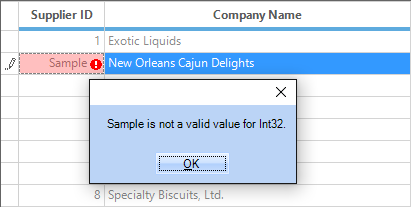
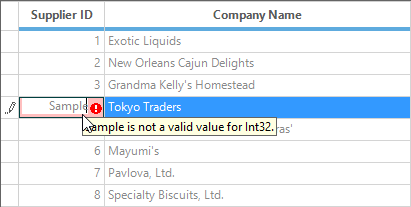
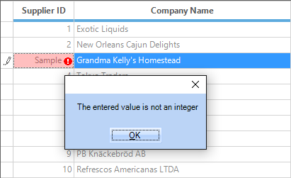

# Data Validation in Windows Forms GridGrouping control
The GridGroupingControl lets you define restrictions on what data can or should be entered in a cell. When an incorrect data is entered in the cell, it will display an error icon and an error message.  It is also possible to display error icon in row header.

## Built-in Validation
The GridGroupingControl has the built-in support to throw the validation error message when the data is not valid for specific column. For example, if the string value is entered in the numeric value type column, it will throw the error message.

The visibility of the error icon can be changed by setting the setting [ShowErrorIcon](https://help.syncfusion.com/cr/windowsforms/Syncfusion.Windows.Forms.Grid.GridCurrentCell.html#Syncfusion_Windows_Forms_Grid_GridCurrentCell_ShowErrorIcon) and [ShowRowHeaderErrorIcon](https://help.syncfusion.com/cr/windowsforms/Syncfusion.Windows.Forms.Grid.GridControlBase.html#Syncfusion_Windows_Forms_Grid_GridControlBase_ShowRowHeaderErroricon) property.



//To display the error icon in the current cell
this.gridGroupingControl1.TableControl.CurrentCell.ShowErrorIcon = true;

//To display the Error icon on the RowHeader
this.gridGroupingControl1.TableControl.ShowRowHeaderErroricon = true;


'To display the error icon in the current cell
Me.gridGroupingControl1.TableControl.CurrentCell.ShowErrorIcon = True

'To display the Error icon on the RowHeader
Me.gridGroupingControl1.TableControl.ShowRowHeaderErroricon = True



GridGroupingControl validates the cell based on the [CellValueType](https://help.syncfusion.com/cr/windowsforms/Syncfusion.Windows.Forms.Grid.GridStyleInfo.html#Syncfusion_Windows_Forms_Grid_GridStyleInfo_CellValueType) property and shows the error message. If `CellValueType` is `int` type and user enters `string` value, then the grid will automatically throw the error message like “Value(x) is not a valid value for Int32” in a message box. Whereas, `x` denotes the entered cell value.

By default, the error provider will show a popup while the exception is occurred. When you want to disable this popup, set the [ShowErrorMessageBox](https://help.syncfusion.com/cr/windowsforms/Syncfusion.Windows.Forms.Grid.GridCurrentCell.html#Syncfusion_Windows_Forms_Grid_GridCurrentCell_ShowErrorMessageBox) property to `false`.



//Disable the Error Message Box
this.gridGroupingControl1.TableControl.CurrentCell.ShowErrorMessageBox = false;


'Disable the Error Message Box
this.gridGroupingControl1.TableControl.CurrentCell.ShowErrorMessageBox = false



### Error tips support
The Error provider will also show the error message in the comment tips while moving the mouse over the error cell.

N> When the error is occurred, the current cell will not leave from the edit mode. So that the grid will not allow to perform other actions like moving the current cells, clicking, etc. The <kbd>Esc</kbd> key is used to get out from the exception with the old value of the cell

## Programmatic Validation
While setting the cell value through the code, it will not trigger the [CurrentCellStartEditing](https://help.syncfusion.com/cr/windowsforms/Syncfusion.GridHelperClasses.GridCardView.html) and [CurrentCellValidating](https://help.syncfusion.com/cr/windowsforms/Syncfusion.Windows.Forms.Grid.GridControlBase.html) events. Therefore, the validation will not work at this type of editing. To validate this type of editing, call [CurrentCell.Validate](https://help.syncfusion.com/cr/windowsforms/Syncfusion.Windows.Forms.Grid.GridCurrentCell.html#Syncfusion_Windows_Forms_Grid_GridCurrentCell_Validate) method after editing the value of the current cell. It will raise the `CurrentCellValidating` event to manually validate the cell value.

The below examples shows the `Phone` column is validated when string value is entered,



// Setting the current cell
this.gridGroupingControl1.TableControl.CurrentCell.MoveTo(5, 6);

//Validating the specific cell
this.gridGroupingControl1.TableControl.CurrentCell.Validate();
this.gridGroupingControl1.TableControlCurrentCellValidating += new GridTableControlCancelEventHandler(gridGroupingControl1_TableControlCurrentCellValidating);
void gridGroupingControl1_TableControlCurrentCellValidating(object sender, GridTableControlCancelEventArgs e)
{
    GridCurrentCell currentCell = this.gridGroupingControl1.TableControl.CurrentCell;
    GridTableCellStyleInfo tableCellStyle = e.TableControl.GetTableViewStyleInfo(currentCell.RowIndex,currentCell.ColIndex);
    double cellValue;

    if (tableCellStyle.TableCellIdentity.Column != null && tableCellStyle.TableCellIdentity.Column.Name == "Phone")
    {

        if (!double.TryParse(currentCell.Renderer.ControlText,out cellValue))
        {
            currentCell.SetError("Please enter the valid data");
        }
    }            
}


' Setting the current cell
Me.gridGroupingControl1.TableControl.CurrentCell.MoveTo(5, 6)

'Validating the specific cell
Me.gridGroupingControl1.TableControl.CurrentCell.Validate()

AddHandler gridGroupingControl1.TableControlCurrentCellValidating, AddressOf gridGroupingControl1_TableControlCurrentCellValidating

Private Sub gridGroupingControl1_TableControlCurrentCellValidating(ByVal sender As Object, ByVal e As GridTableControlCancelEventArgs)
    Dim currentCell As GridCurrentCell = Me.gridGroupingControl1.TableControl.CurrentCell
    Dim tableCellStyle As GridTableCellStyleInfo = e.TableControl.GetTableViewStyleInfo(currentCell.RowIndex,currentCell.ColIndex)
    Dim cellValue As Double

    If tableCellStyle.TableCellIdentity.Column IsNot Nothing AndAlso tableCellStyle.TableCellIdentity.Column.Name = "Phone" Then

        If Not Double.TryParse(currentCell.Renderer.ControlText,cellValue) Then
            currentCell.SetError("Please enter the valid data")
        End If
    End If
End Sub



## Customizing Error Text 
The validation error message can be changed by using the [ValidationErrorText](https://help.syncfusion.com/cr/windowsforms/Syncfusion.Windows.Forms.Grid.GridCurrentCell.html#Syncfusion_Windows_Forms_Grid_GridCurrentCell_ValidationErrorText) property.



//Set the text displayed in the Error Message Box
this.gridGroupingControl1.TableControl.CurrentCell.ValidationErrorText = "The entered value is not an integer";


'Set the text displayed in the Error Message Box
Me.gridGroupingControl1.TableControl.CurrentCell.ValidationErrorText = "The entered value is not an integer"



## Events
The GridGroupingControl has various events to customize the validation process for the cells. The validation can be handled by following events,

* [TableControlCurrentCellValidating](https://help.syncfusion.com/cr/windowsforms/Syncfusion.Windows.Forms.Grid.Grouping.GridGroupingControl.html)              -        This event will be raised before the current cell is validated.
* [TableControlCurrentCellValidated](https://help.syncfusion.com/cr/windowsforms/Syncfusion.Windows.Forms.Grid.Grouping.GridGroupingControl.html)               -        This event will be raised after the current cell was validated.
* [TableControlCurrentCellErrorMessage](https://help.syncfusion.com/cr/windowsforms/Syncfusion.Windows.Forms.Grid.Grouping.GridGroupingControl.html)       -        This event will be will be raised when the current cell throws the validation error.
* [TableControlCurrentCellValidateString](https://help.syncfusion.com/cr/windowsforms/Syncfusion.Windows.Forms.Grid.Grouping.GridGroupingControl.html)       -        This event will be raised when the user presses the key in the current cell and before it is accepted. Allows users to limit the keys that are accepted for the current cell. 



this.gridGroupingControl1.TableControlCurrentCellValidating += new GridTableControlCancelEventHandler(gridGroupingControl1_TableControlCurrentCellValidating);
this.gridGroupingControl1.TableControlCurrentCellValidated+=new GridTableControlEventHandler(gridGroupingControl1_TableControlCurrentCellValidated);
this.gridGroupingControl1.TableControlCurrentCellValidateString+=new GridTableControlCurrentCellValidateStringEventHandler
(gridGroupingControl1_TableControlCurrentCellValidateString);
this.gridGroupingControl1.TableControlCurrentCellErrorMessage+=new GridTableControlCurrentCellErrorMessageEventHandler
(gridGroupingControl1_TableControlCurrentCellErrorMessage);

void gridGroupingControl1_TableControlCurrentCellErrorMessage(object sender, GridTableControlCurrentCellErrorMessageEventArgs e)
{
    string ErrorMessage = e.Inner.Text;

    //To-Do
}

void gridGroupingControl1_TableControlCurrentCellValidateString(object sender, GridTableControlCurrentCellValidateStringEventArgs e)
{
    string enteredString = e.Inner.Text;

    //To-Do
}

void gridGroupingControl1_TableControlCurrentCellValidated(object sender, GridTableControlEventArgs e)
{

    // To-Do
}

void gridGroupingControl1_TableControlCurrentCellValidating(object sender, GridTableControlCancelEventArgs e)
{

    // To-Do
    e.Inner.Cancel = true;
}


AddHandler gridGroupingControl1.TableControlCurrentCellValidating, AddressOf gridGroupingControl1_TableControlCurrentCellValidating
AddHandler gridGroupingControl1.TableControlCurrentCellValidated, AddressOf gridGroupingControl1_TableControlCurrentCellValidated
AddHandler gridGroupingControl1.TableControlCurrentCellValidateString, AddressOf gridGroupingControl1_TableControlCurrentCellValidateString
AddHandler gridGroupingControl1.TableControlCurrentCellErrorMessage, AddressOf gridGroupingControl1_TableControlCurrentCellErrorMessage

Private Sub gridGroupingControl1_TableControlCurrentCellErrorMessage(ByVal sender As Object, ByVal e As GridTableControlCurrentCellErrorMessageEventArgs)
    Dim ErrorMessage As String = e.Inner.Text

    'To-Do
End Sub

Private Sub gridGroupingControl1_TableControlCurrentCellValidateString(ByVal sender As Object, ByVal e As GridTableControlCurrentCellValidateStringEventArgs)
    Dim enteredString As String = e.Inner.Text

    'To-Do
End Sub

Private Sub gridGroupingControl1_TableControlCurrentCellValidated(ByVal sender As Object, ByVal e As GridTableControlEventArgs)

    ' To-Do
End Sub

Private Sub gridGroupingControl1_TableControlCurrentCellValidating(ByVal sender As Object, ByVal e As GridTableControlCancelEventArgs)

    ' To-Do
    e.Inner.Cancel = True
End Sub



### Handling Error Message using Events
The validation error message can be handled by using the `TableControlCurrentCellErrorMessage` event. The validation error message for particular cell can be prevented by setting `e.Cancel` as `true`.



this.gridGroupingControl1.TableControlCurrentCellErrorMessage += new GridTableControlCurrentCellErrorMessageEventHandler
(gridGroupingControl1_TableControlCurrentCellErrorMessage);

void gridGroupingControl1_TableControlCurrentCellErrorMessage(object sender, GridTableControlCurrentCellErrorMessageEventArgs e)
{

    //Getting current cell
    GridCurrentCell currentCell = this.gridGroupingControl1.TableControl.CurrentCell;

    //Getting table cell style.
    GridTableCellStyleInfo tableCellStyle = e.TableControl.GetTableViewStyleInfo(currentCell.RowIndex, currentCell.ColIndex);

    //Checking column name

    if (tableCellStyle.TableCellIdentity.Column != null && tableCellStyle.TableCellIdentity.Column.Name == "SupplierID")
    {
        e.Inner.Cancel = true;
    }
}




AddHandler gridGroupingControl1.TableControlCurrentCellErrorMessage, AddressOf gridGroupingControl1_TableControlCurrentCellErrorMessage

Private Sub gridGroupingControl1_TableControlCurrentCellErrorMessage(ByVal sender As Object, ByVal e As GridTableControlCurrentCellErrorMessageEventArgs)

    'Getting current cell
    Dim currentCell As GridCurrentCell = Me.gridGroupingControl1.TableControl.CurrentCell

    'Getting table cell style.
    Dim tableCellStyle As GridTableCellStyleInfo = e.TableControl.GetTableViewStyleInfo(currentCell.RowIndex, currentCell.ColIndex)

    'Checking column name

    If tableCellStyle.TableCellIdentity.Column IsNot Nothing AndAlso tableCellStyle.TableCellIdentity.Column.Name = "SupplierID" Then
        e.Inner.Cancel = True
    End If
End Sub



### Preventing Invalid Key Press
The invalid key pressing can be prevented by handling the `TableControlCurrentCellValidateString` event. This event will be raised when the user presses the key in the current cell and before it is accepted. Allows users to limit the keys that are accepted for the current cell. 



this.gridGroupingControl1.TableControlCurrentCellValidateString+=new GridTableControlCurrentCellValidateStringEventHandler
(gridGroupingControl1_TableControlCurrentCellValidateString);

void gridGroupingControl1_TableControlCurrentCellValidateString(object sender, GridTableControlCurrentCellValidateStringEventArgs e)
{
    double numericValue;

    //Checks the entered text is numeric

    if (!double.TryParse(e.Inner.Text, out numericValue))
    {
        e.Inner.Cancel = true;
    }
}


AddHandler gridGroupingControl1.TableControlCurrentCellValidateString, AddressOf gridGroupingControl1_TableControlCurrentCellValidateString

Private Sub gridGroupingControl1_TableControlCurrentCellValidateString(ByVal sender As Object, ByVal e As GridTableControlCurrentCellValidateStringEventArgs)
    Dim numericValue As Double

    'Checks the entered text is numeric

    If Not Double.TryParse(e.Inner.Text, numericValue) Then
        e.Inner.Cancel = True
    End If
End Sub


