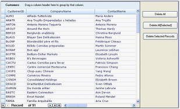

# Delete Collection of Records in GridGroupingControl

Essential GridGroupingControl now supports deletion of collection of Records from GridGroupingControl instead of deleting records one by one. GridGroupingControl supports three methods of deleting records.

* DeleteAll - Deletes all records
* Delete All[Selected] - Deletes selected records
* Delete Selected Records - Deletes specified records

For these methods DeleteAll have been implemented to support delete all the records, Delete All[Selected] deletes selected records, and Delete Selected Records delete specified records from the GridGroupingControl. 

1.Deleting All

The following code illustrates deleting all the records.

 

//Deletes all the records from the grid table.

this.gridGroupingControl1.Table.Records.DeleteAll();

 

When the code runs, Deleting all records is bound to Delete All button.

1.Deleting Selected Records

The following code illustrates deleting records manually selected.  

  

//Delete selected records from the grid table. 

this.gridGroupingControl1.Table.SelectedRecords.DeleteAll();


When the code runs, deleting manually selected record is bound to Delete All[Selected] button  

2.Deleting Specified Records

The following code illustrates deleting Specified records.

N>: Parameter – Specify the collection of records that needs to be deleted.

  

//Deletes the specified records from the table. 

 this.gridGroupingControl1.Table.Records.DeleteRecords(rec);
 


When the code runs, deleting specified records are bound to Delete Selected Records button. 

  

