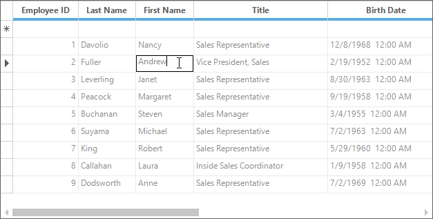

# Editing in Windows Forms GridGrouping control
The GridGroupingControl lets you control the editing behavior of cells. For changing the editing behavior, make use of the [ActivateCurrentCellBehavior](https://help.syncfusion.com/cr/windowsforms/Syncfusion.Windows.Forms.Grid.Grouping.GridGroupingControl.html#Syncfusion_Windows_Forms_Grid_Grouping_GridGroupingControl_ActivateCurrentCellBehavior) property. This property will decide whether to edit the cells using single click or double click or disable editing.




// Begin editing after user clicks on a cell.
this.gridGroupingControl1.ActivateCurrentCellBehavior = GridCellActivateAction.ClickOnCell;

// Begin editing after user double clicks on a cell.
this. gridGroupingControl1.ActivateCurrentCellBehavior = GridCellActivateAction.DblClickOnCell;

// Editing cursor will not be displayed.
this.gridGroupingControl1.ActivateCurrentCellBehavior = GridCellActivateAction.None;




'Begin editing after user clicks on a cell.
Me.gridGroupingControl1.ActivateCurrentCellBehavior = GridCellActivateAction.ClickOnCell

'Begin editing after user double clicks on a cell.
Me.gridGroupingControl1.ActivateCurrentCellBehavior = GridCellActivateAction.DblClickOnCell

'Editing cursor will not be displayed.
Me.gridGroupingControl1.ActivateCurrentCellBehavior = GridCellActivateAction.None




## Programmatic Editing
This section will explain on how to begin, commit and cancel the editing process through code wise.

### Start Editing on Current Cell
The [CurrentCell.BeginEdit](https://help.syncfusion.com/cr/windowsforms/Syncfusion.Windows.Forms.Grid.GridCurrentCell.html#Syncfusion_Windows_Forms_Grid_GridCurrentCell_BeginEdit) method is used to start editing for a current cell and it also allows to set the focus for the cell editor.


this.gridGroupingControl1.TableControl.CurrentCell.BeginEdit();


Me.gridGroupingControl1.TableControl.CurrentCell.BeginEdit()



N> To check whether the current cell is in editing mode, make use of the [CurrentCell.IsEditing](https://help.syncfusion.com/cr/windowsforms/Syncfusion.Windows.Forms.Grid.GridCurrentCell.html#Syncfusion_Windows_Forms_Grid_GridCurrentCell_IsEditing) property.

### Committing the Changes
The [CurrentCell.EndEdit](https://help.syncfusion.com/cr/windowsforms/Syncfusion.Windows.Forms.Grid.GridCurrentCell.html#Syncfusion_Windows_Forms_Grid_GridCurrentCell_EndEdit) method is used to complete the editing process of the current cell. After completing the `EndEdit` method the cell style will be saved for the current cell.



this.gridGroupingControl1.TableControl.CurrentCell.EndEdit();



Me.gridGroupingControl1.TableControl.CurrentCell.EndEdit()



N>  Likewise [ConfirmChanges](https://help.syncfusion.com/cr/windowsforms/Syncfusion.Windows.Forms.Grid.GridCurrentCell.html#Syncfusion_Windows_Forms_Grid_GridCurrentCell_ConfirmChanges) method also saves or confirms the modified current cell and closes any open drop-down windows. 

### Canceling the Changes
The [CancelEdit](https://help.syncfusion.com/cr/windowsforms/Syncfusion.Windows.Forms.Grid.GridCurrentCell.html#Syncfusion_Windows_Forms_Grid_GridCurrentCell_CancelEdit)() method is used to cancel editing for the current cells and discard the changes related to it.



this.gridGroupingControl1.TableControl.CurrentCell.CancelEdit();


Me.gridGroupingControl1.TableControl.CurrentCell.CancelEdit()



## Read Only
Editing can be enabled or disabled by using the [ReadOnly](https://help.syncfusion.com/cr/windowsforms/Syncfusion.Windows.Forms.Grid.GridModel.html#Syncfusion_Windows_Forms_Grid_GridModel_ReadOnly) property. Default value for this property is `false`. This section explains about the usage of `ReadOnly` property in GridGroupingControl.

### Enabling Read Only for Entire Grid
To enable/disable the editing for the entire GridControl, make use of the [ReadOnly](https://help.syncfusion.com/cr/windowsforms/Syncfusion.Windows.Forms.Grid.GridModel.html#Syncfusion_Windows_Forms_Grid_GridModel_ReadOnly) property.



//Enabling Readonly for whole Grid
this.gridGroupingControl1.TableModel.ReadOnly = true;

//Disabling Readonly for whole Grid
this.gridGroupingControl1.TableModel.ReadOnly = false;


'Enabling Readonly for whole Grid
Me.gridGroupingControl1.TableModel.ReadOnly = True

'Disabling Readonly for whole Grid
Me.gridGroupingControl1.TableModel.ReadOnly = False



### Enabling Read Only for a particular cell
For preventing the editing in cell by cell basis, make use of the [GridStyleInfo](https://help.syncfusion.com/cr/windowsforms/Syncfusion.Windows.Forms.Grid.GridStyleInfo.html) object’s [ReadOnly](https://help.syncfusion.com/cr/windowsforms/Syncfusion.Windows.Forms.Grid.GridModel.html#Syncfusion_Windows_Forms_Grid_GridModel_ReadOnly) property. The `ReadOnly` property for specific cell can be set by using the[QueryCellStyleInfo](https://help.syncfusion.com/cr/windowsforms/Syncfusion.Windows.Forms.Grid.Grouping.GridGroupingControl.html) event.



this.gridGroupingControl1.QueryCellStyleInfo += new GridTableCellStyleInfoEventHandler(gridGroupingControl1_QueryCellStyleInfo);

void gridGroupingControl1_QueryCellStyleInfo(object sender, GridTableCellStyleInfoEventArgs e)
{

    if (e.TableCellIdentity.TableCellType == GridTableCellType.RecordFieldCell
       || e.TableCellIdentity.TableCellType == GridTableCellType.AlternateRecordFieldCell)
    {

        //Checking column name

        if (e.TableCellIdentity.Column != null && e.TableCellIdentity.Column.Name == "FirstName")
        {
            // Checking specific record

            if (e.TableCellIdentity.DisplayElement.GetRecord().Id == 5)
            {
                e.Style.ReadOnly = true;
            }
        }
    }
}


AddHandler gridGroupingControl1.QueryCellStyleInfo, AddressOf gridGroupingControl1_QueryCellStyleInfo

Private Sub gridGroupingControl1_QueryCellStyleInfo(ByVal sender As Object, ByVal e As GridTableCellStyleInfoEventArgs)

    If e.TableCellIdentity.TableCellType = GridTableCellType.RecordFieldCell OrElse e.TableCellIdentity.TableCellType = GridTableCellType.AlternateRecordFieldCell Then

        'Checking column name

        If e.TableCellIdentity.Column IsNot Nothing AndAlso e.TableCellIdentity.Column.Name = "FirstName" Then

            ' Checking specific record

            If e.TableCellIdentity.DisplayElement.GetRecord().Id = 5 Then
                e.Style.ReadOnly = True
            End If
        End If
    End If
End Sub



### Changing the Content of a Read Only Cell
If a cell is in `ReadOnly` mode, then it is not possible to make any changes in that cell programmatically. So to make changes to Read-Only cells, make use of the [IgnoreReadOnly](https://help.syncfusion.com/cr/windowsforms/Syncfusion.Windows.Forms.Grid.GridModel.html#Syncfusion_Windows_Forms_Grid_GridModel_IgnoreReadOnly) property, which allows to change the `ReadOnly` cell.

The specific cell properties can be changed by handling the `QueryCellStyleInfo` event.



this.gridGroupingControl1.QueryCellStyleInfo += new GridTableCellStyleInfoEventHandler(gridGroupingControl1_QueryCellStyleInfo);
void gridGroupingControl1_QueryCellStyleInfo(object sender, GridTableCellStyleInfoEventArgs e)
{

    if (e.TableCellIdentity.TableCellType == GridTableCellType.RecordFieldCell
       || e.TableCellIdentity.TableCellType == GridTableCellType.AlternateRecordFieldCell)
    {

        //Checking column name

        if (e.TableCellIdentity.Column != null && e.TableCellIdentity.Column.Name == "FirstName")
        {

            // Checking specific record

            if (e.TableCellIdentity.DisplayElement.GetRecord().Id == 5)
            {
                e.Style.ReadOnly = true;

                //To change its value, you need to use IgnoreReadOnly property.

                //Turns off Read-only checking.
                this.gridGroupingControl1.TableModel.IgnoreReadOnly = true;

                //Now you can change the cell value.
                e.Style.CellValue = 256;

                //Turns on Read-only checking.
                this.gridGroupingControl1.TableModel.IgnoreReadOnly = false;
            }
        }
    }
}



AddHandler gridGroupingControl1.QueryCellStyleInfo, AddressOf gridGroupingControl1_QueryCellStyleInfo

Private Sub gridGroupingControl1_QueryCellStyleInfo(ByVal sender As Object, ByVal e As GridTableCellStyleInfoEventArgs)

    If e.TableCellIdentity.TableCellType = GridTableCellType.RecordFieldCell OrElse e.TableCellIdentity.TableCellType = GridTableCellType.AlternateRecordFieldCell Then

        'Checking column name

        If e.TableCellIdentity.Column IsNot Nothing AndAlso e.TableCellIdentity.Column.Name = "FirstName" Then

            ' Checking specific record

            If e.TableCellIdentity.DisplayElement.GetRecord().Id = 5 Then
                e.Style.ReadOnly = True

                'To change its value, you need to use IgnoreReadOnly property.

                'Turns off Read-only checking.
                Me.gridGroupingControl1.TableModel.IgnoreReadOnly = True

                'Now you can change the cell value.
                e.Style.CellValue = 256

                'Turns on Read-only checking.
                Me.gridGroupingControl1.TableModel.IgnoreReadOnly = False
            End If
        End If
    End If
End Sub




## Browse Only
The [BrowseOnly](https://help.syncfusion.com/cr/windowsforms/Syncfusion.Windows.Forms.Grid.Grouping.GridGroupingControl.html#Syncfusion_Windows_Forms_Grid_Grouping_GridGroupingControl_BrowseOnly) property can be used to disable the editing mode for the whole grid. It is not possible to disable particular cells using this property.




// Disabling Editing mode for whole grid
this.gridGroupingControl1.BrowseOnly = true;



' Disabling Editing mode for whole grid
Me.gridGroupingControl1.BrowseOnly = True



N> On using the `BrowseOnly` property, the edit cursor for that cell will not be shown in editing. 

The difference between `ReadOnly` and `BrowseOnly` is that current cell will be switched to editing mode in `ReadOnly` and current cell will not be switched to editing mode in `BrowseOnly` mode.

The below example shows the grid is enabled with `BrowseOnly` mode,

The below example shows the grid is enabled with `ReadOnly` mode,

### Prevent Editing for particular range of Cells
It is possible to prevent a particular cell or range of cells by using the [TableControlCurrentCellStartEditing](https://help.syncfusion.com/cr/windowsforms/Syncfusion.Windows.Forms.Grid.Grouping.GridGroupingControl.html) event. The `Cancel` property is used to restrict the editing.



this.gridGroupingControl1.TableControlCurrentCellStartEditing += new GridTableControlCancelEventHandler(gridGroupingControl1_TableControlCurrentCellStartEditing);
void gridGroupingControl1_TableControlCurrentCellStartEditing(object sender, GridTableControlCancelEventArgs e)
{
    GridCurrentCell currentCell = e.TableControl.CurrentCell;

    // Editing for the rows in-between 2 and 6 will be canceled.

    if (currentCell.RangeInfo.IntersectsWith(GridRangeInfo.Rows(2, 6)))
        e.Inner.Cancel = true;
}



AddHandler gridGroupingControl1.TableControlCurrentCellStartEditing, AddressOf gridGroupingControl1_TableControlCurrentCellStartEditing

Private Sub gridGroupingControl1_TableControlCurrentCellStartEditing(ByVal sender As Object, ByVal e As GridTableControlCancelEventArgs)
    Dim currentCell As GridCurrentCell = e.TableControl.CurrentCell

    ' Editing for the rows in-between 2 and 6 will be canceled.

    If currentCell.RangeInfo.IntersectsWith(GridRangeInfo.Rows(2, 6)) Then
        e.Inner.Cancel = True
    End If
End Sub



## CurrentCell Events
The current cell editing can be handled by following events,

* [TableControlCurrentCellStartEditing](https://help.syncfusion.com/cr/windowsforms/Syncfusion.Windows.Forms.Grid.Grouping.GridGroupingControl.html)            -      This event will be raised when the current cell switches into editing mode.
* [TableControlCurrentCellActivating](https://help.syncfusion.com/cr/windowsforms/Syncfusion.Windows.Forms.Grid.Grouping.GridGroupingControl.html)               -      This event will be fired each time, while navigating between cells. Also when the grid activates a specified cell as current cell then this event will be called.
* [TableControlCurrentCellActivated](https://help.syncfusion.com/cr/windowsforms/Syncfusion.Windows.Forms.Grid.Grouping.GridGroupingControl.html)                -      This event will be raised after activating the specified current cell.
* [TableControlCurrentCellChanging](https://help.syncfusion.com/cr/windowsforms/Syncfusion.Windows.Forms.Grid.Grouping.GridGroupingControl.html)                -     This event will be raised before the current cell content is changed.
* [TableControlCurrentCellChanged ](https://help.syncfusion.com/cr/windowsforms/Syncfusion.Windows.Forms.Grid.Grouping.GridGroupingControl.html)                -     This event will be raised after the current cell was changed.
* [TableControlCurrentCellEditingComplete](https://help.syncfusion.com/cr/windowsforms/Syncfusion.Windows.Forms.Grid.Grouping.GridGroupingControl.html)   -     This event will be raised after all the changes done in the current cell and editing mode is completed for that cell



this.gridGroupingControl1.TableControlCurrentCellActivating += new GridTableControlCurrentCellActivatingEventHandler(gridGroupingControl1_TableControlCurrentCellActivating);

void gridGroupingControl1_TableControlCurrentCellActivating(object sender, GridTableControlCurrentCellActivatingEventArgs e)
{

    //To-Do
    e.Inner.Cancel = true;
}



AddHandler gridGroupingControl1.TableControlCurrentCellActivating, AddressOf gridGroupingControl1_TableControlCurrentCellActivating

Private Sub gridGroupingControl1_TableControlCurrentCellChanging(ByVal sender As Object, ByVal e As GridTableControlCancelEventArgs)

    'To-Do
    e.Inner.Cancel = True
End Sub


The detailed explanation of the `CurrentCell Events` has been discussed in [CurrentCell Events](https://help.syncfusion.com/windowsforms/gridgrouping/events#current-cell-events) section.

## Customizations through Editing
The section explains on how to customize the key events while editing and also on how to customize the appearance while editing.

### Capturing Mouse/Key Events from the Cell Renderers
While the current cell is in edit mode, the mouse and key events of the current cell can be captured by accessing the renderer of the cell. 



GridTextBoxCellRenderer textBoxCellRenderer = (GridTextBoxCellRenderer)this.gridGroupingControl1.TableControl.CellRenderers["TextBox"];

//Invokes the Events of the TextBox renderer.
textBoxCellRenderer.TextBox.KeyUp += new KeyEventHandler(TextBox_KeyUp);
textBoxCellRenderer.TextBox.MouseDown += new MouseEventHandler(TextBox_MouseDown);

void TextBox_MouseDown(object sender, MouseEventArgs e)
{
    Console.WriteLine("textBox_MouseDown"); 
}

void TextBox_KeyUp(object sender, KeyEventArgs e)
{
    Console.WriteLine("textBox_KeyUp");
}


Dim textBoxCellRenderer As GridTextBoxCellRenderer = CType(Me.gridGroupingControl1.TableControl.CellRenderers("TextBox"), GridTextBoxCellRenderer)

'Invokes the Events of the TextBox renderer.
AddHandler textBoxCellRenderer.TextBox.KeyUp, AddressOf TextBox_KeyUp
AddHandler textBoxCellRenderer.TextBox.MouseDown, AddressOf TextBox_MouseDown

Private Sub TextBox_MouseDown(ByVal sender As Object, ByVal e As MouseEventArgs)
    Console.WriteLine("textBox_MouseDown")
End Sub

Private Sub TextBox_KeyUp(ByVal sender As Object, ByVal e As KeyEventArgs)
    Console.WriteLine("textBox_KeyUp")
End Sub



### Capturing Function Keys on Current Cell Editing
When the current cell is actively being edited, the grid does not automatically catch the Function keys in the current cell. In this case, make use of the [TableControlCurrentCellControlKeyMessage](https://help.syncfusion.com/cr/windowsforms/Syncfusion.Windows.Forms.Grid.Grouping.GridGroupingControl.html) to catch the function keys. 



this.gridGroupingControl1.TableControlCurrentCellControlKeyMessage += new GridTableControlCurrentCellControlKeyMessageEventHandler(gridGroupingControl1_TableControlCurrentCellControlKeyMessage);

void gridGroupingControl1_TableControlCurrentCellControlKeyMessage(object sender, GridTableControlCurrentCellControlKeyMessageEventArgs e)
{
    Keys keyCode = (Keys)((int)e.Inner.Msg.WParam) & Keys.KeyCode;
    Console.WriteLine(keyCode);
    Console.WriteLine(e.Inner.Msg);
}


AddHandler gridGroupingControl1.TableControlCurrentCellControlKeyMessage, AddressOf gridGroupingControl1_TableControlCurrentCellControlKeyMessage

Private Sub gridGroupingControl1_TableControlCurrentCellControlKeyMessage(ByVal sender As Object, ByVal e As GridTableControlCurrentCellControlKeyMessageEventArgs)
    Dim keyCode As Keys = CType(CInt(Fix(e.Inner.Msg.WParam)), Keys) And Keys.KeyCode
    Console.WriteLine(keyCode)
    Console.WriteLine(e.Inner.Msg)
End Sub



N> This event may be hit multiple times for each keystroke i.e., it can be fired for both `KeyDown`, `KeyUp` and other related events.

### Displaying Placeholders for the Exceeded Cell Content
The placeholder is used to display the character instead of the alphabet, numeric or alphanumeric while the text is exceeding the cells width. By default, the number sign `#` is used as the placeholder character. This can be done by using the [AutoFit](https://help.syncfusion.com/cr/windowsforms/Syncfusion.Windows.Forms.Grid.GridStyleInfo.html#Syncfusion_Windows_Forms_Grid_GridStyleInfo_AutoFit) property.

The `AutoFit` property has the following options,

* Alphabet                -           Converts alphabetic contents to placeholder characters.
* Numeric                 -           Converts numeric contents to placeholder characters.
* Both                    -           Converts both alphabetic and numeric contents to placeholder characters.
* None                    -            Displays original content without placeholder characters.



//To convert both Numeric and Alphabet contents to the placeholder characters
this.gridGroupingControl1.TableDescriptor.Columns["CustomerID"].Appearance.AnyRecordFieldCell.AutoFit = AutoFitOptions.Both;


'To convert both Numeric and Alphabet contents to the place hold characters
Me.gridGroupingControl1.TableDescriptor.Columns("CustomerID").Appearance.AnyRecordFieldCell.AutoFit = AutoFitOptions.Both


The desired character can be changed by using the [AutoFitChar](https://help.syncfusion.com/cr/windowsforms/Syncfusion.Windows.Forms.Grid.GridStyleInfo.html#Syncfusion_Windows_Forms_Grid_GridStyleInfo_AutoFitChar) property.


//Set the placeholder character 
this.gridGroupingControl1.TableDescriptor.Columns["CustomerID"].Appearance.AnyRecordFieldCell.AutoFitChar = '#';


'Set the placeholder character 
this.gridGroupingControl1.TableDescriptor.Columns["CustomerID"].Appearance.AnyRecordFieldCell.AutoFitChar = '#';



### Applying Trimming when cell content exceed its size 
While the content of the cell exceeds to the cells size then the text is automatically wrapped in to the next line. To show the Ellipsis word like the `…` at the end of the text, set the [Trimming](https://help.syncfusion.com/cr/windowsforms/Syncfusion.Windows.Forms.Grid.GridStyleInfo.html#Syncfusion_Windows_Forms_Grid_GridStyleInfo_Trimming) option for the cell as `EllipsisWord`.



//Apply Ellipsis word for second column alone.
this.gridGroupingControl1.TableDescriptor.Columns["CustomerID"].Appearance.AnyRecordFieldCell.Trimming = StringTrimming.EllipsisWord;


'Apply Ellipsis word for second column alone.
Me.gridGroupingControl1.TableDescriptor.Columns("CustomerID").Appearance.AnyRecordFieldCell.Trimming = StringTrimming.EllipsisWord



N> For applying the trimming functionality, make sure that the `WrapText` property is set to `false`.

### Enabling Insert Mode on Editing
To edit the contents of the cell in insert mode (Replace the existing character with the new one) while inserting the text on a cell, set the selection length of the current cell renderer as one in the [TableControlCurrentCellKeyPress](https://help.syncfusion.com/cr/windowsforms/Syncfusion.Windows.Forms.Grid.Grouping.GridGroupingControl.html) event.

N>
N> The [TableControl.CurrentCellKeyPress](https://help.syncfusion.com/cr/windowsforms/Syncfusion.Windows.Forms.Grid.GridControlBase.html) event can also be used for the below customization.


this.gridGroupingControl1.TableControlCurrentCellKeyPress += new GridTableControlKeyPressEventHandler(gridGroupingControl1_TableControlCurrentCellKeyPress);
this.gridGroupingControl1.TableControlCurrentCellKeyDown += new GridTableControlKeyEventHandler(gridGroupingControl1_TableControlCurrentCellKeyDown);

void gridGroupingControl1_TableControlCurrentCellKeyPress(object sender, GridTableControlKeyPressEventArgs e)
{

    //Create object for current cell renderer
    GridTextBoxCellRenderer cellRenderer = e.TableControl.CurrentCell.Renderer as GridTextBoxCellRenderer;

    if (e.Inner.KeyChar != Convert.ToChar(Keys.Back) && cellRenderer.TextBox.SelectionLength == 0)
    {
        //Programmatically selects One char.
        cellRenderer.TextBox.SelectionLength = 1;
    }
}

void gridGroupingControl1_TableControlCurrentCellKeyDown(object sender, GridTableControlKeyEventArgs e)
{

    //Translates the Backspace key to a left arrow key.

    if (e.Inner.KeyCode == Keys.Back)
    {
        SendKeys.Send("{LEFT}");
        e.Inner.Handled = true;
    }
}


AddHandler gridGroupingControl1.TableControlCurrentCellKeyPress, AddressOf gridGroupingControl1_TableControlCurrentCellKeyPress
AddHandler gridGroupingControl1.TableControlCurrentCellKeyDown, AddressOf gridGroupingControl1_TableControlCurrentCellKeyDown

Private Sub gridGroupingControl1_TableControlCurrentCellKeyPress(ByVal sender As Object, ByVal e As GridTableControlKeyPressEventArgs)

    'Create object for current cell renderer
    Dim cellRenderer As GridTextBoxCellRenderer = TryCast(e.TableControl.CurrentCell.Renderer, GridTextBoxCellRenderer)

    If e.Inner.KeyChar <> Convert.ToChar(Keys.Back) AndAlso cellRenderer.TextBox.SelectionLength = 0 Then

        'Programmatically selects One char.
        cellRenderer.TextBox.SelectionLength = 1
    End If
End Sub

Private Sub gridGroupingControl1_TableControlCurrentCellKeyDown(ByVal sender As Object, ByVal e As GridTableControlKeyEventArgs)

    'Translates the Backspace key to a left arrow key.

    If e.Inner.KeyCode = Keys.Back Then
        SendKeys.Send("{LEFT}")
        e.Inner.Handled = True
    End If
End Sub



