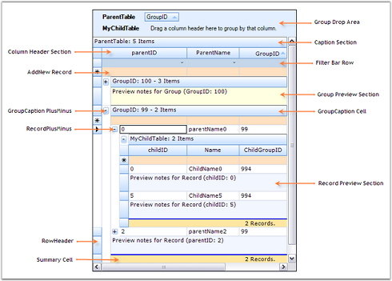

# Elaborate Structure of the Control in Windows Forms GridGrouping

This section lists the important elements that are used by the grouping grid to organize data. These grid elements can have specific appearance and behavior. The following screen shot points out the various grid elements.

## Elements of GridGroupingControl

* Caption Section-This is the first section within a group that provides caption bar above column headers. If a caption should be displayed at the beginning of each group, then Caption Sections are created when the grouping for a table is initialized.
* Column Header Section-This section will appear at the top of a table or a group, below the caption section. Column Header Section is a place holder where grouping grid displays column headers.
* Filter Bar Row-It displays the filter bar for table data. You can enable the record filters for specific columns.
* Add New Record Section-This is the section within a group that is shown above the table records and/or below the records for each group, and implements logic to add new records.
* Preview Section-A Preview Section can be added under each group and record. It is a suitable place to display custom data for a given record or group.
* Summary Section-This section is a collection of rows used to display brief information about groups or specific columns of the table.
* Group Drop Area-It lets the user to group grid data. Data can be grouped by simply dragging column headers into the group drop area.

