# Exporting in Windows Forms GridGrouping control
The GridGroupingControl provides the built in support for exporting the data to the Excel, Word, PDF and CSV format. This section will explain about these exporting methods with various converter options.

## Excel Export
The GridGroupingControl can be exported to the Excel by using the [GroupingGridExcelConverter](https://help.syncfusion.com/cr/windowsforms/Syncfusion.GroupingGridExcelConverter.GroupingGridExcelConverterControl.html) class which provides the [GroupingGridToExcel](https://help.syncfusion.com/cr/windowsforms/Syncfusion.GroupingGridExcelConverter.GroupingGridExcelConverterControl.html#Syncfusion_GroupingGridExcelConverter_GroupingGridExcelConverterControl_GroupingGridToExcel_Syncfusion_Windows_Forms_Grid_Grouping_GridGroupingControl_Syncfusion_XlsIO_IWorksheet_Syncfusion_GridExcelConverter_ConverterOptions_) method for exporting the grid to Excel. 



GroupingGridExcelConverterControl converter = new GroupingGridExcelConverterControl();

// Export the contents of the Grid to Excel
converter.GroupingGridToExcel(this.gridGroupingControl1, "Grid.xls", ConverterOptions.Visible);


Dim converter As New GroupingGridExcelConverterControl()

' Export the contents of the Grid to Excel
converter.GroupingGridToExcel(Me.gridGroupingControl1, "Grid.xls", ConverterOptions.Visible)



The following image shows the grid exporting to the Excel Sheet,

Exported grid in the excel sheet is given below,

### Exporting options 
The [ConverterOptions](https://help.syncfusion.com/cr/windowsforms/Syncfusion.GridExcelConverter.ConverterOptions.html) is used to set the exporting options for the grid. It has the following options to export the grid, 

* **ColumnHeaders** – Export the grid with the column headers
* **RowHeaders** – Export the grid with the Row Header
* **Default** – Exports the entire elements of the grid.
* **Visible** – Export only the visible rows and columns to the Excel. (eg: It will export only the caption rows of the groups to excel when the group is collapsed)

### Exporting With Row and Column Headers
The row and column headers of the GridGroupingControl can be exported to excel by using the following `ConverterOptions`,



//Creating the converter control for Exporting the grid
GroupingGridExcelConverterControl converter = new GroupingGridExcelConverterControl();

// Export the contents of the Grid to Excel
converter.GroupingGridToExcel(this.gridGroupingControl1, "FileName.xls", ConverterOptions.RowHeaders | ConverterOptions.ColumnHeaders);


'Creating the converter control for Exporting the grid
Dim converter As New GroupingGridExcelConverterControl()

' Export the contents of the Grid to Excel
converter.GroupingGridToExcel(Me.gridGroupingControl1, "FileName.xls", ConverterOptions.RowHeaders Or ConverterOptions.ColumnHeaders)



### Exporting Borders and Images
The borders and images of the grid cells can be exported to excel by using the [ExportBorders](https://help.syncfusion.com/cr/windowsforms/Syncfusion.GridExcelConverter.GridGroupingExcelConverterBase.html#Syncfusion_GridExcelConverter_GridGroupingExcelConverterBase_ExportBorders) and `ExportImage` properties of the converter.



//Creating the converter control for Exporting the grid
GroupingGridExcelConverterControl converter = new GroupingGridExcelConverterControl();

//Enable exporting of borders and Images
converter.ExportBorders = true;
converter.ExportImage = true;

// Export the contents of the Grid to Excel
converter.GroupingGridToExcel(this.gridGroupingControl1, "FileName.xls", ConverterOptions.Default);


'Creating the converter control for Exporting the grid
Dim converter As New GroupingGridExcelConverterControl()

'Enable exporting of borders and Images
converter.ExportBorders = True
converter.ExportImage = True

' Export the contents of the Grid to Excel
converter.GroupingGridToExcel(Me.gridGroupingControl1, "FileName.xls", ConverterOptions.Default)



### AutoFit Rows and Columns
By default, the rows and columns are exported with its corresponding row height and column width in the [GroupingGridExcelConverterControl](https://help.syncfusion.com/cr/windowsforms/Syncfusion.GroupingGridExcelConverter.GroupingGridExcelConverterControl.html).  This can be changed to export the default row height and column width by using the [CanExportColumnWidth](https://help.syncfusion.com/cr/windowsforms/Syncfusion.GridExcelConverter.GridExcelConverterControl.html#Syncfusion_GridExcelConverter_GridExcelConverterControl_CanExportColumnWidth) and [CanExportRowHeight](https://help.syncfusion.com/cr/windowsforms/Syncfusion.GridExcelConverter.GridExcelConverterControl.html#Syncfusion_GridExcelConverter_GridExcelConverterControl_CanExportRowHeight) properties of the [GridGroupingExcelConverterControl](https://help.syncfusion.com/cr/windowsforms/Syncfusion.GroupingGridExcelConverter.GridGroupingExcelConverterControl.html) which is newly implemented converter control for exporting the grid to excel. 



GridGroupingExcelConverterControl excelConverter = new GridGroupingExcelConverterControl();

//Auto fit rows and columns
excelConverter.CanExportColumnWidth = true;
excelConverter.CanExportRowHeight = true;

//Exporting Options
ExcelExportingOptions options = new ExcelExportingOptions();            

//Export the contents of the grid to excel
excelConverter.ExportToExcel(this.gridGroupingControl1, "FileName.xls", options);


Dim excelConverter As New GridGroupingExcelConverterControl()

'Auto fit rows and columns
excelConverter.CanExportColumnWidth = True
excelConverter.CanExportRowHeight = True

'Exporting Options
Dim options As New ExcelExportingOptions()

'Export the contents of the grid to excel
excelConverter.ExportToExcel(Me.gridGroupingControl1, "FileName.xls", options)



### Setting Default Row Height and Column Width
The default row height and column width can be set for the exported excel document by using the [DefaultColumnWidth](https://help.syncfusion.com/cr/windowsforms/Syncfusion.GridExcelConverter.GridExcelConverterControl.html#Syncfusion_GridExcelConverter_GridExcelConverterControl_DefaultColumnWidth) and [DefaultRowHeight](https://help.syncfusion.com/cr/windowsforms/Syncfusion.GridExcelConverter.GridExcelConverterControl.html#Syncfusion_GridExcelConverter_GridExcelConverterControl_DefaultRowHeight) property of the `GridGroupingExcelConverterControl`. 



GridGroupingExcelConverterControl excelConverter = new GridGroupingExcelConverterControl();

//Disable auto fit rows and columns
excelConverter.CanExportColumnWidth = false;
excelConverter.CanExportRowHeight = false;

//Set default row height and col width need to be export
excelConverter.DefaultRowHeight = 20;
excelConverter.DefaultColumnWidth = 20;            

//Exporting Options
ExcelExportingOptions options = new ExcelExportingOptions();

//Export the contents of the grid to excel
excelConverter.ExportToExcel(this.gridGroupingControl1, "FileName.xls", options);


Dim excelConverter As New GridGroupingExcelConverterControl()

'Disable auto fit rows and columns
excelConverter.CanExportColumnWidth = False
excelConverter.CanExportRowHeight = False

'Set default row height and col width need to be export
excelConverter.DefaultRowHeight = 20
excelConverter.DefaultColumnWidth = 20

'Exporting Options
Dim options As New ExcelExportingOptions()

'Export the contents of the grid to excel
excelConverter.ExportToExcel(Me.gridGroupingControl1, "FileName.xls", options)



### Exporting without Styles
The cell styles can be restricted from the exporting by using the [ExportStyle](https://help.syncfusion.com/cr/windowsforms/Syncfusion.GroupingGridExcelConverter.GroupingGridExcelConverterControl.html#Syncfusion_GroupingGridExcelConverter_GroupingGridExcelConverterControl_ExportStyle) property of the converter control. It can export the font, back color, text color, number format, etc.


GroupingGridExcelConverterControl converter = new GroupingGridExcelConverterControl();

//To export the cell’s  without styles to the excel cell
converter.ExportStyle = false;
converter.GroupingGridToExcel(this.gridGroupingControl1, "FileName.xls", ConverterOptions.Default);



Dim converter As New GroupingGridExcelConverterControl()

'To export the cell’s without styles to the excel cell
converter.ExportStyle = True
converter.GroupingGridToExcel(Me.gridGroupingControl1, "FileName.xls", ConverterOptions.Default)



N> By default the styles will be exported to the Excel.

### Exporting to specific version 
The version of the exported excel file can be specified by using the [ExcelVersion](https://help.syncfusion.com/cr/windowsforms/Syncfusion.GroupingGridExcelConverter.GridGroupingExcelConverterControl.html#Syncfusion_GroupingGridExcelConverter_GridGroupingExcelConverterControl_ExcelVersion) property of the converter.



GridGroupingExcelConverterControl excelConverter = new GridGroupingExcelConverterControl();

//Export the grid to Excel 2007 version 
excelConverter.ExcelVersion = Syncfusion.XlsIO.ExcelVersion.Excel2007;
excelConverter.ExportToExcel(this.gridGroupingControl1, "FileName.xls", new ExcelExportingOptions());


Dim excelConverter As New GridGroupingExcelConverterControl()

'Export the grid to Excel 2007 version 
excelConverter.ExcelVersion = Syncfusion.XlsIO.ExcelVersion.Excel2007
excelConverter.ExportToExcel(Me.gridGroupingControl1, "FileName.xls", New ExcelExportingOptions())



### Exporting Groups 
The groups can be exported to the Excel by using the [ExportGroupPlusMinus](https://help.syncfusion.com/cr/windowsforms/Syncfusion.GroupingGridExcelConverter.GroupingGridExcelConverterControl.html#Syncfusion_GroupingGridExcelConverter_GroupingGridExcelConverterControl_ExportGroupPlusMinus) property. It will export the groups of the GridGroupingControl as the Excel groups.



GroupingGridExcelConverterControl converter = new GroupingGridExcelConverterControl();

//Export Groups as the Excel Groups
converter.ExportGroupPlusMinus = true;
converter.GroupingGridToExcel(this.gridGroupingControl1, "FileName.xls", ConverterOptions.Default);


Dim converter As New GroupingGridExcelConverterControl()

'Export Groups as the Excel Groups
converter.ExportGroupPlusMinus = True
converter.GroupingGridToExcel(Me.gridGroupingControl1, "FileName.xls", ConverterOptions.Default)



The exported groups in excel is shown  below,

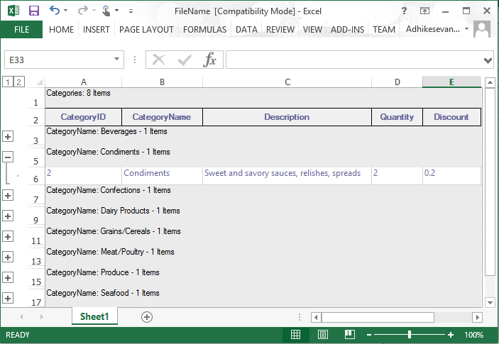

N> The nested tables is also be exported with the record plus minus by default. It can be exported as the ordinary rows by disabling the [ExportRecordPlusMinus](https://help.syncfusion.com/cr/windowsforms/Syncfusion.GroupingGridExcelConverter.GroupingGridExcelConverterControl.html#Syncfusion_GroupingGridExcelConverter_GroupingGridExcelConverterControl_ExportRecordPlusMinus) property.

### Exporting Preview Rows 
The record preview rows can be exported to the Excel by enabling the [ExportPreviewRows](https://help.syncfusion.com/cr/windowsforms/Syncfusion.GroupingGridExcelConverter.GroupingGridExcelConverterControl.html#Syncfusion_GroupingGridExcelConverter_GroupingGridExcelConverterControl_ExportPreviewRows) property.



//Display record preview row
this.gridGroupingControl1.TableOptions.ShowRecordPreviewRow = true;
GroupingGridExcelConverterControl converter = new GroupingGridExcelConverterControl();

//Enable exporting of the preview record rows to the excel
converter.ExportPreviewRows = true;
converter.GroupingGridToExcel(this.gridGroupingControl1, "FileName.xls", ConverterOptions.Default);


'Display record preview row
Me.gridGroupingControl1.TableOptions.ShowRecordPreviewRow = True
Dim converter As New GroupingGridExcelConverterControl()

'Enable exporting of the preview record rows to the excel
converter.ExportPreviewRows = True
converter.GroupingGridToExcel(Me.gridGroupingControl1, "FileName.xls", ConverterOptions.Default)



The exported preview rows is shown below,

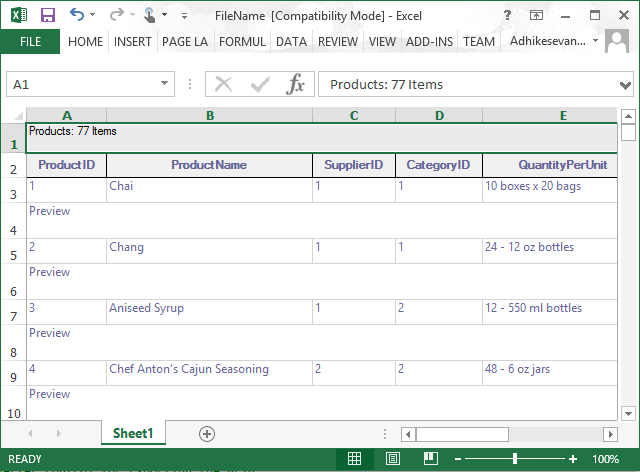

The exported record preview row can be customized by using the [QueryExportPreviewRowInfo](https://help.syncfusion.com/cr/windowsforms/Syncfusion.GroupingGridExcelConverter.GroupingGridExcelConverterControl.html) event. It will raise for each preview row element before exporting the grid.



GroupingGridExcelConverterControl converter = new GroupingGridExcelConverterControl();
converter.ExportPreviewRows = true;
converter.HeaderBackColor = Color.Orange;
converter.CaptionBackColor = Color.Lavender;

// To customize the appearance of RecordPreviewCell after exporting
converter.QueryExportPreviewRowInfo += new GroupingGridExcelConverterControl.GroupingGridExportPreviewRowQueryInfoEventHandler(converter_QueryExportPreviewRowInfo);

// Export the contents of the Grid to Excel
converter.GroupingGridToExcel(this.gridGroupingControl1, "Grid.xls", ConverterOptions.Visible);                     

private void converter_QueryExportPreviewRowInfo(object sender, GroupingGridExportPreviewRowQueryInfoEventArgs e)
{
  
    if (e.Element.Kind == DisplayElementKind.GroupPreview)
    {
        Element el = e.Element;
        e.Style.CellValue = "Preview notes for Group (" + el.ParentGroup.Name + ": " + el.ParentGroup.Category.ToString() + ")";
        e.Style.BackColor = Color.MistyRose;
        e.Handled = true;
    }

    if (e.Element.Kind == DisplayElementKind.RecordPreview)
    {
        Element el = e.Element;
        e.Style.CellValue = "Preview notes for Record (" + el.ParentTableDescriptor.Fields[0].Name + ": " + el.ParentRecord.GetValue(el.ParentTableDescriptor.Fields[0].Name) + ")";
        e.Style.BackColor = Color.MistyRose;
        e.Handled = true;
    }
}



Private converter As New GroupingGridExcelConverterControl()
converter.ExportPreviewRows = True
converter.HeaderBackColor = Color.Orange
converter.CaptionBackColor = Color.Lavender

' To customize the appearance of RecordPreviewCell after exporting
AddHandler converter.QueryExportPreviewRowInfo, AddressOf converter_QueryExportPreviewRowInfo

' Export the contents of the Grid to Excel
converter.GroupingGridToExcel(Me.gridGroupingControl1, "Grid.xls", ConverterOptions.Visible)

private void converter_QueryExportPreviewRowInfo(Object sender, GroupingGridExportPreviewRowQueryInfoEventArgs e)

    If e.Element.Kind = DisplayElementKind.GroupPreview Then
        Dim el As Element = e.Element
        e.Style.CellValue = "Preview notes for Group (" & el.ParentGroup.Name & ": " & el.ParentGroup.Category.ToString() & ")"
        e.Style.BackColor = Color.MistyRose
        e.Handled = True
    End If

    If e.Element.Kind = DisplayElementKind.RecordPreview Then
        Dim el As Element = e.Element
        e.Style.CellValue = "Preview notes for Record (" & el.ParentTableDescriptor.Fields(0).Name & ": " & el.ParentRecord.GetValue(el.ParentTableDescriptor.Fields(0).Name) & ")"
        e.Style.BackColor = Color.MistyRose
        e.Handled = True
    End If
End Sub



The grid with record preview row is shown below,

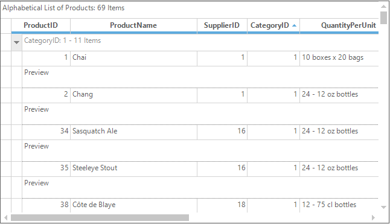

Exported preview row in excel,

### Exporting Sparkline Column
The Sparkline column or cells in the GridGroupingControl can be exported to Excel by defining the spark line groups in the excel sheet. It can be achieved by using the [ISparklineGroups](https://learn.microsoft.com/en-us/dotnet/api/microsoft.office.interop.excel.isparklinegroups?view=excel-pia) interface.

It caches the `SparklineGroup` that needs to be added to the Excel sheet. The spark lines will be appear once the user select the data range and the location range. Data range and reference range for the Sparkline in Excel can be determined and assigned in [QueryImportExportCellInfo](https://help.syncfusion.com/cr/windowsforms/Syncfusion.GridExcelConverter.GridExcelConverterBase.html#Syncfusion_GridExcelConverter_GridExcelConverterBase_QueryImportExportCellInfo) event.



GroupingGridExcelConverterControl converter = new GroupingGridExcelConverterControl();
converter.QueryImportExportCellInfo += converter_QueryImportExportCellInfo;

void converter_QueryImportExportCellInfo(object sender, GridImportExportCellInfoEventArgs e)
{

    if (e.Action == GridConverterAction.Export)
    {
        GridTableCellStyleInfoIdentity id = e.GridCell.CellIdentity as GridTableCellStyleInfoIdentity;

        if (id != null && id.Column != null && id.DisplayElement.IsRecord() &&
        e.GridCell.CellType == GridCellTypeName.Control && e.GridCell.Control is SparkLine)
        {
            ISparklineGroup sparklineGroup = e.ExcelCell.Worksheet.SparklineGroups.Add();
            sparklineGroup.SparklineType = SparklineType.Line;
            ISparklines sparklines = sparklineGroup.Add();

            //Specify your needed Column index for starting range
            string startRange = GridRangeInfo.GetAlphaLabel(e.ExcelCell.Column - 3) + e.ExcelCell.Row.ToString();

            //Specify your needed Column  index for end range
            string endRange = GridRangeInfo.GetAlphaLabel(e.ExcelCell.Column - 1) + e.ExcelCell.Row.ToString();
            IRange dataRange = e.ExcelCell.Worksheet.Range[startRange + ":" + endRange];
            IRange referenceRange = e.ExcelCell;

            //Adding Sparkline in excel sheet range
            sparklines.Add(dataRange, referenceRange);
            e.Handled = true;
        }
    }
}



Private converter As New GroupingGridExcelConverterControl()
Private converter.QueryImportExportCellInfo += AddressOf converter_QueryImportExportCellInfo
Private Sub converter_QueryImportExportCellInfo(ByVal sender As Object, ByVal e As GridImportExportCellInfoEventArgs)

    If e.Action = GridConverterAction.Export Then
        Dim id As GridTableCellStyleInfoIdentity = TryCast(e.GridCell.CellIdentity, GridTableCellStyleInfoIdentity)

        If id IsNot Nothing AndAlso id.Column IsNot Nothing AndAlso id.DisplayElement.IsRecord() AndAlso e.GridCell.CellType Is GridCellTypeName.Control AndAlso TypeOf e.GridCell.Control Is SparkLine Then
            Dim sparklineGroup As ISparklineGroup = e.ExcelCell.Worksheet.SparklineGroups.Add()
            sparklineGroup.SparklineType = SparklineType.Line
            Dim sparklines As ISparklines = sparklineGroup.Add()

            'Specify your needed Column index for starting range
            Dim startRange As String = GridRangeInfo.GetAlphaLabel(e.ExcelCell.Column - 3) + e.ExcelCell.Row.ToString()

            'Specify your needed Column  index for end range
            Dim endRange As String = GridRangeInfo.GetAlphaLabel(e.ExcelCell.Column - 1) + e.ExcelCell.Row.ToString()
            Dim dataRange As IRange = e.ExcelCell.Worksheet.Range(startRange & ":" & endRange)
            Dim referenceRange As IRange = e.ExcelCell

            'Adding Sparkline in excel sheet range
            sparklines.Add(dataRange, referenceRange)
            e.Handled = True
        End If
    End If
End Sub



The following image shows the Grid with Sparkline column,

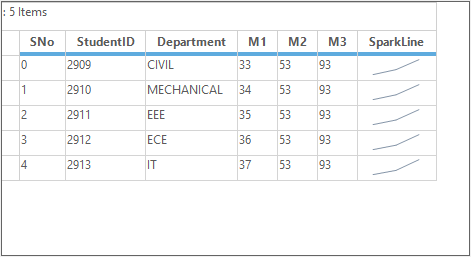

Exported Sparkline column range in Excel Sheet,

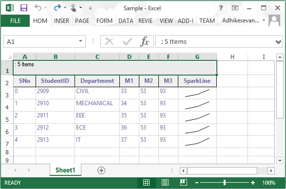

### Deriving Excel Converter
The default excel converter to export the grid to excel can be derived and customized as per the requirements. 



//Deriving the default excel converter
class CustomExcelConverter : GroupingGridExcelConverterControl  
{        
    protected override void ExportBordersToExcel(GridBorder cellBorder, Syncfusion.XlsIO.IBorder rangeBorder)
    {
        base.ExportBordersToExcel(cellBorder, rangeBorder);
    }

    protected override void ExportAlignmentToExcel(GridStyleInfo gridCell, Syncfusion.XlsIO.IRange range)
    {
        base.ExportAlignmentToExcel(gridCell, range);
    }

    protected override void ExportFontToExcel(GridStyleInfo gridCell, Syncfusion.XlsIO.IRange range)
    {
        base.ExportFontToExcel(gridCell, range);
    }

    protected override void ExportImageToExcel(GridStyleInfo gridCell, Syncfusion.XlsIO.IRange range)
    {
        base.ExportImageToExcel(gridCell, range);
    }

    protected override void ExportStylesToExcel(GridModel grid, int iRow, int iColumn, GridStyleInfo gridCell, Syncfusion.XlsIO.IRange range)
    {
        base.ExportStylesToExcel(grid, iRow, iColumn, gridCell, range);
    }

    protected override void ExportNumberFormatToExcel(GridStyleInfo gridStyle, Syncfusion.XlsIO.IRange range)
    {
        base.ExportNumberFormatToExcel(gridStyle, range);
    }

    protected override void ExportBordersToExcel(GridStyleInfo gridCell, Syncfusion.XlsIO.IRange range)
    {
          base.ExportBordersToExcel(gridCell, range);
    }
}


'Deriving the default excel converter
Friend Class CustomExcelConverter
    Inherits GroupingGridExcelConverterControl
    Protected Overrides Sub ExportBordersToExcel(ByVal cellBorder As GridBorder, ByVal rangeBorder As Syncfusion.XlsIO.IBorder)
        MyBase.ExportBordersToExcel(cellBorder, rangeBorder)
    End Sub

    Protected Overrides Sub ExportAlignmentToExcel(ByVal gridCell As GridStyleInfo, ByVal range As Syncfusion.XlsIO.IRange)
        MyBase.ExportAlignmentToExcel(gridCell, range)
    End Sub

    Protected Overrides Sub ExportFontToExcel(ByVal gridCell As GridStyleInfo, ByVal range As Syncfusion.XlsIO.IRange)
        MyBase.ExportFontToExcel(gridCell, range)
    End Sub

    Protected Overrides Sub ExportImageToExcel(ByVal gridCell As GridStyleInfo, ByVal range As Syncfusion.XlsIO.IRange)
        MyBase.ExportImageToExcel(gridCell, range)
    End Sub

    Protected Overrides Sub ExportStylesToExcel(ByVal grid As GridModel, ByVal iRow As Integer, ByVal iColumn As Integer, ByVal gridCell As GridStyleInfo, ByVal range As Syncfusion.XlsIO.IRange)
        MyBase.ExportStylesToExcel(grid, iRow, iColumn, gridCell, range)
    End Sub

    Protected Overrides Sub ExportNumberFormatToExcel(ByVal gridStyle As GridStyleInfo, ByVal range As Syncfusion.XlsIO.IRange)
        MyBase.ExportNumberFormatToExcel(gridStyle, range)
    End Sub

    Protected Overrides Sub ExportBordersToExcel(ByVal gridCell As GridStyleInfo, ByVal range As Syncfusion.XlsIO.IRange)
          MyBase.ExportBordersToExcel(gridCell, range)
    End Sub
End Class




N> The naming of the `CopyStyles` and `CopyAlignment` methods of the `GridConverterBase` is changed to `ExportBordersToExcel` and `ExportAlignmentToExcel`. 

## Advanced Excel Exporting

### Exporting Mode
By default, actual cell value will be exported to Excel. In order to export the display text, set the [ExportMode](https://help.syncfusion.com/cr/windowsforms/Syncfusion.GridExcelConverter.GridGroupingExcelConverterBase.html#Syncfusion_GridExcelConverter_GridGroupingExcelConverterBase_ExportMode) property as `Text`. Default value of this property is `Value`.



GridGroupingExcelConverterControl ExcelConverter = new GridGroupingExcelConverterControl();

//Export the display text to Excel sheet.
ExcelConverter.ExportMode = Syncfusion.GridExcelConverter.GridGroupingExcelConverterBase.ExportingMode.Text;

//Exporting Options
ExcelExportingOptions exportingOptions = new ExcelExportingOptions();

//Export the contents of the grid to Excel.
ExcelConverter.ExportToExcel(this.gridGroupingControl1, "FileName.Xlsx", exportingOptions);


Dim ExcelConverter As New GridGroupingExcelConverterControl()

'Export the display text to Excel sheet.
ExcelConverter.ExportMode = Syncfusion.GridExcelConverter.GridGroupingExcelConverterBase.ExportingMode.Text

'Exporting Options
Dim exportingOptions As New ExcelExportingOptions()

'Export the contents of the grid to Excel.
ExcelConverter.ExportToExcel(Me.gridGroupingControl1, "FileName.Xlsx", exportingOptions)



### Exporting Options

#### Exclude columns while exporting
By default, all the columns of the grid will be exported to Excel. In order to exclude some columns while exporting, the [ExcludeColumns](https://help.syncfusion.com/cr/windowsforms/Syncfusion.GroupingGridExcelConverter.ExcelExportingOptions.html#Syncfusion_GroupingGridExcelConverter_ExcelExportingOptions_ExcludeColumns) property of [ExcelExportingOptions](https://help.syncfusion.com/cr/windowsforms/Syncfusion.GroupingGridExcelConverter.ExcelExportingOptions.html) can be used.



GridGroupingExcelConverterControl ExcelConverter = new GridGroupingExcelConverterControl();

//Exporting Options
ExcelExportingOptions exportingOptions = new ExcelExportingOptions();

//Column list for exclude the columns.
List<String> Col = new List<string>();
Col.Add("ProductName");
Col.Add("SupplierID");

//Assign the Column list to ExcludeColumn option.
exportingOptions.ExcludeColumns = Col;

//Export the contents of the grid to Excel.
ExcelConverter.ExportToExcel(this.gridGroupingControl1, "FileName.Xlsx", exportingOptions);


Dim ExcelConverter As New GridGroupingExcelConverterControl()

'Exporting Options
Dim exportingOptions As New ExcelExportingOptions()

'Column list for exclude the columns.
Dim Col As New List(Of String)()
Col.Add("ProductName")
Col.Add("SupplierID")

'Assign the Column list to ExcludeColumn option.
exportingOptions.ExcludeColumns = Col

'Export the contents of the grid to Excel.
ExcelConverter.ExportToExcel(Me.gridGroupingControl1, "FileName.Xlsx", exportingOptions)



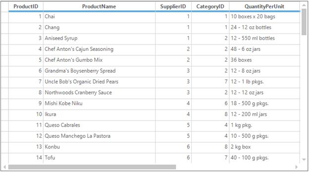

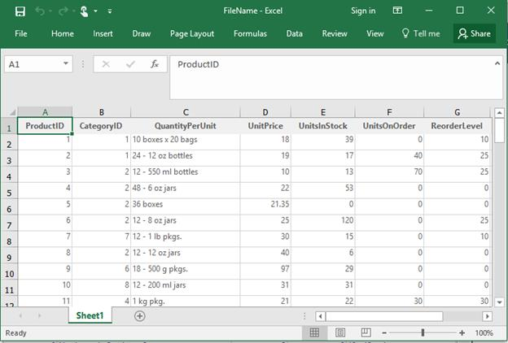

#### Export caption summary
In order to export the caption summary, the [ExportCaptionSummary](https://help.syncfusion.com/cr/windowsforms/Syncfusion.GroupingGridExcelConverter.ExcelExportingOptions.html#Syncfusion_GroupingGridExcelConverter_ExcelExportingOptions_ExportCaptionSummary) property of `ExcelExportingOptions` can be  set to `true`. Default value of this property is `true`.



GridGroupingExcelConverterControl ExcelConverter = new GridGroupingExcelConverterControl();

//Exporting Options
ExcelExportingOptions exportingOptions = new ExcelExportingOptions();

//Export Caption summary to Excel.
exportingOptions.ExportCaptionSummary = true;

//Export the contents of the grid to Excel.
ExcelConverter.ExportToExcel(this.gridGroupingControl1, "FileName.Xlsx", exportingOptions);


Dim ExcelConverter As New GridGroupingExcelConverterControl()

'Exporting Options
Dim exportingOptions As New ExcelExportingOptions()

'Export Caption summary to Excel.
exportingOptions.ExportCaptionSummary = True

'Export the contents of the grid to Excel.
ExcelConverter.ExportToExcel(Me.gridGroupingControl1, "FileName.Xlsx", exportingOptions)



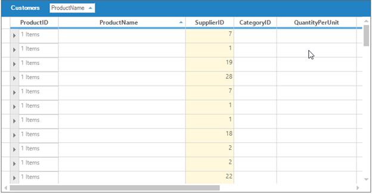

#### Export group preview row
In order to export the group preview row, the [ExportGroupPreviewRow](https://help.syncfusion.com/cr/windowsforms/Syncfusion.GroupingGridExcelConverter.ExcelExportingOptions.html#Syncfusion_GroupingGridExcelConverter_ExcelExportingOptions_ExportGroupPreviewRow) property of `ExcelExportingOptions` can be set to `true`. Default value of this property is `true`.



GridGroupingExcelConverterControl ExcelConverter = new GridGroupingExcelConverterControl();

//Exporting Options
ExcelExportingOptions exportingOptions = new ExcelExportingOptions();

//Export Group Preview Row to Excel.
exportingOptions.ExportGroupPreviewRow = true;

//Export the contents of the grid to Excel.
ExcelConverter.ExportToExcel(this.gridGroupingControl1, "FileName.Xlsx", exportingOptions);


Dim ExcelConverter As New GridGroupingExcelConverterControl()

'Exporting Options
Dim exportingOptions As New ExcelExportingOptions()

'Export Group Preview Row to Excel.
exportingOptions.ExportGroupPreviewRow = True

'Export the contents of the grid to Excel.
ExcelConverter.ExportToExcel(Me.gridGroupingControl1, "FileName.Xlsx", exportingOptions)



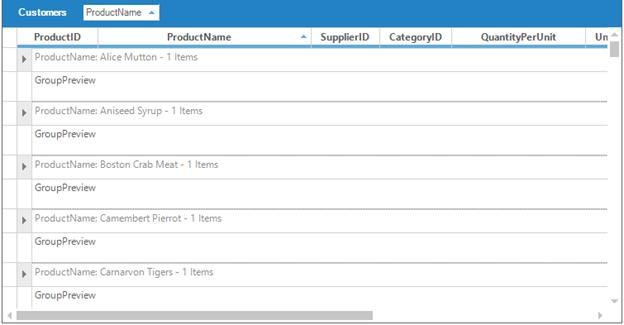

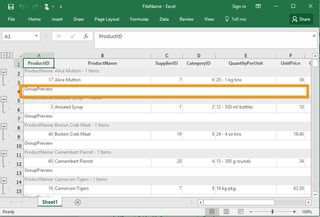

#### Export group summary
In order to export the group summary, the [ExportGroupSummary](https://help.syncfusion.com/cr/windowsforms/Syncfusion.GroupingGridExcelConverter.ExcelExportingOptions.html#Syncfusion_GroupingGridExcelConverter_ExcelExportingOptions_ExportGroupSummary) property of `ExcelExportingOptions` can be set to `true`. Default value of this property is `true`.



GridGroupingExcelConverterControl ExcelConverter = new GridGroupingExcelConverterControl();

//Exporting Options
ExcelExportingOptions exportingOptions = new ExcelExportingOptions();

//Export Grid with Group summary to Excel.
exportingOptions.ExportGroupSummary = true;

//Export the contents of the grid to Excel.
ExcelConverter.ExportToExcel(this.gridGroupingControl1, "FileName.Xlsx", exportingOptions);


Dim ExcelConverter As New GridGroupingExcelConverterControl()

'Exporting Options
Dim exportingOptions As New ExcelExportingOptions()

'Export Grid with Group summary to Excel.
exportingOptions.ExportGroupSummary = True

'Export the contents of the grid to Excel.
ExcelConverter.ExportToExcel(Me.gridGroupingControl1, "FileName.Xlsx", exportingOptions)



#### Export nested table indent
In order to export nested table with indent, the [ExportNestedTableIndent](https://help.syncfusion.com/cr/windowsforms/Syncfusion.GroupingGridExcelConverter.ExcelExportingOptions.html#Syncfusion_GroupingGridExcelConverter_ExcelExportingOptions_ExportNestedTableIndent) property of `ExcelExportingOptions` can be set to `true`. Default value of this property is `true`.



GridGroupingExcelConverterControl ExcelConverter = new GridGroupingExcelConverterControl();

//Exporting Options
ExcelExportingOptions exportingOptions = new ExcelExportingOptions();

//Export nested table with indent.
exportingOptions.ExportNestedTableIndent = true;

//Export the contents of the grid to Excel.
ExcelConverter.ExportToExcel(this.gridGroupingControl1, "FileName.Xlsx", exportingOptions);


Dim ExcelConverter As New GridGroupingExcelConverterControl()

'Exporting Options
Dim exportingOptions As New ExcelExportingOptions()

'Export nested table with indent.
exportingOptions.ExportNestedTableIndent = True

'Export the contents of the grid to Excel.
ExcelConverter.ExportToExcel(Me.gridGroupingControl1, "FileName.Xlsx", exportingOptions)



Exported grid when `ExportNestedTableIndent` = false;

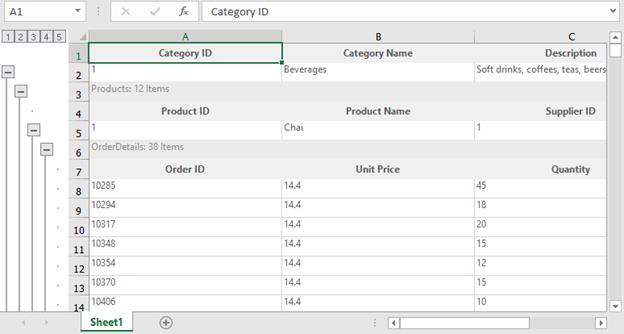

#### Export record preview row
In order to export the record preview row, the [ExportRecordPreviewRow](https://help.syncfusion.com/cr/windowsforms/Syncfusion.GroupingGridExcelConverter.ExcelExportingOptions.html#Syncfusion_GroupingGridExcelConverter_ExcelExportingOptions_ExportRecordPreviewRow) property of `ExcelExportingOptions` can be set to `true`. Default value of this property is `true`.



GridGroupingExcelConverterControl ExcelConverter = new GridGroupingExcelConverterControl();

//Exporting Options
ExcelExportingOptions exportingOptions = new ExcelExportingOptions();

//Export Grid with Record Preview Row to Excel.
exportingOptions.ExportRecordPreviewRow = true;

//Export the contents of the grid to Excel.
ExcelConverter.ExportToExcel(this.gridGroupingControl1, "FileName.Xlsx", exportingOptions);


Dim ExcelConverter As New GridGroupingExcelConverterControl()

'Exporting Options
Dim exportingOptions As New ExcelExportingOptions()

'Export Grid with Record Preview Row to Excel.
exportingOptions.ExportRecordPreviewRow = True

'Export the contents of the grid to Excel.
ExcelConverter.ExportToExcel(Me.gridGroupingControl1, "FileName.Xlsx", exportingOptions)



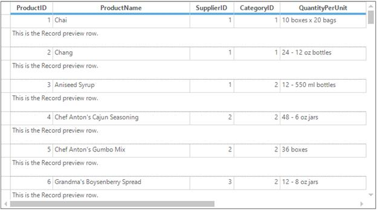

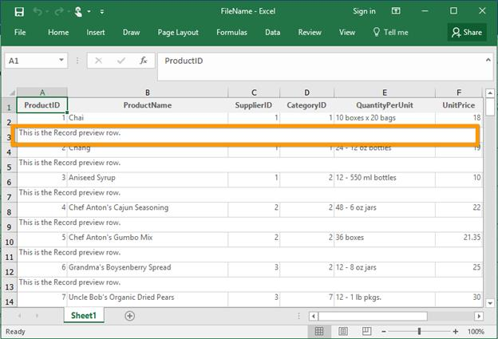

#### Export table summary
In order to export the table summary, the [ExportTableSummary](https://help.syncfusion.com/cr/windowsforms/Syncfusion.GroupingGridExcelConverter.ExcelExportingOptions.html#Syncfusion_GroupingGridExcelConverter_ExcelExportingOptions_ExportTableSummary) property of `ExcelExportingOptions` can be set to `true`. Default value of this property is `true`.



GridGroupingExcelConverterControl ExcelConverter = new GridGroupingExcelConverterControl();

//Exporting Options
ExcelExportingOptions exportingOptions = new ExcelExportingOptions();

//Export Grid with Table summary to Excel.
exportingOptions.ExportTableSummary = true;

//Export the contents of the grid to Excel.
ExcelConverter.ExportToExcel(this.gridGroupingControl1, "FileName.Xlsx", exportingOptions);


Dim ExcelConverter As New GridGroupingExcelConverterControl()

'Exporting Options
Dim exportingOptions As New ExcelExportingOptions()

'Export Grid with Table summary to Excel.
exportingOptions.ExportTableSummary = True

'Export the contents of the grid to Excel.
ExcelConverter.ExportToExcel(Me.gridGroupingControl1, "FileName.Xlsx", exportingOptions)



### Export groups with outline
In order to export groups with outline, the [AllowGroupOutlining](https://help.syncfusion.com/cr/windowsforms/Syncfusion.GroupingGridExcelConverter.GridGroupingExcelConverterControl.html#Syncfusion_GroupingGridExcelConverter_GridGroupingExcelConverterControl_AllowGroupOutlining) property of the [GridGroupingExcelConverterControl](https://help.syncfusion.com/cr/windowsforms/Syncfusion.GroupingGridExcelConverter.GridGroupingExcelConverterControl.html) can be set to `true`. Default value of this property is `true`.



GridGroupingExcelConverterControl ExcelConverter = new GridGroupingExcelConverterControl();

//Export group with outline.
ExcelConverter.AllowGroupOutlining = true;

//Exporting Options
ExcelExportingOptions exportingOptions = new ExcelExportingOptions();

//Export the contents of the grid to Excel.
ExcelConverter.ExportToExcel(this.gridGroupingControl1, "FileName.Xlsx", exportingOptions);


Dim ExcelConverter As New GridGroupingExcelConverterControl()

'Export group with outline.
ExcelConverter.AllowGroupOutlining = True

'Exporting Options
Dim exportingOptions As New ExcelExportingOptions()

'Export the contents of the grid to Excel.
ExcelConverter.ExportToExcel(Me.gridGroupingControl1, "FileName.Xlsx", exportingOptions)



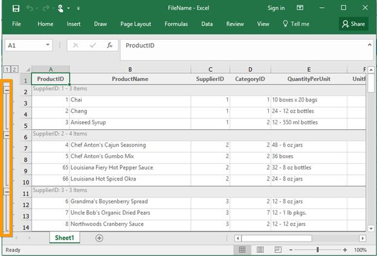

### Export nested table with outlines
In order to export nested table with outline, the [AllowNestedTableOutlining](https://help.syncfusion.com/cr/windowsforms/Syncfusion.GroupingGridExcelConverter.GridGroupingExcelConverterControl.html) property of the `GridGroupingExcelConverterControl` can be set to `true`. Default value of this property is `true`.



GridGroupingExcelConverterControl ExcelConverter = new GridGroupingExcelConverterControl();

//Export nested table with outline.
ExcelConverter.AllowNestedTableOutlining = true;

//Exporting Options
ExcelExportingOptions exportingOptions = new ExcelExportingOptions();

//Export the contents of the grid to Excel.
ExcelConverter.ExportToExcel(this.gridGroupingControl1, "FileName.Xlsx", exportingOptions);


Dim ExcelConverter As New GridGroupingExcelConverterControl()

'Export nested table with outline.
ExcelConverter.AllowNestedTableOutlining = True

'Exporting Options
Dim exportingOptions As New ExcelExportingOptions()

'Export the contents of the grid to Excel.
ExcelConverter.ExportToExcel(Me.gridGroupingControl1, "FileName.Xlsx", exportingOptions)



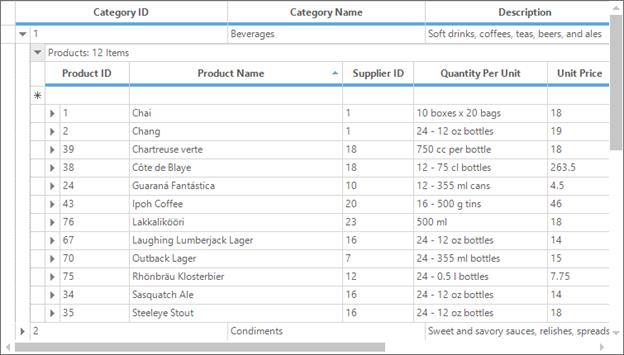

### Export the grid row height and column width
In order to export the grid’s row height and column width, [CanExportColumnWidth](https://help.syncfusion.com/cr/windowsforms/Syncfusion.GridExcelConverter.GridExcelConverterControl.html#Syncfusion_GridExcelConverter_GridExcelConverterControl_CanExportColumnWidth) and [CanExportRowHeight](https://help.syncfusion.com/cr/windowsforms/Syncfusion.GridExcelConverter.GridExcelConverterControl.html#Syncfusion_GridExcelConverter_GridExcelConverterControl_CanExportRowHeight) properties of the `GridGroupingExcelConverterControl` can be set to `true`.



GridGroupingExcelConverterControl ExcelConverter = new GridGroupingExcelConverterControl();

//Export the grid's row height and column width.
ExcelConverter.CanExportColumnWidth = true;
ExcelConverter.CanExportRowHeight = true;

//Exporting Options
ExcelExportingOptions exportingOptions = new ExcelExportingOptions();

//Export the contents of the grid to Excel.
ExcelConverter.ExportToExcel(this.gridGroupingControl1, "FileName.Xlsx", exportingOptions);


Dim ExcelConverter As New GridGroupingExcelConverterControl()

'Export the grid's row height and column width.
ExcelConverter.CanExportColumnWidth = True
ExcelConverter.CanExportRowHeight = True

'Exporting Options
Dim exportingOptions As New ExcelExportingOptions()

'Export the contents of the grid to Excel.
ExcelConverter.ExportToExcel(Me.gridGroupingControl1, "FileName.Xlsx", exportingOptions)



### Setting default row height and column width while exporting
The default row height and column width can be set for the exported Excel for columns and rows by using the [DefaultColumnWidth](https://help.syncfusion.com/cr/windowsforms/Syncfusion.GridExcelConverter.GridExcelConverterControl.html#Syncfusion_GridExcelConverter_GridExcelConverterControl_DefaultColumnWidth) and [DefaultRowHeight](https://help.syncfusion.com/cr/windowsforms/Syncfusion.GridExcelConverter.GridExcelConverterControl.html#Syncfusion_GridExcelConverter_GridExcelConverterControl_DefaultRowHeight) property of the `GridGroupingExcelConverterControl`.
This is only applicable when the `CanExportColumnWidth` and `CanExportRowHeight` properties are disabled.



GridGroupingExcelConverterControl ExcelConverter = new GridGroupingExcelConverterControl();

//Export the grid's row height and column width.
ExcelConverter.CanExportColumnWidth = true;
ExcelConverter.CanExportRowHeight = true;

//Set the row height and column width in Excel sheet.
ExcelConverter.DefaultRowHeight = 40;
ExcelConverter.DefaultColumnWidth = 40;

//Exporting Options
ExcelExportingOptions exportingOptions = new ExcelExportingOptions();

//Export the contents of the grid to Excel.
ExcelConverter.ExportToExcel(this.gridGroupingControl1, "FileName.Xlsx", exportingOptions);


Dim ExcelConverter As New GridGroupingExcelConverterControl()

'Export the grid's row height and column width.
ExcelConverter.CanExportColumnWidth = True
ExcelConverter.CanExportRowHeight = True

'Set the row height and column width in Excel sheet.
ExcelConverter.DefaultRowHeight = 40
ExcelConverter.DefaultColumnWidth = 40

'Exporting Options
Dim exportingOptions As New ExcelExportingOptions()

'Export the contents of the grid to Excel.
ExcelConverter.ExportToExcel(Me.gridGroupingControl1, "FileName.Xlsx", exportingOptions)



### Excel version
In order to specify the version of exported Excel file, the [ExcelVersion](https://help.syncfusion.com/cr/windowsforms/Syncfusion.GroupingGridExcelConverter.GridGroupingExcelConverterControl.html#Syncfusion_GroupingGridExcelConverter_GridGroupingExcelConverterControl_ExcelVersion) property of `GridGroupingExcelConverterControl` can be used.



GridGroupingExcelConverterControl ExcelConverter = new GridGroupingExcelConverterControl();

//Export the Grid to Excel 2007 version.
ExcelConverter.ExcelVersion = Syncfusion.XlsIO.ExcelVersion.Excel2007;

//Exporting Options
ExcelExportingOptions exportingOptions = new ExcelExportingOptions();

//Export the contents of the grid to Excel.
ExcelConverter.ExportToExcel(this.gridGroupingControl1, "FileName.Xlsx", exportingOptions);


Dim ExcelConverter As New GridGroupingExcelConverterControl()

'Export the Grid to Excel 2007 version.
ExcelConverter.ExcelVersion = Syncfusion.XlsIO.ExcelVersion.Excel2007

'Exporting Options
Dim exportingOptions As New ExcelExportingOptions()

'Export the contents of the grid to Excel.
ExcelConverter.ExportToExcel(Me.gridGroupingControl1, "FileName.Xlsx", exportingOptions)



### Export borders
In order to export the borders of the grid cell to Excel sheet, the [ExportBorders](https://help.syncfusion.com/cr/windowsforms/Syncfusion.GridExcelConverter.GridGroupingExcelConverterBase.html#Syncfusion_GridExcelConverter_GridGroupingExcelConverterBase_ExportBorders) property of `GridGroupingExcelConverterControl` can be used. Default value of this property is `true`.



GridGroupingExcelConverterControl ExcelConverter = new GridGroupingExcelConverterControl();

//export the borders of grid cell to Excel.
ExcelConverter.ExportBorders = true;

//Exporting Options
ExcelExportingOptions exportingOptions = new ExcelExportingOptions();

//Export the contents of the grid to Excel.
ExcelConverter.ExportToExcel(this.gridGroupingControl1, "FileName.Xlsx", exportingOptions);


Dim ExcelConverter As New GridGroupingExcelConverterControl()

'export the borders of grid cell to Excel.
ExcelConverter.ExportBorders = True

'Exporting Options
Dim exportingOptions As New ExcelExportingOptions()

'Export the contents of the grid to Excel.
ExcelConverter.ExportToExcel(Me.gridGroupingControl1, "FileName.Xlsx", exportingOptions)



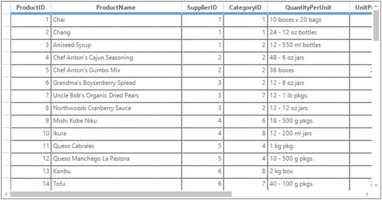

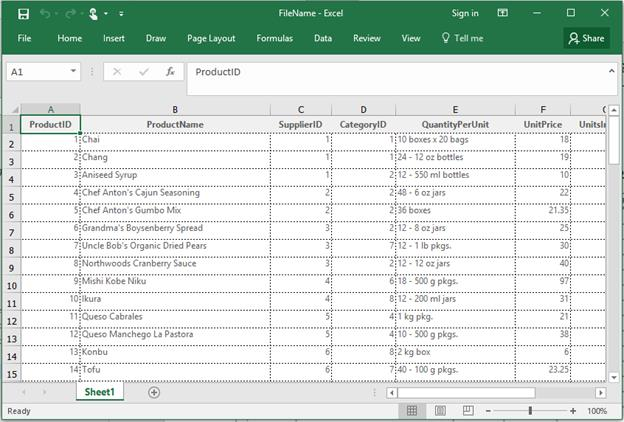

### Export nested table caption
In order to export the grid with nested table caption, the [ExportNestedTableCaption](https://help.syncfusion.com/cr/windowsforms/Syncfusion.GroupingGridExcelConverter.GridGroupingExcelConverterControl.html#Syncfusion_GroupingGridExcelConverter_GridGroupingExcelConverterControl_ExportNestedTableCaption) property of `GridGroupingExcelConverterControl` can be set to `true`. Default value of this property is `true`.



GridGroupingExcelConverterControl ExcelConverter = new GridGroupingExcelConverterControl();

//Export Nested table caption to Excel.
ExcelConverter.ExportNestedTableCaption = true;

//Exporting Options
ExcelExportingOptions exportingOptions = new ExcelExportingOptions();

//Export the contents of the grid to Excel.
ExcelConverter.ExportToExcel(this.gridGroupingControl1, "FileName.Xlsx", exportingOptions);


Dim ExcelConverter As New GridGroupingExcelConverterControl()

'Export Nested table caption to Excel.
ExcelConverter.ExportNestedTableCaption = True

'Exporting Options
Dim exportingOptions As New ExcelExportingOptions()

'Export the contents of the grid to Excel.
ExcelConverter.ExportToExcel(Me.gridGroupingControl1, "FileName.Xlsx", exportingOptions)



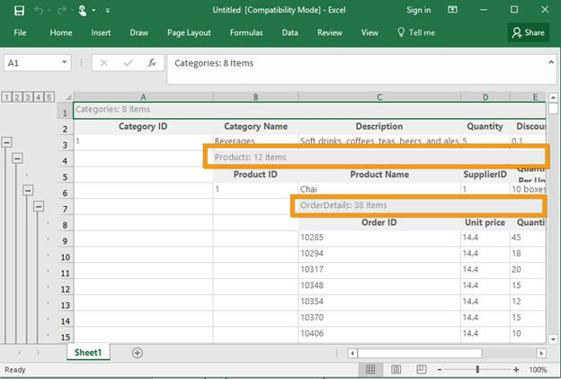

### Export grid with style 
In order to export the grid with style, the [ExportStyle](https://help.syncfusion.com/cr/windowsforms/Syncfusion.GridExcelConverter.GridGroupingExcelConverterBase.html#Syncfusion_GridExcelConverter_GridGroupingExcelConverterBase_ExportStyle) property of `GridGroupingExcelConverterControl` can be set to `true`. Default value of this property is `true`.



GridGroupingExcelConverterControl ExcelConverter = new GridGroupingExcelConverterControl();

//Export the Grid with style.
ExcelConverter.ExportStyle = true;

//Exporting Options
ExcelExportingOptions exportingOptions = new ExcelExportingOptions();

//Export the contents of the grid to Excel.
ExcelConverter.ExportToExcel(this.gridGroupingControl1, "FileName.Xlsx", exportingOptions);


Dim ExcelConverter As New GridGroupingExcelConverterControl()

'Export the Grid with style.
ExcelConverter.ExportStyle = True

'Exporting Options
Dim exportingOptions As New ExcelExportingOptions()

'Export the contents of the grid to Excel.
ExcelConverter.ExportToExcel(Me.gridGroupingControl1, "FileName.Xlsx", exportingOptions)



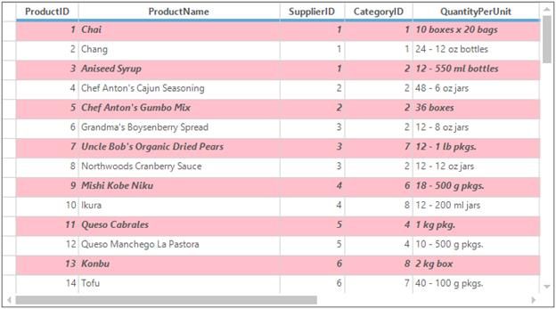

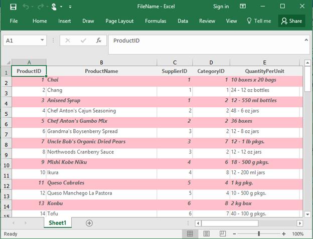

### Export gridlines
In order to export the gridlines in Excel sheet, the [ShowGridLines](https://help.syncfusion.com/cr/windowsforms/Syncfusion.GroupingGridExcelConverter.GridGroupingExcelConverterControl.html#Syncfusion_GroupingGridExcelConverter_GridGroupingExcelConverterControl_ShowGridLines) property of `GridGroupingExcelConverterControl` can be set to `true`. Default value of this property is `true`.



GridGroupingExcelConverterControl ExcelConverter = new GridGroupingExcelConverterControl();

//Export grid lines to Excel sheet.
ExcelConverter.ShowGridLines = true;

//Exporting Options
ExcelExportingOptions exportingOptions = new ExcelExportingOptions();

//Export the contents of the grid to Excel.
ExcelConverter.ExportToExcel(this.gridGroupingControl1, "FileName.Xlsx", exportingOptions);


Dim ExcelConverter As New GridGroupingExcelConverterControl()

'Export grid lines to Excel sheet.
ExcelConverter.ShowGridLines = True

'Exporting Options
Dim exportingOptions As New ExcelExportingOptions()

'Export the contents of the grid to Excel.
ExcelConverter.ExportToExcel(Me.gridGroupingControl1, "FileName.Xlsx", exportingOptions)



### Events
The following events are supported in advanced Excel exporting,

* QueryExportCellRange
* QueryExportRowRange
* QueryExportNestedTable

N> These events should be subscribed before the exporting the grid to Excel.

#### QueryExportCellRange
This event will be triggered for every cell after the cell exported. By this event, you will get the Excel range for the cell so you can customize the cell while exporting by using [QueryExportCellRange](https://help.syncfusion.com/cr/windowsforms/Syncfusion.GroupingGridExcelConverter.GridGroupingExcelConverterControl.QueryExportCellRangeEventHandler.html) event.



GridGroupingExcelConverterControl ExcelConverter = new GridGroupingExcelConverterControl();
ExcelConverter.QueryExportCellRange += ExcelConverter_QueryExportCellRange;
ExcelConverter.ExportToExcel(this.gridGroupingControl1, "Sample.xlsx", exportingOptions);

void ExcelConverter_QueryExportCellRange(object sender, Syncfusion.GroupingGridExcelConverter.QueryExportCellRangeEventArgs e)
{

   if (e.GridCell.CellIdentity.RowIndex % 2 == 0 && e.GridCell.CellIdentity.ColIndex % 2 == 0)
   {
       e.ExcelCell.CellStyle.Font.Color = Syncfusion.XlsIO.ExcelKnownColors.Blue;
       e.ExcelCell.CellStyle.Color = Color.SandyBrown;
        e.ExcelCell.CellStyle.Borders.Color = Syncfusion.XlsIO.ExcelKnownColors.Black;
   }
}


Dim ExcelConverter As New GridGroupingExcelConverterControl()
AddHandler ExcelConverter.QueryExportCellRange, AddressOf ExcelConverter_QueryExportCellRange
ExcelConverter.ExportToExcel(Me.gridGroupingControl1, "Sample.xlsx", exportingOptions)

Private Sub ExcelConverter_QueryExportCellRange(ByVal sender As Object, ByVal e As Syncfusion.GroupingGridExcelConverter.QueryExportCellRangeEventArgs)

    If e.GridCell.CellIdentity.RowIndex Mod 2 = 0 AndAlso e.GridCell.CellIdentity.ColIndex Mod 2 = 0 Then
        e.ExcelCell.CellStyle.Font.Color = Syncfusion.XlsIO.ExcelKnownColors.Blue
        e.ExcelCell.CellStyle.Color = Color.SandyBrown
        e.ExcelCell.CellStyle.Borders.Color = Syncfusion.XlsIO.ExcelKnownColors.Black
    End If
End Sub



#### QueryExportRowRange
This event will be triggered before exporting a row. If you want to avoid specific row while exporting, you can achieve this by handling the [QueryExportRowRange](https://help.syncfusion.com/cr/windowsforms/Syncfusion.GroupingGridExcelConverter.GridGroupingExcelConverterControl.QueryExportRowRangeEventHandler.html) event.



GridGroupingExcelConverterControl ExcelConverter = new GridGroupingExcelConverterControl();
ExcelConverter.QueryExportRowRange += ExcelConverter_QueryExportRowRange;
ExcelConverter.ExportToExcel(this.gridGroupingControl1, "Sample.xlsx", exportingOptions);

void ExcelConverter_QueryExportRowRange(object sender, Syncfusion.GroupingGridExcelConverter.QueryExportRowRangeEventArgs e)
{

    if (e.Element.Kind == Syncfusion.Grouping.DisplayElementKind.Record 
        && this.gridGroupingControl2.Table.Records.IndexOf(e.Element.GetRecord()) % 3 == 0)
        e.Cancel = true;
}



Private ExcelConverter As New GridGroupingExcelConverterControl()
AddHandler ExcelConverter.QueryExportRowRange, AddressOf ExcelConverter_QueryExportRowRange
ExcelConverter.ExportToExcel(Me.gridGroupingControl1, "Sample.xlsx", exportingOptions)

Private Sub ExcelConverter_QueryExportRowRange(sender As Object, e As Syncfusion.GroupingGridExcelConverter.QueryExportRowRangeEventArgs)	

       If e.Element.Kind Is Syncfusion.Grouping.DisplayElementKind.Record AndAlso        Me.gridGroupingControl2.Table.Records.IndexOf(e.Element.GetRecord()) Mod 3 = 0 Then
            e.Cancel = True
       End If
End Sub


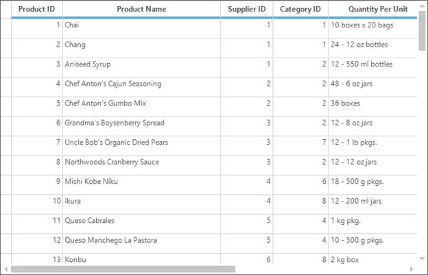

#### QueryExportNestedTable
This event will be triggered before exporting a nested table. By this event, you can get the `ExportingOptions`, `NestedTable` and `ParentRecord`.
If you want to hide the empty child table, you can use the [Cancel](https://learn.microsoft.com/en-us/dotnet/api/system.componentmodel.canceleventargs.cancel?view=net-5.0) property the [QueryExportNestedTable](https://help.syncfusion.com/cr/windowsforms/Syncfusion.GroupingGridExcelConverter.GridGroupingExcelConverterControl.html) event of `GridGroupingExcelConverterControl` by checking the **Records** count.



GridGroupingExcelConverterControl ExcelConverter = new GridGroupingExcelConverterControl();
ExcelConverter.QueryExportNestedTable += ExcelConverter_QueryExportNestedTable;
ExcelConverter.ExportToExcel(this.gridGroupingControl1, "Sample.xlsx", exportingOptions);

void ExcelConverter_QueryExportNestedTable(object sender, Syncfusion.GroupingGridExcelConverter.ExportNestedTableEventArgs e)
{
 
    // Hide the empty elements being exported to Excel. 
 
    if (e.NestedTable.Records.Count == 0)
        e.Cancel = true;
}




Private ExcelConverter As New GridGroupingExcelConverterControl()
AddHandler ExcelConverter.QueryExportNestedTable, AddressOf ExcelConverter_QueryExportNestedTable
ExcelConverter.ExportToExcel(Me.gridGroupingControl1, "Sample.xlsx", exportingOptions)

Private Sub ExcelConverter_QueryExportNestedTable(Object sender, Syncfusion.GroupingGridExcelConverter.ExportNestedTableEventArgs e)

    ' Hide the empty elements being exported to Excel. 

    If e.NestedTable.Records.Count = 0 Then
       e.Cancel = True
    End If
End Sub



### Efficient Exporting
By default, the grid will be exported with all the elements when the [ExportStyle](https://help.syncfusion.com/cr/windowsforms/Syncfusion.GridExcelConverter.GridGroupingExcelConverterBase.html#Syncfusion_GridExcelConverter_GridGroupingExcelConverterBase_ExportStyle) is enabled. Since the style has to be taken from [GridStyleInfo](https://help.syncfusion.com/cr/windowsforms/Syncfusion.Windows.Forms.Grid.GridStyleInfo_events.html) store for each and every cell, it leads to some amount of memory consumption while exporting large amount of records with styling.
To resolve this kind of issue, use the [EnableOptimization](https://help.syncfusion.com/cr/windowsforms/Syncfusion.GroupingGridExcelConverter.GridGroupingExcelConverterControl.html#Syncfusion_GroupingGridExcelConverter_GridGroupingExcelConverterControl_EnableOptimization) property. The basic idea behind in this is, the cell value will be taken from[Table.Records](https://help.syncfusion.com/cr/windowsforms/Syncfusion.Windows.Forms.Grid.Grouping.GridChildTable.html) instead of taking it from the `GridStyleInfo`. Therefore, the performance of exporting has improved much more than exporting with styling.
The column formats which are all set using the `Column.Appearance.AnyRecordFieldCell.Format` property will be applied to columns.



GridGroupingExcelConverterControl ExcelConverter = new GridGroupingExcelConverterControl();

// Exporting the data without creating style object ExcelConverter.EnableOptimization = true; ExcelConverter.ExportToExcel(this.gridGroupingControl1, "Sample.xlsx", exportingOptions);


Dim ExcelConverter As New GridGroupingExcelConverterControl()

' Exporting the data without creating style object ExcelConverter.EnableOptimization = true; ExcelConverter.ExportToExcel(this.gridGroupingControl1, "Sample.xlsx", exportingOptions);



#### Limitations
* As styles are not created for each and every cell, the values which are set using [QueryCellStyleInfo](https://help.syncfusion.com/cr/windowsforms/Syncfusion.Windows.Forms.Grid.Grouping.GridTable.html) or [PrepareViewStyleInfo](https://help.syncfusion.com/cr/windowsforms/Syncfusion.Windows.Forms.Grid.GridControlBase.html) event will not be exported to Excel sheet. The value which are all available in Records collection can be exported to Excel sheet if `EnableOptimization` property is enabled.
* Since styles are not available for `EnableOptimization` exporting, the [GridCell](https://help.syncfusion.com/cr/windowsforms/Syncfusion.GroupingGridExcelConverter.QueryExportCellRangeEventArgs.html#Syncfusion_GroupingGridExcelConverter_QueryExportCellRangeEventArgs_GridCell) property or grid cell style will be `null` when you are using [QueryExportCellRange](https://help.syncfusion.com/cr/windowsforms/Syncfusion.GroupingGridExcelConverter.GridGroupingExcelConverterControl.html) event and only Excel range will be available for customization.

N> For more information refer to the below dashboard sample,
&lt;Installation_Location&gt;\Syncfusion\EssentialStudio\&lt;Product_Version&gt;\Windows\Grid.Grouping.Windows\Samples\Exporting\Excel Exporting Demo\

## PDF Export
The GridGroupingControl can export to the PDF document by using the [ExportToPdf](https://help.syncfusion.com/cr/windowsforms/Syncfusion.GridHelperClasses.GridPDFConverter.html#Syncfusion_GridHelperClasses_GridPDFConverter_ExportToPdf_Syncfusion_Pdf_PdfDocument_Syncfusion_Windows_Forms_Grid_GridControlBase_) method of the [GridPDFConverter](https://help.syncfusion.com/cr/windowsforms/Syncfusion.GridHelperClasses.GridPDFConverter.html) class. To ensure the conversion of grid data to PDF document, the following assemblies should be added to the reference folder,

* Syncfusion.Pdf.Base
* Syncfusion.GridHelperClasses.Windows



GridPDFConverter pdfConvertor = new GridPDFConverter();

// Export the contents of the Grid to Pdf
pdfConvertor.ExportToPdf("Sample.pdf", this.gridGroupingControl1.TableControl);


Dim pdfConvertor As New GridPDFConverter()

' Export the contents of the Grid to Pdf
pdfConvertor.ExportToPdf("Sample.pdf", Me.gridGroupingControl1.TableControl)



### Adding Header/Footer
The grid can be exported with the header/footer to the PDF document by enabling the `ShowHeader` and `ShowFooter` properties of the `GridPDFConverter`. The DrawPDFHeader and DrawPDFFooter events are used to customize the header and footer section of the PDF document. 



//Create pdf converter
GridPDFConverter pdfConverter = new GridPDFConverter();

//Enable exporting of header and footer
pdfConverter.ShowHeader = true;
pdfConverter.ShowFooter = true;

//Invoke this events to draw the text in header/footer
pdfConverter.DrawPDFHeader += pdfConverter_DrawPDFHeader;
pdfConverter.DrawPDFFooter += pdfConverter_DrawPDFFooter;
pdfConverter.ExportToPdf("Sample.pdf", this.gridGroupingControl1.TableControl);

void pdfConverter_DrawPDFHeader(object sender, PDFHeaderFooterEventArgs e)
{
    PdfPageTemplateElement header = e.HeaderFooterTemplate;
    PdfSolidBrush brush = new PdfSolidBrush(Color.FromArgb(44, 71, 120));
    PdfFont font = new PdfStandardFont(PdfFontFamily.Helvetica, 16, PdfFontStyle.Bold);

    //Set formatting's for the text
    PdfStringFormat format = new PdfStringFormat();
    format.Alignment = PdfTextAlignment.Center;
    format.LineAlignment = PdfVerticalAlignment.Middle;

    //Draw title
    header.Graphics.DrawString("Syncfusion Essential PDF", font, brush, new RectangleF(0, 0, header.Width, header.Height), format);           
}

void pdfConverter_DrawPDFFooter(object sender, PDFHeaderFooterEventArgs e)
{
    PdfPageTemplateElement footer = e.HeaderFooterTemplate;
    PdfSolidBrush brush = new PdfSolidBrush(Color.Gray);
    PdfFont font = new PdfStandardFont(PdfFontFamily.Helvetica, 6, PdfFontStyle.Bold);
    PdfStringFormat format = new PdfStringFormat();
    format.Alignment = PdfTextAlignment.Center;
    format.LineAlignment = PdfVerticalAlignment.Top;
    footer.Graphics.DrawString("@Copyright 2015", font, brush, new RectangleF(0, footer.Height - 40, footer.Width, footer.Height), format);

}


'Create pdf converter
Private pdfConverter As New GridPDFConverter()

'Enable exporting of header and footer
pdfConverter.ShowHeader = True
pdfConverter.ShowFooter = True

'Invoke this events to draw the text in header/footer
AddHandler pdfConverter.DrawPDFHeader, AddressOf pdfConverter_DrawPDFHeader
AddHandler pdfConverter.DrawPDFFooter, AddressOf pdfConverter_DrawPDFFooter
pdfConverter.ExportToPdf("Sample.pdf", Me.gridGroupingControl1.TableControl)

Private Sub pdfConverter_DrawPDFHeader(ByVal sender As Object, ByVal e As PDFHeaderFooterEventArgs)
    Dim header As PdfPageTemplateElement = e.HeaderFooterTemplate
    Dim brush As New PdfSolidBrush(Color.FromArgb(44, 71, 120))
    Dim font As PdfFont = New PdfStandardFont(PdfFontFamily.Helvetica, 16, PdfFontStyle.Bold)

    'Set formatting's for the text
    Dim format As New PdfStringFormat()
    format.Alignment = PdfTextAlignment.Center
    format.LineAlignment = PdfVerticalAlignment.Middle

    'Draw title
    header.Graphics.DrawString("Syncfusion Essential PDF", font, brush, New RectangleF(0, 0, header.Width, header.Height), format)
End Sub
Private Sub pdfConverter_DrawPDFFooter(ByVal sender As Object, ByVal e As PDFHeaderFooterEventArgs)
    Dim footer As PdfPageTemplateElement = e.HeaderFooterTemplate
    Dim brush As New PdfSolidBrush(Color.Gray)
    Dim font As PdfFont = New PdfStandardFont(PdfFontFamily.Helvetica, 6, PdfFontStyle.Bold)
    Dim format As New PdfStringFormat()
    format.Alignment = PdfTextAlignment.Center
    format.LineAlignment = PdfVerticalAlignment.Top
    footer.Graphics.DrawString("@Copyright 2015", font, brush, New RectangleF(0, footer.Height - 40, footer.Width, footer.Height), format)
End Sub



N> The header/footer height of the exported PDF document can be set by using the `HeaderHeight` and `FooterHeight` properties of the PDF converter.

### Merging with PDF document 
The GridGroupingControl can be exported to the PDF document using [ExportToPdfWithMerge](https://help.syncfusion.com/cr/windowsforms/Syncfusion.GridHelperClasses.GridPDFConverter.html#Syncfusion_GridHelperClasses_GridPDFConverter_ExportToPdfWithMerge_Syncfusion_Pdf_PdfDocument__Syncfusion_Windows_Forms_Grid_GridControlBase_) method. The[GridPDFConverter](https://help.syncfusion.com/cr/windowsforms/Syncfusion.GridHelperClasses.GridPDFConverter.html) does not have support to export the grid which has more than 60000 records. It will throw the `OutOfMemoryException` when exporting.  To resolve this exception, the grid can be exported as two or more documents and merging them to single document using this technique. The number of records to be exported can be determined by using [ExportRange](https://help.syncfusion.com/cr/windowsforms/Syncfusion.GridHelperClasses.GridPDFConverter.html#Syncfusion_GridHelperClasses_GridPDFConverter_ExportRange) property.



//Create PDF converter 
GridPDFConverter pdfConverter = new GridPDFConverter();

//First 40000 records will be exported
pdfConverter.ExportRange = 40000;

//Exporting and merging with another PDF document
pdfConverter.ExportToPdfWithMerge("Sample1.pdf", this.gridGroupingControl1.TableControl);


'Create PDF converter 
Dim pdfConverter As New GridPDFConverter()

'First 40000 records will be exported
pdfConverter.ExportRange = 40000

'Exporting and merging with another PDF document
pdfConverter.ExportToPdfWithMerge("Sample1.pdf", Me.gridGroupingControl1.TableControl)



### Events
The `GridPDFConverter` provides support to customize the exporting actions through events. The [Exporting](https://help.syncfusion.com/cr/windowsforms/Syncfusion.GridHelperClasses.GridPDFConverter.html) and [Exported](https://help.syncfusion.com/cr/windowsforms/Syncfusion.GridHelperClasses.GridPDFConverter.html) events of the converter is used to notify the PDF exporting of the grid.



//Create PDF converter 
GridPDFConverter pdfConverter = new GridPDFConverter();

//Used to perform the action while exporting the Grid
pdfConverter.Exporting += new GridPDFConverter.PDFExportingEventHandler(pdfConverter_Exporting);
pdfConverter.Exported += new GridPDFConverter.PDFExportedEventHandler(pdfConverter_Exported);

private void pdfConverter_Exporting(object sender, PDFExportingEventArgs e)
{

     // Getting the pdf document
     PdfDocument pdfDocument = e.PdfDocument;

      // To-Do
}

private void pdfConverter_Exported(object sender, PDFExportedEventArgs e)
{

      // Getting the pdf document
     PdfDocument pdfDocument = e.PdfDocument;

     // To-Do
}



'Create PDF converter 
Private pdfConverter As New GridPDFConverter()

'Used to perform the action while exporting the Grid
Private pdfConverter.Exporting += New GridPDFConverter.PDFExportingEventHandler(AddressOf pdfConverter_Exporting)
Private pdfConverter.Exported += New GridPDFConverter.PDFExportedEventHandler(AddressOf pdfConverter_Exported)

Private Sub pdfConverter_Exporting(ByVal sender As Object, ByVal e As PDFExportingEventArgs)

     ' Getting the pdf document
     Dim pdfDocument As PdfDocument = e.PdfDocument

      ' To-Do

End Sub

Private Sub pdfConverter_Exported(ByVal sender As Object, ByVal e As PDFExportedEventArgs)

      ' Getting the pdf document
     Dim pdfDocument As PdfDocument = e.PdfDocument

     ' To-Do
End Sub




## Word Converter
The GridGroupingControl data can be exported to the word by using the [GroupingGridToWord](https://help.syncfusion.com/cr/windowsforms/Syncfusion.GridHelperClasses.GroupingGridWordConverter.html#Syncfusion_GridHelperClasses_GroupingGridWordConverter_GroupingGridToWord_Syncfusion_Windows_Forms_Grid_Grouping_GridGroupingControl_Syncfusion_DocIO_DLS_WordDocument_) method of the [GroupingGridWordConverter](https://help.syncfusion.com/cr/windowsforms/Syncfusion.GridHelperClasses.GroupingGridWordConverter.html). 



GroupingGridWordConverter converter = new GroupingGridWordConverter();

// Export the contents of the Grid To Word
converter.GroupingGridToWord("Grid.doc", this.gridGroupingControl1);


Dim converter As New GroupingGridWordConverter()

' Export the contents of the Grid To Word
converter.GroupingGridToWord("Grid.doc", Me.gridGroupingControl1)


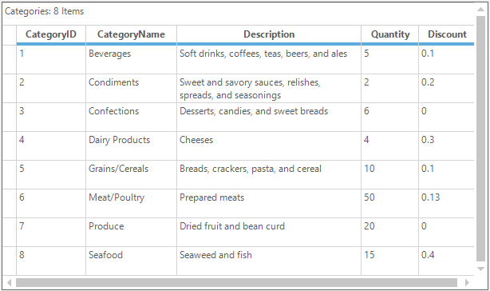

The following images shows exported grid in the word document,
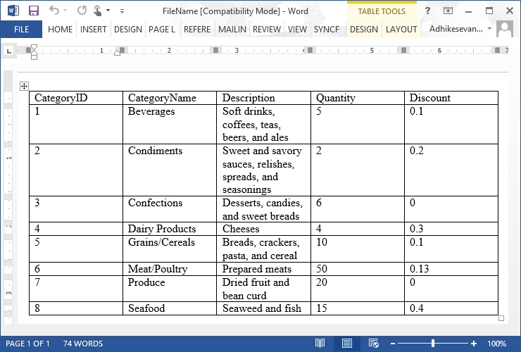

### Exporting with Styles
The styles of the GridGroupingControl can be exported to the grid by setting the `ExportStyle` property to `true`.



GroupingGridWordConverter wordConverter = new GroupingGridWordConverter();

//Export the Style of the grid to word
wordConverter.ExportStyle = true;
wordConverter.GroupingGridToWord("FileName.doc", this.gridGroupingControl1);


Dim wordConverter As New GroupingGridWordConverter()

'Export the Style of the grid to word
wordConverter.ExportStyle = True
wordConverter.GroupingGridToWord("FileName.doc", Me.gridGroupingControl1)



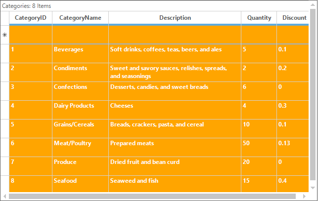

The exported grid with the styles in the word documents is shown below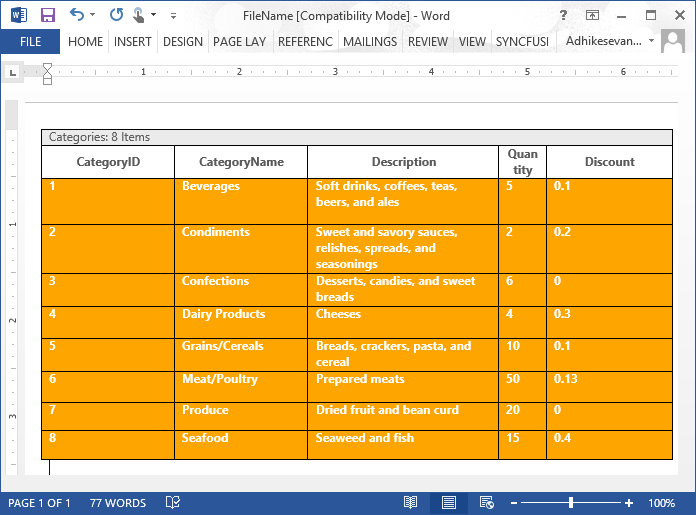

### Exporting with Header and Footer
The GridGroupingControl can be exported to the word with the headers and footers by enabling the `ShowHeader` and `ShowFooter` properties of the word converter. The desired text can be placed on the header and footer by handling the `DrawHeader` and `DrawFooter` events.



GroupingGridWordConverter wordConverter = new GroupingGridWordConverter();

//Export the grid to word document
wordConverter.ShowFooter = true;
wordConverter.ShowHeader = true;

//Set the text for header and footer
wordConverter.DrawHeader += wordConverter_DrawHeader;
wordConverter.DrawFooter += wordConverter_DrawFooter;
wordConverter.GroupingGridToWord("FileName.doc", this.gridGroupingControl1);

void wordConverter_DrawHeader(object sender, DocHeaderFooterEventArgs e)
{            
    e.Header.AddParagraph().AppendText("Syncfusion Inc.");            
}

void wordConverter_DrawFooter(object sender, DocHeaderFooterEventArgs e)
{
    e.Footer.AddParagraph().AppendText("Copyright 2001-2015");
}


Private wordConverter As New GroupingGridWordConverter()

'Export the grid to word document
wordConverter.ShowFooter = True
wordConverter.ShowHeader = True

'Set the text for header and footer
AddHandler wordConverter.DrawHeader, AddressOf wordConverter_DrawHeader
AddHandler wordConverter.DrawFooter, AddressOf wordConverter_DrawFooter
wordConverter.GroupingGridToWord("FileName.doc", Me.gridGroupingControl1)

void wordConverter_DrawHeader(Object sender, DocHeaderFooterEventArgs e)
    e.Header.AddParagraph().AppendText("Syncfusion Inc.")

void wordConverter_DrawFooter(Object sender, DocHeaderFooterEventArgs e)
    e.Footer.AddParagraph().AppendText("Copyright 2001-2015")




### Deriving Word Converter 
The word converter can be customized the exporting of grid to word by overriding its virtual methods. The protected virtual methods of the `GroupingGridToWordConverter` such as `OnDrawFooter`, `OnDrawHeader`, etc., is used to 



//Deriving the word converter 
class CustomWordConverter : GridWordConverterBase   
{

    protected override void OnDrawFooter(DocHeaderFooterEventArgs e)
    {
        base.OnDrawFooter(e);
    }

    protected override void OnDrawHeader(DocHeaderFooterEventArgs e)
    {
        base.OnDrawHeader(e);
    }

    public override string ToString()
    {
        return base.ToString();
    }

    //...
}


'Deriving the word converter 
Friend Class CustomWordConverter
    Inherits GridWordConverterBase

    Protected Overrides Sub OnDrawFooter(ByVal e As DocHeaderFooterEventArgs)
        MyBase.OnDrawFooter(e)
    End Sub

    Protected Overrides Sub OnDrawHeader(ByVal e As DocHeaderFooterEventArgs)
        MyBase.OnDrawHeader(e)
    End Sub

    Public Overrides Function ToString() As String
        Return MyBase.ToString()
    End Function

    '...
End Class



## CSV Export
The GridGroupingControl can be exported to the CSV format by using the [GridCSVConverter](https://help.syncfusion.com/cr/windowsforms/Syncfusion.GridHelperClasses.GridCSVConverter.html). It will export only the data without the styles. 



GridCSVConverter csvConverter = new GridCSVConverter();

//Exporting to CSV format
csvConverter.GridToCSV(this.gridGroupingControl1.TableModel, "Sample.csv");



Dim csvConverter As New GridCSVConverter()

'Exporting to CSV format
csvConverter.GridToCSV(Me.gridGroupingControl1.TableModel, "Sample.csv")



### Exporting the Range of Cells
The range of cells can be exported from the grid to excel as the [CSV](https://learn.microsoft.com/en-us/previous-versions/azure/machine-learning/studio-module-reference/convert-to-csv) format by using the [ExportRange](https://help.syncfusion.com/cr/windowsforms/Syncfusion.GridHelperClasses.GridCSVConverter.html#Syncfusion_GridHelperClasses_GridCSVConverter_ExportRange_Syncfusion_Windows_Forms_Grid_GridRangeInfo_Syncfusion_Windows_Forms_Grid_GridModel_System_String_) method.



GridCSVConverter csvConverter = new GridCSVConverter();
int rowIndex = this.gridGroupingControl1.TableControl.TopRowIndex;

//Export the range of rows to CSV format
csvConverter.ExportRange(GridRangeInfo.Rows(rowIndex, rowIndex + 3), this.gridGroupingControl1.TableModel, "Sample.csv");


Dim csvConverter As New GridCSVConverter()
Dim rowIndex As Integer = Me.gridGroupingControl1.TableControl.TopRowIndex

'Export the range of rows to CSV format
csvConverter.ExportRange(GridRangeInfo.Rows(rowIndex, rowIndex + 3), Me.gridGroupingControl1.TableModel, "Sample.csv")



### Exporting Selected Range of Cells
The selected range of cells can be exported to the CSV format by using the [SelectedExport](https://help.syncfusion.com/cr/windowsforms/Syncfusion.GridHelperClasses.GridCSVConverter.html#Syncfusion_GridHelperClasses_GridCSVConverter_SelectedExport_Syncfusion_Windows_Forms_Grid_GridModel_System_String_) method. This can only export the model based selection. Therefore enable the[range selection](https://help.syncfusion.com/windowsforms/gridgrouping/selections#model-based-selection) for the grid.



GridCSVConverter csvConverter = new GridCSVConverter();

//Export selected range of cells to CSV format
csvConverter.SelectedExport(this.gridGroupingControl1.TableModel, "Sample.csv");


Dim csvConverter As New GridCSVConverter()

'Export selected range of cells to CSV format
csvConverter.SelectedExport(Me.gridGroupingControl1.TableModel, "Sample.csv")


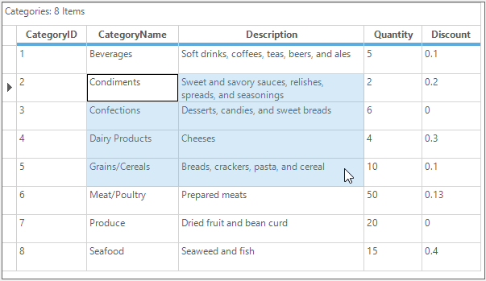

The exported range of cells to the CSV format in the excel file,

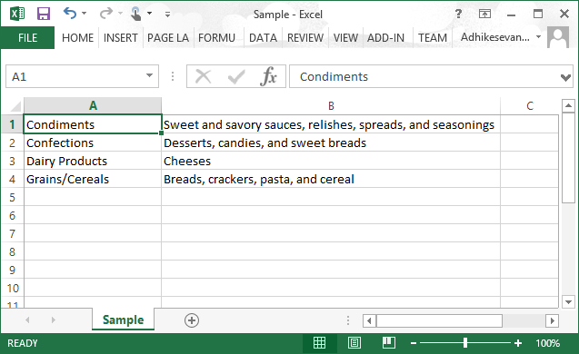
