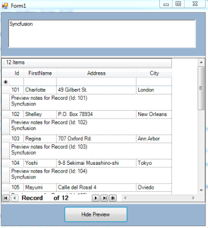

# How to Make Use of the Journal Control in WinForms GridGroupingControl

You can use GridGroupingControl, TextBox, RecordNavigationBar and Button control to make use of Journal control. GridGroupingControl is designed as a grid to bind the data source. The navigation bar is used to browse the records in the grid. The navigation bar can be enabled by setting ShowNavigationBar property as true. Preview operation can be performed through Button control. QueryCellInfo event is used to display text box value in the preview cell.

<table>
<tr>
<th>
PROPERTIES</th><th>
DESCRIPTION</th></tr>
<tr>
<td>
ShowNavigationBar</td><td>
Describes whether to show the Navigation Bar.</td></tr>
<tr>
<td>
ShowRecordPreviewRow</td><td>
Indicates whether the nested table has preview row.</td></tr>
</table>
The following code example illustrates how to make use of Journal control using GridGrouping controls.




this.gridGroupingControl1.ShowNavigationBar = true;

// Button control
this.gridGroupingControl1.TableOptions.ShowRecordPreviewRow = !this.gridGroupingControl1.TableOptions.ShowRecordPreviewRow;

// Event Handler 
this.gridGroupingControl1.QueryCellStyleInfo += new Syncfusion.Windows.Forms.Grid.Grouping.GridTableCellStyleInfoEventHandler(gridGroupingControl1_QueryCellStyleInfo);

void gridGroupingControl1_QueryCellStyleInfo(object sender, Syncfusion.Windows.Forms.Grid.Grouping.GridTableCellStyleInfoEventArgs e)
{
    if (e.TableCellIdentity.TableCellType == GridTableCellType.RecordPreviewCell)
    {
        Element el = e.TableCellIdentity.DisplayElement;
        e.Style.CellValue = richTextBox1.Text;
    }
}





Private Me.gridGroupingControl1.ShowNavigationBar = True

// Button control
Me.gridGroupingControl1.TableOptions.ShowRecordPreviewRow = Not Me.gridGroupingControl1.TableOptions.ShowRecordPreviewRow

// Event Handler 
Private Me.gridGroupingControl1.QueryCellStyleInfo += New Syncfusion.Windows.Forms.Grid.Grouping.GridTableCellStyleInfoEventHandler(AddressOf gridGroupingControl1_QueryCellStyleInfo)
Private Sub gridGroupingControl1_QueryCellStyleInfo(ByVal sender As Object, ByVal e As Syncfusion.Windows.Forms.Grid.Grouping.GridTableCellStyleInfoEventArgs)
If e.TableCellIdentity.TableCellType = GridTableCellType.RecordPreviewCell Then
Dim el As Element = e.TableCellIdentity.DisplayElement
e.Style.CellValue = richTextBox1.Text
End If
End Sub



