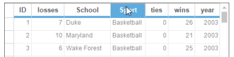
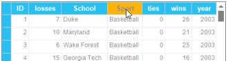

# How to Use OLD Metro Style in WinForms GridGroupingControl

Starting from Essential Studio, Volume 4, 2013(V11.40.26), Metro Theme is available with newer styles.  For any version earlier than Volume 4, 2013, you can use old metro style in your grid using new class OldMetroStyle. Using the new class, you can apply all the controls in form with static method “ApplyStyle”. You can also pass GridControl, GridGroupingControl, or GridDataBoundGrid control in this method.

The following code example illustrates how to add the Old Metro Style in Grid control.




 OldMetroStyle.ApplyStyle(this. gridControl1);





 OldMetroStyle.ApplyStyle(Me.gridControl1)
 
 


 You can download the sample that uses a Old metro style in the Grid from the following location.

[http://www.syncfusion.com/downloads/support/directtrac/119651/OldMetroStyle1845477900.zip](http://www.syncfusion.com/downloads/support/directtrac/119651/OldMetroStyle1845477900.zip)

The following screen shot shows a new metro theme in Grid.

The following screen shot shows an Old metro theme in Grid.

