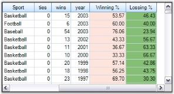
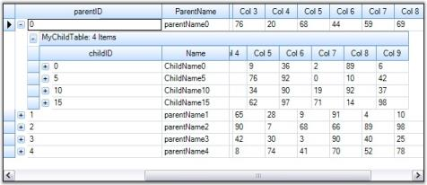

# Feature Summary in Windows Forms GridGrouping control

Essential® Grid Grouping control possesses advanced features such as Outlook style grouping and is highly optimized to handle large amount of data. This section lists various features of grid grouping control in brief.

* Filter by Display Member: Filter by Display Member is a new addition to Grid Helper Utilities. It allows filtering of grid data by Display Member instead of Value Member. With this feature, filter bar's drop-down lists the display member strings of the filtering column instead of its value member strings. You can use this feature with both Grid Data Bound Grid and Grid Grouping control.

  

  

* Data Binding: The grid grouping control supports variety of data sources used to automatically populate the grid with data. It has full ADO+ support and also allows any component that implements IList, IBindingList, ITypedList, or IListSource interface. It also supports unbound mode.

  

* Data Relations: The grid can display data from multiple tables at once forming hierarchical relationship. It also provides support to manually add relations.

  

* Grouping: Grid data can be arranged based on matching field values to form groups. Essential® Grid supports nested grouping by hierarchically combining the groups in different levels. The number of levels of grouping is unlimited.

  

* Summaries: The grid allows you to add summary rows that is used to display brief information about groups or specific columns. It is also possible to add user defined summaries.

  

* Filters: The grid grouping control has in-built support for FilterBar. The filter bar can be used to display a subset of records that satisfies user-defined criteria.

  

* Sorting: Grid Grouping control allows you to sort the data against an unlimited number of columns either in ascending or in descending order. When editing is done, the record values will be adjusted automatically to maintain the sorting order.

  

* Expression Fields: Expression fields facilitate inclusion of columns with formula expressions.

  

* Unbound Fields: Grid Grouping control can have unbound fields with custom values using which you can evaluate the field values at runtime similar to Expression Fields.

 

* Preview Rows: It is possible to add preview section for each group or record. The preview rows can be enabled when you want to display memo fields or some notes for a given group or record.

  

* Frozen Columns: This feature will allow you to lock specific columns so that they will always be visible on the screen no matter how far you scroll to the right or down.

  

* Stacked MultiHeaders: This feature allows you to create additional header rows that span across visible grid columns. You can group columns under each header row. It also supports drag and drop of these header rows.

  

* Multi Row Record: With Grid Grouping control, you can make a single record to span across several rows.

* Designer Support: The Grid Grouping control offers rich design time support to customize the appearance and behavior of various grid elements.

  

* Appearance: The grid provides design time and run time options to customize the appearance of its elements. The appearance settings include various options such as background color, font, text color, alignment, and so on.

  

* Look and Feel: Through this look and feel technology, you can provide a common appearance to all the grid elements such as headers, drop down buttons, etc. Here, the appearance denotes not only the way the cell controls get painted but also the way in which they respond to user actions like MouseDown, MouseHover, and so on.

* Navigation: Grid Grouping control includes built-in Navigation and Page Bars that allows users to navigate records with ease.

  

* Optimizations: Grid Grouping control is highly optimized to handle very high refresh and update scenarios. To increase performance, it also supports Virtual Mode.

  

* Serialization: The grid schema information can be serialized and deserialized. Grid Grouping control supports several serialization formats such as XML and XLS.

  

