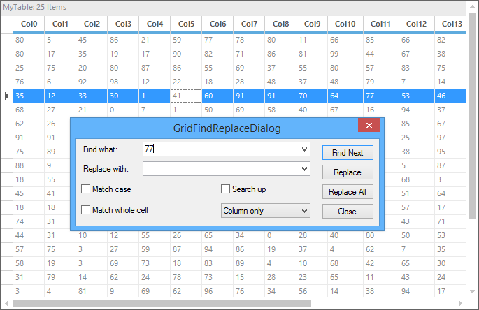
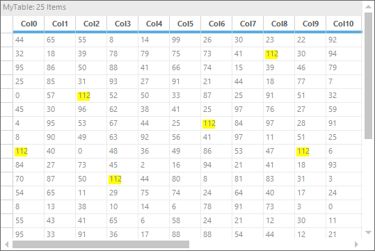

# Find and Replace in Windows Forms GridGrouping control
The searching and replacing of text and numbers can be done as like the Find and Replace functionality in the Excel. This can be done by using dialog or programmatically. This feature can be added to the GridGroupingControl by including the `Syncfusion.GridHelperClasses.Windows.dll` to the assembly reference. The following classes are used to implement the Find and Replace technique in GridGroupingControl.

* [GridFindReplaceDialogSink](https://help.syncfusion.com/cr/windowsforms/Syncfusion.Windows.Forms.Grid.GridFindReplaceDialogSink.html)
* [GridFindReplaceDialog](https://help.syncfusion.com/cr/windowsforms/Syncfusion.Windows.Forms.Grid.GridFindReplaceDialog.html)

The `GridFindReplaceDialogSink` class is used to perform the Find and Replace of text in GridGroupingControl. The `GridFindReplaceDialog` is the built-in dialog which shows the options for finding and replacing of the text. If this dialog is used for finding and replacing, there is no need to implement the methods for finding and replacing the text programmatically.

The below example shows the Find and Replace dialog is shown in GridGroupingControl,


// Setting the Dialog sink
GridFindReplaceDialogSink findReplaceSink = new GridFindReplaceDialogSink(this.gridGroupingControl1.TableControl);

// Setting the Dialog
GridFindReplaceDialog findReplaceDialog = GridFindReplaceDialog.Instance;

// Setting the sink to dialog
findReplaceDialog.ActiveSink = findReplaceSink;
findReplaceDialog.ShowDialog();


' Setting the Dialog sink
Dim findReplaceSink As New GridFindReplaceDialogSink(Me.gridGroupingControl1.TableControl)

' Setting the Dialog
Dim findReplaceDialog As GridFindReplaceDialog = GridFindReplaceDialog.Instance

' Setting the sink to dialog
findReplaceDialog.ActiveSink = findReplaceSink
findReplaceDialog.ShowDialog()



## Finding options
The finding options are used to set certain conditions for search the text and number using the [GridFindTextOptions](https://help.syncfusion.com/cr/windowsforms/Syncfusion.Windows.Forms.Grid.GridFindTextOptions.html) enumeration property. It has the following finding options,

**MatchCase** -Matches case while performing search.
**MatchWholeCell** -Matches the search text with the entire text in a grid cell.
**SearchUp** -Specifies if the search can be performed bottom-up.
**ColumnOnly** -Searches only the current column.
**SelectionOnly** -Searches only the current selection.
**WholeTable** -Searches the whole table.


//Create object for Find and Replace dialog
GridFindReplaceDialogSink frDialog = new GridFindReplaceDialogSink(grid.TableControl);

//Set options for find Text
GridFindTextOptions options = GridFindTextOptions.WholeTable;

//Set the range info
object locInfo = GridRangeInfo.Table();

//Create Find and Replace event args 
GridFindReplaceEventArgs frEvents = new GridFindReplaceEventArgs (txtSearch.Text, "", options, locInfo);


'Create object for Find and Replace dialog
Dim frDialog As New GridFindReplaceDialogSink(grid.TableControl)

'Set options for find Text
Dim options As GridFindTextOptions = GridFindTextOptions.WholeTable

'Set the range info
Dim locInfo As Object = GridRangeInfo.Table()

'Create Find and Replace event args 
Dim frEvents As New GridFindReplaceEventArgs(txtSearchText.Text, "", options, locInfo)



### Find and replace using keyboard shortcut
The Find and Replace dialog can be shown in GridGroupingControl as like Excel while pressing the &lt;kbd&gt;CTRL&lt;/kbd&gt; + &lt;kbd&gt;F&lt;/kbd&gt; keys by using the [TableControlCurrentCellKeyDown](https://help.syncfusion.com/cr/windowsforms/Syncfusion.Windows.Forms.Grid.Grouping.GridGroupingControl.html) event as like below example,


//Triggering the TableControlCurrentCellKeyDown event
this.gridGroupingControl1.TableControlCurrentCellKeyDown  += new KeyEventHandler(gridGroupingControl1_TableControlCurrentCellKeyDown);

void gridGroupingControl1_TableControlCurrentCellKeyDown (object sender, KeyEventArgs e)
{

         if (e.Control && e.KeyCode == Keys.F)
         {

             // Setting the Dialog sink
             GridFindReplaceDialogSink findReplaceSink = new GridFindReplaceDialogSink(grid.TableControl);

            // Setting the Dialog
            GridFindReplaceDialog findReplaceDialog = GridFindReplaceDialog.Instance;

            // Setting the sink to dialog
             findReplaceDialog.ActiveSink = findReplaceSink;
             findReplaceDialog.ShowDialog();
        }
}


'Triggering the TableControlCurrentCellKeyDown eventAddHandler Me. gridGroupingControl1.TableControlCurrentCellKeyDown
 AddressOf Me. gridGroupingControl1_ TableControlCurrentCellKeyDown

Private Sub gridGroupingControl1_ TableControlCurrentCellKeyDown
 (ByVal sender As Object, ByVal e As KeyEventArgs)     If (e.Control  AndAlso (e.KeyCode = Keys.F)) Then          ' Setting the Dialog sink          Dim findReplaceSink As GridFindReplaceDialogSink = New GridFindReplaceDialogSink(Me.gridControl1)         ' Setting the Dialog         Dim findReplaceDialog As GridFindReplaceDialog = GridFindReplaceDialog.Instance        ' Setting the sink to dialog         findReplaceDialog.ActiveSink = findReplaceSink         findReplaceDialog.ShowDialog      End If        End Sub



## Programmatic searching 
The Find and Replace of the text in GridGroupingControl can be customized or can be used other than the `GridFindReplaceDialog`. The [GridFindReplaceEventArgs](https://help.syncfusion.com/cr/windowsforms/Syncfusion.Windows.Forms.Grid.GridFindReplaceEventArgs.html) class provides the options to the `GridFindReplaceDialogSink` to perform the Find and Replace programmatically without having dialog.

### Find and find all
To find first possible match at the earliest based on the search options, use the [Find](https://help.syncfusion.com/cr/windowsforms/Syncfusion.Windows.Forms.Grid.Grouping.GridGroupTypedListRecordsCollection.html) method. The below code is used to find the text in GridGroupingControl


//Create object for Find and Replace dialog
GridFindReplaceDialogSink frDialog = new GridFindReplaceDialogSink(grid.TableControl);

//Set options for find Text
GridFindTextOptions options = GridFindTextOptions.WholeTable;

//Set the range info
object locInfo = GridRangeInfo.Table();

//Create Find and Replace event args 
GridFindReplaceEventArgs frEvents = new GridFindReplaceEventArgs(this.txtSearchText.Text, "", options, locInfo);

//Used to Find the next possible match
frDialog.Find(frEvents);            


'Create object for Find and Replace dialog
Dim frDialog As New GridFindReplaceDialogSink(grid.TableControl)

'Set options for find Text
Dim options As GridFindTextOptions = GridFindTextOptions.WholeTable

'Set the range info
Dim locInfo As Object = GridRangeInfo.Table()

'Create Find and Replace event args 
Dim frEvents As New GridFindReplaceEventArgs(Me.txtSearchText.Text, "", options, locInfo)

'Used to Find the next possible match
frDialog.Find(frEvents) 



The below code snippet denotes to find the text in all places at once.


private void findAll_Click(object sender, EventArgs e)
{
     findAll = true;
     resetAll = false;
     SetOptions();
     frEvents = new GridFindReplaceEventArgs(txtSearch.Text, "", options, locInfo);

     if (frDialog.Find(frEvents) == null)
          MessageBox.Show("No Matches found for Text" + txtSearch.Text);
     grid.Refresh();
}



Private Sub findAll_Click(ByVal sender As Object, ByVal e As EventArgs)
	findAll = True
	resetAll = False
	SetOptions()
	frEvents = New GridFindReplaceEventArgs(txtSearch.Text, "", options, locInfo)

	If frDialog.Find(frEvents) Is Nothing Then
		MessageBox.Show("No Matches found for Text" & txtSearch.Text)
	End If
    grid.Refresh()
End Sub



### Replace and replace all
The `Replace` and `ReplaceAll` methods are used to replace the found text or number with the new text after the finding operation has been performed. 


if (!string.IsNullOrEmpty(txtSearch.Text) && !string.IsNullOrEmpty(txtReplace.Text))
{
      SetOptions();

      //Create Find and Replace event args 
      frEvents = new GridFindReplaceEventArgs(txtSearch.Text, txtReplace.Text, options, locInfo);

      //Replace the text with the first match found using the Find option
      frDialog.Replace(frEvents);

      //Replace the entire match with the possible replace string
      frDialog.ReplaceAll(frEvents);

      if (frDialog.Replace(frEvents) == null)
      {
            MessageBox.Show("No matches found");
      }
}


If (Not String.IsNullOrEmpty(txtSearch.Text)) AndAlso (Not String.IsNullOrEmpty(txtReplace.Text)) Then
    SetOptions()

    'Create Find and Replace event args
    frEvents = New GridFindReplaceEventArgs(txtSearch.Text, txtReplace.Text, options, locInfo)

    'Replace the text with the first match found using the Find option
    frDialog.Replace(frEvents)

    'Replace the entire match with the possible replace string
    frDialog.ReplaceAll(frEvents);

    If frDialog.Replace(frEvents) Is Nothing Then
        MessageBox.Show("No matches found")
    End If
End If



The following sample shows how to include the find and replace functionality in GridGroupingControl,
&lt;Installation_Location&gt;\Syncfusion\EssentialStudio\&lt;version&gt;\Windows\Grid.Grouping.Windows\Samples\Layout Customization\Find-Replace Demo

## Highlight the search text
The search text can be highlighted by using the [GridHighlightSearchText](https://help.syncfusion.com/cr/windowsforms/Syncfusion.GridHelperClasses.GridHighlightSearchText.html) class. It will highlight the search text with the default color (yellow). The highlighting color can be changed by using[HighlightColor](https://help.syncfusion.com/cr/windowsforms/Syncfusion.GridHelperClasses.GridHighlightSearchText.html#Syncfusion_GridHelperClasses_GridHighlightSearchText_HighlightColor) property.


//Creates an instance for the class “GridHighlightSearchText”.
GridHighlightSearchText highlightText = new GridHighlightSearchText();

//Wires the table control to the object.
highlightText.WireGrid(this.gridGroupingControl1.TableControl);

//Assigns the text that needs to be highlighted.
highlightText.highlightText = "112";

//Assigns the color (optional).
highlightText.HighlightColor = Color.Yellow;


'Creates an instance for the class “GridHighlightSearchText”.
Dim highlightText As New GridHighlightSearchText()

'Wires the table control to the object.
highlightText.WireGrid(Me.gridGroupingControl1.TableControl)

'Assigns the text that needs to be highlighted.
highlightText.highlightText = "112"

'Assigns the color (optional).
highlightText.HighlightColor = Color.Yellow



N> The highlighting of the search text will work only when the [WrapText](https://help.syncfusion.com/cr/windowsforms/Syncfusion.Windows.Forms.Grid.GridStyleInfo.html#Syncfusion_Windows_Forms_Grid_GridStyleInfo_WrapText) of the cell is set to `false`.
