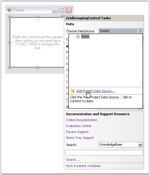
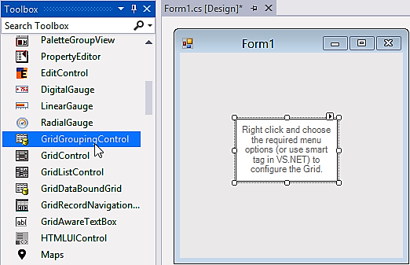
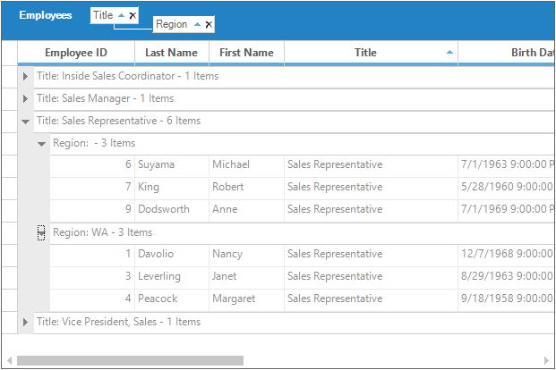
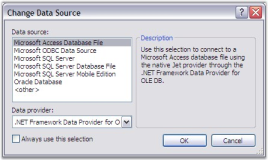

# Getting Started with Windows Forms GridGrouping
This section will explain about creating simple GridGroupingControl and the overview of its basic functionalities.

## Choosing the Best Grid 

Essential Grid includes a trio of grid controls as well as many other controls that are used in conjunction with these three grids. Essential Grid works similar to Microsoft Excel and allows extremely detailed customization down to the cell level. Multi-level Undo / Redo, Shared Scrollbar support, Data / View separation, floating cells, more than 15 cell types, and unmatched extensibility are the unique features of the Essential Grid.

[GridGroupingControl](https://help.syncfusion.com/windowsforms/gridgrouping/getting-started): A high performance grouping grid that offers very flexible support for grouping flat data sources as well as hierarchical data sources. This grid supports expressions fields, filters, multi-column sorting, grouping, nested tables/hierarchies, and custom summaries. It can use any [IList](https://docs.microsoft.com/en-us/dotnet/api/system.collections.ilist?view=net-5.0) data source including [ADO.NET](https://docs.microsoft.com/en-us/dotnet/framework/data/adonet/) [DataSet](https://docs.microsoft.com/en-us/dotnet/api/system.data.dataset?view=net-5.0)/[DataTables](https://docs.microsoft.com/en-us/dotnet/api/system.data.datatable?view=net-5.0) and [IBindingList](https://docs.microsoft.com/en-us/dotnet/api/system.componentmodel.ibindinglist?view=net-5.0) objects.

[GridDataBoundGrid](https://help.syncfusion.com/windowsforms/classic/databoundgrid/getting-started): A column oriented grid best suited for use with ADO.NET [DataSet](https://learn.microsoft.com/en-us/dotnet/api/system.data.dataset?view=net-5.0)/[DataTables](https://learn.microsoft.com/en-us/dotnet/api/system.data.datatable?view=net-5.0) data sources. If you are looking to bind with the `ADO.NET` data source without the grouping and hierarchical support then you can use GridDataBoundGrid. GridDataBoundGrid is marked as classic because all the features mentioned in this are available in `GridGroupingControl` with more efficiency and features.

[GridControl](https://help.syncfusion.com/windowsforms/grid-control/getting-started): A cell oriented grid that contain its own data. Does not need to be bound to a data source. Easily customize down to the cell level. Used in a [virtual manner](https://help.syncfusion.com/windowsforms/grid-control/virtual-grid#) such that, it can bind to any type of data source.

[SfDataGrid](https://help.syncfusion.com/windowsforms/datagrid/overview): Designed based on column-oriented architecture that provides support to customize the grid easily. Display collection of data in rows and columns.

<table>
<tr>
<th>
Control  </th><th>
Grouping  </th><th>
Sorting  </th><th>
Summary  </th><th>
Filtering  </th><th>
Export  </th></tr>
<tr>
<td>
GGC  </td><td>
Yes  </td><td>
Yes  </td><td>
Yes  </td><td>
Yes  </td><td>
Yes  </td></tr>
<tr>
<td>
GDBG  </td><td>
-  </td><td>
Yes  </td><td>
-  </td><td>
Yes  </td><td>
Yes  </td></tr>
<tr>
<td>
GC  </td><td>
-  </td><td>
*  </td><td>
-  </td><td>
*  </td><td>
Yes  </td></tr>
<tr>
<td>
SfDataGrid  </td><td>
Yes  </td><td>
Yes  </td><td>
Yes  </td><td>
Yes  </td><td>
Yes  </td></tr>
</table>

N> The `*` denotes that by default, support is not provided to the Control. It will be added by having some customizations. The [Sorting](https://www.syncfusion.com/kb/454/how-to-implement-the-custom-icomparer-to-sort-a-column-in-the-gridcontrol) and [Filtering](https://www.syncfusion.com/kb/4409/how-to-add-filter-in-winforms-gridcontrol) functionalities can be added to the `GridControl` by doing some customizations. 

For binding the different kind of data sources and support for filtering, sorting, grouping for flat and hierarchical data sources make use of the `GridGroupingControl`.

If user wants a cell oriented grid that can contain its own data and does not need to be bound to a data source then `GridControl` is the best choice

If the user wants the support for filtering, sorting, grouping, summary calculation and hierarchical data sources with the blazing performance, the `SfDataGrid` control is one of the best choice.

## Assembly Deployment
Refer [control dependencies](https://help.syncfusion.com/windowsforms/control-dependencies#gridgroupingcontrol) section to get the list of assemblies or NuGet package needs to be added as reference to use the control in any application. 

## Configuring a simple GridGroupingControl
This section will explain how to create a simple GridGroupingControl in Windows Forms application and some of the basic functionalities of it.

### Adding GridGroupingControl through Designer
GridGroupingControl can be added through designer by following the below steps.

1. Create a new Windows Form Application.

2. Drag and Drop GridGroupingControl from the toolbox into the designer page. 

3. Once drag drop the GridGroupingControl into the designer page, the GridGroupingControl will be added successfully into the application with the required libraries. The below mentioned assemblies will be added automatically into the application.

    * Syncfusion.Grid.Base.dll
    * Syncfusion.Grid.Grouping.Base.dll
    * Syncfusion.Grid.Grouping.Windows.dll
    * Syncfusion.Grid.Windows.dll
    * Syncfusion.Grouping.Base.dll
    * Syncfusion.Shared.Base.dll
    * Syncfusion.Shared.Windows.dll

### Adding GridGroupingControl through Code
GridGroupingControl can be added through code-behind by following the below steps.

1. Create a new Windows Form Application.

2. Add the below assemblies into the project file

    * Syncfusion.Grid.Windows.dll
    * Syncfusion.Grid.Grouping.Windows.dll
    * Syncfusion.Grouping.Base.dll
    * Syncfusion.Shared.Base.dll

3. Initialize a GridGroupingControl by using the below code in code behind.

​


//Initializing a new GridGroupingControl.
private Syncfusion.Windows.Forms.Grid.Grouping.GridGroupingControl gridGroupingControl1;


'Initializing a new GridGroupingControl.
Private gridGroupingControl1 As New Syncfusion.Windows.Forms.Grid.Grouping.GridGroupingControl()



{{ codesnippet1 | OrderList_Indent_Level_1 }}

4. Use the below code for adding the initialized GridGroupingControl to the application.

​


//Add required size for the Grid.
this.gridGroupingControl1.Size = new System.Drawing.Size(130, 80);
this.Controls.Add(this.gridGroupingControl1);


'Add required size for the Grid.
Me.gridGroupingControl1.Size = New System.Drawing.Size(130, 80)
Me.Controls.Add(Me. gridGroupingControl1)



{{ codesnippet2 | OrderList_Indent_Level_1 }}

## Populating Data
GridGroupingControl supports variety of data sources such as DataTables, DataSets, or any component that implement interfaces like IList, IBindingList, ITypedList, or IListSource. The data source can have multiple nested tables, which will be displayed hierarchically by GridGroupingControl. For assigning the data source to GridGroupingControl, [DataSource](https://help.syncfusion.com/cr/windowsforms/Syncfusion.Windows.Forms.Grid.Grouping.GridGroupingControl.html#Syncfusion_Windows_Forms_Grid_Grouping_GridGroupingControl_DataSource) property needs to be used.



// Adds the data source to the GridGroupingControl
this.gridGroupingControl1.DataSource = this.dataset11.Employees;


'Adds the data source to the GridGroupingControl.
Me.gridGroupingControl1.DataSource = Me.dataset11.Employees



Refer the [Data Binding](https://help.syncfusion.com/windowsforms/gridgrouping/data-binding) topic for more detailed explanation on how to bind data source to GridGroupingControl.

## Editing
By default, GridGroupingControl is in editable state. Editing can be enabled/disabled by using the [ActivateCurrentCellBehavior](https://help.syncfusion.com/cr/windowsforms/Syncfusion.Windows.Forms.Grid.GridControl.html#Syncfusion_Windows_Forms_Grid_GridControl_ActivateCurrentCellBehavior) property.



// Disables editing in GridGroupingControl
this.gridGroupingControl1.ActivateCurrentCellBehavior = GridCellActivateAction.None;


' Disables editing in GridGroupingControl
Me.gridGroupingControl1.ActivateCurrentCellBehavior = GridCellActivateAction.None



Editing operations can be customized by using the [TableControlCurrentCellStartEditing](https://help.syncfusion.com/cr/windowsforms/Syncfusion.Windows.Forms.Grid.Grouping.GridGroupingControl.html) and [TableControlCurrentCellEditingComplete](https://help.syncfusion.com/cr/windowsforms/Syncfusion.Windows.Forms.Grid.Grouping.GridGroupingControl.html) events. Check the[Editing](https://help.syncfusion.com/windowsforms/gridgrouping/data-representation) topic for more information on methods and properties related to it.

## Grouping
GridGroupingControl allows to group data by one or more columns. Data will be organized into a hierarchical structure based on the matching field values. 

If grouping is enabled in GridGroupingControl then there will be a specific area at the top of the Grid which shows the grouping options. This area is known as the [GridGroupDropArea](https://help.syncfusion.com/cr/windowsforms/Syncfusion.Windows.Forms.Grid.Grouping.GridTableControl.html#Syncfusion_Windows_Forms_Grid_Grouping_GridTableControl_GroupDropArea). `GridGroupDropArea` is made up of collection of grid controls packed in a panel named [GroupDropPanel](https://help.syncfusion.com/cr/windowsforms/Syncfusion.Windows.Forms.Grid.Grouping.GridGroupingControl.html#Syncfusion_Windows_Forms_Grid_Grouping_GridGroupingControl_GroupDropPanel). `GridGroupDropArea` can be enabled by using the [ShowGroupDropArea](https://help.syncfusion.com/cr/windowsforms/Syncfusion.Windows.Forms.Grid.Grouping.GridGroupingControl.html#Syncfusion_Windows_Forms_Grid_Grouping_GridGroupingControl_ShowGroupDropArea) property.



// Allows GroupDropArea to be visible
this.gridGroupingControl1.ShowGroupDropArea = true;


' Allows GroupDropArea to be visible
Me.gridGroupingControl1.ShowGroupDropArea = True



Check the [Grouping](https://help.syncfusion.com/windowsforms/gridgrouping/data-representation) topic, to know more information regarding grouping.

## Sorting
Sorting can be done in GridGroupingControl by just clicking the column header of the grid. It can be configured by using the [AllowSortColumns](https://help.syncfusion.com/cr/windowsforms/Syncfusion.Windows.Forms.Grid.Grouping.GridTableOptionsStyleInfo.html#Syncfusion_Windows_Forms_Grid_Grouping_GridTableOptionsStyleInfo_AllowSortColumns) property. By default, sorting will be enabled in GridGroupingControl. Refer the [Sorting](https://help.syncfusion.com/windowsforms/gridgrouping/data-representation) topic for detailed explanation.



// Enables sorting in GridGroupingControl.
this.gridGroupingControl1.TableOptions.AllowSortColumns = true;


' Enables sorting in GridGroupingControl.
Me.gridGroupingControl1.TableOptions.AllowSortColumns = True



## Filtering
GridGroupingControl is specially designed for supporting the filtering options. It supports three types of filtering namely Normal Filter, Excel-Like Filter and Dynamic Filter. To enable the Filter in GridGroupingControl make use of the [AllowFilter](https://help.syncfusion.com/cr/windowsforms/Syncfusion.Windows.Forms.Grid.Grouping.GridColumnDescriptor.html#Syncfusion_Windows_Forms_Grid_Grouping_GridColumnDescriptor_AllowFilter) property. Refer the [Filtering](https://help.syncfusion.com/windowsforms/gridgrouping/data-representation) topic for detailed explanation.



// Enable Filtering for the 3rd column.
this.gridGroupingControl1.TableDescriptor.Columns[3].AllowFilter = true;


'Enable Filtering for the 3rd column.
Me.gridGroupingControl1.TableDescriptor.Columns(3).AllowFilter = True



