# Getting Started

This section will provide step-by-step procedure to create Grid Grouping control through designer and through programmatical approach in a .NET application.

## Through Designer

Grid Grouping control has strong designer support. You can control all aspects of the grid's appearance through the designer. Additional commands (verbs) will let you save layouts and restore them. You can also use a preview feature that will let you load data into your control, and then further set the Grid Grouping control properties that can be persisted as design time properties.

This section has two major tasks. The first task is to place the Grid Grouping control on the form. The second task is to use the designer to set up data binding to an Access data file or SQL Server Database. This is strictly a Windows Forms process and really has nothing to do with our Grid Grouping control. You just need to set up a Data Adapter to access the data that is needed for the grid. The data for this is located in the My Documents\Syncfusion\EssentialStudio\VersionNumber\Windows\Data\NWIND.mdb or NWIND.sdf (depending upon your installation folder). For MDB file, you must use ADO.NET OLE DB support to access this data. For SQL Server, you must use SQL Server.

### Binding MDB File by using Visual Studio 

#### By using VS 2005

The steps in this lesson are to be used with Visual Studio 2005 and .NET 2.0. You can use Smart Tags that are available in the .NET 2.0 Designer to hook into your MDB file. This tutorial is strictly a designer tutorial. You do not have to write even a single line of code.

1.From the Syncfusion tab in the toolbox, drag a Grid Grouping control onto your form.

2.In the Grid Grouping control smart tag, click the Choose Data Source drop down. Then click the Add Project Data Source link in the drop down.

  

In the Data Source Configuration Wizard that appears, select DataBase and click Next.

  

Click New Connection. Add Connection dialog box will be displayed.

 

In the Add Connection dialog box, click Change button. This opens the Change Data Source dialog box.

 

In the Change Source dialog box, select the Microsoft Access DataBase File option, and then click OK.

  

The Add Connection dialog box will be opened without the DataBase file name entry set. Click Browse button and browse to the following path: _C:\Syncfusion\EssentialStudio\[Version Number]\Windows\Data\NWIND.mdb_ (this path will vary according to your installation location). Click OK.

  

Click New Connection to choose your data connection. Click Next.

 

Click No to indicate that you do not want to save the MDB in the project.

  

The following screen appears.

  

Click Next to choose your Database Objects. Select the Tables that you want. Click Finish.

  

The columns in the Grid Grouping control will now get populated as depicted in the following screen shot.

  

Finally, set the Anchor property of the Grid Grouping control to _All_, so that the Grid Grouping control can be easily sized with the form.

  

To allow grouping at run time, the Grid Grouping control displays a drop panel that the user can drag columns to be grouped. To display this drop panel, you need to set ShowGroupDropArea property to _true_.

 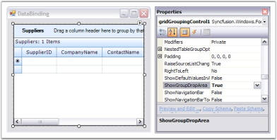 

Run the application to see the Grid Grouping control display the data from the MDB file (without having written a single line of code). Your form should look similar to the one in the following screen shot.

  

To group by CompanyName, click on the CompanyName column header and drag it to the drop area.

 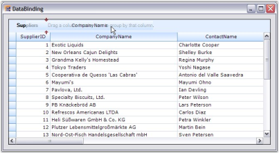 

Notice that each set of grouped values has its own "Caption" row and its own "AddNew" row (*). Each group has its own PlusMinus cell that will let you expand/collapse the group.

  

N>: For more details, refer the following browser sample: C:\Syncfusion\EssentialStudio\[Version Number]\Windows\Grid.Grouping.Windows\Samples\2.0\GettingStarted\Data Binding VS 2005 Demo

#### By using VS 2008

The steps in this lesson are to be used with Visual Studio 2008 and .NET 3.5. Smart Tags are available in the .NET 4.5.1 Designer to hook into your MDB file. This tutorial is strictly a designer tutorial. You do not have to write even a single line of code.

1.From the Syncfusion tab in the toolbox, drag a Grid Grouping control onto your form. In the Grid Grouping control smart tag, click Choose DataSource list, and then click Add Project Data Source. Data Source Configuration Wizard dialog box appears.

 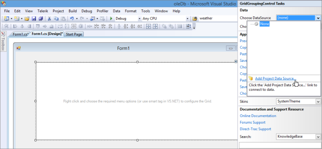 

2.In the Choose a Data Source Type window, click Database, and then click Next.

 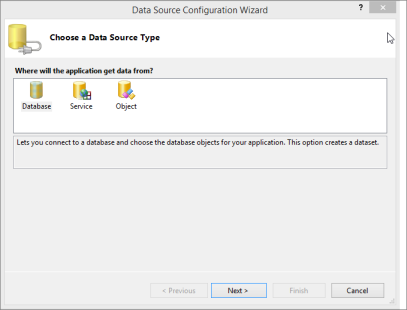 

3.In the Choose Your Data Connection window, click New Connection.

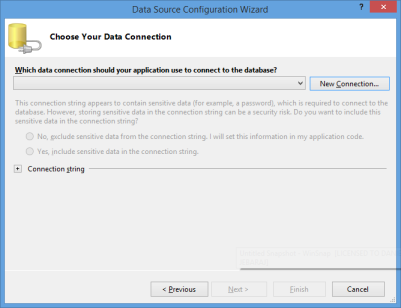

The ChooseData Source dialog box appears.

  

4.Click Microsoft Access Database File, and then click Continue.

  

The Add Connection dialog box appears without the Database file name entry set.

5.Click Browse to choose the Data Source: _C:\Users\&lt;User Name&gt;\AppData\Local\Syncfusion\EssentialStudio\&lt;Version number&gt;\Common\Data\NWIND.mdb_ (this path will vary according to your installation location).

6.Click OK.

  

The connection string is displayed in the Data Source Configuration Wizard dialog box.

7.Click Next.

  

8.In the Microsoft Visual Studio message box that opens, click No to indicate that you do not want to save the MDB in the project.

  

The Save the Connection String to the Application Configuration File window opens.

  

9.Click Next.

10.In the Choose your Database Objects window that opens, select the required tables.

 

11.Click Finish.

The columns in the Grid Grouping control will get populated as shown in the following window shot.

12.Finally, set the Anchor property of the Grid Grouping control to _All_, so that the Grid Grouping control can be easily sized with the form.

 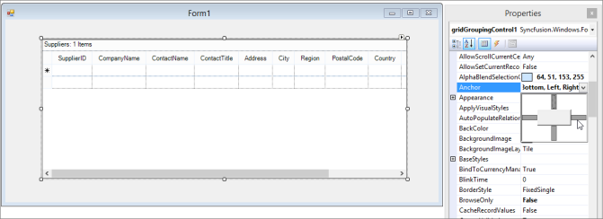 

13.You can group columns at run time by dragging columns headers of the columns be grouped to the GroupDropArea of the Grid Grouping control. To display the GroupDropArea of the Grid Grouping control, set ShowGroupDropArea property to _True_.

 

14.Run the application to view the MDB file data displayed by the Grid Grouping control (without having written a single line of code). Your form should look similar to the one in the following window shot.

 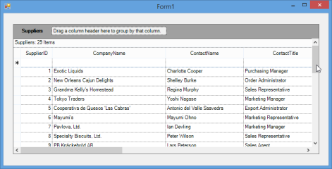 

#### By using VS 2010

The steps in this lesson are for use with Visual Studio 2010 and .NET 4.0. You can use Smart Tags available in the .NET 4.5.1 Designer to hook into your MDB file. This tutorial is strictly a designer tutorial. You do not have to write even a single line of code.

1.From the Syncfusion tab in the toolbox, drag a Grid Grouping control onto your form. In the Grid Grouping control smart tag, click Choose DataSource list, and then click Add Project Data Source. Data Source Configuration Wizard dialog box appears.

 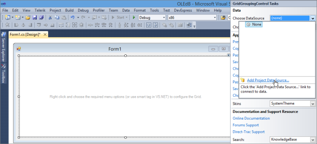 

2.In the Choose a Data Source Type window, click Database, and then click Next.

  

3.In the Choose a Database Model window, click Dataset, and then click Next.

 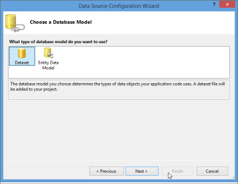 

4.In the Choose Your Data Connection window, click New Connection.

  

The ChooseData Source dialog box appears.

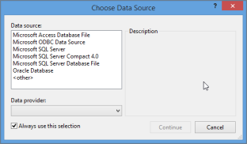 

_Figure_ _43__: Choose Data Source dialog box_

5.Click Microsoft Access Database File, and then click Continue.

  

The Add Connection dialog box appears without the Database file name entry set.

6.Click Browse to choose the Data Source: _C:\Users\&lt;User Name&gt;\AppData\Local\Syncfusion\EssentialStudio\ &lt;Version number&gt;\ Common\Data\NWIND.mdb_ (this path will vary according to your installation location).

7.Click OK.

  

The connection string is displayed in the Data Source Configuration Wizard dialog box.

8.Click Next.

  

9.In the Microsoft Visual Studio message box that opens, click No to indicate that you do not want to save the MDB in the project.

 

The Save the Connection String to the Application Configuration File window opens.

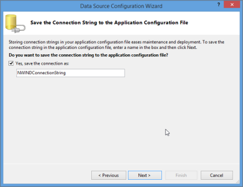 

10.Click Next.

11.In the Choose your Database Objects window that opens, select the required tables.

 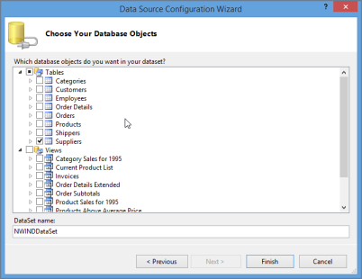

12.Click Finish.

The columns in the Grid Grouping control will get populated as shown in the following window shot.

 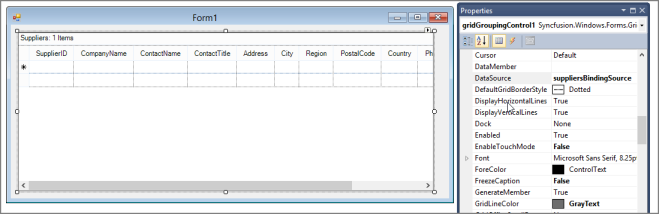 

13.Finally, set the Anchor property of Grid Grouping control to _all_, so that Grid Grouping control can be easily sized with the form. This is depicted in the following screen shot.

 

14.You can group columns at run time by dragging column headers of the columns to be grouped to GroupDropArea of Grid Grouping control. To display GroupDropArea of Grid Grouping control, set ShowGroupDropArea property to _True_.

 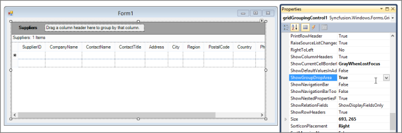 

15.Run the application to view the MDB file data displayed by the Grid Grouping control (without having written a single line of code). Your form should look similar to the one in the following window shot.

  

#### By using VS 2012

The following steps are intended for use with Visual Studio 2012 and .NET 4.5. You can use Smart Tags that are available in the .NET 4.5 designer to hook into your MDB file. This tutorial is strictly a designer tutorial. You do not have to write a single line of code. 

1.From the Syncfusion tab in the toolbox, drag a Grid Grouping control onto your form.

2.In the Grid Grouping control smart tag, click Choose Data Source drop-down list. Then click Add Project Data Source link.

 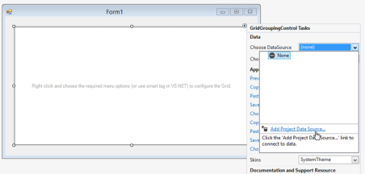 

In the Data Source Configuration Wizard that appears, select Database and click Next.

 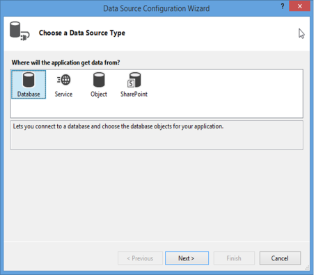 

Select Dataset from Data Source Configuration Wizard dialog and click Next.

  

The following screen will appear:

  

Click New Connection. ChooseData Source dialog box will be displayed.

  

3.In the Change Data Source dialog box, select the Microsoft Access Database File option, and then click Continue. Add Connection dialog box will be displayed.

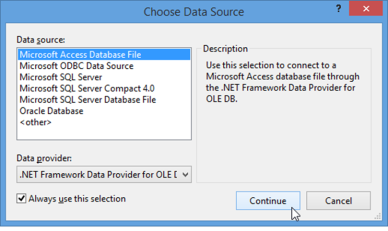 

4.Add Connection dialog box will be opened without the Database file name entry set. Click Browse and browse to the following path: _C:\Users\&lt;User Name&gt;\AppData\Local\Syncfusion\EssentialStudio\&lt;Version number&gt;\Common\Data\NWIND.mdb_ (this path will vary according to your installation location). Click OK.

 

Now the Data Source Configuration Wizard will open, along with the connection string also shown in this dialog. Click Next.

  

Click No to indicate that you do not want to save the MDB in the project.

 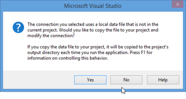 

The following screen will appear:

 

5.Click Next to choose your Database Objects. Select the tables that you want. Click Finish.

 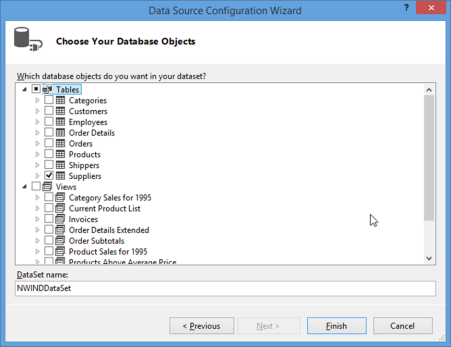 

The columns in the Grid Grouping control will now be populated as depicted in the following screenshot:

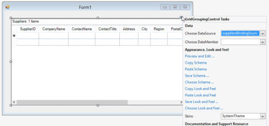 

Finally, set the Anchor property of the Grid Grouping control to All, so that the Grid Grouping control can be easily sized with the form.

 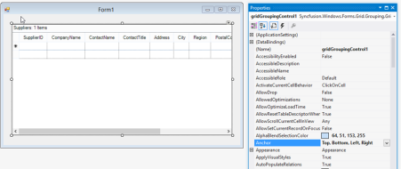 

To allow grouping at run time, the Grid Grouping control displays a drop panel onto which the user can drag columns to be grouped. To display this drop panel, set the ShowGroupDropArea property to true as shown in the following screenshot:

 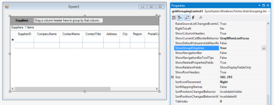 

Run the application to see the Grid Grouping control display the data from the MDB file without having written a single line of code. Your form should look similar to the one in the following screenshot:

  

#### By using VS 2013

The steps in this lesson are for use with Visual Studio 2013 and .NET 4.5.1. You can use Smart Tags that are available in the .NET 4.5.1 Designer to hook into your MDB file. This tutorial is strictly a designer tutorial. You do not have to write even a single line of code.

1.From the Syncfusion tab in the toolbox, drag a Grid Grouping control onto your form. In the Grid Grouping control smart tag, click Choose DataSource list, and then click Add Project Data Source. Data Source Configuration Wizard dialog box appears.

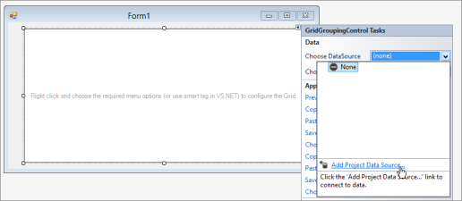 

2.In the Choose a Data Source Type window, click Database, and then click Next.

 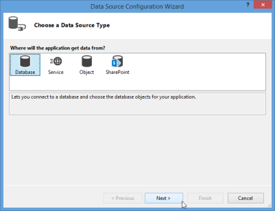 

3.Then, in the Choose a Database Model window, click Dataset, and then click Next.

  

4.In the Choose Your Data Connection window, click New Connection.

  

ChooseData Source dialog box appears.

  

5.Click Microsoft Access Database File, and then click Continue.

  

The Add Connection dialog box appears without the Database file name entry set.

6.Click Browse to choose the Data Source: _C:\Users\&lt;User Name&gt;\AppData\Local\Syncfusion\EssentialStudio\&lt;Version number&gt;\Common\Data\NWIND.mdb_ (this path will vary according to your installation location).

7.Click OK.

 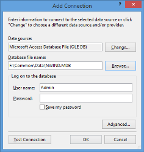 

The connection string is displayed in the Data Source Configuration Wizard dialog box.

8.Click Next.

 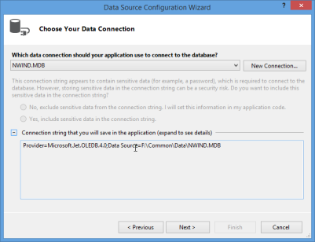 

9.In the Microsoft Visual Studio message box that opens, click No to indicate that you do not want to save the MDB in the project.

 

The Save the Connection String to the Application Configuration File window opens.

 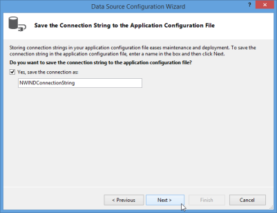 

10.Click Next.

11.In the Choose your Database Objects window that opens, select the required tables.

  

12.Click Finish.

The columns in the Grid Grouping control will get populated as shown in the following window shot.

 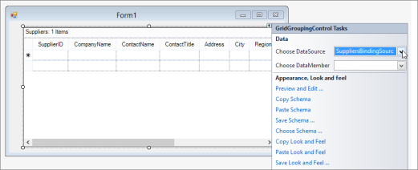 

13.Finally, set the Anchor property of the Grid Grouping control to _All_, so that the Grid Grouping control can be easily sized with the form.

  

14.You can group columns at run time by dragging column headers of the columns to be grouped to the GroupDropArea of the Grid Grouping control. To display GroupDropArea of Grid Grouping control, set ShowGroupDropArea property to _True_.

  

15.Run the application to view the MDB file data displayed by the Grid Grouping control (without having written a single line of code). Your form should look similar to the one in the following window shot.

 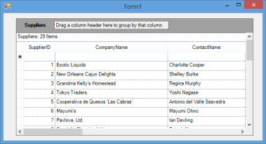 

## Through Code

This section will give you a step by step tutorial on creating Grid Grouping control through code. You can bind Grid Grouping control either to an MDB file or to data source that has been created manually.

In this lesson, you will learn about the following topics.

### Binding a Grid Grouping Control to an MDB File

This example illustrates how to bind Grid Grouping control to an MDB file at run time. It uses OleDbConnection and OleDbAdapter objects to get connected to data source that exposes OLE DB interface. Try a similar approach to connect to a database from MS SQL Server.

1.Include the required namespace.

  

using Synctusion.Windows.Forms.Grid.Grouping;

using System.Data.OleDb;



 

Imports Synctusion.Windows.Forms.Grid.Grouping

Imports System.Data.OleDb



2.Create an instance of Grid Grouping control and specify its size.

  

private Syncfusion.Windows.Forms.Grid.Grouping.GridGroupingControl gridGroupingControl1;

this.gridGroupingControl1 = new Syncfusion.Windows.Forms.Grid.Grouping.GridGroupingControl();

this.gridGroupingControl1.Size = new System.Drawing.Size(160, 200 );



 

Private gridGroupingControl1 As Syncfusion.Windows.Forms.Grid.Grouping.GridGroupingControl

Me.gridGroupingControl1 = New Syncfusion.Windows.Forms.Grid.Grouping.GridGroupingControl()

Me.gridGroupingControl1.Size = New System.Drawing.Size(160, 200 )



3.Set up Data Source.

  

//Creates Connection Object. 

OleDbConnection connection = new OleDbConnection("Provider=Microsoft.Jet.OLEDB.4.0;Data Source=C:\\Data\\NWIND.MDB");

//Creates Data Adapter. 

OleDbDataAdapter adapter = new OleDbDataAdapter("SELECT * FROM Customers", connection);

// Creates and fills Data Set. 

DataSet dtSet = new DataSet();

adapter.Fill(dtSet);



 

'Creates Connection Object. 

Dim Connection As OleDbConnection = New OleDbConnection("Provider=Microsoft.Jet.OLEDB.4.0;Data Source=C:\\Data\\NWIND.MDB")

'Creates Data Adapter. 

Dim Adapter As OleDbDataAdapter = New OleDbDataAdapter("SELECT * FROM Customers", Connection)

'Creates and fills Data Set.

Dim dtSet As DataSet = New DataSet()

Adapter.Fill(dtSet)



4.Bind the grid grouping control to this data table by setting its DataSource property.

 

this.gridGroupingControl1.DataSource = dtSet.Tables[0]; 

 

 

Me.GridGroupingControl1.DataSource = dtSet.Tables(0)



5.Finally add the grid grouping control to the form.

  

this.Controls.Add(this.gridGroupingControl1); 



 

Me.Controls.Add(Me.GridGroupingControl1)



6.When you run the application, the grid will look like the following image.

  

### Bind a Grid Grouping Control to a Manual Data Source

Here are some code samples that will create DataTable and bind it to Grid Grouping control. Once you have DataTable object populated, you can use GridGroupingControl.DataSource property to implement the binding.

1.Include the required namespace.

  

using Synctusion.Windows.Forms.Grid.Grouping;



 

Imports Synctusion.Windows.Forms.Grid.Grouping



2.Create an instance of Grid Grouping control and specify its size.

  

private Syncfusion.Windows.Forms.Grid.Grouping.GridGroupingControl gridGroupingControl1;

this.gridGroupingControl1 = new Syncfusion.Windows.Forms.Grid.Grouping.GridGroupingControl();

this.gridGroupingControl1.Size = new System.Drawing.Size(160, 200 );



 

Private gridGroupingControl1 As Syncfusion.Windows.Forms.Grid.Grouping.GridGroupingControl

Me.gridGroupingControl1 = New Syncfusion.Windows.Forms.Grid.Grouping.GridGroupingControl()

Me.gridGroupingControl1.Size = New System.Drawing.Size(160, 200 )



3.Set up the Data Source.

  

DataTable myDataTable = new DataTable("MyDataTable");

//Declares Data Column and Data Row variables.

DataColumn myDataColumn;

DataRow myDataRow;

//Creates new Data Column, sets Data Type and Column Name and adds to the Data Table.   

myDataColumn = new DataColumn();

myDataColumn.DataType = System.Type.GetType("System.Int32");

myDataColumn.ColumnName = "id";

myDataTable.Columns.Add(myDataColumn);

//Creates a second column.

myDataColumn = new DataColumn();

myDataColumn.DataType = Type.GetType("System.String");

myDataColumn.ColumnName = "item";

myDataTable.Columns.Add(myDataColumn);

//Creates new Data Row objects and adds to the Data Table.    

for (int i = 0; i <= 10; i++)

{

    myDataRow = myDataTable.NewRow();

    myDataRow["id"] = i;

    myDataRow["item"] = "item " + i.ToString();

    myDataTable.Rows.Add(myDataRow);

}



 

Dim myDataTable As DataTable = New DataTable("MyDataTable")

'Declares Data Column and Data Row variables.

Dim myDataColumn As DataColumn

Dim myDataRow As DataRow

'Creates a new Data Column, sets the Data Type and Column Name and adds to the Data Table. 

myDataColumn = New DataColumn()

myDataColumn.DataType = System.Type.GetType("System.Int32")

myDataColumn.ColumnName = "id"

myDataTable.Columns.Add(myDataColumn)

'Creates a second column.

myDataColumn = New DataColumn()

myDataColumn.DataType = Type.GetType("System.String")

myDataColumn.ColumnName = "item"

myDataTable.Columns.Add(myDataColumn)

'Creates new Data Row objects and adds to the Data Table.    

Dim i As Integer

For i = 0 To 10

myDataRow = myDataTable.NewRow

myDataRow("id") = i

myDataRow("item") = "item " & i

myDataTable.Rows.Add(myDataRow)

Next i



4.Bind the grid grouping control to this data table by setting its DataSource property.

  

this.gridGroupingControl1.DataSource = myDataTable; 



 

Me.GridGroupingControl1.DataSource = myDataTable



5.Finally, add the grid grouping control to the form.

  

this.Controls.Add(this.gridGroupingControl1); 



 

Me.Controls.Add(Me.GridGroupingControl1)



6.When you run the application, the grid will look like the following image. You will be able to sort data by clicking the header of the column you want to sort.

  

### Binding SQL Server by using Visual Studio

#### By using VS 2005

The steps in this lesson are for use with Visual Studio 2005 and .NET 2.0. You can use Smart Tags that are available in the .NET 2.0 Designer to hook into your SQL server file. This tutorial is strictly a designer tutorial. You neednot write even a single line of code.

1.From the Syncfusion tab in the toolbox, drag a Grid Grouping control onto your form.

2.In the Grid Grouping control smart tag, click the Choose Data Source drop down. Then click the Add Project Data Source link in the drop down.

 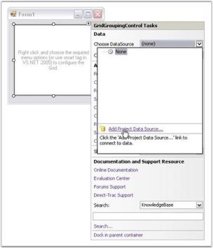 

3.In the Data Source Configuration Wizard that appears, select DataBase and click Next.

 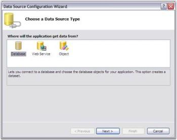 

4.Click New Connection. The Add Connection dialog box will be displayed.

 

_Figure_ _86__:_ Select the Data Connection

The ChooseData Source dialog box appears.

  

_Figure_ _87__: Choose Data Source dialog box_

5.Click Microsoft SQL Server, and then click OK.

 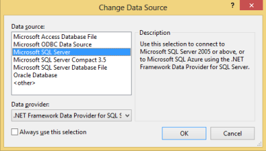 

_Figure_ _88__: Choose Data Source dialog box_

 The Add Connection dialog box appears without the Database file name entry set

6.Choose Server Name.

7.Choose Database Name or Click Browse to choose the Data Source:_C:\Users\&lt;User Name&gt;\AppData\Local\Syncfusion\EssentialStudio\&lt;Version number&gt;\Common\Data\NWIND.sdf_ (this path will vary according to your installation location).

8.Select either windows authentication or SQL server authentication option. You are required to give SQL server credentials when you Authenticate with SQL server.  

  

_Figure_ _89__:_ Selecting the SQL Server Database

9.Click OK.

 The connection string is displayed in the Data Source Configuration Wizard dialog box.

  

_Figure_ _90__:Choosing a Data Connection_

10.Click Next.

 

_Figure_ _91__: Saving Connection String_

11.Select the DataBaseObject file from the listed database files.

  

_Figure_ _92__:_ Choosing Database Objects

The columns in Grid Grouping control get populated, as depicted in the following screenshot.

 [http://help.syncfusion.com/ug/windows%20forms/ImagesExt/image520_25.jpg](Getting-Started_images/Getting-Started_img88.jpeg) 

12.Finally, set the Anchor property of Grid Grouping control to All, so that the control can be sized easily with the form. This is depicted in the following screenshot.

  

13.To allow grouping at run time, the user can drag columns to be grouped onto a drop panel that the Grid Grouping control displays. To display this drop panel, set the ShowGroupDropArea property to “True” as shown in the following screenshot.

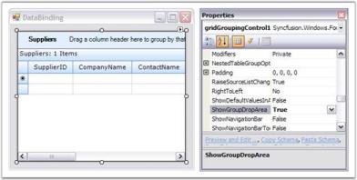 

14.Run the application to see the Grid Grouping control display the data from the SQL Server database. Your form should look similar to the one in the following screenshot.

 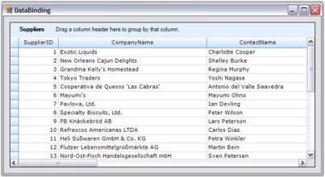 

15.To group by CompanyName, click on the CompanyName column header and drag it to the drop area as illustrated in the following screenshot

 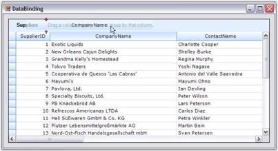 

Notice that each set of grouped values has its own "Caption" row and its own "AddNew" row, denoted by the * symbol. Each group has its own PlusMinus cell that allows you to expand or collapse the group. 

 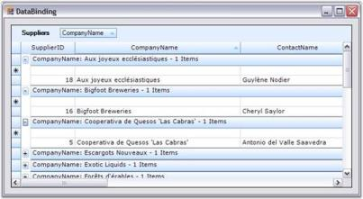 

#### By using VS 2008

The steps in this lesson are for use with Visual Studio 2008 and .NET 3.5. You can use Smart Tags that are available in the .NET 4.5.1 Designer to hook into your SQL Server Database. This tutorial is strictly a designer tutorial. You need not write even a single line of code.

1.From the Syncfusion tab in the Toolbox, drag a Grid Grouping control onto your form.

In the Grid Grouping control smart tag, click Choose DataSource list, and then click Add Project Data Source.

The Data Source Configuration Wizard dialog box appears.

  

2.In the Choose a Data Source Type window, click Database, and then click Next.

  

3.In the Choose Your Data Connection window, click New Connection.

  

The ChooseData Source dialog box appears.

  

4.Click Microsoft SQL Server, and then click OK.

  

 The Add Connection dialog box appears without the Database file name entry set.

5.Choose Server Name.

6.Choose Database Name or click Browse to choose the data source: _C:\Users\&lt;User Name&gt;\AppData\Local\Syncfusion\EssentialStudio\&lt;Version number&gt;\Common\Data\NWIND.sdf_

This path varies according to your installation location.

7.Select either the Windows Authentication option or the SQL Server Authentication option. If you want to authenticate SQL server, give your credentials for the SQL server.

  

8.Click OK.

 The connection string is displayed in the Data Source Configuration Wizard dialog box.

  

9.Click Next.

 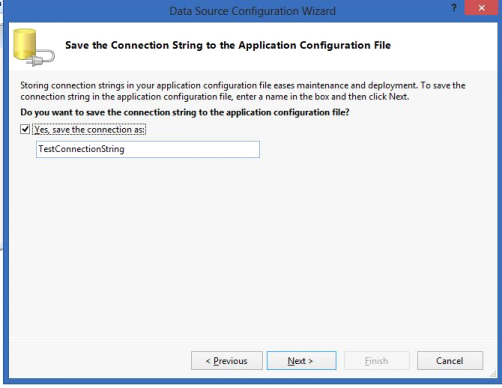 

10.Select DataBaseObject file from listed database files.

  

11.Click Finish.

The columns in the Grid Grouping control get populated as shown in the following screenshot.

  

12.Finally, set the Anchor property of the Grid Grouping control to All, so that the control can be sized easily with the form, as shown in the following screenshot.

  

13.You can group columns at run time by dragging the column headers of the columns to be grouped to the GroupDropArea of the Grid Grouping control. To display the GroupDropArea of the Grid Grouping control, set the ShowGroupDropArea property to “True”, as shown in the following screenshot.

 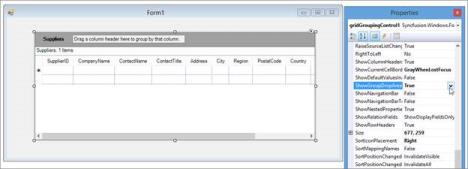 

14.Run the application to view the SQL Server Database data displayed by the GridGrouping control. Your form should look similar to the one in the following screenshot.

  

#### By using VS 2010

The steps in this lesson are for use with Visual Studio 2010 and .NET 4.0. You can use Smart Tags that are available in the .NET 4.5.1 Designer to hook into your SQL Server Database. This tutorial is strictly a designer tutorial. You do not have to write even a single line of code.

1.From the Syncfusion tab in the Toolbox, drag a Grid Grouping control onto your form.

In the Grid Grouping control smart tag, click Choose DataSource list, and then click Add Project Data Source. The Data Source Configuration Wizard dialog box appears.

  

_Figure_ _112__: Add a Project Data Source_

2.In the Choose a Data Source Type window, click Database, and then click Next.

  

_Figure_ _113__: Select Database_

3.In the Choose a Database Model window, click Dataset, and then click Next.

  

_Figure_ _114__: Select Dataset_

4.In the Choose Your Data Connection window, click New Connection.

 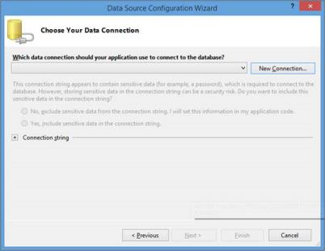 

The ChooseData Source dialog box appears.

 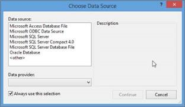 

_Figure_ _116__: Choose Data Source dialog box_

5.Click Microsoft SQL Server, and then click OK.

  

_Figure_ _117__: Choose Data Source dialog box_

The Add Connection dialog box appears without the Database file name entry set

6.Choose Server Name.

7.Choose Database Name or Click Browse to choose the Data Source: _C:\Users\&lt;User Name&gt;\AppData\Local\Syncfusion\EssentialStudio\&lt;Version number&gt;\Common\Data\NWIND.sdf_

This path varies according to your installation location.

8.Select either the Windows Authentication option or the SQL server authentication option. If you want to authenticate with SQL server, give your SQL server credentials.

  

_Figure_ _118__: Selecting the SQL Server Database_

9.Click OK.

 The connection string is displayed in the Data Source Configuration Wizard dialog box.

  

_Figure_ _119__: Choosing a Data Connection_

10.Click Next.

  

_Figure_ _120__: Saving Connection String_

11.Select DataBaseObject file from listed database files.

  

_Figure_ _121__:_ : _Choosing Database Objects_

12.Click Finish.

The columns in the Grid Grouping control get populated, as shown in the following screenshot.

  

_Figure_ _122__: Grid Grouping Control_

13.Finally, set the Anchor property of the Grid Grouping control to All, so that the Grid Grouping control can be easily sized with the form. This is depicted in the following screenshot.

  

14.You can group columns at run time by dragging the columns headers of the columns to be grouped to the GroupDropArea of the Grid Grouping control. To display the GroupDropArea of the Grid Grouping control, set the ShowGroupDropArea property to “True”, as shown in the following screenshot.

  

15.Run the application to view the SQL Server Database data, displayed by the Grid Grouping control. Your form should look similar to the one in the following screenshot.

 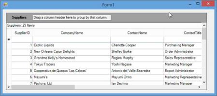  

#### By using VS 2012

The following steps are intended for use with Visual Studio 2012 and .NET 4.5. You can use Smart Tags that are available in the .NET 4.5 Designer to hook into your SQL Server database. This tutorial is strictly a designer tutorial. You do not have to write a single line of code.

1.From the Syncfusion tab in the Toolbox, drag a Grid Grouping control onto your form. 

2.In the Grid Grouping control smart tag, click the Choose Data Source drop-down list. Then click the Add Project Data Source link.

  

3.In the Data Source Configuration Wizard that appears, select Database and click Next.

  

4.Select Dataset from Data Source Configuration Wizard dialog and click Next.

  

The following screen appears:

 

5.Click New Connection. The ChooseData Source dialog box is displayed.

 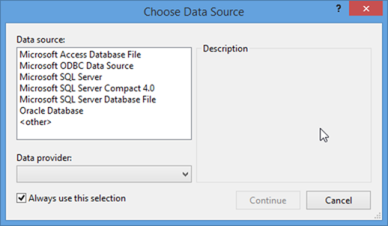 

6.In the Change Data Source dialog box, select the SQL Server option, and then click Continue. The Add Connection dialog box is displayed.

 

7.Choose Server Name.

8.Choose Database Name or Click Browse to choose the Data Source: _C:\Users\&lt;User Name&gt;\AppData\Local\Syncfusion\EssentialStudio\&lt;Version number&gt;\Common\Data\NWIND.sdf_

This path varies according to your installation location.

9.Select either the Windows Authentication option or the SQL Server Authentication option. If you want to authenticate with SQL server, give your SQL server credentials.   

 

_Figure_ _132__:Selecting the SQL Server Database_

10.Click OK.

 The connection string is displayed in the Data Source Configuration Wizard dialog box.

  

_Figure_ _133__: Choosing a Data Connection_ 

11.Click Next.

  

_Figure_ _134__: Saving Connection String_

12.Select DataBase Object file from listed database files.

 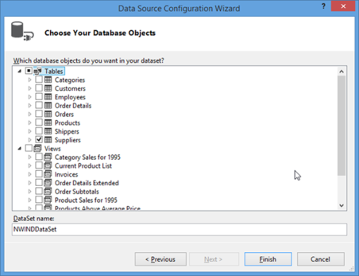 

_Figure_ _135__:Choosing Database Objects_

13.Click Finish.

The columns in the Grid Grouping control get populated, as depicted in the following screenshot:

  

14.Finally, set the Anchor property of the Grid Grouping control to All, so that the Grid Grouping control can be sized easily with the form. This is depicted in the following screenshot:

  

15.You can group columns at run time by dragging the columns headers of the columns to be grouped to the GroupDropArea of the Grid Grouping control. To display this drop panel, set the ShowGroupDropArea property to “True”, as shown in the following screenshot:

  

16.Run the application to see the Grid Grouping control display the data from the SQL Server Database, without having written a single line of code. Your form should look similar to the one in the following screenshot:

 

#### By using VS 2013

The steps in this lesson are for use with Visual Studio 2013 and .NET 4.5.1. You can use Smart Tags that are available in the .NET 4.5.1 Designer to hook into your SQL Server database. This tutorial is strictly a designer tutorial. You do not have to write even a single line of code.

1.From the Syncfusion tab in the Toolbox, drag a Grid Grouping control onto your form.

In the Grid Grouping control smart tag, click Choose DataSource list, and then click Add Project Data Source.

The Data Source Configuration Wizard dialog box appears.

  

2.In the Choose a Data Source Type window, click Database, and then click Next.

  

3.Then, in the Choose a Database Model window, click Dataset, and then click Next.

 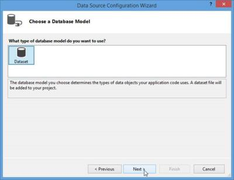 

4.In the Choose Your Data Connection window, click New Connection.

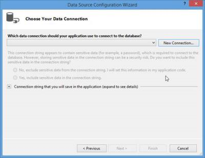 

The ChooseData Source dialog box appears.

 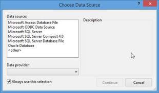 

5.In the Change Data Source dialog box, select the SQL Server option, and then click Continue. The Add Connection dialog box is displayed.

 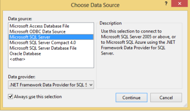 

6.Choose Server Name.

7.Choose Database Name or Click Browse to choose the Data Source: 

_C:\Users\&lt;User Name&gt;\AppData\Local\Syncfusion\EssentialStudio\&lt;Version number&gt;\Common\Data\NWIND.sdf_

This path varies according to your installation location.

8.Select either the Windows Authentication option or the SQL Server Authentication option. If you want to authenticate with SQL server, give your SQL server credentials.   

  

_Figure_ _146__:Selecting the SQL Server Database_

9.Click OK.

 The connection string is displayed in the Data Source Configuration Wizard dialog box.

  

_Figure_ _147__:Choosing a Data Connection_

10.Click Next.

 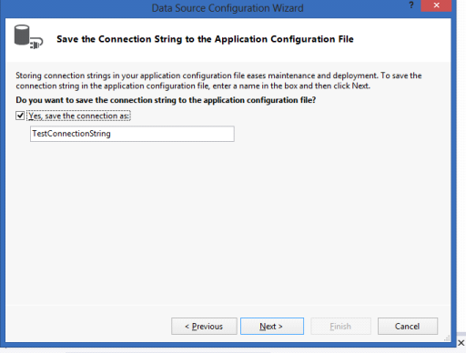 

11.In the Choose your Database Objects window that opens, select the required tables.

 

12.Click Finish.

The columns in the Grid Grouping control get populated, as shown in the following screenshot.

  

13.Finally, set the Anchor property of the Grid Grouping control to All, so that the Grid Grouping control can be easily sized with the form as shown in the following screenshot.

 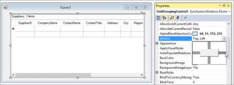 

14.You can group columns at run time by dragging columns headers of the columns to be grouped to the GroupDropArea of the Grid Grouping control. To display the GroupDropArea of the Grid Grouping control, set the ShowGroupDropArea property to “True”, as shown in the following screenshot.

 

15.Run the application to view the SQL Server database data displayed by the GridGrouping control. Your form should look similar to the one in the following screenshot.

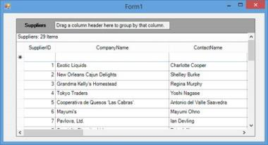 

