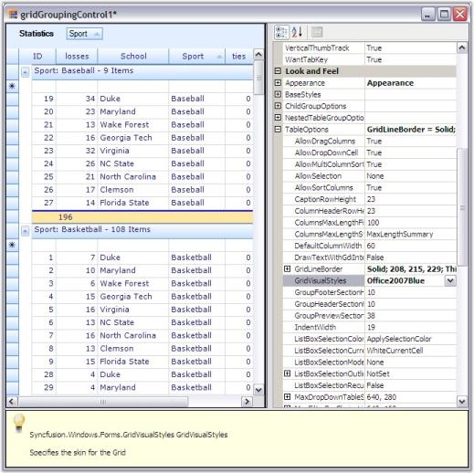
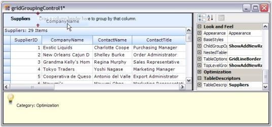
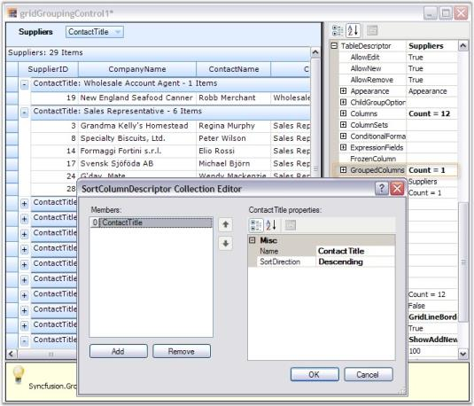
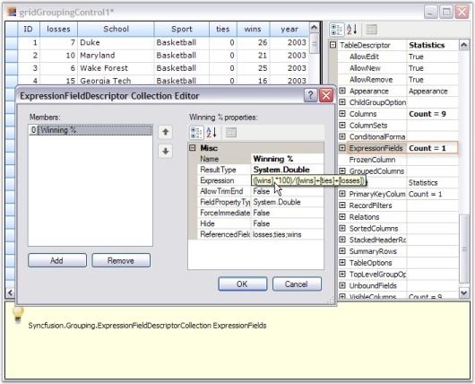
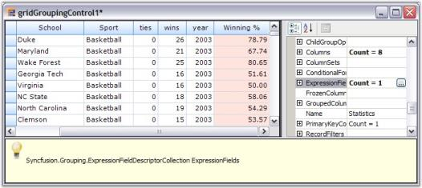

# Grid Designer

Grid Grouping control has strong designer support. You can control all aspects of grid's appearance through the designer. Additional commands (verbs) will let you save layouts and restore them. You can also use preview feature that will allow you load data into your control and then further set the Grid Grouping control properties that can be persisted as design-time properties.

Clicking Preview and Edit verb will allow you to view the Grid Grouping control, populated with data along with companion property grid as seen in the picture below. It also displays help description for the properties that are being selected. You can use the property grid to change Grid Grouping control's properties and see the effect immediately on the populated control. When you close the preview, you will have the option of saving any changed properties to the property grid in the designer. We will use this Preview and Edit support to see the effects of setting various TableOption properties.

  

Grid Designer presents populated Grid Grouping control along with property grid listing out the related properties. It also includes an integrated help feature to display a brief description on the property selected. You will be able to set any kind of properties using the designer so that you can see the results immediately. Here is a brief discussion on how to work with grid elements through the designer.

Grouping

Designer provides full drag and drop capability so that you can group the records by dragging a column header and dropping it into GroupDropArea, provided the GroupDropArea is enabled by setting ShowGroupDropArea to true. Likewise you can group data against any number of columns across the tables when multiple nested tables are used.

  

  

You can also use TableDescriptor.GroupedColumns property to add groups where you need to specify the column names based on which the table has to be grouped.

  

Sorting

Sorting can be done on the table data by simply clicking the desired column header by which the values need to be sorted. Once sorting is done, the grouping grid displays ListSortIcon in the respective column header to indicate Sort Direction. You could also make use of the TableDescriptor.SortedColumns property to sort table data wherein you need to provide the column to be sorted and sort order.

  

  

Summaries

Summaries can be added in the designer itself by accessing TableDescriptor.SummaryRows property. You can add as many summary rows as you need, each with a desired number of summary columns specifying the type of summary, summary format, the column based on whose values the summary has to be calculated and the like for each of the summary columns.

  

  

Record Filters

By using the TableDescriptor.RecordFilters property, you can add row filters for your grid table. Once you have specified filter criteria and column name whose values have to be checked against the given criteria, the grouping grid will display only the subset of records that satisfies the given criteria.

  

  

  _Figure_ _464__: Filtered Grid_

Grid Grouping control provides AutoFilterRow, which can be enabled by setting ShowFilterBar property to true. Once that is done, you must enable AllowFilter property for the desired columns to enable filtering on those columns.

  

  

  

Expression Fields

When there is a need to display calculated values based on the values on other fields in the same record, ExpressionFields would be the right choice to use. ExpressionFields can be created by using TableDescriptor.ExpressionFields property. This will open an editor wherein you can add any number of expression fields each with its own expression used to calculate the results.

 

  

Relations

It is possible to specify the relation to be used across the tables in case multiple tables are used. It can be done by accessing TableDescriptor.Relations property wherein you can specify the relation type, name of the child table, relation keys consisting of the keys in parent and child tables and other information necessary to setup the relation.

  

Appearance

The appearance of every grid element can be customized by accessing Appearance property. It allows you to set GridStyleInfo properties like cell type, value, back color, font, etc. for grid cells. It holds a sub tree of different grid elements, each with its own set of formatting properties. For instance, when you want to set appearance for alternate record field cell, you can make use of Appearance.AlternateRecordFieldCell property; if you want to customize summary cells, you will have to use Appearance.SummaryFieldCell or related property.

  

Skins

You can change the appearance and behavior of every grid element to provide grid with a rich look and feel by setting skins. Grouping Grid currently offers five such skins: Office2007Blue, Office2007Silver, Office2007Black, Office2003 and SystemTheme(Default XP theme). To set a skin, GridVisualStyles property which is under TableOptions section is used. It lists possible skin options in a drop down, which will make the entire grid redrawn with the chosen style.

  

 _Figure_ _472__: Grid Designer displaying the possible skins in a Drop Down_

