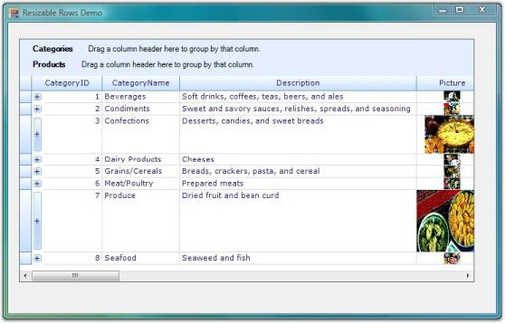
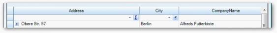

# Grid Helper Classes in Windows Forms GridGrouping

## Resizing Heights of Individual Rows in Grid

Grid Grouping control does not support resizing heights of individual rows in the grid. This feature has been newly added and can be implemented by initializing an instance of the AllowResizingIndividualRows class to GridEngineFactory in the Form's constructor of your Windows application. The following code examples illustrate how to do this.


  
GridEngineFactory.Factory = new Syncfusion.GridHelperClasses.AllowResizingIndividualRows();

 
GridEngineFactory.Factory = New Syncfusion.GridHelperClasses.AllowResizingIndividualRows()
 


You can make use of AllowResizingIndividualRows class by adding dependent assembly, Syncfusion.GridHelperClasses.Windows to the References folder in your application.

The following screen shot illustrates how the heights of individual rows in the grid have been resized.

  

## Grid Dynamic Filter

GridDynamicFilter class is used to wire a custom filter bar to the Grid Grouping control by replacing the default filter bar. The existing filter bar logic is extended to make the filter easy to use. This feature displays filtered results as you type each character.

The new filter bar adds two cell buttons, Filter button and Clear Filter button, inside every filter bar cell. The Filter button is used to display a list of available Compare Operators in a drop down. The selected operator will then be associated with the value present in the filter bar cell to form a filter string. Clear Filter button, as its name indicates, clears the record filters of the respective column. This button will be displayed for a filter bar cell only when that particular cell is in focus.

The following code example illustrates how to invoke Grid Dynamic Filter.


  
GridEngineFactory.Factory = new Syncfusion.GridHelperClasses.AllowResizingIndividualRows();

 
GridEngineFactory.Factory = New Syncfusion.GridHelperClasses.AllowResizingIndividualRows()
 


The following screen shot illustrates Grid Grouping control with filter drop down.

  

### Support to Save and Load Compare Operators State in Grid Dynamic Filter

GridDynamicFilter in GridGroupingControl is now an enhanced functionality to serialize/deserialize compare operator images in button. This can be achieved by handling the following method calls.

<code>filter.LoadCompareOperator();&lt;/code&gt;

<code>filter.SaveCompareOperator();&lt;/code&gt;

When the code runs, the following output displays.

  

### Apply Filter Only on Lost Focus in GridDynamicFilter

ApplyFilterOnlyOnCellLostFocus property enables you to turn off/on the filtering on each key stroke in GridDynamicFilter. Set ApplyFilterOnlyOnCellLostFocus property to true to filter only when the filter cell lost focus. This disables filtering for each key stroke including Enter, arrow keys, and tab keys. Defaults value is false and allows filtering for each key stroke.

The following code illustrates how to add ApplyFilterOnlyOnCellLostFocus property.


  
GridDynamicFilter filter = new GridDynamicFilter();
filter.ApplyFilterOnlyOnCellLoseFocus= true;



When the code runs, the following output displays.

  

## Setting up Foreign Key Relations

GridForeignKeyHelper class is used to set up foreign key relations to perform foreign key look ups. With this class, you can easily set up a foreign table with a single method call instead of implementing numerous steps.

The following code example illustrates how to use this class.


  
GridForeignKeyHelper.SetupForeignTableLookUp(gridGroupingControl1, "Country", countries, "CountryCode", "CountryName");

  
GridForeignKeyHelper.SetupForeignTableLookUp(gridGroupingControl1, "Country", countries, "CountryCode", "CountryName")



N> * The first argument in this method is an instance of Grid Grouping control.* The second argument is the column name of the Parent table's Value Member.* The third argument is the name of the Foreign table.* The fourth argument is the column name of Child table's Value Member.* The fifth argument is the column name of Child tables's Display Member.

The following screen shot illustrates Foreign Key Relations in the Grid Grouping control.

  

## Grid Field Chooser

You can customize column appearance of a Grid Grouping control by using plug-in utility called Field Chooser. FieldChooser class can be associated with Grid Grouping control to add or remove columns from the grid. The following code example illustrates this.


 
 FieldChooser fieldChooser = new FieldChooser(this.gridGroupingControl1)

  
Dim fieldChooser As New FieldChooser(Me.gridGroupingControl1)



Following screen shot shows Grid Grouping control with the Field dialog box.

  

To add or remove columns by using Field Chooser, right-click column header and select Field Chooser menu item to view Field dialog box. This dialog box lists all the column names with check boxes. You can select or clear check boxes to add or remove respective columns from Grid Grouping control.

A sample demonstration of Grid Field Chooser feature is available in the following sample installation path.

_&lt;Install Location&gt;\Syncfusion\EssentialStudio\[Version Number]\Windows\Grid.Grouping.Windows\Samples\Layout Customization\Field Chooser Demo_

## Filtering By Display Member

This topic elaborates on filtering columns in the Grid Data Bound Grid and Grid Grouping controls by their display member.

### Filtering Columns in Grid Data Bound Grid

GridDataBoundGridFilterBarExt class provides support to filter a column in DataBound Grid by its display member instead of the value member. This is accomplished by implementing a custom filter bar cell by replacing the default filter bar cell.

Following code example illustrates how to wire GridDataBoundGridFilterBarExt to Data Bound Grid.


  

private GridDataBoundGridFilterBarExt filterBar;
filterBar = new GridDataBoundGridFilterBarExt();
filterBar.WireGrid(this.gridDataBoundGrid1);

  

Private filterBar As GridDataBoundGridFilterBarExt
filterBar = New GridDataBoundGridFilterBarExt()
filterBar.WireGrid(Me.gridDataBoundGrid1)



Following screen shot illustrates how to filter a column in the Grid Data Bound Grid by its display member.

  

### Filtering Columns in Grid Grouping Control

GroupingGridFilterBarExt class provides support to filter a column in the Grid Grouping control by its display member instead of value member. This is accomplished by implementing a custom filter bar cell by replacing the default filter bar cell.

Following code example illustrates how to wire the GroupingGridFilterBarExt to the Grid Grouping control. 


  

private GroupingGridFilterBarExt gGCFilter;
this.gGCFilter = new GroupingGridFilterBarExt();
this.gGCFilter.WireGrid(this.gridGroupingControl1);

  

Private gGCFilter As GroupingGridFilterBarExt
Me.gGCFilter = New GroupingGridFilterBarExt()
Me.gGCFilter.WireGrid(Me.gridGroupingControl1)



Following screen shot illustrates how to filter a column in the Grid Grouping control by its display member.
  

## Excel-Like Filters

Office2007Filter and optimized GridExcelFilter are the two types of Excel-like filter. The next section explains these types in detail.

### Office2007Filter

Essential® Grid now provides an in-built filter similar to Microsoft Excel 2007 from the class GridOffice2007Filter with which the grid has to be wired.

#### Enabling Excel like filter 

Set Allow filter to true when Grid Control is wired with GridOffice2007Filter to enable Excel like filter to the Grid filter bar.

The following code illustrates how to add Excel Like Filter to the Grid filter bar.


  
GridOffice2007Filter filter;

 private void showFilter_CheckedChanged(object sender, EventArgs e)
    {
        this.gridGroupingControl1.TableDescriptor.Columns[0].AllowFilter = true;

            if (this.showFilter.Checked)
            {
                filter.WireGrid(this.gridGroupingControl1);
            }

            else
            {
                filter.UnWireGrid(this.gridGroupingControl1);
            }
        }

 
Private filter As GridOffice2007Filter

Private Sub showFilter_CheckedChanged(ByVal sender As Object, ByVal e As EventArgs)
Me.gridGroupingControl1.TableDescriptor.Columns(0).AllowFilter = True

    If Me.showFilter.Checked Then
        filter.WireGrid(Me.gridGroupingControl1)

        Else
          filter.UnWireGrid(Me.gridGroupingControl1)
        End If
    End Sub
	  


N> GridOffice2007Filter can be unwired from the grid to disable Excel like filter.

#### Specifying Value To Filter 

The feature has multiple selections of values to filter. 

You can specify the value of the column that has to filter in the check box of tree view inside the drop down container.

 

### Optimized GridExcelFilter

#### Use Case Scenarios

If Office2007Filter is used in a WF GridGroupingControl where the columns have a large number of unique items (say 5000 or 10000), the grid is unusable (hanged). To improve the performance, the new optimized GridExcelFilter can be used.

<table>
<tr>
<th>
METHOD </th><th>
DESCRIPTION </th><th>
PARAMETERS </th><th>
TYPE </th><th>
RETURN TYPE </th></tr>
<tr>
<td>
WireGrid</td><td>
Wires grid with filter.</td><td>
this.gridGroupingControl1 (control as argument)</td><td>
 Method</td><td>
 void </td></tr>
<tr>
<td>
UnWireGrid</td><td>
Unwire grid with filter. </td><td>
this.gridGroupingControl1 (control as argument)</td><td>
 Method</td><td>
 void </td></tr>
</table>

### Sample Link

To view a sample:

* Open Syncfusion® Dashboard. 
* Select UI > Windows Forms.
* Click Run Samples.  
* Navigate to GridGrouping Samples > Filters and Expressions > Optimized Excel Filter Demo

### Implementing optimized GridExcelFilter to GGC 

Set AllowFilter to True when the Grid control is wired with GridOffice2007Filter to enable Excel-like filtering in the grid filter bar.

The following code illustrates how to add Excel-like filter to grid filter bar:


  
GridExcelFilter filter;

private void showFilter_CheckedChanged(object sender, EventArgs e)
{
   this.gridGroupingControl1.TableDescriptor.Columns[0].AllowFilter = true;

       if (this.showFilter.Checked)
       {
            filter.WireGrid(this.gridGroupingControl1);
        }

       else
       {
            filter.UnWireGrid(this.gridGroupingControl1);
       }
}

  
Private filter As GridExcelFilter

Private Sub showFilter_CheckedChanged(ByVal sender As Object, ByVal e As EventArgs)
Me.gridGroupingControl1.TableDescriptor.Columns(0).AllowFilter = True

If Me.showFilter.Checked Then
filter.WireGrid(Me.gridGroupingControl1)

Else
filter.UnWireGrid(Me.gridGroupingControl1)
End If
End Sub
 


### GridExcelFilter Enhancement

GridExcelFilter’s FilterByColor functionality is used to filter GridGroupingControl based on its color. You can enable or disable FilterByColor functionality by customizing AllowFilterByColor property before wiring GridGroupingControl. FilterByColor functionality is available for cell background color and font color. 

The following screenshot shows the result of setting FilterByColor property in GridGroupingControl.

  

 The following code example shows how to set FilterByColor property for GridGroupingControl.


  
this.filter.AllowResize = true;
this.filter.AllowFilterByColor = true;
GridTableDescriptor td = this.gridGroupingControl1.TableDescriptor.Relations["ParentToChild"].ChildTableDescriptor;

foreach (GridColumnDescriptor col in td.Columns)
{
col.AllowFilter = true;
}
this.filter.WireGrid(gridGroupingControl1);



AllowFilterByColor

You can enable FilterByColor functionality in GridExcelFilter by setting AllowFilterByColor property. GridExcelFilter calculates the colors available in the collection of the Grid Grouping control and displays any five colors from the collection in a drop-down. You can view the other available colors by clicking the “_More Cell Colors/More Font Colors”_ option in the drop-down menu.

The following screen shots show the list of available colors when FilerByColor property is enabled in GridGroupingControl.

  

 

AllowResize

Using AllowResize property, you can enable or disable resizable functionality of the GridExcelFilter. GridExcelFilter has a resizable strip at the bottom of the filter popup, which is used to resize GridExcelFilter popup.
Search TextBox  
Search Textbox added in GridExcelFilter searches the available collection from checked listbox and displays searched results in the checked listbox.

### Filtering Null Values from the Grid

This feature is to provide support for filtering null or empty values from the grid using Excel-like filters. The filter choice will be in the name of “(Blanks)” when there are empty values in the grid.

Option to Filter Empty values in Application

The option to filter empty values (Blanks) will automatically be included in filter choices when there are one or more empty values in the grid. No property is needed to enable this feature.

  

### Date and Number Filter in GridExcelFilter

#### Date Filter

You can use EnableDateFilter property in GridExcelFilter to search and filter the dates quickly. The following screenshot shows the values that are filtered by years in a filter Drop-down box. 
 
  

#### Filter options 

You can use the following filter options by using context menu of the filter Drop-down.

* Equal - Returns the records that matches the given date.
* Before - Returns the records that are created before the given date.
* After - Returns the records that matches the records after the given date.
* Between - Returns the records that matches the records between the given dates.
* Today - Returns the records, which are matches today’s date.
* Tomorrow - To get the records that matches tomorrow’s date.
* Yesterday - To get the records that matches yesterday’s date.
* Month-wise - Using month-wise, you can filter the values for a particular month.
* Year-wise - Using year-wise, you can filter the values for a particular year.
* Quarter-wise - You can filter the records for a particular quarter.
* Custom filter - Using this option, you can filter the values based on customer dates.

You can filter the required dates using the above options in check box selection available in the filter Drop-down.

#### Number Filter

You can use EnableNumberFilter property in GridExcelFilter to filter the numbers that are displayed in a grid. This property is enabled in filter Drop-down when the cell value is in number format. You can filter the numbers using the following filter options.

##### Filter options 

* Equal - Returns the records the matches the given numeric value.
* Does Not Equal - Returns the records, which is not equal to the given date.
* Greater than - Returns the record that has the higher value than the given value.
* Greater than or equal - Returns the records that contain higher and equal value than the given one.
* Less than - Returns the records that have the lesser value than the given one
* Less than or equal - Returns the records that contains less or equal value for the given one.
* Between - Returns the records between the given two numeric values.
* Top 10 - Returns the top and bottom records using the new dialog box.
* Above average - Returns the records that are higher than the average value for the given numeric column.
* Below Average - Returns the records that are less than the average value for the given numeric column.
* Custom filter - Using this you can filter the records based on the custom filter option.

You can filter the top selected values or percentage of values using the Top 10 Filter option in EnableNumberFilter property. The following image shows an example of the Top 10 Filter option in EnableNumberFilter property.

  

You can select the number of items using numeric up down option. You can select upto 100 items using this option.

