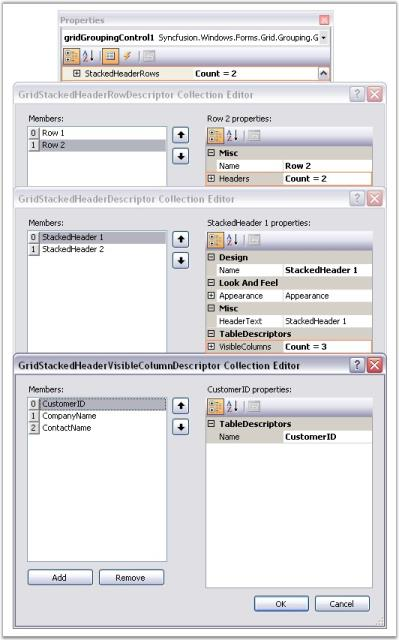
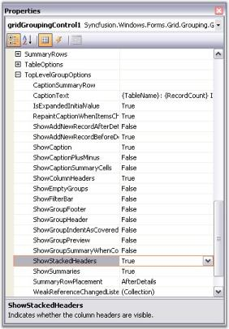
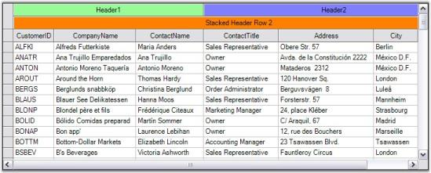
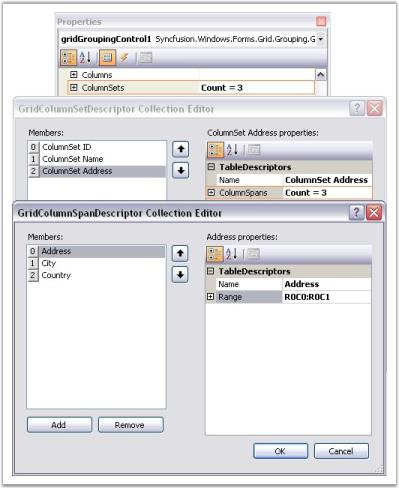
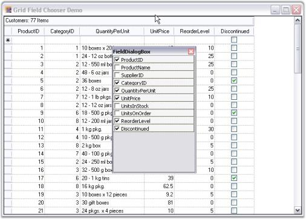

# Grid Layout

Grouping grid offers different layouts to organize data display. With default layout, grouping grid combines column headers into a single row docked to the top. Below the column headers are the rows of data records displayed with one record per row and only one record field per column.

This default arrangement can be modified to customize data views. This section discusses two features offered by the grouping grid in this regard.

## Stacked MultiHeaders

Essential Grouping Grid Control offers in-built support for Stacked MultiHeaders. This feature allows you to create additional unbound header rows called StackedHeaderRows that span across visible grid columns. You can group some columns under each header row. It also supports Drag/Drop of these header rows. Grouped columns will also be rearranged along with the header.

### StackedHeaderRows Collection

Stacked Header rows for a given Grid Table are gathered under TableDescriptor.StackedHeaderRows collection. This contains property definitions that control the behavior and appearance of Stacked Headers. A StackedHeaderRow collection can be viewed as a set of stacked header rows in which each header row contains a collection of stacked headers that span across multiple columns. 

Every header in a Stacked Header Row is defined by GridStackedHeaderDescriptor. All the headers for a given stacked header row is managed by GridStackedHeaderRowDescriptor. GridStackedHeaderRowDescriptorCollection, which is returned by TableDescriptor.StackedHeaderRows property manages the collection of GridStackedHeaderRowDescriptors for a given table. It is the GridStackedHeaderVisibleColumnDescriptor that binds a Column or ColumnSet to the StackedHeaderCell. 

The order in which the StackedHeaders will appear is determined by the VisibleColumns collection.When the layout of the GridStackedHeaderRow is calculated, the grid will loop through VisibleColumns collection and find StackedHeader Descriptor that references the VisibleColumn. If the same StackedHeader references multiple neighboring VisibleColumns, then the header for these columns will be drawn as one cell. If there are no visible columns specified for a StackedHeader, then it will span across all the visible columns similar to a Caption.

You will be able to rearrange the columns by dragging the stacked headers. While doing so, it is the Visible Columns collection that is being affected. Since the order of stacked headers is dependent on Visible Columns, the GridStackedHeaderCollections itself does not need to be modified.

It is possible to add Stacked Headers for nested tables and groups too. You can enable the display of StackedHeaders by setting ShowStackedHeaders property to true.

* TopLevelGroupOptions.ShowStackedHeaders - Toggles the display of StackedHeaders for top most group.
* ChildGroupOptions.ShowStackedHeaders - Toggles the display of StackedHeaders for child groups.
* NestedTableGroupOptions.ShowStackedHeaders - Toggles the display of StackedHeaders for child table and its groups.

#### Through Designer

Creating Stacked Headers is a two-step process. 

1. As a first step, you must define the Stacked Header Rows by accessing TableDescriptor.StackedHeaderRows property. This will open GridStackedHeaderRowDescriptor Collection Editor wherein you can add as many header rows as you want by specifying different attributes like HeaderText, VisibleColumns, Appearance, and so on, for each header in the header row.

  

#### Property Definitions

<table>
<tr>
<th>
PROPERTY NAMES</th><th>
DESCRIPTION</th></tr>
<tr>
<td>
Name</td><td>
Specifies the name of the descriptor.</td></tr>
<tr>
<td>
HeaderText</td><td>
Specifies the text to be displayed in the StackedHeaderCell.</td></tr>
<tr>
<td>
VisibleColumns</td><td>
The collection of columns that should be combined under the Stacked Header.</td></tr>
<tr>
<td>
Appearance</td><td>
Controls the appearance of the StackedHeaderCell.</td></tr>
</table>

2.The second step is to enable the display of StackedHeaders for the given table and group by setting ShowStackedHeaders property to true.

  

Output

Here are the screen shots showing Grouping Grid with two Stacked Header Rows. It illustrates the effect of doing Drag and Drop on StackedHeaders. Notice that the order of the Visible columns gets affected automatically while rearranging StackedHeaders.

  

  

  

#### StackedHeaders for NestedGroups

Stacked Headers can be enabled for Child Group by setting ChildGroupOptions.ShowStackedHeaders to true. The grouping grid in the image below displays stacked headers for nested groups.

  

#### Appearance

Appearance of StackedHeaders can be controlled in a couple of ways. One way to access Appearance.StackedHeaderCell property is to enter appearance definitions. Appearance set this way will be applied to all stacked header cells. An alternate way is to specify appearance settings through GridStackedHeaderRow Descriptor. In this way, you can have different settings for individual stacked headers in each StackedHeaderRow.

Here is the property window with GridStackedHeaderRowDescriptor Collection Editor showing the appearance settings of Stacked Headers defined.

  

Output

Here is the effect of the above settings.

  

#### Programmatically

You can add Stacked Header Rows at runtime too. To achieve this, first you must define the required number of GridStackedHeaderDescriptors by specifying VisibleColumns for each. Next, create StackedHeaderRow by instantiating GridStackedHeaderRowDescriptor and then add the above defined stacked headers into it. Finally, add this header row into TableDescriptor.StackedHeaderRows collection. The following code example illustrates this process.

 

GridStackedHeaderDescriptor shd = new GridStackedHeaderDescriptor("header1", "StackedHeader1");

shd.VisibleColumns.Add(new GridStackedHeaderVisibleColumnDescriptor("CustomerName"));

shd.VisibleColumns.Add(new GridStackedHeaderVisibleColumnDescriptor("CompanyName"));

GridStackedHeaderRowDescriptor shrd = new GridStackedHeaderRowDescriptor("Row1",

new GridStackedHeaderDescriptor[] { shd });

this.gridGroupingControl1.TableDescriptor.StackedHeaderRows.Add(shrd);

//Customizes Appearance.

this.gridGroupingControl1.Appearance.StackedHeaderCell.BackColor = Color.Teal;

 

 

Dim shd As GridStackedHeaderDescriptor = New GridStackedHeaderDescriptor("header1", "StackedHeader1")

shd.VisibleColumns.Add(New GridStackedHeaderVisibleColumnDescriptor("CustomerName"))

shd.VisibleColumns.Add(New GridStackedHeaderVisibleColumnDescriptor("CompanyName"))

Dim shrd As GridStackedHeaderRowDescriptor = New GridStackedHeaderRowDescriptor("Row1", 

New GridStackedHeaderDescriptor() { shd })

Me.gridGroupingControl1.TableDescriptor.StackedHeaderRows.Add(shrd)

'Customizes Appearance.

Me.gridGroupingControl1.Appearance.StackedHeaderCell.BackColor = Color.Teal

 

N>: For more details, refer to the following browser sample:

> _&lt;Install Location&gt;\Syncfusion\EssentialStudio\[Version Number]\Windows\Windows\Grid.Grouping.Windows\Samples\Layout Customization\Stacked Headers Demo_

## MultiRow Record

Grid Grouping control offers built-in support for MultiRowRecords. This feature allows the records to span across multiple rows and columns. It is achieved through the property, TableDescriptor.ColumnSets. It allows you to modify default alignment of visible columns. 

### ColumnSets Collection

ColumnSets act as superset of TableDescriptor.Columns collection. Once ColumnSets are defined, the grouping grid will then loop through the collection and organize data display accordingly. Each ColumnSet is defined by GridColumnSetDescriptor. ColumnSets are managed by GridColumnSetDescriptorCollection that is returned by TableDescriptor.ColumnSets property.

#### Programmatically

Follow the steps below to span the records across multiple rows.

1. Define GridColumnSpanDescriptor for each column to be spanned across grid rows or columns. Specify the range that the column spans. Rows and Columns are zero-based.

  

GridColumnSpanDescriptor csd0 = new GridColumnSpanDescriptor("EmployeeID");

csd0.Range = GridRangeInfo.Cells(0, 0, 1, 0);

GridColumnSpanDescriptor csd1 = new GridColumnSpanDescriptor("Address");

csd1.Range = GridRangeInfo.Cells(0, 1, 0, 2);

GridColumnSpanDescriptor csd2 = new GridColumnSpanDescriptor("City");

csd2.Range = GridRangeInfo.Cells(1, 1, 1, 1);

GridColumnSpanDescriptor csd3 = new GridColumnSpanDescriptor("Country");

csd3.Range = GridRangeInfo.Cells(1, 2, 1, 2);



  

Dim csd0 As GridColumnSpanDescriptor = New GridColumnSpanDescriptor("EmployeeID")

csd0.Range = GridRangeInfo.Cells(0, 0, 1, 0)

Dim csd1 As GridColumnSpanDescriptor = New GridColumnSpanDescriptor("Address")

csd1.Range = GridRangeInfo.Cells(0, 1, 0, 2)

Dim csd2 As GridColumnSpanDescriptor = New GridColumnSpanDescriptor("City")

csd2.Range = GridRangeInfo.Cells(1, 1, 1, 1)

Dim csd3 As GridColumnSpanDescriptor = New GridColumnSpanDescriptor("Country")

csd3.Range = GridRangeInfo.Cells(1, 2, 1, 2)



2.Create a GridColumnSetDescriptor whose ColumnSpans property stores information about columns that need to be spanned. Hence, you need to initialize ColumnSpans property with Columns (ColumnSpanDescriptors of the desired columns) you want to spread.

  

GridColumnSetDescriptor csd = new GridColumnSetDescriptor();

csd.ColumnSpans.Add(csd0);

csd.ColumnSpans.Add(csd1);

csd.ColumnSpans.Add(csd2);

csd.ColumnSpans.Add(csd3);



 

Dim csd As GridColumnSetDescriptor = New GridColumnSetDescriptor()

csd.ColumnSpans.Add(csd0)

csd.ColumnSpans.Add(csd1)

csd.ColumnSpans.Add(csd2)

csd.ColumnSpans.Add(csd3)

 

3.Finally bind this ColumnSet to the grid by adding the above created GridColumnSetDescriptor into the TableDescriptor.ColumnSets property.

  

this.gridGroupingControl1.TableDescriptor.ColumnSets.Add(csd);



  

Me.gridGroupingControl1.TableDescriptor.ColumnSets.Add(csd



4.Here is a sample output.

 

Through Designer

To create ColumnSets that defines ColumnSpans for a grid, select TableDescriptor.ColumnSets property in the property window. This will open GridColumnSetDescriptor Collection Editor that will let you specify the columns to span and the range for each of the columns.

  

N>: For more details, refer to the following browser sample:

> _&lt;Install Location&gt;\Syncfusion\EssentialStudio\[Version Number]\Windows\Grid.Grouping.Windows\Samples\Serialization\Employee View Demo_

## Grid Field Chooser

The view of a grid can be customized based on column visibility by using plug-in utility called Field Chooser. A Field Chooser can be associated to Grid Grouping control to add or remove columns from a grid. It can be done by intializing FieldChooser class where the constructor takes a parameter as a Grid Grouping control object.

Enabling the Field Chooser allows the user to right-click on a column header and select Field Chooser menu item to view the Field Chooser dialog. This dialog will list all the column names with check boxes beside them. The required columns can be made visible in the grid by selecting the check box adjacent to the required column.

The following code example illustrates the usage of Field Chooser.

 

FieldChooser fchooser = new FieldChooser(this.gridGroupingControl1);

 

  

Dim fchooser As FieldChooser = New FieldChooser(Me.gridGroupingControl1)



  

For more details, refer the following sample:

_&lt;Install Location&gt;\Syncfusion\EssentialStudio\[Version Number]\Windows\Grid.Grouping.Windows\Samples\Layout Customization\Field Chooser Demo_

### Field Chooser Update on Close support

Using FieldChooser, the required columns can be made visible or invisible by selecting the checkbox adjacent to the required column. But the changes will be made alongside while checking or unchecking the checkbox in the FieldChooser dialog box. To update the Visibility or Invisibility of columns after closing the FieldChooser Dialog box, you have to set DeferLayoutUpdate property to _‘True’_.

   
FieldChooser fchooser = new FieldChooser(this.gridGroupingControl1);
fchooser.DeferLayoutUpdate = true;



  
 Dim fchooser As FieldChooser = New FieldChooser(Me.gridGroupingControl1)
fchooser.DeferLayoutUpdate = True

 

### Field Chooser Events

FieldChooser events are used to customize FieldChooser dialog box. Field chooser events allow the user to modify control of the FieldChooser dialog and change its caption name. It has events to perform operations in FieldChooser dialog box such as FieldChooserShowing, FieldChooserShown, FieldChooserClosing,and FieldChooserClosed events.

<table>
<tr>
<th>
EVENTS</th><th>
DESCRIPTION</th><th>
ARGUMENTS</th><th>
TYPE</th></tr>
<tr>
<td>
FieldChooserShowing</td><td>
This event is handled before the FieldChooser DialogBox is shown either in the stacked header or column header. This event is generally used to change the caption of the DialogBox, get and set the control of TreeviewAdv or Grid controls, and also used to cancel showing the FieldChooser dialog.</td><td>
public FieldChooserShowingEventArgs (string caption, object fieldList);</td><td>
Event </td></tr>
<tr>
<td>
FieldChooserShown</td><td>
This event is handled after the FieldChooser dialog is shown. This event is generally used to get the caption name of the FieldChooser dialog box and get the control of the TreeviewAdv or Grid controls.</td><td>
public FieldChooserShownEventArgs(string caption, object fieldList);</td><td>
Event</td></tr>
<tr>
<td>
FieldChooserClosing</td><td>
This event is generally used to change the caption name of the dialog, get and set the control of TreeviewAdv or Grid controls, and also used to cancel closing the FieldChooser dialog.</td><td>
public FieldChooserClosingEventArgs(string caption, object fieldList);</td><td>
Event</td></tr>
<tr>
<td>
FieldChooserClosed</td><td>
This event is handled after the FieldChooser Dialog Box is closed. This event is generally used to get the caption name of the FieldChooser dialog, and get the control of the TreeviewAdv or Grid controls after closing the FieldChooser dialog.</td><td>
public FieldChooserClosedEventArgs(string caption, object fieldList);</td><td>
Event</td></tr>
</table>

The following code sample illustrates handling FieldChooserShowing event. It is used to change the caption of the FieldChooser dialog and cancel the showing of FieldChooser dialog.

  

//FieldChooserShowing Event.

        void gridGroupingControl1_FieldChooserShowing(object sender, FieldChooserShowingEventArgs e)

        {

            e.Caption = "Syncfusion";

            e.Cancel = true;

        }



 

'FieldChooserShowing Event.

 Private Sub GroupingControl_FieldChooserShowing(ByVal sender As Object, ByVal e As Syncfusion.Windows.Forms.Grid.FieldChooserShowingEventArgs)

            e.Caption = "Syncfusion"

            e.Cancel = True

        End Sub

 

The following code example illustrates handling FieldChooserShown event. It is used to get the caption name of FieldChooser dialog after showing the dialog box.

 

//FieldChooserShown Event.

        void gridGroupingControl1_FieldChooserShown(object sender, FieldChooserShownEventArgs e)

        {

            string captionName = e.Caption;

            Console.WriteLine(captionName);

        }

 

  

'FieldChooserShown Event.

        Private Sub GroupingControl_FieldChooserShown(ByVal sender As Object, ByVal e As Syncfusion.Windows.Forms.Grid.FieldChooserShownEventArgs)

            Dim captionName As String = e.Caption

            Console.WriteLine(captionName)

        End Sub



The following code example illustrates handling FieldChooserClosing event. Here it is used to change the caption name of the FieldChooser dialog and cancel closing it.

  

//FieldChooserClosing Event.

        void gridGroupingControl1_FieldChooserClosing(object sender, FieldChooserClosingEventArgs e)

        {

            e.Caption = "Syncfusion Inc";

            e.Cancel = true;

        }



 

'FieldChooserClosing Event.

                  Private Sub GroupingControl_FieldChooserClosing(ByVal sender As Object, ByVal e As Syncfusion.Windows.Forms.Grid.FieldChooserClosingEventArgs)

            e.Caption = "Syncfusion Inc"

            e.Cancel = True

        End Sub

 

The following code example illustrates handling FieldChooserClosed event. Here it is used to get the caption name of the FieldChooser dialog after closing it.

  

//FieldChooserClosed Event.

        void gridGroupingControl1_FieldChooserClosed(object sender, FieldChooserClosedEventArgs e)

        {

            string caption = e.Caption;

            Console.WriteLine(caption);

        }



  

'FieldChooserClosed Event.

       Private Sub GroupingControl_FieldChooserClosed(ByVal sender As Object, ByVal e As Syncfusion.Windows.Forms.Grid.FieldChooserClosedEventArgs)

            Dim captionName As String = e.Caption.ToString()

            Console.WriteLine(captionName)

        End Sub

		

		
## Field Chooser for Stacked Header

GridGrouping control in Essential Grid provides field chooser support for stacked headers. The field chooser feature enables you to customize a column in a grid at runtime without modifying the database it is bound to. 

Use Case Scenarios

When you want to show or hide the columns of a stacked header in a grid without deleting its bound records, you can achieve this using this feature.

<table>
<tr>
<th>
PROPERTY </th><th>
DESCRIPTION </th><th>
TYPE </th><th>
DATA TYPE </th></tr>
<tr>
<td>
EnableColumnsInView</td><td>
Used to enable or disable the column names in the field chooser dialog.</td><td>
Property </td><td>
Boolean </td></tr>
</table>

_Constructor_

<table>
<tr>
<th>
CONSTRUCTOR </th><th>
DESCRIPTION </th><th>
PARAMETERS </th><th>
TYPE </th><th>
RETURN TYPE </th></tr>
<tr>
<td>
FieldChooser</td><td>
Used to wire the GridGroupin gControl  with the field chooser. </td><td>
(&lt;GridGroupingControl&gt;)</td><td>
Constructor</td><td>
class</td></tr>
</table>

Sample Link

A demo of this feature is available in the following location: 

_&lt;Install Location&gt;\Syncfusion\EssentialStudio\[Version Number]\Windows\Grid.Grouping.Windows\Samples\Layout Customization\Stacked Headers Demo_

Adding Field Chooser Stacked Headers In GridGroupingControl

1. To add field chooser, create a constructor using _FieldChooser_ class and pass _GridGroupingControl_ as the parameter.

The following code illustrates this: 

  

//Wires GridGroupingControl with the field chooser.

            FieldChooser fchooser = new FieldChooser(this.gridGroupingControl1);

Here is the code snippet used to disable the EnableColumnsInView property.:

//Disables EnableColumnsInView property.

           fchooser.EnableColumnsInView = false;



 

'Wires GridGroupingControl with the field chooser.

            Dim fchooser As FieldChooser = New FieldChooser(Me.gridGroupingControl1)

'Disables EnableColumnsInView property.

            fchooser.EnableColumnsInView = False

  

When the code runs, the entire grid will open.

2.Right click on a column header and select Field Chooser menu item to view Field Chooser dialog.

  

3.This dialog will list all the column names with check boxes adjacent to them.

  

4.Select the checkboxes of the columns to be displayed in the grid. The grid will have only the columns that are selected in the Field Chooser dialog.

  

