# Grouping in Windows Forms GridGrouping control
GridGroupingControl lets you group the data by one or more columns. Data will be organized into a hierarchical structure based on the matching field values. This section will explain about the architecture and what are the possible ways to achieve the Grouping.

If Grouping is enabled in GridGroupingControl, then there will be a specific area at the top of the Grid which shows the grouping options. This area is known as the [GroupDropArea](https://help.syncfusion.com/cr/windowsforms/Syncfusion.Windows.Forms.Grid.Grouping.GridGroupDropArea.html). `GroupDropArea` is made up of a collection of GridControls packed in a panel named [GroupDropPanel](https://help.syncfusion.com/cr/windowsforms/Syncfusion.Windows.Forms.Grid.Grouping.GridGroupingControl.html#Syncfusion_Windows_Forms_Grid_Grouping_GridGroupingControl_GroupDropPanel). The functions and properties of `GroupDropArea`, `GroupDropPanel` and other options related to it will be explained in the upcoming sections.

The grouped columns are maintained by the [GroupedColumns](https://help.syncfusion.com/cr/windowsforms/Syncfusion.Grouping.TableDescriptor.html#Syncfusion_Grouping_TableDescriptor_GroupedColumns) collection. This collection defines the field to group and the sort. The collection can have multiple entries resulting in nested groups.



// The column ‘Title’ will be grouped by using this code
this.gridGroupingControl1.TableDescriptor.GroupedColumns.Add("Title");


' The column ‘Title’ will be grouped by using this code
Me.gridGroupingControl1.TableDescriptor.GroupedColumns.Add("Title")



The `GroupDropArea` can be shown in the GridGroupingControl by enabling the [ShowGroupDropArea](https://help.syncfusion.com/cr/windowsforms/Syncfusion.Windows.Forms.Grid.Grouping.GridGroupingControl.html#Syncfusion_Windows_Forms_Grid_Grouping_GridGroupingControl_ShowGroupDropArea) property.



//Enabling the GroupDropArea
this.gridGroupingControl1.ShowGroupDropArea = true;


'Enabling the GroupDropArea
Me.gridGroupingControl1.ShowGroupDropArea = True



## Adding Data Groups

### Adding Groups Through Designer
Grouping can also be done at design time. After binding dataset to the grouping grid, open [TableDescriptor](https://help.syncfusion.com/cr/windowsforms/Syncfusion.Windows.Forms.Grid.Grouping.GridTableDescriptor.html) section in property grid of GridGroupingControl. In that, accessing `GroupedColumns` property will open [SortColumnDescriptorCollection](https://help.syncfusion.com/cr/windowsforms/Syncfusion.Grouping.SortColumnDescriptorCollection.html) Editor.

### Programmatic Grouping
The data can be grouped by adding the column name to [GroupedColumns.Add](https://help.syncfusion.com/cr/windowsforms/Syncfusion.Grouping.SortColumnDescriptorCollection.html#Syncfusion_Grouping_SortColumnDescriptorCollection_Add_Syncfusion_Grouping_SortColumnDescriptor_) method.



// The column ‘Title’ will be grouped by using this code
this.gridGroupingControl1.TableDescriptor.GroupedColumns.Add("Title");


' The column ‘Title’ will be grouped by using this code
Me.gridGroupingControl1.TableDescriptor.GroupedColumns.Add("Title")



By default, the grouping of a column sorts records in the ascending order of their `GroupedColumns` values. It is possible to specify the sort order while grouping. The code below arranges the data in the descending order of their Title field values.



// The column ‘Title’ will be will be sorted in descending order
this.gridGroupingControl1.TableDescriptor.GroupedColumns.Add("Title", ListSortDirection.Descending);


' The column ‘Title’ will be will be sorted in descending order
Me.gridGroupingControl1.TableDescriptor.GroupedColumns.Add("Title", ListSortDirection.Descending)



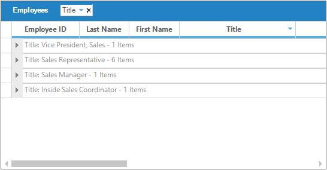

It is also possible to group columns in multiple tables which are used in nested manner. By getting access to the [GroupedColumns](https://help.syncfusion.com/cr/windowsforms/Syncfusion.Windows.Forms.Grid.Grouping.GridTableDescriptor.html) property of the [ChildTableDescriptor](https://help.syncfusion.com/cr/windowsforms/Syncfusion.Grouping.RelationDescriptor.html#Syncfusion_Grouping_RelationDescriptor_ChildTableDescriptor) the desired child table can be grouped. 



this.gridGroupingControl1.TableDescriptor.Relations[0].ChildTableDescriptor.GroupedColumns.Add("UnitPrice", ListSortDirection.Descending);


Me.gridGroupingControl1.TableDescriptor.Relations(0).ChildTableDescriptor.GroupedColumns.Add("UnitPrice", ListSortDirection.Descending)



## Removing Data Groups
Grouped Columns provide two methods to remove a specific group from the collection. [Remove](https://help.syncfusion.com/cr/windowsforms/Syncfusion.Grouping.SortColumnDescriptorCollection.html#Syncfusion_Grouping_SortColumnDescriptorCollection_Remove_Syncfusion_Grouping_SortColumnDescriptor_) method deletes the column with a given name from `GroupedColumns` collection. [RemoveAt](https://help.syncfusion.com/cr/windowsforms/Syncfusion.Grouping.SortColumnDescriptorCollection.html#Syncfusion_Grouping_SortColumnDescriptorCollection_RemoveAt_System_Int32_) method deletes the element at the specified index from the collection. As a result of both methods, the table data is ungrouped by that specified column. 



//Removes the first element.
this.gridGroupingControl1.TableDescriptor.GroupedColumns.RemoveAt(0);

//Removes the ‘Title’ element from the columns collection.
this.gridGroupingControl1.TableDescriptor.GroupedColumns.Remove("Title");


'Removes the first element.
Me.gridGroupingControl1.TableDescriptor.GroupedColumns.RemoveAt(0)

'Removes the ‘Title’ element from the columns collection.
Me.gridGroupingControl1.TableDescriptor.GroupedColumns.Remove("Title")



### Prevent Grouping
To disallow a column being grouped, [AllowGroupByColumn](https://help.syncfusion.com/cr/windowsforms/Syncfusion.Windows.Forms.Grid.Grouping.GridColumnDescriptor.html#Syncfusion_Windows_Forms_Grid_Grouping_GridColumnDescriptor_AllowGroupByColumn) property should be set to `false` for that particular column. This property determines whether the grid can be grouped by a column when the user drags the column to `GroupDropArea`.



// User cannot drag over the second column in the GroupDropArea.
this.gridGroupingControl1.TableDescriptor.Columns[2].AllowGroupByColumn = false;


' User cannot drag over the second column in the GroupDropArea.
Me.gridGroupingControl1.TableDescriptor.Columns(2).AllowGroupByColumn = False



### Prevent Grouping using Event
The column can also be prevented from being grouped by handling [TableControlQueryAllowGroupByColumn](https://help.syncfusion.com/cr/windowsforms/Syncfusion.Windows.Forms.Grid.Grouping.GridGroupingControl.html) event.



this.gridGroupingControl1.TableControlQueryAllowGroupByColumn += new GridQueryAllowGroupByColumnEventHandler(gridGroupingControl1_TableControlQueryAllowGroupByColumn);

void gridGroupingControl1_TableControlQueryAllowGroupByColumn(object sender, GridQueryAllowGroupByColumnEventArgs e)
{

    //Checking the column name

    if (e.Column == "Title")
    {

        //Disabling from grouping
        e.AllowGroupByColumn = false;
    }
}


AddHandler gridGroupingControl1.TableControlQueryAllowGroupByColumn, AddressOf gridGroupingControl1_TableControlQueryAllowGroupByColumn

Private Sub gridGroupingControl1_TableControlQueryAllowGroupByColumn(ByVal sender As Object, ByVal e As GridQueryAllowGroupByColumnEventArgs)

    'Checking the column name

    If e.Column = "Title" Then

        'Disabling from grouping
        e.AllowGroupByColumn = False
    End If
End Sub



### Clear Grouping
[GroupedColumns.Clear](https://help.syncfusion.com/cr/windowsforms/Syncfusion.Grouping.SortColumnDescriptorCollection.html#Syncfusion_Grouping_SortColumnDescriptorCollection_Clear) method will remove all the elements from `**GroupedColumns`**Collection and hence the data will get ungrouped. 



// Removes all the grouped elements from the collection.
this.gridGroupingControl1.TableDescriptor.GroupedColumns.Clear();


' Removes all the grouped elements from the collection.
Me.gridGroupingControl1.TableDescriptor.GroupedColumns.Clear()



## GroupDropArea
**`GroupDropArea`** provides drop panel onto which the user can drag and drop the column headers to group table data by those columns. Its visibility can be controlled by [ShowGroupDropArea](https://help.syncfusion.com/cr/windowsforms/Syncfusion.Windows.Forms.Grid.Grouping.GridGroupingControl.html#Syncfusion_Windows_Forms_Grid_Grouping_GridGroupingControl_ShowGroupDropArea) property. Once it is set to true, a GroupDropPanel will be added at the top of the grouping grid.



// Allows GroupDropArea to be visible.
this.gridGroupingControl1.ShowGroupDropArea = true;


' Allows GroupDropArea to be visible.
Me.gridGroupingControl1.ShowGroupDropArea = True


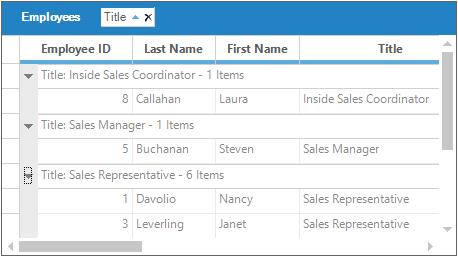

### Adding GroupDropArea
**`ShowGroupDropArea`** property will enable `GroupDropArea` only for the table at the top level. When nested tables are used, drop areas for the child tables need to be added at run time. It is achieved by calling [AddGroupDropArea](https://help.syncfusion.com/cr/windowsforms/Syncfusion.Windows.Forms.Grid.Grouping.GridGroupingControl.html#Syncfusion_Windows_Forms_Grid_Grouping_GridGroupingControl_AddGroupDropArea_Syncfusion_Windows_Forms_Grid_Grouping_GridTable_) method, by specifying the respective child table name in its parameter.

In this example, the grid is bound to a hierarchical dataset containing three tables Categories, Products, and OrderDetails. The following code example illustrates how to add the group drop area for the child tables Products and OrderDetails.



//Getting parent main table
Table categoriesTable = this.gridGroupingControl1.Engine.Table;

//Getting child table of categories table
Table productsTable = categoriesTable.RelatedTables["Products"];

//Getting child table of products table
Table orderDetailsTable = productsTable.RelatedTables["OrdersDetails"];

//Adding GroupDropArea for Products table
this.gridGroupingControl1.AddGroupDropArea((GridTable)productsTable);

//Adding GroupDropArea for OrdersDetails table
this.gridGroupingControl1.AddGroupDropArea((GridTable)orderDetailsTable);


'Getting parent main table
Dim categoriesTable As Table = Me.gridGroupingControl1.Engine.Table

'Getting child table of categories table
Dim productsTable As Table = categoriesTable.RelatedTables("Products")

'Getting child table of products table
Dim orderDetailsTable As Table = productsTable.RelatedTables("OrdersDetails")

'Adding GroupDropArea for Products table
Me.gridGroupingControl1.AddGroupDropArea(CType(productsTable, GridTable))

'Adding GroupDropArea for OrdersDetails table
Me.gridGroupingControl1.AddGroupDropArea(CType(orderDetailsTable, GridTable))



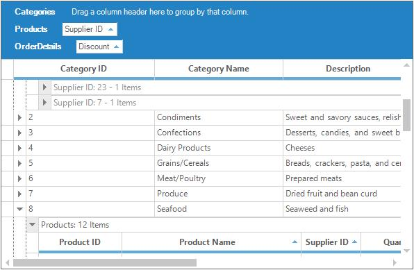

### Customizing GroupDropArea
`GroupDropArea` is made up of a collection of Grid controls packed in a panel named `GroupDropPanel`. A Splitter provides the insulation between `GroupDropPanel` and Grid Table Panel by using the size of Drop Panel that can be adjusted at run time.

Customizing of `GroupDropArea` can be done by using three properties named `GroupDropArea`, `GroupDropPanel` and [Splitter](https://help.syncfusion.com/cr/windowsforms/Syncfusion.Windows.Forms.Grid.Grouping.GridGroupingControl.html#Syncfusion_Windows_Forms_Grid_Grouping_GridGroupingControl_Splitter)**.**

To change the splitter color, make use of the **Splitter.BackColor**property.



//Sets the BackColor of the splitter.
this.gridGroupingControl1.Splitter.BackColor = Color.Green;


'Sets the BackColor of the splitter.
Me.gridGroupingControl1.Splitter.BackColor = Color.Green



Below code can be used to change the BackColor of the `GroupDropArea`.



//Sets the BackColor of the GroupDropArea.
this.gridGroupingControl1.Splitter.BackColor = Color.Green;


'Sets the BackColor of the GroupDropArea.
Me.gridGroupingControl1.Splitter.BackColor = Color.Green



GroupDropArea can be accessed as a grid, events like [PrepareViewStyleInfo](https://help.syncfusion.com/cr/windowsforms/Syncfusion.Windows.Forms.Grid.GridControlBase.html) can be used. Using this event, you can change the Font, Text, TextColor and other customizations in GroupDropArea. 


foreach (Control ctrl in this.gridGroupingControl1.GroupDropPanel.Controls)
{
    GridGroupDropArea groupDropArea = ctrl as GridGroupDropArea;

    switch (groupDropArea.Model.Table.TableDescriptor.Name)
    {

        case "Customers":
            groupDropArea.BackColor = Color.DarkOliveGreen;
            groupDropArea.PrepareViewStyleInfo += new System.EventHandler(ParentTable_PrepareViewStyleInfo);
            break;

        case "Orders":
            groupDropArea.BackColor = Color.DarkOliveGreen;
            groupDropArea.PrepareViewStyleInfo += new GridPrepareViewStyleInfoEventHandler(ChildTable_PrepareViewStyleInfo);
            break;
    }
}
this.gridGroupingControl1.Splitter.BackColor = Color.IndianRed;



For Each ctrl As Control In Me.gridGroupingControl1.GroupDropPanel.Controls
    Dim groupDropArea As GridGroupDropArea = TryCast(ctrl, GridGroupDropArea)

    Select Case groupDropArea.Model.Table.TableDescriptor.Name

        Case "Customers"
            groupDropArea.BackColor = Color.DarkOliveGreen
            AddHandler groupDropArea.PrepareViewStyleInfo, AddressOf ParentTable_PrepareViewStyleInfo

        Case "Orders"
            groupDropArea.BackColor = Color.DarkOliveGreen
            AddHandler groupDropArea.PrepareViewStyleInfo, AddressOf ChildTable_PrepareViewStyleInfo
    End Select
Next ctrl
Me.gridGroupingControl1.Splitter.BackColor = Color.IndianRed



The below example shows the Parent table’s `GridGroupDropArea` is customized,



Private Sub ParentTable_PrepareViewStyleInfo(ByVal sender As object, ByVal e As GridPrepareViewStyleInfoEventArgs);

    //Sets color to the text displaying table name.

    if (e.ColIndex == 2 && e.RowIndex == 2)
    {
        e.Style.Text = "Parent";
        e.Style.Font.Bold = true;
        e.Style.TextColor = Color.Yellow;
        e.Style.CellType = "Static";
        e.Style.HorizontalAlignment = GridHorizontalAlignment.Left;

        //e.Style.Enabled = false;

    //Sets color to the drop area.
    }

    else if (e.Style.Text.StartsWith("Drag a"))
    {
        e.Style.Text = "Drag and Drop Parent Table Column headers";
        e.Style.Font.Italic = true;
    }
}


Private Sub ParentTable_PrepareViewStyleInfo(ByVal sender As Object, ByVal e As GridPrepareViewStyleInfoEventArgs)

    'Sets color to the text displaying table name.

    If e.ColIndex = 2 AndAlso e.RowIndex = 2 Then
        e.Style.Text = "Parent"
        e.Style.Font.Bold = True
        e.Style.TextColor = Color.Yellow
        e.Style.CellType = "Static"
        e.Style.HorizontalAlignment = GridHorizontalAlignment.Left

        'e.Style.Enabled = false;

    'Sets color to the drop area.

    ElseIf e.Style.Text.StartsWith("Drag a") Then
        e.Style.Text = "Drag and Drop Parent Table Column headers"
        e.Style.Font.Italic = True
    End If
End Sub



The below example shows the child table’s `GridGroupDropArea` is customized,



private void ChildTable_PrepareViewStyleInfo(object sender, GridPrepareViewStyleInfoEventArgs e)
{

    //Sets color to the text displaying table name.

    if (e.ColIndex == 2 && e.RowIndex == 2)
    {
        e.Style.Text = "Child ";
        e.Style.Font.Bold = true;
        e.Style.TextColor = Color.Yellow;
        e.Style.HorizontalAlignment = GridHorizontalAlignment.Left;

        //e.Style.Enabled = false;

    //Sets color to the drop area.
    }
    else if (e.Style.Text.StartsWith("Drag a"))
    {
        e.Style.Text = "Drag and Drop Child Table Column headers";
        e.Style.TextColor = Color.Orange;
        e.Style.Font.Italic = true;
    }

}


Private Sub ChildTable_PrepareViewStyleInfo(ByVal sender As Object, ByVal e As GridPrepareViewStyleInfoEventArgs)

    'Sets color to the text displaying table name.

    If e.ColIndex = 2 AndAlso e.RowIndex = 2 Then
        e.Style.Text = "Child "
        e.Style.Font.Bold = True
        e.Style.TextColor = Color.Yellow
        e.Style.HorizontalAlignment = GridHorizontalAlignment.Left

        'e.Style.Enabled = false;

    'Sets color to the drop area.

    ElseIf e.Style.Text.StartsWith("Drag a") Then
        e.Style.Text = "Drag and Drop Child Table Column headers"
        e.Style.TextColor = Color.Orange
        e.Style.Font.Italic = True
    End If
End Sub



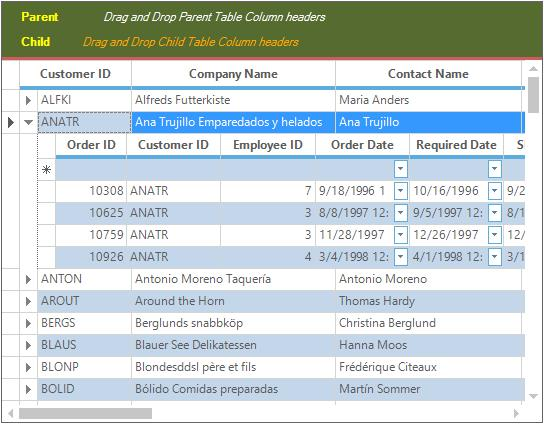

### GroupDropArea Position
By default, GroupDropArea is displayed at the top of the GridGroupingControl. With [GroupDropAreaAlignment](https://help.syncfusion.com/cr/windowsforms/Syncfusion.Windows.Forms.Grid.Grouping.GridGroupingControl.html#Syncfusion_Windows_Forms_Grid_Grouping_GridGroupingControl_GroupDropAreaAlignment) property, you can align it at the bottom, left, or right of the GridGroupingControl.



//Top alignment for GroupDropArea.
this.gridGroupingControl1.GroupDropAreaAlignment = GridGroupDropAreaAlignment.Top;

//Left alignment for GroupDropArea.
this.gridGroupingControl1.GroupDropAreaAlignment = GridGroupDropAreaAlignment.Left;

//Bottom alignment for GroupDropArea.
this.gridGroupingControl1.GroupDropAreaAlignment = GridGroupDropAreaAlignment.Bottom;

//Right alignment for GroupDropArea.
this.gridGroupingControl1.GroupDropAreaAlignment = GridGroupDropAreaAlignment.Right;


'Top alignment for GroupDropArea.
Me.gridGroupingControl1.GroupDropAreaAlignment = GridGroupDropAreaAlignment.Top

'Left alignment for GroupDropArea.
Me.gridGroupingControl1.GroupDropAreaAlignment = GridGroupDropAreaAlignment.Left

'Bottom alignment for GroupDropArea.
Me.gridGroupingControl1.GroupDropAreaAlignment = GridGroupDropAreaAlignment.Bottom

'Right alignment for GroupDropArea.
Me.gridGroupingControl1.GroupDropAreaAlignment = GridGroupDropAreaAlignment.Right



The following screen shot shows GroupDropArea positioned at the top of GridGroupingControl.

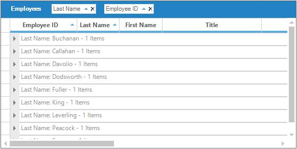

The following screen shot shows GroupDropArea positioned at the left of GridGroupingControl.

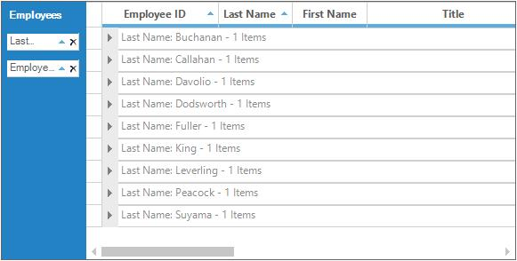

The following screen shot shows GroupDropArea positioned at the bottom of GridGroupingControl.

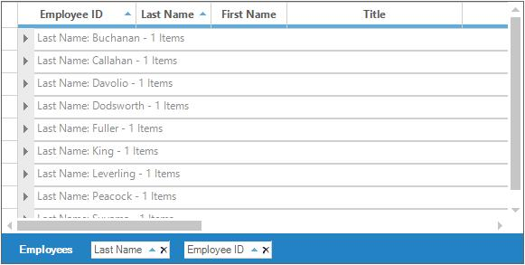

The following screen shot shows GroupDropArea positioned at the right of GridGroupingControl.

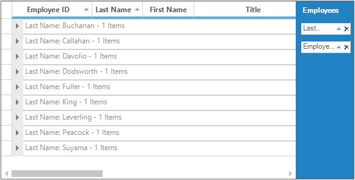

### Hierarchical GroupDropArea
To display the data groups in hierarchical mode, [HierarchicalGroupDropArea](https://help.syncfusion.com/cr/windowsforms/Syncfusion.Windows.Forms.Grid.Grouping.GridGroupingControl.html#Syncfusion_Windows_Forms_Grid_Grouping_GridGroupingControl_HierarchicalGroupDropArea) property needs to be set to true.



//To enable the HierarchicalGroupDropArea.
this.gridGroupingControl1.HierarchicalGroupDropArea = true;


'To enable the HierarchicalGroupDropArea.
Me.gridGroupingControl1.HierarchicalGroupDropArea = True



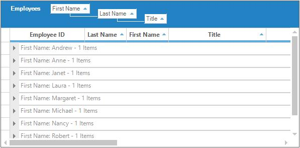

Few features supported with `HierarchicalGroupDropArea` are [Dynamic Resizing](https://help.syncfusion.com/cr/windowsforms/Syncfusion.Windows.Forms.Grid.Grouping.GridGroupDropArea.html#Syncfusion_Windows_Forms_Grid_Grouping_GridGroupDropArea_DynamicResizing), [Tree Line Placement](https://help.syncfusion.com/cr/windowsforms/Syncfusion.Windows.Forms.Grid.Grouping.GridGroupDropArea.html#Syncfusion_Windows_Forms_Grid_Grouping_GridGroupDropArea_TreeLinePlacement) and [Dynamic removal](https://help.syncfusion.com/cr/windowsforms/Syncfusion.Windows.Forms.Grid.Grouping.GridGroupDropArea.html#Syncfusion_Windows_Forms_Grid_Grouping_GridGroupDropArea_AllowRemove) of the column from being grouped.




//Supports dynamic removal of the column from being grouped (adds support in default GroupDropArea too).
this.gridGroupingControl1. GridGroupDropArea.AllowRemove = true;

//Supports switching tree line placement to the top and bottom between hierarchy levels.
this.gridGroupingControl1.GridGroupDropArea.TreeLinePlacement = TreeLinePlacement.Bottom;

//Supports resizing GroupDropArea dynamically up to the last level of the hierarchy.
this.gridGroupingControl1.GridGroupDropArea.DynamicResizing = true;

//Supports setting tree lines to a desired color.
this.gridGroupingControl1.GridGroupDropArea.TreeLineColor = Color.Red;



'Supports dynamic removal of the column from being grouped (adds support in default GroupDropArea too).
Me.gridGroupingControl1.GridGroupDropArea.AllowRemove = True

'Supports switching tree line placement to the top and bottom between hierarchy levels.
Me.gridGroupingControl1.GridGroupDropArea.TreeLinePlacement = TreeLinePlacement.Bottom

'Supports resizing GroupDropArea dynamically up to the last level of the hierarchy.
Me.gridGroupingControl1.GridGroupDropArea.DynamicResizing = True

'Supports setting tree lines to a desired color.
Me.gridGroupingControl1.GridGroupDropArea.TreeLineColor = Color.Red



**Sample Location**
&lt;installed Location\Syncfusion\EssentialStudio\&lt;Version_Number&gt;\Windows\Grid.Grouping.Windows\Samples\Grouping\Grouping Demo

## Multi-Column Grouping
Using Multi-Column Grouping, GridGroupingControl will organize the data in a hierarchical structure showing groups in different level. The range of columns has to be added in the `GroupedColumn` collection. 



//Adding Multiple columns to the GroupedColumns collection in the TableDescriptor
this.gridGroupingControl1.TableDescriptor.GroupedColumns.AddRange(new Syncfusion.Grouping.SortColumnDescriptor[] {
new Syncfusion.Grouping.SortColumnDescriptor("Title", System.ComponentModel.ListSortDirection.Ascending),
new Syncfusion.Grouping.SortColumnDescriptor("Country", System.ComponentModel.ListSortDirection.Ascending)});


'Adding Multiple columns to the GroupedColumns collection in the TableDescriptor
Me.gridGroupingControl1.TableDescriptor.GroupedColumns.AddRange(New Syncfusion.Grouping.SortColumnDescriptor() { New Syncfusion.Grouping.SortColumnDescriptor("Title", System.ComponentModel.ListSortDirection.Ascending), New Syncfusion.Grouping.SortColumnDescriptor("Country", System.ComponentModel.ListSortDirection.Ascending)})



## Custom Grouping
Custom Grouping can be done in GridGroupingControl by using an own custom categorizer object to compare the records and then group them according to the condition given by the user. Create a custom comparer and categorizer using the [IComparer](https://learn.microsoft.com/en-us/dotnet/api/system.collections.icomparer?view=net-5.0) and [IGroupByColumnCategorizer](https://help.syncfusion.com/cr/windowsforms/Syncfusion.Grouping.IGroupByColumnCategorizer.html) interfaces and then assign them to the `SortColumnDescriptor`.

When a column is grouped, it is sorted first hence the comparer will compare the objects and allow the control to sort for one of the columns. After values been sorted, the custom categorizer will determine the adjacent records in the sorted column to the same group. 

The below code explains the implementation of `IGroupByColumnCategorizer` interface.



//defines custom categorizer

 public class CustomCategorizer : Syncfusion.Grouping.IGroupByColumnCategorizer
 {

     //defines a group and returns a group category object (here returns 1 through 5)

     public static int GetCategory(int i)
     {
         int value = 0;

         if (i < 10)
             value = 1;

         else if (i >= 10 && i < 20)
             value = 2;

         else if (i >= 20 && i < 30)
             value = 3;

         else if (i >= 30 && i < 40)
             value = 4;

         else
             value = 5;
         return value;
     }

     public object GetGroupByCategoryKey(SortColumnDescriptor column, bool isForeignKey, Record record)
     {
         return GetCategory(int.Parse(record.GetValue(column).ToString()));
     }

     public int CompareCategoryKey(SortColumnDescriptor column, bool isForeignKey, object category, Record record)
     {
         return GetCategory(int.Parse(record.GetValue(column).ToString())) - (int)category;
     }
 }



'defines custom categorizer
 
 Public Class CustomCategorizer
     Implements Syncfusion.Grouping.IGroupByColumnCategorizer
 
     'defines a group and returns a group category object (here returns 1 through 5)
 
     Public Shared Function GetCategory(ByVal i As Integer) As Integer
         Dim value As Integer = 0
 
         If i < 10 Then
             value = 1
 
         ElseIf i >= 10 AndAlso i < 20 Then
             value = 2
 
         ElseIf i >= 20 AndAlso i < 30 Then
             value = 3
 
         ElseIf i >= 30 AndAlso i < 40 Then
             value = 4
 
         Else
             value = 5
         End If
         Return value
     End Function
 
     Public Function GetGroupByCategoryKey(ByVal column As SortColumnDescriptor, ByVal isForeignKey As Boolean, ByVal record As Record) As Object
         Return GetCategory(Integer.Parse(record.GetValue(column).ToString()))
     End Function
 
     Public Function CompareCategoryKey(ByVal column As SortColumnDescriptor, ByVal isForeignKey As Boolean, ByVal category As Object, ByVal record As Record) As Integer
         Return GetCategory(Integer.Parse(record.GetValue(column).ToString())) - CInt(Fix(category))
     End Function
 End Class



The below code explains the implementation of `IComparer` interface.



//make sure the string integers are sorted as integers instead of strings
public class CustomComparer : IComparer
{

    public int Compare(object x, object y)
    {

        if (x == null)
            return -1;

        else if (y == null)
            return 100;

        else
        {
            int i = int.Parse(x.ToString());
            int j = int.Parse(y.ToString());
            return i - j;
        }
    }
}


'make sure the string integers are sorted as integers instead of strings

Public Class CustomComparer
    Implements IComparer

    Public Function Compare(ByVal x As Object, ByVal y As Object) As Integer

        If x Is Nothing Then
            Return -1

        ElseIf y Is Nothing Then
            Return 100

        Else
            Dim i As Integer = Integer.Parse(x.ToString())
            Dim j As Integer = Integer.Parse(y.ToString())
            Return i - j
        End If
    End Function
End Class




After implementing both `IComparer` and `IGroupByColumnCategorizer` interfaces, it has to be assigned to the `SortColumnDescriptor`. It gets affected in the desired column. 



//group "Col2" using a custom categorizer and Comparer
Syncfusion.Grouping.SortColumnDescriptor columnDescriptor = new Syncfusion.Grouping.SortColumnDescriptor("Col2");
columnDescriptor.Categorizer = new CustomCategorizer();
columnDescriptor.Comparer = new CustomComparer();
this.gridGroupingControl1.TableDescriptor.GroupedColumns.Add(columnDescriptor);


'group "Col2" using a custom categorizer and Comparer
Dim columnDescriptor As New Syncfusion.Grouping.SortColumnDescriptor("Col2")
columnDescriptor.Categorizer = New CustomCategorizer()
columnDescriptor.Comparer = New CustomComparer()
Me.gridGroupingControl1.TableDescriptor.GroupedColumns.Add(columnDescriptor)



### Customizing CaptionText
Then, for changing the caption text and group header text, make use of the[QueryCellStyleInfo](https://help.syncfusion.com/cr/windowsforms/Syncfusion.Windows.Forms.Grid.Grouping.GridGroupingControl.html) event.



this.gridGroupingControl1.QueryCellStyleInfo += new Syncfusion.Windows.Forms.Grid.Grouping.GridTableCellStyleInfoEventHandler(gridGroupingControl1_QueryCellStyleInfo);

private void gridGroupingControl1_QueryCellStyleInfo(object sender, Syncfusion.Windows.Forms.Grid.Grouping.GridTableCellStyleInfoEvent
{

    if (e.TableCellIdentity.GroupedColumn != null && e.TableCellIdentity.DisplayElement.ParentGroup != null
        && e.TableCellIdentity.DisplayElement.ParentGroup.Category is int)
    {

        if (e.TableCellIdentity.DisplayElement is CaptionRow
            && e.TableCellIdentity.GroupedColumn.Name == "Col2")
        {
            int cat = (int)e.TableCellIdentity.DisplayElement.ParentGroup.Category;
            string value = "";

            switch (cat)
            {
                case 1:
                    value = " < 10";
                    break;

                case 2:
                    value = "10 - 19";
                    break;

                case 3:
                    value = "20 - 29";
                    break;

                case 4:
                    value = "30 - 39";
                    break;

                case 5:
                    value = " >= 40";
                    break;
            }
            e.Style.CellValue = String.Format("{0}: {1} Items.", value, e.TableCellIdentity.DisplayElement.ParentGroup.GetChildCount());
        }
    }
}


AddHandler gridGroupingControl1.QueryCellStyleInfo, AddressOf gridGroupingControl1_QueryCellStyleInfo

Private Sub gridGroupingControl1_QueryCellStyleInfo(ByVal sender As Object, ByVal e As Syncfusion.Windows.Forms.Grid.Grouping.GridTableCellStyleInfoEventArgs)

    If e.TableCellIdentity.GroupedColumn IsNot Nothing AndAlso e.TableCellIdentity.DisplayElement.ParentGroup IsNot Nothing AndAlso TypeOf e.TableCellIdentity.DisplayElement.ParentGroup.Category Is Integer Then

        If TypeOf e.TableCellIdentity.DisplayElement Is CaptionRow AndAlso e.TableCellIdentity.GroupedColumn.Name = "Col2" Then
            Dim cat As Integer = CInt(Fix(e.TableCellIdentity.DisplayElement.ParentGroup.Category))
            Dim value As String = ""

            Select Case cat
                Case 1
                    value = " < 10"

                Case 2
                    value = "10 - 19"

                Case 3
                    value = "20 - 29"

                Case 4
                    value = "30 - 39"

                Case 5
                    value = " >= 40"
            End Select
            e.Style.CellValue = String.Format("{0}: {1} Items.", value, e.TableCellIdentity.DisplayElement.ParentGroup.GetChildCount())
        End If
    End If
End Sub



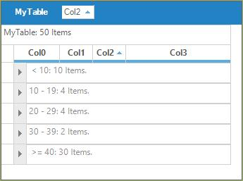

## GroupBy-Options
GridGroupingControl provides a number of options that allows you to control the look and behavior of the groups. AddNewRow, Captions, Headers, Footers and Group Preview rows can be managed. This section will list out the options that allows you to change the behavior of the groups.

**`GridGroupOptionsStyleInfo`** is a class which defines all the properties to control the look and feel of the groups. This class is derived from the [StyleInfoBase](https://help.syncfusion.com/cr/windowsforms/Syncfusion.Styles.StyleInfoBase.html) class.

GridGroupingControl distinguishes between three different kinds of Group options namely `TopLevelGroupOptions`, **`ChildGroupOptions`** and [NestedTableGroupOptions](https://help.syncfusion.com/cr/windowsforms/Syncfusion.Windows.Forms.Grid.Grouping.GridEngine.html#Syncfusion_Windows_Forms_Grid_Grouping_GridEngine_NestedTableGroupOptions). All three will let you control the look and behavior of the top level group, child groups and groups in nested child relations respectively. 

### Group Headers/Footers
The headers and footers of a group can be used to display any information that is common to all elements of that group. You can toggle the display of these headers and footers by using the [ShowGroupHeader](https://help.syncfusion.com/cr/windowsforms/Syncfusion.Windows.Forms.Grid.Grouping.GridGroupOptionsStyleInfo.html#Syncfusion_Windows_Forms_Grid_Grouping_GridGroupOptionsStyleInfo_ShowGroupHeader) and [ShowGroupFooter](https://help.syncfusion.com/cr/windowsforms/Syncfusion.Windows.Forms.Grid.Grouping.GridGroupOptionsStyleInfo.html#Syncfusion_Windows_Forms_Grid_Grouping_GridGroupOptionsStyleInfo_ShowGroupFooter) property.



// Will enable the Group Header for the top most group.
this.gridGroupingControl1.TopLevelGroupOptions.ShowGroupHeader = true;

// Will enable the Group Footer for the top most group.
this.gridGroupingControl1.TopLevelGroupOptions.ShowGroupFooter = true;


'Will enable the Group Header for the top most group.
Me.gridGroupingControl1.TopLevelGroupOptions.ShowGroupHeader = True

'Will enable the Group Footer for the top most group.
Me.gridGroupingControl1.TopLevelGroupOptions.ShowGroupFooter = True


Also the height of the header and footer of the groups can be changed by using the **HeaderSectionHeight** and **FooterSectionHeight** properties.


this.gridGroupingControl1.TableOptions.GroupHeaderSectionHeight = 20;
this.gridGroupingControl1.TableOptions.GroupFooterSectionHeight = 20;


Me.gridGroupingControl1.TableOptions.GroupHeaderSectionHeight = 20
Me.gridGroupingControl1.TableOptions.GroupFooterSectionHeight = 20



Group headers and footers can be populated by handling `QueryCellStyleInfo` event wherein you can check Header and Footer cell types and provide the data. For changing the header and footer text using the `QueryCellStyleInfo`, make use of the KB [link](https://support.syncfusion.com/kb/article/5368/how-to-change-the-winforms-gridgroupingcontrol-text-in-groupheader-and-groupfooter) over here for reference. 

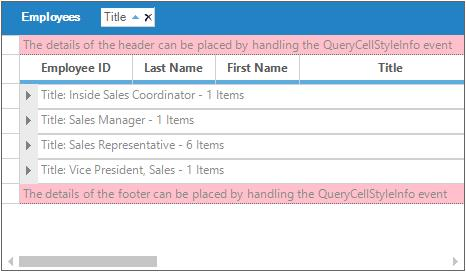

### GroupPreviewRows
[GroupPreviewSection](https://help.syncfusion.com/cr/windowsforms/Syncfusion.Grouping.GroupPreviewSection.html) is an appropriate place for displaying the memo fields or add custom notes for a given group. It can be enabled by using the **`ShowGroupPreview`** property. The size of the preview row can also be adjusted by using the [GroupPreviewSectionHeight](https://help.syncfusion.com/cr/windowsforms/Syncfusion.Windows.Forms.Grid.Grouping.GridTableOptionsStyleInfo.html#Syncfusion_Windows_Forms_Grid_Grouping_GridTableOptionsStyleInfo_GroupPreviewSectionHeight) property. For populating the preview rows `QueryCellStyleInfo` event can be used.



// Enable Group Preview section.
this.gridGroupingControl1.TopLevelGroupOptions.ShowGroupPreview = true;

// Sets the height for the Group Preview section.
this.gridGroupingControl1.TableOptions.GroupPreviewSectionHeight = 50;


'Enable Group Preview section.
Me.gridGroupingControl1.TopLevelGroupOptions.ShowGroupPreview = True

'Sets the height for the Group Preview section.
Me.gridGroupingControl1.TableOptions.GroupPreviewSectionHeight = 50


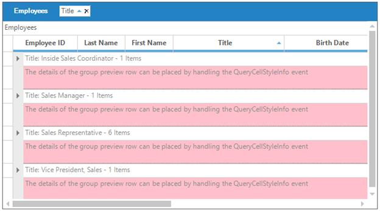

### AddNew Records in Groups
Each group can optionally have an AddNew row where you can provide the values for a new record. Once a new record is entered, the record will be sorted into the existing record set and will be assigned a group's category automatically. The visibility of the [AddNewRecord](https://help.syncfusion.com/cr/windowsforms/Syncfusion.Windows.Forms.Grid.Grouping.GridAddNewRecord.html) can be controlled by using the [AllowNew](https://help.syncfusion.com/cr/windowsforms/Syncfusion.Grouping.TableDescriptor.html#Syncfusion_Grouping_TableDescriptor_AllowNew) property.

The [ChildGroupOptions](https://help.syncfusion.com/cr/windowsforms/Syncfusion.Windows.Forms.Grid.Grouping.GridTableDescriptor.html#Syncfusion_Windows_Forms_Grid_Grouping_GridTableDescriptor_ChildGroupOptions) property provides the grouping options for all groups. `AddNewRecord` can be viewed at the top of a group by setting the [ShowAddNewRecordBeforeDetails](https://help.syncfusion.com/cr/windowsforms/Syncfusion.Windows.Forms.Grid.Grouping.GridGroupOptionsStyleInfoStore.html#Syncfusion_Windows_Forms_Grid_Grouping_GridGroupOptionsStyleInfoStore_ShowAddNewRecordBeforeDetailsProperty) to true. It can also be viewed at the bottom of a group by using the [ShowAddNewRecordAfterDetails](https://help.syncfusion.com/cr/windowsforms/Syncfusion.Windows.Forms.Grid.Grouping.GridGroupOptionsStyleInfo.html#Syncfusion_Windows_Forms_Grid_Grouping_GridGroupOptionsStyleInfo_ShowAddNewRecordAfterDetails). 



// Enables the GridGroupingControl to allow new records
this.gridGroupingControl1.TableDescriptor.AllowNew = true;

// Enables the AddNewRecord at top of the group
this.gridGroupingControl1.ChildGroupOptions.ShowAddNewRecordAfterDetails = true;

// Enables the AddNewRecord at bottom of the group
this.gridGroupingControl1.ChildGroupOptions.ShowAddNewRecordBeforeDetails = true;


' Enables the GridGroupingControl to allow new records
Me.gridGroupingControl1.TableDescriptor.AllowNew = True

' Enables the AddNewRecord at top of the group
Me.gridGroupingControl1.ChildGroupOptions.ShowAddNewRecordAfterDetails = True

' Enables the AddNewRecord at bottom of the group
Me.gridGroupingControl1.ChildGroupOptions.ShowAddNewRecordBeforeDetails = True



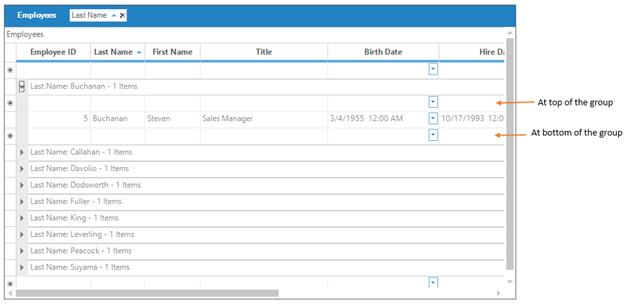

## GroupCaptionSection
This is the first section within a group that provides a caption bar above column headers. GroupCaptionRows are unbound rows that are created only to combine records into a group. By default, they display group category and the number of items in that group. The following properties can be used to control CaptionSection display.

* **&lt;GroupOptions&gt;.ShowCaption**- enables the display of caption section; True by default. 
* **&lt;GroupOptions&gt;.CaptionText**- used to get and set caption text.

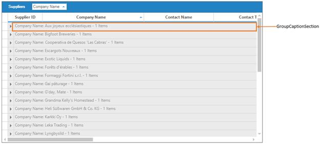

### CaptionText Tokens
The caption text which is displayed in the GroupCaptionSection can be customized. This can be done by using `CaptionText` property of `GroupOptions`. The followings are the tokens format for caption text customization.

* **TableName** - Displays the CaptionSection.ParentTableDescriptor.Name
* **CategoryName** - Displays the CaptionSection.ParentGroup.Name.
* **CategoryCaption** - Displays the Header Text of the column that this group belongs to.
* **Category** - Displays the CaptionSection.ParentGroup.Category.
* **RecordCount** - Displays the CaptionSection.ParentGroup.GetFilteredRecordCount().
* **Summary Tokens** - Allows you to display any item you enter as a Summary Column. See discussion below.

### Custom Summary Tokens
Any summary item can be included in the `CaptionText` of the GroupCaptionSection. It is possible to add summaries only for the purpose of displaying values in the CaptionText.

The following example shows the `GroupCaptionSection` is customized with different look and feel,

1.Setup the necessary Group Options as required.



//Group Options Setting.
this.gridGroupingControl1.ShowGroupDropArea = true;
this.gridGroupingControl1.TopLevelGroupOptions.ShowGroupHeader = true;
this.gridGroupingControl1.TopLevelGroupOptions.ShowGroupFooter = true;
this.gridGroupingControl1.TopLevelGroupOptions.ShowCaption = true;
this.gridGroupingControl1.TopLevelGroupOptions.ShowGroupPreview = true;
this.gridGroupingControl1.ChildGroupOptions.ShowGroupPreview = true;
this.gridGroupingControl1.TableOptions.GroupFooterSectionHeight = 30;
this.gridGroupingControl1.TableOptions.GroupHeaderSectionHeight = 30;
this.gridGroupingControl1.TableOptions.GroupPreviewSectionHeight = 25;
this.gridGroupingControl1.TopLevelGroupOptions.ShowAddNewRecordBeforeDetails = true;
this.gridGroupingControl1.TopLevelGroupOptions.ShowAddNewRecordAfterDetails = true;
this.gridGroupingControl1.ChildGroupOptions.CaptionText = "There are {RecordCount} items under {CategoryName} : {Category}";


'Group Options Setting.
Me.gridGroupingControl1.ShowGroupDropArea = True
Me.gridGroupingControl1.TopLevelGroupOptions.ShowGroupHeader = True
Me.gridGroupingControl1.TopLevelGroupOptions.ShowGroupFooter = True
Me.gridGroupingControl1.TopLevelGroupOptions.ShowCaption = True
Me.gridGroupingControl1.TopLevelGroupOptions.ShowGroupPreview = True
Me.gridGroupingControl1.ChildGroupOptions.ShowGroupPreview = True
Me.gridGroupingControl1.TableOptions.GroupFooterSectionHeight = 30
Me.gridGroupingControl1.TableOptions.GroupHeaderSectionHeight = 30
Me.gridGroupingControl1.TableOptions.GroupPreviewSectionHeight = 25
Me.gridGroupingControl1.TopLevelGroupOptions.ShowAddNewRecordBeforeDetails = True
Me.gridGroupingControl1.TopLevelGroupOptions.ShowAddNewRecordAfterDetails = True
Me.gridGroupingControl1.ChildGroupOptions.CaptionText = "There are {RecordCount} items under {CategoryName} : {Category}"



2.Handle the `QueryCellStyleInfo` event to manipulate the group elements.


this.gridGroupingControl1.QueryCellStyleInfo += new GridTableCellStyleInfoEventHandler(gridGroupingControl1_QueryCellStyleInfo);

void gridGroupingControl1_QueryCellStyleInfo(object sender, GridTableCellStyleInfoEventArgs e)
{

    if (e.TableCellIdentity.TableCellType == GridTableCellType.GroupFooterSectionCell || e.TableCellIdentity.TableCellType == GridTableCellType.GroupHeaderSectionCell)
    {
        e.Style.Enabled = false;

        if (e.TableCellIdentity.TableCellType == GridTableCellType.GroupFooterSectionCell)
        e.Style.Text = "The details in the footer can be placed by enabling ShowGroupFooter and handling QueryCellStyleInfo";

        if (e.TableCellIdentity.TableCellType == GridTableCellType.GroupHeaderSectionCell)
        e.Style.Text = "The details in the header can be placed by enabling ShowGroupHeader and handling QueryCellStyleInfo";
    }

    if (e.TableCellIdentity.TableCellType == GridTableCellType.GroupPreviewCell)
    {
        Element el = e.TableCellIdentity.DisplayElement;
        e.Style.CellValue = "Preview notes for Group (" + el.ParentGroup.Name + ": " + el.ParentGroup.Category.ToString() + ")";
    }
}


Private Sub gridGroupingControl1_QueryCellStyleInfo(ByVal sender As Object, ByVal e As GridTableCellStyleInfoEventArgs) Handles gridGroupingControl1.QueryCellStyleInfo

If e.TableCellIdentity.TableCellType = GridTableCellType.GroupFooterSectionCell OrElse e.TableCellIdentity.TableCellType = GridTableCellType.GroupHeaderSectionCell Then
e.Style.Enabled = False

If e.TableCellIdentity.TableCellType = GridTableCellType.GroupFooterSectionCell Then
e.Style.Text = "The details in the footer can be placed by enabling ShowGroupFooter and handling QueryCellStyleInfo"
End If

If e.TableCellIdentity.TableCellType = GridTableCellType.GroupHeaderSectionCell Then
e.Style.Text = "The details in the header can be placed by enabling ShowGroupHeader and handling QueryCellStyleInfo"
End If
End If

If e.TableCellIdentity.TableCellType = GridTableCellType.GroupPreviewCell Then
Dim el As Element = e.TableCellIdentity.DisplayElement
e.Style.CellValue = "Preview notes for Group (" & el.ParentGroup.Name & ": " & el.ParentGroup.Category.ToString() & ")"
End If
End Sub



3.Appearance of the of different group elements can be customized by using Appearance property.


this.gridGroupingControl1.Appearance.AddNewRecordFieldCell.Interior = new BrushInfo(Color.FromArgb(255, 255, 192));
this.gridGroupingControl1.Appearance.GroupCaptionCell.Interior = new BrushInfo(SystemColors.Control);
this.gridGroupingControl1.Appearance.GroupCaptionCell.TextColor = Color.FromArgb(192, 64, 0);
this.gridGroupingControl1.Appearance.GroupFooterSectionCell.Interior = new BrushInfo(Color.Pink);
this.gridGroupingControl1.Appearance.GroupHeaderSectionCell.Interior = new BrushInfo(Color.Pink);
this.gridGroupingControl1.Appearance.GroupIndentCell.Interior = new BrushInfo(Color.FromArgb(192, 192, 255));
this.gridGroupingControl1.Appearance.GroupPreviewCell.Interior = new BrushInfo(Color.FromArgb(192, 255, 192));


Me.gridGroupingControl1.Appearance.AddNewRecordFieldCell.Interior = New BrushInfo(Color.FromArgb(255, 255, 192))
Me.gridGroupingControl1.Appearance.GroupCaptionCell.Interior = New BrushInfo(SystemColors.Control)
Me.gridGroupingControl1.Appearance.GroupCaptionCell.TextColor = Color.FromArgb(192, 64, 0)
Me.gridGroupingControl1.Appearance.GroupFooterSectionCell.Interior = New BrushInfo(Color.Pink)
Me.gridGroupingControl1.Appearance.GroupHeaderSectionCell.Interior = New BrushInfo(Color.Pink)
Me.gridGroupingControl1.Appearance.GroupIndentCell.Interior = New BrushInfo(Color.FromArgb(192, 192, 255))
Me.gridGroupingControl1.Appearance.GroupPreviewCell.Interior = New BrushInfo(Color.FromArgb(192, 255, 192))



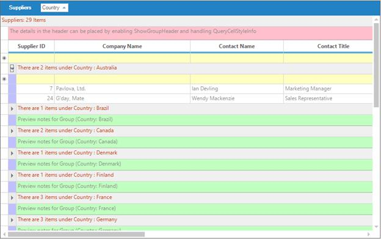

## Working with Groups
Grouping Grid architecture can be viewed as a binary where different grid elements like group rows, summary rows, filter rows, etc. form the nodes of the tree having data records at the bottom as leaf nodes. A group can be a final node with records or it can be a node with nested groups rooting a sub tree.

### Expanding or collapsing groups
All the groups can be expanded as well as collapsed at once by calling the respective methods, [Table.ExpandAllGroups](https://help.syncfusion.com/cr/windowsforms/Syncfusion.Grouping.Group.html#Syncfusion_Grouping_Group_ExpandAllGroups) and [Table.CollapseAllGroups](https://help.syncfusion.com/cr/windowsforms/Syncfusion.Grouping.Group.html#Syncfusion_Grouping_Group_CollapseAllGroups). To expand or collapse a specific group, set [Group.IsExpanded](https://help.syncfusion.com/cr/windowsforms/Syncfusion.Grouping.Group.html#Syncfusion_Grouping_Group_IsExpanded) property to true or false respectively.

The [TopLevelGroup](https://help.syncfusion.com/cr/windowsforms/Syncfusion.Windows.Forms.Grid.Grouping.GridTable.html) property provides the options to access all the groups from the GridGroupingControl.



//Expands all groups.
this.gridGroupingControl1.Table.ExpandAllGroups();

//Collapses all groups.
this.gridGroupingControl1.Table.CollapseAllGroups();

//Expands the group with index 3.
this.gridGroupingControl1.Table.TopLevelGroup.Groups[3].IsExpanded = true;

//Collapses the group with index 4.
this.gridGroupingControl1.Table.TopLevelGroup.Groups[4].IsExpanded = false;


'Expands all groups.
Me.gridGroupingControl1.Table.ExpandAllGroups()

'Collapses all groups.
Me.gridGroupingControl1.Table.CollapseAllGroups()

'Expands the group with index 3.
Me.gridGroupingControl1.Table.TopLevelGroup.Groups(3).IsExpanded = True

'Collapses the group with index 4.
Me.gridGroupingControl1.Table.TopLevelGroup.Groups(4).IsExpanded = False



### Accessing all groups
The [Groups](https://help.syncfusion.com/cr/windowsforms/Syncfusion.Grouping.GroupsInDetailsCollection.html) collection maintains details of individual groups in this collection that can be used to retrieve the details of any group. It forms the root node of the group hierarchy where its categorized records and nested groups form the child nodes. 

To access all the groups, you can make use of the same `IterateThrough` method by passing `TopLevelGroup` as the method parameter. Then this method will loop through categorized records and nested groups of the top level group and will print details of all the groups.



//Calls IterateThrough method for a given group.
Group g = this.gridGroupingControl1.Table.TopLevelGroup.Groups["Sport"];
IterateGroup(g);

//Calls IterateThrough method for all the groups in a grid table.
IterateGroup(this.gridGroupingControl1.Table.TopLevelGroup);

//IterateThrough method iterates through records and nested groups.

public void IterateThrough(Group g)
{
    System.Diagnostics.Trace.WriteLine("GroupLevel = "+g.GroupLevel);
    System.Diagnostics.Trace.WriteLine(g.Info);

    foreach(Record r in g.Records)
    {
        System.Diagnostics.Trace.WriteLine(r.Info);
    }

    foreach(Group gr in g.Groups)
    {
        IterateGroup(gr);
    }
}


'Calls IterateThrough method for a given group.
Dim g As Group
g = Me.gridGroupingControl1.Table.TopLevelGroup.Groups("Sport")
IterateThrough(g)

'Calls IterateThrough method for all the groups in a grid table.
IterateThrough(Me.gridGroupingControl1.Table.TopLevelGroup)

'IterateThrough method iterates through the records and nested groups.

Public Sub IterateThrough(ByVal g As Group)
System.Diagnostics.Trace.WriteLine("GroupLevel = "+ g.GroupLevel.ToString())
System.Diagnostics.Trace.WriteLine(g.Info)

For Each r As Record In g.Records
System.Diagnostics.Trace.WriteLine(r.Info)
Next r

For Each gr As Group In g.Groups
IterateThrough(gr)
Next gr
End Sub



### Accessing the group for a given record
It is the [Table](https://help.syncfusion.com/cr/windowsforms/Syncfusion.Windows.Forms.Grid.Grouping.GridTable.html) object that provides access to the records and the grouped elements. The [Table.Records](https://help.syncfusion.com/cr/windowsforms/Syncfusion.Windows.Forms.Grid.Grouping.GridTable.html) collection returns a read only collection of the data records. 

The following code can be used to get access to the group for a particular record. [Record.ParentGroup](https://help.syncfusion.com/cr/windowsforms/Syncfusion.Grouping.Element.html#Syncfusion_Grouping_Element_ParentGroup) property is used to obtain the group that a record belongs to.



System.Diagnostics.Trace.WriteLine(this.gridGroupingControl1.Table.Records[3].ParentGroup.Info);


System.Diagnostics.Trace.WriteLine(Me.gridGroupingControl1.Table.Records(3).ParentGroup.Info)



## Grouped Columns Sorting
When grouping is applied, the grid will sort the records based on the values of grouped column by default. The sort icon will be also displayed in the grouped column of `GridGroupDropArea`. 

The sorting behavior of the columns when columns are grouped in `GridGroupDropArea` can be changed programmatically by adding the column in the `GroupedColumns` collection with [ListSortDirection](https://learn.microsoft.com/en-us/dotnet/api/system.componentmodel.listsortdirection?view=net-5.0).



//Add the `Title` column for grouping with Descending sorting behavior
this.gridGroupingControl1.TableDescriptor.GroupedColumns.Add("Title", ListSortDirection.Descending);


'Add the `Title` column for grouping with Descending sorting behavior
Me.gridGroupingControl1.TableDescriptor.GroupedColumns.Add("Title", ListSortDirection.Descending)



## Grouping Events
The following events are used to customize the grouping in GridGroupingControl. 

* [GroupedColumns.Changing](https://help.syncfusion.com/cr/windowsforms/Syncfusion.Grouping.SortColumnDescriptorCollection.html#Syncfusion_Grouping_SortColumnDescriptorCollection_Changing) - Occurs before a property in the collection is changed.
* [GroupedColumns.Changed](https://help.syncfusion.com/cr/windowsforms/Syncfusion.Grouping.SortColumnDescriptorCollection.html#Syncfusion_Grouping_SortColumnDescriptorCollection_Changed) - Occurs after a property in the collection is changed.
* [GroupExpanding](https://help.syncfusion.com/cr/windowsforms/Syncfusion.Windows.Forms.Grid.Grouping.GridGroupingControl.html#Syncfusion_Windows_Forms_Grid_Grouping_GridGroupingControl_GroupExpanding) - Occurs before a group is expanded.
* [GroupExpanded](https://help.syncfusion.com/cr/windowsforms/Syncfusion.Windows.Forms.Grid.Grouping.GridGroupingControl.html#Syncfusion_Windows_Forms_Grid_Grouping_GridGroupingControl_GroupExpanded) - Occurs after a group is expanded.
* [GroupCollapsing](https://help.syncfusion.com/cr/windowsforms/Syncfusion.Windows.Forms.Grid.Grouping.GridGroupingControl.html#Syncfusion_Windows_Forms_Grid_Grouping_GridGroupingControl_GroupCollapsing) - Occurs before a group is collapsed.
* [GroupCollapsed](https://help.syncfusion.com/cr/windowsforms/Syncfusion.Windows.Forms.Grid.Grouping.GridGroupingControl.html#Syncfusion_Windows_Forms_Grid_Grouping_GridGroupingControl_GroupCollapsed) - Occurs after a group is collapsed.

N> The detailed information about the `Events` of the GridGroupingControl has been discussed in [Events](https://help.syncfusion.com/windowsforms/gridgrouping/events) section.



//Subscribes to the events.
this.gridGroupingControl1.TableDescriptor.GroupedColumns.Changing += new ListPropertyChangedEventHandler(GroupedColumns_Changing);
this.gridGroupingControl1.TableDescriptor.GroupedColumns.Changed += new ListPropertyChangedEventHandler(GroupedColumns_Changed);

//Event Handlers.

//GroupedColumns_Changing event.

void GroupedColumns_Changing(object sender, ListPropertyChangedEventArgs e)
{
SortColumnDescriptor sortColumnDescriptor = e.Item as SortColumnDescriptor;

if (e.Action == Syncfusion.Collections.ListPropertyChangedType.Insert)
Console.WriteLine("Column Added - {0}", sortColumnDescriptor.Name);
}

//GroupedColumns_Changed event.

void GroupedColumns_Changed(object sender, ListPropertyChangedEventArgs e)
{
SortColumnDescriptor sortColumnDescriptor = e.Item as SortColumnDescriptor;

if (e.Action == Syncfusion.Collections.ListPropertyChangedType.Remove)
Console.WriteLine("Column Removed - {0}", sortColumnDescriptor.Name);
}


'Subscribes to the events.
AddHandler gridGroupingControl1.TableDescriptor.GroupedColumns.Changing, AddressOf GroupedColumns_Changing

'Event Handlers.

'GroupedColumns_Changing event.

Private Sub GroupedColumns_Changed(ByVal sender As Object, ByVal e As ListPropertyChangedEventArgs)
Dim sortColumnDescriptor As SortColumnDescriptor = CType(e.Item, SortColumnDescriptor)

If e.Action = ListPropertyChangedType.Insert Then
Console.WriteLine("Column Added - {0}" + sortColumnDescriptor.Name)
End If
End Sub

'GroupedColumns_Changed event.

Private Sub GroupedColumns_Changing(ByVal sender As Object, ByVal e As ListPropertyChangedEventArgs)
Dim sortColumnDescriptor As SortColumnDescriptor = CType(e.Item, SortColumnDescriptor)

If e.Action = ListPropertyChangedType.Remove Then
Console.WriteLine("Column Removed - {0}" + sortColumnDescriptor.Name)
End If
End Sub


