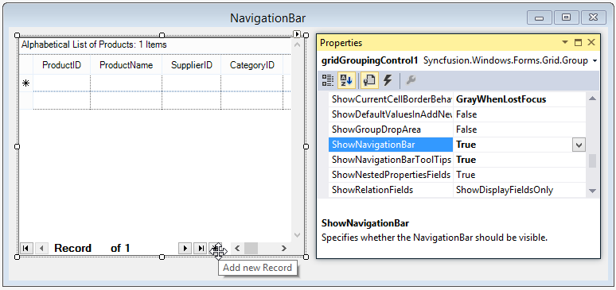
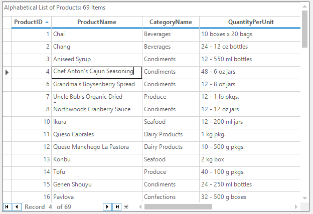
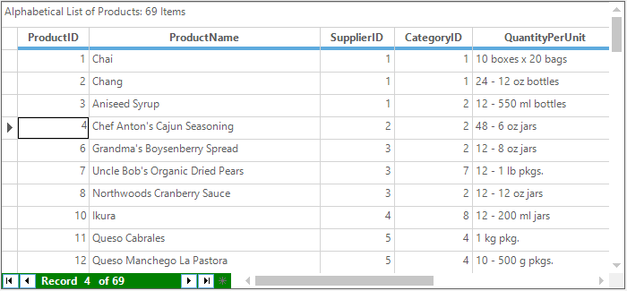
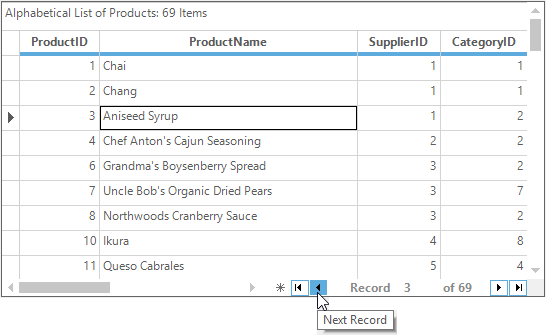
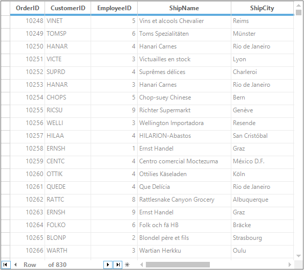
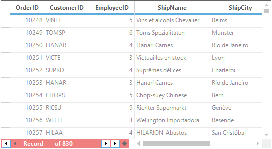
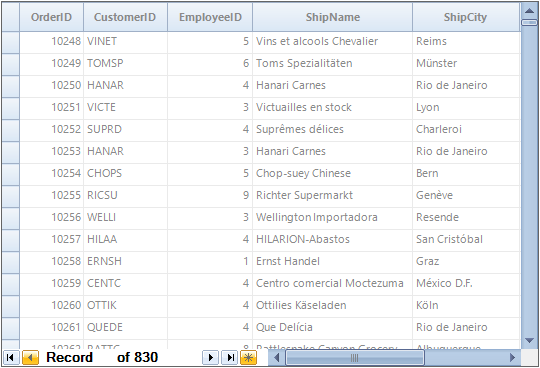
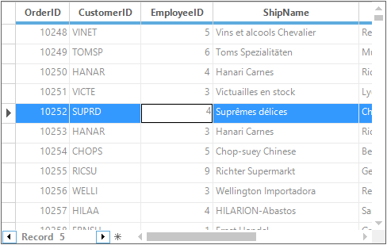

# Navigation Bar
GridGroupingControl comes with an in-built navigation control that allows the user to browse through the records with ease. The navigation bar consists of buttons that facilitate navigation to first, next, previous, last records and also to add new records in the grid. It also contains a label that displays the current record number together with the total record count.

### Adding Navigation Bar Through Code
Navigation Bar can added through code by setting the [ShowNavigationBar](http://help.syncfusion.com/cr/cref_files/windowsforms/Syncfusion.Grid.Grouping.Windows~Syncfusion.Windows.Forms.Grid.Grouping.GridGroupingControl~ShowNavigationBar.html) property to `true`. Tooltips can be enabled for the navigation bar by setting the property, [ShowNavigationBarToolTips](http://help.syncfusion.com/cr/cref_files/windowsforms/Syncfusion.Grid.Grouping.Windows~Syncfusion.Windows.Forms.Grid.Grouping.GridGroupingControl~ShowNavigationBarToolTips.html) to `true`. 



// Shows the record navigation bar.
this.gridGroupingControl1.ShowNavigationBar = true;

// Show tooltips when the user hovers the mouse over the elements of the RecordNavigationBar.
this.gridGroupingControl1.ShowNavigationBarToolTips = true;


' Shows the record navigation bar.
Me.gridGroupingControl1.ShowNavigationBar = True

' Show tooltips when the user hovers the mouse over the elements of the RecordNavigationBar.
Me.gridGroupingControl1.ShowNavigationBarToolTips = True



### Adding Navigation Bar Through Designer
In the property window, make use of the [ShowNavigationBar](http://help.syncfusion.com/cr/cref_files/windowsforms/Syncfusion.Grid.Grouping.Windows~Syncfusion.Windows.Forms.Grid.Grouping.GridGroupingControl~ShowNavigationBar.html) property to enable the Navigation Bar in design mode.

The Grid with the Navigation bar will be look like the following screenshot,

The user can set the current record of NavigationBar programmatically by using the [SetCurrentRecord](http://help.syncfusion.com/cr/cref_files/windowsforms/Syncfusion.Shared.Base~Syncfusion.Windows.Forms.RecordNavigationBar~SetCurrentRecord.html) method.



// Set the current record of the NavigationBar
this.gridGroupingControl1.RecordNavigationBar.SetCurrentRecord(5, true);


' Set the current record of the NavigationBar
Me.gridGroupingControl1.RecordNavigationBar.SetCurrentRecord(5, True)



## Customizing the Appearance 
It is possible to customize default appearance of the navigation bar by setting appropriate properties. 



// Changing the default Back and Fore color of the Navigation Bar
this.gridGroupingControl1.RecordNavigationBar.BackColor = Color.Green;
this.gridGroupingControl1.RecordNavigationBar.ForeColor = Color.White;


' Changing the default Back and Fore color of the Navigation Bar
Me.gridGroupingControl1.RecordNavigationBar.BackColor = Color.Green
Me.gridGroupingControl1.RecordNavigationBar.ForeColor = Color.White



The customized navigation bar is showed in the below screenshot,

### Arrow Buttons
The arrow buttons of the record navigation bar can be customized to display single button for navigating the records.



// To Display Single Button for Navigating the records
this.gridGroupingControl1.RecordNavigationBar.DisplayArrowButtons = DisplayArrowButtons.Single;


' To Display Single Button for Navigating the records
Me.gridGroupingControl1.RecordNavigationBar.DisplayArrowButtons = DisplayArrowButtons.Single



User can change the arrow type of the navigation bar while clicking the arrow buttons. It can be achieved by using the [ArrowButtonClicked](http://help.syncfusion.com/cr/cref_files/windowsforms/Syncfusion.Shared.Base~Syncfusion.Windows.Forms.RecordNavigationControl~ArrowButtonClicked_EV.html) event.



this.gridGroupingControl1.RecordNavigationBar.ArrowButtonClicked += RecordNavigationBar_ArrowButtonClicked;

void RecordNavigationBar_ArrowButtonClicked(object sender, ArrowButtonEventArgs e)
{

    // Set the arrow type of the navigation bar
    e.Arrow = ArrowType.AddNew;
}


Private Me.gridGroupingControl1.RecordNavigationBar.ArrowButtonClicked += AddressOf RecordNavigationBar_ArrowButtonClicked

Private Sub RecordNavigationBar_ArrowButtonClicked(ByVal sender As Object, ByVal e As ArrowButtonEventArgs)

    ' Set the arrow type of the navigation bar
    e.Arrow = ArrowType.AddNew
End Sub



### RTL Mode
It also supports RTL mode for navigating the records.  It can be enabled by using the following code snippet,



// Enable RTL mode for Record Navigation Bar
this.gridGroupingControl1.RecordNavigationBar.RightToLeft = System.Windows.Forms.RightToLeft.Yes;


' Enable RTL mode for Record Navigation Bar
Me.gridGroupingControl1.RecordNavigationBar.RightToLeft = System.Windows.Forms.RightToLeft.Yes



### Changing the Text of the Navigation
By default, GridGroupingControl navigation bar will display the `Record` at the prefix of the navigation bar text. This can be changed by setting the [Label](http://help.syncfusion.com/cr/cref_files/windowsforms/Syncfusion.Grid.Windows~Syncfusion.Windows.Forms.Grid.GridRecordNavigationControl~Label.html) property as of follows,



//Label for navigation bar
this.gridGroupingControl1.RecordNavigationBar.Label = "Row";


' Label for navigation bar
this.gridGroupingControl1.RecordNavigationBar.Label = "Row";



### Setting the Width of the Navigation Bar
The width of the navigation bar can be changed by using the [RecordNavigationControl.NavigationBarWidth](http://help.syncfusion.com/cr/cref_files/windowsforms/Syncfusion.Grid.Windows~Syncfusion.Windows.Forms.Grid.GridRecordNavigationControl~NavigationBarWidth.html) property.



//Set the width of the navigation bar
this.recordNavigationControl.NavigationBarWidth = 400;


'Set the width of the navigation bar
Me.recordNavigationControl.NavigationBarWidth = 400



### Changing the back color for the Navigation Bar
To set back color for the record navigation bar, use the [NavigationBarBackColor](http://help.syncfusion.com/cr/cref_files/windowsforms/Syncfusion.Grid.Windows~Syncfusion.Windows.Forms.Grid.GridRecordNavigationControl~NavigationBarBackColor.html) property as of follows.



// Sets the back color for navigation bar
this.gridGroupingControl1.RecordNavigationControl.NavigationBarBackColor = Color.LightCoral;

// Sets the foreground color of the navigation bar
this.gridGroupingControl1.RecordNavigationControl.ForeColor = Color.White;


' Sets the back color for navigation bar
Me.gridGroupingControl1.RecordNavigationControl.NavigationBarBackColor = Color.LightCoral

' Sets the foreground color of the navigation bar
Me.gridGroupingControl1.RecordNavigationControl.ForeColor = Color.White



## VisualStyles
The style of the `NavigationBar` can be changed by using the [GridOfficeScrollBar](http://help.syncfusion.com/cr/cref_files/windowsforms/Syncfusion.Grid.Grouping.Windows~Syncfusion.Windows.Forms.Grid.Grouping.GridGroupingControl~GridOfficeScrollBars.html) property which automatically changes the visual style. Check [Scrolling](http://help.syncfusion.com/windowsforms/gridgrouping/getting-started) topic for more information on this.



// Changes the visual style of the GridGroupingControl
this.gridGroupingControl1.GridVisualStyles = GridVisualStyles.Office2010Blue;

// Changes the visual style of the NavigationBar control
this.gridGroupingControl1.GridOfficeScrollBars = OfficeScrollBars.Office2010;


' Changes the visual style of the GridGroupingControl
Me.gridGroupingControl1.GridVisualStyles = GridVisualStyles.Office2010Blue

' Changes the visual style of the NavigationBar control
Me.gridGroupingControl1.GridOfficeScrollBars = OfficeScrollBars.Office2010



## Navigating Records
The grid records can be programmatically navigate by using some of the methods in the [NavigationBar](http://help.syncfusion.com/cr/cref_files/windowsforms/Syncfusion.Shared.Base~Syncfusion.Windows.Forms.RecordNavigationControl~NavigationBar.html). The followings are the methods used for navigation,



//Moves the current record position to the first row 
this.gridGroupingControl1.RecordNavigationBar.MoveFirst();

//Moves the current record position to the last row 
this.gridGroupingControl1.RecordNavigationBar.MoveLast();

//Moves the current record position to the next row 
this.gridGroupingControl1.RecordNavigationBar.MoveNext();

//Moves the current record position to the previous row 
this.gridGroupingControl1.RecordNavigationBar.MovePrevious();


'Moves the current record position to the first row 
Me.gridGroupingControl1.RecordNavigationBar.MoveFirst()

'Moves the current record position to the last row 
Me.gridGroupingControl1.RecordNavigationBar.MoveLast()

'Moves the current record position to the next row 
Me.gridGroupingControl1.RecordNavigationBar.MoveNext()

'Moves the current record position to the previous row 
Me.gridGroupingControl1.RecordNavigationBar.MovePrevious()



For more information, refer our dashboard sample which is located in this path &lt;Installed_Location&gt;\Syncfusion\EssentialStudio\&lt;Installed_Version&gt;\Windows\Grid.Grouping.Windows\Samples\Selection\Record Range Selection Demo\

## Visibility of Arrow Buttons
The visibility of the arrow buttons can be changed by setting the [NavigationButtons](http://help.syncfusion.com/cr/cref_files/windowsforms/Syncfusion.Grid.Windows~Syncfusion.Windows.Forms.Grid.GridRecordNavigationControl~NavigationButtons.html) property appropriate value from the [DisplayArrowButtons](http://help.syncfusion.com/cr/cref_files/windowsforms/Syncfusion.Shared.Base~Syncfusion.Windows.Forms.DisplayArrowButtons.html) enumeration.



//Display only next and previous buttons in the navigation bar
this.gridGroupingControl1.RecordNavigationControl.NavigationButtons = Syncfusion.Windows.Forms.DisplayArrowButtons.Single;


'Display only next and previous buttons in the navigation bar
Me.gridGroupingControl1.RecordNavigationControl.NavigationButtons = Syncfusion.Windows.Forms.DisplayArrowButtons.Single



