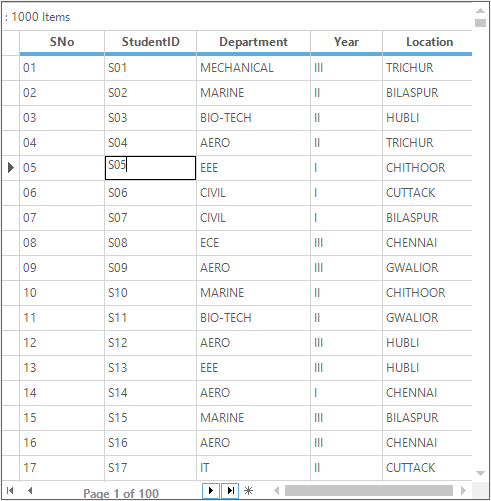
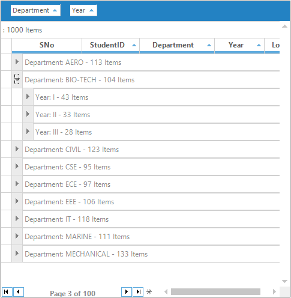

# Paging in Windows Forms GridGrouping control
Paging is the process of splitting up of large records into a separate segments to view and manipulate the data. It is used to improve the performance of the grid. The paging support can be enabled to the GridGroupingControl by using the [Pager.Wire](https://help.syncfusion.com/cr/windowsforms/Syncfusion.GridHelperClasses.Pager.html#Syncfusion_GridHelperClasses_Pager_Wire_Syncfusion_Windows_Forms_Grid_Grouping_GridGroupingControl_) method.



//Creating the object for Pager
Pager pager = new Pager();

//Wiring the pager to the Grid 
pager.Wire(this.gridGroupingControl1, dataTable); // dataTable is the DataTable object


'Creating the object for Pager
Dim pager As New Pager()

' wiring the pager to the Grid 
pager.Wire(Me.gridGroupingControl1, dataTable) ' dataTable is the DataTable object



N> The paging is not supported for the nested grids.

## Page Size 
The size of the page that is number of records needs to be visible in each page can be set by using the [PageSize](https://help.syncfusion.com/cr/windowsforms/Syncfusion.GridHelperClasses.Pager.html#Syncfusion_GridHelperClasses_Pager_PageSize) property.



//Creating the object for Pager
Pager pager = new Pager();

//Set the size  1000 records in each page
pager.PageSize = 1000;

//Add the paging support to the GridGroupingControl 
pager.Wire(this.gridGroupingControl1, dataTable); // dataTable is the DataTable object



'Creating the object for Pager
Dim pager As New Pager()

' Set the size  1000 records in each page
pager.PageSize = 1000

'Add the paging support to the GridGroupingControl 
pager.Wire(Me.gridGroupingControl1, dataTable) ' dataTable is the DataTable object



## Page Navigation
The current page can be moved to the first, last, previous and next by using the arrow buttons of the navigation bar. The current page of the grid will be displayed at the label of the navigation bar along with the total number of pages.

The page navigation through the arrow buttons can be notified by using the ArrowButtonClicked event. The button clicks can be differentiate by using the ArrowType enumeration.  


this.gridGroupingControl1.RecordNavigationBar.ArrowButtonClicked += new ArrowButtonEventHandler(RecordNavigationBar_ArrowButtonClicked);

void RecordNavigationBar_ArrowButtonClicked(object sender, ArrowButtonEventArgs e)
{

   if(e.Arrow == ArrowType.Previous)
   {          

       //Notify the button clicked on the page navigation bar
       MessageBox.Show("Current page is moved to previous page");
   }
}



Private Me.gridGroupingControl1.RecordNavigationBar.ArrowButtonClicked += New ArrowButtonEventHandler(AddressOf RecordNavigationBar_ArrowButtonClicked)

Private Sub RecordNavigationBar_ArrowButtonClicked(ByVal sender As Object, ByVal e As ArrowButtonEventArgs)

   If e.Arrow = ArrowType.Previous Then

       'Notify the button clicked on the page navigation bar
       MessageBox.Show("Current page is moved to previous page")
   End If
End Sub



## Sorting
The paging is allows to sort the columns ascending and descending order. It will sort the records that are belong to the particular page. The sorting will be enabled while navigating the pages and applied individually for each page. 

## Grouping
The paging is also provides the support for grouping the column using the GroupDropArea. The grouping can be applied only to the records belongs to the current page. It will be remain same for each page while navigating.



//Adding GroupDropArea to the GridGroupingControl
this.gridGroupingControl1.ShowGroupDropArea = true;


'Adding GroupDropArea to the GridGroupingControl
Me.gridGroupingControl1.ShowGroupDropArea = True



## Filtering 
The filtering can be applied to the GridGroupingControl when the paging is enabled. The filter can be applied to the records which are bound to the page. However, this restriction can be overcome by wiring the view to a temporary table. 



//Display filter bar for the GridGroupingControl
this.gridGroupingControl1.TopLevelGroupOptions.ShowFilterBar = true;

//Enable filtering for all the columns 

foreach (var column in this.gridGroupingControl1.TableDescriptor.Columns)
    column.AllowFilter = true;


'Display filter bar for the GridGroupingControl
Me.gridGroupingControl1.TopLevelGroupOptions.ShowFilterBar = True

'Enable filtering for all the columns 

For Each column In Me.gridGroupingControl1.TableDescriptor.Columns
    column.AllowFilter = True
Next column



## Unwire Paging
The paging can be removed from the grid by using the [Pager.Unwire](https://help.syncfusion.com/cr/windowsforms/Syncfusion.GridHelperClasses.Pager.html#Syncfusion_GridHelperClasses_Pager_Unwire_Syncfusion_Windows_Forms_Grid_Grouping_GridGroupingControl_) method. It will remove the pager from the grid and display as all the records.



//Remove the pager from grid
pager.Unwire(this.gridGroupingControl1);


'Remove the pager from grid
pager.Unwire(Me.gridGroupingControl1)


