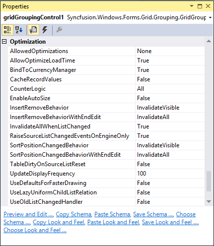
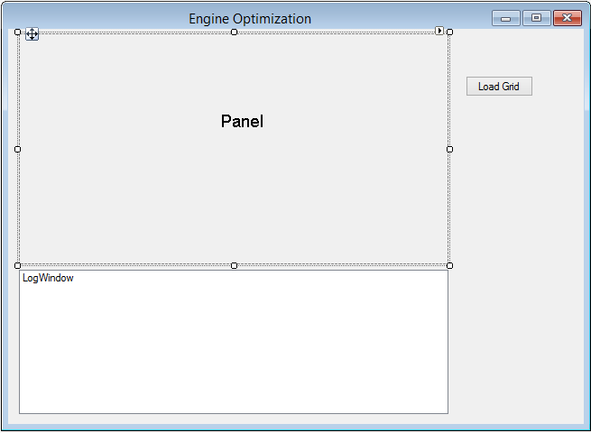
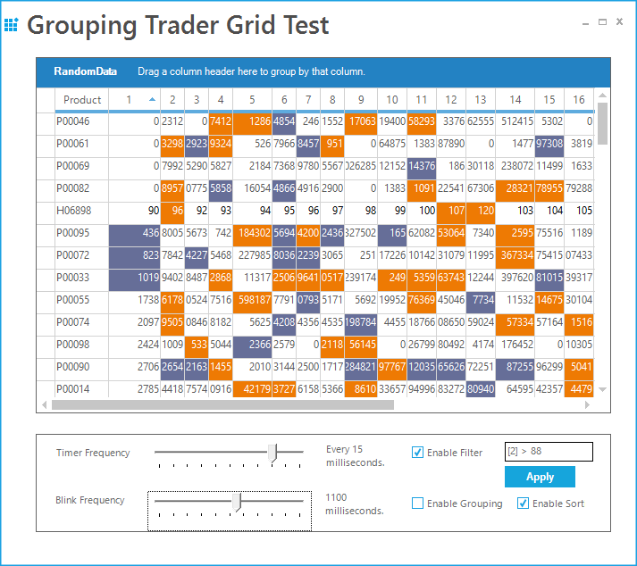

# Performance in Windows Forms GridGrouping control
GridGroupingControl has an extremely high performance standard. It can handle very high frequency updates and refresh scenarios. It also offers complete support for Virtual Mode wherein data will be loaded only on demand. Using some of the optimization properties, user can have the grid work with large amounts of data without a performance hit.

All the properties that affects grid performance are wrapped into a category named `Optimization`.

## Optimization Properties
In this section you will learn a brief explanation of the optimization properties available in GridGroupingControl. In the upcoming [topics](#memory-performance) you will learn the usage of these properties in application.

### Enabling Required Optimizations
[AllowedOptimizations](https://help.syncfusion.com/cr/windowsforms/Syncfusion.Grouping.Engine.html#Syncfusion_Grouping_Engine_AllowedOptimizations) specifies the optimizations when the engine is allowed to use when applicable. These optimizations can be used in combination with [CounterLogic](https://help.syncfusion.com/cr/windowsforms/Syncfusion.Windows.Forms.Grid.Grouping.GridGroupingControl.html#Syncfusion_Windows_Forms_Grid_Grouping_GridGroupingControl_CounterLogic) setting.[EngineOptimizations](https://help.syncfusion.com/cr/windowsforms/Syncfusion.Grouping.EngineOptimizations.html) enum defines values for this property.



// Enables the DisableCounters, VirtualMode and RecordsAsDisplayElements optimizations.
this.gridGroupingControl1.AllowedOptimizations = Syncfusion.Grouping.EngineOptimizations.All;


' Enables the DisableCounters, VirtualMode and RecordsAsDisplayElements optimizations.
Me.gridGroupingControl1.AllowedOptimizations = Syncfusion.Grouping.EngineOptimizations.All



### Reduce Flickering 
[AllowOptimizeLoadTime](https://help.syncfusion.com/cr/windowsforms/Syncfusion.Windows.Forms.Grid.Grouping.GridGroupingControl.html#Syncfusion_Windows_Forms_Grid_Grouping_GridGroupingControl_AllowOptimizeLoadTime) property helps in reducing the flickering issue at startup. When enabled, the grid will be rendered once into an offline bitmap before the form is shown for the first time. This offline rendering of the grid ensures that all the required data is loaded into the memory and all grid data are initialized. Default value is `true`.



// Reduces flickering at the start time
this.gridGroupingControl1.AllowOptimizeLoadTime = true;


' Reduces flickering at the start time
Me.gridGroupingControl1.AllowOptimizeLoadTime = True



### Bypassing CurrencyManager
When the data table is assigned to the GridGroupingControl, it will get access to the Default View of that data table through currency manager that would listen to the updates to the underlying data table. The benefit of using [CurrencyManager](https://help.syncfusion.com/cr/windowsforms/Syncfusion.Windows.Forms.Grid.Grouping.GridEngineBase.html#Syncfusion_Windows_Forms_Grid_Grouping_GridEngineBase_CurrencyManager) is that all the form elements would be kept synchronized.

Using `CurrencyManager` may cause performance issues in certain scenarios. In such cases, it can bypass `CurrencyManager` and access the list directly without ever involving it by setting [BindToCurrencyManager](https://help.syncfusion.com/cr/windowsforms/Syncfusion.Windows.Forms.Grid.Grouping.GridEngineBase.html#Syncfusion_Windows_Forms_Grid_Grouping_GridEngineBase_BindToCurrencyManager) property to `false` (which is true by default). This will in turn detach the grid from `CurrencyManager` and hence the grid engine does not register the list with Windows Forms Currency Manager and it solely relies on listening to `ListChanged` events.



// Specifies list to be attached to Currency Manager
this.gridGroupingControl1.BindToCurrencyManager = true;


' Specifies list to be attached to Currency Manager
Me.gridGroupingControl1.BindToCurrencyManager = True



### Caching the Record Values
If the custom collections are assigned to the grid, user can choose to have the engine to cache record values using [CacheRecordValues](https://help.syncfusion.com/cr/windowsforms/Syncfusion.Windows.Forms.Grid.Grouping.GridEngine.html) property. When set to `true`, the engine will cache copies of old values from a record in the record object. User can get these values with[Record.GetOldValue](https://help.syncfusion.com/cr/windowsforms/Syncfusion.Windows.Forms.Grid.Grouping.GridAddNewRecord.html) method. With custom collections, the engine can also determine exactly which values in a record were changed when the engine receives the `ListChanged` event and previous values were cached.



// Specifies list to be attached to Currency Manager
this.gridGroupingControl1.BindToCurrencyManager = true;


' Specifies list to be attached to Currency Manager
Me.gridGroupingControl1.BindToCurrencyManager = True



### Maintaining the Counters
It specifies the [CounterLogic](https://help.syncfusion.com/cr/windowsforms/Syncfusion.Windows.Forms.Grid.Grouping.GridGroupingControl.html#Syncfusion_Windows_Forms_Grid_Grouping_GridGroupingControl_CounterLogic) to be used within the engine. `GroupingEngine` maintains counters for [VisibleColumns](https://help.syncfusion.com/cr/windowsforms/Syncfusion.Windows.Forms.Grid.Grouping.GridStackedHeaderDescriptor.html#Syncfusion_Windows_Forms_Grid_Grouping_GridStackedHeaderDescriptor_VisibleColumns), [FilteredRecords](https://help.syncfusion.com/cr/windowsforms/Syncfusion.Windows.Forms.Grid.Grouping.GridAddNewRecordSection.html), [YAmount](https://help.syncfusion.com/cr/windowsforms/Syncfusion.Windows.Forms.ScrollWindowEventArgs.html#Syncfusion_Windows_Forms_ScrollWindowEventArgs_YAmount), [HiddenRows](https://help.syncfusion.com/cr/windowsforms/Syncfusion.Windows.Forms.Grid.Design.RowStyles.html#Syncfusion_Windows_Forms_Grid_Design_RowStyles_HiddenRows) and similar properties. These counters occupy a countable portion of the grid tree in memory. On every list change, all these counters need to be refreshed along with the data records.

Invalidating all the counters is not required at all times. For instance, if you have a larger data source and you do not want support for groups and filtered records, then there is no need to maintain counters such as `FilteredRecords` and similar properties. Keeping all the counters in memory will greatly increase memory consumption, which is not necessary in this case and there will degradation of grid performance.

To handle such scenarios, GridGroupingControl provides options to skip allocating these counters. By setting this property, it can reduce the memory footprint by selectively disabling the counters that are not required for the application. [EngineCounters](https://help.syncfusion.com/cr/windowsforms/Syncfusion.Grouping.EngineCounters.html) enum defines the values for this property, which will be discussed in the next chapter.



// All counters are supported
this.gridGroupingControl1.CounterLogic = Syncfusion.Grouping.EngineCounters.All;


' All counters are supported
Me.gridGroupingControl1.CounterLogic = Syncfusion.Grouping.EngineCounters.All



### Inserting and Removing Records Behavior
[InsertRemoveBehavior](https://help.syncfusion.com/cr/windowsforms/Syncfusion.Windows.Forms.Grid.Grouping.GridEngine.html#Syncfusion_Windows_Forms_Grid_Grouping_GridEngine_InsertRemoveBehavior) and [InsertRemoveBehaviorWithEndEdit](https://help.syncfusion.com/cr/windowsforms/Syncfusion.Windows.Forms.Grid.Grouping.GridGroupingControl.html#Syncfusion_Windows_Forms_Grid_Grouping_GridGroupingControl_InsertRemoveBehaviorWithEndEdit) properties determine how the grid should react when a record is inserted or deleted. One or multiple records need to be shifted up and down. By default, the whole display is invalidated and all the rows are repainted though only one record needs to be redrawn.

By setting properties to [ListChangedInsertRemoveBehavior.ScrollWithImmediateUpdate](https://help.syncfusion.com/cr/windowsforms/Syncfusion.Windows.Forms.Grid.Grouping.GridListChangedInsertRemoveBehavior.html), you can instruct the engine not to repaint the whole screen. The engine will now determine the area affected by this change and use `ScrollWindow` API to shift records up and down, and only repaint one record that was really changed. This will have a big impact if the grid has a large records and repainting the whole display is expensive. 



// Invalidates All when records are inserted or removed
this.gridGroupingControl1.InsertRemoveBehavior = Syncfusion.Windows.Forms.Grid.Grouping.GridListChangedInsertRemoveBehavior.InvalidateAll;


' Invalidates All when records are inserted or removed
Me.gridGroupingControl1.InsertRemoveBehavior = Syncfusion.Windows.Forms.Grid.Grouping.GridListChangedInsertRemoveBehavior.InvalidateAll



### Invalidating Layout on Record Changing
[InvalidateAllWhenListChanged](https://help.syncfusion.com/cr/windowsforms/Syncfusion.Windows.Forms.Grid.Grouping.GridEngine.html#Syncfusion_Windows_Forms_Grid_Grouping_GridEngine_InvalidateAllWhenListChanged) is used to specify whether the grid should simply call Invalidate when a `ListChanged` event is handled or if it should determine the area that is affected by the change and call [InvalidateRange](https://help.syncfusion.com/cr/windowsforms/Syncfusion.Windows.Forms.Grid.GridControlBase.html#Syncfusion_Windows_Forms_Grid_GridControlBase_InvalidateRange_Syncfusion_Windows_Forms_Grid_GridRangeInfo_).

At first, it will look better to determine the area that is affected by a change and call [InvalidateRange](https://help.syncfusion.com/cr/windowsforms/Syncfusion.Windows.Forms.Grid.GridControlBase.html#Syncfusion_Windows_Forms_Grid_GridControlBase_InvalidateRange_Syncfusion_Windows_Forms_Grid_GridRangeInfo_) method. But when calling this method, the grid needs to know the exact position of the record in the table before it can mark that area dirty. In order to determine the record position (and y-position of the row in the display), counters need to be evaluated. This operation can cost more time than simply calling Invalidate in high-frequency update scenarios. The group caption bar also needs to be updated when a record changes.

[InsertRemoveBehavior](https://help.syncfusion.com/cr/windowsforms/Syncfusion.Windows.Forms.Grid.Grouping.GridGroupingControl.html#Syncfusion_Windows_Forms_Grid_Grouping_GridGroupingControl_InsertRemoveBehavior), [SortPositionChangedBehavior](https://help.syncfusion.com/cr/windowsforms/Syncfusion.Windows.Forms.Grid.Grouping.GridGroupingControl.html#Syncfusion_Windows_Forms_Grid_Grouping_GridGroupingControl_SortPositionChangedBehavior) properties and [UpdateDisplayFrequency](https://help.syncfusion.com/cr/windowsforms/Syncfusion.Windows.Forms.Grid.Grouping.GridEngine.html#Syncfusion_Windows_Forms_Grid_Grouping_GridEngine_UpdateDisplayFrequency) can speed up things when `InvalidateAllWhenListChanged` is set to false.



// Invalidates when ListChanged event is handled
this.gridGroupingControl1.InvalidateAllWhenListChanged = true;


' Invalidates when ListChanged event is handled
Me.gridGroupingControl1.InvalidateAllWhenListChanged = True



### Raising ListChanged event only on Engine 
When the engine handles `ListChanged` event, it will raise numerous events by itself. When [RaiseSourceListChangedEventsOnEngineOnly](https://help.syncfusion.com/cr/windowsforms/Syncfusion.Windows.Forms.Grid.Grouping.GridEngineBase.html) property is set to `true`, the events will only be raised on the Engine object. If set to `false` then events will also be raised on inner objects (will bubble up on nested tables, which causes some performance overhead). It will only have effect if [UseOldListChangedHandler](https://help.syncfusion.com/cr/windowsforms/Syncfusion.Windows.Forms.Grid.Grouping.GridEngine.html) is set to false. 



// Events will be raised only on the Engine object
this.gridGroupingControl1.RaiseSourceListChangedEventsOnEngineOnly = true;


' Events will be raised only on the Engine object
Me.gridGroupingControl1.RaiseSourceListChangedEventsOnEngineOnly = True



### Update on Sort Position Changed
[SortPositionChangedBehavior](https://help.syncfusion.com/cr/windowsforms/Syncfusion.Windows.Forms.Grid.Grouping.GridGroupingControl.html#Syncfusion_Windows_Forms_Grid_Grouping_GridGroupingControl_SortPositionChangedBehavior) and [SortPositionChangedBehaviorWithEndEdit](https://help.syncfusion.com/cr/windowsforms/Syncfusion.Windows.Forms.Grid.Grouping.GridGroupingControl.html#Syncfusion_Windows_Forms_Grid_Grouping_GridGroupingControl_SortPositionChangedBehaviorWithEndEdit) properties determine how to update display with a change in the sort position of a record. By default, the whole display is invalidated and all the rows are repainted though only one record needs to be redrawn. This will degrade performance and will not be efficient if grid have a larger data and repainting the whole display is expensive.

By setting these properties to [ListChangedInsertRemoveBehavior.ScrollWithImmediateUpdate](https://help.syncfusion.com/cr/windowsforms/Syncfusion.Windows.Forms.Grid.Grouping.GridListChangedInsertRemoveBehavior.html), user can instruct the engine not to repaint the whole screen. This will only repaint the record that was really changed.

### Update Frequency on particular time
[UpdateDisplayFrequency](https://help.syncfusion.com/cr/windowsforms/Syncfusion.Windows.Forms.Grid.Grouping.GridGroupingControl.html#Syncfusion_Windows_Forms_Grid_Grouping_GridGroupingControl_UpdateDisplayFrequency) property is used to specify the number of milliseconds to wait between display updates when new ListChanged event handler logic is used. This property does not have any effect if UseOldListChangedHandler is set to `true`. Special values are 0 - only manually update display by calling grid.Update() and 1 - update display immediately after each change.

### Using Default Graphics for faster Drawing              
By setting the [UseDefaultsForFasterDrawing](https://help.syncfusion.com/cr/windowsforms/Syncfusion.Windows.Forms.Grid.Grouping.GridGroupingControl.html#Syncfusion_Windows_Forms_Grid_Grouping_GridGroupingControl_UseDefaultsForFasterDrawing) value as `true`, user can quickly switch to faster GDI draw text, solid borders and more efficient calculation of the optimal width of a column. Initializes recommended settings to improve handling of `ListChanged` events and scrolling through grid. Affected settings are: [TableOptions.ColumnsMaxLengthStrategy](https://help.syncfusion.com/cr/windowsforms/Syncfusion.Windows.Forms.Grid.Grouping.GridTableOptionsStyleInfo.html#Syncfusion_Windows_Forms_Grid_Grouping_GridTableOptionsStyleInfo_ColumnsMaxLengthStrategy), [TableOptions.GridLineBorder](https://help.syncfusion.com/cr/windowsforms/Syncfusion.Windows.Forms.Grid.Grouping.GridTableOptionsStyleInfo.html#Syncfusion_Windows_Forms_Grid_Grouping_GridTableOptionsStyleInfo_GridLineBorder), [TableOptions.DrawTextWithGdiInterop](https://help.syncfusion.com/cr/windowsforms/Syncfusion.Windows.Forms.Grid.Grouping.GridTableOptionsStyleInfo.html#Syncfusion_Windows_Forms_Grid_Grouping_GridTableOptionsStyleInfo_DrawTextWithGdiInterop), [TableOptions.VerticalPixelScroll](https://help.syncfusion.com/cr/windowsforms/Syncfusion.Windows.Forms.Grid.Grouping.GridTableOptionsStyleInfo.html#Syncfusion_Windows_Forms_Grid_Grouping_GridTableOptionsStyleInfo_VerticalPixelScroll), [Appearance.AnyRecordFieldCell.WrapText](https://help.syncfusion.com/cr/windowsforms/Syncfusion.Windows.Forms.Grid.GridStyleInfo.html#Syncfusion_Windows_Forms_Grid_GridStyleInfo_WrapText) and [Appearance.AnyRecordFieldCell.Trimming](https://help.syncfusion.com/cr/windowsforms/Syncfusion.Windows.Forms.Grid.GridStyleInfo.html#Syncfusion_Windows_Forms_Grid_GridStyleInfo_Trimming).



// Improves handling of ListChanged events and scrolling
this.gridGroupingControl1.UseDefaultsForFasterDrawing = true;


' Improves handling of ListChanged events and scrolling
Me.gridGroupingControl1.UseDefaultsForFasterDrawing = True



### Using Old ListChanged event
With version 4.4, the engine changed the way `ListChanged` event is handled internally to fix shortcomings with performance of the code that was in place earlier. [UseOldListChangedHandler](https://help.syncfusion.com/cr/windowsforms/Syncfusion.Windows.Forms.Grid.Grouping.GridGroupingControl.html#Syncfusion_Windows_Forms_Grid_Grouping_GridGroupingControl_UseOldListChangedHandler) property is used to switch back the behavior of the engine to old mechanism in case of notice any compatibility issues. The default value is `false`.



// Switch backs to the old behavior
this.gridGroupingControl1.UseOldListChangedHandler = true;


' Switch backs to the old behavior
Me.gridGroupingControl1.UseOldListChangedHandler = True



### Blinking Time
GridGroupingControl has in-built support for highlighting cells for a short period of time after a change is detected to a cell. The [BlinkTime](https://help.syncfusion.com/cr/windowsforms/Syncfusion.Windows.Forms.Grid.Grouping.GridEngine.html#Syncfusion_Windows_Forms_Grid_Grouping_GridEngine_BlinkTime) property lets the user to specify the amount of time in milliseconds for the values should be highlighted. User can also enable or disable this feature for individual columns by toggling [GridColumnDescriptor.AllowBlink](https://help.syncfusion.com/cr/windowsforms/Syncfusion.Windows.Forms.Grid.Grouping.GridColumnDescriptor.html#Syncfusion_Windows_Forms_Grid_Grouping_GridColumnDescriptor_AllowBlink) property.



// Sets the time in milliseconds while blinking
this.gridGroupingControl1.BlinkTime = 500;


' Sets the time in milliseconds while blinking
Me.gridGroupingControl1.BlinkTime = 500



## Memory Performance – Engine Optimizations
Engine optimizations will greatly help improve Memory Performance. Triggering these optimizations selectively will help in reducing memory footprint. 

### Optimizing Memory performance
Engine optimizations can be enabled by setting [AllowedOptimizations](https://help.syncfusion.com/cr/windowsforms/Syncfusion.Grouping.Engine.html#Syncfusion_Grouping_Engine_AllowedOptimizations) to some value other than None. To optimize memory usage, [CounterLogic](https://help.syncfusion.com/cr/windowsforms/Syncfusion.Windows.Forms.Grid.Grouping.GridGroupingControl.html#Syncfusion_Windows_Forms_Grid_Grouping_GridGroupingControl_CounterLogic) property needs to be assigned with a proper value. 

The user can specify the Engine optimizations by setting the `AllowedOptimizations` value as desired optimizations. The following is the list of optimizations the grid offers that are defined by [EngineOptimizations](https://help.syncfusion.com/cr/windowsforms/Syncfusion.Grouping.EngineOptimizations.html) enumeration. By default, they are turned off, but the user can tell the engine which optimization should be applied when the specified criteria for the optimization is met.



// Enable Engine optimizations
this.gridGroupingControl1.AllowedOptimizations = Syncfusion.Grouping.EngineOptimizations.All;


' Enable Engine optimizations
Me.gridGroupingControl1.AllowedOptimizations = Syncfusion.Grouping.EngineOptimizations.All



The followings are the `EngineOptimizations` enumerations available for `AllowedOptimizations`,

**None** - All optimizations are disabled. 
**DisableCounters** - When the engine detects that a table does not have [RecordFilters](https://help.syncfusion.com/cr/windowsforms/Syncfusion.Grouping.TableDescriptor.html#Syncfusion_Grouping_TableDescriptor_RecordFilters), [GroupedColumns](https://help.syncfusion.com/cr/windowsforms/Syncfusion.Grouping.TableDescriptor.html#Syncfusion_Grouping_TableDescriptor_GroupedColumns), or nested relations, counter logic will be disabled for [RecordsDetails](https://help.syncfusion.com/cr/windowsforms/Syncfusion.Grouping.RecordsDetails.html) collection since all counters are in sync with actual records (e.g. all records in data source are shown in TopLevelGroup). With this optimization, the engine will still have full support for sorting. 
**VirtualMode -** When all criteria are met for optimization and in addition to that no SortedColumns is set, [RecordsDetails](https://help.syncfusion.com/cr/windowsforms/Syncfusion.Grouping.RecordsDetails.html) collection does not have to be initialized at all. Instead, it can create records elements on demand and discard them using regular garbage collection when no references to a Record exists any more (e.g. once you scroll them out of view). This approach reduces memory footprint to absolute minimum. It allows to load and display millions of records in a table. The `PrimaryKey` collection is still supported, but it will be initialized only on demand if it is accessed via [Table.PrimaryKeySortedRecords](https://help.syncfusion.com/cr/windowsforms/Syncfusion.Grouping.Table.html#Syncfusion_Grouping_Table_PrimaryKeySortedRecords) collection. In such case all records will be enumerated. 
**PassThroughSort -** When all criteria are met for optimization and [SortedColumns](https://help.syncfusion.com/cr/windowsforms/Syncfusion.Windows.Forms.Grid.GridModel.html#Syncfusion_Windows_Forms_Grid_GridModel_SortedColumns) are set, the engine will normally have to loop through records and sort them. When the user specifies, the engine will check if the data source is an `IBindingList` and if [IBindingList.SupportsSort](https://help.syncfusion.com/cr/windowsforms/Syncfusion.Collections.ListUtil.html#Syncfusion_Collections_ListUtil_SupportsSort_System_Collections_IList_) returns `true`. In such cases, data source will be sorted by using [IBindingList.Sort](https://help.syncfusion.com/cr/windowsforms/Syncfusion.Windows.Forms.Collections.ObservableList-1.html#Syncfusion_Windows_Forms_Collections_ObservableList_1_Sort_System_Collections_IComparer_) routine and the engine will access records by using `VirtualMode`. Using `IBindingList` is usually a bit faster than the engines own sorting routines, but the disadvantage is that it will lose [CurrentRecord](https://help.syncfusion.com/cr/windowsforms/Syncfusion.Grouping.CurrentRecordManager.html#Syncfusion_Grouping_CurrentRecordManager_CurrentRecord) and [SelectedRecords](https://help.syncfusion.com/cr/windowsforms/Syncfusion.Grouping.Table.html#Syncfusion_Grouping_Table_SelectedRecords) information. Inserting and removing records will also be slower (especially if the underlying data source is DataView). `EngineOptimizations.PassThroughSort` will be ignored if criteria are met for the optimization are not met. If the user wants to force a Pass-through sort mechanism in such a case, it can be done by implementing[IGroupingList](https://help.syncfusion.com/cr/windowsforms/Syncfusion.Grouping.IGroupingList.html) interface. This allows performing the sort on data view directly instead of letting grouping engine perform the sorting. Normally, it is recommended to use the engine’s own Sort mechanism and only rely on `EngineOptimizations.PassThroughSort` for virtual mode scenarios. 
**RecordsAsDisplayElements -** When the engine detects that records do not have nested child tables, no record preview rows are being used, and each record has only one row (no `ColumnSets` are used), records do not have to be split into `RecordParts`. Instead when querying [DisplayElements](https://help.syncfusion.com/cr/windowsforms/Syncfusion.Grouping.ChildTable.html#Syncfusion_Grouping_ChildTable_DisplayElements) collection for a specific row, the engine can simply return Record element instead of [RecordRow](https://help.syncfusion.com/cr/windowsforms/Syncfusion.Grouping.RecordRow.html) element. The same applies to `CaptionSection`, `ColumnHeaderSection` and `FilterBarSection`. Instead of returning `CaptionRow`, `ColumnHeaderRow`, or `FilterBarRow` element, `DisplayElements` collection returns section element. While using this optimization, need to be careful on querying the `DisplayElements` collection instead of `RecordRow` element, Record element can be returned. So also with `ColumnHeader`, `FilterBase`, and `Caption`. 
**All –** It will enable the optimizations - `DisableCounters`, `VirtualMode`, and `RecordsAsDisplayElements`. Based on the schema that had specify, the engine will determine if certain optimizations can be applied. If it’s a flat table and do not sort records, `VirtualMode` will be applied and records do not have to be touched at all (only when drawing). If the records are sorted, then tree tables will be built so that the grid can sort records, but the logic for filtering and grouping is turned off (`DisableCounters` optimization). In case of pass-through sorting, the table is sorted by using `DataView.Sort` routine and records will be accessed with `VirtualMode`. If the Grid have group records or nested tables, then full grouping logic will be needed. 
**Counter Logic -** In addition to specify `VirtualMode` or `WithoutCounter` mode, users can also specify the counters as per need. Most of the times the user only wants to count visible elements and filtered records and the others can leave out like custom counters, hidden element counter, etc. That can save a few bytes per record (40-80 bytes). The engine will also determine whether records actually need to be broken into pieces or if a record can be returned as leave elements ([RecordsAsDisplayElements](https://help.syncfusion.com/cr/windowsforms/Syncfusion.Windows.Forms.Grid.Grouping.GridTableBase.html) option). This again saves a few bytes per record. 



// Set the CounterLogic for the Engine.
this.gridGroupingControl1.CounterLogic = Syncfusion.Grouping.EngineCounters.FilteredRecords;


' Set the CounterLogic for the Engine.
Me.gridGroupingControl1.CounterLogic = Syncfusion.Grouping.EngineCounters.FilteredRecords



The [EngineCounters](https://help.syncfusion.com/cr/windowsforms/Syncfusion.Grouping.EngineCounters.html) enumeration properties available for specify the [CounterLogic](https://help.syncfusion.com/cr/windowsforms/Syncfusion.Windows.Forms.Grid.Grouping.GridEngineBase.html) are listed as follows,

**All** - All counters are supported: visible elements, filtered records, `YAmount`, hidden elements, hidden records, `CustomCount` and `VisibleCustomCount`. Highest memory footprint. 
**FilteredRecords -** Counts only visible elements and filtered records. Smallest memory footprint. 
**YAmount -** Counts visible elements, filtered records and `YAmount`. Medium memory footprint. 

N> Allowing certain optimizations does not mean that the optimization is necessarily used. Optimizations will only be used when applicable. Take for example the optimization. While enable this optimization, the engine will check schema settings when loading the table. If there are no `SortedColumns`, `RecordFilters`, `GroupedColumns`, or nested relations for a table, then virtual mode can be used and no records need to be loaded into memory. If the user later sorts by one column, the virtual mode cannot be used any more. Records will need to be iterated through and sorted and tree structures will be built that allow quick access to records and `IndexOf` operations. When initializing table, the engine will check if criteria for `DisableCounters` optimization are met.

### Implementation 
All the optimizations are enabled by setting [AllowedOptimizations](https://help.syncfusion.com/cr/windowsforms/Syncfusion.Windows.Forms.Grid.Grouping.GridEngineBase.html) to All. As said earlier, optimizations specified will not be applied at all times. They will only be used when applicable, that is, when the criteria for those optimizations are met. This example best illustrates this process. On every property change, the log window displays the list of optimizations applied to the grid at that instance. While running the sample, it can track the optimizations applied in different engine states like with or without grouping, with or without sorting, etc.

**Sample Location:** 
&lt;Installed_Location&gt;\Syncfusion\EssentialStudio\&lt;Version_Number&gt;\Windows\Grid.Grouping.Windows\Samples\Performance\Engine Optimization Demo\CS

Use the following steps to experiment different engine optimizations.
1. Create a class (`VirtualItem`) that represents the record structure. Its data members form the record fields.




public class VirtualItem
{
    int index;
    string name;
    double someValue;
    double otherValue;

    public int Index
    {
        get
        {
            return index;
        }
        set
        {
            index = value;
        }
    }

    public string Name
    {
        get
        {
            return name;
        }
        set
        {
            name = value;
        }
    }

    public double SomeValue
    {
        get
        {
            return someValue;
        }
        set
        {
            someValue = value;
        }
    }

    public double OtherValue
    {
        get
        {
            return otherValue;
        }
        set
        {
            otherValue = value;
        }
    }

}


Public Class VirtualItem
    Private index_Renamed As Integer
    Private name_Renamed As String
    Private someValue_Renamed As Double
    Private otherValue_Renamed As Double

    Public Property Index() As Integer
        Get
            Return index_Renamed
        End Get
        Set(ByVal value As Integer)
            index_Renamed = value
        End Set
    End Property

    Public Property Name() As String
        Get
            Return name_Renamed
        End Get
        Set(ByVal value As String)
            name_Renamed = value
        End Set
    End Property

    Public Property SomeValue() As Double
        Get
            Return someValue_Renamed
        End Get
        Set(ByVal value As Double)
            someValue_Renamed = value
        End Set
    End Property

    Public Property OtherValue() As Double
        Get
            Return otherValue_Renamed
        End Get
        Set(ByVal value As Double)
            otherValue_Renamed = value
        End Set
    End Property

End Class




{{ codesnippet1 | OrderList_Indent_Level_1 }}

2. Create another class (`VirtualList`) by implementing[IList](https://learn.microsoft.com/en-us/dotnet/api/system.collections.ilist?view=net-5.0) and [ITypedList](https://learn.microsoft.com/en-us/dotnet/api/system.componentmodel.itypedlist?view=net-5.0) interfaces. This class represents your collection that serves as data source for grid grouping control. Refer to CustomCollections under the DataBinding topic to know how to implement these interfaces.




public class VirtualList : IList, ITypedList
{
    int virtualCount;

    public VirtualList(int count)
    {
        virtualCount = count;
    }

    #region IList Members

    public bool IsReadOnly
    {
        get
        {
            return true;
        }
    }

    public object this[int index]
    {
        get
        {
            VirtualItem item = new VirtualItem();
            item.Index = index;
            item.Name = "Name" + index.ToString("000000000");
            item.SomeValue = index * 0.873332f;
            item.OtherValue = (293023033 - index) / 8;

            return item;
        }
        set
        {
        }
    }

    public void RemoveAt(int index)
    {
    }

    public void Insert(int index, object value)
    {
    }

    public void Remove(object value)
    {
    }

    public bool Contains(object value)
    {
        return false;
    }

    public void Clear()
    {
    }

    public int IndexOf(object value)
    {
        return 0;
    }

    public int Add(object value)
    {
        return 0;
    }

    public bool IsFixedSize
    {
        get
        {
            return true;
        }
    }

    #endregion

    #region ICollection Members

    public bool IsSynchronized
    {
        get
        {
            return false;
        }
    }

    public int Count
    {
        get
        {
            return virtualCount;
        }
    }

    public void CopyTo(Array array, int index)
    {
    }

    public object SyncRoot
    {
        get
        {
            return null;
        }
    }

    #endregion

    #region IEnumerable Members

    public IEnumerator GetEnumerator()
    {
        return null;
    }

    #endregion

    #region ITypedList Members

    public PropertyDescriptorCollection GetItemProperties(PropertyDescriptor[] listAccessors)
    {
        System.ComponentModel.PropertyDescriptorCollection propertyDescriptorCollection
            = TypeDescriptor.GetProperties(typeof(VirtualItem));

        string[] attr = new string[]
        {
            "Index",
            "Name",
            "SomeValue",
            "OtherValue",
        };

        return propertyDescriptorCollection.Sort(attr);
    }

    public string GetListName(PropertyDescriptor[] listAccessors)
    {
        return "VirtualList";
    }

    #endregion
}


Public Class VirtualList
    Implements IList, ITypedList
    Private virtualCount As Integer

    Public Sub New(ByVal count As Integer)
        virtualCount = count
    End Sub

    #Region "IList Members"

    Public ReadOnly Property IsReadOnly() As Boolean
        Get
            Return True
        End Get
    End Property

    Default Public Property Item(ByVal index As Integer) As Object
        Get
            Dim item As New VirtualItem()
            item.Index = index
            item.Name = "Name" & index.ToString("000000000")
            item.SomeValue = index * 0.873332f
            item.OtherValue = (293023033 - index) / 8

            Return item
        End Get
        Set(ByVal value As Object)
        End Set
    End Property

    Public Sub RemoveAt(ByVal index As Integer)
    End Sub

    Public Sub Insert(ByVal index As Integer, ByVal value As Object)
    End Sub

    Public Sub Remove(ByVal value As Object)
    End Sub

    Public Function Contains(ByVal value As Object) As Boolean
        Return False
    End Function

    Public Sub Clear()
    End Sub

    Public Function IndexOf(ByVal value As Object) As Integer
        Return 0
    End Function

    Public Function Add(ByVal value As Object) As Integer
        Return 0
    End Function

    Public ReadOnly Property IsFixedSize() As Boolean
        Get
            Return True
        End Get
    End Property

    #End Region

    #Region "ICollection Members"

    Public ReadOnly Property IsSynchronized() As Boolean
        Get
            Return False
        End Get
    End Property

    Public ReadOnly Property Count() As Integer
        Get
            Return virtualCount
        End Get
    End Property

    Public Sub CopyTo(ByVal array As Array, ByVal index As Integer)
    End Sub

    Public ReadOnly Property SyncRoot() As Object
        Get
            Return Nothing
        End Get
    End Property

    #End Region

    #Region "IEnumerable Members"

    Public Function GetEnumerator() As IEnumerator
        Return Nothing
    End Function

    #End Region

    #Region "ITypedList Members"

    Public Function GetItemProperties(ByVal listAccessors() As PropertyDescriptor) As PropertyDescriptorCollection
        Dim propertyDescriptorCollection As System.ComponentModel.PropertyDescriptorCollection = TypeDescriptor.GetProperties(GetType(VirtualItem))

        Dim attr() As String = { "Index", "Name", "SomeValue", "OtherValue" }

        Return propertyDescriptorCollection.Sort(attr)
    End Function

    Public Function GetListName(ByVal listAccessors() As PropertyDescriptor) As String
        Return "VirtualList"
    End Function

    #End Region
End Class



{{ codesnippet2 | OrderList_Indent_Level_1 }}

3. Add a button and ListBox to the main form. Clicking the button will create a grid grouping control and load it with Virtual List. ListBox serves as Log Window wherein user will display the log messages like time elapsed for loading the grid, list of optimizations applied, and so on. The form will be look like the one below at design time.

4. Set up a new engine and specify the optimizations settings required.




GridEngine schema = new GridEngine();
schema.InvalidateAllWhenListChanged = false;
schema.AllowedOptimizations = EngineOptimizations.All;
schema.CounterLogic = EngineCounters.YAmount;

//Also dependent on CounterLogic = EngineCounters.YAmount.
schema.TableOptions.VerticalPixelScroll = true;
schema.TableOptions.ColumnsMaxLengthStrategy = GridColumnsMaxLengthStrategy.FirstNRecords;
schema.TableOptions.ColumnsMaxLengthFirstNRecords = 100;
schema.TableOptions.AllowSortColumns = true;
schema.TableDescriptor.AllowEdit = false;
schema.DataSource = new VirtualList(100000);
schema.Reset();
schema.TableDescriptor.Columns["Index"].MaxLength = 10;


Dim schema As New GridEngine()
schema.InvalidateAllWhenListChanged = False
schema.AllowedOptimizations = EngineOptimizations.All
schema.CounterLogic = EngineCounters.YAmount

'Also dependent on CounterLogic = EngineCounters.YAmount.
schema.TableOptions.VerticalPixelScroll = True
schema.TableOptions.ColumnsMaxLengthStrategy = GridColumnsMaxLengthStrategy.FirstNRecords
schema.TableOptions.ColumnsMaxLengthFirstNRecords = 100
schema.TableOptions.AllowSortColumns = True
schema.TableDescriptor.AllowEdit = False
schema.DataSource = New VirtualList(100000)
schema.Reset()
schema.TableDescriptor.Columns("Index").MaxLength = 10



{{ codesnippet3 | OrderList_Indent_Level_1 }}

5. Define a method `LogMemoryUsage` that calculates the amount of memory consumed and displays various optimizations applied to the grouping engine.




void LogMemoryUsage()
{

    //Forces garbage collection and gets used memory size.
    GC.Collect();
    System.Threading.Thread.Sleep(10);
    GC.Collect();
    System.Threading.Thread.Sleep(100);
    GC.Collect();
    LogWindow.Items.Add(string.Format("Optimizations for {0}: ", this.gridGroupingControl1.TableDescriptor.Name));
    LogWindow.Items.Add(string.Format("VirtualMode: {0}, ", this.gridGroupingControl1.Table.VirtualMode));
    LogWindow.Items.Add(string.Format("WithoutCounter: {0}, ", this.gridGroupingControl1.Table.WithoutCounter));
    LogWindow.Items.Add(string.Format("RecordsAsDisplayElements: {0}, ", gridGroupingControl1.Table.RecordsAsDisplayElements));
    Process myProcess = Process.GetCurrentProcess();
    double workingSetSizeInKiloBytes = myProcess.WorkingSet64 / 1000;
    string s = "Process's physical memory usage: " + workingSetSizeInKiloBytes.ToString() + " kb";
    LogWindow.Items.Add(s); 
    LogWindow.Items.Add("");
}


Private Sub LogMemoryUsage()

    'Forces garbage collection and gets used memory size.
    GC.Collect()
    System.Threading.Thread.Sleep(10)
    GC.Collect()
    System.Threading.Thread.Sleep(100)
    GC.Collect()
    LogWindow.Items.Add(String.Format("Optimizations for {0}: ", Me.gridGroupingControl1.TableDescriptor.Name))
    LogWindow.Items.Add(String.Format("VirtualMode: {0}, ", Me.gridGroupingControl1.Table.VirtualMode))
    LogWindow.Items.Add(String.Format("WithoutCounter: {0}, ", Me.gridGroupingControl1.Table.WithoutCounter))
    LogWindow.Items.Add(String.Format("RecordsAsDisplayElements: {0}, ", gridGroupingControl1.Table.RecordsAsDisplayElements))
    Dim myProcess As Process = Process.GetCurrentProcess()
    Dim workingSetSizeInKiloBytes As Double = myProcess.WorkingSet64 \ 1000
    Dim s As String = "Process's physical memory usage: " & workingSetSizeInKiloBytes.ToString() & " kb"
    LogWindow.Items.Add(s)
    LogWindow.Items.Add("")
End Sub



{{ codesnippet4 | OrderList_Indent_Level_1 }}

6. Handle the `ButtonClick` event in order to populate the grid when the button is clicked. It also calls `LogMemoryUsage` method to display initial optimization settings for the grid - the optimizations for an ungrouped and unsorted grid.




this.buttonLoadGrid.Click += new System.EventHandler(this.LoadGridLoadGrid_Click);
private void LoadGridLoadGrid_Click(object sender, EventArgs e)
{
    this.LogWindow.Items.Add("");
    this.LogWindow.Items.Add("Flat, Virtual List with Sorting and Grouping Enabled.");
    int time = Environment.TickCount;
    Cursor.Current = Cursors.WaitCursor;

    //Loads a Grid Grouping control with a new engine.
    gridGroupingControl1 = new GridGroupingControl();
    gridGroupingControl1.BackColor = System.Drawing.SystemColors.Window;
    gridGroupingControl1.Dock = System.Windows.Forms.DockStyle.Fill;
    gridGroupingControl1.Name = "gridGroupingControl1";
    gridGroupingControl1.TabIndex = 0;
    gridGroupingControl1.IntelliMousePanning = true;
    this.panel1.Controls.Add(this.gridGroupingControl1);
    gridGroupingControl1.Engine = schema;
    gridGroupingControl1.DataSource = new VirtualList(100000);
    gridGroupingControl1.ShowGroupDropArea = true;
    this.Refresh();
    Cursor.Current = Cursors.Arrow;
    this.LogWindow.Items.Add(string.Format("Elapsed Time: {0}", Environment.TickCount - time));
    gridGroupingControl1.Appearance.AnyCell.Font.Facename = "Verdana";
    gridGroupingControl1.Appearance.AnyCell.TextColor = Color.MidnightBlue;
    gridGroupingControl1.TableOptions.GridVisualStyles = Syncfusion.Windows.Forms.GridVisualStyles.Office2007Blue;
    gridGroupingControl1.TableOptions.GridLineBorder = new GridBorder(GridBorderStyle.Solid, Color.FromArgb(227, 239, 255), GridBorderWeight.Thin);

    //Initial Log Display.
    LogMemoryUsage();
}


AddHandler buttonLoadGrid.Click, AddressOf LoadGridLoadGrid_Click
Private Sub LoadGridLoadGrid_Click(ByVal sender As Object, ByVal e As EventArgs)
    Me.LogWindow.Items.Add("")
    Me.LogWindow.Items.Add("Flat, Virtual List with Sorting and Grouping Enabled.")
    Dim time As Integer = Environment.TickCount
    Cursor.Current = Cursors.WaitCursor

    'Loads a Grid Grouping control with a new engine.
    gridGroupingControl1 = New GridGroupingControl()
    gridGroupingControl1.BackColor = System.Drawing.SystemColors.Window
    gridGroupingControl1.Dock = System.Windows.Forms.DockStyle.Fill
    gridGroupingControl1.Name = "gridGroupingControl1"
    gridGroupingControl1.TabIndex = 0
    gridGroupingControl1.IntelliMousePanning = True
    Me.panel1.Controls.Add(Me.gridGroupingControl1)
    gridGroupingControl1.Engine = schema
    gridGroupingControl1.DataSource = New VirtualList(100000)
    gridGroupingControl1.ShowGroupDropArea = True
    Me.Refresh()
    Cursor.Current = Cursors.Arrow
    Me.LogWindow.Items.Add(String.Format("Elapsed Time: {0}", Environment.TickCount - time))
    gridGroupingControl1.Appearance.AnyCell.Font.Facename = "Verdana"
    gridGroupingControl1.Appearance.AnyCell.TextColor = Color.MidnightBlue
    gridGroupingControl1.TableOptions.GridVisualStyles = Syncfusion.Windows.Forms.GridVisualStyles.Office2007Blue
    gridGroupingControl1.TableOptions.GridLineBorder = New GridBorder(GridBorderStyle.Solid, Color.FromArgb(227, 239, 255), GridBorderWeight.Thin)

    'Initial Log Display.
    LogMemoryUsage()
End Sub




{{ codesnippet5 | OrderList_Indent_Level_1 }}

7. Handle `PropertyChanging` event to display log for every property that is being changed in the grid. This will be raised when you group or sort the grid grouping control and hence you could track the results of these operations (especially the current optimizations) here.




gridGroupingControl1.PropertyChanging += new DescriptorPropertyChangedEventHandler(gridGroupingControl1_PropertyChanging);
Timer t = null;

void gridGroupingControl1_PropertyChanging(object sender, DescriptorPropertyChangedEventArgs e)
{
    LogWindow.Items.Add(e.ToString());

    if (t != null)
    {
        t.Tick -= new EventHandler(t_Tick);
        t.Dispose();
    }
    t = new Timer();
    t.Interval = 100;
    t.Tick += new EventHandler(t_Tick);
    t.Start();
}

private void t_Tick(object sender, EventArgs e)
{
    Timer t = (Timer)sender;
    t.Tick -= new EventHandler(t_Tick);
    t.Dispose();
    this.LogMemoryUsage();
}


AddHandler gridGroupingControl1.PropertyChanging, AddressOf gridGroupingControl1_PropertyChanging
Private t As Timer = Nothing

Private Sub gridGroupingControl1_PropertyChanging(ByVal sender As Object, ByVal e As DescriptorPropertyChangedEventArgs)
    LogWindow.Items.Add(e.ToString())

    If t IsNot Nothing Then
        RemoveHandler t.Tick, AddressOf t_Tick
        t.Dispose()
    End If
    t = New Timer()
    t.Interval = 100
    AddHandler t.Tick, AddressOf t_Tick
    t.Start()
End Sub

Private Sub t_Tick(ByVal sender As Object, ByVal e As EventArgs)
    Dim t As Timer = CType(sender, Timer)
    RemoveHandler t.Tick, AddressOf t_Tick
    t.Dispose()
    Me.LogMemoryUsage()
End Sub



{{ codesnippet6 | OrderList_Indent_Level_1 }}

## Record ListChanged Performance
When `ListChanged` is detected, the grouping engine has to update the grid records accordingly. Every record change may affect its sort position, group dependency, and summaries. The engine should take care of all these things and should also invalidate counters that are being affected with respect to `ListChanged`. The easiest way to accomplish this would be invalidating the whole display and repainting all the rows. But this will have a big impact on grid performance in worst cases. For example, in case only one record is really changed and this change does not affect sort order and summaries, it requires to repaint only one record. Instead the engine will repaint the whole display.

[GridEngine](https://help.syncfusion.com/cr/windowsforms/Syncfusion.Windows.Forms.Grid.Grouping.GridEngine.html) provides options to handle this type of scenarios and by using those it will track the expression fields and summary columns that depend on changes to a field, fields affecting group dependency or sort position. Based on these findings, it will choose the most efficient way to update the engine’s internal object to keep up with the `ListChanged` events.

Grid can be optimized by using the [GridListChangedInsertRemoveBehavior](https://help.syncfusion.com/cr/windowsforms/Syncfusion.Windows.Forms.Grid.Grouping.GridListChangedInsertRemoveBehavior.html) enumeration while add/remove and sorting the grid records. It has the following values to set `InsertRemoveBehavior` and `SortPositionChangedBehavior`.

**InvalidateVisible** - It will keep engine in synchronization with `ListChanged` notifications and then invalidate rows on screen, below affected row. 
**InvalidateAll** - It will simply set [TableDirty](https://help.syncfusion.com/cr/windowsforms/Syncfusion.Grouping.Table.html#Syncfusion_Grouping_Table_TableDirty) value as `true` and the engine will not try to keep anything in synchronization at that time. 
**ScrollWithImmediateUpdate** - It will keep engine in synchronization and use [ScrollWindow](https://help.syncfusion.com/cr/windowsforms/Syncfusion.Drawing.DoubleBufferSurface.html#Syncfusion_Drawing_DoubleBufferSurface_ScrollWindow_System_Int32_System_Int32_System_Drawing_Rectangle_System_Drawing_Rectangle_) to scroll window contents or adjust top row index if changes occurred before current visible row. 

### Implementation
The implementation uses custom summary class named `ManualTotalSummary`. This is a manual summary class, which can be updated immediately using the difference between old and new value in `ListChanged` event. The Total property calculates summaries for groups and table manually by looping through each group and record, and summing up the values of changed field. It provides faster updates on summaries by applying a delta between the old and new value when a record is changed.

**Sample Location:** 
&lt;Installed_Location&gt;\Syncfusion\EssentialStudio\&lt;Version_Number&gt;\Windows\Grid.Grouping.Windows\Samples\Performance\Manual Total Summary Demo

1. Use the following steps to improve the performance,




public class ManualTotalSummary 
{
    double total;
    bool dirty = true;
    Group group;
    int fieldIndex = -1;

    public ManualTotalSummary(Group g, string field)
        : this(g, g.ParentTableDescriptor.Fields[field])
    {
    }

    public ManualTotalSummary(Group g, FieldDescriptor field)
    {
        this.Field = field;
        this.Group = g;
    }

    public int FieldIndex
    {
        set
        {
            fieldIndex = value;
        }
        get
        {

            if (fieldIndex == -1)
                fieldIndex = field.Collection.IndexOf(Field);
            return this.fieldIndex;
        }
    }

    public Group Group
    {
        get
        {
            return this.group;
        }
        set
        {
            this.group = value;
            IManualTotalSummaryArraySource ts = group as IManualTotalSummaryArraySource;
            ts.GetManualTotalSummaryArray()[FieldIndex] = this;
        }
    }
    FieldDescriptor field;

    public FieldDescriptor Field
    {
        get
        {
            return this.field;
        }
        set
        {
            this.field = value;
        }
    }

    public bool Dirty
    {
        get
        {
            return this.dirty;
        }
        set
        {
            this.dirty = value;
        }
    }

    public double Total
    {
        get
        {
            if (dirty)
            {
                CalculateTotal();
                this.dirty = false;
            }
            return this.total;
        }
        set
        {
            this.total = value;
        }
    }

    void CalculateTotal()
    {
        total = 0;

        if (group.Details is RecordsDetails)
        {

            foreach (Record r in group.Records)
            {
                object obj = r.GetValue(field);

                if (obj != null && !(obj is DBNull))
                {
                    double d = Convert.ToDouble(obj);
                    total += d;
                }
            }
        }

        else
        {

            foreach (Group g in group.Groups)
            {
                IManualTotalSummaryArraySource ts = g as IManualTotalSummaryArraySource;
                ManualTotalSummary mt = ts.GetManualTotalSummaryArray()[this.FieldIndex];

                if (mt == null)
                    mt = new ManualTotalSummary(g, field);
                double d = mt.Total;
                total += d;
            }
        }
    }

    public void ApplyDelta(Element r, bool isObsoleteRecord, bool isAddedRecord, ChangedFieldInfo fieldInfo)
    {
 
        if (Dirty)
            return;
       ManualTotalSummary mt = this;

        if (isObsoleteRecord)
        {

            if (fieldInfo.OldValue != null && !(fieldInfo.OldValue is DBNull))
                mt.Total -= Convert.ToDouble(fieldInfo.OldValue);
        }

        else if (isAddedRecord)
        {

            if (fieldInfo.NewValue != null && !(fieldInfo.NewValue is DBNull))
                mt.Total += Convert.ToDouble(fieldInfo.NewValue);
        }

        else
            mt.Total += fieldInfo.Delta;
    }

}


Public Class ManualTotalSummary
    Private total_Renamed As Double
    Private dirty_Renamed As Boolean = True
    Private group_Renamed As Group
    Private fieldIndex_Renamed As Integer = -1

    Public Sub New(ByVal g As Group, ByVal field As String)
        Me.New(g, g.ParentTableDescriptor.Fields(field))
    End Sub

    Public Sub New(ByVal g As Group, ByVal field As FieldDescriptor)
        Me.Field = field
        Me.Group = g
    End Sub

    Public Property FieldIndex() As Integer
        Set(ByVal value As Integer)
            fieldIndex_Renamed = value
        End Set
        Get

            If fieldIndex_Renamed = -1 Then
                fieldIndex_Renamed = field_Renamed.Collection.IndexOf(Field)
            End If
            Return Me.fieldIndex_Renamed
        End Get
    End Property

    Public Property Group() As Group
        Get
            Return Me.group_Renamed
        End Get
        Set(ByVal value As Group)
            Me.group_Renamed = value
            Dim ts As IManualTotalSummaryArraySource = TryCast(group_Renamed, IManualTotalSummaryArraySource)
            ts.GetManualTotalSummaryArray()(FieldIndex) = Me
        End Set
    End Property

    Private field_Renamed As FieldDescriptor

    Public Property Field() As FieldDescriptor
        Get
            Return Me.field_Renamed
        End Get
        Set(ByVal value As FieldDescriptor)
            Me.field_Renamed = value
        End Set
    End Property

    Public Property Dirty() As Boolean
        Get
            Return Me.dirty_Renamed
        End Get
        Set(ByVal value As Boolean)
            Me.dirty_Renamed = value
        End Set
    End Property

    Public Property Total() As Double
        Get

            If dirty_Renamed Then
                CalculateTotal()
                Me.dirty_Renamed = False
            End If
            Return Me.total_Renamed
        End Get
        Set(ByVal value As Double)
            Me.total_Renamed = value
        End Set
    End Property

    Private Sub CalculateTotal()
        total_Renamed = 0

        If TypeOf group_Renamed.Details Is RecordsDetails Then

            For Each r As Record In group_Renamed.Records
                Dim obj As Object = r.GetValue(field_Renamed)

                If obj IsNot Nothing AndAlso Not(TypeOf obj Is DBNull) Then
                    Dim d As Double = Convert.ToDouble(obj)
                    total_Renamed += d
                End If
            Next r
        Else

            For Each g As Group In group_Renamed.Groups
                Dim ts As IManualTotalSummaryArraySource = TryCast(g, IManualTotalSummaryArraySource)
                Dim mt As ManualTotalSummary = ts.GetManualTotalSummaryArray()(Me.FieldIndex)

                If mt Is Nothing Then
                    mt = New ManualTotalSummary(g, field_Renamed)
                End If
                Dim d As Double = mt.Total
                total_Renamed += d
            Next g
        End If
    End Sub

    Public Sub ApplyDelta(ByVal r As Element, ByVal isObsoleteRecord As Boolean, ByVal isAddedRecord As Boolean, ByVal fieldInfo As ChangedFieldInfo)

        If Dirty Then
            Return
        End If
        Dim mt As ManualTotalSummary = Me

        If isObsoleteRecord Then

            If fieldInfo.OldValue IsNot Nothing AndAlso Not(TypeOf fieldInfo.OldValue Is DBNull) Then
                mt.Total -= Convert.ToDouble(fieldInfo.OldValue)
            End If

        ElseIf isAddedRecord Then

            If fieldInfo.NewValue IsNot Nothing AndAlso Not(TypeOf fieldInfo.NewValue Is DBNull) Then
                mt.Total += Convert.ToDouble(fieldInfo.NewValue)
            End If

        Else
            mt.Total += fieldInfo.Delta
        End If
    End Sub

End Class



{{ codesnippet7 | OrderList_Indent_Level_1 }}

2. `ManualTotalSummary` class makes use of `ManualTotalSummaryTable` class, which derives `GridTable` to calculate the new total. `ManualTotalSummaryTable` class overrides `OnRecordChanged` event in order to track record changes and keeps track of old and new values of the `ChangedField`. For each entry in `ManualTotalSummaryTable.TotalSummaries`, a `ManualTotalSummary` will be created.

​


public class ManualTotalSummaryTable : GridTable
{
    public ManualTotalSummaryTable(TableDescriptor tableDescriptor, Table parentRelationTable)
        : base((GridTableDescriptor)tableDescriptor, (GridTable)parentRelationTable)
    {
    }

    #region TotalSummaries Support
    ArrayList totalSummaries = new ArrayList();

    public ArrayList TotalSummaries
    {
        get
        {
            return this.totalSummaries;
        }
        set
        {
            this.totalSummaries = value;
        }
    }

    protected override void OnPrepareRemoving(object row)
    {

        // Save values for all fields where we need to be able to access the

        // old value (e.g. Delta for TotalSummaries).
        TableDescriptor td = TableDescriptor;
        IManualTotalSummaryArraySource ts = this.TopLevelGroup as IManualTotalSummaryArraySource;

        if (ts != null)
        {

            foreach (string name in this.totalSummaries)
            {
                FieldDescriptor fieldDescriptor = td.Fields[name];

                if (fieldDescriptor.IsPropertyField())
                {
                    PropertyDescriptor pd = fieldDescriptor.GetPropertyDescriptor();
                    object value = GetValue(row, pd);
                    ChangedFieldInfo fieldInfo = new ChangedFieldInfo(td, pd.Name, value, null);
                    this.AddChangedField(fieldInfo);
                }
            }
        }
        base.OnPrepareRemoving(row);
    }

    protected override void OnPrepareItemAdded(object row)
    {

        // Get new values for which delta information is needed
        IManualTotalSummaryArraySource ts = this.TopLevelGroup as IManualTotalSummaryArraySource;

        if (ts != null)
        {
            TableDescriptor td = TableDescriptor;

            foreach (string name in this.totalSummaries)
            {
                FieldDescriptor fieldDescriptor = td.Fields[name];

                if (fieldDescriptor.IsPropertyField())
                {
                    PropertyDescriptor pd = fieldDescriptor.GetPropertyDescriptor();
                    object value = GetValue(row, pd);
                    ChangedFieldInfo fieldInfo = new ChangedFieldInfo(td, pd.Name, null, value);
                    this.AddChangedField(fieldInfo);
                }
            }
        }
        base.OnPrepareItemAdded(row);
    }

    protected override void OnRecordChanged(Element r, bool isObsoleteRecord, bool isAddedRecord)
    {
        TableDescriptor td = TableDescriptor;
        Group g = r.ParentGroup;

        while (g is IManualTotalSummaryArraySource)
        {
            OnGroupSummaryInvalidated(new GroupEventArgs(g));

            IManualTotalSummaryArraySource ts = g as IManualTotalSummaryArraySource;

            foreach (ChangedFieldInfo fieldInfo in this.ChangedFieldsArray)
            {
                ManualTotalSummary mt = ts.GetManualTotalSummaryArray()[fieldInfo.FieldIndex];

                if (mt != null)
                    mt.ApplyDelta(r, isObsoleteRecord, isAddedRecord, fieldInfo);
            }
            g = g.ParentGroup;
        }
    } 

// Fix ManualTotalSummary of parent groups.
    #endregion
}


Public Class ManualTotalSummaryTable
    Inherits GridTable

    Public Sub New(ByVal tableDescriptor As TableDescriptor, ByVal parentRelationTable As Table)
        MyBase.New(CType(tableDescriptor, GridTableDescriptor), CType(parentRelationTable, GridTable))
    End Sub

#Region "TotalSummaries Support"

    Private totalSummaries_Renamed As New ArrayList()

    Public Property TotalSummaries() As ArrayList
        Get
            Return Me.totalSummaries_Renamed
        End Get
        Set(ByVal value As ArrayList)
            Me.totalSummaries_Renamed = value
        End Set
    End Property

    Protected Overrides Sub OnPrepareRemoving(ByVal row As Object)

        ' Save values for all fields where we need to be able to access the

        ' old value (e.g. Delta for TotalSummaries).
        Dim td As TableDescriptor = TableDescriptor
        Dim ts As IManualTotalSummaryArraySource = TryCast(Me.TopLevelGroup, IManualTotalSummaryArraySource)

        If ts IsNot Nothing Then

            For Each name As String In Me.totalSummaries_Renamed
                Dim fieldDescriptor As FieldDescriptor = td.Fields(name)

                If fieldDescriptor.IsPropertyField() Then
                    Dim pd As PropertyDescriptor = fieldDescriptor.GetPropertyDescriptor()
                    Dim value As Object = GetValue(row, pd)

                    Dim fieldInfo As New ChangedFieldInfo(td, pd.Name, value, Nothing)
                    Me.AddChangedField(fieldInfo)
                End If
            Next name
        End If
        MyBase.OnPrepareRemoving(row)
    End Sub

    Protected Overrides Sub OnPrepareItemAdded(ByVal row As Object)

        ' Get new values for which delta information is needed
        Dim ts As IManualTotalSummaryArraySource = TryCast(Me.TopLevelGroup, IManualTotalSummaryArraySource)

        If ts IsNot Nothing Then
            Dim td As TableDescriptor = TableDescriptor

            For Each name As String In Me.totalSummaries_Renamed
                Dim fieldDescriptor As FieldDescriptor = td.Fields(name)
                If fieldDescriptor.IsPropertyField() Then
                    Dim pd As PropertyDescriptor = fieldDescriptor.GetPropertyDescriptor()
                    Dim value As Object = GetValue(row, pd)
                    Dim fieldInfo As New ChangedFieldInfo(td, pd.Name, Nothing, value)
                    Me.AddChangedField(fieldInfo)
                End If
            Next name
        End If
        MyBase.OnPrepareItemAdded(row)
    End Sub

    Protected Overrides Sub OnRecordChanged(ByVal r As Element, ByVal isObsoleteRecord As Boolean, ByVal isAddedRecord As Boolean)
        Dim td As TableDescriptor = TableDescriptor
        Dim g As Group = r.ParentGroup

        Do While TypeOf g Is IManualTotalSummaryArraySource
            OnGroupSummaryInvalidated(New GroupEventArgs(g))
            Dim ts As IManualTotalSummaryArraySource = TryCast(g, IManualTotalSummaryArraySource)

            For Each fieldInfo As ChangedFieldInfo In Me.ChangedFieldsArray
                Dim mt As ManualTotalSummary = ts.GetManualTotalSummaryArray()(fieldInfo.FieldIndex)

                If mt IsNot Nothing Then
                    mt.ApplyDelta(r, isObsoleteRecord, isAddedRecord, fieldInfo)
                End If
            Next fieldInfo
            g = g.ParentGroup
        Loop
    End Sub

' Fix ManualTotalSummary of parent groups.
#End Region
End Class



{{ codesnippet8 | OrderList_Indent_Level_1 }}

3. A Grid Grouping control is setup with options to display the summary cells in caption and enable the optimizations required. Use `InvalidateAll` option for `InsertRemoveBehavior` and `SortPositionChangedBehavior` properties when many records change sort position for a short time. Use `ScrollWithImmediateUpdate` if `ScrollWindow` should be called to minimize painting when sort position of limited number of records is changed. GridGroupingControl will be detached from `CurrencyManager`, and then access the list directly to solely rely on `ListChanged` events.

​


this.gridGroupingControl1.UpdateDisplayFrequency = 0; // 0 if manual updates only from timer_tick
this.gridGroupingControl1.UseDefaultsForFasterDrawing = true;
this.gridGroupingControl1.CounterLogic = EngineCounters.YAmount;
this.gridGroupingControl1.AllowedOptimizations = EngineOptimizations.DisableCounters | EngineOptimizations.RecordsAsDisplayElements;
this.gridGroupingControl1.CacheRecordValues = false;
this.gridGroupingControl1.InsertRemoveBehavior = GridListChangedInsertRemoveBehavior.ScrollWithImmediateUpdate;
this.gridGroupingControl1.SortPositionChangedBehavior = GridListChangedInsertRemoveBehavior.ScrollWithImmediateUpdate;
this.gridGroupingControl1.BindToCurrencyManager = false;
this.gridGroupingControl1.TableDescriptor.ChildGroupOptions.ShowCaptionSummaryCells = true;
this.gridGroupingControl1.TableDescriptor.ChildGroupOptions.ShowSummaries = true;
this.gridGroupingControl1.TableDescriptor.ChildGroupOptions.CaptionSummaryRow = "Caption";


' 0 if manual updates only from timer_tick
Me.gridGroupingControl1.UpdateDisplayFrequency = 0
Me.gridGroupingControl1.UseDefaultsForFasterDrawing = True
Me.gridGroupingControl1.CounterLogic = EngineCounters.YAmount
Me.gridGroupingControl1.AllowedOptimizations = EngineOptimizations.DisableCounters Or EngineOptimizations.RecordsAsDisplayElements
Me.gridGroupingControl1.CacheRecordValues = False
Me.gridGroupingControl1.InsertRemoveBehavior = GridListChangedInsertRemoveBehavior.ScrollWithImmediateUpdate
Me.gridGroupingControl1.SortPositionChangedBehavior = GridListChangedInsertRemoveBehavior.ScrollWithImmediateUpdate
Me.gridGroupingControl1.BindToCurrencyManager = False
Me.gridGroupingControl1.TableDescriptor.ChildGroupOptions.ShowCaptionSummaryCells = True
Me.gridGroupingControl1.TableDescriptor.ChildGroupOptions.ShowSummaries = True
Me.gridGroupingControl1.TableDescriptor.ChildGroupOptions.CaptionSummaryRow = "Caption"



{{ codesnippet9 | OrderList_Indent_Level_1 }}

4. Setup ManualTotalSummary for the columns Freight and EmployeeID. The ManualTotalSummary.Total value will be retrieved and displayed in summary or caption cell in QueryCellStyleInfo event handler. It tracks the changes in sort positions of columns Freight and EmployeeID by handling PropertyChanged event.

​


ManualTotalSummaryTable tbs = (ManualTotalSummaryTable)this.gridGroupingControl1.Table;
tbs.TotalSummaries.Add("Freight");
tbs.TotalSummaries.Add("EmployeeID");
tbs.TableDirty = true; // needed after changing TotalSummaries ...

// Totals with delta support for ListChanged events - replacement for built-in summaries of grouping engine.
this.gridGroupingControl1.QueryCellStyleInfo += new GridTableCellStyleInfoEventHandler(gridGroupingControl1_QueryCellStyleInfo);
private void gridGroupingControl1_QueryCellStyleInfo(object sender, GridTableCellStyleInfoEventArgs e)
{
    Element el = e.TableCellIdentity.DisplayElement;
    ManualTotalSummaryTable table = el.ParentTable as ManualTotalSummaryTable;

    if (table == null)
        return;

    //using (MeasureTime.Measure("gridGroupingControl1_QueryCellStyleInfo"))
    {

        if (Element.IsCaption(el))
        {

            if (e.Style.TableCellIdentity.ColIndex > 3)
            {

                //e.Style.CellValue = e.Style.TableCellIdentity.ColIndex;

                // You need to provide here manually the code to lookup the summaries you want to display here.

                // e.TableCellIdentity.Column and e.TableCellIdentity.SummaryColumn will be null

                // you can get the column as follows:
                GridColumnDescriptor column = this.gridGroupingControl1.TableModel.GetHeaderColumnDescriptorAt(e.TableCellIdentity.ColIndex);

                if (column != null && table.TotalSummaries.IndexOf(column.MappingName) != -1)
                {
                    int index = column.TableDescriptor.Fields.IndexOf(column.FieldDescriptor);
                    IManualTotalSummaryArraySource ts = (el is Syncfusion.Grouping.Group ? el : el.ParentGroup) as IManualTotalSummaryArraySource;
                    ManualTotalSummary manualTotalSummary = ts.GetManualTotalSummaryArray()[index];
                    e.Style.CellValue = manualTotalSummary.Total;
                    e.Style.CellValueType = typeof(double);
                    e.Style.Format = "0.00";
                }

                // Using that column you could try and identify the summary that should be displayed in this cell.
            }
        }

        else if (el is GridSummaryRow)
        {

            // you can get the column as follows:
            GridColumnDescriptor column = this.gridGroupingControl1.TableModel.GetHeaderColumnDescriptorAt(e.TableCellIdentity.ColIndex);

            if (column != null && table.TotalSummaries.IndexOf(column.MappingName) != -1)
            {
                int index = column.TableDescriptor.Fields.IndexOf(column.FieldDescriptor);
                IManualTotalSummaryArraySource ts = (el is Syncfusion.Grouping.Group ? el : el.ParentGroup) as IManualTotalSummaryArraySource;
                ManualTotalSummary manualTotalSummary = ts.GetManualTotalSummaryArray()[index];
                e.Style.CellValue = manualTotalSummary.Total;
                e.Style.CellValueType = typeof(double);
                e.Style.Format = "0.00";
            }

            // Using that column you could try and identify the summary that should be displayed in this cell.
        }
    }
}



Dim tbs As ManualTotalSummaryTable = CType(Me.gridGroupingControl1.Table, ManualTotalSummaryTable)
tbs.TotalSummaries.Add("Freight")
tbs.TotalSummaries.Add("EmployeeID")
tbs.TableDirty = True ' needed after changing TotalSummaries...

' Totals with delta support for ListChanged events - replacement for built-in summaries of grouping engine.
AddHandler gridGroupingControl1.QueryCellStyleInfo, AddressOf gridGroupingControl1_QueryCellStyleInfo

Private Sub gridGroupingControl1_QueryCellStyleInfo(ByVal sender As Object, ByVal e As GridTableCellStyleInfoEventArgs)
Dim el As Element = e.TableCellIdentity.DisplayElement
Dim table As ManualTotalSummaryTable = TryCast(el.ParentTable, ManualTotalSummaryTable)

If table Is Nothing Then
    Return
End If

'using (MeasureTime.Measure("gridGroupingControl1_QueryCellStyleInfo"))

If Element.IsCaption(el) Then

If e.Style.TableCellIdentity.ColIndex > 3 Then

    'e.Style.CellValue = e.Style.TableCellIdentity.ColIndex;

    ' You need to provide here manually the code to lookup the summaries you want to display here.

    ' e.TableCellIdentity.Column and e.TableCellIdentity.SummaryColumn will be null

    ' you can get the column as follows:
    Dim column As GridColumnDescriptor = Me.gridGroupingControl1.TableModel.GetHeaderColumnDescriptorAt(e.TableCellIdentity.ColIndex)

    If column IsNot Nothing AndAlso table.TotalSummaries.IndexOf(column.MappingName) <> -1 Then
        Dim index As Integer = column.TableDescriptor.Fields.IndexOf(column.FieldDescriptor)
        Dim ts As IManualTotalSummaryArraySource = TryCast((If(TypeOf el Is Syncfusion.Grouping.Group, el, el.ParentGroup)), IManualTotalSummaryArraySource)
        Dim manualTotalSummary As ManualTotalSummary = ts.GetManualTotalSummaryArray()(index)
        e.Style.CellValue = manualTotalSummary.Total
        e.Style.CellValueType = GetType(Double)
        e.Style.Format = "0.00"
    End If

    ' Using that column you could try and identify the summary that should be displayed in this cell.
End If

ElseIf TypeOf el Is GridSummaryRow Then

    ' you can get the column as follows:
    Dim column As GridColumnDescriptor = Me.gridGroupingControl1.TableModel.GetHeaderColumnDescriptorAt(e.TableCellIdentity.ColIndex)

    If column IsNot Nothing AndAlso table.TotalSummaries.IndexOf(column.MappingName) <> -1 Then
        Dim index As Integer = column.TableDescriptor.Fields.IndexOf(column.FieldDescriptor)
        Dim ts As IManualTotalSummaryArraySource = TryCast((If(TypeOf el Is Syncfusion.Grouping.Group, el, el.ParentGroup)), IManualTotalSummaryArraySource)
        Dim manualTotalSummary As ManualTotalSummary = ts.GetManualTotalSummaryArray()(index)
        e.Style.CellValue = manualTotalSummary.Total
        e.Style.CellValueType = GetType(Double)
        e.Style.Format = "0.00"
    End If

    ' Using that column you could try and identify the summary that should be displayed in this cell.
End If
End Sub



{{ codesnippet10 | OrderList_Indent_Level_1 }}

5. Enable highlighting the cells changed in all the columns.

​


for (int c = 0; c < gridGroupingControl1.TableDescriptor.Columns.Count; c++)
    this.gridGroupingControl1.TableDescriptor.Columns[c].AllowBlink = true;
this.gridGroupingControl1.BlinkTime = 100;


For c As Integer = 0 To gridGroupingControl1.TableDescriptor.Columns.Count - 1
    Me.gridGroupingControl1.TableDescriptor.Columns(c).AllowBlink = True
Next c
Me.gridGroupingControl1.BlinkTime = 100



{{ codesnippet11 | OrderList_Indent_Level_1 }}

6. To optimize performance, grid is updated manually (UpdateDisplayFrequency = 0) at regular intervals. A timer is used to keep track of the duration of time periods. The code to track the changes in Freight and `EmployeeID` columns and to update the grid rows is written inside the `timer_tick` event handler where the update is done manually by making a call to[Update](https://help.syncfusion.com/cr/windowsforms/Syncfusion.Windows.Forms.Grid.Grouping.GridGroupingControl.html#Syncfusion_Windows_Forms_Grid_Grouping_GridGroupingControl_Update) method. Timer interval is set to `100`, which means that there would be an update for every `100 ms`. This implementation pushes in the pending updates every `100 ms` and updates `1000 records` each time.
​


void timer_tick(object sender, EventArgs e)
{
GridTableDescriptor td = this.gridGroupingControl1.TableDescriptor;
ManualTotalSummaryTable tbs = ((ManualTotalSummaryTable)this.gridGroupingControl1.Table);
int i = 0;
using (MeasureTime.Measure("Form1.timer_tick"))
{
int count = 1000;

if (this.gridGroupingControl1.SortPositionChangedBehavior == GridListChangedInsertRemoveBehavior.ScrollWithImmediateUpdate)
{

if (sortedByFreight || gridGroupingControl1.TestDeleteRecords || gridGroupingControl1.TestInsertRecords || gridGroupingControl1.TestChangeGroup)
        count = 200; // when sort position is changed this is much more demanding, let's do less records then.

if (sortedByEmployeeID)
        count = 50; // each update will cause records being shifted around so let's do even less records. You could also check out InvalidateAll option instead above ...
}

for (i = 0; i < count; i++)
{
    ManualTotalSummaries.DataSet1.OrdersRow dataRow;

    // Insert Records

    if (gridGroupingControl1.TestInsertRecords)
    {

      if (i % 10 == 0)
      {
         dataRow = northwindDataSet1.Orders.NewOrdersRow();
         dataRow.CustomerID = i.ToString() + (j++).ToString();
         dataRow.EmployeeID = i;
         dataRow.Freight = i / 10;
         dataRow.ShipVia = 0;
         dataRow.Table.Rows.Add(dataRow);
         continue;
      }
    }

    if (northwindDataSet1.Orders.Rows.Count == 0)
    {
        this.gridGroupingControl1.Update();
        return;
    }
    int newIndex = random.Next(northwindDataSet1.Orders.Rows.Count);
    dataRow = northwindDataSet1.Orders[newIndex];
    
    // Delete records

    if (gridGroupingControl1.TestDeleteRecords)
    {

        if (i % 12 == 0)
        {
            dataRow.Delete();
            continue;
        }
    }

    // Change records
    
    // Freight
    decimal freight = (decimal)dataRow.Freight + Math.Round((decimal)random.Next(-100, 100) / 10000, 2);
    int employeeID = (int)(random.NextDouble() * 1000);
    dataRow.BeginEdit();
    decimal oldFreight = dataRow.Freight;
    dataRow.Freight = freight;
    dataRow.EmployeeID = employeeID;

    if (gridGroupingControl1.TestChangeGroup)
    {
    
        // Change Group Category
    
        if (i == 10)
        {
            tbs.AddChangedField(new ChangedFieldInfo(td, "ShipVia", dataRow.ShipVia, 0));
            dataRow.ShipVia = 0;
        }
    }

    // fires ListChanged event
    dataRow.EndEdit();
}

// Optionally manually flush changes

if (this.gridGroupingControl1.UpdateDisplayFrequency == 0)
    this.gridGroupingControl1.Update();
}
}



Private Sub timer_tick(ByVal sender As Object, ByVal e As EventArgs)
Dim td As GridTableDescriptor = Me.gridGroupingControl1.TableDescriptor
Dim tbs As ManualTotalSummaryTable = (CType(Me.gridGroupingControl1.Table, ManualTotalSummaryTable))
Dim i As Integer = 0
Using MeasureTime.Measure("Form1.timer_tick")
Dim count As Integer = 1000

If Me.gridGroupingControl1.SortPositionChangedBehavior = GridListChangedInsertRemoveBehavior.ScrollWithImmediateUpdate Then

    If sortedByFreight OrElse gridGroupingControl1.TestDeleteRecords OrElse gridGroupingControl1.TestInsertRecords OrElse gridGroupingControl1.TestChangeGroup Then
        count = 200 ' when sort position is changed this is much more demanding, let's do less records then.
    End If

    If sortedByEmployeeID Then
                ' each update will cause records being shifted around so let's do even less records. You could also check out InvalidateAll option instead above...
                count = 50
    End If
End If

For i = 0 To count - 1
    Dim dataRow As ManualTotalSummaries.DataSet1.OrdersRow

    ' Insert Records

    If gridGroupingControl1.TestInsertRecords Then

        If i Mod 10 = 0 Then
            dataRow = northwindDataSet1.Orders.NewOrdersRow()
            dataRow.CustomerID = i.ToString() & (j).ToString()
            j += 1
            dataRow.EmployeeID = i
            dataRow.Freight = i \ 10
            dataRow.ShipVia = 0
            dataRow.Table.Rows.Add(dataRow)
            Continue For
        End If
    End If

    If northwindDataSet1.Orders.Rows.Count = 0 Then
        Me.gridGroupingControl1.Update()
        Return
    End If

    Dim newIndex As Integer = random.Next(northwindDataSet1.Orders.Rows.Count)
    dataRow = northwindDataSet1.Orders(newIndex)

    ' Delete records

    If gridGroupingControl1.TestDeleteRecords Then

        If i Mod 12 = 0 Then
            dataRow.Delete()
            Continue For
        End If
    End If

    ' Change records

    ' Freight
    Dim freight As Decimal = CDec(dataRow.Freight) + Math.Round(CDec(random.Next(-100, 100)) / 10000, 2)
    Dim employeeID As Integer = CInt(Fix(random.NextDouble() * 1000))
    dataRow.BeginEdit()
    Dim oldFreight As Decimal = dataRow.Freight
    dataRow.Freight = freight
    dataRow.EmployeeID = employeeID

    If gridGroupingControl1.TestChangeGroup Then

        ' Change Group Category

        If i = 10 Then
            tbs.AddChangedField(New ChangedFieldInfo(td, "ShipVia", dataRow.ShipVia, 0))
            dataRow.ShipVia = 0
        End If
    End If

    ' fires ListChanged event
    dataRow.EndEdit()
Next i

' Optionally manually flush changes

If Me.gridGroupingControl1.UpdateDisplayFrequency = 0 Then
    Me.gridGroupingControl1.Update()
End If
End Using
End Sub



{{ codesnippet12 | OrderList_Indent_Level_1 }}

7. It should also take care of `UnboundFields` whose values are usually dependent on changes to other fields. If unbound fields are used, user can tell the engine the fields that the unbound field is dependent on, by setting the[ReferencedFields](https://help.syncfusion.com/cr/windowsforms/Syncfusion.Grouping.FieldDescriptor.html#Syncfusion_Grouping_FieldDescriptor_ReferencedFields) property. When `ReferencedFields` is set and the engine detects changes to the unbound field, it will then automatically mark the field as changed. This subsequently can affect sort order, group attachment, and so on.

​


//Adds Unbound field 'ShipVia_CompanyName'.
gridGroupingControl1.TableDescriptor.UnboundFields.Add("ShipVia_CompanyName");
            
//Informs the engine about dependency on ShipVia of this field.
gridGroupingControl1.TableDescriptor.UnboundFields["ShipVia_CompanyName"].ReferencedFields = "ShipVia";


'Adds Unbound field 'ShipVia_CompanyName'.
gridGroupingControl1.TableDescriptor.UnboundFields.Add("ShipVia_CompanyName")

'Informs the engine about dependency on ShipVia of this field.
gridGroupingControl1.TableDescriptor.UnboundFields("ShipVia_CompanyName").ReferencedFields = "ShipVia"



{{ codesnippet13 | OrderList_Indent_Level_1 }}
The grid will be looks like the following while updating.

## High Frequency Updates
This section discusses an example that will use to make high frequency updates in an efficient manner. It shows sort position changes, inserting and removing of records from a timer event. At start up, the GridGroupingControl is sorted by Column 1 and changes to fields in that column affects the sort position of a record. The background colors of the cells in records are also dependent on the value in column 1. This dependency is specified with [ReferencedFields](https://help.syncfusion.com/cr/windowsforms/Syncfusion.Grouping.FieldDescriptor.html#Syncfusion_Grouping_FieldDescriptor_ReferencedFields) property. The changes are highlighted for a short period of time after a change is detected.

[ReferencedFields](https://help.syncfusion.com/cr/windowsforms/Syncfusion.Grouping.FieldDescriptor.html#Syncfusion_Grouping_FieldDescriptor_ReferencedFields) property, as the name implies, saves a list of field names referred by a given field. The engine will use these fields in the `ListChanged` event to determine the cells to be updated when change is made in an underlying field.

`ReferencedFields` property is very user interactive option and provides options to test the performance of the grid by enabling or disabling grouping, sorting, and filtering in the midst of heavy updates. It also allows you to change the timer frequency that controls the throughput i.e., the number of updates per unit time. At run time, you can also vary the amount of time the changes are highlighted.

### Implementation
This example demonstrates the frequent updates that occur in random cells across the grid grouping control, while keeping the CPU usage at minimum level. A timer changes cells in short intervals, inserts and removes rows. When you run the sample you also need to open up the Task Manager to notice the CPU usage while the sample runs. You should be able to start up multiple instances without slowing down your machine.

**Sample Location:** 
&lt;Installed_Location&gt;\Syncfusion\EssentialStudio\&lt;Version_Number&gt;\Windows\Grid.Grouping.Windows\Samples\Performance\Grouping Trader Grid Test Demo

1. Set up GridGroupingControl and load it with some random data. Enable the optimizations as required.
​


GridGroupingControl gridGroupingControl1 = new GridGroupingControl();
gridGroupingControl1.VerticalThumbTrack = true;
gridGroupingControl1.HorizontalThumbTrack = true;
gridGroupingControl1.TableOptions.VerticalPixelScroll = true;
gridGroupingControl1.DataSource = GetRandomDataTable();
this.gridGroupingControl1.ShowGroupDropArea = true;

//Uses less memory for internal binary tree structures.
gridGroupingControl1.CounterLogic = EngineCounters.YAmount;
gridGroupingControl1.AllowedOptimizations = EngineOptimizations.DisableCounters | EngineOptimizations.RecordsAsDisplayElements;

//Uses faster GDI drawing.
gridGroupingControl1.UseDefaultsForFasterDrawing = true;

//Skips Currency Manager.
gridGroupingControl1.BindToCurrencyManager = false;

//Immediately updates after each ListChanged event.
gridGroupingControl1.UpdateDisplayFrequency = 1;

//Scroll Window will cause immediate update.
gridGroupingControl1.InsertRemoveBehavior = GridListChangedInsertRemoveBehavior.ScrollWithImmediateUpdate;
gridGroupingControl1.SortPositionChangedBehavior = GridListChangedInsertRemoveBehavior.ScrollWithImmediateUpdate;

//Insert RemoveBehavior or SortPositionChangedBehavior takes effect only when InvalidateAll is set to false.
gridGroupingControl1.InvalidateAllWhenListChanged = false;


Dim gridGroupingControl1 As New GridGroupingControl()
gridGroupingControl1.VerticalThumbTrack = True
gridGroupingControl1.HorizontalThumbTrack = True
gridGroupingControl1.TableOptions.VerticalPixelScroll = True
gridGroupingControl1.DataSource = GetRandomDataTable()
Me.gridGroupingControl1.ShowGroupDropArea = True

'Uses less memory for internal binary tree structures.
gridGroupingControl1.CounterLogic = EngineCounters.YAmount
gridGroupingControl1.AllowedOptimizations = EngineOptimizations.DisableCounters Or EngineOptimizations.RecordsAsDisplayElements

'Uses faster GDI drawing.
gridGroupingControl1.UseDefaultsForFasterDrawing = True

'Skips Currency Manager.
gridGroupingControl1.BindToCurrencyManager = False

'Immediately updates after each ListChanged event.
gridGroupingControl1.UpdateDisplayFrequency = 1

'Scroll Window will cause immediate update.
gridGroupingControl1.InsertRemoveBehavior = GridListChangedInsertRemoveBehavior.ScrollWithImmediateUpdate
gridGroupingControl1.SortPositionChangedBehavior = GridListChangedInsertRemoveBehavior.ScrollWithImmediateUpdate

'Insert RemoveBehavior or SortPositionChangedBehavior takes effect only when InvalidateAll is set to false.
gridGroupingControl1.InvalidateAllWhenListChanged = False




{{ codesnippet14 | OrderList_Indent_Level_1 }}

2. Set [AllowBlink](https://help.syncfusion.com/cr/windowsforms/Syncfusion.Windows.Forms.Grid.Grouping.GridColumnDescriptor.html#Syncfusion_Windows_Forms_Grid_Grouping_GridColumnDescriptor_AllowBlink) to true for all the columns in order to enable highlighting cells for a short period of time when a change is detected. [Engine.AddBaseStylesForBlinking](https://help.syncfusion.com/cr/windowsforms/Syncfusion.Windows.Forms.Grid.Grouping.GridEngine.html#Syncfusion_Windows_Forms_Grid_Grouping_GridEngine_AddBaseStylesForBlinking) method is used to add base styles for customization of the appearance of blink cells. Initialize base styles for various blink states. `PrepareViewStyleInfo` is handled to set custom base style for a newly added record. A cell change is highlighted by checking its [BlinkState](https://help.syncfusion.com/cr/windowsforms/Syncfusion.Windows.Forms.Grid.Grouping.BlinkState.html). `BlinkState` indicates whether the cell’s value is increased or reduced or if the record has been recently added. If its state is either Increased or Reduced, its back color and text colors are changed.
​


void gridGroupingControl1_TableControlPrepareViewStyleInfo(object sender, GridTableControlPrepareViewStyleInfoEventArgs e)
{
    GridTableCellStyleInfo style = (GridTableCellStyleInfo)e.Inner.Style;
    BlinkState blinkState = gridGroupingControl1.GetBlinkState(style.TableCellIdentity);

    if (blinkState != BlinkState.None)
    {

        if (blinkState == BlinkState.NewRecord)
        {
            e.Inner.Style.BaseStyle = "CustomStyle";
        }
    }
}



Private Sub gridGroupingControl1_TableControlPrepareViewStyleInfo(ByVal sender As Object, ByVal e As GridTableControlPrepareViewStyleInfoEventArgs)
    Dim style As GridTableCellStyleInfo = CType(e.Inner.Style, GridTableCellStyleInfo)
    Dim blinkState As BlinkState = gridGroupingControl1.GetBlinkState(style.TableCellIdentity)

    If blinkState IsNot BlinkState.None Then

        If blinkState Is BlinkState.NewRecord Then
            e.Inner.Style.BaseStyle = "CustomStyle"
        End If
    End If
End Sub



{{ codesnippet15 | OrderList_Indent_Level_1 }}

3. A timer event is handled to insert and remove the records. This results in frequent list changes at regular intervals.
​


    bool skipTimer = false;
private void timer_Tick(object sender, EventArgs e)
{

if (skipTimer)
    return;

timerCount++;

try
{

    for (int i = 0; i < m_numberUpdatesPerTick; i++)
    {

        //  Application.DoEvents();

        int recordNumber = rand.Next(table.Rows.Count - 1);
        int rowNumber = recordNumber + 1;
        int col = rand.Next(16) + 1;
        int columnNumber = col + 1;
        DataRow dataRow = table.Rows[recordNumber];

        if (!(dataRow[col] is DBNull))
            dataRow[col] = (int)(Convert.ToDouble(dataRow[col]) * (rand.Next(50) / 100.0f + 0.8));// rand.Next(100);

    }

    // Insert or remove a row

    if (insertRemoveCount == 0)
        return;

    if (toggleInsertRemove > 0 && (timerCount % insertRemoveModulus) == 0)
    {
        iCount = ++iCount % (toggleInsertRemove * 2);
        shouldInsert = iCount < toggleInsertRemove;

        if (shouldInsert)
        {

            for (int r = 0; r < insertRemoveCount; r++)
            {
                int recordNumber = 5;// rand.Next(table.Rows.Count - 1);

                int next = rand.Next(100);
                object[] row = new object[]{"H"+ti.ToString("00000"),next+1,next+2, next+3,next+4,next+5,next+6, next+7,next+8,next+9,next+10, next+11,next+12,next+13,next+14, next+15,next+16,next+17, next+18,next+19,next+20};
                ti++;
                DataRow dataRow = table.NewRow();
                dataRow.ItemArray = row;
                table.Rows.InsertAt(dataRow, recordNumber);

                //table.Rows.Add(dataRow);
            }
        }

        else
        {

            for (int r = 0; r < insertRemoveCount; r++)
            {
                int recordNumber = 5; //rand.Next(m_set.Count - 1);
                int rowNumber = recordNumber + 1;

                // Underlying data structure (this could be a data table or whatever structure

                // you use behind a virtual grid).

                if (table.Rows.Count > 10)
                    table.Rows.RemoveAt(recordNumber);
            }
        }
    }

}
finally
{
}
}



Private skipTimer As Boolean = False

Private Sub timer_Tick(ByVal sender As Object, ByVal e As EventArgs)

    If skipTimer Then
        Return
    End If

    timerCount += 1

    Try

        For i As Integer = 0 To m_numberUpdatesPerTick - 1

            '  Application.DoEvents();

            Dim recordNumber As Integer = rand.Next(table.Rows.Count - 1)
            Dim rowNumber As Integer = recordNumber + 1
            Dim col As Integer = rand.Next(16) + 1
            Dim columnNumber As Integer = col + 1
            Dim dataRow As DataRow = table.Rows(recordNumber)

            If Not(TypeOf dataRow(col) Is DBNull) Then
                dataRow(col) = CInt(Fix(Convert.ToDouble(dataRow(col)) * (rand.Next(50) / 100.0f + 0.8))) ' rand.Next(100);
            End If
        Next i

        ' Insert or remove a row

        If insertRemoveCount = 0 Then
            Return
        End If

        If toggleInsertRemove > 0 AndAlso (timerCount Mod insertRemoveModulus) = 0 Then
            iCount = ++iCount Mod (toggleInsertRemove * 2)
            shouldInsert = iCount < toggleInsertRemove

            If shouldInsert Then

                For r As Integer = 0 To insertRemoveCount - 1
                    Dim recordNumber As Integer = 5 ' rand.Next(table.Rows.Count - 1);
                    Dim [next] As Integer = rand.Next(100)
                    Dim row() As Object = {"H" & ti.ToString("00000"),[next]+1,[next]+2, [next]+3,[next]+4,[next]+5,[next]+6, [next]+7,[next]+8,[next]+9,[next]+10, [next]+11,[next]+12,[next]+13,[next]+14, [next]+15,[next]+16,[next]+17, [next]+18,[next]+19,[next]+20}
                    ti += 1
                    Dim dataRow As DataRow = table.NewRow()
                    dataRow.ItemArray = row
                    table.Rows.InsertAt(dataRow, recordNumber)

                    'table.Rows.Add(dataRow);
                Next r

            Else

                For r As Integer = 0 To insertRemoveCount - 1
                    Dim recordNumber As Integer = 5 'rand.Next(m_set.Count - 1);
                    Dim rowNumber As Integer = recordNumber + 1

                    ' Underlying data structure (this could be a data table or whatever structure

                    ' you use behind a virtual grid).

                    If table.Rows.Count > 10 Then
                        table.Rows.RemoveAt(recordNumber)
                    End If
                Next r
            End If
        End If

    Finally
    End Try
End Sub



{{ codesnippet16 | OrderList_Indent_Level_1 }}

4. `QueryCellStyleInfo` is handled to enable coloring of the cells. The background colors of the cells in the records are dependent on the column 1 values. This dependency is specified using Referenced Fields property. To make it user friendly, you can use CheckBox control to enable or disable this coloring. Hook this event if the checked state of the CheckBox is true; unhook otherwise.
​


Color[] colors = new Color[] {          
Color.FromArgb( 0x85, 0xbf, 0x75 ),
Color.FromArgb( 0xb4, 0xe7, 0xf2 ),
Color.FromArgb( 0xff, 0xbf, 0x34 ),
Color.FromArgb( 0x82, 0x2e, 0x1b ),
Color.FromArgb( 0x3a, 0x86, 0x7e )};    

void gridGroupingControl1_QueryCellStyleInfo(object sender, GridTableCellStyleInfoEventArgs e)
{
    GridTableCellStyleInfo style = (GridTableCellStyleInfo)e.Style;

    if (e.TableCellIdentity.TableCellType == GridTableCellType.RecordFieldCell
        || e.TableCellIdentity.TableCellType == GridTableCellType.AlternateRecordFieldCell)
    {

        if (e.TableCellIdentity.Column.FieldDescriptor.FieldPropertyType == typeof(string))
            return;
        {

            // Get the value from column "1" and color all cells in record based

            // on this value.
            Record r = e.Style.TableCellIdentity.DisplayElement.GetRecord();
            object value = r.GetValue("1");
            int v = Convert.ToInt32(value) % colors.Length;
            e.Style.BackColor = colors[v];
        }
    }
}

private void checkBoxColor_CheckedChanged(object sender, System.EventArgs e)
{
    isUIChanged = true;

    GridTableDescriptor td = this.gridGroupingControl1.TableDescriptor;
    try
    {

        if (this.checkBoxColor.Checked)
        {

            // Callback for dynamically coloring cells
            gridGroupingControl1.QueryCellStyleInfo += new GridTableCellStyleInfoEventHandler(gridGroupingControl1_QueryCellStyleInfo);

            // The color of these cells depends on value of cell "1". If engines ListChanged handler

            // detects a change to column "1" it should also automatically repaint the dependent columns
            for (int i = 2; i <= 20; i++)
                gridGroupingControl1.TableDescriptor.Fields[i.ToString()].ReferencedFields = "1";

        }

        else
        {
            gridGroupingControl1.QueryCellStyleInfo -= new GridTableCellStyleInfoEventHandler(gridGroupingControl1_QueryCellStyleInfo);
            gridGroupingControl1.TableDescriptor.Fields.LoadDefault();
        }
        this.gridGroupingControl1.Refresh();
    }

    catch (Exception ex)
    {
        Trace.WriteLine(ex.ToString());
    }
    finally
    {
        isUIChanged = false;
    }
}


Private colors() As Color = { Color.FromArgb(&H85, &Hbf, &H75), Color.FromArgb(&Hb4, &He7, &Hf2), Color.FromArgb(&Hff, &Hbf, &H34), Color.FromArgb(&H82, &H2e, &H1b), Color.FromArgb(&H3a, &H86, &H7e)}

Private Sub gridGroupingControl1_QueryCellStyleInfo(ByVal sender As Object, ByVal e As GridTableCellStyleInfoEventArgs)
    Dim style As GridTableCellStyleInfo = CType(e.Style, GridTableCellStyleInfo)

    If e.TableCellIdentity.TableCellType = GridTableCellType.RecordFieldCell OrElse e.TableCellIdentity.TableCellType = GridTableCellType.AlternateRecordFieldCell Then

        If e.TableCellIdentity.Column.FieldDescriptor.FieldPropertyType Is GetType(String) Then
            Return
        End If

            ' Get the value from column "1" and color all cells in record based

            ' on this value.
            Dim r As Record = e.Style.TableCellIdentity.DisplayElement.GetRecord()
            Dim value As Object = r.GetValue("1")
            Dim v As Integer = Convert.ToInt32(value) Mod colors.Length
            e.Style.BackColor = colors(v)
    End If
End Sub

Private Sub checkBoxColor_CheckedChanged(ByVal sender As Object, ByVal e As System.EventArgs)
    isUIChanged = True

    Dim td As GridTableDescriptor = Me.gridGroupingControl1.TableDescriptor
    Try

        If Me.checkBoxColor.Checked Then
            ' Callback for dynamically coloring cells
            AddHandler gridGroupingControl1.QueryCellStyleInfo, AddressOf gridGroupingControl1_QueryCellStyleInfo

            ' The color of these cells depends on value of cell "1". If engines ListChanged handler

            ' detects a change to column "1" it should also automatically repaint the dependent columns

            For i As Integer = 2 To 20
                gridGroupingControl1.TableDescriptor.Fields(i.ToString()).ReferencedFields = "1"
            Next i

        Else
            RemoveHandler gridGroupingControl1.QueryCellStyleInfo, AddressOf gridGroupingControl1_QueryCellStyleInfo
            gridGroupingControl1.TableDescriptor.Fields.LoadDefault()
        End If
        Me.gridGroupingControl1.Refresh()

    Catch ex As Exception
        Trace.WriteLine(ex.ToString())
    Finally
        isUIChanged = False
    End Try
End Sub




{{ codesnippet17 | OrderList_Indent_Level_1 }}

5. Add three more CheckBoxes to include options to enable or disable Grouping, Sorting, and Filtering at runtime. Handle their checked changed events to add the code for adding and removing groups, sorted columns and record filters. For example, if the checked state of the check box is `true` then group the table against a column. When its checked state is turned to false, simply ungroup the table.
​


//Sorts Option.

private void checkBoxSorting_CheckedChanged(object sender, System.EventArgs e)
{

    if (this.checkBoxSorting.Checked)
    {
        gridGroupingControl1.TableDescriptor.SortedColumns.Clear();
        gridGroupingControl1.TableDescriptor.SortedColumns.Add("1");
        gridGroupingControl1.TableDescriptor.SortedColumns.Add("2");
    }

    else
    {
        gridGroupingControl1.TableDescriptor.SortedColumns.Clear();
    }
    this.gridGroupingControl1.Refresh();
}

//Groups Option.

private void checkBoxGrouping_CheckedChanged(object sender, System.EventArgs e)
{

    if (this.checkBoxGrouping.Checked)
    {
        gridGroupingControl1.TableDescriptor.GroupedColumns.Clear();
        gridGroupingControl1.TableDescriptor.GroupedColumns.Add("1");
        this.gridGroupingControl1.Table.ExpandAllGroups();
    }

    else
    {
        gridGroupingControl1.TableDescriptor.GroupedColumns.Clear();
    }
    this.gridGroupingControl1.Refresh();
}

// Filters Option.

private void checkBoxFilter_CheckedChanged(object sender, System.EventArgs e)
{

    if (this.checkBoxFilter.Checked)
    {
        gridGroupingControl1.TableDescriptor.RecordFilters.Clear();

        //Gets the filter expression from a Text Box.
        gridGroupingControl1.TableDescriptor.RecordFilters.Add(this.textBoxFilter.Text);
    }

    else
    {
        gridGroupingControl1.TableDescriptor.RecordFilters.Clear();
    }
    this.gridGroupingControl1.Refresh();
}


'Sorts Option.

Private Sub checkBoxSorting_CheckedChanged(ByVal sender As Object, ByVal e As System.EventArgs)

    If Me.checkBoxSorting.Checked Then
        gridGroupingControl1.TableDescriptor.SortedColumns.Clear()
        gridGroupingControl1.TableDescriptor.SortedColumns.Add("1")
        gridGroupingControl1.TableDescriptor.SortedColumns.Add("2")

    Else
        gridGroupingControl1.TableDescriptor.SortedColumns.Clear()
    End If
    Me.gridGroupingControl1.Refresh()
End Sub

'Groups Option.
Private Sub checkBoxGrouping_CheckedChanged(ByVal sender As Object, ByVal e As System.EventArgs)

    If Me.checkBoxGrouping.Checked Then
        gridGroupingControl1.TableDescriptor.GroupedColumns.Clear()
        gridGroupingControl1.TableDescriptor.GroupedColumns.Add("1")
        Me.gridGroupingControl1.Table.ExpandAllGroups()

    Else
        gridGroupingControl1.TableDescriptor.GroupedColumns.Clear()
    End If
    Me.gridGroupingControl1.Refresh()
End Sub

' Filters Option.

Private Sub checkBoxFilter_CheckedChanged(ByVal sender As Object, ByVal e As System.EventArgs)

    If Me.checkBoxFilter.Checked Then
        gridGroupingControl1.TableDescriptor.RecordFilters.Clear()

        'Gets the filter expression from a Text Box.
        gridGroupingControl1.TableDescriptor.RecordFilters.Add(Me.textBoxFilter.Text)

    Else
        gridGroupingControl1.TableDescriptor.RecordFilters.Clear()
    End If
    Me.gridGroupingControl1.Refresh()
End Sub




{{ codesnippet18 | OrderList_Indent_Level_1 }}

6. Two `TrackBar` controls are used to change the frequencies of the Timer and `BlinkTime`. The frequencies that are set by the end user are integrated into the grid grouping control in their respective `TrackBarScroll` event handlers.
​


//Changes the Blink Time Frequency.

private void trackBarBlinkFrequency_Scroll(object sender, System.EventArgs e)
{
    this.gridGroupingControl1.BlinkTime = this.trackBarBlinkFrequency.Value * 100;

    if (this.gridGroupingControl1.BlinkTime == 0)
        this.labelBlinkTime.Text = String.Format("Disabled.");

    else
        this.labelBlinkTime.Text = String.Format("{0} milliseconds.", gridGroupingControl1.BlinkTime);
    this.gridGroupingControl1.Refresh();
}

private void trackBarTimer_Scroll(object sender, System.EventArgs e)
{

    if (this.trackBarTimer.Value == 0)
    {
        timer.Enabled = false;
        this.labelTimerInterval.Text = String.Format("Timer disabled.");
    }

    else
    {
        timer.Interval = 1000 / (this.trackBarTimer.Value * trackBarTimer.Value);
        timer.Enabled = true;
        this.labelTimerInterval.Text = String.Format("Every {0} milliseconds.", timer.Interval);
    }
}


'Changes the Blink Time Frequency.

Private Sub trackBarBlinkFrequency_Scroll(ByVal sender As Object, ByVal e As System.EventArgs)
    Me.gridGroupingControl1.BlinkTime = Me.trackBarBlinkFrequency.Value * 100

    If Me.gridGroupingControl1.BlinkTime = 0 Then
        Me.labelBlinkTime.Text = String.Format("Disabled.")

    Else
        Me.labelBlinkTime.Text = String.Format("{0} milliseconds.", gridGroupingControl1.BlinkTime)
    End If
    Me.gridGroupingControl1.Refresh()
End Sub

Private Sub trackBarTimer_Scroll(ByVal sender As Object, ByVal e As System.EventArgs)

    If Me.trackBarTimer.Value = 0 Then
        timer.Enabled = False
        Me.labelTimerInterval.Text = String.Format("Timer disabled.")

    Else
        timer.Interval = 1000 / (Me.trackBarTimer.Value * trackBarTimer.Value)
        timer.Enabled = True
        Me.labelTimerInterval.Text = String.Format("Every {0} milliseconds.", timer.Interval)
    End If
End Sub



{{ codesnippet19 | OrderList_Indent_Level_1 }}
Given below is a sample screen shot. While running the sample, apply grouping, sorting and filtering, and then check for the CPU time usage in TaskManager to detect grid performance.

## Grouping Performance
This section focuses on a sample that lets you check the performance of the grid grouping control by toggling various options that can affect the speed of the grid. The different options include Sort and Categorize the records, calculating maximum column width, custom sorting and multi-threading (in case if a multiprocessor system is available).

### Implementation
The grouping performance is implemented in the following sample

**Sample Location:**  
&lt;Installed_Location&gt;\Syncfusion\EssentialStudio\&lt;Version_Number&gt;\Windows\Grid.Grouping.Windows\Samples\Performance\Grouping Performance Demo

The following is the list of the options used.

**Sort and Categorize** - This option will enable grouping and sorting by assigning a group and sort order. 
**UseDataViewSort -** It uses the class `GroupingSortList` to wrap `DataView` with `IBindingList`. It also implements [IGroupingList](https://help.syncfusion.com/cr/windowsforms/Syncfusion.Grouping.IGroupingList.html) interface. This allows sorting the data view directly instead of relying on grouping engine to sort. 
**CalculateMaximumColumnWidth -** When enabled, the maximum number of characters found in record field cells is calculated for columns. This will be used in re sizing the columns to optimal width. Affects [TableDescriptor.AllowCalculateMaxColumnWidth](https://help.syncfusion.com/cr/windowsforms/Syncfusion.Windows.Forms.Grid.Grouping.GridTableDescriptor.html#Syncfusion_Windows_Forms_Grid_Grouping_GridTableDescriptor_AllowCalculateMaxColumnWidth) property. 
**MultiThreading -** When set to true, this option will allow multithreading. It allows you to calculate the count in a separate thread when all records are categorized. Affects [Table.AllowThreading](https://help.syncfusion.com/cr/windowsforms/Syncfusion.Windows.Forms.Grid.Grouping.GridTableBase.html) property. Enable this only on true multiprocessor machines otherwise systems calculating counts in separate thread will slow categorization down. 
**ListChanging Options -** It also includes options to insert, remove and modify the records in data source. All the changes will be immediately updated manually by making a call to [Update](https://help.syncfusion.com/cr/windowsforms/Syncfusion.Windows.Forms.Grid.Grouping.GridGroupingControl.html#Syncfusion_Windows_Forms_Grid_Grouping_GridGroupingControl_Update) method. 
**UseScrollWindow -** When enabled, inserting and removing cells will be optimized by scrolling window contents and only invalidating new cells. If set to `false`, it results in repainting the whole display. Affects [TableControl.OptimizeInsertRemoveCells](https://help.syncfusion.com/cr/windowsforms/Syncfusion.Windows.Forms.Grid.GridControlBase.html#Syncfusion_Windows_Forms_Grid_GridControlBase_OptimizeInsertRemoveCells) property. 
**ExpandAll or CollapseAll -** By using these options, you can track the time taken to expand or collapse all the groups and memory usage too. 

After enabling the options required, click the `LoadGrid` button. This will then check for the options requested and apply those options before painting the grid. After loading, it also displays a log to print various performance measures like time taken to paint the grid, physical memory usage, etc. The log will continue to display these performance measure at every instant the grid options are changed.

## IList Grouping Performance
The [IList](https://learn.microsoft.com/en-us/dotnet/api/system.collections.ilist?view=net-5.0) bound to GridGroupingControl has been implemented with an optimization process for grouping columns to improve performance. Grouping a column that has [IList](https://learn.microsoft.com/en-us/dotnet/api/system.collections.ilist?view=net-5.0) bound reduces the time taken to refresh the control after grouping. The grouping performance will improve with huge data loaded

Set [OptimizeIListGroupingPerformance](https://help.syncfusion.com/cr/windowsforms/Syncfusion.Windows.Forms.Grid.Grouping.GridEngineBase.html#Syncfusion_Windows_Forms_Grid_Grouping_GridEngineBase_OptimizeIListGroupingPerformance) to true to enable grouping optimization over the [IList](https://learn.microsoft.com/en-us/dotnet/api/system.collections.ilist?view=net-5.0) data source. The following code illustrates how to enable grouping optimization.

### Enable Real Time Updates
The `OptimizeIListGroupingPerformance` method has to be called to enable real time updates with data source from GridGroupingControl.



this.gridGroupingControl1.SourceListListChanged += new TableListChangedEventHandler(gridGroupingControl1_SourceListListChanged);

void gridGroupingControl1_SourceListListChanged(object sender, TableListChangedEventArgs e)
{
    // Enable RealTime Updates
    this.gridGroupingControl1.OptimizeIListGroupingPerformance(sender, e);
}


AddHandler gridGroupingControl1.SourceListListChanged, AddressOf gridGroupingControl1_SourceListListChanged

Private Sub gridGroupingControl1_SourceListListChanged(ByVal sender As Object, ByVal e As TableListChangedEventArgs)
    ' Enable RealTime Updates
    Me.gridGroupingControl1.OptimizeIListGroupingPerformance(sender, e)
End Sub


