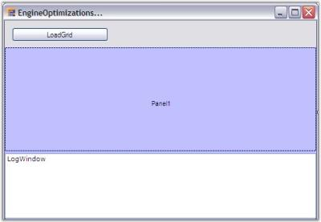
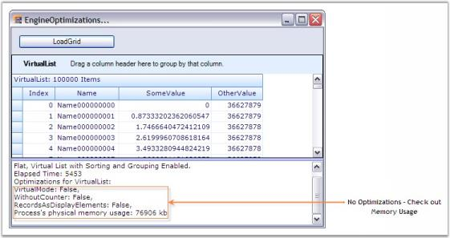
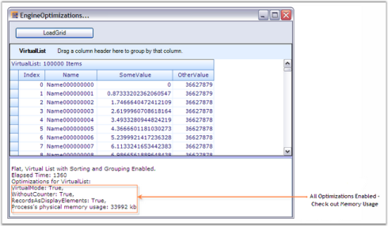
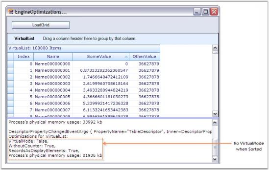
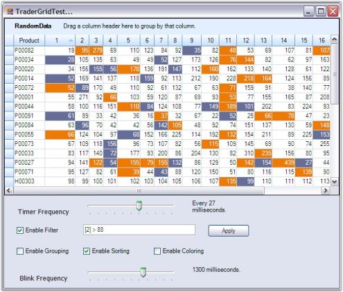

# Performance

Grid Grouping control has an extremelyhigh performance standard. It can handle very high frequency updates and refresh scenarios. It also offers complete support for Virtual Mode wherein data will be loaded only on demand. By simply setting few properties, you can have the grid work with large amounts of data without a performance hit.

All the properties that affects grid performance are wrapped into a category named Optimization. Here is an image of the property grid listing various optimization properties.

  

Optimization Properties - A Glance

Below is a brief overview on the optimization properties. We will discuss these properties further in detail with suitable examples in the forth coming chapters.

* AllowedOptimizations

Specifies the optimizations, the engine is allowed to use when applicable. These optimizations can be used in combination with EngineCounter setting. EngineOptimizations enum defines values for this property, which will be discussed in the next chapter.

* AllowOptimizeLoadTime

This property might help in reducing the flickering issue at startup. When enabled, the grid will be rendered once into an offline bitmap before the form is shown for the first time. This offline rendering of the grid ensures that all the required data is loaded into the memory and all grid data are initialized. Default value is true.

* BindToCurrencyManager

When you assign DataTable to the grid grouping control, it will get access to the Default View of that Data Table through Currency Manager that would listen to the updates to the underlying data table. The benefit of using CurrencyManager is that all the form elements would be kept synchronized. 

Using Currency Manager may cause performance issues in certain scenarios. In such cases, you can bypass Currency Manager and access the list directly without ever involving CurrencyManager by setting this property to false (which is true by default). This will in turn detach the grid from Currency Manager and hence the Grid Engine does not register the list with Windows Forms Currency Manager and it solely relies on listening to ListChanged events.

* CacheRecordValues

If you have custom collections, you can choose to have the engine to cache record values with this property. When set to true, the engine will cache copies of old values from a record in the record object. You can get these values with Record.GetOldValue method. With custom collections, the engine can also determine exactly which values in a record were changed when the engine receives the ListChanged event and previous values were cached.

* CounterLogic

It specifies the CounterLogic to be used within the engine. GroupingEngine maintains counters for VisibleColumns, FilteredRecords, YAmount, HiddenRecords, and the like. These counters occupy a countable portion of the grid tree in memory. On every list change, all these counters need to be refreshed along with the data records. 

Invalidating all the counters is not required at all times. For instance, if you have a larger data source and you do not want support for groups and filtered records, then there is no need to maintain counters such as FilteredRecords and the like. Keeping all the counters in memory will greatly increase memory consumption, which is not necessary in this case and there will degradation of grid performance.

To handle such scenarios, Grid Grouping control provides options to skip allocating these counters. By setting this property, you can reduce the memory footprint by selectively disabling the counters that are not required in your application. EngineCounters enum defines the values for this property, which will be discussed in the next chapter.

* InsertRemoveBehavior and InsertRemoveBehaviorWithEndEdit

These properties determine how the grid should react when a record is inserted or deleted. One or multiple records need to be shifted up and down. By default, the whole display is invalidated and all the rows are repainted though only one record needs to be redrawn. 

By setting properties to ListChangedInsertRemoveBehavior.ScrollWithImmediateUpdate, you can instruct the engine not to repaint the whole screen. The engine will now determine the area affected by this change and use ScrollWindow API to shift records up and down, and only repaint one record that was really changed. This will have a big impact if you have a larger grid and repainting the whole display is expensive.

* InvalidateAllWhenListChanged

It lets you specify whether the grid should simply call Invalidate when a ListChanged event is handled or if it should determine the area that is affected by the change and call InvalidateRange. 

At first, you might think its better to determine the area that is affected by a change and call InvalidateRange. But when calling InvalidateRange, the grid needs to know the exact position of the record in the table before it can mark that area dirty. In order to determine the record position (and y-position of the row in the display), counters need to be evaluated. This operation can cost more time than simply calling Invalidate in high-frequency update scenarios. The group caption bar also needs to be updated when a record changes.

InsertRemoveBehavior, SortPositionChangedBehavior properties and UpdateDisplayFrequency can speed up things when InvalidateAllWhenListChanged is set to false.

* RaiseSourceListChangedEventsOnEngineOnly

When the engine handles ListChanged event, it will itself raise numerous events. When this property is set to true, the events will only be raised on the Engine object. If set to false then events will also be raised on inner objects (will bubble up on nested tables, which causes some performance overhead). It will only have effect if UseOldListChangedHandler is set to false.

* SortPositionChangedBehavior and SortPositionChangedBehaviorWithEndEdit

These properties determine how to update display with a change in the sort position of a record. By default, the whole display is invalidated and all the rows are repainted though only one record needs to be redrawn. This will degrade performance and will not be efficient if you have a larger grid and repainting the whole display is expensive. 

By setting these properties to ListChangedInsertRemoveBehavior.ScrollWithImmediateUpdate, you can instruct the engine not to repaint the whole screen. This will only repaint the record that was really changed.

* UpdateDisplayFrequency

This property lets you specify the number of milliseconds to wait between display updates when new ListChanged event handler logic is used. This property does not have any effect if UseOldListChangedHandler = true. Special values are 0 - only manually update display by calling grid.Update() and 1 - update display immediately after each change.

* UseDefaultsForFasterDrawing

By setting this to true, you can quickly switch to faster GDI Draw Text, Solid Borders and more efficient calculation of the optimal width of a column. Initializes recommended settings to improve handling of ListChanged events and scrolling through grid. Affected settings are: TableOptions.ColumnsMaxLengthStrategy, TableOptions.GridLineBorder, TableOptions.DrawTextWithGdiInterop, TableOptions.VerticalPixelScroll, Appearance.AnyRecordFieldCell.WrapText and Appearance.AnyRecordFieldCell.Trimming.

* UseOldListChangedHandler

With version 4.4, the engine changed the way ListChanged event is handled internally to fix shortcomings with performance of the code that was in place earlier. This property lets you switch back the behavior of the engine to old mechanism if you notice compatibility issues. The default value is false.

* BlinkTime

Grid Grouping control has in-built support for highlighting cells for a short period of time after a change is detected to a cell. The BlinkTime property lets you specify the amount of time in milliseconds the values should be highlighted. You could also enable or disable this feature for individual columns by toggling GridColumnDescriptor.AllowBlink property.

## Memory Performance - Engine Optimizations

This section discusses the various optimizations that GroupingEngine provides. EngineOptimizations will greatly help improve MemoryPerformance. Triggering these optimizations selectively will help in reducing memory footprint. Engine optimizations can be enabled by setting AllowOptimizations to some value other than None. To optimize memory usage, CounterLogic property needs to be assigned with a proper value. 

AllowOptimizations

The following is the list of optimizations the grid offers that are defined by EngineOptimizations enumeration. By default they are turned off, but you can tell the engine which optimization should be applied when the specified criteria for the optimization is met.

* EngineOptimizations Enumeration

Specifies the values for AllowedOptimizations property.

* None

All optimizations are disabled.

* DisableCounters

When the engine detects that a table does not have RecordFilters, GroupedColumns, or nested relations, counter logic will be disabled for RecordsDetails collection since all counters are in sync with actual records (e.g. all records in data source are shown in TopLevelGroup). With this optimization, the engine will still have full support for sorting.

* VirtualMode

When all criteria are met for optimization and in addition to that no SortedColumns is set, RecordsDetails collection does not have to be initialized at all. Instead, it can create records elements on demand and discard them using regular garbage collection when no references to a Record exists any more (e.g. once you scroll them out of view). This approach reduces memory footprint to absolute minimum. You should be able to load and display millions of records in a table. The PrimaryKey collection is still supported, but it will be initialized only on demand if you do access Table.PrimaryKeyRecords collection. In such case all records will be enumerated.

* PassThroughSort

When all criteria are met for optimization and SortedColumns are set, the engine will normally have to loop through records and sort them. When you specify, the engine will check if the data source is an IBindingList and if IBindingList.SupportsSort returns true. In such cases, data source will be sorted by using IBindingList.Sort routine and the engine will access records by using VirtualMode. Using IBindingList is usually a bit faster than the engines own sorting routines, but the disadvantage is that you will loose CurrentRecord and SelectedRecords information. Inserting and removing records will also be slower (especially if the underlying data source is DataView).

PassThroughSort will be ignored if criteria are met for the optimization are not met. If you want to force a Pass-through sort mechanism in such a case, it can be done by implementing IGroupingList interface. This allows performing the sort on dataview directly instead of letting grouping engine perform the sorting. Normally, it is recommended to use the engine’s own Sort mechanism and only rely on PassThroughSort for Virtual mode scenarios.

* RecordsAsDisplayElements

When the engine detects that records do not have nested child tables, no record preview rows are being used, and each record has only one row (no ColumnSets are used), records do not have to be split into RecordParts. Instead when querying DisplayElements collection for a specific row, the engine can simply return Record element instead of RecordRow element. The same applies to CaptionSection, ColumnHeaderSection and FilterBarSection. Instead of returning CaptionRow, ColumnHeaderRow, or FilterBarRow element, DisplayElements collection returns section element. If you use this optimization, you need to be careful and be aware that when you query DisplayElements collection instead of RecordRow element, Record element can be returned. So also with ColumnHeader, FilterBase, and Caption.

* All

Enables the optimizations - DisableCounters, VirtualMode, and RecordsAsDisplayElements.

Based on the schema that you specify, the engine will determine if certain optimizations can be applied. If you have a flat table and do not sort records, VirtualMode will be applied and records do not have to be touched at all (only when drawing). If you sort records, then TreeTables will be built so that the grid can sort records, but the logic for filtering and grouping is turned off (DisableCounters optimization). In case of pass-through sorting, the table is sorted by using DataView.Sort routine and records will be accessed with VirtualMode. If you group records or if you have nested tables then full grouping logic will be needed.

* CounterLogic

In addition to being able to specify VirtualMode or WithoutCounter mode, you can also specify the counters you need. Most of the times you only want to count visible elements and filtered records and you can leave out custom counters, hidden element counter, etc. That can save you a few bytes per record (40-80 bytes). The engine will also determine whether records actually need to be broken into pieces or if a record can be returned as leave elements (RecordsAsDisplayElements option). This again saves a few bytes per record.

  * EngineCounters Enumeration

Specifies the values for CounterLogic.

  * All

All counters are supported: visible elements, filtered records, YAmount, hidden elements, hidden records, CustomCount and VisibleCustomCount. Highest memory footprint.

  * FilteredRecords

   			Counts only visible elements and filtered records. Smallest memory footprint.

  * YAmount

 	Counts visible elements, filtered records and YAmount. Medium memory 

footprint.

N>: Allowing certain optimizations does not mean that the optimization is necessarily used. Optimizations will only be used when applicable. Take for example the optimization. If you allow this optimization, the engine will check schema settings when loading the table. If there are no SortedColumns, RecordFilters, GroupedColumns, or nested relations for a table, then virtual mode can be used and no records need to be loaded into memory. If the user later sorts by one column, the virtual mode cannot be used any more. Records will need to be iterated through and sorted and tree structures will be built that allow quick access to records and IndexOf operations. When initializing table, the engine will check if criteria for DisableCounters optimization are met.

Example

This example illustrates Virtual Mode and WithoutCounter optimizations having VirtualList as data source. The VirtualList is just a CustomCollection that implements IList and ITypedList interfaces. The list is populated with 100K items and the same is bound to the grid grouping control. The example also displays Log Window where you could track the different optimizations applied at different instances. It also displays the time elapsed for populating the grid grouping control. 

All the optimizations are enabled by setting AllowedOptimizations to All. As said earlier, optimizations specified will not be applied at all times. They will only be used when applicable, that is, when the criteria for those optimizations are met. This example best illustrates this process. On every property change, the log window displays the list of optimizations applied to the grid at that instance. When you run the sample, you can track optimizations applied in different engine states like with or without grouping, with or without sorting, etc.

N>: For more details, refer to the following Browser Sample:

_&lt;Install Location&gt;\Syncfusion\EssentialStudio\[Version Number]\Windows\Grid.Grouping.Windows\Samples\Performance\Engine Optimization Demo_

Implementation

Follow the steps below to experiment different engine optimizations.

1. Create a class (VirtualItem) that represents the record structure. Its data members form the record fields.

 

public class VirtualItem

{

int index;

string name;

double someValue;

double otherValue;

public int Index

{

get

{

return index;

}

set

{

index = value;

}

}

public string Name

{

get

{

return name;

}

set

{

name = value;

}

}

public double SomeValue

{

get

{

return someValue;

}

set

{

someValue = value;

}

}

public double OtherValue

{

get

{

return otherValue;

}

set

{

otherValue = value;

}

}

}

 

  

Public Class VirtualItem

Private index_Renamed As Integer

Private name_Renamed As String

Private someValue_Renamed As Double

Private otherValue_Renamed As Double

Public Property Index() As Integer

Get

Return index_Renamed

End Get

Set

index_Renamed = Value

End Set

End Property

Public Property Name() As String

Get

Return name_Renamed

End Get

Set

name_Renamed = Value

End Set

End Property

Public Property SomeValue() As Double

Get

Return someValue_Renamed

End Get

Set

someValue_Renamed = Value

End Set

End Property

Public Property OtherValue() As Double

Get

Return otherValue_Renamed

End Get

Set

otherValue_Renamed = Value

End Set

End Property

End Class

 

2.Create another class(VirtualList) by implementing IList and ITypedList interfaces. This class represents your collection that serves as data source for grid grouping control. Refer to CustomCollections to know how to implement these interfaces.

  

public class VirtualList : IList, ITypedList

{

int virtualCount;

public VirtualList(int count)

{

virtualCount = count;

}

//IList Members.

public bool IsReadOnly

{

get

{

return true;

}

}

public object this[int index]

{

get

{

VirtualItem item = new VirtualItem();

item.Index = index;

item.Name = "Name" + index.ToString("000000000");

item.SomeValue = index*0.873332f;

item.OtherValue = (293023033-index)/8;

return item;

}

set{}

}

//Other IList members.

............

............

//ICollection Members.

............

............

//IEnumerator Members.

............

............

// ITypedList Members.

public PropertyDescriptorCollection GetItemProperties(PropertyDescriptor[] listAccessors)

{

PropertyDescriptorCollection pds = TypeDescriptor.GetProperties(typeof(VirtualItem));

string[] atts = new string[]{"Index", "Name", "SomeValue", "OtherValue"};

return pds.Sort(atts);

}

public string GetListName(PropertyDescriptor[] listAccessors)

{

return "VirtualList";

}

}



  

Public Class VirtualList : Implements IList, ITypedList

Private virtualCount As Integer

Public Sub New(ByVal count_Renamed As Integer)

virtualCount = count_Renamed

End Sub

'IList Members.

Public ReadOnly Property IsReadOnly() As Boolean Implements IList.IsReadOnly

Get

Return True

End Get

End Property

Public Default Property Item(ByVal index As Integer) As Object

Get

Dim item As VirtualItem = New VirtualItem()

item.Index = index

item.Name = "Name" & index.ToString("000000000")

item.SomeValue = index*0.873332f

item.OtherValue = (293023033-index)/8

Return item

End Get

Set

End Set

End Property

'Other IList Members.

............

............

'ICollection Members.

............

............

'IEnumerable Members.

............

............

'ITypedList Members.

Public Function GetItemProperties(ByVal listAccessors As PropertyDescriptor()) As PropertyDescriptorCollection Implements ITypedList.GetItemProperties

Dim pds As PropertyDescriptorCollection = TypeDescriptor.GetProperties(GetType(VirtualItem))

Dim atts As String() = New String() {"Index", "Name", "SomeValue", "OtherValue"}

Return pds.Sort(atts)

End Function

Public Function GetListName(ByVal listAccessors As PropertyDescriptor()) As String Implements ITypedList.GetListName

Return "VirtualList"

End Function

End Class

 

3.Add a button and listbox to the main form. Clicking the button will create a grid grouping control and load it with Virtual List. ListBox serves as Log Window wherein you will display the log messages like time elapsed for loading the grid, list of optimizations applied, and so on. Your form will look like the one below at design time.

  

4.Set up a new engine and specify the optimizations settings required.

  

GridEngine schema = new GridEngine();

schema.InvalidateAllWhenListChanged = false;

schema.AllowedOptimizations = EngineOptimizations.All;

schema.CounterLogic = EngineCounters.YAmount;

//Also dependant on CounterLogic = EngineCounters.YAmount.

schema.TableOptions.VerticalPixelScroll = true;

schema.TableOptions.ColumnsMaxLengthStrategy = GridColumnsMaxLengthStrategy.FirstNRecords;

schema.TableOptions.ColumnsMaxLengthFirstNRecords = 100;

schema.TableOptions.AllowSortColumns = true;

schema.TableDescriptor.AllowEdit = false;

schema.DataSource = new VirtualList(100000);

schema.Reset();

schema.TableDescriptor.Columns["Index"].MaxLength = 10;



  

Dim schema As GridEngine = New GridEngine()

schema.InvalidateAllWhenListChanged = False

schema.AllowedOptimizations = EngineOptimizations.All

schema.CounterLogic = EngineCounters.YAmount

'Also dependant on CounterLogic = EngineCounters.YAmount.

schema.TableOptions.VerticalPixelScroll = True   

schema.TableOptions.ColumnsMaxLengthStrategy = GridColumnsMaxLengthStrategy.FirstNRecords

schema.TableOptions.ColumnsMaxLengthFirstNRecords = 100

schema.TableOptions.AllowSortColumns = True

schema.TableDescriptor.AllowEdit = False

schema.DataSource = New VirtualList(100000)

schema.Reset()

schema.TableDescriptor.Columns["Index"].MaxLength = 10

 

5.Define a method LogMemoryUsage that calculates the amount of memory consumed and displays various optimizations applied to the grouping engine.

  

void LogMemoryUsage()

{

//Forces garbage collection and gets used memory size.

    GC.Collect();

    System.Threading.Thread.Sleep(10);

    GC.Collect();

    System.Threading.Thread.Sleep(100);

    GC.Collect();

    LogWindow.Items.Add(string.Format("Optimizations for {0}: ", this.gridGroupingControl1.TableDescriptor.Name));

    LogWindow.Items.Add(string.Format("VirtualMode: {0}, ", this.gridGroupingControl1.Table.VirtualMode));

    LogWindow.Items.Add(string.Format("WithoutCounter: {0}, ", this.gridGroupingControl1.Table.WithoutCounter));

    LogWindow.Items.Add(string.Format("RecordsAsDisplayElements: {0}, ", gridGroupingControl1.Table.RecordsAsDisplayElements));

    Process myProcess = Process.GetCurrentProcess();

    double workingSetSizeinKiloBytes = myProcess.WorkingSet64 / 1000;

    string s = "Process's physical memory usage: " + workingSetSizeinKiloBytes.ToString() + " kb";

    LogWindow.Items.Add(s);

    LogWindow.Items.Add("");

}



  

Private Sub LogMemoryUsage()

'Forces garbage collection and gets used memory size.

GC.Collect()

System.Threading.Thread.Sleep(10)

GC.Collect()

System.Threading.Thread.Sleep(100)

GC.Collect()

LogWindow.Items.Add(String.Format("Optimizations for {0}: ", Me.gridGroupingControl1.TableDescriptor.Name))

LogWindow.Items.Add(String.Format("VirtualMode: {0}, ", Me.gridGroupingControl1.Table.VirtualMode))

LogWindow.Items.Add(String.Format("WithoutCounter: {0}, ", Me.gridGroupingControl1.Table.WithoutCounter))

LogWindow.Items.Add(String.Format("RecordsAsDisplayElements: {0}, ", gridGroupingControl1.Table.RecordsAsDisplayElements))

Dim myProcess As Process = Process.GetCurrentProcess()

Dim workingSetSizeinKiloBytes As Double = myProcess.WorkingSet64 / 1000

Dim s As String = "Process's physical memory usage: " & workingSetSizeinKiloBytes.ToString() & " kb"

LogWindow.Items.Add(s)

LogWindow.Items.Add("")

End Sub



Handle the ButtonClick event in order to populate the grid when the button is clicked. It also calls LogMemoryUsage method to display initial optimization settings for the grid - the optimizations for an ungrouped and unsorted grid.

 

this.button1.Click += new System.EventHandler(this.button1_Click);

private void button1_Click(object sender, EventArgs e)

{

    this.LogWindow.Items.Add("");

    this.LogWindow.Items.Add("Flat, Virtual List with Sorting and Grouping Enabled.");

    int time = Environment.TickCount;

    Cursor.Current = Cursors.WaitCursor;

//Loads a Grid Grouping control with a new engine.

    gridGroupingControl1 = new GridGroupingControl();

    gridGroupingControl1.BackColor = System.Drawing.SystemColors.Window;

    gridGroupingControl1.Dock = System.Windows.Forms.DockStyle.Fill;

    gridGroupingControl1.Name = "gridGroupingControl1";

    gridGroupingControl1.TabIndex = 0;

    gridGroupingControl1.VersionInfo = "3.2.0.0";

    gridGroupingControl1.IntelliMousePanning = true;

    this.splitContainer1.Panel1.Controls.Add(this.gridGroupingControl1);

    gridGroupingControl1.Engine = schema;

    gridGroupingControl1.DataSource = new TestEngineOptimizations.VirtualList(100000);

    gridGroupingControl1.ShowGroupDropArea = true;

    this.Refresh();

    Cursor.Current = Cursors.Arrow;

    this.LogWindow.Items.Add(string.Format("Elapsed Time: {0}", Environment.TickCount - time));

    gridGroupingControl1.Appearance.AnyCell.Font.Facename = "Verdana";

    gridGroupingControl1.Appearance.AnyCell.TextColor = Color.MidnightBlue;

    gridGroupingControl1.TableOptions.GridVisualStyles = Syncfusion.Windows.Forms.GridVisualStyles.Office2007Blue;

    gridGroupingControl1.TableOptions.GridLineBorder = new GridBorder(GridBorderStyle.Solid, Color.FromArgb(227, 239, 255), GridBorderWeight.Thin);

//Initial Log Display.

    LogMemoryUsage();

}

 

  

Private Sub button1_Click(ByVal sender As Object, ByVal e As EventArgs) Handles button1.Click

Me.LogWindow.Items.Add("")

Me.LogWindow.Items.Add("Flat, Virtual List with Sorting and Grouping Enabled.")

Dim time As Integer = Environment.TickCount

Windows.Forms.Cursor.Current = Cursors.WaitCursor

'Loads a Grid Grouping control with a new engine.

gridGroupingControl1 = New GridGroupingControl()

gridGroupingControl1.BackColor = System.Drawing.SystemColors.Window

gridGroupingControl1.Dock = System.Windows.Forms.DockStyle.Fill

gridGroupingControl1.Name = "gridGroupingControl1"

gridGroupingControl1.TabIndex = 0

gridGroupingControl1.VersionInfo = "3.2.0.0"

gridGroupingControl1.IntelliMousePanning = True

Me.splitContainer1.Panel1.Controls.Add(Me.gridGroupingControl1)

gridGroupingControl1.Engine = schema

gridGroupingControl1.DataSource = New TestEngineOptimizations.VirtualList(100000)

gridGroupingControl1.ShowGroupDropArea = True

Me.Refresh()

Cursor.Current = Cursors.Arrow

Me.LogWindow.Items.Add(String.Format("Elapsed Time: {0}", Environment.TickCount - time))

gridGroupingControl1.Appearance.AnyCell.Font.Facename = "Verdana"

gridGroupingControl1.Appearance.AnyCell.TextColor = Color.MidnightBlue

gridGroupingControl1.TableOptions.GridVisualStyles = GridVisualStyles.Office2007Blue

gridGroupingControl1.TableOptions.GridLineBorder = New GridBorder(GridBorderStyle.Solid, Color.FromArgb(227, 239, 255), GridBorderWeight.Thin)

'Initial Log Display.

LogMemoryUsage()

End Sub



Handle PropertyChanging event to display log for every property that is being changed in the grid. This will be raised when you group or sort the grid grouping control and hence you could track the results of these operations (especially the current optimizations) here.

 

gridGroupingControl1.PropertyChanging += new DescriptorPropertyChangedEventHandler(gridGroupingControl1_PropertyChanging);

Timer t = null;

void gridGroupingControl1_PropertyChanging(object sender, DescriptorPropertyChangedEventArgs e)

{

    LogWindow.Items.Add(e.ToString());

    if (t != null)

    {

        t.Tick -= new EventHandler(t_Tick);

        t.Dispose();

    }

    t = new Timer();

    t.Interval = 100;

    t.Tick += new EventHandler(t_Tick);

    t.Start();

}

private void t_Tick(object sender, EventArgs e)

{

    Timer t = (Timer)sender;

    t.Tick -= new EventHandler(t_Tick);

    t.Dispose();

    this.LogMemoryUsage();

}

 

  

AddHandler gridGroupingControl1.PropertyChanging, AddressOf gridGroupingControl1_PropertyChanging

Private t As Timer = Nothing

Private Sub gridGroupingControl1_PropertyChanging(ByVal sender As Object, ByVal e As DescriptorPropertyChangedEventArgs)

LogWindow.Items.Add(e.ToString())

If Not t Is Nothing Then

RemoveHandler t.Tick, AddressOf t_Tick

t.Dispose()

End If

t = New Timer()

t.Interval = 100

AddHandler t.Tick, AddressOf t_Tick

t.Start()

End Sub

Private Sub t_Tick(ByVal sender As Object, ByVal e As EventArgs)

Dim t As Timer = CType(sender, Timer)

RemoveHandler t.Tick, AddressOf t_Tick

t.Dispose()

Me.LogMemoryUsage()

End Sub



Here are the screen shots that show the optimizations applied at different engine states.

  

  

  

  

_(Both Virtual Mode and WithoutCounter optimizations disabled)_

## ListChanged Performance

When ListChange is detected, the grouping engine has to update the grid records accordingly. Every record change may affect its sort position, group dependency, and summaries. The engine should take care of all these things and should also invalidate counters that are being affected with respect to ListChange. The easiest way to accomplish this would be invalidating the whole display and repainting all the rows. But this will have a big impact on grid performance in worst cases. For example, in case only one record is really changed and this change does not affect sort order and summaries, it requires to repaint only one record. Instead the engine will repaint the whole display.

GridEngine provides options to handle this type of scenarios and by using those it will track the expression fields and summary columns that depend on changes to a field, fields affecting group dependency or sort position. Based on these findings, it will choose the most efficient way to update the engine's internal object to keep up with the ListChanged events.

Example

The example features this optimization that handles the case when changes to the record only affect single cells in the grid. The sample updates two columns (and summaries) in one thousand records in a timer event every 50 milliseconds while at the same time keeping CPU usage low. In this sample, the engine detects that changes to the Freight or Employee field do not have any impact on counters in the engines object. It checks if the record is visible in the current view and if that is the case saves the record and field information for painting. The painting of the cell is delayed until gridGroupingControl.Update is called or until the time specified with GridGroupingControl.UpdateDisplayFrequency elapsed.

In that sample example you can also check out throttling the display updates. The UpateDisplayFrequency is initially set to 0, which means that the timer_tick method in form calls grid.Update to force pending updates. You can also specify any amount of milliseconds in the Property Grid for this property and watch the grid react slower or faster to changes and update the display while the ListChanged events still come in at the same pace.

If you click on the Freight column to sort records by values of this field then the strategy the Grid Grouping control updates the internal structure and the display has to change. Now, every change to the Freight column can possibly affect the sort position of a record. The moment you click on the column header and sort by that field the engine will have this field singled out for more detailed inspection when a ListChanged event is received. 

If change is detected to the Freight field in DataRow, the engine will then check the new value against the value of the previous record and next record. If the value is greater or equal to the previous record’s value and smaller or equal to the next records value, no further action is required other than repainting the cell. But if the new value does not fit in between these records, the sort position of the records needs to be recalculated. The binary tree structures within the engine allow quick removal and reinsertion of the record at the correct sort position and the engine will raise SourceListRecordChanging and SourceListRecordChanged events that indicate that the records sort position is about to change and has changed. 

Updating display with changes in sort position of a record is much more demanding than simply repainting a cell. One or multiple records need to be shifted up or down. The easiest way is to invalidate the whole display and repaint all rows. This is how Grid Grouping control handles this case by default. You can change this default behavior by specifying how the grid should update the display with InsertRemoveBehavior and SortPositionChangeBehavior properties. By setting these properties to ListChangedInsertRemoveBehavior.ScrollWithImmediateUpdate you can instruct the engine not to repaint the whole screen. Instead the engine will now determine the area affected by a sort position change and use ScrollWindow API to shift records up and down and only repaint the one record that was really changed. This can have big impact if you have a large grid and repainting the whole display is expensive. This can increase the speed by the number of rows that are visible. Only one row needs to be repainted instead of repainting all rows.

The example also shows more optimized calculation of summaries. By default the engine uses binary trees and caches values in them. When changes to a field are detected that affects a summary, then the nodes in the binary tree are marked dirty. This is a 2xO(log n) operation that is needed to mark nodes dirty and later again recalculate the summaries. The ManualTotalSummary sample demonstrates this by using a different approach. If you do not care about more complicated summaries such as minimum, maximum, distinct count, or median and if you know the delta of each value change, then you can keep total value cached in the parent group and manually apply that delta to this parent groups summary value. Now you have a linear O(1) operation instead of the more costly binary tree updates. With that change, the sample can now deal nicely with 1000 updates in 100 ms and 2 summary columns being changed with each update. 

GridListChangedInsertRemoveBehavior Enum

Defines the values for the properties InsertRemoveBehavior and SortPositionChangedBehavior.

InvalidateVisible 

It will keep engine in synchronization with ListChanged notifications and then invalidate rows on screen, below affected row.

InvalidateAll 

It will simply set TableDirty = true and the engine will not try to keep anything in synchronization at that time.

ScrollWithImmediateUpdate

It will keep engine in synchronization and use ScrollWindow to scroll window contents or adjust top row index if changes occurred before current visible row.

N>: For Complete Code for this example, refer the following Browser sample: 

_&lt;Install Location&gt;\Syncfusion\EssentialStudio\[Version Number]\Windows\Grid.Grouping.Windows\Samples\Performance\Manual Total Summary Demo_

Implementation

* The implementation uses custom summary class named ManualTotalSummary. This is a manual summary class, which can be updated immediately using the difference between old and new value in ListChanged event. The Total property calculates summaries for groups and table manually by looping through each group and record, and summing up the values of changed field. It provides faster updates on summaries by applying a delta between the old and new value when a record is changed.

 

public class ManualTotalSummary 

{

    double total;

    bool dirty = true;

    Group group;

    int fieldIndex = -1;

    public ManualTotalSummary(Group g, string field)

    : this(g, g.ParentTableDescriptor.Fields[field])

    {

    }

    public ManualTotalSummary(Group g, FieldDescriptor field)

    {

        this.Field = field;

        this.Group = g;

    }

    ............

    ............

    public double Total

    {

        get

        {

            if (dirty)

            {

                CalculateTotal();

                this.dirty = false;

        }

        return this.total;

        }

        set

        {

            this.total = value;

        }

    }

    void CalculateTotal()

    {

        total = 0;

        if (group.Details is RecordsDetails)

        {

            foreach (Record r in group.Records)

            {

                object obj = r.GetValue(field);

                if (obj != null && !(obj is DBNull))

                {

                    double d = Convert.ToDouble(obj);

                    total += d;

                }

            }

        }

        else

        {

            foreach (Group g in group.Groups)

            {

                IManualTotalSummaryArraySource tsa = g as IManualTotalSummaryArraySource;

                ManualTotalSummary mt = tsa.GetManualTotalSummaryArray()[this.FieldIndex];

                if (mt == null)

                mt = new ManualTotalSummary(g, field);

                double d = mt.Total;

                total += d;

            }

        }

    }

    public void ApplyDelta(Element r, bool isObsoleteRecord, bool isAddedRecord, ChangedFieldInfo ci)

    {

        if (Dirty)

        return;

        ManualTotalSummary mt = this;

        if (isObsoleteRecord)

        {

            if (ci.OldValue != null && !(ci.OldValue is DBNull))

            mt.Total -= Convert.ToDouble(ci.OldValue);

        }

        else if (isAddedRecord)

        {

            if (ci.NewValue != null && !(ci.NewValue is DBNull))

            mt.Total += Convert.ToDouble(ci.NewValue);

        }

        else

        mt.Total += ci.Delta;

    }

}

 

 

Public Class ManualTotalSummary

Private total_Renamed As Double

Private dirty_Renamed As Boolean = True

Private group_Renamed As Group

Private fieldIndex_Renamed As Integer = -1

Public Sub New(ByVal g As Group, ByVal field_Renamed As String)

Me.New(g, g.ParentTableDescriptor.Fields(field_Renamed))

End Sub

Public Sub New(ByVal g As Group, ByVal field_Renamed As FieldDescriptor)

Me.Field = field_Renamed

Me.Group = g

End Sub

...........

...........

Public Property Total() As Double

Get

If dirty_Renamed Then

CalculateTotal()

Me.dirty_Renamed = False

End If

Return Me.total_Renamed

End Get

Set

Me.total_Renamed = Value

End Set

End Property

Private Sub CalculateTotal()

total_Renamed = 0

If TypeOf group_Renamed.Details Is RecordsDetails Then

For Each r As Record In group_Renamed.Records

Dim obj As Object = r.GetValue(field_Renamed)

If Not obj Is Nothing AndAlso Not(TypeOf obj Is DBNull) Then

Dim d As Double = Convert.ToDouble(obj)

total_Renamed += d

End If

Next r

Else

For Each g As Group In group_Renamed.Groups

Dim tsa As IManualTotalSummaryArraySource = CType(IIf(TypeOf g Is IManualTotalSummaryArraySource, g, Nothing), IManualTotalSummaryArraySource)

Dim mt As ManualTotalSummary = tsa.GetManualTotalSummaryArray()(Me.FieldIndex)

If mt Is Nothing Then

mt = New ManualTotalSummary(g, field_Renamed)

End If

Dim d As Double = mt.Total

total_Renamed += d

Next g

End If

End Sub

Public Sub ApplyDelta(ByVal r As Element, ByVal isObsoleteRecord As Boolean, ByVal isAddedRecord As Boolean, ByVal ci As ChangedFieldInfo)

If Dirty Then

Return

End If

Dim mt As ManualTotalSummary = Me

If isObsoleteRecord Then

If Not ci.OldValue Is Nothing AndAlso Not(TypeOf ci.OldValue Is DBNull) Then

mt.Total -= Convert.ToDouble(ci.OldValue)

End If

Else If isAddedRecord Then

If Not ci.NewValue Is Nothing AndAlso Not(TypeOf ci.NewValue Is DBNull) Then

mt.Total += Convert.ToDouble(ci.NewValue)

End If

Else

mt.Total += ci.Delta

End If

End Sub

End Class

 

* ManualTotalSummary class makes use of ManualTotalSummaryTable class, which derives GridTable to calculate the new total. ManualTotalSummaryTable class overrides OnRecordChanged event in order to track record changes and keeps track of old and new values of the ChangedField. For each entry in ManualTotalSummaryTable.TotalSummaries, a ManualTotalSummary will be created. 

  

public class ManualTotalSummaryTable : GridTable

{

    public ManualTotalSummaryTable(TableDescriptor tableDescriptor, Table parentRelationTable)

    : base((GridTableDescriptor)tableDescriptor, (GridTable)parentRelationTable)

    {

    }

    ArrayList totalSummaries = new ArrayList();

    public ArrayList TotalSummaries

    {

        get

        {

            return this.totalSummaries;

        }

        set

        {

            this.totalSummaries = value;

        }

    }

    ..............

    ..............

    protected override void OnRecordChanged(Element r, bool isObsoleteRecord, bool isAddedRecord)

    {

        TableDescriptor td = TableDescriptor;

        Group g = r.ParentGroup;

        while (g is IManualTotalSummaryArraySource)

        {

            OnGroupSummaryInvalidated(new GroupEventArgs(g));

            IManualTotalSummaryArraySource tsa = g as IManualTotalSummaryArraySource;

            foreach (ChangedFieldInfo ci in this.ChangedFieldsArray)

            {

                ManualTotalSummary mt = tsa.GetManualTotalSummaryArray()[ci.FieldIndex];

                if (mt != null)

                mt.ApplyDelta(r, isObsoleteRecord, isAddedRecord, ci);

            }

            g = g.ParentGroup;

        }

    } 

}



  

Public Class ManualTotalSummaryTable : Inherits GridTable

Public Sub New(ByVal tableDescriptor As TableDescriptor, ByVal parentRelationTable As Table)

MyBase.New(CType(tableDescriptor, GridTableDescriptor), CType(parentRelationTable, GridTable))

End Sub

Private totalSummaries_Renamed As ArrayList = New ArrayList()

Public Property TotalSummaries() As ArrayList

Get

Return Me.totalSummaries_Renamed

End Get

Set

Me.totalSummaries_Renamed = Value

End Set

End Property

..............

..............

Protected Overrides Sub OnRecordChanged(ByVal r As Element, ByVal isObsoleteRecord As Boolean, ByVal isAddedRecord As Boolean)

Dim td As TableDescriptor = TableDescriptor

Dim g As Group = r.ParentGroup

Do While TypeOf g Is IManualTotalSummaryArraySource

OnGroupSummaryInvalidated(New GroupEventArgs(g))

Dim tsa As IManualTotalSummaryArraySource = CType(IIf(TypeOf g Is IManualTotalSummaryArraySource, g, Nothing), IManualTotalSummaryArraySource)

For Each ci As ChangedFieldInfo In Me.ChangedFieldsArray

Dim mt As ManualTotalSummary = tsa.GetManualTotalSummaryArray()(ci.FieldIndex)

If Not mt Is Nothing Then

mt.ApplyDelta(r, isObsoleteRecord, isAddedRecord, ci)

End If

Next ci

g = g.ParentGroup

Loop

End Sub

End Class



* A Grid Grouping control is setup with options to display the summary cells in caption and enable the optimizations required. Use InvalidateAll option for InsertRemoveBehavior and SortPositionChangedBehavior properties when many records change sort position for a short time. Use ScrollWithImmediateUpdate if ScrollWindow should be called to minimize painting when sort position of limited number of records is changed. Grid Grouping control will be detached from Currency Manager, and then access the list directly to solely rely on ListChanged events.

  

//Optimization code.

//0 if Manual updates only from timer_tick.

this.gridGroupingControl1.UpdateDisplayFrequency = 0;

this.gridGroupingControl1.UseDefaultsForFasterDrawing = true;

this.gridGroupingControl1.CounterLogic = EngineCounters.YAmount;

this.gridGroupingControl1.AllowedOptimizations = EngineOptimizations.DisableCounters | EngineOptimizations.RecordsAsDisplayElements;

this.gridGroupingControl1.CacheRecordValues = false;

this.gridGroupingControl1.InsertRemoveBehavior = GridListChangedInsertRemoveBehavior.ScrollWithImmediateUpdate;

this.gridGroupingControl1.SortPositionChangedBehavior = GridListChangedInsertRemoveBehavior.ScrollWithImmediateUpdate;

this.gridGroupingControl1.BindToCurrencyManager = false;

//Enables Caption Summaries.

gridGroupingControl1.TableDescriptor.ChildGroupOptions.ShowCaptionSummaryCells = true;

gridGroupingControl1.TableDescriptor.ChildGroupOptions.ShowSummaries = true;

gridGroupingControl1.TableDescriptor.ChildGroupOptions.CaptionSummaryRow = "Caption";



  

'Optimization code.

'0 if Manual updates only from timer_tick.

Me.gridGroupingControl1.UpdateDisplayFrequency = 0

Me.gridGroupingControl1.UseDefaultsForFasterDrawing = True

Me.gridGroupingControl1.CounterLogic = EngineCounters.YAmount

Me.gridGroupingControl1.AllowedOptimizations = EngineOptimizations.DisableCounters Or EngineOptimizations.RecordsAsDisplayElements

Me.gridGroupingControl1.CacheRecordValues = False

Me.gridGroupingControl1.InsertRemoveBehavior = GridListChangedInsertRemoveBehavior.ScrollWithImmediateUpdate

Me.gridGroupingControl1.SortPositionChangedBehavior = GridListChangedInsertRemoveBehavior.ScrollWithImmediateUpdate

Me.gridGroupingControl1.BindToCurrencyManager = False

'Enables Caption Summaries.

gridGroupingControl1.TableDescriptor.ChildGroupOptions.ShowCaptionSummaryCells = True

gridGroupingControl1.TableDescriptor.ChildGroupOptions.ShowSummaries = True

gridGroupingControl1.TableDescriptor.ChildGroupOptions.CaptionSummaryRow = "Caption"



* Setup ManualTotalSummary for the columns Freight and EmployeeID. The ManualTotalSummary.Total value will be retrieved and displayed in summary or caption cell in QueryCellStyleInfo event handler. It tracks the changes in sort positions of columns Freight and EmployeeID by handling PropertyChanged event.

 

ManualTotalSummaryTable tb = (ManualTotalSummaryTable)this.gridGroupingControl1.Table;

tb.TotalSummaries.Add("Freight");

tb.TotalSummaries.Add("EmployeeID");

tb.TableDirty = true;

this.gridGroupingControl1.QueryCellStyleInfo += new GridTableCellStyleInfoEventHandler(gridGroupingControl1_QueryCellStyleInfo);

private void gridGroupingControl1_QueryCellStyleInfo(object sender, GridTableCellStyleInfoEventArgs e)

{

    Element el = e.TableCellIdentity.DisplayElement;

    ManualTotalSummaryTable table = el.ParentTable as ManualTotalSummaryTable;

    if (table == null)

    return;

    if (Element.IsCaption(el))

    {

        if (e.Style.TableCellIdentity.ColIndex > 3)

        {

//You need to provide manually, the code to look up the summaries you want to display here.

//e.TableCellIdentity.Column and e.TableCellIdentity.SummaryColumn will be null.

//You can get the column as follows.

            GridColumnDescriptor column = gridGroupingControl1.TableModel.GetHeaderColumnDescriptorAt(e.TableCellIdentity.ColIndex);

            if (column != null && table.TotalSummaries.IndexOf(column.MappingName) != -1)

            {

                int index = column.TableDescriptor.Fields.IndexOf(column.FieldDescriptor);

                IManualTotalSummaryArraySource tsa = (el is Group ? el : el.ParentGroup) as IManualTotalSummaryArraySource;

                ManualTotalSummary tm = tsa.GetManualTotalSummaryArray()[index];

                e.Style.CellValue = tm.Total;

                e.Style.CellValueType = typeof(double);

                e.Style.Format = "0.00";

            }

//By using that column you could try and identify the summary that should be displayed in this cell.

            }

        }

        else if (el is GridSummaryRow)

        {

//You can get the column as follows.

            GridColumnDescriptor column = this.gridGroupingControl1.TableModel.GetHeaderColumnDescriptorAt(e.TableCellIdentity.ColIndex);

            if (column != null && table.TotalSummaries.IndexOf(column.MappingName) != -1)

            {

                int index = column.TableDescriptor.Fields.IndexOf(column.FieldDescriptor);

                IManualTotalSummaryArraySource tsa = (el is Group ? el : el.ParentGroup) as IManualTotalSummaryArraySource;

                ManualTotalSummary tm = tsa.GetManualTotalSummaryArray()[index];

                e.Style.CellValue = tm.Total;

                e.Style.CellValueType = typeof(double);

                e.Style.Format = "0.00";

        }

//By using that column you could try and identify the summary that should be displayed in this cell.

    }

}

 

 

Dim tb As ManualTotalSummaryTable = DirectCast(Me.gridGroupingControl1.Table, ManualTotalSummaryTable)

tb.TotalSummaries.Add("Freight")

tb.TotalSummaries.Add("EmployeeID")

tb.TableDirty = True

AddHandler Me.gridGroupingControl1.QueryCellStyleInfo, AddressOf gridGroupingControl1_QueryCellStyleInfo

Private Sub gridGroupingControl1_QueryCellStyleInfo(ByVal sender As Object, ByVal e As GridTableCellStyleInfoEventArgs)

    Dim el As Element = e.TableCellIdentity.DisplayElement

    Dim table As ManualTotalSummaryTable = TryCast(el.ParentTable, ManualTotalSummaryTable)

    If table Is Nothing Then

        Return

    End If

    If Element.IsCaption(el) Then

        If e.Style.TableCellIdentity.ColIndex > 3 Then

'You need to provide manually, the code to look up the summaries you want to display here.

'e.TableCellIdentity.Column and e.TableCellIdentity.SummaryColumn will be null.

'You can get the column as follows.

            Dim column As GridColumnDescriptor =                                      

            gridGroupingControl1.TableModel.GetHeaderColumnDescriptorAt(e.TableCellIdentity.ColIndex)

            If column IsNot Nothing AndAlso table.TotalSummaries.IndexOf(column.MappingName) &lt;&gt; -1 Then

                Dim index As Integer = column.TableDescriptor.Fields.IndexOf(column.FieldDescriptor)

                Dim tsa As IManualTotalSummaryArraySource = TryCast((IIf(TypeOf el Is Group, el, el.ParentGroup)),                                        IManualTotalSummaryArraySource)

                Dim tm As ManualTotalSummary = tsa.GetManualTotalSummaryArray()(index)

                e.Style.CellValue = tm.Total

                e.Style.CellValueType = GetType(Double)

                e.Style.Format = "0.00"

'By using that column you could try and identify the summary that should be displayed in this cell.

            End If

        End If

    ElseIf TypeOf el Is GridSummaryRow Then

'You can get the column as follows.

        Dim column As GridColumnDescriptor = Me.gridGroupingControl1.TableModel.GetHeaderColumnDescriptorAt(e.TableCellIdentity.ColIndex)

        If column IsNot Nothing AndAlso table.TotalSummaries.IndexOf(column.MappingName) &lt;&gt; -1 Then

            Dim index As Integer = column.TableDescriptor.Fields.IndexOf(column.FieldDescriptor)

            Dim tsa As IManualTotalSummaryArraySource = TryCast((IIf(TypeOf el Is Group, el, el.ParentGroup)),                                        IManualTotalSummaryArraySource)

            Dim tm As ManualTotalSummary = tsa.GetManualTotalSummaryArray()(index)

            e.Style.CellValue = tm.Total

            e.Style.CellValueType = GetType(Double)

            e.Style.Format = "0.00"

'By using that column you could try and identify the summary that should be displayed in this cell.

        End If

    End If

End Sub

 

* Enable highlighting the cells changed in all the columns.

  

for (int c = 0; c < gridGroupingControl1.TableDescriptor.Columns.Count; c++)

this.gridGroupingControl1.TableDescriptor.Columns[c].AllowBlink = true;

this.gridGroupingControl1.BlinkTime = 100;



 

Do While c < gridGroupingControl1.TableDescriptor.Columns.Count

Me.gridGroupingControl1.TableDescriptor.Columns(c).AllowBlink = True

c += 1

Loop

Me.gridGroupingControl1.BlinkTime = 100

 

* To optimize performance, grid is updated manually (UpdateDisplayFrequency = 0) at regular intervals. A timer is used to keep track of the duration of time periods. The code to track the changes in Freight and EmployeeID columns and to update the grid rows is written inside the timer_tick event handler where the update is done manually by making a call to gridGroupingControl.Update method. Timer Interval is set to 100, which means that there would be a update for every 100 ms. This implementation pushes in the pending updates every 100 ms and updates 1000 records each time.

  

void timer_tick(object sender, EventArgs e)

{

    GridTableDescriptor td = this.gridGroupingControl1.TableDescriptor;

    ManualTotalSummaryTable tb = ((ManualTotalSummaryTable)this.gridGroupingControl1.Table);

    int i = 0;

    using (MeasureTime.Measure("Form1.timer_tick"))

    {

    int count = 1000;

    if (this.gridGroupingControl1.SortPositionChangedBehavior == GridListChangedInsertRemoveBehavior.ScrollWithImmediateUpdate)

    {

        if (sortedByFreight || gridGroupingControl1.TestDeleteRecords || gridGroupingControl1.TestInsertRecords || gridGroupingControl1.TestChangeGroup)

//When sort position is changed, this is much more demanding, let us do less records then.

        count = 200; 

        if (sortedByEmployeeID)

//Each update will cause records being shifted around, so let us do even less records. You can also check out InvalidateAll option instead above.

        count = 50; 

    }

    for (i = 0; i < count; i++)

    {

        ManualTotalSummaries.DataSet1.OrdersRow dr;

//Inserts Records.

        if (gridGroupingControl1.TestInsertRecords)

        {

            if (i % 10 == 0)

            {

                dr = northwindDataSet1.Orders.NewOrdersRow();

                dr.CustomerID = i.ToString() + (j++).ToString();

                dr.EmployeeID = i;

                dr.Freight = i / 10;

                dr.ShipVia = 0;

                dr.Table.Rows.Add(dr);

                continue;

            }

        }

        if (northwindDataSet1.Orders.Rows.Count == 0)

        {

            this.gridGroupingControl1.Update();

            return;

        }

        int newIndex = rnd.Next(northwindDataSet1.Orders.Rows.Count);

        dr = northwindDataSet1.Orders[newIndex];

//Deletes Records.

        if (gridGroupingControl1.TestDeleteRecords)

        {

            if (i % 12 == 0)

            {

                dr.Delete();

                continue;

            }

    }

// Changes Records.

// Freight

    decimal freight = (decimal)dr.Freight + Math.Round((decimal)rnd.Next(-100, 100) / 10000, 2);

    int employeeID = (int)(rnd.NextDouble() * 1000);

    dr.BeginEdit();

    decimal oldFreight = dr.Freight;

    dr.Freight = freight;

    dr.EmployeeID = employeeID;

    if (gridGroupingControl1.TestChangeGroup)

    {

//Changes Group Category.

        if (i == 10)

        {

            tb.AddChangedField(new ChangedFieldInfo(td, "ShipVia", dr.ShipVia, 0));

            dr.ShipVia = 0;

        }

    }

//Fires ListChanged event.

    dr.EndEdit();

    }

//Optionally manually flushes changes.

    if (this.gridGroupingControl1.UpdateDisplayFrequency == 0)

    this.gridGroupingControl1.Update();

    }

}



  

Private Sub timer_tick(ByVal sender As Object, ByVal e As EventArgs)

Dim td As GridTableDescriptor = Me.gridGroupingControl1.TableDescriptor

Dim tb As ManualTotalSummaryTable = (CType(Me.gridGroupingControl1.Table, ManualTotalSummaryTable))

Dim i As Integer = 0

MeasureTime.Measure("Form1.timer_tick")

Try

Dim count As Integer = 1000

If gridGroupingControl1.SortPositionChangedBehavior = GridListChangedInsertRemoveBehavior.ScrollWithImmediateUpdate Then

If sortedByFreight OrElse gridGroupingControl1.TestDeleteRecords OrElse gridGroupingControl1.TestInsertRecords OrElse gridGroupingControl1.TestChangeGroup Then

'When sort position is changed, this is much more demanding, let us do less records then.

count = 200

End If

If sortedByEmployeeID Then

'Each update will cause records being shifted around, so let us do even less records. You can also check out InvalidateAll option instead above.

count = 50

End If

End If

i = 0

Do While i < count

Dim dr As ManualTotalSummaries.DataSet1.OrdersRow

'Inserts Records.

If gridGroupingControl1.TestInsertRecords Then

If i Mod 10 = 0 Then

dr = northwindDataSet1.Orders.NewOrdersRow()

dr.CustomerID = i.ToString() & (j += 1).ToString()

dr.EmployeeID = i

dr.Freight = i / 10

dr.ShipVia = 0

dr.Table.Rows.Add(dr)

GoTo Continue1

End If

End If

If northwindDataSet1.Orders.Rows.Count = 0 Then

Me.gridGroupingControl1.Update()

Return

End If

Dim newIndex As Integer = rnd.Next(northwindDataSet1.Orders.Rows.Count)

dr = northwindDataSet1.Orders(newIndex)

'Deletes Records.

If gridGroupingControl1.TestDeleteRecords Then

If i Mod 12 = 0 Then

dr.Delete()

GoTo Continue1

End If

End If

'Changes Records.

'Freight

Dim freight As Decimal = CDec(dr.Freight) + Math.Round(CDec(rnd.Next(-100, 100)) / 10000, 2)

Dim employeeID As Integer = CInt(rnd.NextDouble() * 1000)

dr.BeginEdit()

Dim oldFreight As Decimal = dr.Freight

dr.Freight = freight

dr.EmployeeID = employeeID

If gridGroupingControl1.TestChangeGroup Then

'Changes Group Category.

If i = 10 Then

tb.AddChangedField(New ChangedFieldInfo(td, "ShipVia", dr.ShipVia, 0))

dr.ShipVia = 0

End If

End If

'Fires ListChanged event.

dr.EndEdit()

i += 1

Continue1:

Loop

'Optionally manually flushes changes.

If Me.gridGroupingControl1.UpdateDisplayFrequency = 0 Then

Me.gridGroupingControl1.Update()

End If

Finally

End Try

End Sub



* It should also take care of UnboundFields whose values are usually dependent on changes to other fields. If unbound fields are used, you can tell the engine the fields that the unbound field is dependent on, by setting the ReferencedFields property. When ReferencedFields is set and the engine detects changes to the unbound field, it will then automatically also mark the field as changed. This subsequently can affect sort order, group attachment, and so on.

  

//Adds Unbound field 'ShipVia_CompanyName'.

gridGroupingControl1.TableDescriptor.UnboundFields.Add("ShipVia_CompanyName");

//Informs the engine about dependency on ShipVia of this field.

gridGroupingControl1.TableDescriptor.UnboundFields["ShipVia_CompanyName"].ReferencedFields = "ShipVia";           



  

'Adds Unbound field 'ShipVia_CompanyName'.

gridGroupingControl1.TableDescriptor.UnboundFields.Add("ShipVia_CompanyName")

'Informs the engine about dependency on ShipVia of this field.

gridGroupingControl1.TableDescriptor.UnboundFields("ShipVia_CompanyName").ReferencedFields = "ShipVia"



Here is a sample screen shot.

## High Frequency Updates

This section discusses an example that lets you make high frequency updates in an efficient manner. It shows sort position changes, inserting and removing of records from a timer event. At start up, the grid grouping control is sorted by Column "1" and changes to fields in that column affects the sort position of a record. The background colors of the cells in records are also dependant on the value in column "1". This dependency is specified with ReferencedFields property. The changes are highlighted for a short period of time after a change is detected.

ReferencedFields Property

ReferencedFields property, as the name implies, saves a list of field names referred by a given field. The engine will use these fields in the ListChanged event to determine the cells to be updated when change is made in an underlying field.

ReferencedFields property is very user interactive option and provides options to test the performance of the grid by enabling or disabling grouping, sorting, and filtering in the midst of heavy updates. It also allows you to change the timer frequency that controls the throughput i.e., the number of updates per unit time. At run time, you can also vary the amount of time the changes are highlighted.

N>: For Complete Code for this example, refer to the following Browser sample:

_&lt;Install Location&gt;\Syncfusion\EssentialStudio\[Version Number]\Windows\Grid.Grouping.Windows\Samples\Performance\Manual Total Summary Demo_

Implementation

This example demonstrates the frequent updates that occur in random cells across the grid grouping control, while keeping the CPU usage at minimum level. A timer changes cells in short intervals, inserts and removes rows. When you run the sample you also need to open up the TaskManager to notice the CPU usage while the sample runs. You should be able to start up multiple instances without slowing down your machine.

1. Set up Grid Grouping control and load it with some random data. Enable the optimizations as required.

  

GridGroupingControl gridGroupingControl1 = new GridGroupingControl();

gridGroupingControl1.VerticalThumbTrack = true;

gridGroupingControl1.HorizontalThumbTrack = true;

gridGroupingControl1.TableOptions.VerticalPixelScroll = true;

gridGroupingControl1.DataSource = GetRandomDataTable();

this.gridGroupingControl1.ShowGroupDropArea = true;

//Uses less memory for internal binary tree structures.

gridGroupingControl1.CounterLogic = EngineCounters.YAmount;

gridGroupingControl1.AllowedOptimizations = EngineOptimizations.DisableCounters | EngineOptimizations.RecordsAsDisplayElements;

//Uses faster GDI drawing.

gridGroupingControl1.UseDefaultsForFasterDrawing = true;

//Skips Currency Manager.

gridGroupingControl1.BindToCurrencyManager = false;

//Immediately updates after each ListChanged event.

gridGroupingControl1.UpdateDisplayFrequency = 1;

//Scroll Window will cause immediate update.

gridGroupingControl1.InsertRemoveBehavior = GridListChangedInsertRemoveBehavior.ScrollWithImmediateUpdate;

gridGroupingControl1.SortPositionChangedBehavior = GridListChangedInsertRemoveBehavior.ScrollWithImmediateUpdate;

//Insert RemoveBehavior or SortPositionChangedBehavior takes effect only when InvalidateAll is set to false.

gridGroupingControl1.InvalidateAllWhenListChanged = false;



  

Dim gridGroupingControl1 As New GridGroupingControl()

gridGroupingControl1.VerticalThumbTrack = True

gridGroupingControl1.HorizontalThumbTrack = True

gridGroupingControl1.TableOptions.VerticalPixelScroll = True

gridGroupingControl1.DataSource = GetRandomDataTable()

Me.gridGroupingControl1.ShowGroupDropArea = True

'Uses less memory for internal binary tree structures.

gridGroupingControl1.CounterLogic = EngineCounters.YAmount

gridGroupingControl1.AllowedOptimizations = EngineOptimizations.DisableCounters Or EngineOptimizations.RecordsAsDisplayElements

'Uses faster GDI drawing.

gridGroupingControl1.UseDefaultsForFasterDrawing = True

'Skips Currency Manager.

gridGroupingControl1.BindToCurrencyManager = False

'Immediately updates after each ListChanged event.

gridGroupingControl1.UpdateDisplayFrequency = 1

'Scroll Window will cause immediate update.

gridGroupingControl1.InsertRemoveBehavior = GridListChangedInsertRemoveBehavior.ScrollWithImmediateUpdate

gridGroupingControl1.SortPositionChangedBehavior = GridListChangedInsertRemoveBehavior.ScrollWithImmediateUpdate

'InsertRemoveBehaior or SortPositionChangedBehavior takes effect only when InvalidateAll is set to false.

gridGroupingControl1.InvalidateAllWhenListChanged = False



2.Set AllowBlink to true for all the columns in order to enable highlighting cells for a short period of time when a change is detected. Engine.AddBaseStylesForBlinking method is used to add base styles for customization of the appearance of blink cells. Initialize base styles for various blink states. PrepareViewStyleInfo is handled to set custom base style for a newly added record. A cell change is highlighted by checking its BlinkState. BlinkState indicates whether the cell's value is increased or reduced or if the record has been recently added. If its state is either Increased or Reduced, its back color and text colors are changed.

  

//Allows Blinking for all the columns.

//Highlights up and down ticks.

gridGroupingControl1.BlinkTime = 700;

for (int i = 1; i <= 20; i++)

gridGroupingControl1.TableDescriptor.Columns[i.ToString()].AllowBlink = true;

gridGroupingControl1.Engine.AddBaseStylesForBlinking();

gridGroupingControl1.BaseStyles[GridEngine.BlinkIncreased].StyleInfo.TextColor = Color.White;

gridGroupingControl1.BaseStyles[GridEngine.BlinkReduced].StyleInfo.TextColor = Color.White;

gridGroupingControl1.Engine.BaseStyles.Add("CustomStyle");

gridGroupingControl1.BaseStyles["CustomStyle"].StyleInfo.TextColor = Color.Black;

gridGroupingControl1.BaseStyles["CustomStyle"].StyleInfo.BackColor = Color.White;

//PrepareViewStyleInfo.

void gridGroupingControl1_TableControlPrepareViewStyleInfo(object sender, GridTableControlPrepareViewStyleInfoEventArgs e)

{

    GridTableCellStyleInfo style = (GridTableCellStyleInfo)e.Inner.Style;

    BlinkState bs = gridGroupingControl1.GetBlinkState(style.TableCellIdentity);

    if (bs != BlinkState.None)

    {

        if (bs == BlinkState.NewRecord)

        {

            e.Inner.Style.BaseStyle = "CustomStyle";

        }

    }

}



  

'Allows Blinking for all the columns.

'Highlights up and downticks.

gridGroupingControl1.BlinkTime = 700

For i As Integer = 1 To 20

gridGroupingControl1.TableDescriptor.Columns(i.ToString()).AllowBlink = True

Next i

gridGroupingControl1.Engine.AddBaseStylesForBlinking()

gridGroupingControl1.BaseStyles(GridEngine.BlinkIncreased).StyleInfo.TextColor = Color.White

gridGroupingControl1.BaseStyles(GridEngine.BlinkReduced).StyleInfo.TextColor = Color.White

gridGroupingControl1.Engine.BaseStyles.Add("CustomStyle")

gridGroupingControl1.BaseStyles("CustomStyle").StyleInfo.TextColor = Color.Black

gridGroupingControl1.BaseStyles("CustomStyle").StyleInfo.BackColor = Color.White

'PrepareViewStyleInfo.

Private Sub gridGroupingControl1_TableControlPrepareViewStyleInfo(ByVal sender As Object, ByVal e As GridTableControlPrepareViewStyleInfoEventArgs)

Dim style As GridTableCellStyleInfo = CType(e.Inner.Style, GridTableCellStyleInfo)

Dim bs As BlinkState = gridGroupingControl1.GetBlinkState(style.TableCellIdentity)

If bs &lt;&gt; BlinkState.None Then

If bs = BlinkState.NewRecord Then

e.Inner.Style.BaseStyle = "CustomStyle"

End If

End If

End Sub



3.A timer event is handled to insert and remove the records. This results in frequent list changes at regular intervals.

 

bool skipTimer = false;

private void timer_Tick(object sender, EventArgs e)

{

    if (skipTimer)

    return;

    timerCount++;

    try

    {

        for (int i = 0; i < m_numUpdatesPerTick; i++)

        {

//Application.DoEvents();

            int recNum = rand.Next(table.Rows.Count - 1);

            int rowNum = recNum + 1;

            int col = rand.Next(16) + 1;

            int colNum = col + 1;

            DataRow drow = table.Rows[recNum];

            if (!(drow[col] is DBNull))

            drow[col] = (int) (Convert.ToDouble(drow[col]) * (rand.Next(50) / 100.0f + 0.8));

        }

//Inserts or removes a row.

        if (insertRemoveCount == 0)

        return;

        if (toggleInsertRemove > 0 && (timerCount % insertRemoveModulus) == 0)

        {

            icount = ++icount % (toggleInsertRemove * 2);

            shouldInsert = icount < toggleInsertRemove;

            if (shouldInsert)

            {

                for (int ri = 0; ri < insertRemoveCount; ri++)

                {

                    int recNum = 5;

                    int next = rand.Next(100);

                    object[] row = new object[]{"H"+ti.ToString("00000"),next+1,next+2,next+3,next+4,next+5,next+6,next+7,next+8,next+9,                      next+10,next+11,next+12,next+13,next+14,next+15,next+16,next+17,next+18,next+19,next+20};

                    ti++;

                    DataRow drow = table.NewRow();

                    drow.ItemArray = row;

                    table.Rows.InsertAt(drow, recNum);

                }

            }

            else

            {

                for (int ri = 0; ri < insertRemoveCount; ri++)

                {

                int recNum = 5; 

                int rowNum = recNum + 1;

//Underlying data structure (this could be a data table or whatever structure

you use behind a virtual grid).

                if (table.Rows.Count > 10)

                table.Rows.RemoveAt(recNum);

                }

            }

        }

    }

    finally

    {

    }

}

 

 

Private skipTimer As Boolean = False

Private Sub timer_Tick(ByVal sender As Object, ByVal e As EventArgs)

If skipTimer Then

Return

End If

timerCount += 1

Try

Dim i As Integer = 0

Do While i < m_numUpdatesPerTick

'Application.DoEvents();

Dim recNum As Integer = rand.Next(table.Rows.Count - 1)

Dim rowNum As Integer = recNum + 1

Dim col As Integer = rand.Next(16) + 1

Dim colNum As Integer = col + 1

Dim drow As DataRow = table.Rows(recNum)

If Not(TypeOf drow(col) Is DBNull) Then

drow(col) = CInt(Convert.ToDouble(drow(col)) * (rand.Next(50) / 100.0f + 0.8))

End If

i += 1

Loop

'Inserts or removes a row.

If insertRemoveCount = 0 Then

Return

End If

If toggleInsertRemove > 0 AndAlso (timerCount Mod insertRemoveModulus) = 0 Then

icount += 1

icount = icount Mod (toggleInsertRemove * 2)

shouldInsert = icount < toggleInsertRemove

If shouldInsert Then

Dim ri As Integer = 0

Do While ri < insertRemoveCount

Dim recNum As Integer = 5 

Dim next_Renamed As Integer = rand.[next](100)

Dim row As Object() = New Object(){{"H"+ti.ToString("00000"),next_Renamed+1,next_Renamed+2,next_Renamed+3, next_Renamed+4, next_Renamed+5,next_Renamed+6, next_Renamed+7,next_Renamed+8,next_Renamed+9,next_Renamed+10, next_Renamed+11,next_Renamed+12,next_Renamed+13,next_Renamed+14, next_Renamed+15,next_Renamed+16,next_Renamed+17, next_Renamed+18,next_Renamed+19,next_Renamed+20}}

ti += 1

Dim drow As DataRow = table.NewRow()

drow.ItemArray = row

table.Rows.InsertAt(drow, recNum)

ri += 1

Loop

Else

Dim ri As Integer = 0

Do While ri < insertRemoveCount

Dim recNum As Integer = 5 

Dim rowNum As Integer = recNum + 1

'Underlying data structure (this could be a data table or whatever structure

 you use behind a virtual grid).

If table.Rows.Count > 10 Then

table.Rows.RemoveAt(recNum)

End If

ri += 1

Loop

End If

End If

Finally

End Try

End Sub

 

4.QueryCellStyleInfo is handled to enable coloring of the cells. The background colors of the cells in the records are dependent on the column "1" values. This dependency is specified using Referenced Fields property. To make it user friendly, you can use CheckBox control to enable or disable this coloring. Hook this event if the checked state of the CheckBox is true; unhook otherwise.

  

Color[] colors = new Color[] { Color.FromArgb( 0x85, 0xbf, 0x75 ), Color.FromArgb( 0xb4, 0xe7, 0xf2 ),

Color.FromArgb( 0xff, 0xbf, 0x34 ), Color.FromArgb( 0x82, 0x2e, 0x1b ), Color.FromArgb( 0x3a, 0x86, 0x7e ),};

void gridGroupingControl1_QueryCellStyleInfo(object sender, GridTableCellStyleInfoEventArgs e)

{

    GridTableCellStyleInfo style = (GridTableCellStyleInfo)e.Style;

    if (e.TableCellIdentity.TableCellType == GridTableCellType.RecordFieldCell

    || e.TableCellIdentity.TableCellType == GridTableCellType.AlternateRecordFieldCell)

    {

        if (e.TableCellIdentity.Column.FieldDescriptor.FieldPropertyType == typeof(string))

        return;

//Gets the value from column 1 and colors all cells in record based on this value.

        Record r = e.Style.TableCellIdentity.DisplayElement.GetRecord();

        object value = r.GetValue("1");

        int v = Convert.ToInt32(value) % colors.Length;

        e.Style.BackColor = colors[v];

    }

}

//CheckBox event to enable or disable cell coloring.

private void checkBoxColor_CheckedChanged(object sender, System.EventArgs e)

{

if (this.checkBoxColor.Checked)

    {

//Callback for dynamically coloring cells.

    gridGroupingControl1.QueryCellStyleInfo += new GridTableCellStyleInfoEventHandler(gridGroupingControl1_QueryCellStyleInfo);

//The color of these cells depends on value of cell 1. If engines ListChanged handler detects a change to column 1, it should also automatically repaint the dependant columns.

    for (int i = 2; i <= 20; i++)

    gridGroupingControl1.TableDescriptor.Fields[i.ToString()].ReferencedFields = "1";

}

else

{

    gridGroupingControl1.QueryCellStyleInfo -= new GridTableCellStyleInfoEventHandler(gridGroupingControl1_QueryCellStyleInfo);

    gridGroupingControl1.TableDescriptor.Fields.LoadDefault();

}

this.gridGroupingControl1.Refresh();

}



 

Private colors As Color() = New Color() {Color.FromArgb(&H85, &HBF, &H75), Color.FromArgb(&HB4, &HE7, &HF2), Color.FromArgb(&HFF, &HBF, &H34), Color.FromArgb(&H82, &H2E, &H1B), Color.FromArgb(&H3A, &H86, &H7E)}

Private Sub gridGroupingControl1_QueryCellStyleInfo(ByVal sender As Object, ByVal e As GridTableCellStyleInfoEventArgs)

Dim style As GridTableCellStyleInfo = CType(e.Style, GridTableCellStyleInfo)

If e.TableCellIdentity.TableCellType = GridTableCellType.RecordFieldCell OrElse e.TableCellIdentity.TableCellType = GridTableCellType.AlternateRecordFieldCell Then

If e.TableCellIdentity.Column.FieldDescriptor.FieldPropertyType Is GetType(String) Then

Return

End If

'Gets the value from column 1 and color all cells in record based on this value.

Dim r As Record = e.Style.TableCellIdentity.DisplayElement.GetRecord()

Dim value As Object = r.GetValue("1")

Dim v As Integer = Convert.ToInt32(value) Mod colors.Length

e.Style.BackColor = colors(v)

End If

End Sub

Private Sub checkBoxColor_CheckedChanged(ByVal sender As Object, ByVal e As System.EventArgs) Handles checkBoxColor.CheckedChanged

If Me.checkBoxColor.Checked Then

'Callback for dynamically coloring cells.

AddHandler gridGroupingControl1.QueryCellStyleInfo, AddressOf gridGroupingControl1_QueryCellStyleInfo

'The color of these cells depends on value of cell 1. If engines ListChanged handler detects a change to column 1, it should also automatically repaint the dependant columns.

For i As Integer = 2 To 20

gridGroupingControl1.TableDescriptor.Fields(i.ToString()).ReferencedFields = "1"

Next i

Else

RemoveHandler gridGroupingControl1.QueryCellStyleInfo, AddressOf gridGroupingControl1_QueryCellStyleInfo

gridGroupingControl1.TableDescriptor.Fields.LoadDefault()

End If

Me.gridGroupingControl1.Refresh()

End Sub

 

5.Add three more CheckBoxes to include options to enable or disable Grouping, Sorting, and Filtering at runtime. Handle their CheckedChanged events to add the code for adding and removing groups, sorted columns and record filters. For example, if the checked state of groupCheckBox is true, group the table against a column. When its checked state is turned to false, simply ungroup the table.

  

//Sorts Option.

private void checkBoxSorting_CheckedChanged(object sender, System.EventArgs e)

{

    if (this.checkBoxSorting.Checked)

    {

        gridGroupingControl1.TableDescriptor.SortedColumns.Clear();

        gridGroupingControl1.TableDescriptor.SortedColumns.Add("1");

        gridGroupingControl1.TableDescriptor.SortedColumns.Add("2");

    }

    else

    {

        gridGroupingControl1.TableDescriptor.SortedColumns.Clear();

    }

    this.gridGroupingControl1.Refresh();

}

//Groups Option.

private void checkBoxGrouping_CheckedChanged(object sender, System.EventArgs e)

{

    if (this.checkBoxGrouping.Checked)

    {

        gridGroupingControl1.TableDescriptor.GroupedColumns.Clear();

        gridGroupingControl1.TableDescriptor.GroupedColumns.Add("1");

        this.gridGroupingControl1.Table.ExpandAllGroups();

    }

    else

    {

        gridGroupingControl1.TableDescriptor.GroupedColumns.Clear();

    }

    this.gridGroupingControl1.Refresh();

}

// Filters Option.

private void checkBoxFilter_CheckedChanged(object sender, System.EventArgs e)

{

    if (this.checkBoxFilter.Checked)

    {

        gridGroupingControl1.TableDescriptor.RecordFilters.Clear();

//Gets the filter expression from a Text Box.

        gridGroupingControl1.TableDescriptor.RecordFilters.Add(this.textBoxFilter.Text);

    }

    else

    {

        gridGroupingControl1.TableDescriptor.RecordFilters.Clear();

    }

    this.gridGroupingControl1.Refresh();

}



 

'Sorts Option.

Private Sub checkBoxSorting_CheckedChanged(ByVal sender As Object, ByVal e As System.EventArgs) Handles checkBoxSorting.CheckedChanged

If Me.checkBoxSorting.Checked Then

gridGroupingControl1.TableDescriptor.SortedColumns.Clear()

gridGroupingControl1.TableDescriptor.SortedColumns.Add("1")

gridGroupingControl1.TableDescriptor.SortedColumns.Add("2")

Else

gridGroupingControl1.TableDescriptor.SortedColumns.Clear()

End If

Me.gridGroupingControl1.Refresh()

End Sub

'Groups Option.

Private Sub checkBoxGrouping_CheckedChanged(ByVal sender As Object, ByVal e As System.EventArgs) Handles checkBoxGrouping.CheckedChanged

If Me.checkBoxGrouping.Checked Then

gridGroupingControl1.TableDescriptor.GroupedColumns.Clear()

gridGroupingControl1.TableDescriptor.GroupedColumns.Add("1")

gridGroupingControl1.Table.ExpandAllGroups()

Else

gridGroupingControl1.TableDescriptor.GroupedColumns.Clear()

End If

Me.gridGroupingControl1.Refresh()

End Sub

'Filters Option.

Private Sub checkBoxFilter_CheckedChanged(ByVal sender As Object, ByVal e As System.EventArgs) Handles checkBoxFilter.CheckedChanged

If Me.checkBoxFilter.Checked Then

gridGroupingControl1.TableDescriptor.RecordFilters.Clear()

gridGroupingControl1.TableDescriptor.RecordFilters.Add(Me.textBoxFilter.Text)

Else

gridGroupingControl1.TableDescriptor.RecordFilters.Clear()

End If

Me.gridGroupingControl1.Refresh()

End Sub

 

6.Two TrackBar controls are used to change the frequencies of the Timer and BlinkTime. The frequencies that are set by the end user are integrated into the grid grouping control in their respective TrackBarScroll event handlers.

  

//Changes the Blink Time Frequency.

private void trackBarBlinkFrequency_Scroll(object sender, System.EventArgs e)

{

    this.gridGroupingControl1.BlinkTime = this.trackBarBlinkFrequency.Value*100;

    if (this.gridGroupingControl1.BlinkTime == 0)

    this.labelBlinkTime.Text = String.Format("Disabled.");

    else

    this.labelBlinkTime.Text = String.Format("{0} milliseconds.", gridGroupingControl1.BlinkTime);

    this.gridGroupingControl1.Refresh();

}

//Changes the Timer Frequency.

private void trackBarTimer_Scroll(object sender, System.EventArgs e)

{

    if (this.trackBarTimer.Value == 0)

    {

        timer.Enabled = false;

        this.labelTimerInterval.Text = String.Format("Timer disabled.");

    }

    else

    {

        timer.Interval = 1000/(this.trackBarTimer.Value*trackBarTimer.Value);

        timer.Enabled = true;

        this.labelTimerInterval.Text = String.Format("Every {0} milliseconds.", timer.Interval);

    }

}



 

'Changes the Blink Time Frequency.

Private Sub trackBarBlinkFrequency_Scroll(ByVal sender As Object, ByVal e As System.EventArgs) Handles trackBarBlinkFrequency.Scroll

Me.gridGroupingControl1.BlinkTime = Me.trackBarBlinkFrequency.Value * 100

If Me.gridGroupingControl1.BlinkTime = 0 Then

Me.labelBlinkTime.Text = String.Format("Disabled.")

Else

Me.labelBlinkTime.Text = String.Format("{0} milliseconds.", gridGroupingControl1.BlinkTime)

End If

Me.gridGroupingControl1.Refresh()

End Sub

'Change the Timer Frequency.

Private Sub trackBarTimer_Scroll(ByVal sender As Object, ByVal e As System.EventArgs) Handles trackBarTimer.Scroll

If Me.trackBarTimer.Value = 0 Then

timer.Enabled = False

Me.labelTimerInterval.Text = String.Format("Timer disabled.")

Else

timer.Interval = 1000 / (Me.trackBarTimer.Value * trackBarTimer.Value)

timer.Enabled = True

Me.labelTimerInterval.Text = String.Format("Every {0} milliseconds.", timer.Interval)

End If

End Sub

 

7.Given below is a sample screen shot. While running the sample, apply grouping, sorting and filtering, and then check for the CPU time usage in TaskManager to detect grid performance.

  

## Grouping Performance

This section focuses on a sample that lets you check the performance of the grid grouping control by toggling various options that can affect the speed of the grid. The different options include Sort and Categorize the records, Calculating MaximumColumnWidth, CustomSorting and MultiThreading (in case if a multiprocessor system is available). 

N>: For Code, refer to the following Browser sample:

_&lt;Install Location&gt;\Syncfusion\EssentialStudio\[Version Number]\Windows\Grid.Grouping.Windows\Samples\Performance\Grouping Performance Demo_

The following is the list of the options used.

* Sort and Categorize

This option will enable grouping and sorting by assigning a group and sort order.

* UseDataViewSort

It uses the class GroupingSortList to wrap DataView with IBindingList. It also implements IGroupingList interface. This allows sorting the data view directly instead of relying on grouping engine to sort.

* CalculateMaximumColumnWidth

When enabled, the maximum number of characters found in record field cells is calculated for columns. This will be used in re sizing the columns to optimal width. Affects TableDescriptor.AllowCalculateMaxColumnWidth property.

* MultiThreading

When set to true, this option will allow multithreading. It allows you to calculate the count in a separate thread when all records are categorized. Affects Table.AllowThreading property. Enable this only on true multiprocessor machines otherwise systems calculating counts in separate thread will slow categorization down.

* ListChanging Options

It also includes options to insert, remove and modify the records in data source. All the changes will be immediately updated manually by making a call to grid.Update method.

* UseScrollWindow

When enabled, inserting and removing cells will be optimized by scrolling window contents and only invalidating new cells. If set to false, it results in repainting the whole display. Affects TableControl.OptimizeInsertRemoveCells property.

* ExpandAll or CollapseAll

By using these options, you can track the time taken to expand or collapse all the groups and memory usage too.

After enabling the options required, click the LoadGrid button. This will then check for the options requested and apply those options before painting the grid. After loading, it also displays a log to print various performance measures like time taken to paint the grid, physical memory usage, etc.  The log will continue to display these performance measure at every instant the grid options are changed.

Given below is a sample screen shot.

  

## IList Grouping Performance

The IList bound to GridGroupingControl has been implemented with an optimization process for grouping columns to improve performance. Grouping a column that has Ilist bound reduces the time taken to refresh the control after grouping. The grouping performance will improve with huge data loaded

Set OptimizeIListGroupingPerformance to true to enable grouping optimization over the Ilist data source. The following code illustrates how to enable grouping optimization.

  

        private void Form1_Load(object sender, EventArgs e)

        {

            gridGroupingControl1.OptimizedListGrouping = true;

        }



 

       Private Sub Form1_Load(ByVal sender As System.Object, ByVal e As System.EventArgs) Handles MyBase.Load

            GridGroupingControl1.OptimizedListGrouping = true

       End Sub

	     

	   
Enable Real Time Updates

The OptimizeIListGroupingPerformance method has to be called to enable real time updates with data source from GridGroupingControl

The following code illustrates how to enable real time updates.

  

        void gridGroupingEmployee_SourceListListChanged(object sender, TableListChangedEventArgs e)

        {

            this.gridGroupingEmployee.OptimizeIListGroupingPeformance(sender, e);

        }



  

       Private Sub gridGroupingEmployee_SourceListListChanged(ByVal sender As Object, ByVal e As TableListChangedEventArgs)

            Me.gridGroupingEmployee.OptimizeIListGroupingPeformance(sender, e)

       End Sub

 

  

  
        _Figure_ _357__: Time Taken to Group the Records_

