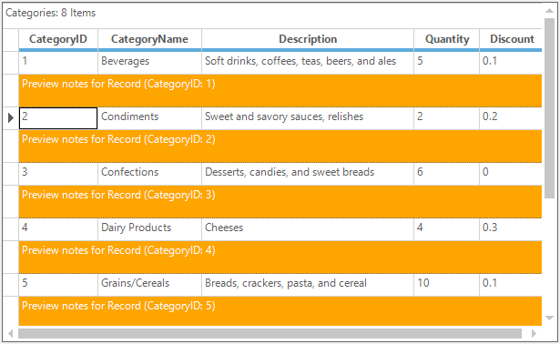
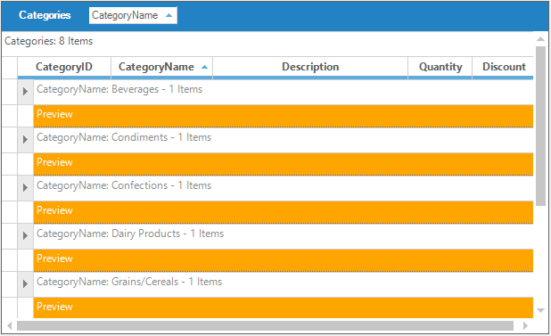

# Preview Rows in Windows Forms GridGrouping control
Preview rows are the one which are used to show the additional description for the groups or records. GridGroupingControl provides following types of preview rows,
 
* [Record preview row](#record-preview-row)
* [Group preview row](#group-preview-row)
* [Group header/footer](#group-headerfooter)

## Record preview row
The record preview row is used to display additional information about the particular record. 

### Adding record preview row
The record preview row can be enabled in the GridGroupingControl by setting the [ShowRecordPreviewRow](https://help.syncfusion.com/cr/windowsforms/Syncfusion.Windows.Forms.Grid.Grouping.GridTableOptionsStyleInfo.html#Syncfusion_Windows_Forms_Grid_Grouping_GridTableOptionsStyleInfo_ShowRecordPreviewRow) property to `true`.


//Enable record preview row 
this.gridGroupingControl1.TableOptions.ShowRecordPreviewRow = true;

//Changing the appearance of the record preview cells
this.gridGroupingControl1.Appearance.RecordPreviewCell.BackColor = Color.Orange;
this.gridGroupingControl1.Appearance.RecordPreviewCell.TextColor = Color.White;


'Enable record preview row 
Me.gridGroupingControl1.TableOptions.ShowRecordPreviewRow = True

'Changing the appearance of the record preview cells
Me.gridGroupingControl1.Appearance.RecordPreviewCell.BackColor = Color.Orange
Me.gridGroupingControl1.Appearance.RecordPreviewCell.TextColor = Color.White



### Customizing the text for record preview row
The record preview row text can be customized by using the [QueryCellStyleInfo](https://help.syncfusion.com/cr/windowsforms/Syncfusion.Windows.Forms.Grid.Grouping.GridGroupingControl.html) event. In this event, set the cell value of the [RecordPreviewCell](https://help.syncfusion.com/cr/windowsforms/Syncfusion.Windows.Forms.Grid.Grouping.GridTableCellAppearance.html#Syncfusion_Windows_Forms_Grid_Grouping_GridTableCellAppearance_RecordPreviewCell) that need to be displayed in the record preview section.


this.gridGroupingControl1.QueryCellStyleInfo += new GridTableCellStyleInfoEventHandler(gridGroupingControl1_QueryCellStyleInfo);

void gridGroupingControl1_QueryCellStyleInfo(object sender, GridTableCellStyleInfoEventArgs e)
{

   if(e.TableCellIdentity.TableCellType == GridTableCellType.RecordPreviewCell)
   {
       Element el = e.TableCellIdentity.DisplayElement;
       e.Style.CellValue = "Preview notes for Record (" 
           + el.ParentTableDescriptor.Fields[0].Name + ": " 
           + el.ParentRecord.GetValue(el.ParentTableDescriptor.Fields[0].Name) + ")";
   }
}      


AddHandler gridGroupingControl1.QueryCellStyleInfo, AddressOf gridGroupingControl1_QueryCellStyleInfo

Private Sub gridGroupingControl1_QueryCellStyleInfo(ByVal sender As Object, ByVal e As GridTableCellStyleInfoEventArgs)

   If e.TableCellIdentity.TableCellType = GridTableCellType.RecordPreviewCell Then
	   Dim el As Element = e.TableCellIdentity.DisplayElement
	   e.Style.CellValue = "Preview notes for Record (" & el.ParentTableDescriptor.Fields(0).Name & ": " & el.ParentRecord.GetValue(el.ParentTableDescriptor.Fields(0).Name) & ")"
   End If
End Sub




### Changing the height of the record preview row
The height of the record preview row can be changed by using the [RecordPreviewRowHeight](https://help.syncfusion.com/cr/windowsforms/Syncfusion.Windows.Forms.Grid.Grouping.GridTableOptionsStyleInfo.html#Syncfusion_Windows_Forms_Grid_Grouping_GridTableOptionsStyleInfo_RecordPreviewRowHeight) property.


//Set the height for record preview section
this.gridGroupingControl1.TableOptions.RecordPreviewRowHeight = 20;

//Changing the appearance of the record preview cells
this.gridGroupingControl1.Appearance.RecordPreviewCell.BackColor = Color.Orange;
this.gridGroupingControl1.Appearance.RecordPreviewCell.TextColor = Color.White;


'Set the height for record preview section
Me.gridGroupingControl1.TableOptions.RecordPreviewRowHeight = 20

'Changing the appearance of the record preview cells
Me.gridGroupingControl1.Appearance.RecordPreviewCell.BackColor = Color.Orange
Me.gridGroupingControl1.Appearance.RecordPreviewCell.TextColor = Color.White



The following sample shows the customization of the record preview row appearance,
&lt;InstalledLocation&gt;\Windows\Grid.Grouping.Windows\Samples\Layout Customization\Record Customization Demo

## Group preview row
The groups can show the additional information in the group preview section. 

### Adding group preview rows
Group preview section is the suitable place to display memo fields or add custom notes for a given group. It can be enabled by setting [GroupOptions.ShowGroupPreview](https://help.syncfusion.com/cr/windowsforms/Syncfusion.Windows.Forms.Grid.Grouping.GridGroupOptionsStyleInfo.html#Syncfusion_Windows_Forms_Grid_Grouping_GridGroupOptionsStyleInfo_ShowGroupPreview) property to `true`. 


//Enable preview row for Groups
this.gridGroupingControl1.ChildGroupOptions.ShowGroupPreview = true;

//Changing the appearance of the group preview cells
this.gridGroupingControl1.Appearance.GroupPreviewCell.BackColor = Color.Orange;
this.gridGroupingControl1.Appearance.GroupPreviewCell.TextColor = Color.White;


'Enable preview row for Groups
Me.gridGroupingControl1.ChildGroupOptions.ShowGroupPreview = True

'Changing the appearance of the group preview cells
Me.gridGroupingControl1.Appearance.GroupPreviewCell.BackColor = Color.Orange
Me.gridGroupingControl1.Appearance.GroupPreviewCell.TextColor = Color.White



### Customizing the text for group preview row
The default text displayed in the group preview row can be customized by using the [QueryCellStyleInfo](https://help.syncfusion.com/cr/windowsforms/Syncfusion.Windows.Forms.Grid.Grouping.GridGroupingControl.html) event.


this.gridGroupingControl1.QueryCellStyleInfo += new GridTableCellStyleInfoEventHandler(gridGroupingControl1_QueryCellStyleInfo);

void gridGroupingControl1_QueryCellStyleInfo(object sender, GridTableCellStyleInfoEventArgs e)
{

    if (e.TableCellIdentity.TableCellType == GridTableCellType.GroupPreviewCell)
    {
        Element el = e.TableCellIdentity.DisplayElement;
        e.Style.CellValue = "Preview notes for Group (" + el.ParentGroup.Name + ": " + el.ParentGroup.Category.ToString() + ")";
    }
}  


AddHandler gridGroupingControl1.QueryCellStyleInfo, AddressOf gridGroupingControl1_QueryCellStyleInfo

Private Sub gridGroupingControl1_QueryCellStyleInfo(ByVal sender As Object, ByVal e As GridTableCellStyleInfoEventArgs)

	If e.TableCellIdentity.TableCellType = GridTableCellType.GroupPreviewCell Then
		Dim el As Element = e.TableCellIdentity.DisplayElement
		e.Style.CellValue = "Preview notes for Group (" & el.ParentGroup.Name & ": " & el.ParentGroup.Category.ToString() & ")"
	End If
End Sub



### Changing the height of the group preview
The size of the preview rows can be changed by using the [TableOptions.GroupPreviewSectionHeight](https://help.syncfusion.com/cr/windowsforms/Syncfusion.Windows.Forms.Grid.Grouping.GridTableOptionsStyleInfo.html#Syncfusion_Windows_Forms_Grid_Grouping_GridTableOptionsStyleInfo_GroupPreviewSectionHeight) property.


//Set the height for Group preview section
this.gridGroupingControl1.TableOptions.GroupPreviewSectionHeight = 25;

//Changing the appearance of the group preview cells
this.gridGroupingControl1.Appearance.GroupPreviewCell.BackColor = Color.Orange;
this.gridGroupingControl1.Appearance.GroupPreviewCell.TextColor = Color.White;


'Set the height for Group preview section
Me.gridGroupingControl1.TableOptions.GroupPreviewSectionHeight = 25

'Changing the appearance of the group preview cells
Me.gridGroupingControl1.Appearance.GroupPreviewCell.BackColor = Color.Orange
Me.gridGroupingControl1.Appearance.GroupPreviewCell.TextColor = Color.White



## Group header/footer
The group header/group footer sections can be added to the top and bottom of the groups. This can be used to show the additional information about the groups like the group preview rows.

To know more about group header/footer section, refer the following link,
[https://help.syncfusion.com/windowsforms/gridgrouping/grouping#group-headersfooters](https://help.syncfusion.com/windowsforms/gridgrouping/grouping#group-headersfooters) 
